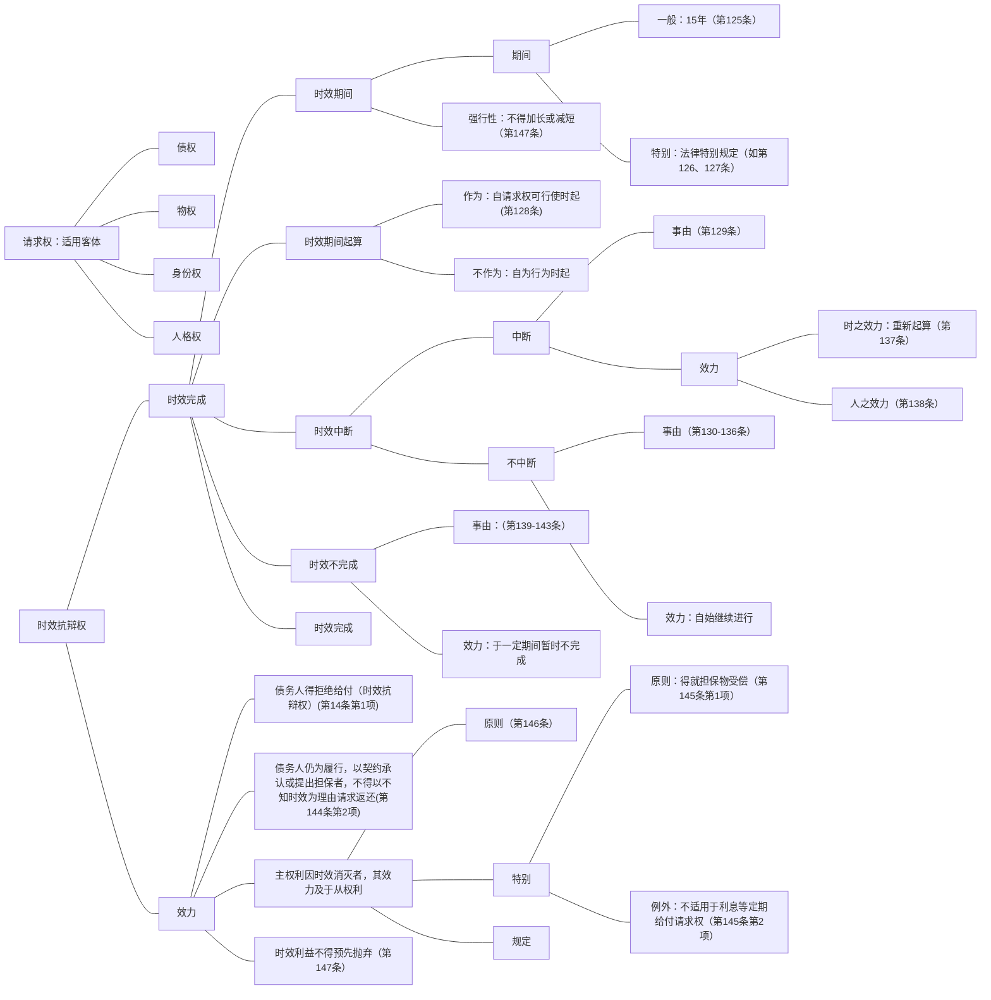

```mermaid
flowchart LR
1["请求权：适用客体"]
2[债权]
3[物权]
4[身份权]
5[人格权]
1---2 & 3 & 4 & 5
6[时效抗辩权]
7[时效完成]
8[效力]
6---7 & 8
9[时效期间]
10[时效期间起算]
11[时效中断]
12[时效不完成]
13[时效完成]
7---9 & 10 & 11 & 12 & 13
14[期间]
15["强行性：不得加长或减短（第147条）"]
9---14 & 15
16["一般：15年（第125条）"]
17["特别：法律特别规定（如第126、127条）"]
14---16 & 17
18["作为：自请求权可行使时起(第128条)"]
19["不作为：自为行为时起"]
10---18 & 19
20[中断]
21[不中断]
11---20 & 21
22["事由（第129条）"]
23[效力]
20---22 & 23
24["时之效力：重新起算（第137条）"]
25["人之效力（第138条）"]
23---24 & 25
26["事由（第130-136条）"]
27["效力：自始继续进行"]
21---26 & 27
28["事由：（第139-143条）"]
29["效力：于一定期间暂时不完成"]
12---28 & 29
30["债务人得拒绝给付（时效抗辩权）(第14条第1项)"]
31["债务人仍为履行，以契约承认或提出担保者，不得以不知时效为理由请求返还(第144条第2项)"]
32["主权利因时效消灭者，其效力及于从权利"]
33["时效利益不得预先抛弃（第147条）"]
8---30 & 31 & 32 & 33
34["原则（第146条）"]
35[特别]
36[规定]
32---34 & 35 & 36
37["原则：得就担保物受偿（第145条第1项）"]
38["例外：不适用于利息等定期给付请求权（第145条第2项）"]
35---37 & 38
```