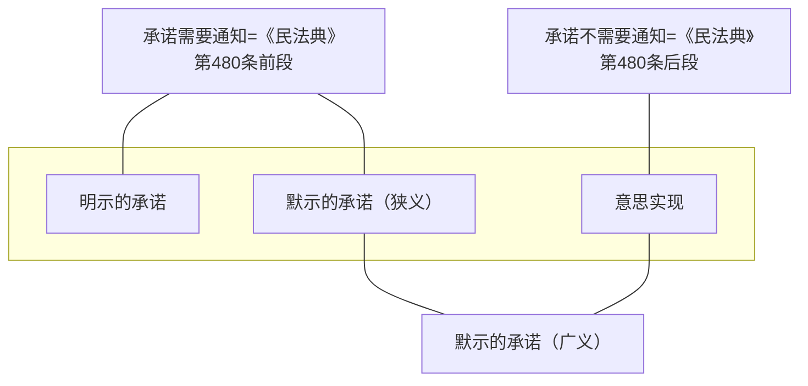

《合同法》第二章“合同的订立”中，主要规定了依要约承诺的方式订立合同，除此之外，还有一些特别的成立合同的方式，包括交叉要约、意思实现以及事实的合同关系。其中，交叉要约欠缺形式上的承诺，意思实现省略了承诺通知，均属简化了的缔约程序，并不妨碍合同的成立，且尚在意思自治范畴。事实的合同关系则超越了意思自治的范畴，依事实过程即认有合同关系的成立，与前两者有显著的差异。
# 一、交叉要约
## （一）语义
交叉要约（cross—offers），指合同当事人采取非直接对话的方式，相互提出两个独立但内容一致的意思表示。交叉要约一般发生在异地之间且要约时间几乎为同时的场合。如甲向乙发出以一定价格购买其房屋的要约，该要约尚未到达乙时，乙恰巧也向甲发出以相同价格出售该房屋的要约。虽然两个要约内容一致，但后一要约尚不得视为对前一要约的承诺。

交叉要约的发生，在实务中颇为少见。不过，该问题在法学理论上仍值得思考和分析。
## （二）效力
交叉要约是否成立合同，各国规则不一。[^1]我国法律并没有规定，就此学说上有肯定说与否定说，以肯定说为当。从理论上说，这种场合不仅有两个意思表示在客观上的合致，而且也有主观上的合致。认定合同的成立，不仅可因应交易的需要，而且符合当事人的意思。交叉要约每每发生于反复且迅速地进行的定型化交易（主要是商事交易），自实务的便利而言，实有承认其效力的必要。由于后一要约并非前一要约的承诺，因而，交叉要约成立合同属于依要约承诺成立合同的例外。

[^1]:比如，在英国普通法上，交叉要约并不能够成立合同，因为“交叉要约并非相互的承诺”，此一规则的道理在于确保确定性。See G．H．Treitel，The Law of Contract35（10^th ed．，1999）．中文资料可参见杨桢：《英美契约法论》，北京大学出版社2000年修订版，第44页。在美国法上，交叉要约亦不成立合同。尽管每个允诺人都在寻找对方的允诺以与自己的交换，没有一个是作为与对方允诺的交换而作出其允诺的，因而，没有一个允诺是被交换的，故没有一个能够被作为另一个的对价，也就没有一个有对价的支撑，也就没有合同。SeeE.Allan Famsworth,Contracts68(4^th ed.,2004).

根据交叉要约成立合同，合同成立的时间仍然是一个问题。由于后一要约并非承诺，学说上认为应当解释为两个意思表示到达时合同成立。两个意思表示若非同时到达，则合同成立的时间以后一要约到达的时间为准。

>**同时表示**
在当事人采用直接对话的式，在时间上无先后之分，同时作出内容相同的意思表示的情形，亦属有之，称为同时表示。同时表示在法律上的效力与交叉要约相同，也产生合同成立的效果。同时表示是一种有别于要约承诺的订约方式。
# 二、意思实现
## （一）语义
意思实现，系德语Willensbetätigung的移译，日语中亦称“意思実現”。《德国民法典》第151条（无须向要约人表示的承诺）对此作了规定，“根据交易习惯，承诺无需向要约人表示，或者要约人预先声明无需表示的，即使没有向要约人表示承诺，承诺一经作出，合同即告成立。应根据要约或者当时情况可以推知的要约人的意思，来确定要约约束力消灭的时间。”依德国学者通说见解，在《德国民法典》第151条中，承诺的意思必须通过某种方式表达出来，亦即必须使该意思显示于外部，但受要约人无须针对要约人表达或显示其承诺意思，承诺意思也无须到达要约人那里。

《德国民法典》的这一规定亦影响到《日本民法典》[^2]和我国台湾地区“民法”，[^3]其相应的民法文献，称此种规定为“意思实现”。

[^2]:《日本民法典》第526条（契约成立时期）：（一）隔地人间的契约，于发承诺通知时成立。（二）依要约人的意思表示或交易上的习惯，不需承诺通知时，则契约于已有可认为是承诺意思表示的事实时成立。
[^3]:我国台湾地区“民法”[[../../王泽鉴九阴真经/台湾民法典相关条文/第161条]]（意思实现）：I．依习惯或依其事件之性质，承诺无须通知者，在相当时期内，有可认为承诺之事实时，其契约成立。II.前项规定，于要约人要约当时，预先声明承诺无须通知者，准用之。

意思实现的特征在于：其一，承诺无须通知；其二，受有严格限制，要求是根据交易习惯或者根据要约人预先的声明；其三，合同自出现认定承诺意思的事实或行为时（承诺意思实现时）成立。依学者通常所举事例，比如，客人用电报预订旅店房间，旅店老板将客人的姓名登记入预订客房名单；又如，将要约人实物要约寄来的书籍签名于书页以示所有，均属依意思实现而成立合同。

意思实现所表述的规则在CISG（第18条第3款）、PICC（第2—6条第3款）及PECL（第2：205条第3款）中也是可以见到的。

“意思实现”在《合同法》之前的中国大陆立法中并没有规定，这一概念只是出现在民法著述中。《合同法》第22条肯定了承诺无须通知的情形的存在，第26条第1款规定，承诺不需要通知的，根据交易习惯或者要约的要求作出承诺的行为时生效。自此，意思实现在中国大陆立法中有了根据。

就意思实现的本质，学说颇有分歧。有的认为它并非意思表示；[^4]有的认为它属于一种广义的意思表示；有的认为其本质仍可作为一种意思表示。本书认为，意思实现仍然是一种意思表示。《合同法》条文使用了“承诺不需要通知”字样（第26条第1款），显然将“意思实现”亦作为一类承诺，而“承诺是受要约人同意要约的意思表示”（第21条），由此，自解释论的立场，意思实现至少在我国立法上是一种意思表示。不过，由于“承诺不需要通知”，故这种“承诺”是一种不需要受领的意思表示，有别于作为需要受领的意思表示的“狭义的承诺”，本书以意思实现为“依要约承诺以外的方式成立合同”，指的是有别于依要约和“狭义的承诺”方式成立合同。

[^4]:三宅正男「契約法（総論）」（青林書院，1978年）25頁。三宅教授认为，依意思实现之合同成立，不仅是属于依要约承诺以外的方式成立合同，甚至超出了意思表示合致的框架，只是一种成立合同的便法。因此，对由此发生的合同成立及其效力，法律行为的一般理论并不当然适用，唯在有些场合可以类推适用而已。
## （二）意思实现与默示的承诺
意思实现与默示的承诺，不易区分，以致有的学者以二者所指为相同之事，需要辨明的是：二者是否有所不同？区分是否有意义？

关于默示的承诺与意思实现，学说的分歧大致区分为两类：区别存在说与区别否定说。
### 1.区别存在说
承认意思实现与默示的承诺有区别的学说中，又有如下不同解释：
1. 传统的理解是，承诺是一种意思表示，意思表示可分解为三项要素：效果意思、表示意思与表示行为。而在意思实现场合，由于不存在表示意思（想将承诺的意思向外部表示的意思），因而与意思表示不同，因意思实现的合同成立有别于意思之合致，属独立的合同成立方式。比如，有学者认为，如果行为不是向要约人作出的，如宾馆依要约而保留房间的行为，属于意思实现；而行为是向要约人作出的场合，如订货的发送，属于默示的承诺。
2. 认为表示意思并非意思表示的要素之一，因而，意思实现与承诺的意思表示的差异并非在于表示意思之有无；只是在对于要约人没有作出通知这一点上，与承诺的意思表示有差异。从而，根据要约的要求送货上门的行为，其中含有承诺的意思表示，不属此所谓意思实现。
### 2.区别否定说
关于意思实现的法律性质，学说上有“默示的承诺说”，依照该说，意思实现与依要约承诺成立合同的方式是没有必要区别的。有见解认为默示的承诺与意思实现乃至事实合同关系并非是截然分开的，认为在很多场合它们所指射的是同一的法律关系。[^5]

[^5]:水本浩「契約法」（有斐閱，1995年）27—28頁。余延满先生认为，意思实现并非一种有别于要约与承诺的合同订立方式，只不过承诺有其特殊性而已。参见其著《合同法原论》，武汉大学出版社1999年版，第121页。另外，沈达明与梁仁洁先生认为，所谓默示的意思表示，是指表意人以某种行动或态度所显示的意思。学理称为意思的证实（Willensbetigung）。参见其编著《德意志法上的法律行为》，对外贸易教育出版社1992年版。龙卫球先生亦有相似见解，认为默示的意思表示，又称“意思证明”（Willensbetátigung），指以社会的非习用方法为表达，他人根据具体情况才可推知表达外观意思的情形。参见其著《民法总论》，中国法制出版社2001年版，第508页。

在讨论默示的承诺与意思实现的关系时，首先应对使用的概念作出界定，如果是使用广义的默示的承诺，则无疑意思实现也应当列入其中。如果使用狭义的默示的承诺概念，意思实现则有别于默示的承诺。此处拟在狭义上使用默示的承诺概念。

![[../../../法律法规汇编/民商法/民法典/第三编 合同#^ceulyl|民法典480]]

### 3.区别的实益
意思实现与默示的承诺二者区别的意义在于，以发送订购物品为例，应认为默示的意思表示，必须于物品送达要约人时，合同始告成立。其发送之事实虽已实现而未到达，则不能发生承诺之效力。反之，意思实现则以客观上有可认为承诺之事实存在为必要，有此事实，合同即为成立。在前者场合，在合同成立前，不生价款风险问题；在后者场合，则有价款风险问题，如无特别约定，依《合同法》第145条，标的物交付给第一承运人后，风险由买受人承担。
### 4.二者的差异
默示的承诺属于须经受领的意思表示，作出“承诺的行为”只是默示的承诺的成立，如欲发生承诺的效力，还须关于该“承诺的行为”的通知到达要约人。意思实现则属于无须受领的意思表示，是承诺须经受领原则的例外情形，故于“承诺的行为”作出时生效，合同成立，无须另行作出承诺的通知，亦非于承诺的通知到达时生效。
## （三）构成要件
### 1.根据交易习惯或者要约的要求承诺不需要通知
合同因意思实现而成立，不必通知，对当事人的利益而言至关重要，故须限于特别情事。依《合同法》第26条第1款，其情形有二：其一为根据交易习惯，承诺不需要通知，如宾馆房间内冰箱中的饮料或食品，客人可自由取用，最后统一结算。其二为根据要约的要求，承诺不需要通知，如甲要求乙绘制风景油画五幅，表明将于某日上门取货。
### 2.受要约人作出可以认有承诺的意思表示的行为
所谓“作出承诺的行为”，实即作出可反映承诺意思的行为，大致区分为两类：履行行为与受领行为。此所谓履行行为，即受要约人有履行其合同义务的行为，如前例中乙按要约要求绘制油画的行为；所谓受领行为，即受要约人行使合同权利的行为，如前例中宾馆客人消费冰箱中饮料或食品的行为，又如拆阅现物要约寄来的杂志的行为。

单纯的沉默，除非当事人之间有特别的约定或者符合交易习惯；否则，不可以作为“作出承诺的行为”。即使要约中表示如果不作出承诺与否的通知，即视为承诺，受要约人也没有作出承诺与否的通知的义务，在不为通知之场合，合同也不成立。

>**意思实现与承诺行为人真实意思**
在此种所谓“意思实现”方式缔约场合，应否考虑作出承诺行为人的真实意思呢？一类见解认为，意思实现以客观上有可认为承诺之事实存在为必要，有此事实，合同即成立。至于承诺人是否认识该事实行为为承诺之意思表示，主观上是否有承诺之意思，在所不问，例如，使用要约人送到之物品，虽主观上无为承诺而成立合同的意思，应认为合同成立。另有见解认为，承诺之事实，应以有承诺意思为必要，此就“承诺”之本质而言，应属当然，否则意思将成为事实行为了；相对人主观上无承诺意思，仅依客观上可认为承诺之事实，即可成立合同，使其负担合同上的义务，与私法自治原则似有违背，而且不足以保护相对人利益，此在现物要约最为显然；又相对人为限制行为能力人，无行为能力人或无意思能力人时，是否能仅依客观上可认为承诺的事实，即可成立合同，亦有疑问。提出所谓可认为承诺之事实，应解为系承诺的意思依一定的事实而实现之，不必通知要约人，系承诺意思表示须经受领，始生效力之例外，为德国学说所称“无须受领之意思表示”。

上述两类见解各有侧重，第一类见解侧重于客观方面，注意的是交易的安全、便捷以及交易秩序的稳定；第二类见解追求的是实质的公平与合理。两者均有其合理性，在我国《合同法》的解释适用上，属法政策选择的问题。本书认为，宜采第二类见解，以其配合意思表示瑕疵、撤销制度以及赔偿制度，能够较好地解决问题。
# 三、事实的合同关系
## （一）德国的学说与判例
- “事实的合同关系”(faktischenVertragsverhaltnissen)之概念,是1941年由德国学者豪普特（GünterHaupt）提出的。依豪普特教授的见解，如着眼于新的社会现象，可发现有些合同关系的内容并不能够归结为当事人的合意，而就合同关系的成立而言也存在同样的现象。）在若干情形下，因事实过程而成立的生活关系可以作为合同关系，进而适用合同法的有关规定。这种因事实过程而成立的合同关系，称为“事实的合同关系”，其特点在于，其成立的要件事实并非要求当事人的合意（在有些场合当事人甚至有完全相反的意思），而是另有其独特的要件事实。对于事实的合同关系，难以归纳出统一的法律构成要件，豪普特教授将其类型化为以下三种：
	- 第一类，是基于社会接触而产生的事实的合同关系，包括缔约上过失责任、司机对好意同乘人的责任、使用借贷期满后在标的物返还前的利用关系；
	- 第二类，是基于团体关系而产生的事实的合同关系，其典型为事实上的合伙或公司（合伙合同或公司设立行为无效或被撤销场合）、事实上的劳动关系或雇佣关系（劳动合同无效或被撤销场合）；
	- 第三类，是基于社会给付义务而产生的事实的合同关系，其典型为公用交通（电车、公共汽车等）的利用关系、供给电、气、水的法律关系等，拉伦茨教授称为因社会类型行为发生的债之关系。

此理论一经提出，便在德国法学上产生空前的震动，引起激烈的争论。[^6]在一个相当长的时期内，就此理论在德国没有定论。[^7]

[^6]:王泽鉴教授关于事实的合同关系专门作有介绍，参见王泽鉴：《民法学说与判例研究》（第1册第12版），台北自版1991年版，这篇论文到目前为止，关于这一问题，在中文资料中仍是最全面、最翔实的。
[^7]:Haupt教授于1941年1月29日在德国莱比锡大学作的教授就任公开演讲，提出事实的合同关系理论，但遗憾的是，他在战后1946年去世，这一理论的进一步发展则是依靠其他学者，其中一位非常关键的人物是拉伦茨教授。Vgl.Karl Larenz，Die Begründung von Schuldverhältnissen durch Sozialtypisches Verhalten，[1956] NJW 1897.

事实的合同关系理论后来被德国联邦法院在“停车场事件”的判决（Hamburger Parkplatz—Fall，1956年7月14日）中采用，在此后，又曾作出若干采用事实的合同关系理论的判决。时至今日，德国学理虽有所谓“欠缺意思表示的法律行为"(Rechtsgeschaft ohne Willenserklarung)之概念,但在德国,甚至包括拉伦茨本人，已放弃该理论。，不过，该理论在瑞士的学理中受到接纳，甚至1984年出现在了瑞士联邦法院的判决中。
## （二）对“事实的合同关系”的若干分析和提示
事实的合同关系理论与私法自治原则、法律行为论上的意思理论、信赖理论、格式条款理论等私法的基本问题有着密切的关联，且深受不当得利、侵权行为、无因管理等制度的影响，在德国尚无定论；在日本，学说对于应否引人该理论也是见仁见智，议论不一。在我国法上，是否应当引入该理论，宜慎重检讨。

依事实的合同关系理论，合同关系（而非合同）可不基于当事人的合意成立，这一理论的提出，打破了当时“意思理论”一统天下的局面，可谓现代合同法理论发展的一个重要里程碑，与之堪称伯仲者，为美国合同法学说上的“关系理论”。

在现代社会中，近代法所赋予私法主体的平等、自由等基本属性已有很大改观，格式合同的大量使用、交易能力不平等和某些行业垄断的存在，成为不争的事实，个人意思的实际射程与传统理论中的理想模型已有相当差距，由此引发一些现实问题，仍按传统“意思理论”，只能作拟制的解释，必然具有相当不自然的缺陷，甚至有些现象根本无法依意思理论作出解释（典型的是德国的停车场案），面对这种意思理论解释乏力的现实，按照“事实的合同关系”理论，的确可以比较灵活地解决这些新的现实问题。

我国固有的法律框架并没有接纳“事实的合同关系”，而是按照侵权行为、不当得利、无因管理、缔约上过失等制度解决问题，如“窃电”现象，可按照侵权行为法的规则处理；构成犯罪的，还可以按照刑法追究刑事责任，不一定非按事实的合同关系理论处理。虽然如此，但也应当看到，在有些场合，借鉴事实的合同关系理论效果会更好。比如，未成年人无票乘车，按事实的合同关系处理，即可比较好地处理问题。在法院判决中，也遇到了事实合同关系问题。比如，“（2000）通江民初字第206号”判决书载：“本院认为：原告通江农行与被告杜锐虽在1993年至辞退时未再签订劳动用工合同，但事实上仍形成了劳动用工关系。原告未为被告办理养老保险及失业保险，与《劳动法》规定相悖，理应承担责任，并依法给予杜锐以经济补偿。”

默示的意思表示、意思实现、事实的合同关系三者之间，是一种什么关系，还有待将来作进一步的研究。或以“在我国，事实缔约是个普遍现象”，如果我们注意区分事实的合同关系与默示的意思表示，恐怕就不会这样认识了。
___