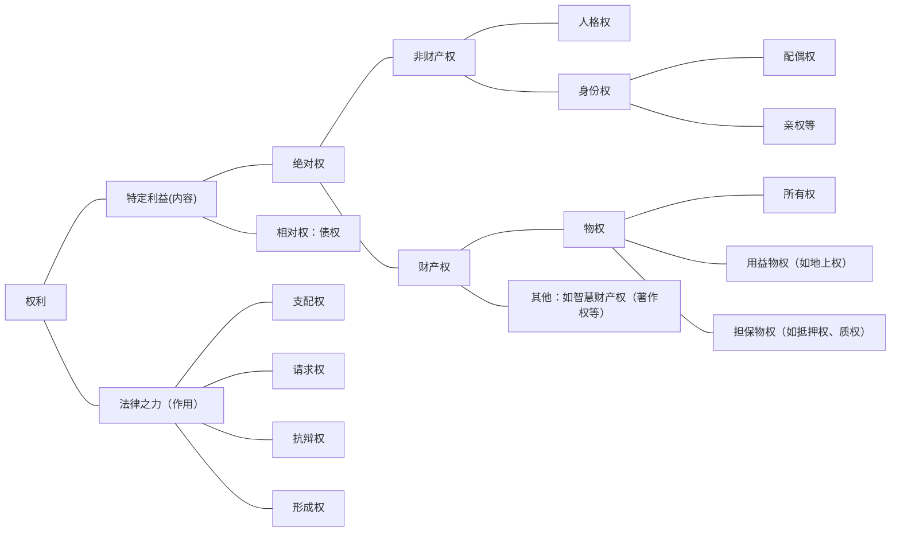

- 试就下列三例，说明何谓权利、权利的功能及当事人间的法律关系： ^5owpj7
	1. 甲受雇于乙，向丙购A屋，受让其所有权后设定抵押权予丁，丁的债权届期未获受偿。
	2. 老妪某甲，偕其心爱小狗，散步于陋巷，乙驾机车蛇行，撞伤甲，轧死小狗。
	3. 少女某甲14岁，乙以结婚为饵，诱其离家在外同居，甲父丙耗费2万元寻找。
# 一、权利的概念
- 德国著名法学家Andreasv.Tuhr氏曾谓：“权利系私法的中心概念，且为多样性法律生活的最终抽象化。”鉴于权利的重要性，德国学者自19世纪以来，致力于探究权利的本质。[^1]萨维尼（Savigny）及文德赛（Winds-cheid）两位伟大法学家首先提出了意思力（Willensmacht）或意思支配（Willensmacht）说，认为权利系为个人意思自由活动或个人意思所能支配的范围。耶林氏（Jhering）继而强调此项意思力的赋予旨在满足特定的利益，认为权利系法律所保护的利益（利益说）。其后学者结合此两项观点，肯定权利乃享受特定利益的法律之力，为现今的通说。兹就债权及物权加以说明：
	1. 债权系请求特定人为特定给付（作为、不作为）的权利。所谓“特定人为特定给付”，即系债权的特定利益，“请求”云者，乃债权的“法律之力”。例如承租人得向出租人请求交付租赁物供其使用收益，出租人得向承租人请求支付租金（第421条）。
	2. 物权系直接支配其标的物，而享受其利益之具有排他性的权利。所谓“支配其标的物而受其利益”，即系物权的特定利益；“直接支配，具有排他性”云者，乃物权的法律之力。例如物之所有人于法令限制之范围内得自由使用收益处分其所有物，并排除他人之干涉（第765条）。地上权人得以在他人土地上有建筑物或其他工作物，为目的而使用其土地（第832条）。

[^1]:HelmutCoing，ZurGeschichtedesPrivatrechtssystems（Frankfurt/M.1962），S.29ff.；Wolf/Neuner，ATS，213ff
# 二、权利的机能
权利一语，系外国法律名词的迻译[^2]在英语称为right，在德语称为Recht。无论right或Recht均含蕴合理的意涵，乃指正当而得有所主张而言，并非“争权夺利”。[^3]

人群共处，各有需求，涉及不同的利益，不免发生冲突，为维护社会生活，自须定其分际，法律乃于一定要件之下，就其认为合理正当的，赋予个人某种力量，以享受其利益。权利的功能在于保障个人的自由范围，使其得自主决定、组织或形成其社会生活，尤其是实践私法自治原则。权利为主观化的法律（subjektivesRecht），法律为客观化的权利（objektivesRecht），行使权利乃为法律而奋斗，寓有伦理的意义。[^4]

[^2]:参见梅仲协：《民法要义》，第23页谓：按现代法律学上所谓权利一语，系欧陆学者所创设，日本从而迻译之。清季变法，权利二字，复自东瀛，输入中土，数十年来，习为口头禅。稽考典籍，权与利二字连用，殊罕其例，唯于桓宽铁盐论篇：“或尚仁义，或务权利”，荀悦论游行：“连党类，立虚鉴，以为权利者，谓之游行”，偶一见之，而其含义鄙陋，大率为士大夫所不取。台湾地区固有之法律思想，素以义务为本位，未闻有所谓权利其物者。
[^3]:香港大学法学院院长陈弘毅氏惠赠《法治、启蒙与现代法的精神》，中国政法大学出版社1996年版，论及“权利”概念及用语，可资参照（第27页以下、第118页以下）。
[^4]:RudolfvonJhering，DerKampfumdasRecht（23.Aufl.，Wien1946），此为在维也纳大学讲稿，参见萨孟武译：《为法律而斗争》，本书第一章第一节。耶林氏著作等身，尚有两本影响深远的著作：DerZweckimRecht（5.Aufl.，Leipzig1916）；
GeistdesromischenRechts，3Teile（NachdruckAalen1968）。作者在台大肆业期间，曾略读这三本书，尤其是为学习德文，对照英译本而读前两本书。
# 三、权利的分类及体系
- 权利，可以依各种不同的观点加以分类，组成体系，以认识各种权利的特征、区别及关联。兹分四类简要说明如下：
	1. 权利以其效力所及的范围为标准，可分为绝对权及相对权。绝对权指对于一般人请求不作为的权利，如人格权、身份权、物权等。有此权利者，得请求一般人不得侵害其权利，故又称对世权。相对权指对于特定人请求其为一定行为的权利，如债权。有此权利者，不仅得请求特定人不得侵害其权利，并得请求其为该权利内容的行为，故又称为对人权。
	2. 权利以其标的物为标准，可分为非财产权及财产权。前者指与权利主体的人格、身份有不可分离关系的权利，包括人格权与身份权。后者指具有经济利益的权利，可再分为债权、物权及无体财产权（智慧财产权：著作权、商标权、专利权）。
	3. 权利以其作用为标准，可分为支配权、请求权、抗辩权及形成权。
	4. 权利以其成立全部要件已否具备，可分为既得权与期待权。

为期醒目，将各种权利图示如下：

- 关于上揭权利体系，应注意者有四：
	1. 前述分类并非毫无争论，例如，关于绝对权与相对权的区别，系传统的分类，亦有学者质疑此项分类的合理性。
	2. 上述分类系采“各种不同标准”，从而同一权利得归属于数类，例如，所有权系属绝对权、财产权、支配权、既得权，于遭受不法侵害时，尚会发生物上请求权（第767条）或债权（第184条第1项前段）。
	3. 有的权利类型是在法律发展过程中逐渐形成而被发现的（如形成权）。有的系因新的交易形态（附条件买卖）而受到特别重视（如期待权）。权利是一个具有发展性的概念，某种利益具有加以保护的必要时，得经由立法或判例学说赋予法律之力，使其成为权利。
	4. 若干权利因社会变迁及法律发展而调整其内容，如父母对未成年子女的保护教养权及惩戒权（亲权），传统上认为系对子女的支配权。然子女亦为权利主体，非属他方可任意支配的客体，故子女有要求父母尊重其人格，发展其人格的权利。亲权的行使，非为权利人的利益，系以促进未成年人利益为目的，故又称为义务权（Pflicht-recht）。配偶间的关系亦由“夫权”发展成为一种“互相协力保持其共同生活之圆满及幸福”的权利。人格权亦因保护的必要而逐渐具体形成各种新的特别人格利益（如隐私权）。
# 四、例题解说
- 权利为民法的核心概念，学习民法的入门，首须能够于具体的案例中，认定一定法律关系中的各种权利，兹就[[第二节 权利的概念、功能及体系#^5owpj7|前举例题]]（阅读之）加以说明：
	1. 甲受雇于乙，成立雇佣契约（第482条），为债之关系的一种，乙得请求甲服约定的劳务（债权）；甲得请求乙支付报酬（债权）。甲向丙购买 A 屋，发生买卖契约之债的关系，甲得向丙请求交付其屋，并移转其所有权（债权，第348条）。甲自丙受让 A 屋所有权（物权），设定抵押权予丁（物权，第860条）而发生物权关系。丁的债权已届清偿期未获清偿时，丁得声请法院拍卖抵押物，就其卖得价金而受清偿（第873条）。
	2. 乙在陋巷驾车蛇行，撞伤老妪某甲，系因过失不法侵害甲的人格权（身体权及健康权）。甲得依民法第184条第 1 项前段规定，向乙请求损害赔偿（债权）。乙轧死甲的小狗，系侵害甲的所有权（物权），甲得依“民法”第184条第 1 项前段规定，请求损害赔偿（债权）。
	3. 乙男以结婚为饵，诱14岁的甲女同居，系故意不法侵害甲的人格权（身体、名誉、贞操），甲得向乙请求损害赔偿（债权）（第184条第 1 项前段），包括财产上损害及非财产上损害的相当金额（慰抚金）（第195条第 1 项）在此情形，乙并侵害丙对其未成年子女甲的监护权；此种监护权，系基于亲子关系而发生，以保护、教养为内容，为身份权的一种，并具支配权的性质，于其遭受他人不法侵害时，丙得依侵权行为规定请求损害赔偿（债权、第184条第 1 项、第195条第 3 项）。又丙并得向乙请求送回其略诱的甲女（基于亲权而生的请求权）。