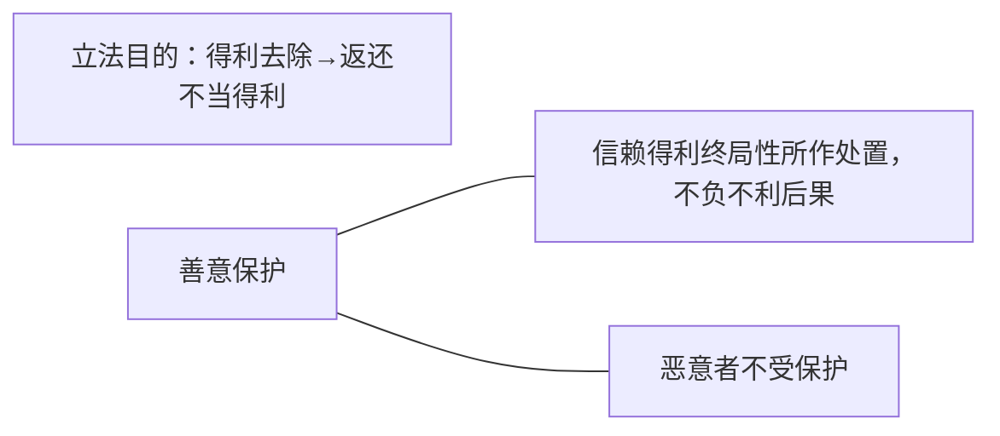

>接下去讲到一个核心的问题，善意恶意的认定以及它的法效果。
第九百八十六条 得利人不知道且不应当知道取得的利益没有法律根据，取得的利益已经不存在的，不承担返还该利益的义务。
第九百八十七条 得利人知道或者应当知道取得的利益没有法律根据的，受损失的人可以请求得利人返还其取得的利益并依法赔偿损失。
善意+取得的利益已不存在→可主张得利灭失抗辩（[[../../../../法律法规汇编/民商法/民法典/第三编 合同#^auj897|986]]）
非善意→无条件得利返还义务+损害赔偿（[[../../../../法律法规汇编/民商法/民法典/第三编 合同#^gyjhyj|987]]）

也就是按照§986、§987可以看到，§986如果他是善意的，那么取得的利益不存在的范围内不需要再还这个不再存在的利益了。善意的保护就是有多少还多少，以现存利益为限。按照§987，如果是恶意的，那么这个非善意的，这个时候原来得到多少，就要全部还多少。原来的到是100，哪怕现在只有10，还是要还100，而且可能还要存在债务不履行的责任：“依法赔偿损失”。再说一遍：原来得到的是100，现在只有10了，如果得利人是善意的，只需要还10，如果得利人是恶意的，要还100，而且就晚还的还要承担迟延等债务不履行的责任的损害赔偿。这是两个条文的差别。所以呢，善意恶意的认定就很重要，得利灭失的抗辩的正当性就很重要。
## （一）得利灭失抗辩的正当性

