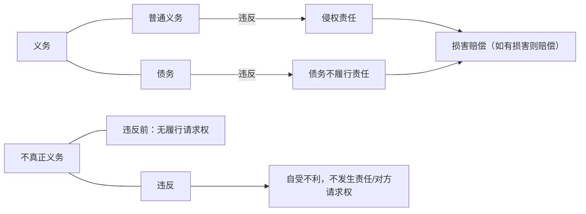
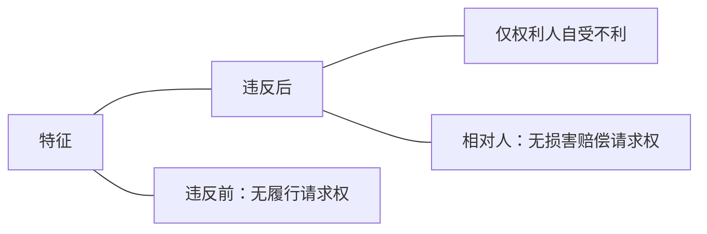
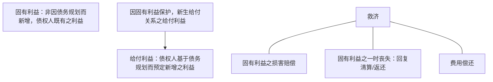
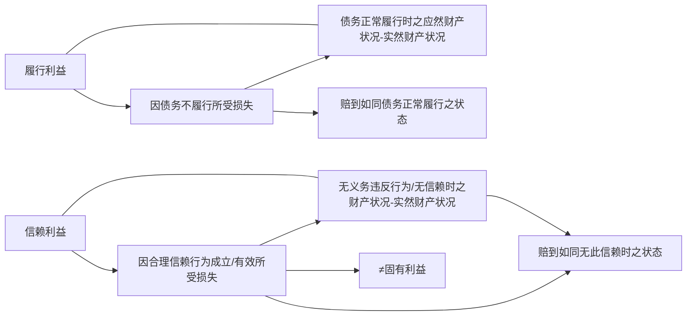

最常见的其实就是债法的问题，债法里面最常见的合同、侵权最为常见，这也是目前发生大案件里面受案量最大的数量。而债法总论是一切债的总括的规则，当然是非常重要的。把握所有债共同的规则便于掌握所有债的共同规则。 ^zhu98t

第一章债的概述。第一部分我们来复习并深化民法总论中提到的内容。那就是普通义务、债务和不真正义务的区别，这个区别是我们整个学期债法入手就要掌握的内容，非常重要。

首先，义务和不真正债务这两种现象要能够准确的区分开来：
# 一、义务与不真正义务：强度不同

^y4ggtt

- 我们先看义务，义务有两种，待会儿会详细的讲，第一种叫普通的义务，另外一种叫债务。普通的义务和债务有什么区别？——债务的强度比普通义务要强，它的构造也和普通义务不一样；而普通的义务就没有债务那样的强度。我们来句一个普通义务的例子：
	- 某 A 非常着急，到超市去买东西， 不小心撞到 B，把 B 的手机撞到地上，摔坏了。A要不要对 B 的损害负责？——要负责。要负责肯定意味着违反义务才负责，他违反的是什么义务呢？——这种普通的义务。这种普通义务就是所有人对所有人都负有对义务：不准伤害他人的义务。所以，普通的义务对准所有人对所有其他人都负有不伤害的义务。我们也可以用简要的方法来称为“路人之间的义务”，路人之间就有的义务。而 A 显然未遵守这样的义务，违反的结果是什么？——侵权责任。
	- 某甲开车，把某乙撞到了，违反的是什么？——甲和乙之间没有基础关系，【违反的是】路人之间就有的义务。凡是侵权，都是这种路人之间的义务的违反，他就可能会导致侵权责任。当然，在侵权责任里面也有可能部分的义务跟完整的路人不一样，但是它没有强到债务的程度，所以还是属于普通义务。
	- 比方说学校对学生受伤害，是不是有可能要承担一个责任？——这个责任当然是有限制的，看学校有没有过错，但是学校和学生是不是路人？——不是路人，但是这种关系也没有强大到我们所说的债务的程度。所以呢，普通义务违反之后产生的侵权责任都叫普通义务。
- 第二种义务的违反，叫债务。它的违反叫债务不履行责任，最典型的是合同债务的违反，那就叫违约责任。举个例子：A 把一个东西卖给 B，约定好 5 月 1 号交货，结果 A 没有交，问，A 的行为违反什么样的义务？——违法了债务。为什么是债务啊？——合同产生的就是债务。那么，这个债务的违反，叫债务不履行，这里违反的是合同债务还是其他债务呢？——合同债务，所以叫违约责任。违约责任是债务不履行责任的一种。
	- 再举个例子来说，A 来无因管理，A 看到 B 躺在地上昏迷了，A 来救助 B，A 自己觉得自己的医术很高，会画符，在那里对着 B 画符，结果 B 的伤更重了。A 是不是没有法律上的义务来管理 B 的事物啊？——完全没有这个管理义务。但是这个管理方法好不好？[^1]——不好，所以 A 又违反自己的义务。本来 A 不去管 B 的事，AB 两个就是路人，A 只要不伤害 B，没有责任。但 A 一旦管了 B 的事，AB 之间变成了无因管理的债务。无因管理的债务要像正常人那样尽到善良管理人的义务，A 的管理方法超出了理性人的认识，所以，A 负无因管理债务不履行责任。这里呢，违反的就不再是义务了，管了事务之后就变成债务了。这个债务一旦不履行，就叫债务不履行，无因管理债务不履行。
- 但是，无论是义务还是债务，它违反之后产生的结果是什么？——都会产生责任。这个责任通常都会体现为损害赔偿责任，如果有损害，就要赔钱。没有损害，当然不符合损害赔偿请求权的要件，所以不赔；有损害就要赔。这是义务的特点，下面一种就不大一样了，叫不真正义务。

[^1]: 区分管理事务的承担跟管理事务的方法，二者是两个层面的东西。参见王泽鉴。

>**比较：三种不同强度的“应当”**
>![[../../../../法律法规汇编/民商法/民法典/第七编 侵权责任#^81y2sk|民法典1125]]
>![[../../../../法律法规汇编/民商法/民法典/第三编 合同#^phrylo|民法典509I、II]]
>![[../../../../法律法规汇编/民商法/民法典/第三编 合同#^4nm1qh|民法典621I]]

不真正义务有什么特点？

三种不同强度的“应当”，在前面都可以得到不同程度的映证。第一个，[[../../../../法律法规汇编/民商法/民法典/第七编 侵权责任#^81y2sk|§1251]]的“应当”是不是义务啊？违反导致什么责任？饲养动物是不是属于路人之间的关系啊？——A 养动物的，B 是邻居或者是路过的人/都在一个小区的人，这是不是路人之间的关系啊？——所以呢，民法典规定了，违反这个义务产生什么责任？——我们看[[../../../../法律法规汇编/民商法/民法典/第七编 侵权责任#^f5vmpr|§1245]]，会产生饲养动物损害的责任（侵权责任），所以这是一个普通的义务。再接下去看，[[../../../../法律法规汇编/民商法/民法典/第三编 合同#^phrylo|§509I、II]]“应当按照约定全面履行自己的义务”，这个条文是在哪一编？——合同编。合同编意味着这个义务规定着什么？普通的义务还是债务？合同的约定意味着什么？——债务。如果没有按照这个约定产生什么责任？——违约责任。无论是侵权责任、违约责任，最最主要的形态是什么？责任内容是什么？——赔钱，叫损害赔偿，这是比较常见的。这两个都是特点，凡是义务，无论是普通义务还是侵权，违法的结果都是给了对方一个请求权，对方请求的内容是什么？——最常见的损害赔偿。

我们再看，[[../../../../法律法规汇编/民商法/民法典/第三编 合同#^4nm1qh|§621I]]，在检验期间的内买受人“应当”通知，这应当规定的是不是很像一个义务啊？——应当就意味着必须要这么做。问题在于，没这么做，这个所谓的义务违反的后果是什么？——违反的后果是，你不通知，“视为”符合约定。A交给B一批货，明明这批货数量/质量比平时下降一半，完全不合约定，但是只要 B 没有在约定的时间内通知 A 这件事情，对不起，A 视为自己的数量是符合约定的，数量完全是可以的/质量完全是合格的，不能在让 A 补交/承担瑕疵担保责任了。所以，这个义务违反的结果是什么？——结果是义务违反了之后，自己遭受的不利（不利是什么？——本来可以要求 A 补偿，本来是可以就已经交付的要求承担瑕疵担保责任，这两个请求权都不可以主张，自己造成的不利），但有没有反过来给对方一个请求权？——不通知 B 对 A 是否有个请求权，现在违反了有没有？——没有。所以，它最大的特点是，违反了只是自己享有的某个权利或者利益消失，但是不会给对方反过来一个请求权，这个叫不真正义务。

正因为这样，不真正义务，A 有没有权利要求 B 履行这个不真正义务啊？说“检验期间告诉我，数量质量一定要告诉我；你不告诉我，我很生气，我起诉到法院”，法律上赋予 A这个权利吗？——不需要。为什么？——B 不履行这个所谓的义务，和 A 的利益有关系吗？——一点都没有关系，不会给 A 带来不利，所以，不会给 A 一个请求权。所以我们看，B 违反义务的全部结果 B 自己倒霉，跟 A 一点关系都没有。法律上不会说，“在 B 违反之前，A有权请求履行通知义务”，没有必要。所以我们讲不真正义务要从这里讲起。正因为违反了之后自作自受，和对方一点关系都没有，所以反过来，对方有没有履行请求权？——没有。

- 接下去来看不真正义务的类型：
	- 过失相抵/与有过失（[[../../../../法律法规汇编/民商法/民法典/第三编 合同#^l8xfni|592II]]、[[../../../../法律法规汇编/民商法/民法典/第七编 侵权责任#^n8zjnu|1173]]）
	- 减损义务（[[../../../../法律法规汇编/民商法/民法典/第三编 合同#^cvf4x7|591I]]、[[../../../../法律法规汇编/民商法/保险法/中华人民共和国保险法#^7rjudy|保57]]）[590I2？]
	- 瑕疵通知/问责义务（[[../../../../法律法规汇编/民商法/民法典/第三编 合同#^4nm1qh|621I]]、[[../../../../法律法规汇编/民商法/民法典配套司法解释/最高人民法院关于审理买卖合同纠纷案件适用法律问题的解释(2021.1.1)#^ugtvgk|买合释14I]]）
	- 受领义务（[[../../../../法律法规汇编/民商法/民法典/第三编 合同#^44f39z|589]]、[[../../../../法律法规汇编/民商法/民法典/第三编 合同#^z22k2x|605]]、[[../../../../法律法规汇编/民商法/民法典/第三编 合同#^v6ykmx|608]]）
	- 其他

过失相抵和与有过失，减损义务实际上是与有过失的一种类型，只是我们国家的法条规定的不一样；下次通知、问责受领还有其他（举证责任）。法条都有，现在解释一下：
## 1.不真正义务：与有过失（含减损义务）
第一个，与有过失：

>**不真正义务：与有过失（含减损义务）**
>![[../../../../法律法规汇编/民商法/民法典/第七编 侵权责任#^n8zjnu|民法典1173]]
>![[../../../../法律法规汇编/民商法/民法典/第三编 合同#^l8xfni|民法典592II]]
>![[../../../../法律法规汇编/民商法/民法典/第三编 合同#^cvf4x7|民法典591I]]
>![[../../../../法律法规汇编/民商法/保险法/中华人民共和国保险法#^7rjudy|保57]]

B 跑到超市去买东西，不小心撞到顾客 C。如果这个顾客本身没有错，完全是 B 的错，那就一方面的过错，这个时候就完全是 B 负责。如果 B 跑得过快，顾客也有问题（顾客在通道上面拿着手机在看，看的专心没注意周边的形式，也没来得及做闪避，正常人都可以稍微让一让都过去了，C 看手机），是不是意味着 C 也有过错？顾客反过来，他自己也跑得很快，两个人撞在一起了，是不是对顾客手机的损害，顾客本身有过错？——这个叫与有过失。顾客受到损害了，造成这个损害的原因是什么？——同学的错。但是 C 自己有没有错？——也有错，顾客叫与有过失，也叫过失相抵。与有过失结果是什么？——因为这个手机的损害，即是 B 造成的，也是部分自己造成的。所以它的结果是，本来这手机本来要陪 5k，由于部分是 C 自己的原因造成的，所以损害赔偿请求权的数字要缩减。假设法官认定下来，20%是自己的原因，80%是 B 的原因。这个时候 C 可以向 B 要多少钱？——本来是 5k，80%是 B 的，赔 4k，剩下的 20%是与有过失导致的过失相抵。违约是一样的。

刚才讲的是在损害的发生过程中，是受害人自己有错。接下去发生没错：B 不小心把 C的手机撞到了地上，C 一看，屏幕碎了，C 想，反正是 B 撞的，所以在人流那么多的地方没有去捡，结果手机被购物车碾过，彻底坏掉了。假设，推购物车的另外一个顾客，他是没有过错的。现在问，本来这个手机只是屏幕碎了，坏了之后最多赔多少钱？——假设是 1k。顾客想，反正手机已经被弄坏了，反正是 A 赔，所以就没管它，没管它就导致完全毁了，手机全损了（全损是 5k），问 B 应该赔多少钱？——就是 B 的错是多少就赔多少，B 的过错就是屏幕碎了，赔 1k。剩下的 4k 怎么判断，是不是 C 自己的过错造成的？自己没有去防止损失的扩大，这叫就损失的扩大是与有过失，而它与有过失的部分是多少？——就是扩大部分的损失。最后过失相抵的结果是什么？——既然是与有过失，就要过失相抵了，把这扩大的损失全部扣掉，最后 B 只需要扣 1k。

所以我们讲呢，与有过失实际上是两个制度，第一个制度是就损害的发生受害人有过失，第二个是就损害的扩大，受害人有过失。无论是损害的发生还是扩大，只要受害人有过失，最后导致的结果是过失相抵，把多出来的份额全部扣掉。

接下去来看违约。违约把损害的发生和损害的扩大分成两个条文来讲了。第一个：[[../../../../法律法规汇编/民商法/民法典/第三编 合同#^l8xfni|民法典592II]]。比方说，比较常见的是在承揽这样的合同，最后造出来的东西不合格，为什么不合格呢？——A 是承揽人，A 的水平不够，造的不好；另一方面，定做人 B 给 A 的设计图纸有问题/或者是定做人提供的材料不好。是不是两方面的合力造成了一个违约的情况？最后交出的这个产品不合格。一方面因为承揽人的水平不好，另一方面，定做人 B 也有原因。这个时候注意一下，A 只就 A 自己的过错部分负责，因为 B 的过错造成的损害不负责。这就是[[../../../../法律法规汇编/民商法/民法典/第三编 合同#^l8xfni|民法典592II]]讲的这种情形。对于侵权也是一样的。

接下去看损失的扩大：[[../../../../法律法规汇编/民商法/民法典/第三编 合同#^cvf4x7|§591I]] 道理跟侵权是一模一样。A 交给 B 一批手机，B 看手机屏幕反正是碎的，所以就不去管它，结果导致手机全部损坏。这是不是 B 的行为进一步导致了手机损失结果的扩大？与有过失啊？是不是就损害的扩大有过失啊？结果是什么？——因与有过失扩大的部分全部不属于赔偿范围，要过失相抵。

所以本质上这两个制度是同一个制度，所以我们都可以叫与有过失，只是一个是发生，一个是扩大。[[../../../../法律法规汇编/民商法/保险法/中华人民共和国保险法#^7rjudy|保57]] 也是一样的。看到了这个与有过失之后它是义务还是不真正义务？——典型的不真正义务。义务违反的结果是什么？——损失大了，但是义务违反的结果只能赔一点。义务违反的结果没有给对方带来不利，只是受害人自己少了个损害赔偿请求权。所以在这个义务违反之前，法律也没有必要赋予另一方请求权？——没有必要，管不好是自己错，和对方没有必然法律后果。
## 2.不真正义务：受领义务？
第二个不真正义务叫受领义务。

>**不真正义务：受领义务？**
>![[../../../../法律法规汇编/民商法/民法典/第三编 合同#^44f39z|民法典589]]
>![[../../../../法律法规汇编/民商法/民法典/第三编 合同#^z22k2x|民法典605]]
>![[../../../../法律法规汇编/民商法/民法典/第三编 合同#^v6ykmx|民法典608]]

[[../../../../法律法规汇编/民商法/民法典/第三编 合同#^44f39z|§589]]、[[../../../../法律法规汇编/民商法/民法典/第三编 合同#^z22k2x|§605]]、[[../../../../法律法规汇编/民商法/民法典/第三编 合同#^v6ykmx|§608]]它的核心，其实是讲述了受领迟延的主要法效果。

B 交一批货给 A，A 是不是应该到约定的地点去受领？反正在不同的地点，也有可能 A上门来取，也有可能是到 B 的住处，也有可能是中间地。结果 B 把货发出来了，A 却没有来领。A 也有可能是另外一种情形，说自己不要了。但种种情形，只要是 A 的原因造成的，都叫受领迟延，受领义务违反了。在受领义务违反了，产生什么后果啊？——因为 A 没来，B交货没交成，B 有没有迟延？—— B 没有迟延。是 A 没来造成的，这个时候，受领迟延，就让 B 的给付时间的迟延变成 A 的迟延了。本来 B 就要交给 A 了，因为 A 的原因没交成，B 不是迟延，是 A 的原因。

第一个，B 交晚了，没交成，不算迟延了。第二个，风险负担移转了。还记得风险怎么负担的吗？——交付移转风险。[[../../../../法律法规汇编/民商法/民法典/第三编 合同#^rvrbl7|§604]]，正常的话，这批货物交付并移转，交付成功风险 A承担。交付成功之前风险 B 负担。风险负担的结果是什么？——货还没交，风险 B 负担，这批货被雷劈了，B能不能向 A 要钱？——补交一批货才能，不交货不能要钱。现在没交给A，被雷劈了，B 能不能向A要钱？要不要补交？——这就是风险负担,通常是以交付为移转，所以，这里的价金风险的负担指的是什么？——一旦货物毁损灭失，尤其是灭失，在这种情形下，出卖人还能不能向买受人不补交货物要求买受人付款？这就是风险负担。

B 来交货，A 在约定的时间约定的地点没来，B 就没交成。没交成交付完成没有？——还在 B 这里，交付没完成，风险照样由 B 负担。按照[[../../../../法律法规汇编/民商法/民法典/第三编 合同#^z22k2x|§605]],这个时候 B 没交成，是因谁的原因？——因 A 的原因，这个风险例外提前移转，虽然交付没完成。假设这个时候在 B 手里被雷劈了怎么办？——意味着，虽然东西在 B 手里被雷劈了，B 还可以向 A 要钱，不需要补交货物。

看到这两个效果，这个受领义务是真正义务还是不真正义务？——A 没有及时来拿货，两个法效果：（1）B 晚交，晚交不要紧，不算迟延，不需要赔偿；（2）风险提前移转了，在B 手里被雷劈了，没关系，还可以向 A 要钱。所有的不利都由 A 承担了，这个就是受领迟延最最典型的法效果。

但是呢，这里会有第三个问题出来了：东西在 B 手里，没有被雷劈，如果 B 及时交给 A了，不需要特别去照管这个货物了，B 会额外的支出运费和保管费，这个增加的费用谁来承担？——法条明确说了，因为是 A 没有来受领造成的，增加的费用 B 可以要求 A 来承担。义务违反的结果不仅是让 A 自己遭受到不利，而且是给了 B 一个请求权，正因为这样，有的立法例已经把（尤其是买卖合同和承揽合同的情形）它作为真正的义务来看待，而不是不真正义务了，有的立法，有的国家仍然把它当作不真正义务，认为这是不真正义务的例外。也就是说，通常不真正义务不给对方请求权，违反了没有责任，这就是不真正义务的导向。但是注意一下，把“赔偿增加的费用”去掉的话，它完全符合不真正义务的特点。所以呢，在我们国家，还是先把它认为不真正义务在说，这是通说。
## 3.不真正义务：瑕疵通知/问责义务
![[../../../../法律法规汇编/民商法/民法典/第三编 合同#^4nm1qh|民法典621I]]
## 4.其他不真正义务
![[../../../../法律法规汇编/民商法/民法典/第三编 合同#^iybymn|民法典487]]
![[../../../../法律法规汇编/民商法/民法典/第三编 合同#^qweqxf|民法典489]]
![[../../../../法律法规汇编/民商法/保险法/中华人民共和国保险法#^4t390s|保险法52]]

[[../../../../法律法规汇编/民商法/民法典/第三编 合同#^iybymn|§487]]，讲了一个什么现象？迟发而迟到还是未迟发而迟到？——这是典型的承诺未迟发而迟到。承诺未迟发而迟到讲了一个规则，它是一个一般规则的例外。一般规则是什么？迟到的承诺是不是承诺？能不能让合同成立？——一般规则：迟到的承诺不是承诺，不能让合同成立，最多只能够是个要约。但这个迟到，如果是未迟发而迟到（迟到有两种，一种是发的时间已经晚了，按照通常情形到不了了，这个叫迟发而迟到；另外一种情形呢，发的时间并不晚，但通常也能到，但是路上出问题了，结果在 A 没预料到的情况下迟到了，这叫未迟发而迟到。迟到原则上不能当作承诺，只能当作新要约，合同未成立；但是未迟发而迟到例外的可以当承诺，前提是什么？——前提是要约人一看到这个承诺，马上告诉对方，“你的承诺迟到了”，告诉了对方，这就不是承诺了；如果没有再告诉对方，就是承诺了）。

原理是什么？为什么告诉了对方，说“你发的承诺迟到了”，这个承诺就不会再当作承诺了？如果没告诉，为什么就可以当作承诺？——原理在于，承诺人的承诺是未迟发，未迟发就有一个预期：承诺人满心欢喜很确定的认定自己的承诺会及时到达，有这个信赖在。结果到达晚了，承诺人还不知道，要约人作为接受承诺的一方是不是有义务来保护承诺人这个信赖？（诚实信用让承诺人知道一下，否则承诺人还在那里傻傻的等，要约人在那里认为，反正合同没有效，是不是对承诺人来说不公平？）所以法律在这个时候赋予给要约人一个义务，义务的内容是什么？——按照诚实信用，要约人应该知道，这个承诺是未迟发而迟到，要约人应该告诉一下承诺人，不告诉的结果是什么？——惩罚。惩罚的结果是什么？——哪怕迟到，也当承诺。

所以，这个条文是有一个隐藏的要件要件是什么？——要约人一定要从表示上看得出来，这个承诺是未迟发而迟到的。如果看不出来，他有没有及时通知的义务啊？——他自己都看不出来，没有这个义务。所以，【总的】要件是（1）这个承诺是未迟发而迟到；（2）要约人看得出来承诺人是未迟发的。所以要约人要告诉承诺人一下。

现在问，这个义务是个啥？它符合不真正义务的要件吗？分析一下，违反之后的法效果是什么？有没有给对方一个请求权？——没有给对方一个请求权，这个义务的违反结果是什么？——本来不应该算作承诺的当作承诺。所以它只是违反义务的一方遭受到了一定的不利，并没有给对方一个请求权。反过来，在违反之前有没有履行请求权？在违反之前承诺人可不可以起诉要约人“我的承诺迟到了你没告诉我，不告诉我起诉你”？有没有可能？——承诺人不知道承诺迟到了，事实上不可能有请求权。

[[../../../../法律法规汇编/民商法/民法典/第三编 合同#^qweqxf|§489]]，承诺对要约可以做变更吧？——可以吧。承诺对要约做变更，原则上是什么？承诺还构不构成承诺？——承诺必须跟要约表示一样，承诺的定义就决定了对要约表示同意的意思表示。所以承诺一旦对要约做了变更，原则上这个承诺就不是承诺，它最多是个新要约。但是，商业交易特别复杂，经常 B 发要约过来，A 可能是要小修小补的。如果每一个细微的变化都会导致承诺不再是承诺，一定要再发一封函，是不是导致商业上过于复杂，过于繁琐？——所以法律就此规定了例外：虽然有变更，这个变更如果是非实质性的，有可能仍然构成承诺，但是有个要件，要件是什么？——要么是要约人没有表示及时反对；要么是要约里面明确讲不得做变更，这个时候非实质性变更也会不是承诺。要么是要约人及时表示反对，要么是要约表明了不得做实质性变更。

在这个时候（只讲第一种情形，后面“或者”在此处无关）B 给 A 发了一个要约，B 做了一个承诺，A 的承诺跟要约有修改，修改内容是“要约里说的送货地点是 XX 路 1 号，A的公司搬家了，请你送到 XX 路 2 号，多走两个路口”。这个变更对要约人的利益影响大不大？——非实质性变更，完全是非实质性变更。或者是说，要约中说的付款的账户是 A 以前的账户，现在 B 承诺付钱，付款要付到新的账户上。问，这个变更对要约人影响大不大？——反正没付款，付哪个银行都是一样，这时候叫非实质性变更。

非实质性变更原则上不是承诺，有变更就不是承诺。什么时间它是承诺？——B 说话表示反对，那就不是承诺。那这个反对的义务是不真正义务还是真正义务啊？是不是没表示反对的唯一后果就是，本来不应该当作承诺的不应被当作承诺，有没有因此给 A 请求权？额外的损害赔偿请求权有没有？——没有，所以它是一个不真正义务。同样的，在违反之前有没有给 A 一个诉请履行的请求权？——没有必要，不反对就是承诺了嘛。保险法是一样的，不多说。
## 5.辨析：不真正义务或真正义务？
![[../../../../法律法规汇编/民商法/民法典配套司法解释/最高人民法院关于审理融资租赁合同纠纷案件适用法律问题的解释(2021.1.1)#^s6wjlc|融资租赁合同解释3]]
![[../../../../法律法规汇编/民商法/民法典/第三编 合同#^e9l2lr|民法典590IS2]]

[[../../../../法律法规汇编/民商法/民法典配套司法解释/最高人民法院关于审理融资租赁合同纠纷案件适用法律问题的解释(2021.1.1)#^s6wjlc|融资租赁合同解释3]]，这是不是也是无正当理由拒绝受领啊？前面讲过[[债务与普通义务#2.不真正义务：受领义务？|受领]]，原则上是一个不真正义务啊？它会导致两个法效果，第一个晚交了不算晚交，第二个风险提前移转。但这里拒绝受领性质就严重了，完全变性质了：如果是机器搬过来，搬给融资租赁承租人，承租人无正当理由拒不受领，出租人可以向承租人主张损害赔偿。这种受领义务完全是一个真正义务。

[[../../../../法律法规汇编/民商法/民法典/第三编 合同#^e9l2lr|民法典590IS2]]什么意思呢？——A 要给 B 交一批货，这批货约定好 5 月 1 号交的，结果在交货前，准备运输的前一天，发生了重大的不可抗力（山洪暴发了，水电全部中断，道路中断），A 这个时候出不来了，5 月 1 号运不到了，运不到要不要承担违约责任？——[[../../../../法律法规汇编/民商法/民法典/第三编 合同#^e9l2lr|民法典590IS2]]。本案中是不是 A 之所以交不了货是因为山洪暴发？山洪暴发最后假设 A 是一个月之后才有能力发货运输，晚到一个月，一点不承担责任。为什么？——这是因为不可抗力让 A 造成的迟延，不算迟延。所以不可抗力是能够阻却债务不履行责任的。现在问他来了，如果这个山洪暴发只是让道路中断，A 绝对没办法运输了；但是电话是通的，A 要不要提前告诉一下 B？“不好意思，山洪暴发，货运不出来了，您这边采取一些妥善的处理方式”，要不要这样讲一讲？——告诉别人要先应付生产再说，不要在那里傻傻的等。如果 A 可以通知，A 有电话没有通知，最后的结果是什么？——B在那里傻傻的等，损失被扩大。没有通知造成的结果是什么，这个条文看不出来。

A 能够通知没有及时通知，因不可抗力而不能履行的债务人要承担什么责任？因为没有及时通知，所以怎么样？——对于 B 的扩大的部分的损失，是不是要承担责任？这个合理及时的通知是真正义务啊？——真正义务。义务违反实际是另外一个请求权，所以这时候注意一下，不可抗力及时通知义务是真正义务，有的教科书写错。

再看，[[../../../../法律法规汇编/民商法/民法典/第三编 合同#^w8qzu1|民法典893]]，更有意思：

![[../../../../法律法规汇编/民商法/民法典/第三编 合同#^w8qzu1|民法典893]]
![[../../../../法律法规汇编/民商法/民法典/第七编 侵权责任#^uqpbfi|民法典1230]]

保管合同寄存人告诉保管人特殊情况是真正义务还是不真正义务？——举个例子，这个保管物是一个有放射性的物品，要不要告诉？——绝对要告诉，这个是生活常识。法条上是真正义务还是不真正义务？——没有告诉，如果导致保管物受损（如果不采取特殊的保护措施，它的放射功能会挥发，导致没有放射性），保管人不承担损害赔偿责任。这个义务是不真正义务还是真正义务？——不真正义务。本来保管物没了，受到损害了，是不是保管人要赔了？——因为是寄存人没告诉造成的，不会赔，因为是没告诉保管人，所以自受不利了，没有反过来给对方一个请求权。但是，如果这个放射性物品没有告诉保管人导致保管人遭受放射，人身受到伤害了，寄存人反过来要给。这个时候没告诉是什么义务啊？——是真正义务。所以，同一个通知要告诉保管物特殊情况义务，在保管人自己受损的情况，这个要件中那是不真正义务。但致保管人受害的时候，它是一个真正义务，这是两个不同的事实构成。所以同一个义务有可能在这一个事实构成中是不真正义务，在另一个事实构成中是真正义务。

举证责任，它也像一个不真正义务。什么叫举证责任？——顾客 C 起诉到法院，说 B 把自己的手机撞到地上摔碎了，这个时候，顾客要不要证明手机摔碎是 B 撞的？——要证明的。B 在庭上否认了，说手机的状态根本不是自己撞的，是某 A 撞的。问，B 要不要证明手机是某 A 撞的？——这两个是矛盾的，当然，能证明当然更好。但是问，谁负有证明事实的义务？是顾客还是 B？——如果认为是 B，B 要接着证明不是自己撞的，是 A 撞的；如果是顾客要证明，顾客积极的证明是 B 撞的。现在问题是，是顾客有义务证明一定是 B 撞的，否则的话会很奇怪（A 随便找个人说，“你把我手机弄坏了”，A 不需要证明，就把 ta 告了，ta 在那里慌忙的说，“法官，我没有撞，我没有撞”，这是很奇怪的）。通常有规律，主张请求权的一方，就请求权的发生的事实要负举证责任，这是最合理的分配。现在举证责任分配完了，在顾客这里。现在关键是，顾客举了好多证，证明是 B 撞的，法官看了之后，不能确信。B也举了好多证，说不是自己撞的，法官看了也不能确信，两个人讲的其实都没有很好的证据，这时候判决谁败诉？——举证责任的一方他就没有完成举证责任，没有完成举证责任，相当于这个事实法律上不存在，就承担举证责任没有完成的不利后果。所谓的举证责任，举证的义务，它是不是不真正义务啊？——有义务来举证，但举证不成的结果是什么？——自己败诉而已，不会给对方造成麻烦，这就是不真正义务。

这就是不真正义务和真正义务，通过讲述，明白了不真正义务的一个本质特点是什么？——违反后，义务人自受不利，相对人不会发生损害赔偿请求权。正因为仅仅是义务人自受不利，所以违反前，相对人对义务人有没有履行请求权？——不会，因为完全是 ta 自己的事情。所以不真正义务，一定要注意，有一个另外一个词，叫对己义务。通常的义务是对别人的义务，不真正义务是对自己负有的义务，为了保护自己的利益要做，不做自己承受不利，叫对己义务。

第二种说法：因为有了这么一个意志的决定，使得整个受领义务都变成一个真正义务了，因为它包括不迟延，包括风险负担的期前移转，都变成一个真正义务违反的结果了，这是第二种模式。德国对于买卖合同、承揽合同就采取了这第二种模式。

第三种模式说，不对。一个义务在不同的事实构成中它的性质也不同，在这个事实构成中它是不真正义务，对另外一个事实构成，他就是真正义务。第三种观点对于阻却迟延、晚交不算晚以及风险负担的期前已转，在这两个法效果里面，这个义务它仍然是一个不真正义务。但是由于这个义务的违反，导致了对方的损害，让他有增加费用，对这个损害赔偿请求权来说，它就是一个真正义务，这叫区分说。但是，这个区分说，和前面那个区分说，有没有一样？——保管合同，他也是就一件事情没告诉，没告诉导致保管物本身的毁损灭失是个不真正义务，如果导致保管者身体受害了是真正义务，一样的，区分说就是这个道理。两个不同的法效果里面，它的义务性质不一样，有损害赔偿请求权的时候是真正义务，其他的就是不真正义务。

这三种观点自己看着办，哪一种比较好。再强调一遍，大学的全部问题，学会自学。老师的讲解，不要太把它当回事儿，一定要自己独立判断，自己找材料。在老师没讲过的情况下要学会自己怎么找资料，怎么找法条来把这个问题解决。

前面讲了义务和不真正义务，既然不真正义务讲懂了，放在一边，回到义务上面来。义务的强度比不真正义务强，但义务内部有分类，有普通义务和债务，它们的区别在哪里呢？——我们说，它的强度和构造不同，具体看这个表。民总的时候强调过，强度和构造不一样，并且细节上有变化。

- 普通义务——债务：强度/构造之不同
	- 归责原则
		- 侵权：过错责任（[[../../../../法律法规汇编/民商法/民法典/第七编 侵权责任#^0jplgg|1165I]]）
		- 债务不履行：过错推定（德/台）/无过错责任（[[../../../../法律法规汇编/民商法/民法典/第三编 合同#^pqlryz|577]]）
	- 辅助人行为
		- 一般辅助人
			- 比较法：免责事由之有无（德民278/831）
			- 我国：无区别（[[../../../../法律法规汇编/民商法/民法典/第三编 合同#^4d81qw|593]]/[[../../../../法律法规汇编/民商法/民法典/第七编 侵权责任#^sk7ygz|1191]]、[[../../../../法律法规汇编/民商法/民法典/第七编 侵权责任#^ofravf|1192]]）
		- 监护人
			- 债务不履行：履行辅助人，负责（[[../../../../法律法规汇编/民商法/民法典/第三编 合同#^4d81qw|593]]）/与有过失抵扣
			- 侵权：非事务辅助人，不负责/与有过失不抵扣
		- 承揽人
			- 债务不履行：履行辅助人，负责（[[../../../../法律法规汇编/民商法/民法典/第三编 合同#^4d81qw|593]]）
			- 侵权：非事务辅助人，不负责（[[../../../../法律法规汇编/民商法/民法典/第七编 侵权责任#^9qqk0b|1193]]）

首先看强度不同体系在哪里：普通义务的违反，结果是侵权，而债务的违反，是债务不履行。所以，当讲到侵权的时候，在讲普通义务；讲债务不履行的时候，在讲债务。这个不同体现在归责原则上。什么叫归责原则？——什么时候承担责任，基本的要件要件是什么，要不要以过错为要件。如果一个责任的发生以过错为要件，过错责任；如果一个责任的发生是不以过错为要件，那叫无过错责任。过错责任也有两种，第一种是由受害人、有请求权主张主张的请求权人来证明对方的过错，这叫普通的过错责任。另外一种反过来，起诉的时候请求权人不要求证明对方有过错，相反是由对方来证明自己没过错。

一般的侵权责任采取的是普通的过错责任，也就是说，起诉的时候，要积极的证明对方有过错，具体到是[[../../../../法律法规汇编/民商法/民法典/第七编 侵权责任#^0jplgg|§1165I]]。这个时候请求权发生的一个要件是过错，前面讲过了，请求权人要就请求权发生的一切事实、一切要件付举证责任，这个过错是不是请求权发生的要件？——明确就是。这是最最普通的过错责任。另外一种过错责任，[[../../../../法律法规汇编/民商法/民法典/第七编 侵权责任#^0jplgg|§1165II]]，“推定行为人有过错”意味着什么？——A 起诉的时候说被 B 侵害，起诉的时候要不要证明 B 有过错？法律推定这个人又错了，反过来，B 怎么来摆脱自己的责任啊？——他需要积极的证明自己没过错，这叫过错推定责任。就过错的举证责任落在谁头上？——落在他头上。那么这样的过错责任，最为典型的，在特殊侵权里面。例如[[../../../../法律法规汇编/民商法/民法典/第七编 侵权责任#^eopp5n|§1253]]，就是楼上掉下个花瓶来，这个花瓶不是人家扔下来的，是被风吹下来的。

建筑物、构筑物或者其他设施及其搁置物、悬挂物发生脱落、坠落造成他人损害,所有人、管理人或者使用人不能证明自己没有过错的,应当承担侵权责任。所有人、管理人或者使用人赔偿后,有其他责任人的,有权向其他责任人追偿。法律推定有过错。所以一旦被起诉，就要积极的证明自己没有错，证明不了就要承担侵权责任，这是典型的过错推定责任。

再看[[../../../../法律法规汇编/民商法/民法典/第七编 侵权责任#^pgilg7|§1248]]（动物园致害的侵权责任）：动物园的动物造成他人损害的,动物园应当承担侵权责任;但是,能够证明尽到管理职责的,不承担侵权责任。

今年年初的金钱豹出逃，金钱豹如果伤人，要不要损害赔偿。这个条文怎么写？——这是过错推定的另一种表达方法，相当于“但是，证明自己没过错的，不承担侵权责任”。其实这个条文可以写得更好，“但是能够证明自己尽到管理责任的除外”。这都是过错推定。一定要注意，无论是过错责任还是过错推定，都是过错责任。只是一种过错责任是通常的举证责任，而过错推定是把过错推定了一下，但，在过错推定责任里面，过错是不是请求权发生的要件？——仍然是，只是举证责任的变化。

接下去再看，侵权是以过错为基本原则啦？债务不履行呢？——有两种立法例。第一种立法例，德国和我国台湾地区，过错推定。德国和台湾地区说，“如果是有债务而没有履行的，应当承担违约/债务不履行责任，但是能够证明债务人没有过错的除外”，是不是典型的过错推定啊？——过错责任和过错推定责任相比，哪个对债务人有利啊？——过错责任对债务人有利；过错推定对谁有利益？——过错推定当然对债权人有利。所以呢，也就是说，过错推定是对义务人的不利，对权利人有利。这就不一样了。

>**归责原则之对比**
>![[../../../../法律法规汇编/民商法/民法典/第七编 侵权责任#^0jplgg|民法典1165I]]
>![[../../../../法律法规汇编/民商法/民法典/第三编 合同#^pqlryz|民法典577]]

这体现是不是出了过错推定和过错责任义务人哪个情形义务更重？——过错推定责任，这是很重要一点。我们再看无过错责任，我们国家的规定，“当事人一方不履行合同义务，或者履行合同义务不符合约定的，应当承担违约责任”，有没有讲到过错？有没有说到过错？——没有说到过错。有没有说到“但是债务人证明自己没有过错的除外？”——也没有。所以看，整个条文责任的发生，跟我们的过错也没有关系，所以有的学说认为，我们国家的债务不履行责任居然是一个无过错责任，完全不以过错为要件。这意味着债务人他的债务的强度是不是特别大？但是无过错责任并不是说并没有免责事由，有一种情形可以免责，哪种情形？——不可抗力可以免责。但不可抗力可以免责并不意味着是过错责任，它还是无过错责任。讲到现在为止，能够准确说出无过错责任和过错责任的差别了没有？——责任的发生要以过错为要件；过错推定属于过错责任，它只是举证责任换了。当然这种解释对不对，以后学下去再来检验（通说的观点，我们国家债务不履行采取的是无过错责任）。

这一对比起来，债务的强度是不是要比义务要大？——至少是过错推定嘛更何况是无过错。无过错相当于无条件也要为自己债务负责了，过重了。

接下去看第二种情形，在使用辅助人的时候，辅助人的行为要不要由义务人来承担？——不一样。换言之，我们经常履行自己义务的时候，会找别人替自己做事情。那么这个找来的人做了一件错事，要不要由我负责，叫辅助人责任。

我们看，在义务的情形和在债务的情形，同样是找了一个人来做事，它的结果会不一样。首先我们看，一般辅助人（就是所谓的找来的那个人）。

- 一般辅助人 ^llqqge
	- 例1：甲、乙签订一批旧家具买卖合同，甲遣其雇员丙驱车向乙送货，途中不慎撞伤路人丁，家具毁损殆尽。就丁之损害：侵权→甲有无免责事由？就丁之损害：违约→甲有无免责事由？
		- （这些民总都讲过，但估计当时都没弄懂，现在再来讲一遍就很容易能够理解了）现在问，是不是丙一次不小心，伤害了两个人啊？——一个是本来是拿去交货的家具没了，家具没了是谁的损失啊，是不是乙拿不到货了？乙拿不到货了有没有权利要求它赔啊？这个风险有没有移转不讲。第二个，丁被撞伤的是对谁造成的损失啊？——两个损失不搭边的。
		- 丁和甲之间有没有债务啊？——无接触的就是路人，路人就是最最普通的义务，只要不主动伤害别人就够了。无害他人的事物，普通义务最为典型的要素。所以，丙撞伤了丁，是普通义务的违反吧？所以只是产生侵权吧？——侵权中，甲要不要为自己派的人负责呢？——有问题。第二个，乙是不是拿不到货了？拿不到货了，乙有没有权利要求甲赔偿啊？——可以要求。问题是甲自己没有违约，甲自己没有送货啊，甲派出的丙把货弄没了，甲要不要为自己派去的丙所造成的债务不能履行而负责任？这是第二个问题。
		- 注意一下，在这两种侵权和违约，这两种不同的关系中，同样的一个丙，它的名字不一样。在甲履行对乙的义务过程中，甲用了一个丙来履行自己对乙的债务，这个名叫履行辅助人。甲用了丙为他做事情，丙是不是得听他的？——这两个要件一符合，在侵权关系中（甲和丁）丙叫什么？——叫事务辅助人。履行辅助人是用在甲和乙的关系上，因为甲和乙有债务。事务辅助人用在甲和丁的关系，因为两个人之间没有债务。
		- 现在问，首先看侵权，甲用了丙这个事务辅助人，导致侵权了，侵害丁了。现在问，甲要不要负责？——两种不同的立法模式就出现了。第一种立法模式说（德国的立法模式，§831），为其事务使用他人。事务辅助人这个丙撞伤了丁，谁来承担责任？——“为其事务而使用他人者”，就是这个甲了。甲是不是为他的事务使用了一个丙啊？甲来承担赔偿责任。这句话是金老师自己翻译的，虽然拗口。但是什么情形下甲可以不负责啊？

- 履行辅助人／事务辅助人：德国
	- 【德民278：就其法定代理人及其为履行债务而使用之人，债务人应负如自身过错之同一责任。第276条第3款之规定无其适用。】 ^uhc8pu
	- 【德民831：为其事务而使用他人者，就此他人因执行事务而不法所致第三人之损害，负赔偿责任。但事务主人于使用人之选任，及于其提供装置或设备或指示事务之执行时，就提供或指示，已尽交易上必要之注意或纵尽此注意仍不免发生损害者，不在此限。依契约为事务主人执行前款后段所称事务者，负同一责任。】 ^a3zqr2

在几种情形下，甲可以不负责的。甲说，我挑的这个人，挑的是对的，这个人平常开车很小心，挑的是对的。第二个，我向他提供的装货设备，这个车没问题。第三个，我也没有向他提供一个不合法的指示，我对他的指示也是对的，“你要好好开车，你要小心”。如果反过来，如果甲在这 3 个里面，有任何一个不满足，甲不能逃脱责任；三个都能满足，就可以免责了。假设甲抓一个以前老是交通肇事的人开车，甲无论如何没有免责事由了；第二个，甲提供的车有问题，刹车就有问题，对不起，甲也不能免责了；第三个，甲向丙发了一个错的指示，说“超速没关系，快点送货”，对不起，不能免责了。但这三个都没有的话，甲就可以免责了。所以，在侵权关系中，就事务辅助人，甲是不是有免责的可能性啊？——他逃脱责任的可能是存在的，进而要求丙承担损害赔偿，是可以逃脱的。

接下去再看，我国台湾地区怎么规定的呢？（台湾一般都抄德国）

- 履行辅助人与事务辅助人：台湾地区
	- 【台民224：债务人之代理人或使用人，关于债之履行有故意或过失时，债务人应与自己之故意或过失，负同一责任。但当事人另有订定者，不在此限。】 ^yweuik
	- 【台民188：受雇人因执行职务，不法侵害他人之权利者，由雇用人与行为人连带负损害赔偿责任。但选任受雇人及监督其职务之执行已尽相当之注意或纵加以相当之注意而仍不免发生损害者，雇用人不负赔偿责任。
		雇用人赔偿损害时，对于为侵权行为之受雇人，有求偿权。】

“受雇人因执行职务”，本案中，本案中，受雇人丙是不是执行职务啊？造成损失谁承担啊？（这个条文还真的没有抄德国，写法上不同，实质上是相同的）——雇用人要承担了。他只是和行为人有连带责任。按照这个条文怎么说？——司机也要承担责任。那么，雇主要不要承担责任啊？——也要。无论如何，甲都要为丙承担责任了，只是这时候乙自己也要。德国其实也是一样，只是写在另一个条文，这不多说。但是甲能不能逃脱责任呢？——有，好多责任减轻的情形。选任没错、监督没错就可以不赔偿了。选任的是对的，对对方的监督和指示也是对的，不承担责任了。因此，甲也有免责的可能性了。

看我们国家，在侵权中怎么样？
![[../../../../法律法规汇编/民商法/民法典/第七编 侵权责任#^sk7ygz|民法典1191]]
![[../../../../法律法规汇编/民商法/民法典/第七编 侵权责任#^ofravf|民法典1192]]

[[../../../../法律法规汇编/民商法/民法典/第七编 侵权责任#^sk7ygz|民法典1191]]、[[../../../../法律法规汇编/民商法/民法典/第七编 侵权责任#^sk7ygz|民法典1191]]是我们国家是我们国家事务辅助人的义务。第一种情形是有劳动合同的。接下去我们看工作人员的认定，开车，“执行工作任务”，把丁撞上了，谁承担责任？用人单位，那个司机要不要承担责任？——我们国家，他不对外承担责任。被撞伤的丁，只要能请求谁？——只能请求单位，不能请求劳动者，劳动者特别保护。无论德国还是我国台湾地区都说，这个丁可以告谁？——甲这个公司；司机也有错，司机当然可以告。我们国家是只能告谁？——单位，保护劳动者。单位对外承担责任之后，可不可以向劳动者追偿？——可以，前提是劳动者有故意或重大过失。劳动者轻微的过失还不能追偿，为什么？——劳动者特殊保护。我们国家认为，单位比较有钱，劳动者没有钱，劳动者要保护。

同样，个人劳务关系是一模一样的。家里雇了保姆，保姆是提供劳务的一方，因劳务造成了他人损害，雇主自己要承担侵权责任。也就是说，对方丁告雇主还是告保姆？——只能告雇主，这里还是涉及劳动者保护，不能找保姆要。然后接受劳务的一方怎么样可以追偿？——故意和重大过失可以追偿，一样的。

在这种立法模式下，无论是有单位的还是无单位的这种关系，是不是用人单位都没有免责的可能性啊？——只要涉及到劳动者造成损害了，单位一律要求赔偿。这是就侵权关系中，使用人的事务辅助人要不要承担责任，接下去就履行辅助人。

甲对乙是不是有债务啊？他用的这个丙，在这个关系中，是不是为履行债务而用的啊？叫履行辅助人。甲要不要对履行辅助人的行为造成的违约负责呢？对侵权要不要负责？——要负责，但一种立法模式说，有逃脱责任可能性，一种立法模式说没有逃脱可能性。

![[债务与普通义务#^uhc8pu]]德国说，为履行债务而使用之人（就是履行辅助人），谁负责？——债务人完全负责，履行辅助人错，就是你的错，债务人你全部，有没有免责可能性？——没有。德国在事务辅助人有没有免责可能性啊？——有免责可能性的，但是，对于债务的履行辅助人，它是没有免责可能性的。在这个意义上，对德国来说，是不是强度更大？——债务的强度更大，对第三人负责任可能性更大。

看台湾地区：![[债务与普通义务#^yweuik]]债务人的使用人（就是履行辅助人），是不是负同一责任啊？——也就是说，你用乙来履行债务的话，乙的错就是你的错，你全负责。有没有免责的可能性啊？——答案是没有。所以在我国台湾地区，是不是意味着，同样的一个乙，撞了人，撞了什么东西，发生车祸了，他（甲）在侵权关系中，是不是有逃脱责任的可能性啊？而在债务履行责任中，有没有逃脱责任的可能性？——没有，就在我国台湾地区也是，得出一个结论：债务，它的强度强于普通义务，因为他对第三人负责任的可能性更大。

我们国家，履行辅助人来了：
![[../../../../法律法规汇编/民商法/民法典/第三编 合同#^4d81qw|民法典593]]
![[../../../../法律法规汇编/民商法/民法典/第三编 合同#^w50sc1|民法典523]]

我们国家规定了两个履行辅助人，当然在合同法的特殊的合同中也有个别规定。[[../../../../法律法规汇编/民商法/民法典/第三编 合同#^4d81qw|民法典593]]，是不是履行辅助人啊？——典型的履行辅助人，至少可以把履行辅助人当作其中的一种类型。这个第三方包不包括主动使用用来履行债务的人啊？——可以包括吧。这个第三人既包括和债务人没有关系的人，也包括债务人用来履行债务的人，都在这一范围内。所以他可以包括履行辅助人在内。要不要承担责任啊？条文写了是不是要啊？有没有逃脱责任的可能性啊？——条文中没看出来。

第二个，[[../../../../法律法规汇编/民商法/民法典/第三编 合同#^w50sc1|民法典523]],什么意思呢？——A 如果跟 B 签了个合同，合同中说，A 的货不是 A 来给。A 说，C 替自己来交货。合同中约定好了，但是，合同当事人是 A 自己，A 只说清楚，货是由 A 来叫 C 给。这个时候，按照合同约定，A 跟 C 说，“你帮我把货给一下”，A 跟 C 成立另外一个合同，C 才会替 A 给吧？C 是不是 A 的履行辅助人？——当然是，只是这种履行辅助人很独特，通常的履行辅助人，A 在合同中和 B 没有约定。（A 要交一批货给 B，A 后来找 C，合同中没有约定的，A 要 C 把自己的一批货给 B，本来要卖给 C，现在给 B，问，B 要不要接受？A 可不可以没有约定找履行辅助人？——当然可以了，债务就是 A 通常不会请人履行，A 找一个人很正常。那么现在这个条文中写了履行辅助人没有？——事先约定好的，可以。注意一下，这是一种独特的履行辅助人的习类型，事先在合同中约定好了履行辅助人，也是的。当然，没约定也可以的。

是不是这里面都没有讲可以免除责任的可能性啊？就履行辅助人的责任是要一律负责的。那么，也就是说，我们来看，在中国法上，就事务辅助人和履行辅助人，它们有没有差别？在对外承担责任上有没有差别？——没有差别，都没有免责的可能性。

这是第一个（规则原则不一样）之后第二个，一般辅助人。比较法：我国台湾地区和德国都是在侵权上，甲有免责的可能性的；而在债务履行上，是没有免责可能性。所以，它可以得出一个结论来：因为甲免责事由之有无，强度不一样，义务的强度他要弱于债务，债务是一律负责。而这个区别在我们国家不存在。在我们国家，无论是丙是履行债务的债务造成乙的损失还是侵权造成丁的损失，他（甲）都一律负责，没有免责的可能性。

接下去我们看，第二种辅助人，这个辅助人不是某甲找来的，它是监护人，我们来看：【例2：甲、乙签订一批旧家具买卖合同后、甲丧失行为能力，父丙为其监护人。丙为履行合同义务，驱车代甲向乙送货，途中不慎撞伤路人丁，家具毁损殆尽。】就丁之损害：侵权→甲应否负责？就乙之损害：违约→甲应否负责？

问，甲丧失行为能力会不会对合同的效力产生影响？——当然不会。为什么？——行为是以意思表示发出来的时间点，是以发出来的时间点来要求发出之后丧失行为能力，完全不影响法律行为的意思表示的效力。既然甲丧失了行为能力之后，合同是有效的，是不是得就有人履行合同啊？——他的父亲丙成为他的监护人了。丙为了履行甲的合同义务而送货，是不是在为甲做事啊？——是的。就丁的损害，侵权关系，甲要不要为丙负责？——丙是不是为甲做事的？这一点和一般的辅助人一样吧？问题是，丙是不是甲找来的？——不是，丙是监护人，甲找不着。不是找的，是法律规定的。这个时候我们讲，甲不必为丙撞伤丁的行为负责，丙是个成年人，自己为自己负责。所以，在这种情形下，这个丁告丙，告不到甲。问，这个家具是不是没了？乙是不是拿不到家具了？乙因此受到损害有可能吧？乙的损害找谁，找丙还是找甲？——丙是不是为甲在履行债务啊？尽管它不是甲找来的，但毕竟是在替他履行债务吧？这个时候注意一下，所有的监护人的债务不履行的行为，仍然归在甲头上。所以这个时候，乙只能告谁？——只能告甲。这是为什么只能告甲啊？——合同的债的相对性，债务人是谁？——债务人就是甲呀，以一定债务违反的受到损害只能告谁啊？——只能告甲。这个就不一样，非常不一样。我们来看，为什么德国在履行辅助人之外加个法定代理人啊？替他履行债务的人有没有可能不是他找的？——所以这个法定代理人很不好。本案中，丙替儿子送货，是法定代理人吗？是在替他做法律行为吗？——同一个人在不同的法律关系中，名称不一样。如果丙是在替甲订这个合同，他就是法定代理人；这个丙是在替儿子送货，是个监护人，哪有代理，哪有法律行为%%物权合意不需要代理嘛？%%？所以这个词用的很不好，他就是监护人嘛。不能叫法定代理人，这个地方。为他履行债务的人是监护人。当然，如果一个债务的履行，独特的需要作物权行为，要移转所有权，那么这个时候注意，送货的时候实际上不能，但移转物权的时候是法定代理人，那是另外一回事了。但就履行关系本身，它只能是监护人。看台民[[../../../../民法专著/王泽鉴九阴真经/台湾民法典相关条文/第224条]]，“债务人之代理人或使用人”，为什么加个代理人？——它就是指的是监护人，用语不是太好。

第二个区别出来了，我们国家的法律这样的规定有没有不同？——[[../../../../法律法规汇编/民商法/民法典/第三编 合同#^4d81qw|§593]]“当事人一方因第三人的原因造成违约的”，这个“第三人”包不包括监护人？——包括，所以一律应承担责任。丙是不是甲的工作人员，是不是为甲提供劳务的人？——都谈不上，它们都要有合同，但这里没有合同，所以这两个条文不能用。

>**履行辅助人与事务辅助人：现行法**
>![[../../../../法律法规汇编/民商法/民法典/第三编 合同#^4d81qw|民法典593]]
>![[../../../../法律法规汇编/民商法/民法典/第三编 合同#^w50sc1|民法典523]]
>![[../../../../法律法规汇编/民商法/民法典/第七编 侵权责任#^sk7ygz|民法典1191I]]
>![[../../../../法律法规汇编/民商法/民法典/第七编 侵权责任#^ofravf|民法典1192I]]

- 辅助人行为
	- 一般辅助人
		- 比较法：免责事由之有无（德民[[债务与普通义务#^uhc8pu|278]]/[[债务与普通义务#^a3zqr2|831]]）
		- 我国：无区别（[[../../../../法律法规汇编/民商法/民法典/第三编 合同#^4d81qw|593]]/[[../../../../法律法规汇编/民商法/民法典/第七编 侵权责任#^sk7ygz|1191]]/[[../../../../法律法规汇编/民商法/民法典/第七编 侵权责任#^ofravf|1192]]）
	- 监护人
		- 债务不履行：履行辅助人，负责（[[../../../../法律法规汇编/民商法/民法典/第三编 合同#^4d81qw|593]]）/与有过失抵扣
		- 侵权：非事务辅助人，不负责/与有过失不抵扣
	- 承揽人
		- 债务不履行：履行辅助人，负责（[[../../../../法律法规汇编/民商法/民法典/第三编 合同#^4d81qw|593]]）
		- 侵权：非事务辅助人，不负责（[[../../../../法律法规汇编/民商法/民法典/第七编 侵权责任#^9qqk0b|1193]]）

现在问，丁告丙是怎么告的？哪个条文？——不是这两个，而是 [[../../../../法律法规汇编/民商法/民法典/第七编 侵权责任#^0jplgg|1165]] 还有交通事故那个条文，反正是这两条。还有[[../../../../法律法规汇编/民商法/民法典/第七编 侵权责任#^vg6nju|1208条]]以下，交通事故责任。再说一遍，丁告丙，不是用这两个条文；独立的行为丙自己开车、交通事故造成的，所以适用[[../../../../法律法规汇编/民商法/民法典/第七编 侵权责任#^vg6nju|§1208]]以下，结合《道路交通安全法》。

现在要得出一个结论：就监护人而言，如果监护人为了甲的利益造成的侵权，它不属于事务辅助人，所以对因此造成的损害甲要不要对方负责？——不负责。如果是监护人为甲履行债务，这个监护人是不是甲的履行辅助人？——不是履行辅助人，但是约等于履行辅助人一样，也完全承担责任。所以，就监护人的行为负不负责，在侵权和债务关系中不一样，哪个强度大？——要负责的越多，强度越大，债务强度就大。债的相对性构造造成了这样的结果，债务只能找相对人。

接下去再看与有过失抵扣,监护人的与有过失能不能抵扣，例子改了：

监护人：与有过失
【例3：甲、乙签订一批旧家具买卖合同后，甲丧失行为能力，父丙为其监护人。乙驱车向甲送货，在交货地不慎撞伤甲，家具毁损殆尽。丙其时未尽照管义务。乙以与有过失为由，要求减少赔偿额。】
- 就甲之人身损害
	- 按违约：乙得否主张与有过失？
	- 按侵权：乙得否主张与有过失？
- 就家具之毁损：违约→乙得否主张与有过失？

前面讲了，就损害的发生有过错，A 侵害了 B，B 自己也有错，是不是要叫与有过失啊？与有过失是不是会导致过失相抵啊？——自己造成的自己负责，只能找 A 赔 A 造成的损失。接下去看，有个第三人有错，这个第三人是为 A 的利益做事情的，这个时候第三人的错能不能算在 A 头上当作与有过失来抵扣？

本案中，对甲的损害，丙是不是也是与有过失啊？现在乙提出一个观点，说“甲确实是我撞的，家具确实是我自己弄没的，但就这两种损害，甲的爸爸（丙）有错，丙是为甲做事的，所以要求就丙的错算在甲头上，与有过失，少赔一点”。能少赔吗？——就甲的人身损害，乙的行为把甲撞了是侵权还是违约？——既是侵权也是违约。就相当于某一个人开车送一个人，公交车司机把乘客弄伤了，即是在合同上有保护人身安全的义务，同时，又是违反了安全法上不得违反伤害他人的义务。侵权与违约的竟合，最典型了。这个甲是不是合同当事人啊？——是合同当事人，按照合同，那乙能不能在履行合同的过程当中要照顾甲，附随义务？——典型的附随义务（保护义务）。

再说一遍，一，按照合同，也不能撞伤甲，撞伤甲就是违约。第二个，按照侵权，不能伤害甲，伤害了甲，也就是侵权。所以，按照违约来，乙能不能主张丙的错算在甲头上，与有过失？——可以。按照侵权来，乙能不能这样主张？——在侵权过程中，丙的过程有两种处理方法，一种处理方法是丙没有尽到对甲的照管义务，所以，对甲的损失，丙也要负责。所以，对于甲受伤了，两个人要负责，一个人是撞伤他的乙，甲是监护人也有错，监护人要负责。两个人对被监护人甲负连带责任。另外一种模式是，被监护人因为其父亲为他做事没有尽到义务，丙的错算到甲的头上，这个时候与有过失是要算的，因此，甲向乙要求赔的钱因此可以减少。然后被监护人甲去找谁呢？——甲再去内部找丙追偿。第二种模式就与有过失抵扣了，相当于爸爸丙的错算在儿子头上，与有过失；儿子此时就吃亏了，儿子在内部向丙追偿。追偿的条文是[[../../../../法律法规汇编/民商法/民法典/第一编 总则#^pb3j13|第34条]]第三款，监护人不履行监护职责或者侵害被监护人合法权益的，应当承担法律责任。

监护人要对被监护人尽到监护职责，现在违反了监护职责导致甲少赔钱，要承担责任。两种模式，另外模式是，甲（儿子）所赔到的钱一分不少，他可以向乙要全部，也可以向丙要全部。因为两个人共同都错造成他人损害。问，哪个模式觉得合理？这两种模式前面叫连带责任模式，后面叫与有过失模式，就这两种模式了。我们一般认为，前面一个模式，更有利于保护可怜的甲，更有利于督促监护人尽到监护职责，也不会让不小心的乙因此遭受不合理的利益，乙没错就全部不赔。

所以，第一种模式可能更合适。但第一种模式下，我们可以得出一个结论：按照侵权来，乙能不能主张与有过失？——不能。乙和丙要承担连带责任，要全部赔，不能主张份额赔偿。就是，监护人的错，不能算在可怜的被监护人的头上。乙的权利怎么保障？——这个时候相当于假设不是爸爸，乙开车不小心撞了甲，另外一个和甲没关系的丙也开车撞了甲，两个是不是连带责任啊？——是的。两个都是侵权人，不能相互找。他们只是内部份额上的一个分担。内部份额的分担，就按照连带责任的内部份额（假设就是两个人都是连带债务人，按照连带责任模式怎么处理啊？——甲总共损失20w，爸爸也负担这个债务，乙也负担这个债务，但他们内部怎么分？——内部是这样的：法律有规定按规定，没规定你们分。法官怎么判？——按照他们的责任大小，分配一个内部比例）。最后，甲是有权找乙要全部，也有权找丙要全部，但无论找谁要的全部，另外一个都能够按照内部的份额，就超出部分向另一方追偿。

最后的结果是差不多的，但是哪一个模式更有可能保护可怜的甲？——是连带更好。所以在这个地方，要把它整理的清清楚楚的，全部写一遍，这部分重点划一下，就不会忘了，不划马上就忘了。所以按侵权，乙能不能主张与有过失啊？——不能。那应该怎么处理呢？——乙丙承担连带责任，然后其中任何一方全部履行债务之后，可以向对方追偿，追偿多少？——超出自己承担的内部比例的多少，全部可以追偿，就这个逻辑。

接下去看违约了。如果按违约来的话，首先，乙造成了债权人甲的损失，丙（监护人）在替他履行债务。履行债务，通常要算在直接债务人的头上，尤其是家具的毁损。甲拿不到家具，有损失了，这个时候，监护人是不是也有错？——监护人由于是替甲（被监护人）照管债权人，替他处理债权债务的人，他的一切行为全部要算在债务人的头上。所以在这个家具损失的问题里面，乙可以主张丙的错误算在债权人甲的头上，与有过失抵扣。假设全部要赔 20w，甲的过错比例是 20%，那么乙就只需要赔 16w。照管甲，在违约中违反了保护义务，这个时候，侵权违约的竞合，需要当事人选。这个时候就是在竞合过程中怎么处理啊？——按照相互影响说来处理。为了让这一个情形中的特殊的保护能够实现，在人身损害上，既是按照违约来处理，也应该让监护人的错不能算在甲的头上。民总的时候，有个相互影响说，就是在侵权的时候，同一个损害（人身损害就是同一个损害了），在侵权中，爸爸的错不能算在儿子头上；如果换个请求权基础，按照违约来，也一样，否则的话很奇怪了：换个请求权基础结果就不一样了，法律上不允许这么一个结果，所以相互影响说的结果是，就人身损害，即使按照违约来，也应该和侵权一样，让爸爸的错不能算在可怜的儿子的头上。

违约与有过失和侵权与有过失，监护人的错完全不一样。接着我们得出结论来了：在侵权中，监护人的错能不能按照与有过失来抵扣啊？——不能；在违约中，监护人的错能不能按照与有过失来抵扣？——可以。这是不是构造不一样，强度不一样？

- 接下去，第三种辅助人出来了，叫承揽人。承揽人也是甲找的人，找的人又不一样： ^bqtbq7
	- 【例4：甲、乙签订一批旧家具买卖合同，甲聘请运输企业丙向乙送货，丙于途中不慎撞伤路人丁，家具毁损殆尽。】
	- 就丁之损害：侵权→甲应否负责？就乙之损害：违约→甲应否负责？

这个找的人和监护人不一样。这个找的人和上面的[[债务与普通义务#^llqqge|第一个例子]]的丙有什么不同？——第一个例子的丙是员工，这个不是员工。我们通常讲，这个时候货具体该怎么运，在员工的情形，更多的是受老板甲的决定。但是请了个独立的运输企业，该怎么运，运输企业丙有独立决定的成分。只要安全的把货运到就行了，这个运输企业比甲更专业。所以，这里的丙和上一个例子中的劳动者丙有什么差别？差别在哪里？——（1）这里的丙很专业，那里的丙不一定很专业；这里的丙比老板更专业，那里的丙不一定比老板更专业；（2）这里的丙不需要事事都听甲的，而那个丙是事事都要听老板的，是劳动合同中的雇员。

- 知道了这个区别之后，我们来看这里的不同之处在哪里：就丁的损害，路人关系中普通义务的违法，要不要为丙的行为负责？甲要不要负责？回到前面的 1191 和 1192，我们来看它共同的特点是什么： ^sezvz1
	- ![[../../../../法律法规汇编/民商法/民法典/第七编 侵权责任#^sk7ygz|民法典1191]]
	- ![[../../../../法律法规汇编/民商法/民法典/第七编 侵权责任#^ofravf|民法典1192]]

最大的特点就是得听单位/老板的，有个服从指示义务；而且是为老板的利益服务的，这是它的两个特点。符合这两个特点，员工在执行工作中的任何错单位和老板无条件的负责。在说清楚一点：（1）这个人是为单位的利益服务的；（2）无条件的服从命令、指示。这两个特点一结合，单位、老板无条件的负责。

![[../../../../法律法规汇编/民商法/民法典/第三编 合同#^4d81qw|民法典593]]![[../../../../法律法规汇编/民商法/民法典/第七编 侵权责任#^9qqk0b|民法典1193]]

现在[[债务与普通义务#^bqtbq7|本案]]中，丙运输企业符不符合这个特点？他也是为了单位服务的，但是它是不是无条件的服从单位的指示啊？——不是，它自己有独立的技能，独立的判断。最后只为结果负责，正因为不符合这个结构，所以这个承揽企业不符合这[[债务与普通义务#^sezvz1|两个条文]]要件，不能用。不能用，照理说，这两个条文不能用就可以得出结论了，这个甲要不要为丙负责？——显然不符合让他负责的原理，当然不负责。我们国家画蛇添足，它一定要说一下，不写不舒服，其实其他国家都没写的，为什么不写？——按照前两款推出来的，所以不写。其他国家不写的，不仅是承揽人，凡是不需要听甲的，都不承担侵权责任。这个条文不需要写，凡是不符合上面两个要件，凡是不听老板的，不需要服从那个被服务的人的，都不承担侵权责任。

所以对丁的损害，甲不对丙负责。我们国家专门有个条文，不负责，这是一个多余的条文。

接下去问题来了，对于乙的损害，是不是违约中的损害？要不要负责？——问题在于，回到前面，这个丙是不是这个条文§593中所说的第三人？是就要负责，不是就不负责。虽然他不听指示，但是他属不属于为履行债务而用的人？——当然是履行辅助人了，仍然要承担责任。所以我们可以得出结论了，对于承揽人这一类不必服从指示的人来说，要不要承担责任也不同了。在侵权中，不需要服从被服务者的指示的人，都不属于事务辅助人，所以不负责；但是不需要事事服从被服务者指示的那些丙来说，他仍然属于为履行债务而用的人（履行辅助人），所以，甲仍然需要为他负责（在违约中）。

由于构造和强度不一样，最后导致的结果不一样。这就是普通义务和债务的区别，在比较法上的区别和在中国法上的区别，都讲清楚了。现在基本得出结论，哪个强度大？——债务。债务相对性构造比较独特，好多情形债务都能把第三人吸进去当作债务的一部分，而侵权中就没有这种细的功能。为什么有那么大的区别？凭什么债务人区别债务的强度就那么大？比普通义务仍然要大，是不是要有一个解释？
# 二、区分标准：特别结合关系
- 区分标准：特别结合关系
	- 发生依据之理论阐释
	- 争议情形
		- 情谊行为
		- 相邻关系（288）
		- 其他

- 两个人的关系中从芸芸众生中的关系凸显出来，两个人的关系就不一样了，肯定有特殊的东西让它不一样。从所有人跟所有人的路人关系中凸出来，两个人的关系叫特别结合关系，因特别结合就变成债务了。而这种特别结合关系不是因为“在人群中多看了你一眼”，有法律上特殊的要件。但是它怎么来的呢？怎么会形成特别结合关系的呢？——理论上争议非常非常大。我根据债的发生的事由简要讲一讲为什么法律特别结合强度要更大？
	- 第一种情形，意思自治。凡是异于普通债务，都是它自找的特别结合关系。两个人意思自治形成了合同权利义务关系，意思自治首先当然是民法上第一位的没有疑问的理由。能自愿的特别结合，当然是。
	- 第二个，非意定之债——法定之债。法定之债通常是因一方侵入了他方的权利空间，就会产生特别结合关系。我们来看债的发生原因：
		- 先看侵权行为，是不是把他人的人身财产给磕伤了？弄毁了？一个人的行为，本来两个人是路人，但 A 不小心撞到 B 之后，两个人就不一样了。从路人关系中凸显出来了，形成特别关系。为什么？——A 侵入了 B 的权利空间，形成了特别紧密的关系。因侵入他人的权利空间。
		- 其次，不当得利是一样的。一不小心错拿了一款应到 A 的账上的钱，A 在微信群里发了个红包，说发给 C 的，结果 B 首先一点，B 得了。典型的不当得利，B 拿了自己不该拿的，仍然应该是 A 的，A 可以要求还回来。或者是 B 家里的狗跑到 A 家里来了，也是特别结合关系。如此等等，都是一个人的权利空间到另一个人这里来了。
		- 所有人占有人关系：A 无权占有了 B 的东西，因此 A 是不是要管理这个东西？管的过程中，比方说是一条狗，A 要喂狗吃东西，要支付费用，这些所有照管无权占有之物的费用，A 都可以向 B 要。另外一个方面，B 可以要求 A 把小狗还给自己。这一切的关系都是债务关系，问，是不是 B 进入了 A 的权利空间造成的？遗失物拾得也是一样的。
		- 再看共有关系，是不是两个人的权利交叉造成的？——AB 共同拥有一个物。共有关系注意一下，共有是规定在物权上，但共有人之间的关系是债务关系，为什么？——AB 共同拥有一个物，权利会有一个交叉。
		- 无因管理比较独特，比方说，B 家的墙再不修，就要倒了，B 又在国外，A 主动帮 B 修墙，A 的行为进入了 B 的权利空间，无因管理的债务就发生。
	- 总的归纳来说，到目前为止，意定之债主要关系特别结合关系的原因是什么？——意思自治，自己想结合的。法定之债 A 要么进入 B 了权利空间，要么 AB 之间的权利发生了交叉，最为独特的两种：
		- 第一种，先契约债务。先契约债务下次课就会讲，很独特的债务关系的发生，是因为两人的缔约接触的行为，使 A 取得了对 B 的权利的影响可能性，这个影响可能性提高了，债务关系就发生了。这不是现存的侵入权利空间，是侵入可能性极高。比如，两个人在磋商，磋商过程中，A 说，“你把你的信息说给我，否则我怎么知道在跟你做交易呢？”于是 B 把它的商业秘密告诉 A 了，A 就对于普通人而言，多了一个侵入 B 商业秘密的机会，而这个机会是不是因磋商而获得的？此时 A 说出了商业秘密给 C，此时 A 缔约过失了。因磋商而获得了一个强化了的、提高了的侵害可能性。
			- 所以法定之债这里面要么是直接侵入了权利空间，要么是权利有一个交叉，要么是因磋商行为而获得了极高的侵害可能性。最特殊的一种出现了，就是无因管理里的主观他人事务。总而言之都有一些特殊原因才会让两人的关系不同于路人关系，从而变成一个特别结合关系。当然，前面所说的“一切”全部是描述性的。
			- 在这里要介绍几种争议情形，都是很难的问题，都可以作博士论文。第一个争议：情谊行为能不能发生法定债务关系？前面讲了磋商会搓出一个法定债务关系，一种特别结合。但情谊行为，帮忙去买一个东西，是情谊行为。或者是帮忙看一下手机，不小心弄坏了，问，按照侵权还是债务不履行来？其实就是情谊行为，这个是非常非常有争议的。
		- 第二个，相邻关系是不是债务关系？举个例子：楼上出租给别人了（房子是甲的，出租给乙）丙住在楼下。楼上漏水了（乙把水龙头开着，出去想去买瓶水，流到楼下了）。现在产生一个问题，是不是承租人有问题啊？问，楼下丙的损失找承租人乙还是收租人甲？两户人家有相邻关系，[[../../../../法律法规汇编/民商法/民法典/第二编 物权#第七章相邻关系|§288以下]] 。楼下的丙和楼上的甲是相邻关系了，两个业主是相邻关系了，相邻关系被违反了，水掉下来了，有过错的行为。问题是，甲要不要为乙的行为负责？——如果相邻关系是个法定债务的话，乙的行为，乙就是他的履行辅助人，法定债务的履行负责人，甲就要无条件的为乙负责，所以在这个例子里，丙可以按照相邻关系的违法按照债务不履行告甲，也可以按照侵权来告乙，两个都可以告。如果相邻关系不是债务关系的话，他只能告谁？——如果不是债务关系，不能告甲，因为他什么错都没有，只能告到可恶的乙，按照侵权告。所以相邻关系是不是债务关系啊？这个就很有争议了。这两个人的关系足不足以达到特别结合关系啊？其他还有好多不多说了。
	- 前面我们所讲的讲了两个地方：（1）义务和不真正义务要分开；（2）之后义务和债务要分开。知道债务是哪些了，债务里面有哪些内容呢？——债务里面有不同的债务，不同的债务里面最为常见的，其实就分为两种，一种叫给付义务，一种叫附随义务。注意一下，在债务项下所讲的义务实际上都是债法，只是通常都叫惯了。给付意味着给付债务，债务项下给付义务和附随义务，他们有个最大的不同，不同在哪里？——给付义务原则上都是针对给付利益的，而附随义务都是针对的是固有利益（主要是固有利益）。这里首先要讲清楚什么叫给付利益，什么叫固有利益。一个例子就讲清楚了

# 三、债务之体系（义务群）
## （一）主从给付义务、附随义务之区分
### 1.给付利益与固有利益≠履行利益与信赖利益
### 2.体系
给付利益+决定债之类型+履行请求权：主给付义务

给付利益+不决定债之类型+履行请求权：从给付义务

固有利益：附随义务

- 争议：“给付利益+无履行请求权”？
	- 附随义务说
	- 从给付义务说

[[债务与普通义务#^bqtbq7|前面所说的例子]]改一改，两个人之间签了一个旧家具的买卖合同，现在呢，甲找到一个丙，不小心把乙撞伤了（不是丁），并且把乙的家具给弄没了。里面有两种不同的利益，完全不一样。第一种利益是，乙因为签订合同之后先获得的利益，这是什么？是不是按照合同预设的规划可以获得一批旧家具？取得它的所有权及其占有，这是完全因合同签订新增加的义务，这叫给付利益。而家具在订立过程中，丙不慎把它弄坏了，是不是让这个给付利益完全没了？于此相对的是，乙身体被撞伤了，乙的家里既有的东西被弄毁了，问，乙家里的东西、乙被撞伤，一个财产和人身，是不是乙在合同签订之前已经有的权利？这种在合同签订之前，或者说并不是因为合同签订而新发生的利益，就叫固有利益。更精确的话是，并不是因为合同签订而新发生的既有利益，都叫固有利益。

思考总结：
（1）给付利益与固有利益仅仅是的区分是现存利益的状态，于此相关联的是给付义务很保护义务；而履行利益跟信赖利益与损害赔偿相关，仅仅是两种不同的计算方式。

现在问（一个是给付利益，一个是固有利益「固有利益不是说合同签订之前才有的，签订之后，非因这个合同而产生的一切利益，哪怕是新的，也是固有利益，只要它不是因这个合同而新增的」），前面讲过，甲把磋商过程中获得的商业秘密透露给别人，问，侵犯了乙的给付利益还是固有利益？——固有利益。因为给付利益是合同新增的利益，合同新增的利益没有，合同都没达成，达成了之后是另外一个（给付利益）。再比如，A 把房子租给 B，结果租期过程中，房子坏了，出租人 A 的维修义务保护的是承租人的给付利益还是固有利益？——当然是给付利益。按照租赁合同，承租人新增加的利益是什么？——在租期内获得这套房子的占有使用，是按照合同约定获得的给付利益。现在这个房子坏了，给付利益不完美了，所以，让出租人替承租人修，维护的是承租人的给付利益（出租人的给付利益是获得一笔租金）（如果房子漏水，把 B 的手机弄坏了，是签订合同后新买的手机，依然侵犯的是固有利益，此时同时侵犯了两个利益。这种义务一方面旨在保护给付利益「房屋漏水构成给付利益的保护」，违反了就违反了保护给付利益的那个义务；违反了之后同时可能对它的人身、财产造成损害，这又同时是在保护他的固有利益，所以呢，有这种义务就具有双重性了，既保护给付利益，又保护固有利益。）。如果这套房子突然发现了埋在地下的放射性的物，一个毒物。B 要求 A 把房子修一下，A 的维修义务保护的是什么利益呢？——既保护给付利益，也保护固有利益。给付利益包括 B 安全的住着吧？另外一个，不安全是不是会影响非因合同形成的利益，比如人身安全啊？

那么，买卖合同的给付利益是什么？出卖人的给付利益/买回人的给付利益分别是什么？——买受人的给付利益是取得标的物的所有权及其占有，这是他的给付利益。出卖人的给付利益是什么？——获得价款，这是合同新增的。除此之外的一切利益，都属于出卖人和买受人的固有利益。

再讲一个承揽合同。帮别人干活的人叫承揽人，另外一个叫定做人。问，定做人的给付利益是什么？——按照预设获得交给定做人的工作成果。这个工作成果可能是一个机器，可能是一尊雕像，可能是其他的成果。承揽人的给付利益是什么？——承揽的报酬。现在发现，定做人拿到这个工作成果质量不合格，问，这个是侵犯了定做人的给付利益还是固有利益？——给付利益。承揽人交货的时候不小心把定做人的家里的沙发给撞坏了，侵犯的是定做人的什么利益？——固有利益。

与此相对应的是履行利益与信赖利益这两个完全不同的概念。履行利益和给付利益完全不一样。什么叫履行利益？——履行利益、信赖利益都属于损害赔偿的数额。A 说要赔钱，赔多少，要么是履行利益，要么是信赖利益。所以，有的时候，赔的数额是履行利益的数额，有的时候赔的数额是信赖利益的数额。

**履行利益与信赖利益：差额→金钱赔偿时：数额**

思考：（1）信赖利益的赔偿限额是否以履行利益为限，有待讨论。例如，在缔约过失阶段造成违反保护义务他人人身伤害支出医疗费 3w（固有利益受损），所赔偿之限额仅限于合同的履行利益（10 元）（给付利益），有失妥当。

举个例子来说明履行利益和信赖利益的不同。A 要把一个货物卖给 B，这个货物现在的市价是 500，A 卖给 B450，现在签订了一个合同，这个合同是 A 买的比市价要低一点。但是 A 生产这个货物的成本是 200，所以 A 还是赚了。这里面产生一个问题了。结果后来 A就拒绝交货了，B 就拿不到货了。最后 B 主张损害赔偿，问，这个时候赔多少钱？——合同有没有效？合同有效。赔他多少钱？——我们说，就赔到如同没有义务违反行为，如同没有债务不履行状态。如果 A 正常履行合同，B 处于一个什么状态？——他的财产中会出来 450块钱，进去一个货物，货物的价值是 500，财产总额多了多少？——50。A 要给 B 赔多少？——50。赔到 50 就是赔到了如同 A 正常履行的状态了。这种事叫履行利益，它是个数字，这就是个数字。

接下去，它和给付利益的差别在哪里？——这货物有两个，一个黄色，一个红色，价钱不一样，B 说，“我喜欢黄色”，所以买卖合同约定的就是黄色。合同签订之后，A 把黄色的高价卖给了别人，交付了，移转所有权。结果，A 把红色的交给 B，B 说，“我最讨厌红色”，现在问，这个时候 B 的给付利益有没有得到满足？价钱事一模一样的，红的，黄的，都是500，给付利益有没有得到满足？——没有得到满足。给付利益是具体的，按照合同应该给B 一个黄色的，完全符合合同才叫给付利益得到满足。 给付利益是完全按照合同履行才叫满足。所以给付利益没有得到满足，但是它能不能要求履行利益的损害赔偿？——不能。为什么？它的财产财产数额如同正常履行的状态，但是他怎么办？——他可以主张要求更换。这是有多种请求权基础了；德国法说，这是义务交付，属于瑕疵担保，按照瑕疵担保还一个。但我们国家不一定说是瑕疵担保，这个时候他可以要求解除合同之后，（假设是种类物就没问题，同种类的黄色可以换一个；同种类的黄色没有了，怎么办？——退货「特定物」）。

这说清楚了给付利益和履行利益的差别：给付利益非常具体，完全按照合同履行了；而履行利益是它的财产处于是不是正常履行的状态。所以我们看履行利益是多少？——它是因债务受到的损失赔到什么状态？——如同债务正常履行的状态。这个赔到到没到这个状态，赔没赔到差额呢？——赔债务正常履行是应然的状态，应然就是多 50。