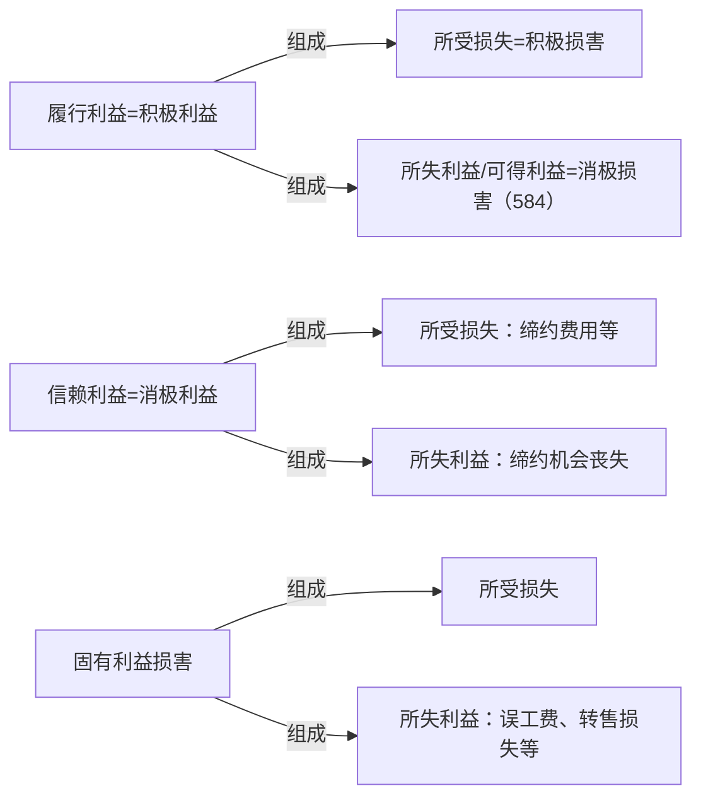

[[债务与普通义务#2.体系]]
前面讲了真正义务和不真正义务的区分，真正义务里面有普通的义务和债务的区分，债务里面还有很多很多区分。

首先，我们主给付义务、从给付义务、附随义务到底是怎么分的，先把它搞清楚。而这个区分建立在最最基本的基础上，就是看债务所保护的利益不同。再说明一下，前面讲了真正的义务保护普通的债务和义务，当我们在讲债务的时候，债的项下的所有义务都是指的债务，只是约定俗称是叫义务，但实际上叫债务，主给付义务/债务。接下去再看，那么，根据这些债务他所它所保护的利益，可以作这样的区分，最最基本的。

给付义务保护的是什么？——给付利益。而附随义务保护什么呢？——保护固有利益。到底是不是全部是保护固有利益，有争议，待会儿会说。但是现在我们要搞清楚，什么叫给付利益，什么叫固有利益。

A 委托 B 买三斤大枣，但买回的大枣是烂的，A 煮来吃了，最后生病了，问，侵犯了 A的什么利益？B 首先是违反了什么利益？——（首先违反的是）针对给付利益的义务，给付利益被侵害了，违反了给付义务了。但这个给付义务的结果导致 A 的人身受伤了。B 没有违反任何一个保护 A 人身安全的义务，没有违反侵犯固有利益的义务，他只违反了给付义务，但是没想到这个义务的违反会导致固有利益的损害，这个类似于叫瑕疵结果损害。一开始这只是个债务履行而已，这个债务履行只是把给付利益给侵害了，在给付利益侵害后续后果上都有害。

>**法工委：区分一般瑕疵履行与加害履行**
履行合同义务不符合约定，即债务人为不当为之事，也就是债务人虽然履行了债务，但其履行不符合约定，包括一般的瑕疵履行和加害履行。一般的瑕疵履行有数量不足、质量不符、履行方法不当、履行地点不当、履行时间不当等多种表现形式。当事人履行合同除有一般瑕疵外，还造成对方当事人的其他财产、人身损害的，为加害履行。加害履行的特征是往往造成违约与侵权行为竞合，例如，甲到乙饭店吃火锅，但乙提供的火锅因为不合格而爆炸，导致甲的人身损失，乙饭店的履行就是加害履行。加害履行也是一种瑕疵履行，故将与其对应的其他瑕疵履行称为一般瑕疵履行。

再举个例子：保管合同也是这种类型，对于寄存人而言，保管合同会带来新的给付利益是一段时间的妥善保管，最后得完璧归赵，最后还不是给付利益，给付利益是一段时间妥善保管好的状态；对保管合同来说，这个合同会带给他的新的利益是什么？——如果是有偿的，是保管费。A 把东西交给 B 保管，然后 B 还给 A，还给 A 的时候，因为东西在 B 那里保管不善，导致这个东西有放射性了，B 也没告诉 A，最后导致 A 受伤。这也是一样的，B 就本应该给 A 一个好的，B 违反了什么义务？——妥善保管的义务。后面导致 A 受伤是不是违反给付义务的后果啊？——这叫瑕疵的结果损害。

再举个例子，A 把一个杯子卖给 B，这个杯子什么都好，就是会爆炸。一个会爆炸的杯子符不符合约定的品质？——不符合，违反了给付义务（给付利益是应该给个好杯子，给个不会爆炸的杯子，但给了个会爆炸的，违反了给付利益，违反了给付义务），但是最后爆炸的结果是什么？——B 的固有利益受到损害了，因违反给付义务会导致固有利益受损害，这不是直接违反了维护固有利益的义务，这个不一样。

给付利益和固有利益一定要和履行利益和信赖利益分开，这是两个完全不同的概念，表述精确一点：履行利益和信赖利益都是因义务违反行为所导致的一个受害状况的差额。举个例子来说，A 交给 B 的杯子会爆炸，问，本来是应该给 B 一个（假设义务完全履行）不会爆炸的好杯子，这是它的完整的给付利益。给它的时候是一个会爆炸的杯子，A 给付义务违反的结果造成了一个 B 本来应该实现的财产状况（好杯子）和现在实际上的财产状况（坏杯子）（这两个杯子价值不一样），从而整体财产受有利益的不一样。本来它预设的是买卖合同履行完了有一个价值 500 的好杯子，结果因为 A 的义务的违反，B 的财产现在是只有一个价值 50 的坏杯子，平白少了 450 块钱，这是一个差别。现在本来有个价值 500 的好杯子是应然财产状况，现在财产中有一个价值 50 块钱的坏杯子是实然财产状况，这个区别是不是 A义务违反造成的？这个差别就是一个损害，这个损害怎么赔（是债务不履行的一个损失），这个要赔到如同合同正常履行的状态，怎么赔到如同合同正常履行的状态呢？——一个可能是修理，修不好换一个（修好，愿给付利益就实现了）；实在不行赔 450 块钱，或者说把破杯子还给 A，这个时候可以要求赔 500。

【（前面没什么争议：修好，原给付利益就实现了，差额就被填平了。唯一可能有差别的是，修好之前一段时间不能用，本来是当天就可以用了，一段时间不能用怎么办？——这个以后再说，至少修好。）赔钱怎么赔啊？——本来应该是 500 块的杯子，现在值 50 块，假设吧还要这个杯子，最简单，赔 450 就完了。但是 B 要给 A 多少钱？——取决于当时买杯子，约定多少钱，假设这个价值 500 的杯子是 420 买的，都做了一个赚钱的买卖。现在问，还要这个杯子，赔多少钱？——现在杯子价值 50，本来是想拿 420 买到一个价值 500 的杯子，现在话 420 买了一个价值 50 的杯子，差额是多少呢？（按数额算个人觉得是 290）——这个实际上叫减价，如果还要这个杯子就是价格减下来，中国有中国的算法，德国有德国的算法，是按比例还是按数额来算。等以后专门讲减价的时候专门讲它。】

现在讲最简单的，不要杯子，A 要赔他多少钱？——本来是想拿 420 买到一个价值 500，现在是一个价值 50 的杯子，现在不要了，问 A 要给 B 多少钱？——这个时候合同正常履行，财产中多多少钱？——出来 420，进去 500，这个时候他本来要赚多少钱？——多 80。现在这个合同 B 不要了，就相当于把 80 给 B 就相当于合同正常履行的状态。这叫履行利益，80，赔到如同合同正常履行的状态。所以，前面那个也是在赔这个差额，但是这个赔的方法不是我们这里讲的，我们现在只讲，这个东西他不要了，可以赔多少钱？——赔到正常履行状态，就赚 80，履行利益是个数字。前面讲的全部忘掉，再说一遍：

给了一个 50 的，B 不要了，A 换不了新的只好不要了。B 现在的财产状况是什么？——420 已经还给 B 了，杯子也还给 A 了，现在 A 是不增不减，但是合同正常履行应该是多少？——80。就记住这个差额就是履行利益啊，前面的铺垫全忘记。

我们根据这个例子来看一下，履行利益指的是什么？——就是因债务不履行所收到的损失，这个损失就是本来财产中应给可以增加多少钱（正常履行是增加 80，现在因为 A 的义务违反导致结果没有增加，就是这个差额），差额怎么赔呢？——赔到如同债务正常履行的状态，什么是债务正常履行的状态呢？——让它增加 80 就到了。履行利益是金钱赔偿的一个数字。

接下去讲给付利益和履行利益的差别。上次课也讲过了，A 要赔 B 这个杯子，B 最喜欢粉红色（约定好买粉红色的杯子），结果 A 却忘了，擅自主张却给了 B 一个黑色的杯子。A 心里觉得 B 用黑色杯子更有魅力，结果 B 很不喜欢，问，本来应该有一个红色的，现在给了个黑色的，履新利益上有没有差别？——没有，两个杯子价值一模一样。但是给付利益上有没有差别？给付利益有没有被侵害？——给付利益被侵害了，因为按照合同约定，应该给B 一个粉红色的杯子。给付利益就是按照原合同描述的那样一点都不能差，那个叫给付利益。换了一个东西，价值一样，不行。而履行利益是干什么？——财产的价值。在这个例子中，履行利益为 0，不能要求赔他钱，陪不了。给付利益被侵害了，B 所有的权利是什么？——给了一个黑色的，本来要求是粉红色的，给付利益仍然被侵害了；但陪不了钱，履行利益仍然是 0，怎么办？——换一个，是瑕疵担保责任中的换一个。请求权基础是§582,“修理、更换”，谁能把黑色杯子修成粉红色的？——所以还是换一个，更换是合理的方式。所以 B 有权要求 A 换一个，这是履行利益。接下去讲信赖利益：![[../../../../法律法规汇编/民商法/民法典/第三编 合同#^88p22r|民法典582]]

信赖利益是什么呢？A 和 B 签了合同之后，A 明明知道这个杯子会爆炸，A 跟 B 说，“这个杯子是世界上最完美的杯子”，B 相信了。是不是 A 欺诈了？——假设 B 的期待是合理的，（讲民总的时候讲过，信赖不合理能不能构成欺诈？错误的时候信赖必须合理吧？因为错是自己造成的吧？所以它不保护债权人。但是欺诈的时候是 A 很坏，B 很蠢，坏的跟蠢的保护坏的还是保护蠢的？所以这个形象的公式记住就可以了）骗了 B，B 买了这个杯子，买了杯子之后发现这个杯子会爆炸，危害安全，B 就撤销合同，把杯子还给 A。B 是不是因此受到一定的损失啊？会有什么损失？——B 跟 A 谈判磋商打电话，支出电话费 3 毛 5，这也是个损失，不要以为 3 毛 5 就不是损失。第二个，B 上门取货包了车，35，这是不是也亏了？第三个，B 要把杯子给 A 寄回来，运费顺丰 15 块，是不是这都是损失啊？现在问，B 的这些损失能不能向 A 要？——都是因为 A 骗 B 造成的。有观点认为，A 虽然骗了 B，但 B 不撤合同不就行了吗？能不能这么讲？——意思自治是要保护的，撤销是 B 的权利，所以，主要不是因为 B 撤造成了损失，而是 A 骗了 B 之后 B 才撤，撤了就造成了损失。所以这个损失，中间虽然 B 撤了，但是本质上是 A 的错造成的——欺诈，缔约过失了。

现在问，B 的损失怎么证明啊？——如果 A 不骗 B，B 会不会支出这笔钱？A 不骗 B 他会不会买？——根本就不会买，电话费也不会支出，这些小瑕疵我们不管它。接下去呢，打车费会支出吗？寄还给 A 的费用会支出吗？——都不会支出，所以，A 骗 B 的行为，哪些是因为 A 骗 B 而支出的？合计 50 是不是 A 骗 B 支出的？——是的。但是电话费是不是 A 骗 B 支出的？

所以全部的全部都等于说是 A 骗 B 的行为导致 B 的损失，假设 A 不骗 B，B 都不会支出。而这个损失假设要赔，是不是赔到如同 A 没有骗 B 都状态？（如果 A 骗了 B，B 又信赖的话）——这个时候注意一下，这些钱叫信赖利益。为什么叫信赖利益呢？——因为 B 相信会成立一个有效的合同才支出的这些费用，相信会获得这么好的一个给付利益，一个有效的合同会给他这么好的给付利益，所以 B 支出了这笔钱。是不是因为信赖行为有效而支出的成本啊？——【就是】信赖利益。那么义务违反造成的差额是什么呢？——本来如果没有义务违反，B 的财产中没有支出多少钱啊？——没有支出这 50.35，现在财产中支出了这 50.35。也就是说这 50.35 没有带来新的东西，这差额就是信赖利益。要赔他的时候怎么赔呢？——有好多种赔法，现在用钱来赔，怎么赔？——把 50.35 赔了就赔到如同没有义务违反行为时的状态了，A 不骗 B 的状态不就是没有支出这 50.35 的状态吗？——这叫信赖利益。

问，这个 50.35 当时是从 B 固有的财产中支出的还是从他的给付利益支出的？50.35 的来源是不是不属于合同新带给他的利益支出了？是固有利益支出了，为什么这里叫信赖利益，不叫固有利益的侵害？——是不是也从固有财产中支出的？——注意：只要是因为信赖行为成立有效而从固有利益中支出的一笔钱，这个就叫信赖利益。这种固有利益的损害就叫信赖利益，剩下的才叫固有利益了。它是特指固有利益因信赖行为有效而减少的情形。

现在假设，A 因为骗 B，把杯子交给 B，现在这个杯子让 B 受伤了，这个可以撤销，是不是完全有可能啊？现在问题是，B 受有什么样的损害了？——B 撤销了，撤销还应不应该构成给付利益？合同是不是相当于没定过？所以这永远谈不上给付利益的侵害，撤销就是没有给付利益的合同，只有固有利益。这里有两个所谓的固有利益了，一个是不是因为那 50.35因信赖合同有效的固有利益受侵害，这个叫什么？——信赖利益。另外一种是不是 B 的身体被 A 的坏杯子弄伤了？是不是也是固有利益侵害？——这个叫固有利益侵害。不一样的，完全不一样。

所以呢，信赖利益本来就是个固有利益，但是由于它独特的类型而独立出来。接下去，知道了这个原理之后，下面的都要来算钱，会算钱了就了不起了，这是后面损害赔偿的问题。

- 履行利益和信赖利益怎么算，首先把它讲讲：
	- 积极损害和消极损害，所受损失等于积极损害，所失利益等于消极损害。在履行利益中，一般不讲所受损失，是金老师把它拟制为所得损失，便于理解。要么在这里打个引号，“所受损失”=积极损害。这是一个用语的问题，为了概念精确，把所得损失打个引号，真正的所受损失是在其他地方。 ^iklnx3
	- 现在，所有的这些受侵害的利益，它都由两个项目组成，一个项目叫所受损失，一个项目叫所失利益。先从最容易理解的“固有利益讲起”。A 把可怜的 B 打伤了，这个时候打伤了之后，要支出医药费。医药费是不是让 B 固有的财产少了一块，这叫“财产不应减少而减少”，固有财产的减少谓之为所受损失，为积极损害。这是不是 B 的固有财产，本来可以不用支出的呀，支出了是不是固有财产减少了？——这个叫所受损失=积极损害。B 住院期间，本来应在公司上班，因为住院，所以 1 个月的工资没了，是不是有误工费啊，这个误工费属于什么？是不是还是他既有财产？——是他不住院将会获得的财产，这叫所失利益。所以所失利益是什么？——“财产因侵害行为，应增加而未增加”，等于消极损害。所以，一个是“不应减少而减少”（积极损害），另外一个是什么，“应增加而未增加”（所失利益）。工资是他被侵害时当时固有财产范围吗？——不是，是将来给的，这叫所失利益。 ^pizhlb

![[../../../../法律法规汇编/民商法/民法典/第三编 合同#^vkqgtu|民法典584]]

所以，A 不小心把可怜的 B 的手机撞坏了，手机是不是要修啊？修是不是固有利益的减损啊？是不是“不应减少而减少啊”，它叫什么？——所受损失，等于积极损害。后来查明，如果 A 不把 B 撞坏的话，B 已经把手机卖给 C 了，这个手机价值 300，卖给 C500，本来可以赚 200，现在被 A 撞了，交不了货，合同没了。是不是少了 200 块？——这个 200 块是不是 A 的侵害造成的损失啊？问，侵害的这 200 是不是 B 的财产？——将来可以拿过来，转售的利益，这个时候也叫所失利益，“财产应增加而未增加”。

接下去来看，第二个容易理解的，“履行利益”。履行利益有这两个部分组成，举个例子：A 还是把这个非常好的杯子卖给 B，杯子市场价值 500，卖给 B450，B 买了不是自己用的，B 还把它转卖给了另一位 C，卖 600，一转手，赚钱了。现在 A 违约了，唯一的杯子被 A 砸了，或者弄碎了。A 违约了之后要赔多少钱呢？——第一个，是不是要赔它履行利益？第一个合同正常履行 B 能赚到多少钱？——50。这个是不是 B 必然合同一签订就赚这个钱？——即使 A 不给这个杯子，法律也会给他 500，这个我们把它叫做履行利益中的所受损失。第一个合同中必然会赚到的差价。现在 B 积极的证明自己已经和 C 签了另一个合同了，如果A 不违约，这个杯子会转售给另外一个 C，B 又可以多赚另外一笔钱，价值 500 的杯子在他财产中卖了 600，赚了 100。这个是不是在侵害当时还属于他人的财产被拿进来了？这叫可得利益的、所失利益。这个是不是属于“应增加未增加”？这个时候就叫所失利益、可得利益。记清楚，标准术语叫所失利益，我们国家在履行利益的情形[[../../../../法律法规汇编/民商法/民法典/第三编 合同#^vkqgtu|民法典584]]把它称为“可得利益”。我们国家把所失利益叫做可得利益，而所失利益等于什么损害？——消极损害。这个概念把它顺起来。

（1）所受损失=不应减少而减少；所失利益=应增加未增加
（2）证明程度不同
（3）履行利益=所受损失+所失利益
（4）Eg：医药费+误工费（或者转售利益） ^t2bglp

也就是说，在这个情形里面，要赔两笔，第一笔合同中的 50 和转售合同中的 100，问，第一个合同中能赚到的 50 和后面转售合同的 100 有什么差别？——举证责任上的差别。就是第一个合同时铁定的已经证明了的，合同违约了，损失的就是没有赚到的钱。而所失利益有的时候具有盖然性的，它不一定能证明到，有的时候，比如在这个例子里是转售，在其他例子里，比方说刚刚讲到的误工费，这个时候没有正常工作，它有没有误工费？今天要工作，明天有没有可能去打工啊？送快递啊？也有可能吧？这种情形在盖然性就可以了，他和必然性不一样。知道有这两笔就可以了，这两笔略有差别。在前面这种情形，肯定合同签订了之后，通过交换的差价一减就能减出来，后面一个呢，它不一定铁定能赚到，有可能赚到，有可能有问题。而且可得利益受到“可预见性”的限制，仅限于“订立合同时可预见的”。所以呢，大致知道一下在履行利益中这两笔不大一样。

第三个，信赖利益。信赖利益也有两笔，一笔叫所受损失及其损害，另一笔叫所失利益消极损害。那前面，A 跟 B 签了合同，B 支出了 50.35，其后撤销，支出的 50.35 是不是缔约费用啊？是不是固有财产的积极减少？（“不应减少而减少”）这叫所受损失。A 跟 B 签合同的时候，本来有个 C 说，同样的这个杯子，A 卖给 B450，但是 C 卖给 B350，B 因为和 A 谈判在先，相信 A 卖给自己。于是果断的拒绝了 C。此时，是不是因 A 骗他，B 相信合同会有效，所以 B 丧失了一个有利可图的缔约机会？如果当时是跟 C 签订的合同，B 的财产是个什么状况？——少付 100 块就能过买回来一个价值一样的东西。这里有一个缔约机会的丧失，这个缔约机会是当时可能多赚 100 块钱的没赚到，这叫缔约机会的丧失。是不是在签订合同的时候，这不属于它既有财产的减少啊？而是一个本来可以进入固有财产的机会被毁了吧？——这叫所失利益。

(1)所受损失=不应减少而减少；所失利益=应增加未增加
(2)信赖利益=所受损失+所失利益
(3)Eg：缔约费用（例如车马费）+本来可以以更低的价格购买（[[履行利益与信赖利益的计算#^t2bglp|对比]]）

所以，这么一类比的话，所有的损害都有两个项目，一个叫所受损失，也叫积极损害；一个叫所失利益，也叫消极损害。

- 履行利益与固有利益：给付不能
	【例1：甲、乙签订机器买卖合同，约定乙以10万元购买甲之机器1台。甲生产／购买该机器的成本为6万元。交货途中，机器因甲过错灭失。问：下列情形中，乙可请求赔偿之金额？
	1．设机器市价为12万元；若机器市价8万元，又如何？
	2．设机器市价12万元，乙乃以一本价值10万元的秘笈与甲互易
	3．设机器市价12万元：乙将该机器转售予丙，售价15万
	（1）现因乙未履行合同，丙解除合同
	（2）现因乙未履行合同，丙解除合同，乙依约向丙负违约金3万元
	（3）现乙为履行合同，从他处购置相同机器，价款10万元／12万元／15万元】
	- 第一个，甲乙签订及其买卖合同，约定以 10w 块购买甲的机器 1 台，甲生产/买这个机器的成本是 6w，交货途中，机器因甲的过错灭失，问，下列情形中乙可以请求赔偿的金额： ^0r0m7z
		- 假设请求赔偿的时候，机器市价是 12w，要赔多少钱？——也就是说，这个时候合同是有效的，合同有效就不会产生信赖利益的问题。只能赔到的正常履行的状况，履行利益的问题。
		- 履行利益现在产生一个问题了，这个履行利益怎么算？——正常履行的财产状况是多少？——乙的财产中，会支出一笔多少钱？——12w。财产中会多一个什么东西？——多的是一个机器，机器值多少钱？——注意，机器的价值始终在变动，今天 12w，明天 13w，后天18w，大后天 8w，以什么时间点为准？——==请求赔偿的时间点为准==（不会像炒股嘛？赔偿数额取决于请求的时间点和市场，买方请求履行利益，如果履行的话货在手里，按市场价增幅算履行利益，==请求时的市场价-订立合同时约定的价款==）。这个时间点就算，以后的都没关系了，只能这样。
		- 现在问，在请求赔偿的时候这个机器在财产中值多少钱？——12w，应然是这个样子，应然的时间点就是出来 10w，进去一个价值 12w，财产中本来应该增加多少？——2w，现在增加没有？——没有。赔多少？——履行利益 2w。甲违约造成了对方“应增加而未增加的”2w。
		- 接下去看，机器的请求赔偿时的市价为 8w，乙说，“机器又没给我”。甲违约了没有？——违约了。乙要求甲赔多少钱？——应然财产状况，合同正常履行应然财产状况是多少？——支出 10w 块钱，买回来一个价值 8w 的机器。正常履行亏了多少？——亏了 2w，亏了2w 是不是要赔钱？——不可以。赔偿损失 0。 没有履行利益，凡是亏本交易都没有履行利益。刚刚这个说法就说明，合同一签订就已经亏了，没有财产上的履行利益了。
		- [[履行利益与信赖利益的计算#^0r0m7z|反过来讲]]，甲的这个机器是因乙的原因而损失的，或者是乙拒绝要货，最后甲解除了合同，现在这里假设乙说，“机器我不要了”，甲说，“你必须得要”，几番下来，但是乙始终不要，甲没耐心了，最后甲说解除。问，甲这里可以得到多少钱？是不是因为乙的义务违反行为导致甲这个合同没了，在机器市价是8w的时候，甲可以要求赔多少钱？正常履行的状况，甲的财产是怎么样子？——会收到 10w，而少了一个机器，少了一个机器值多少钱？请求赔偿的市价是多少？——8w，亏出去一台价值 8w 的机器（注意！不是以自己的成本 6w 来计算），赔 2w。
			- 甲本来就合同就能赚到的钱，我故意把它弄过来，好多都认为是 6w，为什么不能按照6w 来？——它的成本是 6w，但现在这个机器这个 2w 的涨（相对于现在的市价 8w），不是那个合同让它实现的，是合同签订时已经涨了。注意，成本不能放到履行利益的计算，只能按照请求时那个机器的市价来。所以这个时候是按照几 w 算？——按照 8w 算，成本不管它（因为成本机器还在甲手里，卖出去当然不按成本价卖，订立合同时价款10w，可得利润4w，请求赔偿时市价8w，可得利润2w，因为乙的违约甲可得利润少了2w）。
			- 再说一遍，从 6w 到 8w 的这个涨幅是不是合同签订也会涨到 8w？那个不能算作履行利益。反过来，再说一遍，假设现在机器价格是 12w，乙不要了，解除，然后现在，乙赔多少钱？正常履行甲的财产是多少？——收进 10w，出去一台机器市价 12w，甲亏本了（卖方请求履行利益，货物脱手，按脱手的市场价的降幅算履行利益，即如果履行本来能多赚的钱，==订立合同时的市场价-请求时市场价==）。好，履行利益为 0，倒过来要会算。
		- 现在回到正向来，现在回到交付过程中，甲最后没有诚信，乙最后能如期信赖。甲正常履行合同会是什么样子？——乙财产中会出去 10w，进去一台价值 12w 的机器，那么正常履行会赚 2w，在这种情形下给不给？机器市价还是 12w，请求赔偿。但是根据约定的内容，12w 的机器不是拿钱来还，而是给甲一本秘籍，秘籍价值 10w。现在甲把机器弄没了，该赔多少钱？——这时候出现两种算法：
			- 一种算法还是按照差额来算。正常履行的时候是怎么履行呢？——乙财产中突然少了价值10w块钱的秘籍，进去一台价值12w的机器，正常的差额是多少？——乙有权要甲赔2w。这赔 2w 意味着什么？秘籍还需要交给甲不？——秘籍不交了。这个时候甲违约，乙一定想把秘籍给甲呢，怎么说呢？甲违约，为什么乙想给甲秘籍的这个利益会消失啊？秘籍卖出去那是好事啊。所以，为了保护乙的利益，乙有权把秘籍交给甲。如果乙有权把秘籍交给甲，问，甲要赔多少钱？——12w。这个叫交换按照差额来算。实际交换成功来算履行利益，就是按照 12w 来算了。
			- 注意，第一种算法仍然按照差额来，在交换互易的情形，仍然按照 2w 差额来算履行利益，叫差额说。另外一种算法是要求只要乙想把秘籍给甲，甲就得接受。接受下来之后再算履行利益，那就是按照全额来算了，这个叫交换说。
			- 按照差额说，履行利益是多少？——2w。按照交换说，履行利益是多少？——12w。问，这个时候按照差额说来算还是按照交换说来算？谁来决定？——乙来决定。乙如果不想要，就不想再把秘籍交给甲，因为甲的违约，乙可以解除合同。一解除，乙就不会交给甲了，单纯的赔 2w。要是这个秘籍没有人买，买的人甲就是傻瓜，只有甲这个冤大头去买，那么乙把这个秘籍去除有很强烈的利益。这个时候乙就可以选择，乙还是把秘籍交给甲，甲要给 B多少钱？——12w。所以唯一的差别是把秘籍买出去。
			- 这两种算法里面，第一点，这个时候谁来选？——乙。由乙来决定有没有正当利益，决定觉得要把秘籍卖给甲，可以算后面一个。第二个，这两种算法的差别仅在什么情况下有异？——双方交换的给付都不是钱的时候，如果都是钱，第二种算法和第一种就是一样的。其中只要一方的给付是钱，就没用了。再说一遍，交换关系中只要一方的给付是钱，这个交换说就没用了。交换说和差额说产生的结果是一样的。只有双方交换的给付都不是钱的时候，交换说才有用。
	- 第三个，设这个机器的市价还是 12w，乙把这个机器转售给丙，售价 15w，现在甲交不出机器了，乙能不能履行和丙的合同呢？——也履行不了了。履行不了，丙是不是会解除合同啊？丙单纯的解除合同,其他的什么没有，现在问，乙可以要求赔多少钱？乙这里有没有固有利益的问题啊？有没有导致乙固有的财产中少一块？——没有，只有履行利益，该增加而没有增加的可能。我们再给他看，合同带给他的利益有没有不实现的？现在在第一个合同中，他可以赚多少钱？如果甲正常履行，乙可以赚多少钱？——出来 10w 块，进去一台价值 12w 的机器，赚 2w。第二个合同中能赚多少钱？——3w。第二个合同现在还能实现吗？赚的到吗？——赚不到了，合同被解除了。赚不到谁造成的？——还是甲造成的，所以第二个合同也可以算在甲头上，因为甲的义务违反导致他后面的一个合同中的钱赚不到。前面一个是不是叫[[履行利益与信赖利益的计算#^iklnx3|打引号的所受损失]]啊？2w 块钱，“所受损失”。后面那个是什么？——所失利益，3w。（[[履行利益与信赖利益的计算#^pizhlb|所受损失与所失利益]]）总共可以赔 5w，这 3w 和 5w 都是履行利益哦，后面 3w 还要受到可预见性的规制，这是一个。
		- 现在因为甲交不出机器导致乙也没法向丙交货，现在丙解除了，而且按照合同约定，只要是乙交不出货，要向丙支付违约金 3w，多了一个违约金的规定。现在再看固有利益了：丙的财产中有没有少？是不是固有财产里花出了 3w 块钱啊？——所以这个就不一样了，乙的第一个损失是固有利益中少了 3w（违约金支出），第二个在履行利益里面是看，第一个合同中，它是少赚了多少钱？——第一个合同没赚到吧？少赚了 2 万；第二个合同中也没赚到，3w；加起来一共多少？——8w。也就是说，固有利益和履行利益这两个能不能同时要？——当然可以，这两个完全不矛盾的，当然可以同时要，总共赔 8w。（甲给乙8w，乙给丙3w违约金）
	- 再看，第三种情形。甲没有履行合同，乙交不出货，乙这个时候聪明了，认为不能再等甲交不出货了，乙连忙跑到市场上去买了一台相应的机器，交给了丙。在下面的机器是不是也要支付价款啊？支出价款分别是 10w，12w，15w，问，这个时候这个乙可以向甲要求赔多少钱啊？即使把机器交了，机器交了有没有违约金啊？——没有，固有利益中第一笔没有了。接下去问题是，还有什么损害？——他机器买回来了，相当于原来合同中的给付利益是不是以另外一种方式实现了？一样的机器哦，第一个合同没受影响吧？——好像没受到。第二个合同有没有受影响啊？——第二个合同也履行了。只要机器一买回来，两个合同就都不受影响了。那唯一受影响的是什么？——本来是 10w 块买回这台机器，现在看乙多花 2w 实现了一台同样的机器？（再说一遍，本来是花 10w 就会有一台机器，然后后面两个合同才都实现了，现在是替代交易，看替代交易多少钱实现了后面的利益，差额就在于，原来对应的买价和现在替代交易的买价之间就是这个损失了。而这个损失是固有利益还是履行利益啊？——固有利益。替代交易中替代交易的价格叫替代交易费。
		- 本来是 10w 块就能赚到第一个合同，也能赚到第二个合同。现在甲不给乙机器，乙再买一台，是不是看买的价格是多少实现第一个合同、第二个合同？差别就在于这个差额的内在的差。这个差额，假设替代交易的费用 10w，乙就是同样以 10w 赚到了原来赚到的钱。有没有固有利益的损害？——没有。不需要给。如果支出了 12w，是不是以 12w 实现了原来可以花 10w 实现的利益？是不是固有利益多支出了 2w？——就赔 2w 固有利益损害。如果是 15w 呢？——就是多支出了 5w。所以这里要区分哪些是因合同正常履行的，哪些不是，在这里面，只要把这 5w 赔了，实际上他后面的一切利益都实现了，就是这个道理。
		- 是一个因合同新增加的一种形态。而信赖利益和固有利益侵害的都是什么？和给付利益相比都是侵犯固有利益的，只是这个固有利益的侵害是因为什么原因被侵害的？——信赖合同有效而被侵害的，而这个是进行其他被侵害的。对于侵害客体来讲，这两个都是固有利益的侵害。而这个履行利益是给付利益的侵害。
	- 接下去看，在固有利益被侵害的结果上又分成两项，一个项目叫所受损失，就是当时的固有财产中直接被减少了；第二个叫所失利益，当时财产中没减少，应增加未增加。可能会有疑问，“应增加而未增加怎么能叫固有利益呢？”——这个时候要注意，因为它侵害的是固有利益，这都是因固有利益受到的损害。这是两个不同的事情。所以，这个时候所失利益注意一下，它属于因侵害固有利益所造成的财产应增加而未增加，也属于固有利益损害。
	- 两个不矛盾，这是从侵害客体上来讲的。
		- 所受损失=不应减少而减少；所失利益=应增加未增加
		- 固有利益被侵害=所受损失+所失利益
		- Eg：替代交易费的多余支出（或第二次交易的违约金）+？
	- 第二个，刚刚只算了固有利益的侵害。替代交易的内容支出了一笔；本来正常要实现都可以赚到一笔钱？现在替代交易要实现，同样要花一笔钱，固有利益损失多少？是不是替代交易费用减去买价，10w 减 10w，固有利益为 0，不需要赔了。如果是 12w，12w 多支出 2w；多支出 5w，都是固有利益，要赔。但是本案中，乙还可不可以向甲要求履行利益的损害要求赔偿？——当然可以。说过同样的利益不可以要求赔，多花的钱才是。
	- 所以乙这个时候可以要求甲赔偿履行利益，可以要求赔多少？——正常履行第一个合同赔多少钱？——2w，第二个合同赔多少钱？——3w。这两项都没赚到。所以呢，履行利益赔 5w，固有利益取决于它价格，替代交易的价格。如果是 10w，固有利益损失是 0，加上履行利益 5，总共赔 5。如果 12w 买的，固有利益是多少？——2w；再加履行利益多少？5w。总共就是 7w。如果是 15w 买的，固有利益损失多少？——5w，另一个也是 5w，赔 10w。

- 履行利益与固有利益：给付迟延
	【例2：甲、乙6月1日签订机器买卖合同，约定乙以10万元购买甲之机器1台。9月1日交货。甲生产／购买该机器的成本为6万元，后甲届期未履行，乙致电限其9月11日前须交货，甲仍未履行。设乙请求甲赔偿损害时，机器市价为12万元。问：下列情形中，乙可请求赔偿之金额？
	1．设甲乙缔约后，乙将该机器转售于丙，售价15万元，9月15日交货。现因甲未及时履行，乙未能向丙履行合同，须向丙支付违约金3万元。
	（1）丙未解除合同，故乙请求甲继续履行，并赔偿损害
	（2）丙未解除合同，故乙从他处购置相间机器，价款10万元／12万元／15万元，请求甲损害赔偿
	（3）丙解除合同，乙解除与甲的合同，并请求甲损害赔偿】 ^u6z523
	- 接下去再看：甲乙 6 月 1 号签订了买卖合同，约定还是一样的，10 万买机器一台，9.1交货。甲声称购买这个机器的成本是 6w，后来甲没有及时履行，乙催告他还是不履行。下面第一种情形：乙当时早就把机器转售给丙了，售价 15w，9 月 15 日交货。现在因为甲没有正式履行，乙是不是也不能及时交给丙？因此向丙支出了违约金 3w。这是不是甲迟给造成的？没有及时交货，对不对？——第一种情形，乙没有解除合同，乙要求甲继续交货。丙要求乙继续交货，丙会怎样？丙会不会要求甲继续交货？——他请求甲继续交货。除此之外，叫赔偿损失。当乙请求甲继续交货的时候，这个赔偿的金额是多少？——还是一样的，先看固有利益，再看履行利益。
	- 固有利益，现在因为甲的违约行为，乙遭受了怎么样的损失啊？——违约金 3w，固有利益 3w 一定是可以要求他赔的。如果这个违约金规定的太多怎么办？——这个时候就用可预见性来限制它。签约的时候预见没那么大，不公平，赔到一个合理的损失，法官酌情处理。现在不讲这个，至少 3w 块合理，合理就赔，它固有利益的损害。
	- 履行利益要不要赔？有没有履行利益？要不要赔？因为这个时候乙是要求甲继续履行了，继续履行两个合同中能赚到的钱都能赚到，履行利益未受影响。所以在这里面，要求继续履行的，履行利益在这里没有了。只需要赔违约的损害，固有利益的损害赔了就没了。
	- 注意一下，这个损害赔偿跟前面的损害赔偿有没有不一样啊？前面那个甲把机器弄没了，弄没了机器是不是都要不到了？要赔的时候就要求同时要赔履行利益，机器要不到了。只有前面那些损害赔偿叫替代给付的损害赔偿。是不是把原给付给替代掉了赔钱啊？这里是不是既要求履行，又要求赔偿损害？这叫给付并行的损害赔偿。与给付并行的损害赔偿。
	- 现在，丙没有解除合同，意味着乙要继续向他给货这个时候赔多少钱啊？先看固有利益，第一笔违约金，要交吗？——因为已经出了违约，现在要交付了之后，乙迟延了吧？再转交机器的，是不是固有利益 3w 块已经支出了？第二笔固有利益是什么？这个违约金是所受损失还是所失利益啊？——所受损失。所失利益是特别讲的。第二笔固有利益是不是替代交易的费用和原来买价之间的差额？——假设是 10w，第二笔固有利益的损害就是 0，如果替代交易的价格是 12w 就是 2w，15w 就是 5w。假设这里是 15w，那就是第二笔损失是 5w。履行利益是多少？原来甲正常履行，乙能赚多少钱？——第一个合同是赚 2w，第二个合同呢？——第二个合同是赚 3w。那这个钱要不要给呢？——是不是现在多花了一些钱来实现能赚同样的钱啊？应该还是要赔的。多花了 5w 来实现同样的利润，所以多花的钱要赔，原来的利润也要赔。原来能赚多少钱啊？——原来能赚 5w，第一个要赔 3 万，甲要赔8w。
	- 第三个，丙直接解除合同了，丙解除了，乙也解除了和甲的合同，并请求甲损害赔偿。赔多少钱？——（1）固有利益。是不是 3w？没有替代交易，固有利益就是 3w。正常履行和甲的合同，本来能赚多少钱？合同一有 2w，合同二是 3w。合同一没赚到，被解除了，要赔吧？合同二赚到没有？——也没赚到。所以还是要赔 3w+5w（固有利益 3w，履行利益5w）。

- 履行利益与固有利益：给付迟延
	【例2：甲、乙6月1日签订机器买卖合同，约定乙以10万元购买甲之机器1台，9月1日交货。甲生产／购买该机器的成本为6万元。后甲届期未履行，乙致电限其9月11日前须交货，甲仍未履行。设乙请求甲赔偿损害时，机器市价为12万元。问：下列情形中，乙可请求赔偿之金额？
	2．设乙未转售，却因此停工。后乙从他处购置相同机器，价款12万；其停工期间，支出工资、租金等费用共2万元，丧失正常利润3万元】 ^umn55a
	- 第二种情形来了，同样是下面的例子：乙没有转售，但因此停工了。乙不是拿机器来卖的，乙是拿机器来生产的。甲的机器一直不给，导致乙停工了。停工期间，乙是怎么干的呢？因为甲不给了，其他地方去买一台机器，因此还是有停工。其他地方买的是 12w；停工期间支出了多少呢？——工资、厂房的租金，都是停工要付的，付了 2w。丧失不停工能正常赚到的钱 3w，这个时候怎么赔？——（1）当乙从其他地方买到的机器，甲还能不能对乙说，“现在我有机器了，我给你”。乙要不要接受？只要乙有权从其他地方去买这台机器，替代交易成立了，意味着乙同时有权不要加给他这个机器了。所以叫有权的替代交易必然会符合不要甲的给付内容。而乙不要甲的给付，有两种可能，一种可能是他有解除的可能；什么时候乙再去买一台机器是合理的？——乙可以解除和甲的合同了，这意味着他可以不要甲的给付了。第二种情形是，乙可以向甲主张替代给付的损害赔偿了。替代给付的损害赔偿是不是意味着他可以不要这个给付了？那么这个要件是什么，待会儿讲解除的时候可以讲到。通常要求严重的违约才可以，本案中已经可以了。所以乙从其他地方可以购买意味着什么？再说一遍，乙有权从其他地方做替代交易，意味着什么？——乙已经可以解除和甲的合同了，或者乙可以向甲主张替代给付的损害赔偿。这个逻辑一定要串起来，一开始可能有点烦，最后都是通的。
	- 现在乙遭受的损失是多少？——先看固有利益了：固有利益是多少？——购置相同的机器价格是 12w，本来 10w 就能买到实现的利益，现在是不是花了 12w 才获得啊？所以多出2w 块要不要赔啊？——固有利益所失 2w 完全可以要。问题在于，接下去还有没有可以要求赔的？租金 2w 可不可以要求赔？3w 能正常赚到的钱能不能赔？——如果甲正常履行了，甲把这个机器交到乙手里了，甲会不会停工？——不会，不会停工会不会赚到 3w 块？——会的。这是不是可得利益啊？这本来就是他可赚到的钱嘛，应增加未增加，可得利益。3w可以了。但问题是，这 2w 可不可以？——注意一下，要想赚这 3w，要不要支出这 2w？——要，赔了 3w 就不能要 2w，2w 是 3w 的基础（就算是交过来了，乙也得支出这 2w），想要赔 3w，必然要付出 2w，这才是正常的。所以从这一句话来讲呢，即使不能赚到 3w，也要赔 2w，要赚到 3w，必然支出 2w，不能重复赔的。不能既要利润也要成本，实现利益的成本不能赔。现在问题是，这个 3w，可得利益是因固有利益被侵害而发生的可得利益还是还是因给付利益被侵害履行利益中的可得利益啊？是不是更像履行利益啊？正常履行能赚到的钱。
	- 这样一来呢，我们就会发现，固有利益可以要求赔差价 2w，履行利益的可得利益可以要求赔 3w。那原来这个合同它能赚到多少钱？——2w。所以履行利益第一笔，那个合同正常履行可以赚多少钱？——2w；现在是可得利益多少钱？——3w。所以加起来是履行利益可以赔 5w；再加上固有利益可以赔 2w。[[履行利益与信赖利益的计算#^umn55a|纠正]]

所受损失=不应减少而减少；所失利益=应增加未增加
固有利益被侵害=所受损失+所失利益
Eg：替代交易费的多余支出（或第二次交易的违约金）+？不停工丧失本能赚到的钱

- 履行利益与固有利益：瑕疵给付
	【例3：甲、乙签订机器买卖合同，约定乙以10万元购买甲之机器1台，9月1日交货。交货后，乙检验发现机器存在故障，无法投入生产。设乙请求甲赔偿损害时，机器市价为12万元。问：下列情形中，乙可请求赔偿之金额？
	1．乙请求甲修理，甲拒绝。乙遂请丙修理，支出修理费2万，受停工损失3万元
	2．乙请求甲更换一台新机器，甲拒绝。乙递要求退货，并请求甲赔偿损害
	3．设机器瑕疵甚为隐蔽，故乙未能发现，使用中发生爆炸，致机器灭失，乙受伤支出医两费5万元，其余设备毁损10万元；且因此停工，期间支出工资、租金等费用2万元，丧失正常利润11万元】
	- 其实可以看出，案情再复杂，算的公式都是一样的，用不同的案件在锻炼算法。在甲签订了机器买卖合同之后，现在案情有点变化了。交货后发现机器故障，没法用，乙请求甲修理，甲拒绝。乙请求找别人代修，支出修理费 2w，停工损失 3w，问，这个时候乙可不可以请求甲赔多少钱？——第一，看固有利益：是不是一个财产中莫名其妙多支出了 2w 的修理费啊？这个是固有利益的损害吧？——所受损失 2w。好，接下去，履行利益有没有？——第一个合同的履行利益有没有？机器还在不在乙那里？——在。在就说明这个履行利益实现了。修好就实现了，而我不就是为了修好吗？所以，第一个履行利益就是所受损失，没有。因为它已经实现了。第二个，停工损失有没有？可得利益有没有？——有可得利益的损失，“应增长未增长”。所以归纳一下，固有利益是多少？——2w；；履行利益第一个——0；第二个是可得利益 3w。好，固有利益 2w，可得利益 3w，总额加起来 5w。问，这个时候请求损害赔偿是替代给付的损害赔偿还是给付并行的损害赔偿？——给付并行。为什么？东西在不在乙那里？——在。这就同时要求给付了。
	- 所受损失=不应减少而减少；所失利益=应增加未增加
		固有利益被侵害=所受损失+所失利益
		Eg：替代交易费的多余支出（或第二次交易的违约金）+？不停工丧失本能赚到的钱
		但是这个停工损失更严格讲起来更像履行利益中的所失利益。
		证据：“固有利益里面有没有可得利益？它这些受害的财产有没有转售？”
	- 第二种情况，乙请求甲更换一台机器，乙拒绝。乙就要求退货，并且要求甲损害赔偿，甲严肃的拒绝。问，这个时候，有固有利益吗？是不是乙的固有财产没减少？——没有案情表明它减少了。第二个履行利益里面，它是替代给付呢还是给付并行呢？——退货是不是就说明它机器不要了，最后就是替代给付的。那么在这个履行利益里面呢，我们看，只有 1 个合同，这个合同正常履行状态能赚到多少钱？替代给付怎么算？——2w，没了。
	- 假设这个瑕疵甚，乙未能发现，使用过程中发生爆炸，导致（1）机器灭失；（2）乙受伤支出了医药费 5w，其余设备赔了 10w；因此停工期间支出工资、租金 2w，丧失正常利润是 1w。现在问， 固有利益的损害是多少？——是所受损失医药费 5w，设备毁损 10w，都是所受损失；固有利益里面有没有可得利益？它这些受害的财产有没有转售？——没有。那它因伤支出也没有误工费啊这些啊？——假设他有误工费，就有所失利益了，他现在没有。这个人虽然有医药费，我们加上误工费就不一样了。所得损失是多少？——5w，10w，所失利益是多少？——误工费 1w。
	- 接下去我们看履行利益，履行利益中，“所得损失”是多少？——第一个合同中所得损失是多少？——2w，2w 还是要给，因为机器已经没了。机器没了，就是机器没拿到。这个时候相当于正常履行的 2w 相当于没赚到。听清楚，机器是给了，给了之后又因你的过错没了，就相当于给了之后被你抢夺了，这个时候 2w 还是要赔的。这个机器是给付利益，第二个是不是正常利润是 11w，所失利益。前面 2w 是所受损失，这是所失利益。成本能不能算进去啊？——不能算，所以履行利益赔 2w+11w，是 13w。前面是多少来着？——前面是15w，赔 28w。

- 信赖利益
	【例4：甲、乙签订机器买卖合同，约定乙以10万元购买甲之机器1台。乙随后将该机器转售予丙，售价15万元。后发现甲缔约时有重大误解，且就此有过错。乙与甲缔约，支出缔约费用2万元；且乙本可以9万自丙处购买相同机器，因信赖与甲之契约有效，而放弃该机会。设请求赔偿时，机器市价为12万元、问：下列情形，乙可请求赔偿之金额
	1．若甲撤销合同，乙请求损害赔偿
	2．若甲不撤销合同，但拒绝履行合同，致乙无法向丙履行，丙解除，乙付造约金3万元
	（1）乙请求甲继续履行，且赔偿损害
	（2）乙解除或以12万元购置相同机器，请求甲损害赔偿】
	- 接下去信赖利益来了。其实是一样的，别觉得麻烦，一模一样的。在这个例子里面其他的都差不多，有转售，只是后面发现，甲，缔约的时候是重大误解啊。并且这重大误解是有过错的。缔约费用是 2w，本来可以 9w 买的，放弃了。请求赔偿的时候市价 12w，第一种情形：
		- 第一种情形，甲撤销了合同，丙请求损害赔偿。当合同撤销了之后，乙还能不能请求跟给付利益侵害相关的一切损害赔偿？履行利益还能请求吗？——合同被撤销了，通常都不能主张履行利益了，只能赔到什么状态？——不能赔到合同正常履行的状态，只能赔到同没有信赖合同有效的状态。本案中，什么叫如同合同没有信赖合同有效的状态？乙的信赖利益是多少？——乙如果不是和甲进行磋商信赖合同有效，会不会支出缔约的费用 2w？——不会。所以这第一笔，信赖利益的第一笔，所受损失，是缔约费 2w。其实金老师始终觉得，这个信赖利益的损害其实更多的像落空费。因为支出这个费用的目的就是为了一个有效的合同。都知道损害和落空费的差别，那么这个时候协助完全没用了。所以用这个逻辑来讲也讲得通，就是现在因为合同被撤了，那个 2w 块完全落空了，所受损失。
		- 所失利益也没有？有没有一次放弃缔约机会？——有一个更好的缔约机会。现在订的合同是 10w，当时有个缔约机会 9w 就可以买到这个机器，这个缔约机会带来的损失是多少？——1w，差价是 1w。本来他和另外一个缔约方少花 1w，就能够买到同样的利润。这个时候注意一下，在信赖利益中，所受损失是缔约费 2w，缔约机会丧失所带给他的所失利益是多少？——1w。这个缔约机会的丧失所带给他的利益是不是真的只有 1w？——如果他从丙那里 9w 买到的机器，问，他后面那个转售合同中他是不是会拿丙那里买的机器来履行啊？是不是还是照样会履行啊？——所以看，这个在缔约机会丧失里面，还可能包括（1）和现在合同的差价；（2）还包括什么？——如果后面中转售以其他地方缔约机会买下来的那个（所放弃的缔约机会所买下的机器）可能已经转售，这个时候转售合同中的也要算进去。这符合逻辑。
		- 也就是说，本来甲给乙，乙可以赚到一笔钱，甲现在撤销不给乙了，是不是乙当时从甲那里买的也没有赚到钱啊？——所以这个时候注意一下，这时信赖利益分成两笔，第一笔是所受损失缔约费用，第二个所失利益，也就是缔约机会丧失。缔约机会分成，一，差价；二，转售。但是这个转售不是必然的，只是在这个例子刚好，其他例子不一定。
	- 第二个，甲如果不撤销合同，撤了只能赔信赖利益了。现在甲不撤，甲不撤，但是拒绝给货，导致乙没有办法向丙履行了。丙解除。乙付了违约金 3w，这时候怎么算？——（1）乙可不可以请求甲继续履行？可以吧，问丙是解除了和乙之间的合同，乙有没有解除和甲之间的合同？——没有，问，乙对甲有没有履行请求权？——合同还在，当然，所以，乙请求甲继续履行，对丙赔偿损害，问，这叫给付并行的还是替代给付的？——给付并行。替代给付只能在履行利益中讲。现在问，先看有没有固有利益：违约金 3w 是不是固有利益啊？第二个，履行利益，履行利益讲过了，请求履行的是给付并行还是替代履行啊？——给付并行。那这个时候正常履行，能够赚到的机会是多少？——2w，但是只要甲给了机器还是赚到了。第一个合同是给付并行，东西给了第一个合同就赚到了。第二个合同是什么？——转售。转售的钱要不要给啊？——照样给。这个 3w 要不要赔？——固有利益不说了，3w。履行利益中，第一个合同，请求继续履行，不能要求赔了。现在第二个合同能不能要求赔了？这个合同被解除了没有？——解除了，解除了就赚不到了。赚不到要不要赔？——假设没解除能不能要求赔后面一个合同？——不能，只要甲继续交货并给了，还是能赚到的。也就是说，后面一个能不能给，就看后面一个合同的利益有没有被剥夺了，解除了就没有了嘛。再说一遍，固有利益是多少？——3w；履行利益是不是在第一个合同啊？第一个合同是不是机器给了就照样实现。给付利益都实现了那还要履行利益的赔偿吗？——通常就没有。当然，迟延损害有什么特殊的，不多讲。但是接下去第二个合同，问，合同是不是被解除了？——被解除了说明该赚到的钱赚不到了。要不要赔啊？——要，赔多少？3w。12w的几次出去进来15w，就是 3w。违约金固有利益 3w，履行利益中可得利益 3w，总共赔 6w。
	- 接下去，一解除，或者以 12w 购置相同机器，请求损害赔偿。前面是不是丙已经把合同解除了？丙解除了就不需要这台机器了，这里它不知道为什么还想要，可能这个机器还有什么其他用。但这里它说，既然丙不要了，乙也解除了；或者是乙说，「机器」还有用，我还是从你那里拿吧，请求折价损害赔偿。乙解除或者购置相同的机器意味着什么？是不是有权不要甲的给付了，那么这个损害赔偿在履行利益叫替代给付还是给付并行啊？——替代给付。在这个里面我们看，第一，固有利益；第二，履行利益。
	- 固有利益是多少？是不是 3w 要赔的。履行利益是多少？——第一个合同履行了没有？是不是被解除了？——那么这个时候第一个合同的 2w 要赔吧。第二个合同是不是也拿不成了，3w。一共 8w。是否考虑信赖利益？——这里没有信赖利益，合同有效哪来信赖利益啊？合同没撤销啊。只要赔了履行利益，信赖利益还能不能赔？——一切信赖利益是不是都是为了赚到履行利益的成本啊，你看，不去缔约哪来履行利益啊？
	- 所以，凡是要履行利益的，不可能同时赔信赖利益。因为信赖利益的目的不就是签订一个有效的合同吗？而履行利益不就是他能赚到的钱吗？——所以，不支出信赖利益，怎么可能赚到钱呢？所以再说一遍，信赖利益的支出导致了合同，合同的履行导致了履行利益的赚到，所以信赖利益是履行利益的成本。要缔约的不可能同时要成本。
	- 所以，凡是合同还在，都不能要信赖利益，这是一个通说的观点。

- 另一种“信赖利益”：落空费用
	【例5：甲、乙签订机器买卖合同，约定乙以10万元购买甲之机器1台。甲生产／购买该机器的成本为6万元。缔约后，乙为安置该机器，预先改造厂房、线路，支出费用4万元。交货途中，机器因甲过错灭失。设请求赔偿时，机器市价为12万元。问：
	1．乙得否请求甲赔偿履行利益2万元？
	2．乙得否请求甲赔偿厂房、线路改造费用4万元？
	3．乙得否请求甲间时赔偿上述两项金额？
	4．若乙以12万元向丙购得相同机器一台，可请求甲赔偿何种金额？】 ^fjq32n
	- 机器有了，缔约后为了安置这个机器，预先改造了厂房，支出费用 4w，交货途中，因甲的过错导致机器拿不到。现在问，
		1. 乙能不能请求甲赔偿履行利益 2w？——合同有效吧，那履行利益赔不赔？暂时不讲固有利益了，就讲履行利益是多少？——正常履行，乙的财产中支出 10w，拿到一个价值 12w 的机器，履行利益 2w。当然可以要求赔了，完全符合要件啊。
		2. 乙能不能请求赔偿厂房现有改装费用 4w？这个 4w 是不是相信会拿到机器，提前做了个安排而支出的费用？是不是叫做信赖支出啊？但是这个信赖内容有点不同。前面的信赖利益指的是信赖合同有效而支出的缔约费，这里是不是信赖能获得机器而支出啊？信赖内容不一样了。现在问，是不是因为甲的违约行为让这个费用落空了？这个费用的支出完全没意义了，没意义了，这个能不能要求赔啊？——当然也可以要求赔了。是不是可以反过来这样说，甲从固有利益中挖出来一部分钱？少了 4w 块钱？——这就是固有利益的侵害。而这个固有利益，它和前面的信赖不一样，前面的信赖利益是因为信赖行为有效而导致的固有利益的减少，这里是信赖能够获得给付导致的固有利益的减少。这种信赖导致的减少我们叫普通费用。我们在不精确的意义上也可以把它叫做“另一种信赖利益”，但这个信赖利益和前面不一样，完全不一样。这叫落空费。
			- 落空费能不能要求赔？是不是因为甲的违约行为导致费用落空了？固有利益减少了，要不要赔了？——当然要。因为固有利益的减少的结果就是赔 4w。 
		3. 乙能不能请求甲赔偿上述两项费用？——问，假设合同正常履行，乙的财产中会有什么？——多了一台机器，赚到 2w 块钱；4w 要不要支出？——当然要支出，机器不能放这儿的，还是要改造线路的。所以，要了履行利益，不能要求赔偿落空费。正常获得机器也得支出的，当赔到了有机器的状态就必然会支出 4w 块。履行利益是不是赔到了如同机器获得的状态啊？——但此时乙必然会支出 4w。所以，不能同时要求赔。
			- 如果当事人选择了，这个时候是不是意味着意定了？
			- 如果合同正常履行，乙的财产中是不是会增加 2w 块，但会支出 4w 块。到目前为止，机器交付之前，是不是亏本了？允许他主张这个是不是相当于他把一个本来亏本的交易，因为对方违约，把决策失误的不利转嫁给对方？——本来的状况是什么？赚2w，支出 4w，现在要求赔 4w，是不是当时乙准备亏 2w 转嫁给对方了？——所以呢，学说上有人认为，这个时候信赖利益赔偿不能超过履行利益赔偿，行不行？——反正学说上很多书上这么讲的，金老师不赞同。前面的逻辑是不能把乙当时的决策失误转嫁给对方，但这个逻辑会变的：乙当时是决策失误了，本来机器买回来会亏，要赚 2w，支出 4w，最后亏 2w。但是甲违约了，违约实质上乙有权里摆脱合同，那么原来那个决策失误应该以违约为由支出了？A 要摆脱合同嘛。摆脱合同就是摆脱回原来那个时候的状态了？所以要转嫁给甲，谁叫你（甲）违约的。
			- 也就是说，谁叫你（甲）违约的？本来这个合同是对乙不利的，谁叫你（甲）违约，违约了最后导致乙退出合同，退出合同当然对你不利了。
		4. 这个时候乙从其他地方买到了同样一台机器，付了 12w，这个时候甲可以请求赔偿上面第二个？能不能赔偿？不能了，为什么？费用落空了没有？——没落空了，其他机器可以用啊，一旦用上了，对不起，这个费用就没落空，这个请求最后就消失了。只有第一个。
			- 那么这种情况下，来算一下，乙可以请求甲的损害赔偿：（1）固有利益是什么？多花了多少钱？——2w。履行利益是多少？——2w。4w。[[债务的体系#^3i38ew|纠正]]
			- 算了那么多的钱，这是个独立的知识点，本来应当在损害赔偿里讲的，现在回头看看，能不能得出一个结论？——给付利益和固有利益，与履行利益信赖利益，完全没关系，能得出这样一个结论吧？给付利益就是原来合同实现，活生生的那个利益。给付利益等于履行利益吗？——不等于。第二，固有利益等于信赖利益吗？——不等于，信赖利益只是固有利益中因信赖合同有效所支出的那个利益，不等于的。这两个能区分开了就已经很厉害了。
			- 接下去就具体来检验哪些义务是保护给付利益的，哪些义务是保护固有利益的。刚刚的算的都要会算，算法是独立的知识点。

>程啸：
>五、侵权行为与缔约过失责任
缔约过失责任，是指处于缔约磋商阶段的当事人一方没有依诚信原则尽到照顾、通知、协力等先契约义务而使另一方当事人因此而遭受的损害，依法应当依法承担的赔偿责任（参见案例 2.2.5）。《民法典》第500条规定：“当事人在订立合同过程中有下列情形之一，造成对方损失的,应当承担赔偿责任：（—）假借订立合同，恶意进行磋商;（二）故意隐瞒与订立合同有关的重要事实或者提供虚假情况;(三)有其他违背诚实信用原则的行为。”
侵权行为与缔约过失责任的区别在于：首先,违反义务的内容不同。从《民法典》[[../../../../法律法规汇编/民商法/民法典/第三编 合同#^1h3dpf|第500条]]与[[../../../../法律法规汇编/民商法/民法典/第三编 合同#^fd1z06|第501条]]的规定来看，合同缔结前的义务即先契约义务不包括保护义务。 在缔约过程中，如果一方因没有尽到照顾保护的义务而导致他方遭受人身损害时，发生的是侵权责任而非缔约过失责任(《民法典》[[../../../../法律法规汇编/民商法/民法典/第七编 侵权责任#^qitd9e|第1198条]]以下）。其次，造成的损害不同。侵权行为侵害的是被侵权人的固有利益，即侵害的是被侵权人固有的人身权益、财产权益，所造成的损害既包括财产损害，也包括非财产损害。缔约过失行为通常侵害的是缔约人的信赖利益。所谓信赖利益，是指缔约人因信赖合同有效成立，但因法定事由发生，致使合同不成立、无效、不被追认或被撤销等造成的财产损失，如缔约人为缔约而支出的交通费、住宿费等费用。
![[../../../../法律法规汇编/民商法/民法典/第七编 侵权责任#^qitd9e|民法典1198]]
少数情形下，缔约人遭受的也可能是固有利益的损害。参见重庆市城口县岚天乡种植养殖场诉中国农业银行城口县支行缔约过失责任赔偿案，[重庆市高级人民法院(2004) 渝高法民终字第57号民事判决书](https://www.lawsdata.com/#/documentDetails?id=59e89a9ad631a942e149891f&type=1&keyword=WyLph43luobluILpq5jnuqfkurrmsJHms5XpmaIiLCIyMDA0Il0%3D)。
评析：
（1） 比较法上，缔约过失责任发生的原因是由于未尽到保护义务。 
（2） 缔约过失侵害的不是信赖利益，信赖利益的概念是用于损害赔偿的计算方式，此处表述为“侵害缔约人的固有利益”更为妥当。信赖利益的计算方式很大程度上要考虑固有利益。
史尚宽：
（三）契约订立上之附随义务
契约当事人之一方，因契约订立上之过失，致相对人受有损害时，是否有损害赔偿责任？依德国最高法院最近判例，因契约订立谈判之开始，组成与契约类似之信任关系（德 Vertraunsverhaltnisse）， 使当事人负有交易上必要注意之义务，尤其通知，说明或维持等义务。此责任不问其谈判成立与否，独立存在 只须过失为已足，并不以注意义务之故意的侵害为前提（Ennieccerus，Bd．lI，S．169-170） 亦有主张此问题应分契约之有效成立，与不成立，而为研究，契约全部或一部无效或得撤销者，应否负赔偿责任（依民法规定，当事人知其原因或可得面知者，应负赔偿责任，民法113条、114条2项、247条），为侵权行为之责任问题。契约有效成立者，如当事人依诚信原则负有告知之义务，而因其过失不为告知或误为告知，致他人受有损害时，则应负义务违反之赔偿责任。但相对人亦与有过失，则可适用民法第217条过失相抵之规定（鸠山《民法研究》第3卷）。依余所见，以德国判例之主张为当

- 主给付义务：现行法示例
	- ![[../../../../法律法规汇编/民商法/民法典/第三编 合同#^z4gs9b|民法典708]]§708这个义务保护的是给付利益还是固有利益啊?——它是不是努力在维护合同，因合同给承租人新增的利益啊，这个完全是合同带来的利益，当然要保护，当然保护的是给付利益了。
	- ![[../../../../法律法规汇编/民商法/民法典/第三编 合同#^9gvvh0|民法典770]]§770“工作成果”是新利益还是旧利益啊？——都是合同带来的新利益，签合同的时候没有的。
	- ![[../../../../法律法规汇编/民商法/民法典/第三编 合同#^2s8bf3|民法典892]]§892“妥善保管”是不是保管人给寄存人带来的新利益啊？
	- ![[../../../../法律法规汇编/民商法/民法典/第三编 合同#^7h3tlw|民法典919]] ![[../../../../法律法规汇编/民商法/民法典/第三编 合同#^mitlho|民法典927]]§919 再接下去看，委托合同“处理事务”是不是新利益啊？而且“处理委托事务取得的财产，应当转交给委托人”，这是不是有的时候也是属于委托合同的目的啊？——A 委托 B去买一台电视机，处理事务是不是“买电视机”啊？买来的电视机要不要给 A？——当然给，这是不是带给 A 的新利益啊？——所以这个事务本身有的时候可以直接包括在这里，当然也属于给付利益的。

- 从给付义务——服务于主给付利益：现行法示例
	- ![[../../../../法律法规汇编/民商法/民法典/第三编 合同#^eodza4|民法典599]]§599，比方说 A 卖一批货给 B，B 给 A 说，“你要给我防疫报关协议证书”，因为没有这个，B 不能出口。问，这个时候这个义务是在保护什么利益？——给一个检验证书，或者所需要的其他资料，出卖人要给它吧？问，给这个证书和资料，本身是不是合同带给它的新的利益？是不是合同想要追求的那个新的利益？——不是。合同想要追求的新利益是什么？——它拿到这批货的所有权和占有，这是合同的主给付利益。那么现在要给这个报关证书和有关单证是不是为了 B 继续向第三方转售所必须的？——它是为了这个主给付的利益能够进一步得到发挥（买到就可以出国，买到就可以转售），为了它后面的使用目的而要给它，这个是不是服务于原来的给付利益的效用进一步发挥啊？——它是服务于给付利益的。再说一遍，这个给付利益是什么？——所有权和占有。拿到所有权、占有怎么用，是不是属于买受人自己的事啊？但是出卖人有义务让它将要做的事情得到实现，所以这个时候就要交付的责任。
	- ![[../../../../法律法规汇编/民商法/民法典/第三编 合同#^b93nkj|民法典619]]§619，这个是用来干什么？买受人的给付利益是什么？——货物的所有权、占有。“包装”对这个给付利益的实现有帮助吗？——包装不好会坏的，是不是用来确保给付利益啊？——这两个义务产生鲜明的对比。“包装”是保证对方获得一个完满的给付利益（所有权和占有），而进一步给单证是不是便于 B 做后续的处置啊？——一个是给付利益的确保，包装是确保，保障获得这样一个完满的利益；而单证是用来给付效果（给付利益进一步发挥效用），这两种分的很清楚。这个要不断看法条慢慢去体会。
	- ![[../../../../法律法规汇编/民商法/民法典/第三编 合同#^4ozzxa|民法典653]]§653 要及时抢修，供电合同中对用电一方获得的新利益是什么？——就是电，随时可以用。抢修的目的是什么？是不是及时把给付利益给恢复了？——是确保给付利益。
	- ![[../../../../法律法规汇编/民商法/民法典/第三编 合同#^3pieaz|民法典712]]§712 出租人维修是为了什么？承租人的给付利益是什么？——一段时间的用。中间坏了还用的到吗？给付利益受损害了，维修是不是让给付利益完满啊？——所以也叫给付利益的确保。
	- ![[../../../../法律法规汇编/民商法/民法典/第三编 合同#^lhcb9h|民法典741]]（广义：含瑕疵担保）
	- 所以，有的利益，有的义务直接就是给付利益本身。交付、已转标的物所有权是不是给付利益本身？租赁物的交付是不是给付义务本身？——有的是不是服务于给付利益的？所以，反正都是针对给付利益的。

- 我们再往下看：有些义务规定了 附随义务：保护固有利益=保护义务 ^f34e9o
	- ![[../../../../法律法规汇编/民商法/民法典/第三编 合同#^fd1z06|民法典501]]（当事人保密义务）§501“订立合同中获取的秘密要保密”，针对的是给付利益还是固有利益啊？——这个合同可能是买卖，买卖的给付利益不就是取得所有权、占有吗？问，保密针对的是不是给付利益啊？——不是，它是固有利益啊，是以前买卖合同签订之前对方就有的机密。这都是针对固有利益的。
	- ![[../../../../法律法规汇编/民商法/民法典/第三编 合同#^phrylo|民法典509II]]
	- ![[../../../../法律法规汇编/民商法/民法典/第三编 合同#^she9kx|民法典711]]
	- ![[../../../../法律法规汇编/民商法/民法典/第三编 合同#^y7y230|民法典714 ]]（承租人妥善保管租赁物义务）§714“妥善保管”保护的是给付利益还是固有利益？——这就要区分两块儿了。出租人的给付利益是什么？——收租金；承租人的给付利益是什么？——占有和使用。妥善保管租赁物是对谁负的义务？——对出租人负的义务。它和出租人的给付利益有关系吗？——和给钱没关系。所以，它保护的不是出租人的给付利益，它只能是出租人的固有利益。有疑问的是，把它管好了，对承租人的给付利益不是有益吗？——不能这样去考虑问题，要看这个义务是对谁负的，看它服务于谁的利益才是有意义的。B 对 A 负的义务，最后这个义务负好了对承租人的给付利益有好处没用，不需要这么去考虑。只需要考虑，自己是承租人，承租人对出租人负有一个管好租赁物的义务，这个时候就要分析，它到底在保护出租人的哪个利益啊？——要么在保护它的给付利益，要么在保护它的固有利益。问，对出租人来说是什么利益？——固有利益。不要和承租人的给付利益扯在一起，想都不要去想这个问题，永远不要去想这个问题，一想挠自己乱了。
	- ![[../../../../法律法规汇编/民商法/民法典/第三编 合同#^5iyaun|民法典715]]（承租人对租赁物进行改善或增设他物）§715 这个在保护出租人的什么？——固有利益。
	- ![[../../../../法律法规汇编/民商法/民法典/第三编 合同#^5mo27u|民法典731]]
	- ![[../../../../法律法规汇编/民商法/民法典/第三编 合同#^t1ro05|民法典785]]
	- ![[../../../../法律法规汇编/民商法/民法典/第三编 合同#^7a5f9m|民法典784]]（承揽人保管义务  ）§784，“妥善保管定做人提供的材料”。什么叫承揽定做？B 想让 A 造一个东西，要材料加工，“料”是 B 的。“料”是不是做完了就要还，多退少补啊。这个时候保护的是什么利益啊？——保护的固有利益吧。因为这个东西它是定做人所提供的财产，要保护对方的财产。
	- ![[../../../../法律法规汇编/民商法/民法典/第三编 合同#^sqzuzy|民法典818]]（禁止旅客携带危险物品、违禁物品）
	- ![[../../../../法律法规汇编/民商法/民法典/第三编 合同#^pr891r|民法典822]]§822 承运人对乘客负有这个义务，乘客的利益是什么？乘客在运输合同中的给付利益是什么？——要安全送到。现在，“尽力救助”是属于“安全送到”的给付利益还是“安全送到”的给付利益之外的利益。安全送到是给付义务，严格讲起来，作为新增给付利益的，a，送到；b，安全。承运人只负责什么样的安全？——不因为承运人提供的给付——“运”——而给旅客带来的不安全，避免这样的不安全。不因为承运人的“送”而给旅客带来不安全。要避免送的过程中造成的危险。而对于固有的那个风险保障安全，超出了给付义务的范围，所以疾病、分娩造成的不是“安全”给付利益这个范围。这不是给付带来的不安全。所以这属于固有利益的。
	- ![[../../../../法律法规汇编/民商法/民法典/第三编 合同#^vu7g4i|民法典828]]（运输危险货物）
	- ![[../../../../法律法规汇编/民商法/民法典/第三编 合同#^badl8v|民法典906]]（危险物品和易变质物品的储存）有危险物品的，无论是仓储（[[../../../../法律法规汇编/民商法/民法典/第三编 合同#^badl8v|§906]]）还是货运([[../../../../法律法规汇编/民商法/民法典/第三编 合同#^sqzuzy|§818]]、[[../../../../法律法规汇编/民商法/民法典/第三编 合同#^vu7g4i|§828]])，都要告诉承运人、仓储人。这个是不是对仓储人、承运人负的义务啊？它在保护仓储人、承运人的什么利益？仓储人和承运人的给付利益是什么？——拿钱，所以永远不可能是给付利益，这可能在保护他人什么？——固有利益。
	- ![[../../../../法律法规汇编/民商法/民法典/第七编 侵权责任#^l7dhuy|民法典1206]]
		- 再看侵权责任法上，侵权责任法是不是只应该规定有普通义务吧？不应该有债务。我们国家很有意思，侵权责任法居然蹦出来一个债务。产品责任，§1206 条第一款，“警示、召回”的义务如果是销售者做的，A 把一个车卖给 B，卖完了之后发现这个产品具有缺陷，会对人身造成安全，A 是不是要警示 B 召回这个车啊？问，AB 之间是不是有合同啊，这就变成合同义务，一个债务了。这个时候 A 警示 B，保护的是什么义务？——保护 A 对 B 负有对警示和召回的义务，保护 B 的利益。B 的利益是不是要相应的要得到维持啊，现在这个车不完满，这个时候严格讲起来，这是既保护固有利益，又保护给付利益。但它重心在于保护固有利益（怕对 B 造成危险），重点是这个。但这是属于债务。
		- 生产者就不属于债务了，生产者和 B 之间有合同吗？——没有。这就是普通的侵权法上的义务了。
		- 现在大概知道了，有些义务具有双重性，既保护固有利益，又保护给付利益。尤其是跟安全有关。

- 双重功能之义务：同时保护给付利益/固有利益
	- ![[../../../../法律法规汇编/民商法/民法典/第三编 合同#^5mo27u|民法典731]]
	- ![[../../../../法律法规汇编/民商法/民法典/第三编 合同#^sxvq0u|民法典819]]
	- ![[../../../../法律法规汇编/民商法/民法典/第三编 合同#^2s8bf3|民法典892I]]
	- 产品使用说明书：使用不当，得致产品毁损，且危及人身、其他财产安全时
	- §731，也就是说，租赁物无论如何不能危及承租人的安全健康，这个义务是不是出租人对承租人负的？而承租人的给付利益是什么？——一段时间的占有和使用。如果这个占有和使用这个标的物会让承租人不安全的、不健康的，是不是（1）侵犯了固有利益；（2）同时侵犯了给付利益啊？安全的住着当然理解为给付利益的内容啊，是不是这个道理啊？同时具备两个利益。
	- 安全义务是不是同样的？——因给付所产生的危险是不是要给你预防掉？——托运，A运过去的时候，带来的危险一定要防免这种安全义务的疏忽，是不是既保护固有利益，同时又是给付利益的组成部分啊？
	- 第二个，妥善保管是不是一样的？妥善保管提供不了，那就是妥善保管的给付利益被破坏了；其次，妥善保管义务违反的结果，同时是不是固有利益被侵害了？双重性啊。再接下去，最典型的，产品使用说明书的例子，最最典型。
	- A 卖给 B 一个东西，结果 A 没有交给 B 产品使用说明书，然后 B 就按照通常的用法去用。坏了，有可能没有说明书，有没有可能导致机器本身坏了？但是是不是使用说明书交付本身的义务是不是在保护给付利益啊？机器本身坏了。第二个是不是有可能不仅机器本身坏了，还爆炸了，导致使用人手炸了，财产是不是受损了？——所以这个交付使用说明书的义务是不是通常是在保护固有利益啊。这个时候机器本身是给付利益，机器致害是固有利益。
	- 现在弄清楚了，这都是具有双重性的义务。那么可能会问，这个义务违反到底会算什么呢？——不管算什么，都不要紧，就是双重性的，既保护给付利益，又保护固有利益。那最后造成了哪个利益的损害，就按照哪个利益的来赔偿。举个例子，机器爆炸了，没有造成人身伤害，只有机器没了，是不是只赔履行利益/给付利益就可以了。如果机器没爆炸，使用过程中机器没坏，导致这个人受害了，机器一点都没有问题，是不是单纯这个义务的违反导致了这个固有利益的侵害？——就按照固有利益来赔偿。如果机器爆炸，机器也没了，同时导致人身损害了，是不是给付利益被侵害了？——履行利益要赔。然后固有利益也被侵害了，固有利益要赔了。就是一个一个按照被侵害的利益来分别计算损害赔偿就行了，这个没有什么问题。
	- 现在基本上能够了解到，一个义务既可能保护给付利益，也可能保护固有利益。保护给付义务，有可能是主给付义务，有可能是从给付义务。

在体系中，我们先讲给付义务的种类：给付义务都是用来保护/满足给付利益的，给付义务可以分成主给付义务和从给付义务。主给付义务是哪些？它就相当于是主给付利益本身。买卖合同中，双方当事人追求的新的利益是什么？——买房获得机器的所有权和占有，当事人的义务之所在是不是就在这里啊？卖方想要获得什么？——给付利益：价金。这两个交换组合起来是不是叫买卖？——所以呢，这样的义务，交付移转所有权，对方支付价金，是不是当事人所要追求的合同想要增加的新利益，对不对？而从而决定债的类型了？

- 给付义务与附随义务：图1（通说）  ^ja41gb
	- 给付义务（有履行请求权，满足给付利益）
		- 主给付义务：决定债之类型
		- 从给付义务：不决定债之类型
	- 附随义务
		- [[履行利益与信赖利益的计算#^3qfyob|满足给付利益：无履行请求权？]]
		- [[履行利益与信赖利益的计算#^f34e9o|保护固有利益：或有履行请求权（保护义务）]]

问，有没有买卖不需要支付价金啊？有没有买卖是不需要交付并移转所有权的？不可能吧？——所以这是买卖合同的概念构成所必需的，这样一个义务叫主给付义务。

承租、租赁，承租人想要的给付利益是什么？——一段时间的占有使用。出租人想要获得的给付利益是什么？——租金。这两个是不是决定了是不是租赁合同啊？——这就是主给付义务。

保管，一段时间的保管费，是不是决定了它是保管？委托是不是一个人做事，另一个给钱，是不是决定了是委托合同啊？

这个就是决定债之类型的叫主给付义务。接下去保护给付利益的，就是义务人履行，直接就会让给付利益实现的，就叫主给付义务，对不对？——还有从给付义务。从给付义务刚刚讲过了，它本身的履行，不会直接导致给付利益的实现。像给证书，会直接让对方把所有权、占有拿到吗？——拿不到。（此处指的是报关需要的证书）这个时候不会让给付利益实现的。但它本身是不是有助于给付利益效用进一步发挥？——可以转售。要么有利于确保给付利益，比方说，妥善保管。

包装包装好，有没有让给付利益实现？包装包好了取得所有权没有？取得占有没有？——没有，但它有助于将来完好的取得所有权和占有。

所以，从给付义务的特点是两个，（1）它的履行不会直接让主给付义务实现，不会让给付利益实现；而主给付义务一履行完毕，给付利益就实现了。（2）从给付义务决定债的类型吗？——一个买卖合同，有没有不需要交证书的？——当然有了。比如 A 画一幅画卖给 B，要不要交付证书啊？不需要交付任何证书的。那么这个时候它是不是买卖？——还是买卖。所以它不决定债的类型啊。也就是说它有没有都没关系，而去掉不影响它的类型，仍然属于从给付义务。

附随义务，至少保护固有利益的都属于附随义务。

看，没争议的是，直接让给付利益实现的，并且决定债的类型的，肯定有履行请求权，那叫主给付义务。你说，有哪个给付义务是不能履行的？——不可能。一定是有履行请求权。所以，给付义务的特点是一定和履行捆绑在一起的。第二个，保护给付利益，不决定债的类型。当然，给付义务都要履行请求权，这个叫从给付义务，也没有争议。凡是保护固有利益的，不管能不能请求履行，都叫附随义务，这个也没有争议。

唯一有争议的在这里，它保护的是给付利益，却居然不能请求履行。对于这种义务它到底归入哪里呢？——有点争议。什么情形说保护的是给付利益但没法请求履行的？——

- 示例——附随义务：保护给付利益＋无法诉请履行
	【例1：甲将自制机器一台售予乙，却未告知乙该机器须遵循说明书未载明的特殊使用方法，否则虽无害于人身财产安全，但机器却难免毁损。】
	【例2：甲系机器生产商，出售某型号机器7台予乙，约定三月后付款，款到交付。签约后，乙将该批机器置于工厂露天处，日晒雨淋，有生锈毁损之虞。
	1．乙可否诉请甲采取妥善保管措施？
	2．此种妥善保管义务，是否属于“保护给付利益＋无法诉请履行”之附随义务？】 ^3qfyob
	- 甲自己有一台机器卖给乙，给了说明书。但是这个说明书上没有写全，它自己造的这个机器有独特的用法，但他没有告诉对方。现在如果不按照这个独特的使用方法用，机器就坏了。但它不会造成人身伤害。所以这个独特的使用方法，在保护给付利益，还是在保护固有利益？——因为他不可能造成其他的财产损害，只会导致机器的损失，是不是只在保护给付利益啊？问，甲也没有义务应该把这个独特的使用方法告诉乙啊？要不要告诉啊？——当然要告诉，诚实信用要做到，一定要告诉，否则给付利益不能确保。有义务保护给付利益。
	- 但是，乙对甲有请求权吗？——注意，这个时候陷入一个很奇怪的局面。甲没有告诉乙，乙又不会知道，乙不知道，给了请求权怎么行使？——不知道就即使给了请求权也没法行使。第二个，假设从别人那里听说，甲这个机器好像有独门使用方法。这个时候可不可以请求啊？——好像可以请求，“甲，你告诉乙”，甲对乙说，“没有”，或者瞎说一个。问，乙请求管什么用？是不是不管什么用啊？——所以呢，注意一下，通说认为，这种情形下所谓的没有履行请求权是一个打比方的说法，只是说给了履行请求权也没用，要么不知道了，不会去行使；要么知道了，也没有用，对方张嘴瞎说就骗了对方，大不了赔钱。
	- 所以给请求权的结果是什么？再说一遍：要么不知道，不会去行使也没用；要么知道了，去行使了，行使了之后对方张嘴瞎说，自己也不知道。一用，坏了，最后给这个请求权就没意义。最后有意义的是什么？——义务违反之后要赔钱。所以它说，对这些要求说明特殊使用方法的义务，虽然保护给付利益，却配了履行请求权没用。它不是没有履行请求权，是配了请求权没用。
	- 第二个例子：乙对甲说，“机器你是马上要交给我的，3 个月之后就要交了，现在不管你以后交不交得出来，现在我请求你管好”，乙对甲也没用管好的请求权？——表面上是很正常，将来要交了，交出去就要来管了嘛。注意一下，没有要求管好的请求权。为什么没有？——因为对乙来说，全部的合同给他的请求权是什么？——到时候甲交不生锈，不坏的机器给乙。不管甲前面怎么管的，只要最后交出来的机器是好的，乙就管不了了。如果最后交出来的机器是不好的，假设是坏的，问，是因为当事人没有管好所以要赔钱还是因为交的机器不好所以要赔钱？——交的机器不好。所以对乙而言，没有意义给他一个给付请求权。就是这个要求交货的请求权，前面那个要求管好，实际上是甲自己的事，乙没有权利要求。
	- 那么可能会问，没有好好管，要求他好好管起什么作用？——注意一下，最后的机器交出来是坏的，有两种可能是坏的，一种是甲努力的去管好，一点错都没有导致损坏；另外一种是没管好导致损坏。前者无过错，后者有过错。所以所谓的保管，前面那个“保管义务”，只是判定过错标准而已，本身也就不是有履行请求权的一个义务。只是注意义务而已，说白了。
	- 所以注意一下，这里之所以没有履行请求权，是因为什么？——因为它不是一个独立的给付义务，这里唯一的给付义务是要求要给机器；要求管好的是给付义务违反的过错问题，不独立，所以没有请求权。
	- 下面一个例子更说明没有要求管好的义务：甲卖给乙，乙在交付之前发现甲要把同样的机器卖给 C，一旦交付并且所有权移转，是不是乙的债权就实现不了了？问，这个时候乙能不能请求说，“甲，你不能卖给 C”，有这个义务吗？——没有这个义务啊，卖不卖是他的自由。完全卖给别人，移转给别人了就没有权利要求甲履行，怎么可能是前面一个请求权的类型啊？——只能等到一物二卖成功之后要求损害赔偿了。所以本身，这个时候损害赔偿，问，出卖人甲有没有错？——是不是故意造成的？故意造成前面一个合同不能履行了，是过错的判定。
	- 所以我们国家好多书上说前面是独立的义务，是不是荒唐啊？——所以呢，注意一下，这种情形，有履行请求权也没用。这种情形是因为它是不独立的义务，所以它没履行请求权。所谓的保护给付利益不能请求履行的，无非是这两种情形。
	- 补充一点，跟自助者怎么协调？不是有自助行为吗？民总学了自主行为。在这种情形下，乙要求甲保管好，确定如果不保管好，机器肯定会坏，到时候交不出来。乙能不能自助？极端一点，甲要把这个机器扔进赤水河，甲能不能上去把它抢下来？——可以吧？可以自助但是没有履行请求权。思考：自助行为能否对于签订第二个买卖合同进行自助？自助行为的边界在何处？
	- 所以，在这样一个阶段，可以自助，但自助行为所确保的请求权是保管好的请求权还是要交付并移转所有权的请求权？——仍然是交付并移转所有权的请求权。自助行为就是在保全这个请求权。注意一下，保全的不是保管好的请求权，而是交付并移转所有权的请求权。所以不能用自助来反驳他，因为是不独立。

- 示例：非独立义务→无履行请求权
	![[../../../../法律法规汇编/民商法/民法典/第三编 合同#^7a5f9m|民法典784]]
	【例3：甲乙签订买卖合同，乙送货上门时，甲因过失不知其门口出现一个隐蔽的坑，放未提醒乙，乙坠坑受伤。】 ^w7jl02
	- 而这样的情形很常见。妥善保管，前面“妥善保管”是不是保护固有利益的。妥善保管工作成果，问，针对的是给付利益还是固有利益？——工作成果是不是给定做人新增的一个利益啊？给付利益吧？妥善保管是不是针对的保护给付利益啊，但是这个时候也没用妥善保管请求权？——没有，为什么？——因为对定做人来说，重要的给付利益是“交给我时候好不好”，你前面管的好不好，无非是判断过失理由，没有履行请求权，这叫前置义务了。这样的前置义务很常见。
	- 例三：甲乙签订买卖合同，乙送货上门，甲因过失不知道门口出现一个隐蔽的坑，所以没有提醒乙，乙掉下去受伤。照理说，甲对乙是不是有告知义务啊？——而乙没看到，被掉进去了。这是诚实信用赋予他这个义务了，现在问题是甲有没有告诉他？——没告诉，义务违反了。甲错在哪里？——可以说甲违反的是要知道隐蔽的坑的义务还是违反的是告知义务？也就是说，甲对乙负的，对乙唯一有意义的是什么？——告知义务。他知不道其实没用。所以义务内容是告诉乙。但是甲为什么没有履行告知乙的义务呢？——义务他不知道。那么这个时候他义务的违法有没有问题呢？——看他不知道的原因是什么。所以这里只是过错问题，前面（不知道）不是一个义务，要努力去知道不是义务。努力的去知道只是一个有没有过错问题，义务只是告知。这都叫所谓前置的义务，都是在过错中发挥作用。
	- 现在回到这里：也就是说，所谓的给付利益无履行请求权是有的，一种情形是履行请求权没有意义，实际上是有请求权的，另外一种是请求权确实没有，因为它不独立。问，这样的义务是放在附随以外的从给付义务呢？
		- 通说认为，拉伦茨/王泽鉴老师说，放到附随义务。虽然保护了给付利益，但是由于没有履行请求权，所以不能放到给付义务。因为给付义务必然是有履行请求权，这是通说的观点。现在另外一种观点是说，既然它保护的是给付利益，哪怕没有履行请求权，也放到给付义务里面，是从给付义务，这是第二种观点。其实两种观点怎么放，都不要紧。怎么放不影响法律效果，一种体系是附随义务项下，这就是通说，王泽鉴老师他们的观点。无履行请求权——附随义务。

![[履行利益与信赖利益的计算#^ja41gb]]

>史尚宽：
上述二种附随义务之区别、在于单独诉追权之有无、在非独立附随义务，因缺乏固有目的，不得单独诉追。因雇佣契约，雇用人之履行请求权，不包含对于违反民法[[../../../../民法专著/王泽鉴九阴真经/台湾民法典相关条文/第482条]]义务之任何不作为之独立的可诉独立请求权。此不作为义务之违反，仅自其本身观之，不构成所负给付之一部不能，惟于具体的场合，因而有使其本来之给付成为不能之结果者，始可认为给付不能、除此以外，可认为不完全履行。民法[[../../../../民法专著/王泽鉴九阴真经/台湾民法典相关条文/第214条]]之规定，于非独立的附随义务，亦可适用之，反之，独立的附随义务，得单独为诉追，具关于不作为者，其违反行为构成所负给付之一部不能，关于作为者，其违反正如主义务之违反，得为一部不能，履行迟延或不完全履行（Ennecceru＋-Lehtnann，Bd. II.S.4,S.18).

- 给付义务与附随义务：图2 ^8xemqm
	- 给付义务（满足给付利益）
		- 主给付义务：决定债之类型
		- 从给付义务：不决定债之类型
			- 有履行请求权
			- 无履行请求权？
		- 附随义务：保护固有利益（保护义务）→原则/例外？
			- 有履行请求权
			- 无履行请求权

另外一种是这样的，满足给付利益，没有履行请求权的是从给付义务。其实没有差别。金老师是从逻辑的角度采取后一种学说，把它放到从给付义务。所以从给付义务分为有履行请求权和没有履行请求权。