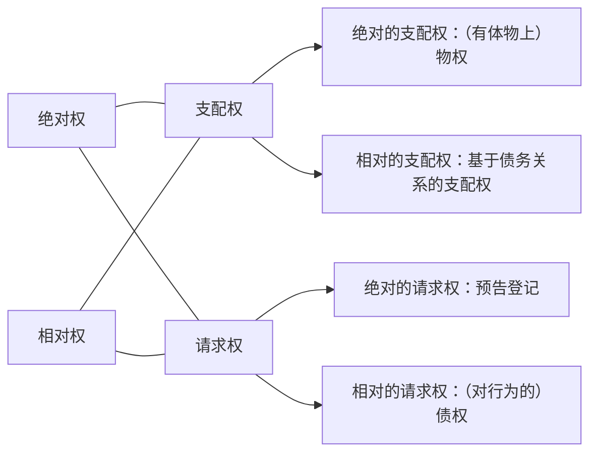

# （一）物权之概念：“对特定有体物的绝对支配权”
## 1.构造要素：绝对权+支配权+特定有体物
>**示例：债权与物权之区分**
>- 案1：甲将一个iphone出卖于乙，签订买卖合同，乙支付价款，但甲逾期拒绝交货。([[（二）请求权#1.概念：权利人要求他人为特定行为（作为、不作为）%%给付%%之权利|参照此前同案例]])
>    - 乙不可以闯到甲的家里去拿。
>    - 甲将iphone拿在手上，乙不能去抢。
>    - 甲的iphone掉落在地上，乙不能抢先甲一部把手机捡走。
>    - 以上行为不行的原因是根据合同所产生的是债权，债权的法定权能是请求而不是支配，所以凡是未经甲的同意去触及iphone，都超出了债权所给乙的法定权能，若如此，则侵犯了甲的物权。
>    - 甲将iphone遗失了，丢在哪个地方不知道，这个时候乙能不能去捡？
>        - 乙可以捡，但这个捡不意味着乙的债权包含着支配权能。
>        - 可以捡是基于另外一个法律关系，和乙的债权没关系，如果捡的目的是为了归还则不违法，遗失物拾得有无因管理之性质，捡的违法性被无因管理排除。债权本身没有给乙捡的权利，而遗失物拾得无因管理的成分让乙有了捡的权利。
>    - 甲准备把iphone扔到湖里，乙可以抢先把手机抢下来，这没有让债权变为支配权。这是债权在异常情况下的临时保全的权利，是自助行为给他的权利。自助权是债权的一个权能，但这是一种异态，只在[[（二）请求权#^o1quuf|极为严格的要件]]下，乙才能触及标的物，触及标的物的目的不是为了支配，而是为了保全自己的债权。一旦保全成功要马上诉诸公力救济。

债权的法定权能是请求，物权的法定权能是支配权，物权在异态下也会出现请求。

图示：债权与物权之区别

|  债权  |  物权  |
|:------:|:------:|
| 请求权 | 支配权 |
|相容性、平等性|[[八、债权与物权#^w5xwgt\|排他性]]、优先力|
|相对权|绝对权|
|无追及力|有追及力|
|更强之意定性|更强之法定性|
|无需公示|须公示|
|有期限性|未必有期限性|

>**示例：债权与物权之区分**
>- 案2：甲于1月1日将某套房屋出卖予乙，价金200万元；1月2号又将之出卖予丙，价金250万元；1月3号再将之出卖予丁，价金300万元。（房子都还没有交）
>    - 三个合同内容是否相互矛盾？为什么？
>        - 三个合同不能都实现，因为乙丙丁不能都取得房屋所有权，详见下问。
>    - 乙、丙、丁能否均取得该套房屋所有权？为什么？
>        - 不能，如果三个合同成立了，就相互矛盾了，只能实现其中一个。
>        - 房屋的所有权是一个物权，一套房屋上不可能有3个所有权，因为所有权是对房屋全面的完整的支配，有了一个所有权之后第2个就放不上去了。
>        - 两个内容上相互矛盾，权能不相容的物权是不能并存于同一个物上的，物权有排他性，所有权作为对物的全面支配，相互是排他的，有了一个所有权，其他的所有权不能发生。
>        - 取得所有权之后，按照买卖合同要交付，房屋是不可能既交付于乙又交付于丙又交付于丁的。交付意味着甲把房子的占有完整的交付于乙，既然乙占有了，不可能丙也占有、丁也占有，单独占有是不可能并存的。
>    - 三个合同效力分别如何？为什么？
>        - 虽然三个合同只能实现一个，但三个合同均有效。
>        - 物权有排他性，内容矛盾不能并存于一物之上，只能是择一，而债权则不同，三个合同，明明相互矛盾，债权却具有相容性，三个合同都有效。
>        - 实现了一个合同，另外两个合同就实现不了，另外两个合同并不因之无效，而是可以追究出卖人的违约责任。
>    - 法官应判令何人取得该套房屋所有权？为什么？
>        - 假设三个合同的当事人乙、丙、丁同时将甲告上了法庭，要求取得这套房屋的所有权并交付给自己。
>        - 法官应该判决三个合同都需要履行，乙是先签合同的，丙是先付钱的，丁是先受领交付的，但是法律的判定是三个合同虽然有先后之别，但履行上一律平等，无先后履行顺序，这叫特定物上的债权的平等性。
>        - 法官若是判决任意某一个当事人取得房屋所有权都是超越了法定职权，即便允许法官判决房屋给某一个当事人，问题也没有得到解决，到底给谁只能由甲自己决定（实务中不会让甲自己决定）。一个理性的甲会把房屋移转给丁，因为丁给出的价格最高，至于对其他人，需要承担违约责任。
>        - 移转给丁没有让甲占便宜，甲把房屋登记给丁拿到300万，但是要赔乙和丙的钱，要承担违约责任，赔给乙要赔到如同合同正常履行的状态，如果乙的合同正常履行，乙的财产中多了一套房子少了200万，这套房子现在可以以300万的价值卖出去，所以甲应该退还200万并赔给乙100万，这种赔到如同合同正常履行的状态，叫作赔偿履行利益，履行利益为100万，第二个合同也要赔到如同正常履行的状态，履行利益为50万。法律的设定绝对不会让一物多卖的人占便宜。甲有一种方式可以占便宜，只要把钱（全部财产）挥霍光了，一分钱也拿不出来，相当于多花了一笔钱，但从诉讼上实务操作来讲，专业的法律人士不会让甲有这么操作的机会，起诉之前就会把甲的财产保全。
>        - 甲若将房子卖给乙，还是要赔偿丙50万，但不用赔丁钱，因为最后一个合同价格就是300万。
>        - 以上履行利益是在不能证明诉讼时房屋市价的情况下，以最后一个合同价格300万为基准计算的。若是证明了房屋市场价为280万，对于丁而言，甲若未向丁履行，只需要退还300万，当然也是没有履行利益的，因为正常履行的话丁现在是亏本状态。若是证明房屋市场价为350万，甲需要赔偿丁履行利益50万。总之履行利益能够证明市价就按市价来，证明不了就按最后一个合同价格来。当然实务操作会进行评估。
>    - 诉讼法上实务操作问题
>        - 在诉讼保全的时候可能会出现一个问题，乙丙丁均申请查封房屋，中国的法律比较粗糙，没有讲谁优先的问题，通常情形在强制执行法上，假设事先乙丙丁均查封过，乙丙丁均将强制执行的判决和冻结申请书交给法院，到底交给谁法律没有规定，这个时候执行庭的法官就有一定的自由裁量的余地了，如果申请查封了，谁查封在先可能就是谁先拿到房屋。法律规定虽然不明确，但会尽量根据查封以及强制执行判决不让甲自己选。
>
^35oyk5

>- 物权的排他性：两个内容上相互矛盾，权能不相容的物权是不能并存在同一个物上。
>- 两个内容上不矛盾的物权当然是可以并存在一个物上的。
>    - 特别注意，共有不是一个物上有几个所有权，共有是一个物上有一个所有权大家来共有这个所有权，是对一个所有权的共有，而不是数个人都有各自的独立的所有权。
>    - 金可可对一套房屋具有所有权，抵押给了张三，所有权人是金可可，抵押权人是张三，并存于这套房子上面，典型的不矛盾。
>    - 用益物权和所有权也是同理，分属不同的人，不矛盾的并存于同一客体。
>
^w5xwgt

>**债权平等性之突破：动产特定物买卖**
>![[../../../../../法律法规汇编/民商法/民法典配套司法解释/最高人民法院关于审理买卖合同纠纷案件适用法律问题的解释(2021.1.1)#^vseqka|买合释6]]
>- 甲将一本书同时卖给乙、丙、丁。
>    - [[../../../../../法律法规汇编/民商法/民法典配套司法解释/最高人民法院关于审理买卖合同纠纷案件适用法律问题的解释(2021.1.1)#^vseqka|买合释6（一）]]是一句废话，除非保留所有权才有意义，但是保留所有权又有不对，“先行受领交付的买受人请求确认所有权已经转移的……”可见指的是交了书所有权就移转的情形，典型的一句废话，不写也是这样来。
>    - 实际上这个规则是漏洞百出、百无一是。
>        - 先受领交付的，当然取得所有权，相当于先交给谁就对谁履行了，假设乙是先付钱的，也是先签合同，但甲偏偏把书交给了丙，当然是丙取得所有权，这不需要人民法院确认，按照动产物权的规则就已经归丙了。
>        - 三个人都没有受领交付的情况下先支付价款的买受人优先看似公平，但是不合理，比如丁最后一个签合同，但已经付款了，就把书判给了丁，经查其他两人确实没付款，或者付款时间晚于丁，但刚刚判完，又出现一个戊，拿了一个合同和一个收据找法院“法官你搞错了，我当时不知道你们在打这个官司，其实我也买了甲的书，我是最先付款的，有收据为证。”这个时候戊应该优先，就得撤销判决重新判，刚判完又有可能出现己又拿着一个合同和收据来主张自己更先付款。这种所谓的优先规则之所以出问题是因为法官无法判定究竟有多少个买受人，不可能穷尽所有的可能，表面上很合理的规则随时会导致错判。
>        - 依法成立在先合同优先的规则也同样会出现如上的问题。
>        - 表面上看最高院有了发明有了创造，和传统规则不一样，实际上这个突破经不起推敲。

>**附录：债权平等性之体系**
>- 特定债权→突破
>    - 动产买卖（[[../../../../../法律法规汇编/民商法/民法典配套司法解释/最高人民法院关于审理买卖合同纠纷案件适用法律问题的解释(2021.1.1)#^vseqka|买卖合释6]]、[[../../../../../法律法规汇编/民商法/民法典配套司法解释/最高人民法院关于审理买卖合同纠纷案件适用法律问题的解释(2021.1.1)#^ovmud9|买卖合释7]]）
>    - 房屋租赁（[[../../../../../法律法规汇编/民商法/民法典配套司法解释/最高人民法院关于审理城镇房屋租赁合同纠纷案件具体应用法律若干问题的解释(2021.1.1)#^nsmg66|房租合释5]]）
>    - 土地使用权转让（[[../../../../../法律法规汇编/民商法/民法典配套司法解释/最高人民法院关于审理涉及国有土地使用权合同纠纷案件适用法律问题的解释(2021.1.1)#^7wnwou|土地使用权合释9]]）
>- 金钱债权（[[../../../../../法律法规汇编/民商法/商法/中华人民共和国企业破产法#^93alms|破产法113II]]）→例外（[[../../../../../法律法规汇编/民商法/商法/中华人民共和国企业破产法#^93alms|破产法113I]]、[[../../../../../法律法规汇编/民商法/商法/中华人民共和国海商法#^igwko6|海商22Nr.1-3]]等）

>**示例：债权与物权之区分**
>- 案3：甲于1月1日将某车抵押给乙，登记，借款10万元； 1月2号又将之抵押予丙，登记，借款15万元；1月3号再此车抵押予丁，登记，借款25万元。后甲无力清偿债务，车价值30万，如何分配？
>    - 车的抵押是动产抵押，动产抵押不登记有取得抵押权，但是登记后效力会更强，本案抵押权均经过登记。
>    - 三个抵押权可以并存是因为权利内容不冲突，表面上看抵押物的价值少于担保的债权，但存在这种可能，比如某一个抵押权的债务人还掉了钱，一旦还钱抵押权作为从权利就消灭了，价值就解放出来可以还其他钱了，本质上看第三顺位的抵押权人愿不愿意接受不能完全实现抵押权的风险。
>    - 根据[[../../../../../法律法规汇编/民商法/民法典/第二编 物权#^gnif5a|民法典414]]，抵押物车的价值不够分，按照登记的顺序来分配，和债权不同，债权不管谁的合同在先、谁先付款、谁先取得交付，一律平等，没有先后的顺序，而变成物权并存于一物之上的话，物权之间是有顺序的，谁成立在先谁优先，并不平等。
>- 案4：甲（公司）于1月1日向乙借款10万元；1月2号又向丙借款15万元； 1月3号向丁借款25万元。后甲无力清偿债务，宣告破产，仅有一辆车价值30万，如何分配？ 
>    - 这里没有物权作担保，是纯粹的债权，[[八、债权与物权#^35oyk5|案2]]的债权针对的是特定的物，为特定物的债权；本案的债权不是针对特定物，针对的是甲的全部财产，为金钱债权，金钱债权用全部财产来还。
>    - 甲公司破产，全部财产只有一辆30万的车，按照[[../../../../../法律法规汇编/民商法/商法/中华人民共和国企业破产法#^93alms|破113]]，按照比例分配，也是债权平等性的体现。

>**权利并存时：优先——平等**
>![[../../../../../法律法规汇编/民商法/民法典/第二编 物权#^gnif5a|民法典414]]
>![[../../../../../法律法规汇编/民商法/商法/中华人民共和国企业破产法#^93alms|破113]]

>**权利并存时：优先——平等**
>- 案5：甲将房屋出卖给乙，合同签订后，乙支付全部价款，甲将房屋交付给乙使用。甲的邻居丙获悉此事，向甲出高价购买此房，甲遂与丙签订合同，并立即将房屋过户登记给丙。问：
>    - 乙能否请求丙将房屋回复登记予己？为什么？
>        - 甲丙、甲乙之间的买卖合同都有效，债权是相容的。
>        - 丙取得了所有权（[[../../../../../法律法规汇编/民商法/民法典/第二编 物权#^2qvh15|民法典209]]），本案中乙虽然先拿到房子了但并没有登记，不动产物权的变动没有发生，丙虽然没付钱，但房子登记给丙了，而不动产所有权的取得完全不看有没有付钱，只看有没有过户登记。
>        - 乙对丙不能请求将房屋回复登记予己，这个时候要进行权利计算，看它的发生事由，乙做的全部事情是和甲签了一个合同，与甲的合同给乙的权利是一个债权，内容为请求甲交付并移转所有权，交付已经实现了，剩下的是请求甲移转房屋所有权的债权，这个债权只能对甲行使，不能超出甲的范围向丙行使。
>        - 乙向丙行使房屋回复登记需要另有权利，比如乙和丙之间另有合同；在乙与丙没有合同的时候，这个权利（甲和乙之间的债权）具有一定的绝对性时，比如丙以故意悖俗的方式侵害乙的债权的时候，这个时候债权就会突破相对性进入绝对的范畴，此时即使乙与丙没有合同，丙也属于侵犯乙的债权，乙可以根据侵权行为的规则请求丙将因侵权行为获得的房子的所有权返还。
>    - 丙能否请求乙搬出该房屋？为什么？
>        - 可以。
>        - 乙享有的是一个债权，债权有相对性，只能针对债务人行使，债务人是甲。
>        - 丙已经取得过户登记，享有的是一个物权，物权是绝对权，可以对一切人行使，无论谁妨碍都可以行使来维护物权的圆满状态。
>        - 本案中乙是以无权占有的方式妨碍了丙行使物权，所以丙可以要求乙搬出房屋，行使的是返还原物请求权。（[[（二）请求权#^45zzda|物上、准物上请求权之体系]]）
>- 案6：甲有猫一只，拟售于乙，双方签订买卖合同后，甲因疏忽大意，致猫出逃，为丙拾得；甲得知后，要求丙归还，丙拒绝；合同履行期届至，乙要求甲交付，甲以丙拒绝归还为由拒绝履行，要乙自行向丙请求交付。乙因此受有损失600元（乙买到猫准备转售给丁，合同约定没有及时交猫要赔偿违约金600元）。问：
>    - 乙可对甲主张何种权利？
>        - 乙有权要甲交猫并移转猫的所有权。
>        - 乙的原给付请求权还有，同时还有次给付请求权，有没次给付请求权取决于甲的抗辩是否正当，甲以丙不还猫为由抗辩，如果构成正当抗辩，就不用赔钱了，次给付请求权就不产生了。根据[[../../../../../法律法规汇编/民商法/民法典/第三编 合同#^4d81qw|民法典593]]，甲因第三人的原因而违约，并不能以此对抗乙，应当向对方承担违约责任，乙对甲有违约的损害赔偿请求权。
>        - 次给付请求权通常情形是要求有过错的，本案中甲有过错，因为疏忽大意导致猫逃出去了，但以第三人的原因抗辩是行不通的，当然，即便在本案中甲没有过错，依照[[../../../../../法律法规汇编/民商法/民法典/第三编 合同#^4d81qw|民法典593]]也要先承担违约责任赔偿乙之后，再和第三人解决纠纷。
>    - 乙可对丙主张何种权利？
>        - 乙不能对丙主张任何权利，对丙没有请求权，权利计算的结果是：乙只和甲签了合同，基于这个合同给乙的是债权，这个权利永远只能向甲行使%%债权的相对性%%，如果能够超出甲的范围向丙主张，要么乙和丙之间有合同债权，要么乙是物权人或丙故意悖俗侵害乙的债权导致债权绝对化。
>    - 甲可对丙主张何种权利？
>        - 甲可以要求丙还猫，请求权基础是原物返还请求权[[../../../../../法律法规汇编/民商法/民法典/第二编 物权#^axo3xh|民法典235]]，甲是所有权人。
>        - 甲可以要求丙赔偿损失，捡到东西需要还，应还不还就是侵权，因为丙的侵权行为导致甲承担了违约责任600元，这就是因侵权行为造成甲的损失，可以根据侵权要求丙赔偿600元。

>**权利并存时：优先——平等**
>- 案7：甲有自行车一辆，委托乙保管，为丙所窃，丙遗失，为丁拾得，丁骑车上山游玩，发生故障，遂抛弃路边。A上山游玩，发现该车，带回修好，刚骑上路，为甲发现。
>    - 甲能否请求A返还自行车？甲和A之间没有合同，能不能请求返还取决于甲是不是物权人，甲是不是物权人取决于在这么多的流转环节过程中甲有没有丧失物权。
>        - 甲有自行车一辆，委托乙保管。不因为保管甲就丧失了物权。
>        - 乙保管不慎为丙所窃，不因为被丙偷了就丧失所有权，赃物需要返还，如果偷能偷到所有权就没有返还赃物之说。
>        - 丙刚偷到又把自行车丢了，被丁捡到，遗失物拾得不能让拾得人取得所有权，按照某些国家的规定%%比较法%%遗失物的拾得人是有可能取得所有权的，比如说丁捡到了自行车，交到了失物招领处，失物招领处经过了法定的失物招领期间无人认领，拾得人丁取得所有权；但是在我国%%中国%%，拾得人将拾得物交到失物招领处，失物招领处经过法定的失物招领期间没人领，拾得人不能取得所有权，遗失物归国家，因为我国是社会主义国家，立法者认为我国公民的道德素质比资本主义国家更高一些。丁拾得遗失物并不能让甲丧失所有权，本案中没有经过失物招领的程序，不可能让甲丧失所有权，即使甲丧失了，所有权也不由丁取得而是由国家取得。
>        - 丁骑车上山游玩，发生故障，遂抛弃路边，这是抛弃行为，抛弃可以消灭所有权，但前提是被抛弃的权利属于抛弃人所有，如果非权利人抛弃也可以消灭权利那就会很荒谬，甲把乙的东西抛弃而消灭乙的所有权，东西变成无主物，甲再先占取得所有权，整个社会秩序就荡然无存。抛弃行为是处分行为，须处分人有处分权方能生效。
>        - A上山游玩，发现该车，带回修好。并不导致甲丧失所有权，A将自行车从山上搬到山下，如果请别人来搬，劳务的价格起码有200元，这辆车如果是请别人修，材料和其他费用至少要100元，而这辆自行车故障之前的价格是80元，故障后值70元，问这个时候车归谁所有？
>            - 这样一种逻辑“虽然A付出了很多劳务，但这个劳务的价格没有让车的价值发生变化，搬车劳务有200元，修车有100元，但这些都不体现在自行车价值增长上，修好前值70元，修好后值80元，不管此前付出的劳务是多少，价值只增长了10元（[[../民法学习概论#^pn3zex|加工物规则]]）车没有变贵，所有权人依然是甲。”但这种逻辑本质上是不对的，假设A在这辆自行车上装了一颗钻石，那这个自行车就非常贵了，价值增长远大于自行车，自行车仍然归甲，虽然增长的价值大于车的价值了，但是加工有一个前提，加工必须使得被加工物成为一个新物，再怎么给自行车增值它还是一辆自行车，观念上不会认为这是一个新物。
>            - A付出劳动的结果没有使得自行车变成新物，永远不可能适用[[../民法学习概论#^pn3zex|加工物的规则]]，A就不可能取得所有权。
>            - 若是A给自行车装个电瓶或者改造成担架，有可能认定为新物而适用[[../民法学习概论#^pn3zex|加工物的规则]]。
>        - 综上，甲没有丧失所有权，A没有占有的权能，占有的权能要么来自于物权，A没有，要么来自于债权，A对甲没有债权，要么来自于传来的占有，A也没有。既然如此，甲对A享有原物返还请求权。
>        - 物权有一个特点——追及性，不管物辗转流落到何人手中，只要物权人没有最终丧失物权，都可以追及到最后一个环节的人，因为物权请求权要件会在最后一个环节具备。
>        - 甲有义务支付A的修理费，但支付数额应考虑修理与增值的关系，尽管修理花费很多钱，增值不多，要看甲自己愿不愿意再去修理，涉及到不当得利上的强迫得利问题。
>- 案8：甲将其猫出售给乙，签订合同后，又将该加菲猫赠与并交付给丙，丙嫌加菲猫好吃懒做不听话，又将加菲猫抛弃，加菲猫流落街头好不凄凉之际，为丁收留。
>    - 乙发现加菲猫在丁那里，能否请求返还？
>        - 不能。
>        - 乙和甲只是签了合同，没有取得物权，只是一个债权，债权的相对人仅仅是甲，所以只能对甲行使债权上的请求权。
>        - 因为债权的相对性导致了乙的权利无法追及丁。
>    - 甲发现加菲猫在丁那里，能否请求返还？
>        - 不能。
>        - 因为赠与合同签订并交付之后就转移物权了，甲已经不再是物权人了，[[../../附件/基础知识：原物返还请求权之要件|原物返还请求权的要件]]不会具备了。
>    - 丙能否请求丁返还猫？
>        - 不能。
>        - 丙曾经是所有权人，但抛弃了加菲猫，这个抛弃可以产生抛弃的效力，因为丙是所有权人有处分权，一抛弃加菲猫就变成无主物了，无主物因先占取得所有权。
>    - 综上，谁都不能向丁要加菲猫。
>- 案9：一房七卖案。

- 债权可以随意架构内容%%债权更强之意定性%%，比方说：
	- 金可可把一本书卖给张三，张三付钱给金可可。
	- 金可可把一本书给张三，张三的对价是明天替金可可作助教做3个小时。法律没有规定这样的合同，但是是允许的，合同完全有效。
	- 金可可把一本书给张三，另外金可可给张三讲2个小时的民法课，张三的对价是给金可可洗一个学期的碗并送给金可可2只小乌龟。
	- 债权可以随意架构，但有一个界限，不能违法、不能悖于善良风俗。

- [[../民法总论之体系构成#3.物权法[^1]|物权]]有更强之法定性
	- 不能设定法律没有规定的物权，比如金可可和张三约定给张三设立典权，是不可以的，因为物权法定，物权法定的第一重含义是物权类型法定，只能在法律规定的物权清单中选一个，绝对不能自己创造一个新物权，清单里有什么就选什么。
	- 金可可和张三说“张三，我向你借一笔钱。”张三答“金可可你信用不大好，你拿个什么东西作担保吧。”金可可说“我没有什么值钱的财产，只有两百头牛可以质押给你。”质押需要交付，金可可把200头牛交给张三保管，张三一想，保管200头牛挺麻烦，于是和金可可说“我们约定一下，不交付牛，质权也产生。”这个约定没有效力，这涉及到物权法定的第二重含义内容法定（要件法定），意思是可以在法律清单中选择一种物权，但不能变更物权的权能，动产质权就应该有占有，即便当事人约定不交付也产生质权，该约定也是无效的。再比方说创设一个建设用地使用权，用来搞农业经营是不行的，选的是清单里的权利，但农业经营不是建设用地使用权的权能。

- 为什么债权有意定性而物权有法定性？（由物权的绝对性以及债权的相对性决定）
	- 物权法定性原因：
		- 因为物权是个绝对权，它要求所有的人都不侵犯它，都要尊重它，所以说物权就一定要让别人知道，物权会影响到别人的利益，所以一定要表征出来，知道了就不会侵犯了。
		- 光是他人知道有一个所有权，但如果所有权的内容如果可以每个人约定的不一样，这样别人会吃不准这个物权的范围是什么、内容是什么，所以不仅要公示出来，还要让物权本身标准化、类型化，成为一个一个标准化产品，这样他人一看到物权的公示就知道有物权存在并知道物权的范围及内容，物权类型化即物权类型法定、物权标准化即物权内容法定。
	- 债权意定性原因：
		- 债权无需公示，债权是相对权，双方签订合同无需告知任何第三人，合同即生效，因为债权是相对权，只涉及两个人之间的关系，只是当事人之间的请求权，既然与第三人无关，自然无需告知第三人。
		- 正因为与他人无关，不涉及第三人利益，所以合同当事人随便怎么架构合同，只要不违反法律以及悖于善良风俗，合同都是有效的，哪怕合同内容很荒谬。
		- 债权不需要公示不意味着债权不能公示，债权有可能法律规定它可以公示，可以公示有两种公示的方法：
			- 通常为登记，债权也是有可能登记的，两种登记对债权产生的影响不一样，如果单纯是备案登记的，通常不会因为登记而增强债权的效力，登记有无通常是一样的；另外一种登记是公示登记，法律例外的允许其登记，且经过登记会增强债权的效力，比如[[五、既得权、期待权（是否已具备全部要件）#^jcml2p|预告登记]]。
			- 债权的发生本身不需要登记，但一旦法律给了其公示的机会，有可能因公示而强化债权，至于什么时候强化取决于登记的性质。

- 债权的有期限性和物权的未必有期限性。
	- 债权的有期限性：
		- 债权存在的全部目的就在于消灭自身，金可可把书卖给张三，金可可对张三有一个债权——请求交付价款，这个请求权的目的是实现债权，债权因实现而消灭，所以说债权存在的全部目的是消灭自身。同样张三对金可可有交付并移转所有权的请求权，请求权一实现，债权即消灭，在这个意义上债权永远是一实现就消灭。
		- 通常情形下债权都是有期限的，不能无条件的一直存续下去，比如租赁合同最长能签20年，超过20年的部分无效。如果一个债权可以无条件延续下去，就变成物权了，这是不允许的。
	- 物权的未必有期限性：
		- 所有权存在的目的是为了永续，通常的物权存在的目的都是为了永远存在，不一定有个期限。金可可有一本书，只要这本书没有毁灭，所有权就永远存在下去。
		- 物权也有可能有期限，比如建设用地使用权。尤其是限制物权，通常都有期限。

## 2.法律规定
![[../../../../../法律法规汇编/民商法/民法典/第一编 总则#^8xu37u|民法典114II]]

# （四）债权、物权区分的不周延性及债权物权化与物权债权化

债权的物权化：一个债权经过[[五、既得权、期待权（是否已具备全部要件）#^jcml2p|预告登记]]后对所有人都产生了效力。

物权的债权化：金可可有一个物权，但可以以债权的方式利用它，比如物租出去，和别人签订债权合同，以这种方式来实现物权，以这种方式收取租金实现物权的权能。即物权人以签订债权的方式实现物权。