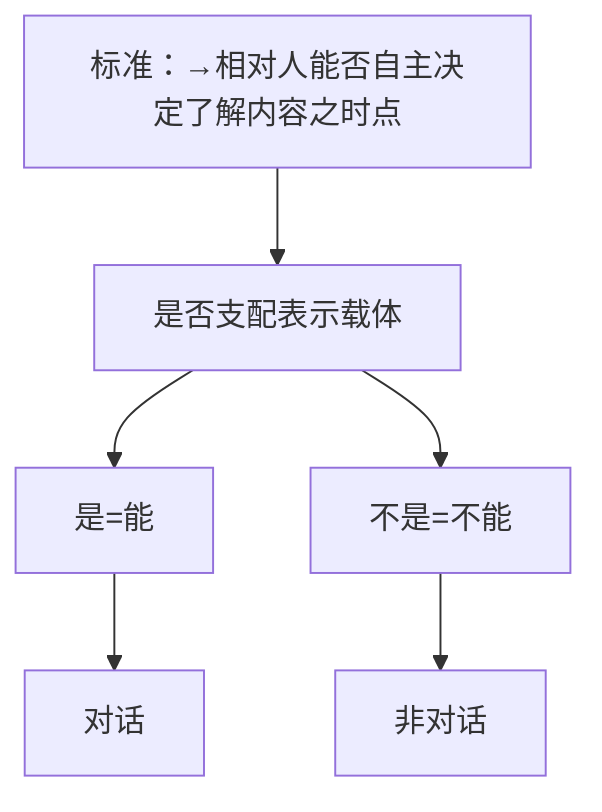
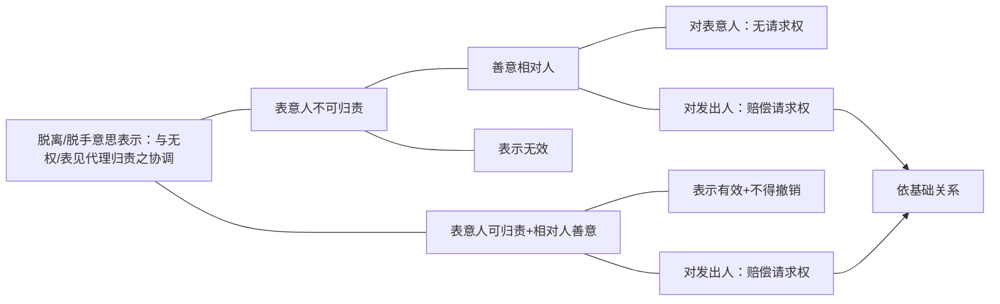

[22](D:\BaiduNetdiskDownload\民法总则22.mp4)
# （一）意思表示之分类：有/无相对人=需/无需受领

[07:27](file:///D:/%5CBaiduNetdiskDownload%5C%E6%B0%91%E6%B3%95%E6%80%BB%E5%88%9922.mp4#t=447.608545)

有相对人意思表示：对话/非对话=在场/非在场
（1）标准：→相对人能否自主决定了解内容之时点

（2）实益：①发出、到达之要件；②撤回？
## 1.区分意义：发出生效与到达生效
- 区分意义：发出生效↔到达生效
- 衍生区别
	- 传达、撤回？
	- 发出之要件

- 意思表示首先分个类，不同的类别的生效所要求的要件就会不一样。首先，意思表示可以分成有相对人和无相对人的。有相对人和无相对人什么意思呢？举个例子：A发一个要约，这个要约怎么样才能生效？A发了一个解除通知，解除通知应该什么样生效？
	- 我们可以看到，在这两种情形呢，A这个表示，是可以让相对人权利义务变化，他的利益可能受到一定的影响，尤其是解除，可以看得很清楚。A说解除，意思表示一到达对方合同就原给付请求权就消灭，这么大的影响要产生效力的话，是不是先得让向对方知道这件事情？所以呢，为了保护这样利益（容易受到A的意思表示一些影响的那个相对人，保护他的利益），相关的权利变动应该让他知道才生效。这样就比较好一点。如果法律作了这样的规定，那么这种表示叫有相对人的意思表示，意思表示要到达他才能生效。

- 看另外一种情形：A手里有一本书，这本书A不要了，扔掉。A在一个没有人看见的角落把这本书扔了，能不能生效？这样扔了、没人看见、没人知道，影响别人利益吗？
	- 不影响别人利益，这个抛弃这个意思表示非常清楚，A抛弃了不影响别人利益，这样的话呢，让这个抛弃的法律行为产生效力，也就不需要让相对人（要么让某一个人）知道为前提。所以，抛弃的行为一做成／做完，不需要有任何一个人知道，抛弃法律行为就生效，意思表示就生效。刚刚讲的第2个例子（抛弃）叫无相对人的意思表示。
	- 所以，通过这两个例子就明白了，有相对人／无相对人指的是：意思表示如果是到达才能生效的，就叫有相对人，如果意思表示发出了，不需要到达就可以生效，那叫无相对人。有无相对人非常简单。
## 2.具体情形 
- 原则：有相对人
- 例外：无相对人
	- 常见情形
	- 特殊类型：需官署受领之意思表示（争议）

- 意思表示之类型
	- 无相对人
	-  有相对人
		- 对话
			- 当面
			- 非当面
		- 非对话
			- 非当面
				- 书面
				- 口头
			- 当面

### （1）原则：有相对人
都应该知道，所谓的意思表示，最后就是要能够构成一个法律行为。而法律行为最大的特点是要按照意思表示而生效。生效了之后通常某一方取得权利，另一方就取得义务，所以，通常的意思表示和法律行为，最终都会影响到某一个人的利益（或者某几个人的利益）。既然影响到他人的利益，那么，法律的基本原则就是意思表示有相对人为原则。被影响到的人应该先知道自己哪些利益会受影响，然后才生效。

对话与非对话 接下去我们进一步区分，有相对人的意思表示里面，又可以分成对话和非对话：
#### （A）对话
对话和非对话很简单，就看相对人能不能自主决定了解表示内容的时间。举个例子：A现在跟B讲话，“B，我这本书5块钱卖给你”，A口头在这样说的时候，说了这个表示，B什么时候听到这句话，B自己决定不了。A什么时候说，B什么时候就听到。A什么时候说，要么B听到，要么B听不到。如果要听到，肯定是A说的这个时间。
所以在这个意义上，他了解表示内容的时间，也是被表意人A决定的。凡是被表意人决定的，这就是对话意思表示。

看下面这个例子：A写了个要约给B看，“B，这是我的要约，你看”。B伸手出来，“A，你交给我看”。A说，“不会交给你的，你就我拿着你看”。问，按照刚才那个标准，这是对话还是非对话？ ^7dncym
#### （B）非对话
- 这个例子先放在一 ^zwca4x边。要换个例子，要对比过才知道这个例子：A现在发了一个电子邮件给B，问，电子邮件是今天晚上7点进入B的邮箱的，现在要问了：B可不可以决定7:01看；可不可以等晚上睡觉之前看；可不可以决定明天再看。都可以。
	- 即然具体了解表示内容的时间点是B这个相对人能自主决定的，这就叫典型的非对话。
	- 现在终局再问一个问题：[[意思表示之生效#^7dncym|纸条案]]是对话还是非对话？——这个是对话，不能望文生义。因为B还是不能决定什么时候看，他如果要看，只能在A给他看的时候看，B没有控制。

- 下面继续：
	- A给B写了一封信，对话还是非对话？——非对话。
	- A给B打电话，“B，我这本书5块钱卖给你好不好？”对话还是非对话？——这个是对话。
	- A给B打电话，B电话没有通，有个语音信箱，B在语音信箱里留言了，对话还是非对话？——非对话。
	- A在微信里留了个语音，“B，我这本书5块钱卖给你，要不要？”对话还是非对话？——非对话。
	- A拍个一个视频，发给B，视频内容是个要约，对话还是非对话？——非对话。

再补充一个：A和B来微信上视频通话，通过视频通话的方式A和B发了个要约，问，对话还是非对话？——对话。
#### （C）载体化
现在会判定之后，就补充两个点：对话、非对话，为什么在非对话的情形，相对人能自主决定了解表示内容的时间呢？而对话为什么不行呢？——可以看得很清楚了，在非对话的情形，相对人之所以可以自主决定了解表示内容的时间，无非是因为有一个表示、表示有一个载体。这个载体被相对人控制了。
写了个电子邮件，就有个载体了，这个载体到对方邮箱里面去了。A写了封信，有个载体，载体到他的邮箱里面去了。A有一段语音，微信上的语音信箱里面，A的语音已经被载体化了，然后又进入到对方的支配领域了，被对方支配了。所以，实际上，所谓的非对话，是表示载体化，并且这个载体被对方控制之后的结果；凡是表示载体化，并且载体会被对方控制的，那也就是非对话了。
### （2）例外：无相对人
例外的情形：哪些情形是无相对人：

- 无相对人之意思表示：常见情形
	- 单方行为之部分：遗嘱（[[../../../../../../法律法规汇编/民商法/民法典/第六编 继承#^n4trml|民法典1123]]）、动产所有权抛弃
	- 双方行为之例外
		- 要约：公告要约（[[../../../../../../法律法规汇编/民商法/民法典/第三编 合同#^opwrtb|民法典473II]]、[[../../../../../../法律法规汇编/民商法/民法典/第一编 总则#^rm106v|民法典139]]）
		- 承诺：意思实现（[[../../../../../../法律法规汇编/民商法/民法典/第三编 合同#^7t31gq|民法典484II]]）？
	- 悬赏广告（[[../../../../../../法律法规汇编/民商法/民法典/第三编 合同#^l3hwxy|民法典499]]）：公告意思表示（[[../../../../../../法律法规汇编/民商法/民法典/第一编 总则#^rm106v|民法典139]]）之一种
	- 沉默之意思表示
	- 需官署受领意思表示：视为有相对人

#### A.单方行为之部分
- 首先，单方法律行为中的一部分是无相对人的：
	- 遗嘱是无相对人的。遗嘱是也会影响到继承人、受遗赠人的利益，但是遗嘱不会让这些人受到一个不利的影响。也就是遗嘱生效了，他能够分到一些遗产，甚至遗产哪怕全部分不到，他也没有受到不利影响，他本来就不应该分到。
		- （可能会问，遗嘱一旦产生遗嘱继承了，他要继承被继承人的财产，是不是要承担债务呢？——我们国家采取的是限制继承原则。也就是说，承担被继承人的债务，它是以继承到的财产为限的。）
		- 所以，讲来讲去，遗嘱虽然会影响到别人的利益，但只给别人好处。所以这个时候也不需要别人知道，【是】无相对人的意思表示。遗嘱还有一个特殊的原因，为什么一定要规定无相对人：因为遗嘱是立遗嘱的人死的时候产生效力。如果它规定到达才生效，这个就不是乱套了：如果到达生效，那也就是他死了之后还没生效，谁都不知道能不能到达，最后能不能生效还不知道，那这个时候怎么办呢？遗产怎么处理呢？不可能一直处于一个悬而不决的状态。
		- 更可怕的是一个遗嘱作为意思自治的工具就失去功能了。遗嘱很重要的是，死的时候一定要生效，这样才能保证立遗嘱人能够按自己的意思处分自己的财产。如果他死的时候能不能生效还不一定，那就意味着他的意志没法得到贯彻了，万一到达不了，那就按照法定继承来了，那么这个遗嘱白立了。
	- 动产所有权抛弃讲过了，不影响任何其他人的利益。
		- 可能会问，“我把东西抛弃，抛到人家家里去把窗户砸了怎么办？”——那是两个不同法律关系：抛弃，所有权的消灭（叫抛弃法律行为的生效，导致了动产所有权的消灭）仍然会发生的。
		- 这个所有权的消灭不影响任何人的利益；但是在抛弃动产的时候同时砸坏了人家的窗户，那这是一个侵权法律行为，用另外一个法律关系来规制。
#### B.双方行为之例外
第2个，双方行为的例外。双方行为想想看，是一个要约，一个承诺，要约承诺肯定是有相对人的，但是这只是原则，但是各有其例外：
##### a.要约：公告要约
- 什么叫公告的要约？——向不特定多数人发出要约：「[[../../../../../../法律法规汇编/民商法/民法典/第三编 合同#^opwrtb|民法典473II]]」![[../../../../../../法律法规汇编/民商法/民法典/第三编 合同#^opwrtb|民法典473II]]
	- 内容大概是这样的，有些广告（通常广告都是要约邀请。但是有些广告自己表达得很清楚，“我就是要约”。这个时候呢，虽然广告是向不特定多数人发出一个表示，但这个时候由于它明确的说了，自己是个要约，那么这个时候它也可能构成要约。或者它虽然没有明确说，但是法官按照这个情况来解释它，认为它足以构成要约的，也可以构成要约。这叫公告的要约，这种要约就变成无相对人了。
	- 它为什么变成无相对人？一一因为它是公开的，在电视上放的，不管有没有人看到，它都是个要约。所以它本身生效，是不以任何人看到／任何人知道为前提，他只是给所有人提供了一个知道的可能性。凡是向不特定人作出的，通常都是无相对人的意思表示。
##### b.承诺：意思实现（区分默示）
- 第2个叫意思实现，看「[[../../../../../../法律法规汇编/民商法/民法典/第三编 合同#^7t31gq|民法典484II]]」。![[../../../../../../法律法规汇编/民商法/民法典/第三编 合同#^7t31gq|民法典484II]]
	- 承诺通常是向【要约人】作出，到达的时候才生效。但是，有一种情形承诺可以不到达要约人也可以生效。「[[../../../../../../法律法规汇编/民商法/民法典/第三编 合同#^7t31gq|民法典484I]]」的「[[../../../../../../法律法规汇编/民商法/民法典/第一编 总则#^hd8s36|民法典137]]」是到达的规定，也就是说第一款讲了，承诺原则上要到达才生效。这句话说明承诺是个有相对人的意思表示。
	- 「[[../../../../../../法律法规汇编/民商法/民法典/第三编 合同#^7t31gq|民法典484II]]」是什么意思呢：比方说A向B发了个要约，要约内容就说了，“你别承诺了，不需要你承诺，直接发货就行了”。
	- 那这样一来是A自己放弃了到达的要求，要约人自己说不到达也可以生效，这个时候就按照要求：把货一发，承诺就生效了。
	- 这里要注意一点，按照通常的承诺，也可以是默示的：A向B发个要约，B直接没有跟A口头或书面的回复，B直接把货给发了，这叫默示的承诺。
	- 默示的承诺和这里的意思实现一样，都是直接把货发了，没有告诉A。但是默示的承诺和意思实现那是生效时间上不同：
		- 如果是A主动跟B说，“你别承诺了，不用发通知给我，直接发货就行了”，这样A放弃了到达的要求（叫意思实现），B的货一发出，承诺就生效了，还没到达A呢；
		- 但如果是默示的承诺，A没有跟B说，“可以不用发通知，不用到达”，这个时候B自作主张，把货直接发了，没有通知A。这个时候货到达A才知道B承诺了，这个时候还是适用「[[../../../../../../法律法规汇编/民商法/民法典/第三编 合同#^7t31gq|民法典484I]]」，是货到了相当于通知到了，所以这个时候才生效。所以意思实现本质上是一种不需要到达的承诺；而默示的承诺仍然是普通的承诺，是需要到达的承诺。
	- 现在知道意思实现和默示的承诺有什么差别了。就是说，如果要约人或者交易习惯没有说承诺的一方可以不通知A，直接发货来进行承诺。假设没有说的话，承诺的这一方面仍然可以通过发货来进行承诺，但这个发货就不叫意思实现了，他叫默示的承诺。
	- 默示的承诺也没有说任何的话，但它是承诺，是承诺就要适用承诺的一般规则：到达才生效。那么这个默示的承诺需要货到了，承诺才到，承诺才生效。只要在要约人明确说，“你可以不必通知我，直接发货”，或者交易习惯上这个行业／地区就是这样的，收到要约就是直接发货的，那么在这种情形呢，承诺人当然可以直接发货来承诺。但这种直接发货的承诺呢，货一发出的那个时间点，承诺就已经生效了，货还没到A就已经生效了。
	- 另外一种意思实现：假设A向B发了一个要约，要约内容没有明确说，可以不需要到达就生效。但是行业里就有这个交易习惯：要发货，合同就会生效。有这么个交易习惯，也应该这么处理。
	- 我们讲，刚刚的「[[../../../../../../法律法规汇编/民商法/民法典/第三编 合同#^7t31gq|民法典484II]]」它的学术上的名称（学名）叫意思实现，希望能够掌握。
	- 第2个，意思实现和默示的承诺有一个差别：就是意思实现必须要符合刚刚讲的要件：要么是相对人明确说，“你可以不用通知”；要么是交易习惯上就有这种做法。否则构成不了意思实现，不能承诺人自己主张说，“我自己是意思实现”，这不可以。
	- 意思实现既然是要约人或交易习惯上放弃了承诺到达的要求（它不需要到达了），所以它看上去就像一个无相对人的意思表示了（有相对人就是到达才生效，无相对人就是不需要到达就生效）。那么这种承诺现在就是不需要到达就生效的承诺，这种情形我们把它叫做“无相对人的意思表思了”：也就是说有一种特种的承诺是没有相对人的。
	- （但是，在这里要先说一句，无相对人的和普通的无相对人的不大一样：它的发出仍然是按照有相对人意思表示的发出的要件（后面会讲到），而是不需要这里的到达了。）
##### c．悬赏广告（公告意思表示「139」之一种）
下面这种无相对人意思表示实际上就是公告意思表示的一种：![[../../../../../../法律法规汇编/民商法/民法典/第一编 总则#^rm106v|民法典139]]![[../../../../../../法律法规汇编/民商法/民法典/第三编 合同#^l3hwxy|民法典499]]悬赏广告。悬赏广告在网页上、好多电线杆上一贴就生效。大家都没有看到也可以生效，这个叫无相对人意思表示。
##### d.沉默之意思表示
还有一种意思表示也是一个无相对人的意思表示：我们前面看到过沉默可以构成意思表示的。在讲表示价值的时候讲过，沉默通常含义过于丰富，所以它不会构成意思表示，但是有的时候因为法律的规定、当事人的约定、交易习惯等等，沉默也可以构成意思表示。那么凡是沉默构成意思表示的情形（因为沉默本身是没有任何行为的，所以不可能到达），本身应该按照一个无相对人的意思表示来理解，至少可以这么去看待它。![[../../../../../../法律法规汇编/民商法/民法典/第一编 总则#^kmyz30|民法典140II]]
##### e.需官署受领意思表示：视为有相对人
- 最后一种无相对人的意思表示比较独特，叫“需官署首领的意思表示”：
	- ![[../../../../../../法律法规汇编/民商法/国务院规定/基金会管理条例#^9lti8s|基金会管理条例9]]
		- 都知道，捐助行为就是设立基金会、设立财团法人的行为。这个捐助行为这个基金成立起来之后，不影响特定人的利益了，它是为不特定的公众或某一公益事业服务的。所以呢，照理说它不需要到达任何人，但国家为了管理需要呢，规定它一定要把文件提交给登记管理机关的。如果你没有提交给登记管理机关，设立基金会的章程什么等等是不会生效的，捐助行为是不可能生效的。
		- 那么这样一种行为的特点：这么一种捐助行为的捐助的意思表示，它必须要到达登记管理机关才能生效的。所以它好像有一个到达的要件在里面，看上去像个有相对人。但是它需要到达的那个主体，它根本不是权利义务的当事人，它本身也不受到权利义务的影响。对比一下解除：A解除和B之间的合同，A要到达受A这个意思表示影响的B，他本身是权利义务所受之人，他本身是当事人。但这里的登记机关，“必须到达登记机关”，但登记机关不是当事人。
	- 接下去看不动产登记条例，不动产的抛弃。动产和不动产的抛弃在一个点上是没有不同的，那就是抛弃导致所有权消灭，不关任何人的事，在这个点上不需要任何特定的人知道。但是不动产的抛弃，有一点不一样：由于不动产是稀缺资源，所以国家对它的抛弃也要进行登记簿上的管控，要维持不动产登记簿的公信力。
		＜不动产登记条例＞第十四条 因买卖、设定抵押权等申请不动产登记的，应当由当事人双方共同申请。属于下列情形之一的，可以由当事人单方申请：（一）尚未登记的不动产首次申请登记的；（二）继承、接受遗赠取得不动产权利的；（三）人民法院、仲裁委员会生致的法律文书或者人民政府生致的决定等设立、变更、转让、消灭不动产权利的；（四）权利人姓名、名称或者自然状况发生变化，申请变更登记的；（五）不动产灭失或者权利人放弃不动产权利，申请注销登记的：（六）申请更正登记或者异议登记的；（七）法律、行政法规规定可以由当事人单方申请的其他情形。
		- 所以呢，在这个意义上，国家规定要抛弃不动产，你得去办登记的。不办登记抛弃不生效力的。所以，按照这个规定来说，A想把自己的房子抛弃掉，A必须把自己抛弃的意思表示去到达到登记机关。如果不到达，不会生效。登记机关也不是A抛弃行为的当事人。
	- 通过这两个例子，知道了什么叫“需官署首领的意思表示”。金老师给它说了两句话：
		1. 它是无相对人的意思表示；
		2. 但是它需要到达一个非当事人的相对人。
	- 所以，本身在到达要件上，我们实际上是把它当作有相对人意思表示来看的，但它的实质是无相对人。其实有相对人不用去记的，都是有相对人的。把无相对人的情形掌握好，还是有必要的。![[../../../../../../法律法规汇编/民商法/民法典/第五编 婚姻家庭#^vx86bq|民法典1049]]

- 实证法
	- 大概知道什么是有，什么是无了。接下去我们看，从条文中来验证一下，有相对人的意思表示：![[../../../../../../法律法规汇编/民商法/民法典/第一编 总则#^hd8s36|民法典137]]
	- 对话非对话都是有相对人意思表示的类型。写了到达生效。而无相对人的意思表示，表示完成时生效：![[../../../../../../法律法规汇编/民商法/民法典/第一编 总则#^svss4i|民法典138]]![[../../../../../../法律法规汇编/民商法/民法典/第一编 总则#^rm106v|民法典139]]
		- 表示完成就可以了，没有说要到达生效的。所以这样讲了之后，牢牢记住：到达生效的就是有相对人。不需要到达的就是叫无相对人。这就是功底了，一想到这个词，马上第一反应是不是对。
		- 这个“表示完成时”，待会会讲的，实际上就是“发出”。“公告发出的意思表示”，实际上就是公告型的无相对人意思表示的表示完成。无相对人的意思表示有的不是公告，有的是公告。那如果用公告来做的时候，它的表示行为完成就是公告。
## 3.衍生区分之意义
现在知道了有相对人、无相对人，有相对人里面会判定对话还是非对话，接下去我们看区分到底意义在哪里：
有相对人的，到达才生效；无相对人的就是发出才生效（发出就生效，不需要到达），前面讲过表示完成就是指的是发出。因为有这个区别，会有几个衍生出来的区别（就是刚刚那个发出生效还是到达生效，是有相对人、无相对人最根本的区别，因为有了这个区别，后面还会有其他几个区别，大致掌握一下）：
### （1）传达
- 有没有传达的问题（与传达相关的概念叫使者）。A要向B发个要约，但A自己没空去，对C说，“C，请你帮我给B转告一下，5块钱买这本书要不要”，这个时候C就是A委托的使者（叫表示使者，使者中的一种，替A去传达表示）。所以，C（使者）的功能是把A做成的意思表示传递到B那边去。
	- （所以传达传达，传而达之。所以传达是以到达为前提的，到达过程中，只用了别人来传，所以叫传达。）
	- 那么无相对人的意思表示，由于没有到达的问题，所以就不会有传达的问题。因为传的目的是为了“达”，才能叫传达。无相对人的意思表示没有传达，因为没有“达”。

- 表示行为的代为
	- 无相对人的意思表示是不是有请别人做的呢？他如果请别人做，是不是叫传达呢？A要把一本书扔了，今天是在没力气扔，跟儿子说，“你去帮爸爸把这本书给抛弃了”，儿子到外面去把这本书抛弃了。这是传达吗？
		- 这不是传达，因为它不需要到达。这叫抛弃意思表示的代为，找一个人替A来做，替A把这个表示过程完成。这个时候叫无相对人意思表示的代为（或者叫抛弃法律行为的代为）。
	- 还有一个，遗嘱可以找人代书：![[../../../../../../法律法规汇编/民商法/民法典/第六编 继承#^foijs7|民法典1135]]
		- 刚刚讲过，遗嘱是无相对人，无相对人也叫别人在写了，也叫别人在代做，这个时候它不叫传达，因为它不需要“达”。所以呢，代书行为永远只是表示行为的代为（代为完成表示过程）。
		- 那么这里面，其中找人帮A把某个东西抛弃了，这个一方面，是表示行为的代为，另一方面同时相当于还是发出，这两个是合一的（待会儿会讲到，这个先不说）
### （2）撤回
- 有没有撤回的问题。意思表示的撤回![[../../../../../../法律法规汇编/民商法/民法典/第一编 总则#^n0lt4c|民法典141]]
	- 有相对人的意思可以「[[../../../../../../法律法规汇编/民商法/民法典/第一编 总则#^n0lt4c|民法典141]]」所称的方式来撤回，叫到达前的撤回只能适用于有相对人的意思表示。
	- 因为这个到达前的撤回，它的概念就决定了：它是必须在到达之前才能撤回。那么只有在可以需要到达的意思表示，才会有这个概念。这很简单，不用多说。
- 第2个，无相对人的意思表示有没有撤回呢？A把一本书扔了，扔了之后又后悔了，连忙把它捡回来，这叫不叫撤回？
	- 不叫，因为抛弃一扔出去，A的抛弃法律行为就生效了，它就变成一个无主物了。自己再去捡回来叫先占，A自己把自己以前的东西先占了，可以的，重新取得所有权，这根本不叫撤回。

- 遗嘱之“撤回”？ ^tnjvcd
	- 另外一种无相对人的意思表示是遗嘱。遗嘱好像可以撤回的：![[../../../../../../法律法规汇编/民商法/民法典/第六编 继承#^jw7dzt|民法典1142I、II]]某甲3月10日立了一个代书遗嘱，立完之后他能不能撤回自己的遗嘱？
		- 把遗嘱撕掉就就撤回了。或者它写了个自书遗嘱，他也可以撤回：把遗嘱撕掉，或者在遗嘱上面写个字，“撤回该遗嘱”，签个名，遗嘱就没有了。刚刚讲过，无相对人的意思表示没有撤回的问题：注意，所谓的“无相对人意思表示没有撤回的问题”指的是没有这种到达前的随意撤回的权利，这么一种到达前的撤回，是“无相对人意思表示”里没有的，其他的撤回还是有可能有的。
		- （遗嘱）就是一个无相对人意思表示可以撤回的。但这个撤回是不是到达前的撤回？遗嘱的撤回「[[../../../../../../法律法规汇编/民商法/民法典/第六编 继承#^jw7dzt|民法典1142]]」和上面「[[../../../../../../法律法规汇编/民商法/民法典/第一编 总则#^n0lt4c|民法典141]]］所称的撤回不是一回事，这里不是到达前的撤回，这里是生效之前随时可以撤回的撤回，是另外一种类型。
### （3）发出之要件
第三个衍生的区别：发出的要件不一样（发出的要件哪里不一样待会儿就会讲到），因为无相对人的意思表示呢，发出就生效了，它不需要到达。所以在发出是不是在构成的要件里面，不需要考虑自己这么发出是不是会到达。“是不是会到达”这么一种因素不会影响发出的构成。

而对于有相对人的意思表示呢，因为是到达生效的，所以发出“是不是会到达”反过来会影响发出的构成。
# （二）意思表示之发出
## 1.发出之意义：诸多法律问题之判定时间点
1. 意思表示之有无：表示行为之完成
2. 行为能力之有无
3. 错误之有无
4. 表意人死亡之影响？非→要约：补充解释
5. 无相对人意思表示：发出生效

大概知道了发出的判定标准之后呢，我们看，发出的意义在哪里：
### （1）意思表示之有无：表示行为之完成
发出的第一个意义：一发出，就表明意思表示已经完成了。为什么发出能够决定意思表示的有和无？——因为发出之前没有法律拘束意思，没有法律拘束意思就没有意思表示。发出必须表达出法律拘束意思，有了法律拘束意思那就表示价值、外部行为具备，就有可能构成意思表示啊。这是第一个点。
### （2）行为能力之有无
- 第2个点，行为能力的有无，应该以发出的时间点来进行判定。看这个例子：甲出生于1993年1月1日，接到乙以20000元出售其电脑之要约，于2011年1月1日发信为承诺，该承诺信于2011年1月2日到达乙处，问该合同的效力如何？ ^klrn9p
	- 我们看发出的时间点，他还是限制行为能力人。而这封信到达的时候，他已经是完全行为能力人了，问，他行为能力有没有是按照发出的时候看，还是按照到达的时候看？按发出就是限制行为能力，这个合同要效力待定的；如果按照到达的时候看，它就是有行为能力的，这个合同就是完全有效的。
	- 这需要了解为什么法律会规定行为能力制度：说你这个行为能力不足的人，有些意思表示／法律行为，他作出不让它生效，因为它担心行为能力不足的人做的意思决定呢对他自己不利，正因为行为能力不足的人做的决定可能对它是不理性的、不好的，所以法律说，行为能力不足，意思表示效力有问题，不让它生效。所以行为能力的目的在于保护意思决断不足的人不要随便去做意思决断（做的决断对他自己是不利的，所以法律用行为能力制度来保护），做了决断，不产生效力，那不就保护好了吗。
	- 所以说，从这个立法目的出发，应该以发出的时间点（也就是做意思决断的时间点）来判定行为能力值有无。立法目的是说，怕你做决断的时候对自己保护不够，自己没这个能力。所以能力的有无就是要以意思决断的时间点来判定，意思决断的时间点就是发出的时间点（有法律拘束意思的时间点）这样肯定明白了。

- [[意思表示之生效#^klrn9p|这个例子]]稍微改一改：A发信的时候，发成了信的时候，有行为能力的。到信到达的时候，丧失行为能力了，疯了。问这个意思表示算有行为能力的意思表示还是无行为能力的意思表示呢？合同效力如何呢？
	- 有行为能力、有效。 
	- 特别注意的是： 
		- ![[../../../../../../法律法规汇编/民商法/民法典/第六编 继承#^9t2tyb|民法典1143I]]
		- 继承法意见 41：遗嘱人立遗嘱时必须有行为能力。无行为能力人所立的遗嘱，即使其本人后来有了行为能力，仍属无致遗嘱。遗嘱人立遗嘱时有行为能力，后来丧失了行为能力，不影响遗嘱的致力。
		- 没有这个条文，也是这个规则，有这个条文，也是一样的规则。因为这就是原理。
### （3）错误之有无
- 第三个，错误（重大误解）之有无也要以发出的时间点来判定，我们来看：乙认为自己手中的唐伯虎名画是仿作，向甲发出以5000元出售之要约，发出后，丙告知乙该画是真迹（实际上是仿作），乙非常后悔，在该要约到达甲后要求撤销。问，乙能不能撤销这个要约／法律行为？乙在发出的时候，认识有没有错？
	- 其实没有错，但是在发出之后到达之前，由于有个丙告诉他是真迹，他信以为真。发出之后认识反而错了，问，这个时候他能不能撤销？
	- 答案很清楚：发出的时候没有错就意味着整个意思表示没有错误，哪怕发出之后新发生了错误，那不能撤销。因为重大误解制度作为意思表示瑕疵的一种，它保护的就是（原则上）你做意思决断的时候有无认识的错误，他就是保护这个的。现在意思决断的时候没有错误，后面的错误当然不能构成意思表示瑕疵，就意思作决断的时间点特别重要的。

- 看下面这个例子：乙认为自己手中的唐伯虎名画是仿作，向甲发出以5000元出售之要约，发出后，丙告知该画是真迹（确为真迹），乙非常后悔，在该要约到达甲后要求撤销。若乙发现真相后，本可阻止要约到达甲，却未采取措施？ ^5h6yss
	- 问，此时能不能撤销？发出的时候有没有错？——发出的时候有错，就可以。后面发出之后发现真相了，变成没错了。后面认识到真相不影响以前是错，所以意思决断的时间点是错的，那就是错了。
	- 现在产生一个问题：乙发生真相之后，本来有办法阻止要约到达的（丙告诉他的时候，快递还在路上的，他本来可以完全给快递打电话说，“你回来，你别送了”），但是，他没有阻止，却轻任这封信到达了甲。问，这个时候乙还能不能撤？
	- 他前面意思决断的时候还是有错的，但他在这封信到达之前发现了错误，按照诚实信用原则要不要去采取措施啊？—能采取措施要采取的（能把它叫回来就叫回来，不要导致甲的信赖了）。所以，在这种情形，有一种学说认为，如果有能力阻止要约的到达（一开始做错了，错了之后马上发现了，发现了之后是有能力阻止要约到达的却不阻止），这个时候按诚实信用原则，到达之后，就丧失撤销权（相当于自己抛弃了撤销权）。

- 例外
	- 所以通过[[意思表示之生效#^5h6yss|这个例子]]很清楚了：有没有错误，就是以发出的时间点为断，因为意思决断的那个时间点是在这里。但是有个例外（民法是个体系，例外在这个时候把它记上去，效率就高了，不能零碎）：错误居然不以发出时为断，以发出后为断——传达错误。这个勉强可以算在这里的例外。
	- 把例子改一改：A跟B发一封要约，A对C说，“你帮我去传句话，5块钱这本书卖给他”，结果C到了那里之后忘了A这句话（他想错了）。C对B说，“A想2块钱那本书卖给你”，书也说错了，换了一本书。A在发出的那个时间点，是哪个时间点？
		- 这是口头传达：
			1. 要把表示内容告诉C。
			2. 同时做完指示。
		- 现在A对C说完这句话，指示说完了，A没有错，心里想的就是“这一本书，5块钱卖给B”，没有错。但是到达B的时候，C帮A说错了。所以，这个时候的错发生在到达时候的错，它不是发出时候的错。这个时候这个错就例外的可以撤了，还是可以撤的。
		- 所以说，错误一般都发生在A作意思决断的发出的那个时间点。但传达错误的错发生在到达的时候。
### （4）表意人死亡之影响？非→要约：补充解释
#### A.原则：不影响
- 接下去，表意人死亡的影响：某甲向某乙发了个解除通知，发出之后、到达之前某甲就死了，问，这个解除通知有没有效？
	- 关键是发出的这个时间点这个人活着，它的意思决定没有瑕疵。所以呢，在发出之后表意人死了根本就不会影响意思表示的效力。

- 第2个：某甲向某乙发出了一个要约，“向乙购买5本书”。发出之后，到达之前，某甲就死了，现在问，这个要约还有没有效力？要约到达之后的效力是什么？
	- 通常都是有效力的；要约一到达对方，对方就取得了一个承诺资格，这个承诺资格当然是有效的。
	- 现在，因承诺资格，原来死之前的那个人，本来要约一到达，他就受这个承诺资格的拘束的（必须要等对方在承诺期限内会不会作承诺，对方如果在承诺期限内做了承诺，合同就成立了），所以又个隐形的义务在拘束这个表意人。现在表意人死了，这个隐形的拘束就被它的继承人继承了，所以这个承诺资格可以对表意人的继承人行使。这个时候，对方（收到要约的人）做个承诺，承诺一到达表意人的继承人就生效。
#### B.例外：补充解释
- 但是，在有些特殊的情形（比方说买的东西只有表意人自己能用的情形），要不要认为这种情形例外的通过补充解释，认为要约不产生效力？比方说：某甲患有严重的某一种极其罕见的疾病，这种罕见的疾病要治一种罕见的药，别的人不用治，就这种疾病的人要治。某甲现在发了个要约给某乙，要买这种罕见的药，在要约发出之后，到达之前，某甲死了，这个时候要不要例外的认为，这个要约是不具有拘束力的？
	- 因为我们从某甲的行为，可以来假设（补充解释）：如果某甲知道自己要死了，他就不会去想要买这个药，而这样对方也应该可以看出来这一点。
	- 这样通过补充解释的方法，说例外的情形，可以认为要约不产生效力。要约不产生效力，对方就不产生承诺资格，没有承诺资格，合同就不成立，那么某甲的继承人就不会受到这个隐形的拘束。
### （5）无相对人意思表示：发出生效
最后一个，发出对于无相对人意思表示有个特别的意义：那就是发出就生效了。

（这些内容全部要背下来的，一点都不能漏。这就是真正的技术和功底，脑子里全部记住了，功底自然就好了，如果没记住，功底不会好的，没有侥幸的。在这里强调一下，否则自己吃亏。）
## 2.发出之判定标准
### （1）终局性
接下来讲发出，发出的意义问题：第一个，A向B发个要约，A是嘴巴说的。这个时候，发出的缔约意义就出来了：A说出来那一刹那，就是发出了。因为A跟B面对面的时候，A说“5块钱卖给你好不好”，一说出来，A这么说的时候已经表达出了终局的意思决断。A是想把这本书5块钱卖给B，一个正常人都会认为A有了最终的决断——5块钱买给B。
那么这个终局的决断，其实就是意思表示构成要素里面，外部要素中的一个，叫法律拘束意思。所以发出，一定是把法律拘束意思给表达出来了。“终局性”（见[[意思表示之生效#^4iqg1w|下图]]）：A终局的把意思表示表达出来了。
#### A.终局的意思决断≠意思表示之做成
- 这里的所谓的“终局的意思决断”表达出来了，它不等于意思表示的做成。刚刚是A口头的，这样的“做成”和法律拘束意思的表达不可能是分开的。但是A若是书面的表示的时候，就有可能分开了：
	- A把这封要约信都写好了，放在桌上，要不要寄A还不确定，这个时候表示做成了。但是A终局的意思决断没有做成，法律拘束意思还没有的。A的秘书看到这封信帮他寄掉，这个时候，实际上就没有发出。A是没有发出的，因为A没有表达出A终局的意思决断，秘书替A发出，那是另外一个问题了，那是[[意思表示之构成要素（2）#（D）脱离意思表示%%脱索的意思表示、遗失的意思表示%%（对通说观点之批判）|脱索意思表示]]%%脱离意思表示%%的问题，本身它不构成发出。
	- 所以，在金老师举的这个例子里，书面表示也好，口头表示也好，有一个共性：一定要一个客观的人／正常的人看到A这个行为，都会觉得A作出了终局的意思决断——法律拘束意思有表达。
#### B.有相对人：终局性＋通常可预期到达
- 发出之判定标准 ^4iqg1w
	- 依表意人之意思→例外：[[意思表示之生效#^8164yy|脱手意思表示]]
	- 无相对人：终局性→表示完成（[[../../../../../../法律法规汇编/民商法/民法典/第一编 总则#^svss4i|民法典138]]）→公告发布（[[../../../../../../法律法规汇编/民商法/民法典/第一编 总则#^rm106v|民法典139]]）
	- 有相对人（无规定）：终局性（≠作成）+通常可预期到达
		- 向正确相对人运动
		- 正常情形可到达

- 第2个，如果，为什么A跟B这么一说，就认为是发出了—因为终局意思决断表达了。中间也没有什么噪音，也没有什么东西隔着AB，表意人有理由认为A这句话B能够听清，能够听明白了，正常人是不是都这么认为。这样的话，就算发出了。这是发出的第2个要素。
	- 如果是：（跟B在说这句话的时候），“B，5块钱卖给你，好不好”，A刚说到“B，5……”，旁边一列高铁飞驰而过，噪音非常大，A自己都听不见自己讲的话，但A还是把这句话讲完了，问，这个时候发出没有？
	- A还是表达出A终局的意愿，但是A没有理由认为B这个时候能够听见自己说的话。所以呢，第二个“通常可预期到达”就不具备了。这个时候，我们讲，它仍然不是发出。看下面这个例子：A给B写了一封要约信（表示做成了）。接下去，A把它投进邮箱了（终局的意思决断也表达出来了），还要考虑一点：通常能不能到达。如果A投递邮箱的时候，把B的地址和名字全都写错了，本来心里想的是给B发，信的内容也是给B发，但是上面的地址和名字都是C。
	- 这个时候A没有理由认为A这封信会到达B，此时仍然不构成发出。A投寄邮箱，表达出了终局的意愿，但是由于地址填错了，所以A没有理由预计会到达，也不构成发出。
	- 为什么在有相对人意思表示里要讲这个要素？——因为有相对人的意思表示最终目的是为了让它生效，而它要生效，必须要到达。所以在判定发出要件的时候，就一定要考虑到它的目的是到达。所以只有在有可能到达的情形，才判定它为发出，才有意义，所以给它加上第2个要素。
#### C.无相对人：终局性（即表示完成）
- 接下去看，无相对人意思表示：A把这本书拿到垃圾桶，往下一扔，一个正常的人看出来A已经做了一个终局的意思决断：抛弃（真的、严肃的想抛弃它，法律拘束意思表达出来了）。
	- 法律拘束意思一表达出来，意思表示就存在了。那么这个意思表示能不能生效取决于构不构成发出。这个已经存在的意思表示能不能生效：要看它是有相对人还是无相对人。有相对人必须要到达；无相对人不需要到达，发出就可以了。
	- 本案发出没有？——无相对人的意思表示，它的发出概念，实际上就只需要把终局的意思表达出来就是发出了，这两个又重合了。所以呢，刚刚那个抛弃的案件：一抛弃，法律拘束意思就具备了，终局性就有了，所以就发出了，同时表示就完成了。意思表示就生效了。所以呢，如果是以终局的意思表示导致了表示完成就是“发出”。而公告发布无非是表示完成表达出终局意思表示的一种特殊形态。
### （2）依表意人之意思
发出还有个要件，原则上要依表意人的意思。秘书帮A发出，那就不是A的发出，所以A这个意思表示还没发出。也就是说，通常的发出都是A自己发出的，所以要依表意人的意思而发出。

- 例外：[[意思表示之构成要素（2）#（D）脱离意思表示%%脱索的意思表示、遗失的意思表示%%（对通说观点之批判）|脱手意思表示]]（与无权／表见代理规则之协调） ^8164yy
	- 第二个，就是例外情形，我们的发出（像秘书帮A发出的情形），虽然要个讲起来不构成发出，不构成发出就没有意思表示。但这个时候那个相对人也不知道是A的秘书发出的，所以为了相对人的保护，他收到这封信，他也不知其所以然（有可能做了好多准备工作等等）。为了保护相对人，有可能在这个时候例外的会认定仍然构成发出，目的是为了保护相对人。
#### （A）表意人不可归责
- 看怎么样来保护的： 
	- 如果[[意思表示之生效#^8164yy|这个时候]]A没有错：A这个信放在桌上，有个小偷进来偷了A的信，然后又把这封信寄给了相对人（他对相对人有仇，要骗一骗相对人）。
	- 这个时候A一点错都没有，即然A没有错，通常认为，这个时候，这个表示还是不能生效。那么对待相对人的善意怎么办：这个相对人可以选择去找那个小偷要求赔偿（他做了准备等等也好，这个时候按照侵权等等进行赔偿）。也就是说，A如果完全没有错，这个时候，法律上可能还会规定，即使有人帮A发出了，而对方是善意的，仍然A这个表示是不构成发出的。不构成发出的，所以“表示还是无效的”（实际上不是无效，不构成发出意味着意思表示都没有）。那么善意相对人的信赖怎么办？——你自己去找小偷吧。
#### （B）表意人可归责＋相对人善意
- 第2种情形就不一样了，善意保护会导致发出了：如果这封信放在桌上，是A自己的疏忽。A应该知道自己的秘书每天都会帮自己寄信。所以，A作为一个理性人：本来应该这封信自己还没决定好的话，不应该放在这个位置的，结果A还是放在这里了。这个时候，相对人完全无辜，A这边还有点错，两个人谁更值得保护啊？
	- 这个时候会说，对方更值得保护。所以呢，这个时候为了对方的保护，实际上A并没有发出，另外一个人替A发出了（而且没经过A的授权发出的），这个时候呢，我们会认为，叫表见发出（实际上不是发出，但为了保护对方，认为仍然发出了）。为相对人信赖认为仍然构成发出。
	- 仍然构成发出，这个意思表示就存在了，到达对方就生效了，生效之后，还不能撤销。那么这个时候，也就是这个表示完全有效的，A就要该履行的履行了。A怎么办呢？——A对擅自发出的人（秘书），看他也没有错，有错可能可以要求赔偿。这个赔偿根据秘书跟A有劳动合同（基础关系）来。
	- 所以通常的发出，都是按照表意人的意思发出的。但是有一个例外的情形，有人未经A的统一，擅自帮A发出，这个叫脱索／脱离的意思表示。这个时候可能要保护善意啊等等。这是发出的大致的一个判定的标准。
## 3.具体情形之判定
- 具体情形之判定 ^v5mgni
	- 有相对人
		- 非对话
			- 其他书面
				- 亲自投邮
				- 传达之指示
				- 指示他人投邮
				- 面交：供收取或交付？
			- Email、传真、电话答录机或微信留言
		- 对话
			- 直接：客观相对人足听/足见
			- 口头传达：使者足听/足见
	- 无相对人（→委托他人发布？）
		- 遗嘱
		- 公告意思表示
		- 动产所有权抛弃

接下去看，下面的情形，哪些情形是发出了？或者它发出的时间点怎么判定，一个一个来对一对：
### （1）有相对人
#### A.非对话
##### （A）亲自投邮
- 在非对话的情形，A去投邮，投进邮箱是发出的时间点；快递就是交给快递员。投进邮箱才表达A终局的意思。A写了一封信，想向B发一个要约，A觉得通常寄信太没意思了，所以A就把给B的这封要约信装进一个玻璃瓶里面，扔进了大海，希望有一天这个漂流瓶能够漂流到B的手中。问，这个发出的时间点是什么时候啊？
	- 一般认为，这个时候是没有发出的。发出要件不具备，不存在哪个时间点发出的问题。扔出去的时候表达了终局的拘束意思，但是按通常情况它不会到达的。所以这个时候通常会认为这时不发出。那么不发出又可能会有疑问：万一收到了怎么办？
	- 我们讲，在有相对人意思表示生效里面，哪怕本来是不符合发出要件的，最后只要到达了，仍然会生效，到达是王道（至少是这么一种解释）；而另一种解释就认为，哪怕扔进漂流瓶，通常没办法到达，也最好认为已经发出了，万一他会到达它就可以生效，这是另外一种说法。金老师个人采取的是第一种说法：你通常收不到的不算发出。
##### （B）传达之指示
- 第2个，A写了一封要约信，交给C说，你帮个忙，帮我去送给B。问，这个时候，哪个时间点算发出？
	- 注意一下，这个时候一定是把信交给C并且向他作出指示，两个不可缺的。A光指示，“你把信交一下”，信没交给C不行。A要信交给C，最后交给C还要明确给他讲，“你去帮我送给B”。
	- 指示完成、信要交付，简称为指示的时点为信发出的时点。

- 如果没有写信呢：A口头跟B说呢？“C，我这本书要5块卖给B”，麻烦你去转告一下。问，哪个时间点发出了？
	- 这个是口头传达，刚刚那个是书面传达。这是哪个时间点？
		1. 是A把表示内容，把表示内容告诉 B；
		2. 并且说“麻烦／请你你帮我转告一下”。
	- 两个具备才指示完成。
		- 所以，书面的传达，一定要把表示内容交给它，然后再说“请你帮我送过去”才指示完成。
		- 口头传达的时候呢，A要口头把表示内容告诉C，并且要指示完成。
##### （C）指示他人投邮
指示他人投邮呢？

A写了这封信，跟C说，“你帮个忙，帮我扔进那边那个邮箱”，C过去帮A投邮了。问，哪个时间点算是发出啊？是投进邮箱还是做完指示？
这个时候都认为，也是认为做完指示就发出。
##### （D）面交：供收取或交付？当面交给对方一个文件：
- 这封要约信A直接交给B，“B，来，这是要约信，交给你”，问，什么时候发出，什么时候到达？
	- 一种说法说，“B，请你来拿”。占有还没移转呢，只要A说出了这句话，已经发出了，然后交到B手里是到达。
	- 另外一种观点认为，A必须要交到B手里，才是发出。
	- 通常会认为，A说，“来，给你”，已经表达出了终局的意思了。这个时候已经可以认为，这个时候已经构成发出了，不需要交付，交付是到达的要件。
##### （E）Email、传真、电话答录机或微信留言
- 接下去看：
	- A给B写个Email，什么时候发出啊？A点击发送，并且页面上显示“发出成功”，就是发出了。
	- 如果A点击发送（Email），一点击的时候页面显示，“对不起，网络崩溃”。这个时候有没有发出啊？一一没有发出。
	- 传真什么时候发出啊？——A点击发送，整个传真指示针转了一圈后，显示“发送成功”，A就发出了。A点击传真，绕了一圈，显示出“传真机有故障”，中间卡纸了，那这个时候发出没有？——也没有发出。
	- 电话答录机或微信留言什么时候才发出？——A说完了，没有迹象表明不成功（也就是A有理由认为留言成功了），那么这个时候就算发出。

一定要是点击发送，并且整个过程完成，并且最后体现出来没有不成功的迹象，就发出了。

[01:13:00](file:///D:/%5CBaiduNetdiskDownload%5C%E6%B0%91%E6%B3%95%E6%80%BB%E5%88%9922.mp4#t=4380.865012)

#### B.对话
##### （A）直接：客观相对人足听／足见
- 这就是非对话里面发出的判定，接下去我们看对话发出的判定：A跟B直接打电话，“B，5块钱卖给你好不好，我这本书很好的”，问，这个时候什么时候发出啊？
	- 很简单，因为对话意思表示有个特点：A发出和所谓的到达其实时间同时的，他要么听到要么不听到，听到和A讲话的时候同时的。在这种情形下就等于说
		1. A只要话一说完，A终局的意思就表达出来了；
		2. 第2个，A只要有理由认为对方能够听到自己的声音（中间没有任何噪音或者杂音的，它的反应A都听的见），这个时候A就有理由认为A讲完这个话他就听见了，这就是发出。

- 反过来前面讲到的，A打电话打着打着，这句话说出了一半，对话中间突然断了几秒。问，发出没有？
	- A没有理由认为对方听到自己声音了，那就没发出。也就是说，在这个时候，所谓要发出，一定是A的终局意思要表达出来。但是A同时要确保A说的话，进入到对方的听觉系统，或者A有理由认为进入了听觉系统。
	- （所以在这个意义上，要注意，和Email、传真其实是一样的，这只是把B的听觉系统比喻成一个接收器而已，相当于A没有感觉到异常，意味着A有理由认为进入了对方的听觉系统，那么这就算发出了；如果A没有理由认为进入了听觉系统（刚刚举的例子），这个时候就没发出了。）

- 接下来看： A说，“B这是我写的要约”，请你在这里，我拿给你看。这是对话。这个时候什么情形算发出？
	- A让他看，就终局的意思表示表达出来了，但是这个时候一定要保证他能够看清，能看清里面的图形文字，这样才算发出（A有理由认为这个文字上的信息能够进入到它的视觉系统。）

- 看／听不见
	- 什么情形下会不发出呢？比方说：A在崇法楼，A知道B在c102，A在那里朝着c102的方向大喊一声，“5块钱卖给你，好不好”，发出了没有？为什么？——没有；A没有理由相信／认为B的听觉系统能够收到自己这句话，就没有发出。
	- 现在A在崇法楼，A在这里给C打电话，说，“C，我在崇法楼，我知道你在，c103，来，我手里举一封要约信，你来看吧”，发出了没有？——没发出，不可能看到的。
##### （B）口头传达：使者足听／足见
接下去，另外一种对话方式：口头传达。

- A对C说，“C，我要5块钱这本书卖给B，你去替我传个话好不好？”A什么时候才发出？
	- A这句话告诉B，并且做完指示了。
	- 但这个发出有个要件：A作指示的时候，A说的这句话和指示内容A都要有理由认为能够进入使者C的听觉系统的。

- 同样的：现在让C去传达，A给C说，“C，5块钱要卖给B，请你帮我传句话好不好？”在A说到“5块钱卖”这句话的时候，一辆高铁呼啸而过，A自己的话自己都听不见，问发出了没有？
	- A的口头传达的指示没有发出，口头传达的指示本身就是个意思表示，这个意思表示没有发出它就不会生效，不会生效就不会导致被传达的意思表示发出。
	- 为什么这里是指示为准：这个指示的意思表示到达了这个使者，这样才能构成一个有效的指示，才会让被指示传达那个表示本身构成发出。
### （2）无相对人
接下去看无相对人的意思表示什么时候发出：无相对人意思表示实际上就是两个要件（你说一个要件也行，要表达出终局的意思），而这个终局意思的表达一定要同时导致表示过程的完成，这两个往往是二合一的。
#### A.遗嘱 
遗嘱什么时候构成发出？什么时候表示完成？—要知道，遗嘱是类型法定的。法律规定了那么多遗嘱形态，你只能从里面选一种，自己不能创造新的遗嘱形式：自书遗嘱（[[../../../../../../法律法规汇编/民商法/民法典/第六编 继承#^b8xz3r|民法典1134]]）、代书遗嘱（[[../../../../../../法律法规汇编/民商法/民法典/第六编 继承#^foijs7|民法典1135]]）、录音录像遗嘱（[[../../../../../../法律法规汇编/民商法/民法典/第六编 继承#^q6bl9f|民法典1137]]）、打印遗嘱（[[../../../../../../法律法规汇编/民商法/民法典/第六编 继承#^a2w43u|民法典1136]]）、公证遗嘱（[[../../../../../../法律法规汇编/民商法/民法典/第六编 继承#^6clv5r|民法典1139]]）还有一个紧急的时候的口头遗嘱（[[../../../../../../法律法规汇编/民商法/民法典/第六编 继承#^jqmj0p|民法典1138]]），就那么多，你就这里面挑，挑一种用，不可能自己创造新的。所以呢，当立遗嘱人挑了某一种形式完全符合这种形式的额遗嘱类型要件的时候，它就构成发出了。

比方说自书遗嘱，他要符合自书遗嘱的全部要件具备了它就算发出了，终局的意思决断就有了；代书遗嘱符合代书遗嘱的一切要件，也就发出了；打印遗嘱，比方说打了一张纸，上面有签名，并且使两个以上证人都在每一页签名，他自己也在每一页签名，这就符合打印遗嘱的要件了，一符合要件，终局意思决断就有了。所以通常认为，在那个时间点遗嘱就发出了，而遗嘱的表示过程就完成了，表示过程一完成，按照「民138」就认为就生效了？——但是注意一下，遗嘱没有。这里只能说遗嘱的生效要件之一具备了（遗嘱还需要表意人死亡才能生效，此处仅构成发出）。

（所谓的意思表示到达生效，不是意味着到达必然生效，它会只是生效的要件之一，不一定是必然生效，有可能意思表示有另外的生效要件。但是（待会儿会讲到），也可以说，通常情形，一个意思表示，到达就生效了。只是这个“生效”和法律行为生效的效力不同。这个以后在讲解，这里不多说。）

总而言之，遗嘱符合某一种遗嘱的全部形式要件，我们就认为它已经发出了。发出了之后，遗嘱的意思表示本身，可能就已经让它生效了。但是整个遗嘱、法律行为还要到当事人、表意人死的时候才产生效力。

这个可能现在还不能理解，以后讲到了意思表示的生效和法律行为的生效关系就理解了。再说一遍：遗嘱只要一具备某一种遗嘱的要式（各种形式都具备），就发出、（意思表示）生效了。生效之后呢，但是这个遗嘱（法律行为）还没生效，法律行为要到死的时候才生效。
#### B.动产所有权抛弃
- 接下去再看动产所有权的抛弃，意思表示什么时候生效：要表示完成，把东西表达出终局的意愿（扔到垃圾桶），马上抛弃的意思表示就产生效力了，表示过程完成了。在这里面，意思表示一生效，由于是单方法律行为，抛弃法律行为就构成了。抛弃法律行为因为占有一方放弃，抛弃法律行为那个要件也就具备了，所以抛弃法律行为就生效了。
	- A往垃圾桶一扔，首先是表达出了终局的意思决断，让表示行为完成，所以，抛弃意思表示产生效力。
	- 抛弃意思表示产生效力之后呢，马上就会构成一个抛弃法律行为（单方法律行为只需要一个意思表示就构成），所以这个意思表示一构成的情形，同时就会让抛弃法律行为构成。而抛弃法律行为有个特别生效要件，那就是占有一定要放弃掉。
	- 现在A扔进垃圾桶就是同时放弃了占有，所以呢，它特别生效要件也具备了，所以抛弃法律行为就生效了。相当于意思表示的成立、法律行为的成立、法律行为的生效，三个过程是合一的。
#### C.公告意思表示→委托他人发布？
接下去，公告意思表示：什么时候生效？

- A往电线杆上贴一个条，“谁把我的狗抓回来，我给他5k块”，这个意思表示什么时候生效？
	- A往上一贴，就表达出了A终局的意思决断，同时也完成了这个表示过程，此时公告意思表示本身就可以产生效力（发出了）。

- A在报纸上登报，在报社做一个委托，最后报社帮A等出来，问，A这个意思表示什么时候发出？是A跟报社说，“请你帮我登记这个广告”，登这个要约。是指示的时候是发出，还是登出来是发出？
	- 这个是容易弄错的。这个时候就不再是指示了，因为虽然A作指示的时候已经下了终局的意思决断了，但A的指示内容很清楚：A的表示是要登出来才完成的（所以整个表示行为没完成）。虽然跟报社说的那一刹那，A已经有终局的意思决断了（委托合同都签了）。
	- 但是按照A的意思，A只是委托它（报社）向公众说。这个向公众说的，一定是在报纸上向公众说的，那才是A的表示。所以，A对报社说的时候，只是在做一个指示，就指示而言，本身是A在说这句话就是终局的（表示行为也完成了）。但对A所要表示的登的那个内容来说，还要等表示行为完成，这个有点不一样。
## 4．特殊问题 
发出所生之义务？

### （1）发出所生之义务？
- 发出所生的义务，举个例子：A向B发出个要约，“B，这本书5块钱卖给你好不好？”，要约发出。B还没回答。就在这个时候，A不知道为什么，很生气，把这本书放火烧了，现在问，这个时候A要不要赔给B钱？A因不因为意思表示的发出就负有某种义务（不得去破坏将来成立的合同）？如果B承诺了，这本书烧掉了，不就履行不了了吗？
	- 现在我们一般是这么来理解这个发出所生的义务的：A虽然一把火烧了，如果B直接拒绝了A的要约，说“A，我不买”，A什么都不用赔；或者B在承诺期限内没有向A表示承诺，那么A的要约本来已经失效了，A也不用赔；但是如果B在承诺期限内，他的承诺到达了A，那这个合同就成立了。但这个成立的合同，相当于就变成一个A没有办法履新的合同，A没有办法把这个履行给B来，这个叫“事实上不能”（叫履新不能中的一种）。事实上不能导致B对A的交付这本书并移转所有权的请求权消灭了。同样的，A对B请求支付价款的请求权也消灭了。[^1]
	- 接下去要考虑的是，成立了的合同因A的原因造成了履行不能，A要不要赔B钱？——如果B有损失的话，A就要赔B钱。
	- 所以，这里归纳一下：所谓的发出所生的义务，只有在一种情形下才会产生他所谓的效力，才会又用：意思表示（要约）发出之后，对方作承诺了，让合同成立生效了。这个时候A在生效之前，把这本书弄掉的行为，我们就会认为那是构成了成立之后的合同的违约。由于A是相当于违反了A的义务了，所以在这个时候A对于这个没法履新的合同要负责，要赔偿。
	- 怎么赔呢？——A不是说5块钱卖给B吗，这本书现在涨到8块了，A就要赔给B3块钱。因为本来这个合同如期履行的话，B将会赚到3块钱（他的财产中会多一本价值8块钱的书，他的财产中将会减少5块钱的价款，所以他整体财产会增加3块。这么一种算法，就是赔到如同合同正常履行的状态，称之为“履行利益的赔偿”）。
	- 现在知道所谓的要约发出之后的义务，在什么情形下会发生作用？——在对方做出有效的承诺让合同成立生效的情形下，发出所生的义务会发生作用，会产生自己的损害赔偿请求权。
	- 合同成立的时候，照理说合同成立生效，A的合同义务才产生，此前是不可能违反合同的。A此前的行为怎么可能违反合同呢，合同还没成立，还没生效，合同上的义务还没产生，A怎么可能违约呢？如果认为A有问题，A的问题在哪里？
	- 问题就在于，A要约发出之后，自己就有义务，好好的保管这本书了。因为A就应该知道，自己的要约有可能被承诺，承诺之后就会成立合同，成立合同之后，A如果现在不好好保管的话，那就意味着，将来的合同会有可能履行不能。
	- 所以注意一下，A的错是错在合同成立阶段之前就错了（不是错误，是成立之前的错，是履行不能的一种，叫履行不能，一种独特的违约形态），所以这就叫发出所生的义务，是在合同成立之前了。现在因为A把这本书烧了，后面合同成立了，合同成立之后，这个合同义务已经被A以前的行为搞黄了，A履行不了了。所以这个时候呢，A 仍然要承担赔偿责任，这个赔偿叫履行利益赔偿。所以本质上A是在为自己合同成立之前的行为赔偿，这个跟违约不一样，这个叫自始不能的损害赔偿。

[^1]:牵连性。
### （2）脱离／脱手意思表示：与无权／表见代理规则之协调
参见[[意思表示之构成要素（2）#（D）脱离意思表示%%脱索的意思表示、遗失的意思表示%%（对通说观点之批判）|前述内容]]。
___