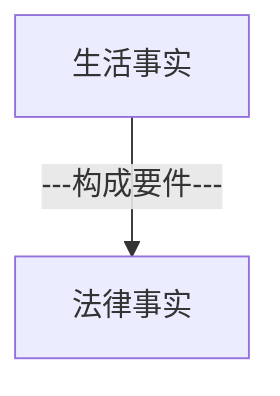
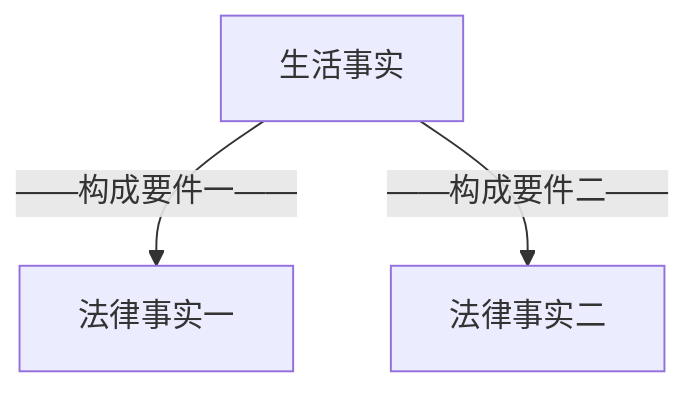

那么同学们接下去我们讲一个重要内容，叫法律事实。
前面讲了法律关系的变动（权利的变动）有哪些形态，以及各种不同的形态，它的特点是什么。接下去我们讲法律关系到底为什么会发生变化呢？变动的原因是什么？或者变动的事由是什么？
# 一、生活事实、构成要件、法律事实

^llny0l

## （一）区分生活事实与法律事实
- 我们说法律关系，它是权利和义务关系。权利义务的变动，是现实生活中的变动，还是人类精神世界中的变动？
	- 好多同学说是现实生活，实际上不是的。法律世界的权利和义务都不是这个物理世界中存在的内容，它本质上是精神世界中的内容，能明白吗？你现实生活中拿一个权利给我看看，你看不到的，这不是物理世界中的问题。只是由于人类的精神状态、精神创造写了个法条，经过立法机关的通过，他就有个权利义务，但是看不见摸不着。
	- 那么现在我们看这么一个抽象的法律世界，我们说权利义务在变动，那么是什么事情才能让他权利义务有变动呢？一定是我们这个物理世界中产生了某一个变动，才会引发出一个抽象的法律世界中的变动。如果物理世界中没有变动，那么抽象的法律世界也不会变动了。只有在物理世界中有变化，才有可能引发出法律世界中的变化。
- 那么接下去就要掌握一点：是不是所有的物理世界中的变化都会导致法律世界中的变化？
	- 我现在在上海在松江，我现在静静听外面，我可以听到外面在下雨，在刮风。 ^l606au
		- 下雨刮风是不是我们物理世界中的一个变化？——当然是。
		- 但它有没有导致权利义务的变化？法律世界的变化有没有？他未必有。
	- 我刚才休息的时候下去看了一下我儿子，这家伙拿了一本漫画书看得开心，在那里笑。 ^az7usq
		- 他看漫画书在笑，是个物理世界中的变化。
		- 但它有没有导致我们法律世界中的变化？——根本没有法律世界中的变化。
	- 就在刚才我打了个电话和一个朋友聊了一会天，我听了之后觉得蛮开心的。 ^xk1ril
		- 我们聊天聊了好一会儿聊天物理世界中有变化。
		- 但有没有法律世界中的变化？——没有。
	- 金老师向丽娜同学发出过一个要约，王泽鉴老师签名的书500块钱卖给你好不好？
		- 这句话本身是不是物理世界中的变化？一一是的。
		- 这个物理世界中的变化有没有引发出法律世界中的变化？——有。
## （二）介入构成要件
- 这个问题就来了，哪些物理世界中的变化能够引发抽象法律世界中的变化呢？让权利义务发生变动，这里面有什么规律可循吗？有没有什么规律可循？答案非常简单，金老师这个[[法律关系（权利）变动之原因：法律事实#^llny0l|图]]已经放在那里了：
	- 一切物理世界中的变化（我们把它简称为生活事实），如果它符合了法律所规定的构成要件，那么它就能够引发权利义务的变动，这个生活事实就变成一个法律事实。
	- 如果一个生活事实。不符合一个法律条文的构成要件，那它就不会引发法律所规定的权利义务的变化。
	- 所以前面听老师讲的，[[法律关系（权利）变动之原因：法律事实#^l606au|外面在刮风下雨]]、[[法律关系（权利）变动之原因：法律事实#^az7usq|我儿子在看漫画书在笑]]、[[法律关系（权利）变动之原因：法律事实#^xk1ril|刚刚有位朋友给我打电话]]，这些事实为什么没有引发法律上的权利义务，没有引发法律世界中的变化？——因为它不符合任何条文的构成要件，当然不会引发这些条文所规定的法律效果。
- 为什么“这本书500块卖给你好不好”这个事实为什么能够引发法律世界的变化？——因为它符合了一个条文的构成要件，472条：![[../../../../../../法律法规汇编/民商法/民法典/第三编 合同#^ndjm18|民法典472]]
	- 由于完全符合要约的构成要件，要约的法效果就发生了。什么叫要约的法效果？
		1. 第一个法效果，我不能随意反悔，除非法律有特别规定。恰恰我国有个特别规定（[[../../../../../../法律法规汇编/民商法/民法典/第三编 合同#^98fhvl|民法典477]]），所以我国可以反悔，对吧？（总之这是一个基本原则，讲出去的话是不能随意反悔的，除非法律有规定——撤回撤销。）
		2. 但更重要的法效果是什么？我这句话一说出来，到达了丽娜同学，丽娜同学那边的权利义务就产生了变化——他取得了一个承诺的资格。他有承诺资格，所以他一旦说了“好的”合同就要成立。
	- 为什么他说“好的”合同就能成立？另外一个同学也听到这句话了，他对我说好的合同不会成立的，为什么？因为我要约到达的是丽娜同学，我要约所指定的受要约人是丽娜同学，所以要约的法效果就使得丽娜同学取得了一个承诺的资格。而旁边听到那个人金老师没有想给他什么资格，也不会取得承诺资格。
	- 所以说同学们看，是不是由于我说的这句话（这本书500块卖给你好不好），这个物理世界中的变化（生活事实）正好符合了[[../../../../../../法律法规汇编/民商法/民法典/第三编 合同#^ndjm18|民法典472]]的构成要件，所以就能引发它的法效果：丽娜同学取得承诺资格。
## （三）小结
1. 第一个，如果是一个生活事实没有符合法律条文的要件，它就不会变成法律事实，也不能引发权利义务的变动。如果一个生活事实符合了条文的构成要件，那么它这个时候就变成了一个法律事实，引发了法律事件的变化。
2. 第二个，那么构成要件是不是把生活事实的所有内容都转化为了法律事实？还是构成要件只提取了生活事实中的一部分，提取出来的部分就变成法律事实。
## （四）构成要件的作用
- 今天是5月5号（五一小长假的最后一天），小明在家里心情很好。躺在床上。拿着手机或者拿着iPad在玩个电脑游戏，玩得很开心。小明的妈妈对小明说，“小明你有没有空帮妈妈去打一瓶酱油？”小明心情很好，于是很爽快就答应了，帮妈妈去打酱油。为了打酱油，把前两天刚买的牛仔裤、鞋子换上了，小明就吹着口哨或者了小曲跑，刚刚跑到楼下门口的时候，看见外面雨刚停，天边的有一道彩虹。所以小明就觉得生活如此美好，正在这么想的时候，小明一脚抬到楼下门口，没注意到一个水坑，脚就踏在水坑里面，崭新的耐克鞋弄脏了，牛仔裤弄湿了，小明一看十分的恼怒，张口就骂了一句国骂。这个时候乙正好骑车从小明身边经过，他没注意到小明踩到了水坑这个事实。他听到了小明这句国骂，以为小明是骂自己的，大怒，所以停下车来，乙就把小明打了一拳，导致小明到医院去支出了医药费71块。 ^xpcdbg
	- 同学们，那么多的事实？这个时候有什么法效果？有什么权利义务的变化？那么多事实是不是都引起了法律世界中的变化？——没有。
	- 那么到底最终引起的法律效果是什么？法律世界的变化是什么？——变化很简单，就是要打小明的乙要赔偿小明医药费71块，还有可能说不定还要赔礼道歉。但是这个法效果的发生是全部事实的作用吗？——不是。因为构成要件提取出来的是什么，法律只关注什么？——提取出来的是，乙故意打了小明，侵害了小明的身体权和健康权，因此应当承担侵权责任。我们[[../../../../../../法律法规汇编/民商法/民法典/第七编 侵权责任#^0jplgg|民法典1165]]第一款规定的。
	- 那么多事实：小明在家里玩Ipad、今天是5月5号假期最后一天、小明的妈妈对小明说能不能打个酱油、小明心情要说好的、下楼穿什么新衣服什么等等，这些事实全部被忽略了。
	- 构成要件只提取了他所关注的内容，他关注内容就是有一个人乙，他做了一个行为，这个行为侵犯了小明的身体的健康，这个行为是故意的，是过错里面的故意，所以要件符合了，自动得出结论：乙要承担侵权责任。
	- 所以我们说构成要件在生活事实和法律事实之间起到什么作用？——提取、筛选的作用。经过构成要件的筛选之后，被筛选上来的内容成了法律事实，其他内容被认为和法律无关，忽略掉。
	- 所以同学们看金老师画的构成要件这个[[法律关系（权利）变动之原因：法律事实#^llny0l|图]]（中间是有空格的噢，它是个网，构成要件的网，你看前面的生活事实是比较粗的箭头，过滤下来之后变成细的了），就是这个意思。
## （五）构成要件所导致的问题以及建议
- 正因为法律事实是生活事实的提取。它不是把整个生活事实都放在里面，所以呢，这里会出现一个问题的：
	1. 它往往把很多重要的、在当事人看来很重要的内容，法律上却认为不重要，完全把它忽略掉了。
		- [[法律关系（权利）变动之原因：法律事实#^xpcdbg|本案中]]，乙就会很委屈：我明明听到他骂我了，他骂我了我还不能打他？我们的[[../../../../../../法律法规汇编/民商法/民法典/第七编 侵权责任#^0jplgg|民法典1165]]第1款就会告诉他：对，他骂你你也不能打他。
			- 因为这个条文提取的要件是：你不能故意侵犯他人权利。
			- 所以经常侵权人有时候很委屈：他先惹我的。因为法条按照法条的构成要件，“他先惹的”这个事情被忽略掉了，这样乙心里会觉得很郁闷。
			- 所以第一个，当事人的心情（他会觉得最后法条适用的结果始终觉得不大合理。）
	2. 第二个后果就是，你们随着训练的深入，法律人的思维会培养起来，法律的思维的特点是：
		- 只关注法律事实，只关注构成要件和法律事实。而这些构成要件法律事实之外的内容，你随着训练的深入，你自动就会把它排除。所以你在处理同一个事情的时候，法律和非法律人思维会很不一样。最后你在从事法律职业的时候，你也会发现你这个思维和别人不一样，从而你会不耐烦。
		- 举个例子来说：金老师经常有这个感受，有朋友介绍当事人向金老师来咨询，当事人喜欢从头到脚把他的心里的感受什么等等全部讲给我听。我听了前面开头之后，我就知道我应该关注哪些点了，所以我会很不耐烦的打断他，“这个没关系，你不用讲了；这个有没有，那个有没有”当事人心里就很不舒服，因为在他看来那个是更重要的，金老师不关心我的，我有委屈啊，我的正当感都是从那里来的，你却不关心。
			- 当你成为真正的法律人之后，你要注意到：你的思维已经把生活事实中很多当事人认为重要内容给忽略掉，而你认为是天经地义的，当事人却不会这么认为。所以你一定要关注到你的思维和他思维的差异性，适当的照顾对方的感受，你如果不照顾对方的感受，对你以后从事法律实务会有一定影响的。
			- 你明明办案是给他办得很好，你法官判决明明是很公正的，当事人就会觉得你太不公正了，你看你都不听我说说，同学们说清楚了没有？这是一个常见的形态的差异。那么这个因素的来源就是因为我们这里所讲构成要件，只提取了部分的事实，剩下的那些被他认为无关要忽略掉，而被他忽略掉的，恰恰当事人可能觉得很重要。这是一个生活事实和法律事实的关系。
## （六）竞合：一个生活事实符合数个法律事实


- 同学们再看，同一个生活事实。有没有可能同时构成两个法律事实？——请求权竞合就是典型的这样的现象（不仅是请求权，各种权利的竞合了）。
- 侵权与违约，举一个例子，甲把一个东西交给乙保管，乙擅自就把这东西卖给丙并交付了，甲丧失所有权了。
	- 那么甲和乙之间有保管合同，所以以擅自出卖的行为
		1. 违反了保管合同。
		2. 乙擅自出卖让甲的所有权没了，侵犯了甲的所有权，同时也侵权。
	- 所以我们看了刚刚那个事实，生活事实只有一个：甲委托给乙保管，乙擅自卖给丙。这就是同一的一个生活事实。
	- 但是为什么它同时成为侵权和违约两个法律事实呢？——因为生活事实
		1. 既符合违约的构成要件。
		2. 这个生活事实同时又符合侵权的构成要件，我们说它是一个第二个法律事实——侵权行为。
- 所以现在知道竞合怎么来的了吧：同一个生活事实同时符合两个以上的构成要件，被两个以上的构成要件所提取，提取出来两个法律事实，当然会引发两个权利，义务的变动。
## （七）法律事实之分类
这个很简单，后面难的就来了。接下去我们要分析，各种法律事实的类别，我们要给各种法律事实都给贴个标签，叫什么名字，这个非常重要。这个东西是不是掌握的好，对将来的学习是特别重要的，民法上必须要使用的概念工具。
- 法律事实的类型 ^n9pjob
	- [[法律关系（权利）变动之原因：法律事实#1.自然事实|自然事实]]
		- [[法律关系（权利）变动之原因：法律事实#^jvc47e|（自然）事件]]
		- [[法律关系（权利）变动之原因：法律事实#^2g8thg|（自然）状态]]
	- [[法律关系（权利）变动之原因：法律事实#2.行为|行为]]
		- 适法行为
			- 表示行为
				- 法律行为（意思表示）
				- 准法律行为
					- 意思通知
					- 观念通知
					- 感情表示
			- 非表示行为（事实行为）
		- 违法行为
			- 债务不履行（违约行为、缔约过失等）
			- 侵权行为
			- 侵夺占有行为
			- 失权行为
			- 其他
	- 独立法律事实：单独引发变动
	- 不独立法律事实：单独不引发变动
		- 独立法律事实之组成部分
		- 独立法律事实外之附加事实
### 1.自然事实
那么这就是这个图就是[[法律关系（权利）变动之原因：法律事实#^n9pjob|各种法律事实的类型]]。
- 好，接下去我们来看各个法律事实的类型有什么特点？通过例子来讲：风吹果落：牛顿坐在树下思考问题了，一阵风吹来，树上的苹果掉下来，砸到了牛顿的脑袋。 ^70e5v0
	- 现在这么一个事实里面，风吹果落是不是法律事实？
		- 同学们，这个问题的思考方式只有一个：如果你说不是，意味着你认定在整个风吹果落的过程中，法律世界中没有产生变化，权利义务都没变动。如果你说是，意味着你已经找到了法律世界中的变化，你才可以说是。不能结合环境，就到此为止了。
		- 我们的321条第一款：![[../../../../../../法律法规汇编/民商法/民法典/第二编 物权#^or1xrv|民法典321]]
		- 这棵树肯定有个所有权人，掉下来的苹果叫“天然孳息”，孳息——生出来的东西。那么在这个条文里面，构成要件是天然孳息。天然孳息引发的法效果是什么？——天然孳息的权利，由所有权人取得。
		- （砸到的时候被他是不一样的，现在截取其中一个事实，后来慢慢再扩展（砸到牛顿头上，骂了句国骂）。现在只截取“风吹果落”这个事实，有没有导致权利义务的变动？
		- “风吹果落”本身结局那么小的4个字，已经是个法律事实了，既然说到法律事实，肯定要先找得到权利义务的变动，才能说它是个法律事实。
		- 我给大家解释：构成要件是天然孳息，法律效果是所有权人会取得天然孳息的所有权。
		- 但是，这并不是这里所说的权利义务变动的全部，在天然孳息由所有权人取得权利变动的之中，蕴含了一个在先的权利义务变动：
			- 本来苹果长在苹果树上，有几个所有权？这个苹果是不是个独立的所有权？假设树上有100个苹果，一棵苹果树，问上面有几个所有权： 当然是1个。这时候的苹果是苹果树的组成部分，所以只有一个所有权，这个所有权就是苹果树（结了100个苹果的苹果树）的所有权。
			- 本来只有一个，但是在风吹果落的那一刹那，被吹落的苹果从苹果树上和苹果，树分开了，在分离的一刹那，有几个所有权？——两个。在分离的那一刹那，分离的苹果已经不再是苹果树的组成部分了，当然会出现一个新的所有权。
		- 所以同学们注意到：风吹果落已经是个法律事实了，这个法律事实所引发的第一个变动是什么？——苹果独立的所有权发生了（苹果也有了独立的所有权，此前它只是苹果树所有权的组成部分而已。）
	- 那么有同学问，你说一分离就有所有权，这个哪里来的（没有条文）？你不是说一个生活事实，经过构成要件的提取就会变成法律事实，那么你说构成要件在哪里？
		- 同学们，就是老师要教你们的：天然孳息这4个字，问，长在树上的苹果是不是天然孳息？——答案是，不是。
		- 这就需要老师教你们了——长在苹果树上的苹果是苹果树的组成部分，不是天然孳息。天然孳息的定义就是要和原物相分离的，掉下来的苹果在那一刹那成为天然孳息。
		- 所以这个构成要件是学理上告诉，是由天然孳息的定义中所包含的构成要件。
		- 现在知道了这一点之后，我们来看风吹果落这个生活事实。它（风吹果落）符合了学理上天然孳息定义中的哪个构成要件（天然的隐含了一个要件）？——和原物相分离的要件。
		- 第二个变动就是苹果所有权归谁，由[[../../../../../../法律法规汇编/民商法/民法典/第二编 物权#^or1xrv|这个条文]]来决定。
			所以风吹果落一刹，那生活事实符合了这个构成要件（和原物相分离），所以成为一个法律事实。这个法律事实，就使得苹果所有权发生，至于发生的苹果所有权谁取得呢？
			- 由于有[[../../../../../../法律法规汇编/民商法/民法典/第二编 物权#^or1xrv|这个条文]]（有所有权人按所有权人来）。
			- 如果既有所有权又有用益物权，比方说土地是甲的，苹果树也是甲的，但是用益物权是归一个土地承包经营权人乙的，那么这个掉下来的苹果归谁？——归土地承包经营权人。
			- 也就是说在本案中在第一个例子里面，我希望同学们掌握个事情
				1. 第一个你说它是不是法律事实的回答，你必须要先去看法律世界中有没有变化，才能回答。你没有想过法律事件中有什么样的变化，直接回答思维方法是错误的。
				2. 第二个，那么法律世界中有没有变化，你怎么去找？你当然要看有没有哪个条文的构成要件被符合，本案中就是天然孳息里所包含的潜在构成要件被满足。
				- 这两个结合起来你才能说它是不是法律事实。
	- 本案法律事实有什么特点？——与原物相分离。
		- 法律要的是分离的结果还是分离的原因，构成要给你有没有要求人的行为，必须是用手摘下来的、用杆子打下来的，才会导致天然孳息的发生；还是不管什么结果，只要分离了都会导致天然孳息的发生，独立所有权的发生？
		- 这个时候注意一下，在这里面构成要件中没有要求行为，不一定是需要行为把它摘下来才会导致孳息发生。
		- 凡是让法律事实产生的构成要件，没有要求人的行为参与的这种法律事实，我们都叫自然事实。

- 自然事实：构成要件中无“行为”要件
	- 事件：事实发生→法律关系变动
	- 状态：事实发生+延续→法律关系变动
### 2.行为
- 我们再看下面一个例子，出卖人乙逾期不交标的物，且打伤路人A。
	- 这是不是法律事实？——当然是。而且这里面有两个法律事实： 
		1. 出卖人以逾期不交标的物，这是个生活事实对应法律事实是违约行为； 
		2. 出卖人乙打伤了路人A是个侵权行为。两个法律事实，被两个构成要件所提取，得出两个法律事实。
	- 这个法律事实有个什么特点？没有行为的话，会符合它构成要件吗？它的构成要件，是不是一定要有行为参与的，才能构成违约行为和侵权行为的？
		- 我们看条文：![[../../../../../../法律法规汇编/民商法/民法典/第三编 合同#^pqlryz|民法典577]]条文明确“一方要不履行合同义务或者履行合同义务不符合约定”，“不履行合同义务和履行合同义务不符合约定”这是不是两个行为？——一个是不作为，一个是作为。他都要求一些构成要件中，要求必须要有行为，没有行为不会符合他构成要件。
		- 看侵权：![[../../../../../../法律法规汇编/民商法/民法典/第七编 侵权责任#^0jplgg]]
			- 条文明确要有一个侵害他人民事权益的行为，没有行为他不可能构成侵权的，当然这个行为在特定情况下可能是不作为（该管不管也有可能侵权的）：比方说公共场所的维护者没有好好的设置好标志牌，他没有做是不作为，同样会构成侵权行为的，但是无论如何构成要件要求行为。
			- 这种构成要件中非有行为不可的法律事实，我们给它一个名称，叫行为。
	- 到现在为止同学们明白了，什么叫自然事实？——构成要件说，构成要件中不要求有行为参与，有没有行为都可以，随你便。而另外一种法律事实是什么？构成要件中，非有行为不可的。

#### （1）违法行为：构成要件中有“违法性”之要求
#### （2）适法行为：构成要件中无“合法性/违法性”之要求
##### A.表示行为：以“表示”未构成要件
||要求之表示内容|法律效果|
|:---:|:---:|:---:|
|法律行为<br>（意思表示）|权利变动之意思=效果意思|意定效果|
|准法律行为|非效果意思|法定效果|
##### B.不以“表示”为构成要件，发生法定效果
### 3.界分：是否以行为为构成要件
#### （1）摘苹果案：先找法效果
- 知道了这个之后我再来改造一下[[法律关系（权利）变动之原因：法律事实#^70e5v0|例子]]：下面这次苹果不是被风吹下来的，假设是牛顿自己的苹果树，牛顿该搭了个梯子爬上去摘下一个苹果，这是个什么法律事实？
	- 同学们，我们思考它是不是法律事实以及是什么法律事实。第一步要先找什么？——法律世界中有什么变化：
		- 牛顿爬上树，把苹果摘下来，这是一个生活事实，你要凭这个来判定是什么法律事实是什么是没用的，看生活事实中的形态一点都没用。
		- 先要找到生活事实做完之后有什么权利义务的变动，你们告诉我哪个地方有权利义务的变动？——苹果本来没有独立的所有权，因为被牛顿摘下来，现在有了独立所有权，这是唯一的一个法律世界中的变化。
		- 苹果把它牛顿做完这个事情之后，法律事件所引发的唯一变化就是苹果独立所有权发生。
		- 接下去要判定这是个什么法律事实，就要看构成要件要求了什么？——对于苹果独立所有权的发生，构成要件要求什么：要求必须有人的行为去把它摘下来吗？还是不管什么原因，只要分离就可以？
		- 构成要件说只要分离就可以，有没有行为都无所谓。所以按照构成要件来界定法律事实，构成要件没有要求非行为不可，所以它是自然事实。
		- 本案中牛顿架了个梯子爬上去，这些全部可以被忽略，没有意义的，不是法律事实的组成部分。法律事实的唯一组成部分：分离。
	- 接下去我问你们任何问题，第一步应该先找什么？——不能看直观的生活形态（“牛顿爬上去的”，这个在这里边没有用），先找法效果是什么。不是构成要件，先找法效果（权利义务有什么变动），然后再看这样的一个权利义务的变动，法条要求了什么构成要件，看构成要件是不是非有行为不可。

>**法律事实之判定步骤**
>```mermaid
>flowchart TB
>1["法效果？"]
>2["构成要件：要求什么？"]
>1-->2
>```
>你如果没有掌握这个思维步骤、这么一个思维方法，你法律事实永远看不清楚的。

- 这时苹果树不是牛顿的了，牛顿搭了个很高的梯子，爬到了邻居家苹果树上，把邻居家的其中一个苹果偷偷摘下来，这是个什么法律事实？
	- 某同学：“首先看法律效果的话是产生了一个独立的所有权，它的构成要件是自然孳息，所以苹果从树上分离这个事实的话应该是一个自然事实。”
	- 金：
		- 不能按照这个来，他是自然事实一定是用构成要件来说话的。
		- 自然事实的特点是什么？——是为了引发苹果独立所有权这个法效果，它的构成要件里不要求行为，所以是自然事实。你要是把这句话都说我说完整了，就完全到家了。
	- 金第一个法效果：苹果独立所有权的发生。就此法效果，构成要件只要求分离，而不问分离的原因是什么，不要求人的行为参与。所以既然构成要件中不以人的行为为要件，那它就不是行为，只能是自然事实。这句话也要说完整。
	- 某同学：第二个法效果是侵权责任的发生，以行为为要件，所以它是一个行为。
	- 金：说得很好。第二个法效果：侵权责任的发生，其构成要件一定要有行为人的行为的参与，所以这个法律事实只能是行为。这句话也要说完整。
	- 上面金老师两句话一定要嘴巴说一遍。
	- 问，侵权行为侵犯的是什么？
		- 注意一下，侵权行为一开始去摘苹果的时候，侵犯的是对邻居的苹果树的所有权（不能用附属物这样的词）。
		- 摘下来之后，侵犯的是邻居对苹果的所有权，继续答的话就是无权占有（以无权占有的方式侵犯他的所有权，但侵犯的是苹果所有权），接下去会引发好多请求权基础，我这个讲清楚了没有？
#### （2）继承
- 再问大家一个问题：甲死了，他的财产他的财产都被他的继承人继承了，问这是个什么法律事实？ ^rlq2ln
	- 甲死了导致什么样的法律效果？——导致两个法律效果：
		1. 第一个法律效果是权利消灭。![[../../../../../../法律法规汇编/民商法/民法典/第一编 总则#^thda5j|民法典13]]
			- 所以死亡导致权利能力的消灭。
			- 现在问大家，就这个法效果而言，构成要件要求了什么？
			- 要求了死亡的结果，死亡的事实。
			- 不要求有必须有人的行为参与，所以就这个法效果而言，它是一个自然事实。
		2. 第二个法效果是财产被乙继承了。就继承这个法效果而言，构成要件只要求了死亡的结果，没有要求因什么原因死的。所以第二个法效果而言，也仍然是个自然事实，这样分析就对了。

- 现在我把[[法律关系（权利）变动之原因：法律事实#^rlq2ln|例子]]稍微改一改：甲被丙杀死了，这是个什么法律事实？（先说法效果，分开各个法效果分别说。看各个法效果各自的构成要件要求什么，分别来讲。）
	1. 第一个法效果：甲权利能力的消灭。就此法效果而言，构成要件要求了什么？——要求了死亡的结果，没有要求必须有人的行为的参与，所以是自然事实。
	2. 就第二个法效果来说，甲的财产会被乙继承，这时候同样构成要件只要求死亡的结果，不以人的行为为要件，所以仍然是自然事实。
	3. 第三个法效果，甲的继承人（甲的近亲属）有权向丙主张一系列的侵权责任（甲自己死了不能主张了，由近亲属主张）。此时就侵权责任而言，要求必须要求侵权人行为，这才构成要件就要求侵权人行为的参与。所以就此法效果而言，法律事实是行为。
	- 甲如果是被继承人杀死就不能继承了，这是不是行为？
		- 同学们看这个法条：![[../../../../../../法律法规汇编/民商法/民法典/第六编 继承#^jtvfn8|民法典1125]]
		- 这个条文所引发的法效果是丧失继承权，对于丧失继承权条文，要件是要求有这个行为，所以它是行为。
#### （3）出生
- 再训练一下大家， 甲出生了，这是个什么法律事实？
	- 自然事件。
	- 但是有个疑问，出生不是妈妈很努力把他生出来的。即使不是妈妈努力生的，妈妈打了麻药之后剖腹产，你有医生的行为的参与，为什么它不是行为？
		- [[../../../../../../法律法规汇编/民商法/民法典/第一编 总则#^thda5j|民法典13]]对于构成要件要求的是生出来的结果（只要是小孩生出来是活的，并且和母体相分离的时候是活的）：
			1. 就生出来是活的。
			2. 和母体相分离。
			- 要的是这两个，至于它怎么出来的和构成要件就无关。
		- 它必然是有行为人的行为参与的，但构成要件没有要求把考虑到要件里面，只要求小孩和母体相分离，并且活在了世界这个事实。
#### （4）海难：
- 甲乘船出海，因海难下落不明，已满两年。是行为还是自然事实？应该是用40条还是第46条？ ^w6r0ut
	- ![[../../../../../../法律法规汇编/民商法/民法典/第一编 总则#^yfgae1|民法典40]]![[../../../../../../法律法规汇编/民商法/民法典/第一编 总则#^w8vws4|民法典46]]
	- 海难属于意外事件。先找出法效果：利害关系人申请宣告失踪、申请宣告死亡的权利发生。
	- 构成要件是什么？是不是非有人的行为参与不可？一一不是。下落不明，不管因为什么原因造成的，都可以算。既然都可以算，那么它就是自然事实。
	- 如果我稍微改一改，这个海难是人为造成的，由侵权行为人造成的。对于宣告失踪和宣告死亡权利发生，这个法效果，它的性质有没有变化？
		- 没有。
		- 也就是说由于它的构成要件中不要求行为的参与，但你有行为参与也不影响它仍然是个自然事实。因为虽然有人的行为参与，但这个参与不是构成要件所要求的，参与不要紧，也不会影响他的定性。
	- 意外事件一定是人都能参与的吗？——不是。在意外事件，狂风（不可抗力也算，没有人参与的意外事件也是意外事件。
	- 自然人下落不明是要件，但下落不明是不是行为？——不是，下落不明是个结果—人找不到了。什么原因找不到了，有可能有个人把它藏起来，那是行为，但这个行为不是要件所要求的，所以是自然事实。

- 事件与状态：[[法律关系（权利）变动之原因：法律事实#^70e5v0|风吹果落]]与[[法律关系（权利）变动之原因：法律事实#^w6r0ut|海难]]
	- 现在问大家，这个自然事实和天然孳息「风吹果落」自然事实有什么不同？
		- 和风吹果落相比，对风吹果落，一分离（物理世界中变动一发生），权利义务就发生了。而物理世界上变化一变，马上导致权利义务变动，这个叫事件。
		- 下落不明，已经是个物理世界中的变化（这个人找不到了）。但这个变化物理世界的变化一发生，有没有直接导致权利义务的变动？
			- 没有。等2年，或者等4年。
			- 所以本质上是下落不明的状态，持续一段时间之后，才导致权利义务的变化。物理世界的变化一发生，没有变化，持续时间到满两年，变化来了，所以是持续满两年，加起来才是个法律事实。这时候物理世界一变化，法律世界没变化，物理世界的变化持续一段时间，法律世界才变化，这叫状态。 ^2g8thg
		- 所以孳息独立→所有权的发生一一是事件。出生、死亡是事件。 ^jvc47e
		- 诉讼时效的届满是状态。这是典型的是要求权利人（请求权人）不主张权利的状态持续，是典型的状态。

消灭时效届满的法效果是对方抗辩权的发生。对方抗辩权的发生要求什么？一一（1）消灭时效起算，该履行不履行；（2）但是是不是该履行不履行一发生就导致时效届满了呢？——没有，这个状态（不请求）要持续三年，对方抗辩权才发生。除斥期间也一样的，我有解除权了，但我没有在法定的时间内／约定的时间内行使，但不行使到一定时间，届满了权利消灭，所以这些都是状态。
#### （5）摘野花 
- 例子： 丙上山游玩，采路边野花数朵。（法律规定野生动植物资源都归国家所有，先把这个条文给它忽略掉。假设没这个规定） ^n7kojd
	- 判断是自然事实还是行为——先看法效果是什么。
	- 路边野花所有权采下来之前归谁？路边野花的主人是谁？——野花通常就是无主物。原来在路边的野花在采下来之前有一棵树，那么这个花被采下来之前就是树的组成部分。这个树都是无主的，你采下来之后花也不有主。所以在这个例子里面，花和树的分离不会产生花的所有权，分离的一刹那花还是没有所有权的。因为本来树就是无主物，下来的花也是无主物。
	- （花分离那一刹那没有独立的所有权）那么这里的法效果是丙取得了野花的所有权。
	- 丙是怎么取得野花所有权的？
		- 野花本来没有所有权，它是野树的组成部分。
		- 野树没有所有权，那么野花和野树刚分离那一刹那也没有所有权。
		- 所以野花也是无主物，就这个无主物丙先占为己有（这叫先占）了。
		- 因无主物的先占，丙就取得了野花的所有权。所以法效果是丙取得野花的所有权。
	- 构成要件要求什么？一一先占。
		- 此前（花和树的分离）连自然事实都不是，因为它没有导致法律效果的变化。
		- 本来是无主物，现在还是无主物。只有物理形态上的变化：花脱离了树。
		- 这里的分离和前面有主物的那棵树和果的分离不一样，因为树本来就没有所有权，你分离了之后只是花脱离了没有所有权的树，花没有产生所有权？——没有。法效果没有，怎么会成为自然事实呢？
		- 所以本案中唯一的法效果是什么？分离之后的无主物野花，被丙取得所有权了，本来没有所有权，现在有所有权（且被丙取得），为什么？——无主物先占。
	- 导致[[法律关系（权利）变动之原因：法律事实#^y66lio|法律效果（丙取得所有权）]]的法律事实是什么？
		1. 第一，有个无主物，至少是个可先占物。（我们国家虽然规定野生动植物资源归国家所有。但是法律没有禁止的，野生动植物资源还是可以先占的。国家保护的名贵珍稀动植物，你不能先占，普通的是可以的，这里就忽略了。不管你认为它是无主物、有主物也好，但只要它可先占，也行了。）
		2. 第二个要件是要取得于自主占有，就是丙要把这个东西占为己有。
		3. 第三个要有先占的权利和自由。

- 同学们还记得[[../../民事权利与义务/第一节 民事权利概述#（二）自由：要约权？立遗嘱权？|权利和自由的区分]]吗？如果任何人都可以去实现的东西，这叫自由。什么情况下先占成为一种权利？举个例子：按照申请，最后政府有关注有关主管部门授予某一个人说，在这片树林里面你可以去打猎。
	- 这个时候这个人对这片树林里的野生动物野生动物它就有先占权了，因为不是所有人都有的，是经过许可他可以去打猎的权利，这就是先占权。如果一个东西法律说不需要的许可，谁都可以先占在路边的野花，那么这个时候就叫先占的自由。
	- 总而言之，一定要有先占的权利或先占的自由，这样才会发生先占的法效果，那就是取得所有权。
	- 根据要件的描述，先占这个法律事实是行为还是自然事实啊？——取得自主占有，没有行为不行的，所以先占是个行为（构成要件必须要求取得自主占有的行为）。

>**先占之要件**
>```mermaid
>flowchart LR
>1["无主物/可先占物"]
>2[取得自主占有]
>3[有先占之权利或自由]
>4[无法定之先占禁止]
>5[未侵害他人之排他先占权]
>先占之要件---1 & 2 & 3
>3---4 & 5
>```
^y66lio

- 违法行为与适法行为：[[法律关系（权利）变动之原因：法律事实#2.行为|违约]]与[[法律关系（权利）变动之原因：法律事实#^n7kojd|摘花]]案
	- 行为 
		- 适法行为
			- 表示行为
				- 法律行为（意思表示）
				- 准法律行为
					- 意思通知
					- 观念通知
					- 感情表示
			- 非表示行为（事实行为）
		- 违法行为 ^98gtr5
			- 债务不履行（违约行为、缔约过失等）
			- 侵权行为
			- 侵夺占有行为
			- 失权行为
			- 其他

- [[法律关系（权利）变动之原因：法律事实#2.行为|例3]]和[[法律关系（权利）变动之原因：法律事实#^n7kojd|例4]]都是行为，这两个行为有什么差别？
	- [[法律关系（权利）变动之原因：法律事实#2.行为|例3]]，逾期不交是违约行为，打伤路人是侵权行为，而摘野花也是行为。
	- 这两类有很重要的不同：这一类（违约侵权），他要求行为有违法性，没有违法性是不会引发违约责任，不会引发侵权责任的。
	- 同学们看：![[../../../../../../法律法规汇编/民商法/民法典/第七编 侵权责任#^0jplgg|民法典1165]]
		- 过错里就包含了有违法性，必须是违法的。所以如果甲持刀攻击乙，乙正当防卫把甲打伤了。这个时候正当防卫的为什么不承担侵权责任？正当防卫的功能是什么？——排除行为的违法性，所以他不承担责任。
		- 所以可见这里潜在的要求，一切侵权责任都要有违法性，所以正当防卫是排除了不法性，所以不存在侵权。所以侵权责任的构成要件里天然的要求有违法性的要求。
	- ![[../../../../../../法律法规汇编/民商法/民法典/第三编 合同#^pqlryz|民法典577]]
		- 违约同样如此：不履行合同义务或履行合同又不符合约定，就是有违法性。
		- 所以我们讲，[[法律关系（权利）变动之原因：法律事实#2.行为|例3]]的行为，由于其构成要件，以违法性为前提才会引发法效果，所以这种行为叫违法行为。
		- 表格中[[法律关系（权利）变动之原因：法律事实#^98gtr5|这些]]（债务不履行、侵权行为、侵夺占有、失权行为等）是违法行为，违法行为的特点是——有违法性才会引发它的法效果。
		- 接下去我们看，采野花数朵，这也是个行为，但这个行为的构成要件中没有要求违法性，同时也没有要求合法性，违法合法与否都不影响这个行为的构成（当然，本案实际上不法）。对这样的一种行为不以违法性为要件的行为，叫适法行为。%%先占%%
	- 先记住这一点，什么叫适法行为？——要件中没有要求违法性；什么叫违法行为要？——要件要求非有违法性不可。

- 看下面这个例子：丁以他人面粉等做成一个蛋饼。这是个什么法律事实？
	- 首先要找法效果：
		1. 面粉所有权的消灭，蛋饼所有权的发生，这是一个法效果。
		2. 以他人的面粉做，如果加上其他要件的话（比方说“没经过他人同意以他人面粉做“），那就是侵权了。但是这个事实我没有把它加进去，所以搞不清楚能不能构成侵权。
	- 所以现在只讲一个法效果，面粉所有权消灭、蛋饼所有权发生，对于面粉所有权消灭、蛋饼所有权的发生，构成要件（加工）要求什么？——加工必须要求有人的行为来发生，否则不叫加工。所以这是个行为，它不是自然事实。
	- 这个行为是违法行为还是适法行为？是不是一定要有违法性才会构成加工？（虽然我故意写的是他人面粉）由于其构成要件，根本没有要求违法性，他没有说非有违法性不可。你自己面粉也可以加工。所以既然不是以违法行为前提的，那么它就是适法行为。所以加工也是个适法行为。
#### （6）麦当劳案
- 再看下面这个例子，戊对店员说：“来两个巨无霸，一杯可乐”
	- 法效果是什么？——产生承诺的资格。要件要求什么？——要件要求构成要约：![[../../../../../../法律法规汇编/民商法/民法典/第三编 合同#^ndjm18|民法典472]]
	
		- 这两个要件一具备，它就构成要约了。
		- 一构成要约（并且当然要约到达了），（到达之后）法效果就对方产生一个承诺资格。（当然本案中到底说的这句话是承诺还是要约，可以再有商榷的余地。假设是要约我们以此为前提来讨论。）
	- 接下来问大家，这是行为还是自然事实？——当然是行为。要约没有行为怎么会构成要约呢，构成要件就要求有行为。
	- 它是违法行为还是适法行为？——适法行为。

- 接下去我再问大家一个问题了，改例子：戊对A说，“来三斤海洛因，两只冲锋枪”，这个是什么法律事实啊？
	- 这是不是要约？（明显违法了）是不是要约？一一还是要约？法律没有在要约层面否定它的效力；对方A说“好的”还是个承诺。违法的要约、承诺仍然是要约和承诺，一结合成立了合同，违法的合同。
	- 违法的合同你看： ![[../../../../../../法律法规汇编/民商法/民法典/第一编 总则#^ij4gco|民法典153]]
		- “违反法律的民事法律行为对合同无效”，所以，要约层面有没有被否定掉？违法仍然是要约，承诺违法仍然是承诺，还能结合起来成立一个合同。但是这个合同最终是什么？——最终是没有效力。
		- 这就是在本案中虽然要约是违法的，但要约仍然是个适法行为，因为他不以违法为要件，你违法了也没关系，他还是要约，要约还是个适法行为。

- 表示行为与非表示行为
	- 看例456有什么差别？（456都是适法行为，要件中都没有说是以违法行为为要件的。）
		- 【例4：丙上山游玩，采路边野花数朵】 ^piywgj
		- 【例5：丁以他人面粉等做成一个蛋饼】 ^8jw9sb
		- 【例6：戊对店员说：“来两个巨无霸，一杯可乐”】
	- 适法行为指的是违法不是要件，不违法也可以产生它的法效果，如果违反了，可能反效果产生不了了，但是不影响它仍然是这个东西，仍然是法律事实，违法的要约还是要约。
	- 它的构成要件里面有个重大差别：丙上山游玩去先占，先占是不是非得对一个人做表示啊？
		- 你需要找个同志说一下“同志，你看我先占”吗？假设没有任何表示直接就采了，能不能构成先占？——可以构成先占。所以它不以表示为要件，它不和任何人作表示，都可以构成先占。
		- 先占不需要认为捡起一个东西为默示的意思表示，也不需要让任何人知道。
		- 表示的目的是为了沟通，先占这个行为没有沟通功能，无论是有相对人还是无相对人，都没有承载这么一种含义在里面。
		- 比方说金可可边打电话边向卖蛋饼的老板竖起一根手指，这么一个行为就是非理解为表示不可才能变成一个要约，才能引发意定的效果，要件里要求了这个；先占这个行为，同样在找一个东西，在要件里面没有把它理解为是在说一句话、在做一个表示，是要件的要求，要件里面没有要求要说出来“我要占有这个东西，我要取得所有权。”说和不说没差别，所以它不是表示行为。
		- 个人问题：抛弃是无相对人单方意思表示是因为涉及撤销？
	- 加工需不需要做表示？——它不以表达出来为要件，加工就用动手做就行了。
	- 所以你看说前面[[法律关系（权利）变动之原因：法律事实#^piywgj|例4]]、[[法律关系（权利）变动之原因：法律事实#^8jw9sb|例5]]都有这个特点，它不是非有表示行为，不是以表示为要件的，他没表示根本没关系。所以这种不以表示为要件的。同学们注意一下，我们把它叫做非表示行为，也叫事实行为。
	- 同学们，再看要约有什么特点？要约不表示行吗？我们看要约的要件好了：意思表示一定是要表示出来的。所以这种以表示为构成要件的适法行为叫做表示行为。
#### （7）催告
- 再看下面这个例子： 出卖人乙逾期不交标的物，买受人已催告。
	- 这个催告，同学们想想看，它产生的法效果可能是什么？![[../../../../../../法律法规汇编/民商法/民法典/第三编 合同#^xse0f1|民法典563]]
	- 以持续履行的债务为内容的不定期合同，当事人可以随时解除合同，但是应当在合理期限之前通知对方。
	- 这个时候他就有可能产生解除权。
		1. 第一，肯定是一个行为，没行为没法催告的。
		2. 他不以违法行为要件的（催告本身通常还是合法的），所以他是适法行为。
		3. 第三个，催告没表示可以催告吗？一一不行，他肯定得以表示为要件的。所以这也是一个表示行为，非表示不可的。
#### （8）通知
- 同样：庚发现所购手机质量不合格，马上通知卖方。
	- 通知起到一个什么作用？——保全自己的瑕疵担保请求权。如果你在合理期间在不通知的话，明明质量不合格，当合格处理。![[../../../../../../法律法规汇编/民商法/民法典/第三编 合同#^4nm1qh|民法典621]]
		- 通知是不是
			1. 必须要有行为；
			2. 不以违法行为要件，所以是司法行为；
			3. 第三非表示不可（通知怎么能不表示呢，不表示出来还叫通知啊？做不到）
#### （9）宽恕
- 再看下面最后一个例子：辛为其子遗弃，后辛于死前表示宽恕其子。
	- 这种宽恕讲的是什么？有什么法效果？你看继承人有可能丧失继承权的情形：![[../../../../../../法律法规汇编/民商法/民法典/第六编 继承#^jtvfn8|民法典1125]]
		- 所以宽恕的法效果是什么？——被遗弃了，本来他的儿子丧失继承权的，他又不丧失继承权。
		- 这个宽恕
			1. 必须有行为才能宽恕；
			2. 第二他不以违法性为要件（通常是合法的）；
			3. 第三个，宽恕非表示不可吧。这些都是表示行为。

【例4：丙上山游玩，采路边野花数朵】 ^eg1d8c

【例5：丁以他人面粉等做成一个蛋饼】 ^77nmby

【例6：戊对店员说： “来两个巨无霸，一杯可乐”】 ^id1ozh

【例7：出卖人乙逾期不交标的物，买受人已催告】 ^mnfgg0

【例8：庚发现所购手机质量不合格，马上通知卖方】 ^aa02lb

【例9：辛为其子遗弃，后辛于死前表示宽怨其子】 ^x016xu


- 法律行为与准法律行为
	1. 法律行为（法效果＝表示内容）
		- 掌握了这些时候，我们知道，这一类行为中（[[法律关系（权利）变动之原因：法律事实#^eg1d8c|例4]]、[[法律关系（权利）变动之原因：法律事实#^77nmby|例5]]）实际上它都是非表示行为，不说也没关系的。后面6789都是表示行为。
		- 好，我们来看6789有什么特点？6789里面可以分成两类：
			- 第一类是[[法律关系（权利）变动之原因：法律事实#^id1ozh|例6]]，对店员说“来两个巨无霸一杯可乐”，他这个意思表示真正的内容是什么？
			- 金老师在法律上把他的内容按照标准术语翻译一下：戊对麦当劳做了一个表示，内容是我愿意负担你价目表上所定价格的义务（我愿意负担一个支付价款的义务）来换取一个请求你交付两个巨无霸一杯可乐，并移转其所有权的债权。
			- 它真正的表示内容在说。店员实际上是麦当劳的代理人，店员说“好的”实际上当劳做出了一个承诺。承诺内容是什么：麦当劳说“我愿意负担一个交付标的物并移转所有权的义务，来换取一个请求你支付价款的债权。
			- 如果要约生效，承诺生效，最后是，合同整个都成立生效，生效之后的法效果是什么？——戊对店员说了这句话，店员说好的，合同就成立并生效了。生效之后的法效果是什么？
			- 法效果的内容：
				- a.戊对麦当劳产生一个请求权（一个债权），有权请求麦当劳给他两个巨无霸、一杯可乐，移转所有权；
				- b.麦当劳对戊产生一个债权，请求他交付价款。
			- 经过金老师这么一分析之后，你们发现没有，最后产生的法效果恰恰就是戊所说的意思表示的内容——我愿意附带一个支付价款的债务来换取一个请求你交付并移转所有权的债权。实际上的法效果是什么：戊负担了一个支付价款的债务，也取得了一个请求麦当劳交付给遗传所有权的债权，所以最终产生的法效果和它意思表示的内容中所载明的法效果完全是一致的。
			- 同样我们看麦当劳的以通过店员的口说出来的一句话，和最终产生的法效果完全是一样的，他说好的实际上内容是——我愿意负担一个交付标的物并移转所有权的债务来换取一个请求你付款的债权。所以最终产生的法效果完全和麦当劳所说的这句话意思表示内容完全是一致的，在这种情形（最终产生的法效果和它意思表示的内容完全一致的情形），我们把它叫做意思表示。
			- 反过来说，为什么这个法效果在[[法律关系（权利）变动之原因：法律事实#^id1ozh|例6]]里面的法效果和物和麦当劳他们两个意思表示内容完全一致，为什么完全一致？在这一类行为中，法律无非是认可了他们两个人的意思表示的内容对他进行认可而已（按照你的意思表示内容产生效力），凡是这种我们叫法律行为（或意思表示）
			- 这一类的行为特点是什么？
			- 这一类适法行为非有表示不可（一定得有表示的）；
			- 这一类的行为特点是什么？
				- （1）这一类适法行为非有表示不可（一定得有表示的）； 
				- （2）它的表示里面的内容，就是最后生效之后的内容，生效之后的内容就是他意思表示的内容（之所以如此，法律是确认了他的法效果，确认了意思表示内容而已，他认为你可以按照意思表示内容去实现法律行为/意思表示。）
	2. 准法律行为（法效果≠表示内容）
		1. 法效果≠表示内容
			- 同学们再看下面[[法律关系（权利）变动之原因：法律事实#（7）催告|催告的例子]]：他催告我的表示内容是什么？——内容是“金老师，请你赶紧给我书”；法效果是合理期限过了之后解除权发生。
			- 所以这种情形虽然非有表示不可，但是按照表示内容和法效果之间的关系来看，法效果不是它的表示内容，法效果和表示内容不一样，完全不搭界。
			- 这种表示行为，叫准法律行为。
			- 再看下面这个例子：通知的内容是说，“你给我的手机不合格”，我告诉你的是一个事实，法效果是瑕疵担保请求权不会消灭，不会跑掉。
			- 所以法效果和表示内容一点关系都没有。
			- 再看宽恕：宽恕的表示内容“我原谅你了”，法效果是本来丧失的继承权又不丧失，法效果表示内容没关系。这种「催告、通知、宽恕」叫准法律行为。
			- 所以如果把法律行为（意思表示）后面给他一个大致的符号，是“法效果＝表示内容”；准法律行为的特点是“法效果≠表示内容”。
		2. 意思通知「意愿」、观念通知「事实」、情感表示
			- 问，例[[法律关系（权利）变动之原因：法律事实#^mnfgg0|7 ]][[法律关系（权利）变动之原因：法律事实#^aa02lb|8]][[法律关系（权利）变动之原因：法律事实#^x016xu|9]]三个有什么差别？买受人的催告、瑕疵的通知和宽恕有什么差别？
				- 催告表示内容是什么？表达的是意愿、事实还是情感？——典型的是意愿。这种准法律行为里面表达意愿的叫意思通知。“请你给我”，是典型的意思通知。
				- 那么第二个瑕疵通知，这个通知内容是意愿、事实还是情感？通知本身没有讲什么意愿，讲的是手机不合格，事实告诉对方。凡是告诉对方一个事实，能够引发一个法效果的，这个叫观念通知。观念——把自己认识到的事实告诉你。所以瑕疵的通知实际上是典型的观念通知。
				- 这里的宽恕讲的是什么？
					- 是表达意愿、告诉一个事实，还是做情感的流露呢？——情感的表达。所以这个时候叫感情表示，也叫情感表示。情感表示通常的例子就是宽恕。
					- 当然宽恕在比较法上，不仅限于丧失继承权的情形可以宽恕，还包括什么像台湾地区的法律就是说有配偶的一方与他方通奸，这个时候没有出轨的一方（受害的一方配偶），可以对对方表示宽恕。那也是另外一种宽恕了，他法效果也会不同，它就会使得离婚权之类的被消灭。所以感情表示在我们国家（大陆地区的法律）主要的条文就是那个条文，叫继承权丧失中的宽恕。
			- 时效中断![[../../../../../../法律法规汇编/民商法/民法典/第一编 总则#^lcu36b|民法典195]]
				- 首先搞清楚要中断是不是非得要行为不可，是那就是行为了；他是不是以违法行为要件，不以违法行为要件（请求履行怎么会是违法呢？）所以它是适法行为了；
				- 适法行为是不是以表示为要件？——当然了，你请求怎么能不表示呢，所以是表示行为；表示行为里面它，的表示内容和法效果一致吗？表示内容是请你给我，法效果是时效中断，不一致，所以是准法律行为而不是法律行为。
				- 在准法律行为里面它是表达意愿的（不是告诉事实的，也不是表示情感），就是意思通知。
		3.  以法律要求（而非实际表达）
			- 问大家，现在权利人他学过法律，他为了中断时效，他是这么写的“义务人你快给我，自收到本通知之日起时效中断”。他这样写的话，他到底是意思表示还是准法律行为？它表示内容是和法效果一样了，它的表示内容是“我希望时效中断”，法效果也是时效中断，那他不就是法律行为／意思表示了吗？换了个写法，他是准法律行为，还是因此而变成法律行为了？
			- 并非是他说的“我希望时效中断而导致时效中断”，而是因为他说的请求履行而时效中断。也就是说我们这里不看他实际上怎么写的，只看法律要求怎么写能够中断时效，以构成要件要求的内容来判断它是什么。所以本案中他虽然写的是“我请你履行，我希望时效中断”，多写了一句没用的。
			- 我们知道，法律的构成要件是只要请求履行，时效中断，多写的内容不影响性。反过来，如果他说“我希望时效中断”，但他没有写“我请求履行”，它不会导致时效中断。
			- 所以到底这个法律事实是什么性质，不看他实际上怎么写，而是看法律要求他怎么写，法律构成要件要求了什么。
### 4.认定
#### （1）[[../../../../../../法律法规汇编/民商法/民法典/第三编 合同#^9avg2y|民法典578]]：违法行为
考大家一个问题：![[../../../../../../法律法规汇编/民商法/民法典/第三编 合同#^9avg2y|民法典578]]
- 举个例子来说： 金老师把这个书卖给B同学，约定8月1号交书，但是金老师在今天5月5号就很明确的跟B同学讲了，你别等了，我永远不可能交给你了，我这本书已经要卖给乙了。
	- 这个时候B同学没有必要等到8月1号再请求承担违约责任，可以在履行期限届满之前请求承担违约责任（因为必然违约嘛）。这种明确表示或以自己的行为表明不履行的，我们叫预期违约，这里面一种履行是拒绝履行（履行期到来之前，我先期前拒绝履行了）。
	- 预期违约或期前拒绝履行的表示，是哪个法律事实？——不是准法律行为；条文中明确有“违约责任”。准法律行为是适法行为的一个下位概念，而这里是非有违法性不可，所以是违法行为。
#### （2）[[../../../../../../法律法规汇编/民商法/民法典/第三编 合同#^v8stoc|民法典546]]：观念通知
![[../../../../../../法律法规汇编/民商法/民法典/第三编 合同#^v8stoc|民法单546]]
- 这个通知是什么？这肯定是个适法行为了，也肯定是表示行为了。现在要问大家的，这个表示行为到底是法律行为还是准法律行为？怎么检验就看法效果和表示内容的关系。表示内容按构成要件来，要件要求的表示内容和法效果的关系。要件要求的通知内容是，“我已经把债权转让给别人了，这个事实我告诉你”，不是“我想要把债权转让给别人”。法效果是通知过后，丽娜同学只能把钱交给受让人。不通知就不一样了。所以，通知内容是“债权已经归别人了”（这是个事实）。法效果是只能向通知中所写明的新的受让人履行了。
- 所以这是一个典型的观念通知，表示内容没有说“你应该向谁履行”，只要说你告诉是谁就行了，债权让给谁就行了。效果就是他必须要向他履行，所以是法效果和表示内容是不一致的，是典型的准法律行为。准法律行为里是讲事实（不是讲意愿讲感情），所以这是观念通知。
#### （3）[[../../../../../../法律法规汇编/民商法/民法典/第三编 合同#^ugb85g|民法典565]]：法律行为
![[../../../../../../法律法规汇编/民商法/民法典/第三编 合同#^ugb85g|民法典565]]
这个通知是什么？（肯定是表示行为）是法律行为还是准法律行为？凡是行使形成权的行为，虽然在名义上也叫通知，他是法律行为，因为行使的是解除权。
#### （4）[[../../../../../../法律法规汇编/民商法/民法典/第三编 合同#^usvbsb|民法典568]]：法律行为
再看抵消：![[../../../../../../法律法规汇编/民商法/民法典/第三编 合同#^usvbsb|民法典568]]
凡是行使形成权的行为，尽管叫通知，永远是法律行为。
#### （5）[[../../../../../../法律法规汇编/民商法/民法典/第三编 合同#^cguwou|民法典979]]：非表示行为／事实行为
- 我要问大家一个问题了，先看一个条文：![[../../../../../../法律法规汇编/民商法/民法典/第三编 合同#^cguwou|民法典979]]
	- 无因管理是个什么法律事实？——要找要件：
		1. 要件中有没有要求行为？——没有行为怎么管理他的事务呢；
		2. 这个行为是要求是违法的才行，还是不违法也行？——不违法也行，所以是适法行为；
		3. 是表示行为还是非表示行为？——好多无因管理是不说话的，所以会非表示行为——事实行为。
#### （6）创作与交付
前面讲过的创作是个什么行为：金老师写了一首情诗，肯定是行为，肯定是适法行为；不需要表示的，你不表示也取得著作权，表示了也取得著作权。这也是事实行为。

![[../../../../../../法律法规汇编/民商法/民法典/第三编 合同#^ut8m6i]]

交付是个什么法律事实。交付也是个非表示行为，只要把占有移转过去就好了。
#### （7）事实行为之分类
- 先占、遗失物的拾得、埋藏物发现、交付、无因管理、加工、创作，都是事实行为。
- 事实行为里面严格加起来有两类，一类是事实行为（非表示行为）都不要求表示的，但是里面有核心的两类：
	1. 一类是虽然不要求表示，但要求有意思（Wille），没意思还是不行的。先占一一占为己有的意思必须要有的（这种占为己有的意思叫自主占有的意思）；无因管理——管理人必须要为他有为他人管理的意思。
	2. 另外一类是既不以表示为要件，也不以内心的意思为要件，你内心意思是什么都无所谓：比方说创作，金老师写情诗的时候心里想的是表达爱慕之情，心里想的根本没有想到我要取得著作权，这个意思都没有，但仍然取得作品所有权：金老师心里想的是取得作品著作权而创作，也同样取得著作权。所以内心意思之有无不影响法效果，加工同样如此，有没有意思都无所谓。%%事实行为%%

- Frage
	1. 交付要有意思吗？——交付要有意思吗，交付是占有的自愿移转：我愿意把占有给你，你也自愿拿过去才叫交付的。
	2. 意思和意思表示有什么区别？——意思表示是一个法律事实，它是一定要表示出来，是表示行为的一种，然后它表示内容和法效果是一样的；意思就是纯粹内心想的。像先占过程中，我内心想的这个东西要据为己有。管理意思说，我说我心里想的是要替他把这个事情管好，叫管理意思。但这个（意思）不要求说出来。
	3. 事实行为有没有分类的名字？——没有通行的名字（有人给他取个名字，你们不需要掌握，过多的概念不是太好，对你们来说掌握通常的概念最重要。）
	4. %%意思表示%%表示就是要说出来，那说当然是以口头说、以行为来说也可以。比方说买袋饼的人拿了个电话在打，他实际上没有对老板说“我要买一个蛋饼”，他用手指也是一种说。直接用语言表达的叫明示，非语言的叫默示（大致是这样，以后会更一步精确讲）。
	5. 占有移转的效果，是因为我的意志的作用，还是因为事实上控制力交过去的作用？——占有的移转是因为我的控制力交到了B同学手中。所以本质上不是“因为我愿意，所以占有移转了”。注意一下，交付的结果一定是占有的移转了。如果金老师很不愿意，被B同学抢过去了。占有仍然移转。所以可见，即使违背我的意思了，占有也会移转的。所以占有的移转不是我的意思的作用，只是违背我意思的时候不构成交付而已。
	交付的要件除了占有移转之外，还要求我自愿他自愿。但它法效果就是占有的移转。大概就是说最后的效果就是占有给他。
	所以在这个意义上，交付它不是法律行为，本身它是个事实行为（占有移转过去就归对方，我的意思在这里没作用，你记住这句话就行了）。
	虽然事实上，我的意思也是要移转占有，但是占有的移转不是我意思的作用，而是事实上的利益的移转的作用。所以一定要要求对方一定要自愿来拿。
	6. 交付有没有默示的方式？——有。交付中完全有可能体现出另外一种表示，但不是占有移转的表示，它不以表示为要件。重要的是有这个事实，占有给他的事实，看不出来违反双方的意愿就可以了。
	7. 在债权人移转债权的例子中，确实在没通知债务人的时候，债权已经移转了，但是没通知，债权还是移转的。即使不通知债权也移转。
	那么通知的作用是：如果我不通知，债务人不知道，仍然会向我付钱，付钱有效。如果，通知了你，你明明知道债权不归我了，向我付钱付钱无效，差别就在这里。（[[../../民事权利与义务/第一节 民事权利概述#^rwq4l2|受领权限]]）
	8. 为什么要区分[[法律关系（权利）变动之原因：法律事实#^n9pjob|这么多类型]]？为什么要区分事实和行为呢？
		- 是因为行为这种法律事实，它要引发法律行为的变动
		- 行为这种法律事实有两点特殊的地方：
			1. 行为的第一个特点，法律往往会考虑行为本身是不是具备社会妥当性、符不符合社会的价值观，因此而给它配置不同的法效果，这是行为的特色。如果不符合社会的价值观，有可能会产生一些不利的后果。自然事实不会有这样的事情。
			比方说法律行为是行为，如果法律行为违法了，悖于善良风俗了，会导致整个法律行为就无效。侵权行为会考虑他是不是违法，违法才可能构成侵害行为。
			2. 第二个，既然是行为，往往会考虑行为人的一些主观上的一些东西来决定法效果。自然是不会有这样的事情的。
				1. 比方说行为能力：你这个人能力不足，可能法律就会给你进行特殊的保护。比方说：金老师假设限制行为能力人，去买一套房子，合同效力待定。超出我能力范围了。行为会有这个问题的，会有主观因素的考量，第一个主观因素考量是能力。
				2. 第二个主观因素的考量，过错（故意、过失），这种评价只会出现在行为中的。
				- 也就是说第一个考量是能力，你有没有具备能力（有没有理性能力）可能会影响它效果的。第二个是，如果有能力，你有没有正确运用这种能力：你如果过错，你就没有正确的运用自己的能力。或者是善意恶意（善意取得），只会发生在行为的范畴。
		- 所以我再归纳一下，行为这种法律事实，它具有自然事实这种法律事实所不具备的一些特点
			1. 会考虑社会妥当性；
			2. 第二会考虑一些主观因素，包括什么能力，以及是否正确运用这些能力（故意过失、善意恶意）。

Q．9好，接下去再看，为什么要区分适法行为和违法行为？——这个就很简单了，
（1）违法行为法律要处罚的。
（2）违法行为通常有违法抗辩事由（正当防卫等等排除违法性）就可以变成不承担责任，这是违法和适法区分最重要的特点。

Q．10 适法行为里面为什么要区分表示行为和非表示行为？——区分的重要意义是，非表示行为，意思表示的一系列规则都不能用。
（意思表示和法律行为有一套独特的规则，比方说有行为能力的规则；有意思表示到达生效的规则；意思表示有瑕疵，包括重大误解错误撤销的规则；意思表示如果无效、法律行为如果违法或背俗无效的这种规则，这都是法律行为的一套规则。这套规则即使对于准法律行为都有可能用得上。但是这些规则绝对不可能用在非表示行为上。）
所以我现在问大家了，一个7岁的小孩在路边采了野花，能不能取得所有权？——可以。明明没有行为能力，为什么可以？——因为对于事实行为不适用行为能力。一个5岁的小孩写了一首情诗，能不能取得著作权？——他虽然没有行为能力，由于创作是事实行为，他不需要用行为能力制度。
所以说表示行为和非表示行为的区分意义在这里，意思表示、法律行为的规则不能用在事实行为。

Q．11 那么为什么要区分法律行为和准法律行为？——对法律行为，当然意思表示的全部规则都可以用了；但是准法律行为却有可能根据情况只能准用法律行为的部分规则，不是全部可以用的，部分情形可以用（因为它毕竟不是法律行为）

Q．12 法律行为的哪些规则是准法律行为所不能用的？——比方说情感表示，像那种宽恕，没有行为能力应该也可以的，它就是一个自然的情感的流露，不要求有行为能力。具体哪些规则在什么情况下不能用，一定要根据具体的这种类型一个一个来分，一下子概括的规则没有的。