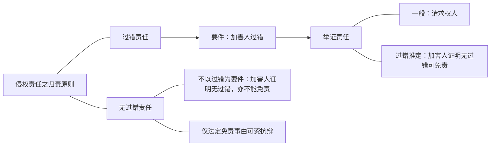

# 过错推定
![[../../../../法律法规汇编/民商法/民法典/第七编 侵权责任#^0jplgg|民法典1165]]
- 按照[[../../../../法律法规汇编/民商法/民法典/第七编 侵权责任#^0jplgg|民法典1165I]]的规定，受害人有证明责任，受害人如果证明不了行为人有过错，行为人即使侵害了其民事权益，也不承担侵权责任。
- [[../../../../法律法规汇编/民商法/民法典/第七编 侵权责任#^0jplgg|民法典1165II]]的规定，为过错推定，是过错责任的特定情形，受害人只要证明有个人侵害了他的民事权益，受害人无需证明行为人有过错，法律就推定行为人有过错，但法律又给了行为人举出反证来推翻的机会。
- 过错推定责任是过错责任，只是过错由行为人证明。

![[../../../../法律法规汇编/民商法/民法典/第七编 侵权责任#^eopp5n|民法典1253S1]]
- [[../../../../法律法规汇编/民商法/民法典/第七编 侵权责任#^eopp5n|民法典1253S1]]明确说了，证明自己无过错就可以免责，不能证明就要承担责任，是典型的过错推定。
- 过错推定的特点是条文中会写明“证明自己无过错则不承担侵权责任，不能证明就承担侵权责任”。

![[../../../../法律法规汇编/民商法/民法典/第七编 侵权责任#^sjg8ok|民法典1255]]
![[../../../../法律法规汇编/民商法/民法典/第七编 侵权责任#^lal778|民法典1256]]
# 无过错责任
![[../../../../法律法规汇编/民商法/民法典/第七编 侵权责任#^od5p33|民法典1237]]
- [[../../../../法律法规汇编/民商法/民法典/第七编 侵权责任#^od5p33|民法典1237]]根本没有提到过错的问题，事实构成中就不需要过错。
- “但是，能够证明损害是因战争、武装冲突、暴乱等情形或者受害人故意造成的，不承担责任”
	- 在“战争、武装冲突、暴乱”的情形，民用核设施的营运单位无过错，是不是意味着这个条文是过错责任呢？
	- 是不是无过错责任，检验的方法是将这段话的免责事由无视外，能不能通过证明没有过错而免责。
	- 假设不是上述情形发生核事故造成的损害，民用核设施的营运单位证明自己确实没过错，依旧要承担民事责任，说明该条文为无过错责任。
	- 无过错责任条文即只有法定免责事由可以免责，超出这个范围证明无过错也不免责。

![[../../../../法律法规汇编/民商法/民法典/第七编 侵权责任#^bi6osm|民法典1238]]
- 在[[../../../../法律法规汇编/民商法/民法典/第七编 侵权责任#^bi6osm|民法典1238]]情形，民用航空器的经营者什么地方都注意到了，请了无数个人检查证明这个航空器是正常的，但是最后飞机还是坠毁了，经营者需要承担责任，不以过错为要件。
- “能够证明损害是因受害人故意造成的，不承担责任”并不意味着民用航空器经营者就无过错，可能有过错，但[[../../../../法律法规汇编/民商法/民法典/第七编 侵权责任#^bi6osm|民法典1238]]不管这个，只要是受害人故意，民用航空器经营者就不承担责任，反之，如果是受害人故意之外的事情造成，比如因不可抗力导致飞机坠毁，民用航空器经营者依旧要承担责任，为典型的无过错责任。