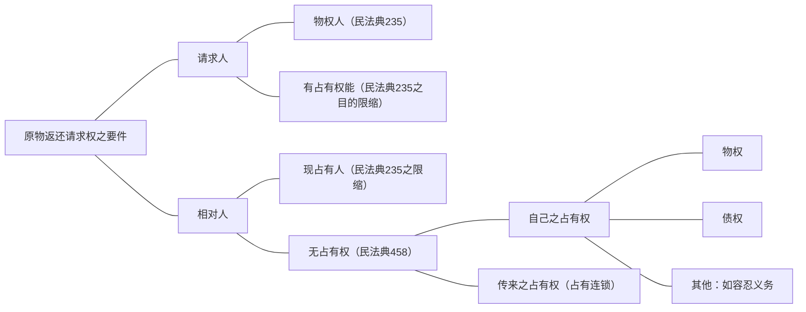

[[../../../../法律法规汇编/民商法/民法典/第二编 物权#^axo3xh|民法典235]]、[[../../../../法律法规汇编/民商法/民法典/第二编 物权#^hr9ggm|民法典458]]
- 传来的占有权%%占有连锁、占有连续%%：甲把手机租给乙，乙有自己的占有权，占有权的本权为债权，乙没有经过甲的同意擅自把手机转租给丙（租赁合同有效），丙不知乙擅自转租（丙为善意），丙无占有权。
	- 乙基于和甲的租赁合同有占有权。
	- 转租合同有效，丙有债权，丙基于该债权的占有可以对抗乙。
	- 丙基于债权的占有权只能对抗转租合同的相对人乙，但丙和甲之间无债权债务关系。
	- 丙不能借助乙对甲的占有权对抗甲。
	- 丙能否对抗甲取决于乙有无权利将手机转租给丙，若乙有权转租，那么丙可以对甲主张“尽管我对于手机没有物权，尽管我对你也无合同上的债权，但是由于乙对你有债权，而他又基于这个债权有权利将手机转租给我，所以我可以搭乙的桥，借助他对你的占有（传来的占有权）主张对你的手机有权占有。”
- 传来的占有权%%占有连锁、占有连续%%有两个要件：
	- 中间人有占有权。
	- 中间人有权将占有权给后手。