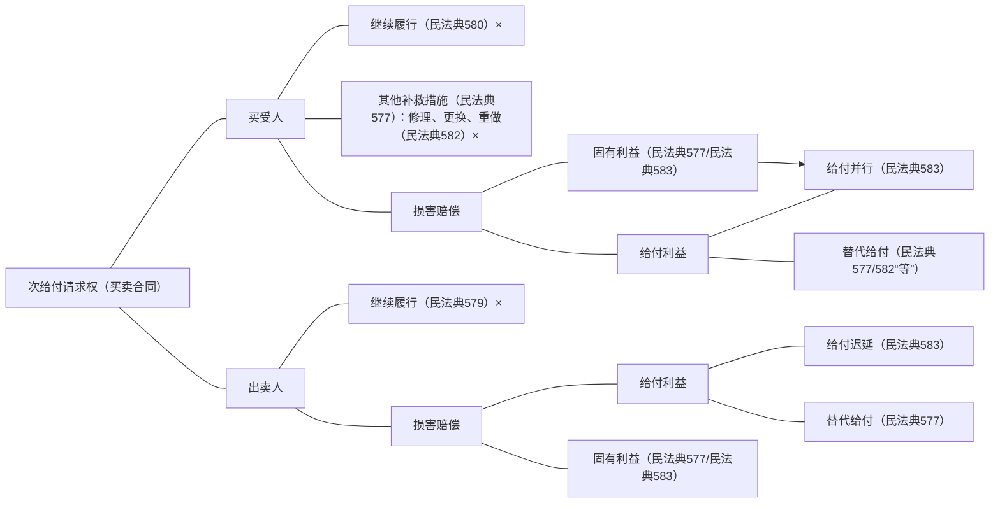

[[../../../../法律法规汇编/民商法/民法典/第三编 合同#^pqlryz|民法典577]]、[[../../../../法律法规汇编/民商法/民法典/第三编 合同#^6wr2zj|民法典579]]、[[../../../../法律法规汇编/民商法/民法典/第三编 合同#^m7fbim|民法典580]]、[[../../../../法律法规汇编/民商法/民法典/第三编 合同#^88p22r|民法典582]]、[[../../../../法律法规汇编/民商法/民法典/第三编 合同#^yeefig|民法典583]]

- 金可可和张三签了一个买卖合同。
	- 金可可有权请求张三支付价款，支付价款是原权、原给付请求权。
	- 张三没有及时给付价款，造成金可可损害，金可可请求损害赔偿，这是救济权、次给付请求权。