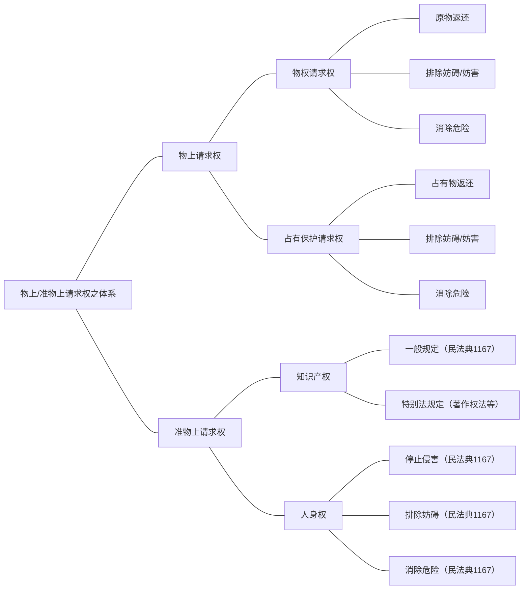

```mermaid
flowchart LR
1["物上/准物上请求权之体系"]
2[物上请求权]
3[准物上请求权]
1---2 & 3
4[物权请求权]
5[占有保护请求权]
2---4 & 5
6[原物返还]
7["排除妨碍/妨害"]
8[消除危险]
4---6 & 7 & 8
9[占有物返还]
10["排除妨碍/妨害"]
11[消除危险]
5---9 & 10 & 11
12[知识产权]
13[人身权]
3---12 & 13
14["一般规定（民法典1167）"]
15["特别法规定（著作权法等）"]
16["停止侵害（民法典1167）"]
17["排除妨碍（民法典1167）"]
18["消除危险（民法典1167）"]
12---14 & 15
13---16 & 17 & 18
```
[[../../../../法律法规汇编/民商法/民法典/第七编 侵权责任#^gkx57d|民法典1167]]