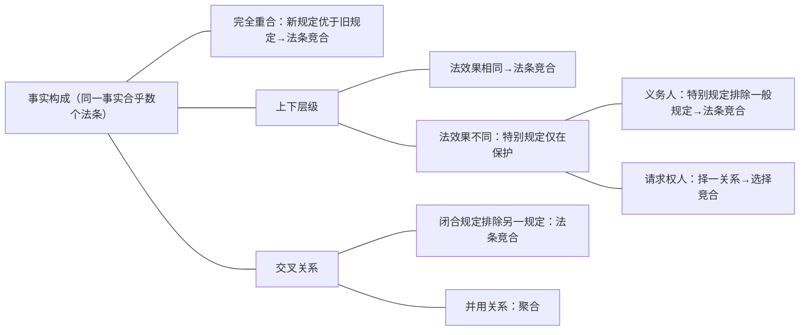

```mermaid
flowchart LR
1["事实构成（同一事实合乎数个法条）"]
2["完全重合：新规定优于旧规定→法条竞合"]
3[上下层级]
4[交叉关系]
1---2 & 3 & 4
5["法效果相同→法条竞合"]
6["法效果不同：特别规定仅在保护"]
7["义务人：特别规定排除一般规定→法条竞合"]
8["请求权人：择一关系→选择竞合"]
3---5 & 6
6---7 & 8
9["闭合规定排除另一规定：法条竞合"]
10["并用关系：聚合"]
4---9 & 10
```
当事实构成为上下层级，法效果不同在保护请求权人时，并不绝对构成选择竞合，需要看选择的是否为两个不同的权利。

事实构成交叉关系导致的并用发生请求权聚合的情形如撤销与缔约过失的并用。