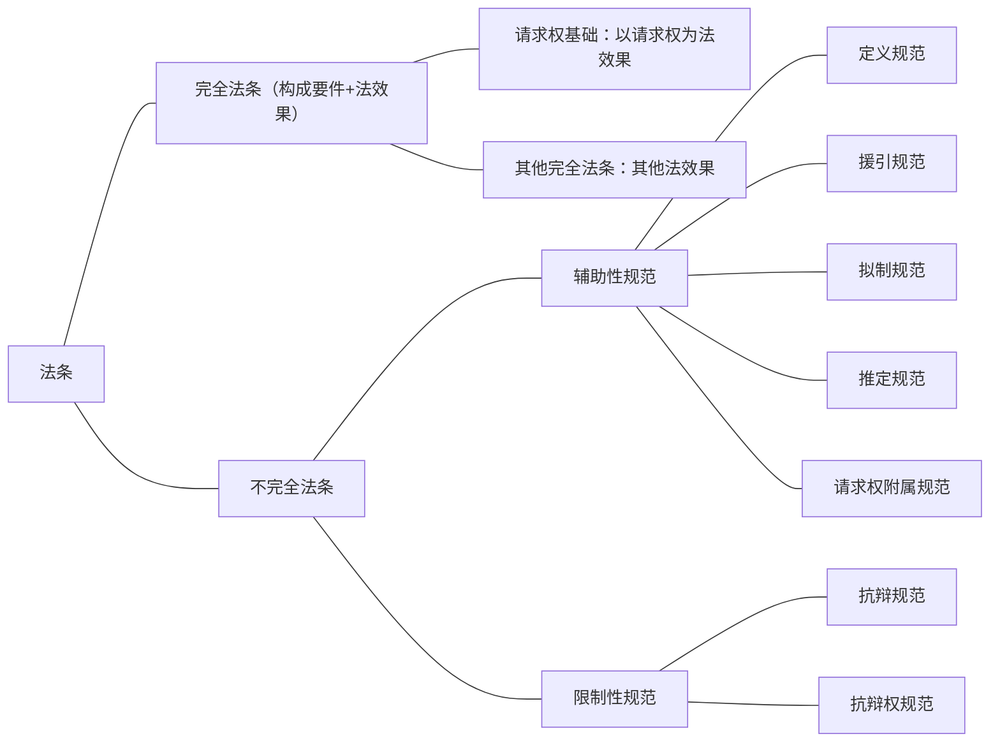

```mermaid
flowchart LR
1[法条]
2["完全法条（构成要件+法效果）"]
3[不完全法条]
1---2 & 3
4["请求权基础：以请求权为法效果"]
5["其他完全法条：其他法效果"]
2---4 & 5
6[辅助性规范]
7[限制性规范]
3---6 & 7
8[定义规范]
9[援引规范]
10[拟制规范]
11[推定规范]
12[请求权附属规范]
6---8 & 9 & 10 & 11 & 12
13[抗辩规范]
14[抗辩权规范]
7---13 & 14
```