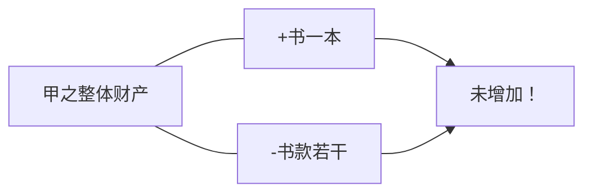
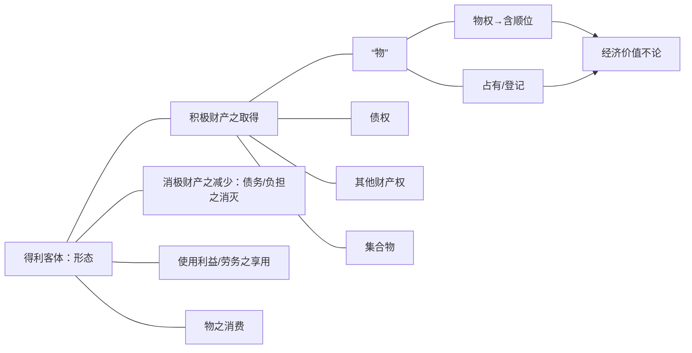
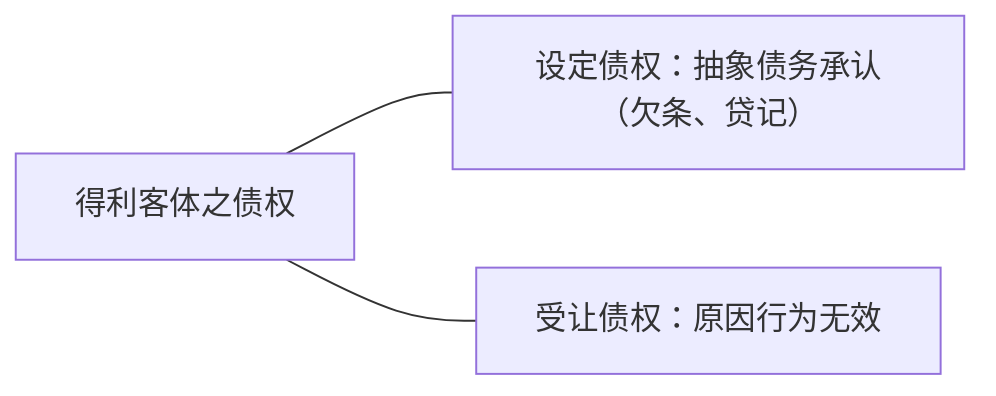
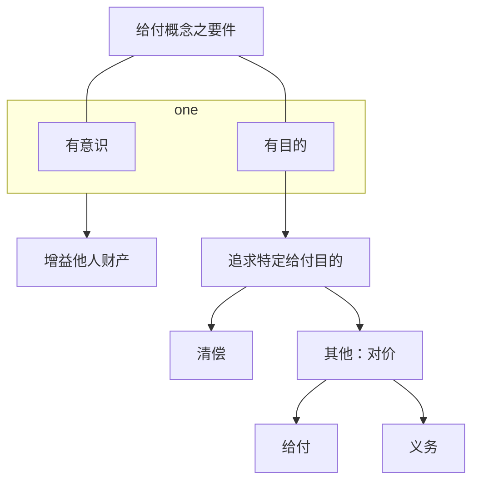
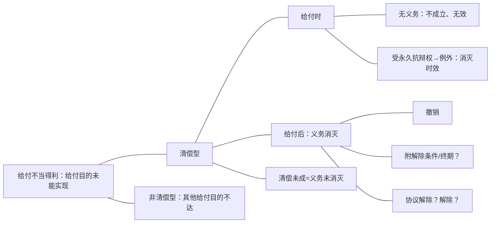
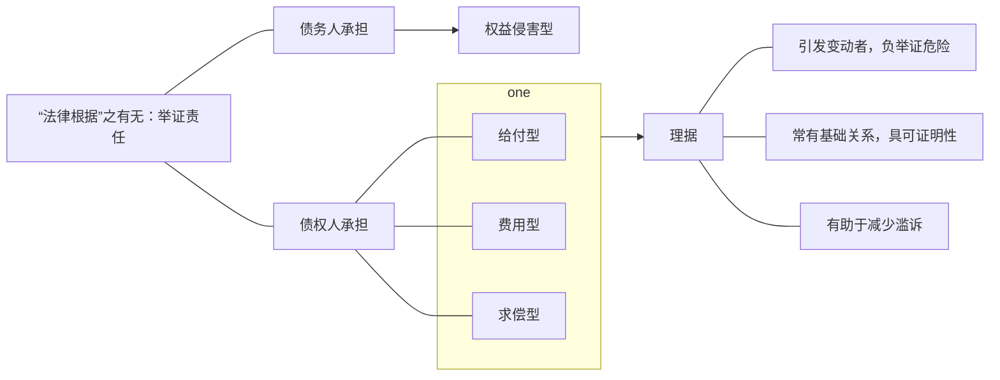
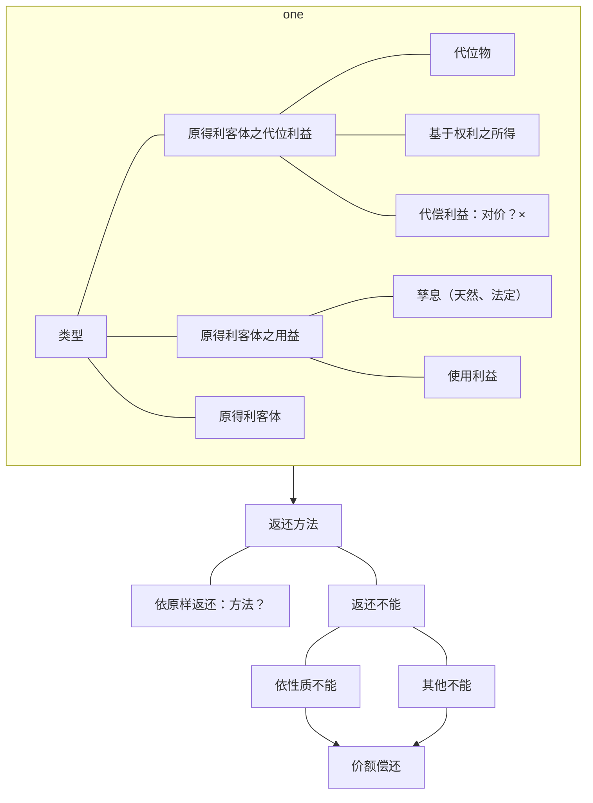

- 不当得利
	- 一般规定
		- 要件
			- 积极要件（[[第一编 总则#^4lo0ae|122]]、[[第三编 合同#^el18x2|985]]但书前）
			- 消极要件（[[第三编 合同#^el18x2|985]]但书）
		- 效果
			- 返还客体（[[第三编 合同#^el18x2|985]]、[[第一编 总则#^2i4wlr|157]]）
			- 返还范围（[[第三编 合同#^auj897|986]]、[[第三编 合同#^gyjhyj|987]]）
	- 特别规定
		- 对无偿受让人之直索（[[第三编 合同#^nkorll|988]]）
		- 法律行为无效、被撤销或确定不生效力之返还（[[第一编 总则#^2i4wlr|157]]）
		- 添附（[[第二编 物权#^4wqoiw|322]]）
		- 赠与之撤销（[[第三编 合同#^bd82ag|665]]）
		- 其他？

# （一）基础（不当得利请求权之一般规定：要件、法效果）
## 1．法条
不当得利，从整个民法典来讲，主要就只有4个条文，但是它内容非常广泛，因为它涉及到整个不当得利的基本体系问题，内容非常多。

不当得利可以分成两个部分，一个是不当得利的一般规定，另外一个是不当得利的特别规定。不当得利的一般规定，原则上讲就是民法典中[[第三编 合同#^el18x2|985]]、[[第三编 合同#^auj897|986]]、[[第三编 合同#^gyjhyj|987]]，[[第三编 合同#^nkorll|988]]我们也说它是一个比较特殊的规定。其他的还有很多特别的规定，比方说，法律行为终局的不产生效力之后的返还，规定在[[第一编 总则#^2i4wlr|民法典的157条]]，这个很明确，它就是个不当得利的规定，只是没有写在这里而已。是法律行为终局的不生效力之后返还的一个特殊的规定。那么[[第二编 物权#^4wqoiw|322]]添附的不当得利，实际上它也是不当得利的一种类型。[[第三编 合同#^bd82ag|665]]赠与被撤销之后的返还，这些其实都属于特别规定。

我想问一下[[第二编 物权#^4wqoiw|《民法典》322条]]的规定的添附不当得利是属于费用型不当得利？还是属于权益侵害型不当得利？还是作为单独的类型来看呢？
潘：同时囊括费用支出型和权益侵害型。决定因素是添附之后的物权归属。归属于原添附物权人的情况和归属于被添附物的情况，不当得利债权人不同，进而不当得利债权人是否造成了不当得利的发生也不同。（[[课堂笔记/民法笔记/金可可民法/不当得利/概述#a.举证责任|实益为举证责任之分配]]）Brox，物权归属，添附部分 ^zi302a

例1：甲将丙之建筑材料用于建筑自己的房屋，丙如何主张权利？
——甲因添附而取得“建筑材料”之所有权，属于哪种类型不当得利？——【猜测是】[[课堂笔记/民法笔记/金可可民法/不当得利/概述#c.费用型|费用型]]（猜错了吧，费用型是把自己的东西添附到别人的东西上，这是[[课堂笔记/民法笔记/金可可民法/不当得利/概述#a.侵害权益|权益侵害型]]，[[课堂笔记/民法笔记/金可可民法/不当得利/概述#a.举证责任|债务人之得利与债权人无关，债务人得证明自己没有不当得利]]。而且这里还构成侵权应该，看是否认定为过失）。
例2：甲误将丙的建筑材料用于建筑自己的房屋，丙如何主张权利？
例3：乙将丙委托其保管的建筑材料出卖给善意的甲，丙如何主张权利？甲恶意呢？
例4：乙偷丙的建筑材料出卖给善意的甲，丙如何主张权利？甲恶意呢？
——例3、例4，若甲系恶意，甲并不会在乙交付之时取得材料之所有权，此时跟例1之情形相同。但，如何处理甲乙内部关系？——初步想法：甲乙系恶意串通（？？？），合同无效，非债清偿排除不当得利。

主要阅读材料：
Wieling：60～69（追认问题）；101～109（辅助性规则的适用及其例外）；金可可不当得利评注；
王泽鉴案例。
微信聊天记录，特别是孙维飞老师的观点。

![[第三编 合同#^u92g2q]]

![[第七编 侵权责任#^0azehq]]

其中呢，不适法管理和不法管理，受益人要在获得的利益范围内向管理人承担费用偿还请求权啊，损害补偿请求权啊，但这个获得的利益的返还，是一个费用或损害的补偿请求权，它和不当得利没有关系。

再看[[第七编 侵权责任#^0azehq|民法典1182]]，侵害他人权益造成财产损失的，按照被侵权人因此受到的损失或者侵权人因此获得的利益来赔偿，这样一来，涉及了侵权人因此获得的利益，但这个因此获得的利益的计算方法和不当得利也没关系，它是损害赔偿请求权。

接下去回到民法典中[[第三编 合同#^el18x2|985]]以下不当得利请求权的一般规定，它的要件和法效果分别是什么样子的，来作一个来简要的梳理。
## 2．构成要件
![[第一编 总则#^4lo0ae]]

![[第三编 合同#^el18x2]]
### （1）概述
- 规范目的：依通说，不当得利法之规范目的，乃在去除“受益人”无法律上原因所受的利益。其具有两个基本功能：
	- 一是“矫正缺乏法律关系的财货移转”， ^2pngcm
	- 二是“保护财货的归属”。 ^7w1dkz
- [[课堂笔记/民法笔记/金可可民法/不当得利/概述#^2pngcm|前者]]如买卖合同无效时，买受人请求出卖人返还已付价金。
- [[课堂笔记/民法笔记/金可可民法/不当得利/概述#^7w1dkz|后者]]如乙擅自出卖其保管的甲之玉石，丙善意取得，甲向乙主张玉石的价额偿还。
- 至于[[第三编 合同#^el18x2|本条]]但书第1项、第3项，系指不当得利请求权的积极构成要件虽得满足，但请求得利返还可能违反诚实信用原则（[[第三编 合同#^el18x2|本条]]但书第3项），或违背一般道德理念（[[第三编 合同#^el18x2|本条]]但书第1项）。至于[[第三编 合同#^el18x2|本条]]但书第2项，系为避免给付之徒劳往复，特别提示即使期前清偿，债权人受领利益（含提前受偿之期限利益）仍视为有法律上之原因。在法律规范体系上，本条系不当得利制度的一般规定，与合同（如本法[[第一编 总则#^2i4wlr|第157条]]以及[[第三编 合同#^69qd4g|第566条]]“）、无因管理（如本法[[第三编 合同#^cguwou|第979条]]、[[第三编 合同#^u92g2q|第980条]]）、物权（如本法[[第二编 物权#^axo3xh|第235条]]、[[第二编 物权#^5yogki|第459条]]、[[第二编 物权#^txitne|第460条]]、[[第二编 物权#^m0eqwm|第461条]]）、侵权责任（如本法[[第七编 侵权责任#^0jplgg|第1165条]]）等各个领域均有密切联系。在对本条进行解释适用时，需要特别注意本条的解释适用与各相关规定的协调。
	- 首先看[[第一编 总则#^4lo0ae|§122]]和[[第三编 合同#^el18x2|§985]]，都说有了[[第三编 合同#^el18x2|§985]]，[[第一编 总则#^4lo0ae|§122]]还有什么意义呢？金老师个人的答案是毫无意义。因为[[第一编 总则#^4lo0ae|§122]]之所以没有删除，乃是因为最后在编纂进民法典的时候，做了一个不修改的决定。如果不作这个决定，[[第一编 总则#^4lo0ae|§122]]会完全和[[第三编 合同#^el18x2|§985]]重复的，应该删除的，所以是一个偶然决定造成的，所以[[第一编 总则#^4lo0ae|§122]]只有说明意义，“法律上会保护这样的不当得利请求权”，但是它的构成要件等等，都是在[[第三编 合同#^el18x2|§985]]。所以呢，金老师个人意见是，有了[[第三编 合同#^el18x2|§985]]，不需要再援引[[第一编 总则#^4lo0ae|§122]]。
	- 再往下看，[[第三编 合同#^el18x2|§985]]分成两个部分：第一个部分，看，“得利人没有法律根据取得不当利益”，这是一个构成要件，积极构成要件。法效果是什么？—受损失的人可以请求返还取得的利益，这是一个法效果。“但是有下列情形之一的除外”，下面三个都是消极要件：虽然具备了前面那个积极要件，如果有下面三种情形的，前面所说的法效果也不会产生，所以这是[[第三编 合同#^el18x2|§985]]的一个基本的构成逻辑。

再往下看，这个不当得利请求权的要件，从[[第三编 合同#^el18x2|§985]]来看，应该包括什么？

**不当得利之要件：各类型中之含义**

||一方受有利益|源于他方之不利|无法律依据|
|:---:|:---:|:---:|:---:|
|给付型|得利|因他方给付|给付目的未能实现|
|（非给付型）权益侵害型|得利|本属他方权益范围|权益变动欠缺正当事由|
|（非给付型）求偿型|得利|因他方之代为清偿|无清偿义务|
|（非给付型）费用型|得利|因他方为其物支出费用|无费用支出义务|

- 不当得利之要件
	- 取得利益
	- 没有法律依据
		- 统一说：公平/正义/债权/权利
		- 非统一说
			- 给付型：给付目的未能实现
			- 非给付型
				- 侵害权益型：权益变动欠缺正当事由
				- 求偿型：无为他人清偿之义务
				- 费用型：无为他人之物支出费用之义务
	- 以他人之利益为代价
		- 给付型：给付人
		- 非给付型
			- 侵害权益型：权益之原本归属者
			- 求偿型：为他人清偿之人
			- 费用型：为他人支付费用之人

- 我们会说，按照这个[[第三编 合同#^el18x2|§985]]，我们可以提取出来的不当得利请求权的积极要件是什么？—积极要件是三个：
	1. 一方受有利益，他的财产有增加；
	2. 必须是这个不利，来自于他人的某一个行为；是以他方所受到的不利，来让他自己受到一个利益；
	3. 一方所受的利益没有法律根据。

- 我们看一下[[第三编 合同#^el18x2|法条]]，这三个要件是怎么提取出来的：
	- 一方取得了、受有利益这个要件；
	- 第二个，有个受损失的人，也就是说，这意味着什么？某个人所取得的的利益，实际上是源于他方的代价；
	- 第三个，特别强调没有法律根据，不当的利益。所以这是没有法律根据这个要件怎了来的。

那么这三个要件，我们会说，在这三个要件里面，我们特别要强调的就是各种不同的不当得利类型中，这些要件怎么去理解它，在等会儿讲下去的过程中会详细讲的，这里先大概说一下。
### （2）要件一：一方受有利益
#### A.以整体财产为断（？）：非以整体财产未断——具体得利客体
第一个要件，必须是一方受有利益。这个怎么来判定，是不是受有利益不能以整体财产来看，而是要求某一个具体的形态来看，一定要分析出具体的得利客体。举一个例子来说明：甲从业马逊订购《中华人民共和国民法典》一本，并支付购书款若干。次日，亚马逊将书送交于甲。其后发现买卖合无效。亚马逊要求甲返还该书。
看一下，任何判定甲是不是受有得利，按甲的整体财产来看，这就会产生一个问题：甲的财产中现在是多了书一本，少了书款若干。如果我们认为这本书的价值和他付出的价金书款是一样的，这个时候就甲的整体财产来看，就不能说甲受有得利。这个结果是不当得利法不能够接受的，按照我们得利法的判定是什么？——我们不看甲整体的财产有没有变，看甲的财产中有没有多出不应该多出的具体东西。这里面的具体东西是什么？——具体东西是这本书。如果合同有效，他会买到这本书，但合同无效的话，就不应该有这本书，客体好像是这本书，这个是具体的，一定是具体的。但是，得利客体，说是这本书，又不精确。虽然把它看成个体了，但是“个体”的描述，必须要准确。我们说这个时候甲的得利客体是什么？—是书的占有还是书的所有权啊？还是两者都有？——我们说，这个取决于承不承认处分行为无因性，如果认为是有因的，它就没有所有权，在书的占有。如果是行为的无因性，会说这个时候得利客体是书的所有权和占有。

那么也就是说，得利的客体，要落实到各种利益上面去，所以我们再看，按照这个视角，精确描述具体得利客体的视角，我们可以将得利分为三个类型：

首先我们说得利的客体，可以是取得某一个具体的积极财产。积极财产意味着什么？——一个有财产价值的东西，这个时候本来不应该取得，进入了某一个人的财产。那么这些积极财产包括什么呢？——我们说，
#### B.积极财产的增加 
##### （A）“物”
###### a.包括物（权）、登记顺位
物前面讲过了，我们真正在适用不当得利法的时候，千万不能说得利客体是物，这么一讲就极不专业了，不可以这样讲，必须要指出，是物权还是占有，还是物的登记，一定要讲清楚。所以，举个例子来说（得利客体是物权的）：前面讲过了，这本书的买卖，如果认为是物权行为是有无因性的，买卖合同无效，得利客体就是物权，所有权，以及占有。那么如果买卖合同无效，没有无因性，那么这个时候它的得利客体就是物的占有。

- 接下去拿不动产为例：买了一个房子，合同无效。
	- 现在问，得利客体是什么？——肯定没有人再说是房子了，要么是房子所有权，要么就是一个登记法律地位而已。
	- 如果认为买卖合同无效，所有权从来就没有移转过，那么唯一进入买受人财产的内容是什么？——就是一个登记。这个登记是一个有财产利益的法律地位，本身属于不当得利的客体。
	- 所以呢，在这种情形下，我们看到，买卖合同无效，买受人的财产中多了一个登记，此时要求乙把这个登记去掉，有哪些请求权？——更正登记请求权，所有权是甲的。第二个请求权是什么？——用返还，是更正请求权到不当得利的返还请求权，它最后的操作方式，都是要求乙把这个登记涂销，内容是一致的。
###### b.登记、占有
再看，物权里面的不当得利的内容，也可以是物权里面的其他物权，包括建设用地使用权什么都有可能的，就是负担行为无效的情形等等。那么担保物权也有可能（比方说也是担保合同无效了）。那么我们值得指出的是在物权的情形，它有可能得利的客体是物权的顺位，比方说甲有一个房子，它要为乙登记第一顺位的抵押权，为丙登记的第二顺位的抵押权。登记的时候登记反了，按照甲和丙之间的合同，来只需要给它登记一个第二顺位的抵押权，而给它登记的却是第一顺位，此时得利的内容是什么？——就是一个按照不当得利返还可以要求更正顺位。
###### c.不考虑经济价值
与物的经济价值是没关系的，不考虑。eg：比方说情书等等。
都是属于得利客体之一，这个都没关系。
##### （B）什么情形下会有债权呢？
- 刚刚讲了得利的客体必须要去看具体的形态，不能以整体财产来看，必须是按照一个具体的得利客体来看。而这个具体的得利客体呢，我们会说，一定要把它具体的形态描述清楚，那就是我们分了这么多类型。所以根据这些类型，以后在实务过程中，可以按照这些类型来判定它具体的得利客体是什么，一定要讲到一个最精确的类型上面去。
	- 第一个，得利客体可能是物，但是物本身，它不是一个法律术语不是得利客体意义上的法律术语。作为一个得利客体，必须要明确，是物上的权利还是物上的占有还是登记，一定要落实到这个最细的地方。所以刚刚讲到的买了一本书，有可能得利客体是书的所有权，也有可能得利客体是书的所有权加上占有。有的时候，得利客体是纯粹的占有，比方说某人无权占有A这本书，他的得利客体就是这个占有，很典型就是占有而已。
	- 那么在不动产上面，我们会讲得利客体有可能是不动产上面的物权，也有可能是不动产上面的登记，这个刚才也提到过了。就是买卖一个房子，过户登记办完了，后来发现买卖合同无效。我们会说，如果不承认物权行为及其无因性的话，我们会讲，买受人财产中唯一增加的是什么？——就是上面多了一个不应该有的登记。所以，对于这个登记而言呢，对于出卖人而言，要想把这个登记给去掉，有两个请求权基础。
		1. 更正登记请求权，因为买卖合同无效，这个所有权登记在乙的名下也登记错了，真正的所有权在甲那里呢。乙这里只有这个登记了，登记时错误的，可以要求错误更正。
		2. 第二个请求权是不当得利，因为财产中多了一个不该有的登记，要求还给本人。
	- 无论是更正登记请求权还是按照不当得利请求他返还登记法律地位，请求权的内容实际上是一样的，都是要求这个买受人同意涂销这个登记。这就是以登记作为不当得利客体的情形，是这样一个情形。
	- 那么在得利客体是物权的时候，我们会讲，得利客体不仅是有可能是物权，还有可能是物权的顺位。最为典型的例子如上（甲以自己的财产为乙丙两个人设定抵押，约定好第一顺位是乙，第二顺位是丙。现在呢，去登记的时候，误把丙登记为第一顺位，把乙登记为第二顺位。那这个时候就讲，这个时候对丙来说，本来他应该只得到第二顺位的登记，现在变成第一顺位的登记了，属于不当得利，可以要求返还，返还的结果就是同意变更为第二顺位的登记）。
	- 第三个，就是得利客体如果是物的，无论是物权还是物上的占有或登记，这个物本身也没有经济价值，这是在所不论的。哪怕经济价值不明显或没有经济价值的物，本身也可以成立得利客体。我们通常教科书里讲的，比方说情书（甲写给乙的情书被丙没有法律上的原因占有，那么乙可不可以要求丙返还？当然可以返还，理由是什么？也是不当得利，为什么？——虽然没有价值，它仍然是个物，这个物上的权利和占有，仍然可以成为不当得利的客体。）

###### a.债权转让
我们好多情形都会出现这样的不当得利。不当得利的客体还可以是债权。在债权转让的过程中，有可能债权是不当得利。

eg：甲对乙有一个债权，甲把对乙的债权卖给了丙，做了个债权买卖合同。根据债权买卖合同，甲就有义务把对乙的债权让与给丙。现在买卖合同签好了之后，甲为了履行这个义务，于是和丙做了个债权让与合同（这是个处分行为，前面买卖是负担行为），做了一个处分行为之后，债权就过去了，债权过去之后发现，甲和丙之间的债权买卖合同。
这个时候就要注意了，我们说，它得利客体就是个债权。在这里呢，得利客体是个债权（第一种情形出现了，债权转让过程中负担行为发生问题）。
###### b.抽象债务承认
第二种情形中得利客体是债权，指的是设定债权，结果呢，没有基础关系。最为典型的是什么？——

- eg：甲和乙有长期的业务往来，现在双方要进行结算，结算下来乙还欠甲100w，乙就写了个欠条，成“是的，我欠你100w”，根据前面的算法，他误以为欠100w就写了。写了之后，事后发现算错了，乙根本不欠甲钱，一分都不欠。那么这个100w本身能不能产生效力呢？
	- 我们说，100w叫抽象的债务承认，它这100w的欠条上面的意思表示就是，“现在开始，我承认我对你负有100w的债务”。如果是把这样一个欠条理解为真正发生债务的意思的话，那它叫抽象债务承认。这种情形呢，我们就说，这个设定债权了，那么实际上后面这个基础关系不存在，那么乙所取得的这张欠条上所记载的债权就失去了法律上的依据了，这个时候可以要求不当得利返还。
	- 在我们国家，这种单纯的发生债务的抽象债务承认，在刚刚那个例子里面可能会有点争议，但其它的例子里面就不一定会有争议（两个主体不一样就不会有争议）。刚刚那个争议在哪里呢？——刚刚的争议说，你单纯的是确认以前的债务，没有想要发生新债务的意思，所以它不叫抽象债务承认，这是通常又的一种争议。

- 现在把例子换一下就没问题了：eg：甲和乙长期业务往来，丙知道乙换不出钱，于是他在乙和甲算完钱之后，100w，丙向甲写了个欠条，“现在开始我欠你100w”，这么一个明显是发生新债务的意思了，当作免责的债务承担也好，当作并存的债务承担也好，都是新债务了吧。最后发现，甲和乙之间一算下来，算错了，实际应该不欠钱。
	- 那么这个甲和丙之间所做的发生债务关系的负担行为，产生了新的债权（它本身不因为算错而无效，它还是有效的，这个时候可以构成不当得利要求他返还这个债权。
	- 问题是这个债权怎么返还呢，这个债权的返还我们讲，退出或免除，这个时候丙对甲有个免除请求权，这种方法，不当得利请求权里通过免除的方法来履行）。
###### c.贷记
- 另一种情形的得利客体是贷记。银行贷记记错了：eg：A在银行有个账户，本来里面只有10块钱，银行不知道为什么，某人往别人汇款错汇到A的账户里面了。银行在A的账户里面就打上了10w这么一个贷记。这么一个贷记是抽象的债务承认，一旦记在上面，债权债务就发生了。打错了，只能请求返还，而不能直接说那个东西是无效了，这不行。
	- 这个时候贷记本身记载了一个债权可以要求不当得利来返还。
	- 可能就有疑问了，在受让债权的时候，债权买卖合同无效，那个债权怎么还呢？不当得利的时候？——这个时候就要一个反向的债权让与，再让与回来就行了。
	- 得利客体是债权也是有可能的。
##### （C）其他财产权利
在我们看，得利客体也有可能是其他的财产权，那就很常见了。商标也有可能了，专利权（知识产权）、股权，都有可能。
##### （D）集合物
###### a.事实上的集合物
那么积极财产里面得利客体还可能是集合物，有事实上的集合物、法律上的集合物，都有可能。[^1]事实上的集合物，

[^1]:事实上的集合物的本质仍然是单个物的总和，其和自然集合体（natuerlichen Mehrheit）（例如扑克牌、稻谷）跟数个物的紧密联系（mehrere Sachen fest zusammengefuegt）（例如汽车）相区分，区分标准是依照一般的交易观念，以经济视角出发进行区分；法律上的集合物有两类，公司（Unternehmen）和财产(Vermoegen)。vgl.Brox: BGB AT.S.348ff.

eg：有很多很多书，打包卖给别人，这个得利客体是什么（当事人买卖合同无效）？
得利客体我们可以简称为集合物，那么多的书（一个图书馆里的书），这只是一个简称而已，真正分析起来，得利客体是里面一本一本书的所有权和占有，但是也可以有集合物来指称。
###### b.法律上的集合物
还有法律上的集合物，叫企业买卖的情形，买卖的就是企业的财产整体啊，这个时候也叫集合物。
#### C.也可以是消极财产的减少。
消极财产的减少指的是什么呢？
##### （A）债务消灭
eg：比方说甲欠乙一笔钱，现在某丙替甲把钱还了。丙为什么想替他把钱还了？——丙以为，自己对甲负有这个义务，所以才替甲还钱。
一还，第三人清偿，丙一拿，甲的债务就消灭了。后来发现，丙根本对甲没有这个义务，丙以为产生义务的合同是无效的，这个时候我们讲，这个甲有什么得利呢？——它的得利是本来欠乙一笔钱，财产中有一个负资产，因为丙的清偿让它债务消灭了，得利客体就债务的消灭。（[[课堂笔记/民法笔记/金可可民法/不当得利/概述#b.求偿型|求偿型不当得利]]）
##### （B）负担消灭
也有可能是负担的消灭，这个负担指的是什么？——物上的负担（就是担保物权、用益物权这种情形）。以担保物权为例，甲把自己的房子为乙设定了一个抵押权，后来乙错误的把这个抵押权给涂销了，涂销错了。这个时候我们说，甲的得利是什么？甲的得利就是一个负担的消灭，担保物权的消灭。这个都是完全有可能的。

>Wieling:[^2]
所取得的东西可以体现为某种拘束的解脱，如在权利保有人无法律上原因地丧失了某项物权或债权的情形下。
例子：S有义务为自己对G承担的债务设定担保物权，故将自己的金表质押给G。后来G误以为S已清偿了债务，于是将表还给了他。
质权依第1253条第1款和第1255条的规定而消灭，S无法律上原因地从G的质权中解脱出来。G可以将质权的抛弃作为不当得利请求返还，亦即要求重新设立质权。
例子：S对G欠了1000欧元，暂时无力支付。他的朋友F向G还了这笔债，打算以后朝S把钱要回来。S获得得了债务解脱。

[^2]:《德国不当得利》，第9页。

#### D.使用利益／劳务之享用
##### （A）使用利益
- 第三类得利的客体，我们讲，叫使用利益或者叫劳务的享用。什么意思呢？——我们来举个例子：eg：A租了一套房子，租的这套房子啊，租了三个月。三个月之后发现这个租赁合同自始无效，问，A的得利是什么？
	- 得利就是对这套房子的居住的使用，就是这个使用利益而已。那么，对方的得利是什么（出租人）？——A给B的租金，双方都要相互返还。
	- 租金怎么还？——还给A就行了，付一笔钱给A。
	- 使用利益怎么还？——后面会讲到的，它无法按原样返还的，只能做价额偿还，折价补偿。
	- 怎么折价补偿啊？这个时候A对这套房子的使用，值多少钱，市场上值多少钱还多少。通常有个推定，推定是什么？——一个有效租赁合同中这个租金可以用来计算这个使用利益的市场上的价值。当然，前提是我们这个租赁合同的无效事由不是因为行为能力和意思瑕疵导致的，使用利益是个单独的得利客体。
##### （B）劳务享用
还包括劳务的享用，最简单了。某甲到某个地方去理发，理完发发现理发合同无效，问，甲的得利客体是什么？——不就享受了一个理发的服务吗？这个很常见的，各种劳务合同，一旦无效，得利客体就劳务的享用，都是一样的。
##### （C）费用的节省？
现在来看一看，这里一定要注意一点，传统的书上，在使用利益的情形，在得利客体是使用利益或劳务享用的情形，通常把这个得利描述为什么？——费用的节省。这种考察方法完全是错误的，这种思维方法是错误的。因为，只有在找不到这种得利客体的时候，我们才会用费用的节省来描述什么有没有现存利益，这个待会儿会讲到的。总之，希望在这里注意一下，传统上叫什么？——叫“费用的节省”，我们现在不用这个概念了。
#### E.物的消费
- 还有一个得利客体叫物的消费。物的消费指的是什么？eg：某甲买了一个苹果，让人送，结果送到邻居乙家去了。乙看到这个苹果，以为是自己妈妈买的，很高兴的拿了一个苹果吃了。我们看一下，这个被吃掉的苹果，它的得利客体是什么？
	- 很显然，他拿的这个苹果，肯下第一口之前，这个苹果所有权不是乙的，得利客体不是所有权。
	- 第一口啃下去，也没有把这个所有权啃成自己的，只是说这个苹果是属于甲的苹果上少了一口，第二口啃下去，同样的所有权剩下那个部分还是甲的，只是变成一个被咬了一口的苹果，属于甲了。
	- 但是，咬进去的两口，在咬进去的同时所有权就消灭了，等到乙把这个整个苹果都吃完，整个苹果所有权都消灭了，但是整个过程中，得利客体是不是苹果所有权？——没有，整个过程中，乙从来没有取得过这个苹果所有权，所以这个得利客体，单纯的就是物的消费，还有其他的零星的得利客体，待会儿还会讲到。

>Brox: [^3]
3.Verbrauchbare und nicht verbrauchbare Sachen
a) Verbrauchbare Sachen sind bewegliche Sachen, deren bestimmungsmäβiger Gebrauch in dem Verbrauch oder in der VeräuBerung besteht(§92 1). 
Beispiele:Nahrungs-und Genussmittel,Brennstoffe,Geld.
Bewegliche Sachen aller Art werden dadurch zu verbrauchbaren Sachen, dass sie zu einem Sachinbegriff (§ 35 Rn. 8) zusammengefasst oder in einen solchen eingefügt werden, dessen bestimmungsmäßiger Gebrauch in der Veräußerung der einzelnen Sa-chen besteht (vgl. § 92 I1).
Beispiele:
Bücher
einer
Buchhandlung,
Konfektionswaren
eines Bekleidungsgeschäfts, Möbel eines Einrichtungshauses sowie Warenlager aller Art.
b) Nicht verbrauchbare Sachen sind alle übrigen Sachen. Der allmähliche Verschleiß durch Abnutzung ist kein Verbrauch.
Beispiele: Bücher,Bekleidungsstücke, Einrichtungsgegenstände.
c) Diese Unterscheidung ist für Gebrauchsüberlassungsverträge und Nutzungsrechte bedeutsam.
Beispiel:A »leiht« ihrer Nachbarin N zehn Eier. N soll nicht wie bei der Leihe nur zum unentgeltlichen »Gebrauch« der Eier berechtigt (§ 598) und verpflichtet sein, diese Eier nach dem Ende der Vertragsdauer wieder zurückzugeben (§ 604 D). Vielmehr soll N befugt sein, diese Eier in ihrem Haushalt zu verbrauchen;sie ist nur verpflichtet, andere Eier gleicher Art und Güte zurückzuerstatten (§ 607 1: Sachdarlehen).
Da verbrauchbare Sachen nur durch ihren Verbrauch genutzt werden können, wird der Nieβ-braucher verbrauchbarer Sachen deren Eigentümer; nach Beendigung des NieBbrauchs hat der Nießbraucher dem Besteller den Wert der Sachen zu ersetzen (§1067).

[^3]:Brox,S.355

##### （三）消费物与非消费物
###### 1．消费物是指其合于用法的使用在于消费或让与的动产（第92条第1款）。例如：食物和享乐品、燃料、钱。
通过以下方式所有种类的动产均将成为消费品：使它们结合为集合物或者装入其中，该集合物合于用法的使用在于逐个地让与物（参见第92条第2款）。
例如：书店中的书、服装公司批量生产的商品、房子以及客栈中的各种家具。
###### 2．非消费物是所有其他物。消费并非指使用造成的逐渐损耗。
例如：书、衣服、家具。
###### 3．这种区分对于使用让与合同以及用益权非常重要。
例如：A女士“借给”女邻居N十个鸡蛋。N不应像在使用借贷（Leihe）的情况下那样只享有无偿“使用”这些鸡蛋的权利（第598条）并负有在合同届满后返还这些鸡蛋的义务（第604条第1款）。更确切地说，N应当享有在家中消费这些鸡蛋的权利，她只负有以种类和品质相同的其他鸡蛋进行偿还的义务（第607条第1款，物的消费借贷合同）。
因为消费物只能通过消费被使用，所以消费物的用益权人是其所有权人，用益终止后用益权人须向设定人赔偿物的价值（第1067条）。

陈卫佐：[^4]
§598 Vertragstypische Pflichten bei der Leihe
Durch den Leihvertrag wird der Verleiher einer Sache verpflichtet,dem Entleiher den Gebrauch der Sache unentgeltlich zu gestatten.
第598条 在使用借贷的情形下的典型合同义务
因使用借贷合同，物的贷与人有义务无偿地许可借用人使用该物。
「使用借贷合同是无偿合同。无偿性是使用借贷区别于使用租赁（德国民法典第535条至第580a条）的根本特征。此外，虽然使用借贷和赠与（德国民法典第516条至第534条）都是无偿合同，但使用借贷的贷与人只是将对物的使用和对物的直接占有暂时地交给借用人，而赠与人则是将财产所有权永久地转让给受赠人。Vgl．Medicus／Lorenz，Schuldrecht Il，Besonderer Teil，16．Autl．2012，S． 209-210。」

[^4]:《德国民法典》第269页（8598）脚注。

陈卫佐：[^5]
§607 Vertragstypische Pflichten beim Sachdarlehensvertrag
(1)Durch den Sachdarlehensvertrag wird der Darlehensgeber verpflichtet,dem Darlehensnehmer eine vereinbarte vertretbare Sache zu uberlassen.Der Darlehensnehmer ist zur Zahlung eines Darlehensentgelts und bei Falligkeit zur Ruckerstattung von Sachen gleicher Art,Gute und Menge verpflichtet.
(2) Die Vorschriften dieses Titels finden keine Anwendung auf die Uberlassung von Geld.
第607条 在物的消费借贷合同的情形下的典型合同义务
（1）因物的消费借贷合同，贷与人有义务将所约定的可替代物交给借用人。借用人有义务支付消费借贷的报酬，并在清偿期到来时以种类、品质和数量相同的物予以偿还。
（2）本节的规定不适用于金钱的交给。
「物的消费借贷的例子：从邻居那里借10个鸡蛋，消费后以同种、同质、同量的鸡蛋予以偿还，并支付报酬。物的消费借贷合同（德国民法典第607条至第610条）区别于使用借贷合同（德国民法典第598条至第606条）的地方：在物的消费借贷的清形下，借用人成为贷与人所交给之物（如上述例子中的10个鸡蛋）的所有人，借用人只须以同种、同质、同量的可替代物予以偿还；在使用借贷的情形下，物的贷与人仍然是物（如无偿地出借的书）的所有人。此外，物的消费借贷是有偿合同（德国民法典第609条），而使用借贷是无偿合同（德国民法典第598条）。
Vgl. Der Brockhaus Recht,2002, S.171;Medicus/ Lorenz,Schuldrecht II,Besonderer Teil,16.Aufl.2012,S.220。」

[^5]:不宜把“消费借贷”（Darlehen）译成“借贷”，因为除消费借贷外，使用借贷（德 国民法典第598条至第606条）也属千借贷。此外，除第607条至第610条所规定的“物的消费借贷“（Sachdarlehen）外，德国民法典旧文本还在第488条至第498条规定了“金钱消费借贷“（Gelddarlehen）。然而，在《债法现代化法》自2002年1月1日起施行以后，德国民法典现行文本第488条至第505e条将Darlehen等同于 Gelddarlehen，也就是说，消费借贷如果不加修饰语，就是指金钱消费借贷（贷款）。这在逻辑上并不是无懈可击的。译注者认为，“消费借贷”应当是一个上位概念（属概念），它的下位概念（种概念）是“金钱消费借贷和“物的消费借贷＇，不应把＇金钱消费借贷跟“消费借贷”等最齐观。尽管如此，为了方便读者理解，本书仍然将 Darlehensvertrag 译成“贷款合同”。参见译注者为德国民法典第488条第1款加的注解。参见《德国民法典》第271页（§607）脚注。
#### F.延伸：无权处分与费用之节省
所以，在这里希望掌握的一点是什么？——得利客体，一定是金老师这个表格中一个一个具体的类型。

- 得利客体之疑难问题
	- 无权处分
		- 对价？
		- 债务之消灭？
		- 处分权？
	- 费用之节省？

在无权处分里面，得利客体是什么，他会又一些疑难的问题，待会儿再讲，这里不多说。
#### G．江平（鄢；600页）
受益人受有财产上的利益，即“得利”，表现为两方面：积极的得利和消极的得利。积极的得利，受益人现在的财产或利益都在积极地增加，消极的得利：财产或利益本应减少而未减少。既有得利又有损失，但其损益抵销后剩余有利益的，仍为受有利益。

任何具有财产价值的权利均可成为不当得利的客体。例如，所有权、他物权、知识产权的取得，当然为受有利益。债权的取得，性质上也为受有利益。但如果受益人取得的债权是须为对待给付的债权（双务合同），因取得人须以减少自己的财产作为对价，不构成受有利益。
本应设定的权利负担未设定。依据我国《担保法》的规定，在财产上设定抵押，除应当办理登记之外，其他财产的抵押是否办理登记，采自愿原则。如当事人约定办理登记而未办理，财产的所有人即为受有利益。通常，劳务的提供或者为履行债务，或者为无因管理，或者为纯粹的助人行为。如果劳务提供的基础法律关系不存在（如误耕他人之田）、无效或被撤销，劳务的提供人不得请求报酬。劳务的消费人因他人劳务的提供节省了自己的支出，因而构成受有利益。无合法权源或者合法权源消灭后而使用他人之物的，因其使用具有财产上的价值，且可以减少自己的费用，故可以构成受有利益。例如，租赁关系消灭后，承租人仍使用他人房屋。
### （3）要件二：没有法律上原因
第二个要件必须是没有法律上根据，或者叫没有法律上原因。传统的术语叫没有法律上原因，我们的法条呢，叫没有法律根据。没有法律根据，怎么来解释什么叫没有法律上根据呢？——以前有统一说和非统一说。
#### A.统一说
- 统一说及其缺陷
	- 公平说：受利益而违反公平正义原则→空泛
	- 正法说：受利益违反维护正当生活之法律基本理念→空泛
	- 债权说：受利益无其所依据之债权者→解释力不足：善意取得
	- 权利说：受利益而无保持该利益之权利→解释力不足：添附

统一说什么意思呢？不用区分不当得利的类型，所有的不当得利，都用同一个理论来说，什么叫没有法律上原因。有四种学说：公平说、正法说、债权说、权利说。

公平说：你拿到利益不公平，那就是没有法律上原因了。这个就不知道在说什么了。因为，相当于用公平来替代了一个法律上原因的概念，而无论是法律上原因还是公平，都是一个需要具体化的、模糊的概念，这个就没有意义了。我们需要的是，你就没有法律上原因，找出一个具体的判定辨准，这种公平说不能给我们。

正法说：同样的，它说维护正当生活的法律基本理念，这个说了跟没说是一样的。

- 债权说：说，你如果受了一个利益，受这个利益没有一个债权来支撑你的话，那就是无法律上原因了。这个很具体了，但可惜的是解释力不足，看下面这种情形：eg：【债权说之缺陷】乙擅自出卖其替甲保管的笔记本电脑于善的丙，丙善意取得。其无须不当得利返还，法律上原因：善意取得。
	- 现在问，丙善意取得之后，他需不需要把自己善意取得的这个笔记本电脑所有权再不当得利返还给甲？我们说不需要了，那么到底是什么东西在阻却甲对丙有这个请求权呢？
	- 我们说善意取得本身，为了维护善意取得的制度目的，必须要认为他本身包含了法律上的原因，进而可以阻却甲对丙主张不当得利。那么，在这种例子里面，法律上的原因完全不是债权，是善意取得，所以，债权说不周延。

- 我们再看，进而提出了权利说，权利说说，你受有一个利益，但你又没有保持这个利益的权利，那就是无法律上原因。它又碰到一个解释力不足的现象：看案例eg：【权利说之缺陷】乙将甲委托其保管的木材用于装修自己的房屋，木材附合于自己的不动产：有权保有“木材”，仍负不当得利返还义务。
	- 我们说乙也没有权利把附在上面的木材继续保有呢？——当然继续保有，成为重要成分了。
	- 但是他虽然有权保有这个木材，却仍然要就木材的价值对甲附不当得利的返还义务，所以，有权保有木材，他不影响不当得利发生了。所以，光有保有的权利，不能阻却不当得利。
#### B.非统一说
- 非统一说
	- 给付型：给付目的未能实现
		- [[课堂笔记/民法笔记/金可可民法/不当得利/概述#^igmr0v|清偿型]]：[[课堂笔记/民法笔记/金可可民法/不当得利/概述#^6wyoeq|自始/嗣后无给付义务]]
		- [[课堂笔记/民法笔记/金可可民法/不当得利/概述#^mfz6p6|非清偿型]]：其他给付目的不达
	- 非给付型
		- 侵害权益型：无权益变动之约定/法定事由
		- 求偿型：无为他人清偿之义务
		- 费用型：无为他人之物支出费用之义务

最后我们就发展出了一种非统一说。非统一说说，你要统一的找出一个东西来论证什么叫法律上的原因，没有意义，始终会不周延。第二个，你提出一个周延的，就会太空，没有判定的使用价值。所以非统一说要根据各个不同的不当得利类型分别来论证它的法律上的原因是什么，每个类型不一样。在这个思想之下，出现了上图。
##### （A）给付型
给付型不当得利：什么叫没有法律上的原因呢？一一是给付目的不能实现就是没有法律上原因了。这个时候我们要看看，什么叫给付不当得利：

- 给付的概念
	- 给付不当得利首先来学习一下什么叫给付的概念，什么叫给付？——给付有3个要件，
		- 第一个要件：是因为某个人的行为让他人财产增加了。一定有一个因行为而财产增加的要件。
		- 第二个，这个他人财产的增加，是有意识和有目的的行为所致的。有意识是第二个要件，有目的是第三个要件。所以加起来就一句话：有意识、有目的增加他人财产的就叫给付。

###### （a)有意识
那么我们看一看，什么叫有意识？

eg：甲之羊误入乙之羊圈，乙喂养数日后发现。
问，甲因此所受的不利是因给付所受的不利还是非因给付所受的不利？——答案非常清楚，非因给付。为什么乙为甲的羊不是给付？——因为乙不是有意识的去增加他人财产，他都不知道这是甲的羊，哪有想到去增加甲的财产啊？（没有这个意识，误以为是自己的东西而去管理自己的东西等等，永远不会构成给付）

eg：报错孩子案：
同样的，抱错孩子的这些案型是一样的，此时误以为这孩子是自己的，所以没有去增加他人财产的意识，这都不会构成给付的。要讨论的，就只有非给付不当得利的可能性。

再看下面一个例子，很典型的，就是装修装错房子了。
eg：2010年12月9日，原告杨某在A小区购买了一套房屋，原告一直在外，未入住该房屋，2012年下半年，原告准备回家装修该房屋时发现被告吴某在原告的上述房屋里生活居住。经询问得知被告是自己楼下的房主，是被告错将原告杨某的当成了自己的房屋进行了装修入住。原告要求被告搬出该房屋，被告不愿意，两家协商未果。
在这个里面怎么看？这个误把别人的房子装修了，这个是不是给付不当得利呀？答案很清楚，不是。因为他从来没有想着去增加别人的财产的利益，他一直以为是自己财产增加利益，这是增加他人财产的意识。
###### （b）有目的
第二个呢，他不仅要有意识的想让他人财产增加。

eg：举个例子，A签了个买卖合同，把手机卖给某个人，现在把这个手机交给这个人的行为。
A是不是有意识想让他的财产中多一个所有权/占有啊？这是A的有意识做的行为，这就是有可能成为给付了【这是有意识的想要做一个行为，增加他人财产，增加什么？——所有权+占有】。

- 再看，倒没有买卖合同，反而是有意识的往B的包里面放了一本书，有可能构成给付。但是最终是不是构成给付，还要取决于下面一个要件：这个行为必须在追求特定的给付目的。一定是在追求一个目的，这个目的要大家，尤其是要给付的受领人看得出来。什么样的给付目的呢？看：
	1. 清偿目的
		- 第一种可能的给付目的是清偿。eg：A把这个手机卖给B，现在把手机交到B的手里。
			1. 有意识的增加他人财产，让B多一个所有权，多个占有。
			2. 交给B有个目的，这个目的是什么？清偿A对B的债务，买卖合同上的债务。而这个清偿目的，一个理性的B，一看A这样的行为就知道，这个买卖合同被履行了。清偿目的可以为理性的相对人所知啊。反过来把例子稍微改一下： A和B从来没签过买卖合同，现在A突然把这个手机寄到了B的家里，B收到了这个。A是不是有意识增益乙的财产？当然是的，A是有意识往B家里寄的。但是B收到了之后，B能不能看出A的给付目的是什么？——B一头雾水，不知道A要干嘛，此时仍然不是给付。如果A是记错了，注意，是非给付不当得利，而不是给付不当得利。为什么？——B看不出自己追求什么给付目的。
	2. 清偿之外的目的案型再变一变：
		- eg： A把手机又寄到B这边，双方此前没有签过合同，但是，双方之前谈起过。
			- 照理说B看不出来这个是什么合同。这个情形中前面有个背景，这个背景让B能够看出来为什么。A希望B不和自己分手，现在B一直不同意，想跟B分，A又寄个手机过去。此时，正常的乙一看就应该看出来，A想通过给手机的行为来希望B和A不要分手。所以呢，这个时候注意一下，它就是一个理性的B能够看出A的目的所在，是一个不作为（不分手）。这个时候我们说，他也在追求一个清偿之外的其他给付目的。因为B看得出来A希望自己要做什么。这种做什么，都是一种追求某一种对价。
			- 也就是说，归纳起来，就是两个：给别人有意识的增加财产，要么是在清偿自己的债务，对方看得出来自己在清偿债务（清偿目的）；要么是追求清偿之外的目的，相对人看得出来要追求什么其他的目的。这是给付概念最最要紧的，待会儿具体案件中还会讲到怎么判定。掌握了这两个概念之后怎么判：
	3. 给付目的之确定：客观相对人视角
		- eg：甲欠乙货款37万元，故指示其开户工商银行向乙转账37万元。1.工商银行——乙：无； 2.甲——乙：清偿； 3.工商银行——甲：清偿。
			- 在甲和乙的关系中来看，构不构成给付？乙一看到这37w，转账的人是甲，一个理性的乙应该怎么认为？理性的乙应该认为甲还钱了，所以呢，应该说，这个甲的付了这笔款，有意识增益乙财产的行为，具有给付目的。这个给付目的是什么？——清偿债务，因为理性的乙看得出来。所以甲对乙呢，就是给付了，转账的过程就是个给付了。
			- 如果甲和乙之间发现，甲根本就不欠乙钱，是弄错了，这个时候的返还叫给付不当得利的返还。我们再看，甲打开自己的账户一看，工商银行已经把钱转到乙的账上去了，那么在这种情形，甲会怎么认为呢？——甲会认为，工商银行之所以会把这笔款打到乙的账上，实际上在清偿工商银行自己对甲的债务，什么债务呢？——他们有一个账户的合同，我们中国也叫委托合同（事务管理契约），那么，有了这么一个合同之后呢，银行有个义务：甲给银行发指示，他就要去做，前提是甲账户上有足够的钱。现在甲在账户上有足够的钱，向银行发了个指示，此时就负有一个把钱转过去，也就是在银行的账户上做一个贷记（上次讲了，从甲的账户上可以扣掉37w，可以这么做）。那么银行这么做了，就是在清偿对甲的这么一个委托合同项下的义务。
			- 所以给工商银行钱现在打到乙的账上去了，但是他的给付却是对谁做的？——就是对甲做的。如果甲和工商银行之间的合同有问题，假设合同无效，这个时候注意一下，工商银行也可以要求甲返还不当得利，这个不当得利也叫给付不当得利，因为理性的甲可以看到银行的这个行为是有清偿目的的。
			- 再看，对乙来说，在工商银行和乙的关系上，乙看到账户上多了37w，他会不会认为工商银行转给自己，工商银行对自己最求什么目的啊？
			- 理性的乙不会这么想，所以呢，一个理性的乙不会认为工商银行转给自己，工商银行对自己在追求什么特殊目的，看不出来，所以工商银行和乙的关系，是非给付的关系。既然是非给付的关系，如果（这里倒没有如果了，这个案型都没有如果）这个案子只有他们俩的话，工商银行本来应该向丙转账，错误的转到了一个毫不相干的乙那里，那么从乙的角度来讲，乙是不是看不出来银行为什么转给自己钱？看不出来就是非给付。那么银行向乙要求返还是给付不当得利还是非给付不当得利？——那就是非给付不当得利。
	4. 给付目的之功能
		- 要注意，这些如果不掌握，那不当得利是没法准确适用的。接下去再看给付目的在整个不当得利里面的功能（很重要的，给付和非给付的区分是最重要的；而在给付概念中，有意识又目的增益他人财产，目的是最重要的）：
			- 给付目的之功能
				- 确定是否构成给付→区分：给付与非给付不当得利
				- 构成给付时→确定
					- 法律上原因之有无
					- 不当得利之债权人与债务人（数人关系之例外）
			1. 确定是不是构成给付
				- 在前面讲过了，构成给付就是给付不当得利了，不构成给付就是非给付不当得利。
				- 如果判定下来构成给付，给付目的又来决定什么呢？（待会儿会讲到的）——通过给付目的的指向来确定法律上原因之有无。举个例子：eg：手机交给他，甲交给乙。乙看得出来是清偿双方之间的债务。
			2. 确定法律上的原因
				- 好，法律上原因之有无，就完全取决于清偿目的所指向的这个债务在不在，完全是给付目的指向什么，原因就在那里，有没有就看那里。
			3. 确定债权人与债务人
				- 同时，构成给付了，又通过给付目的来确定不当得利债权人和债务人是谁。看这个例子：eg：甲手机交给乙，最后清偿目的很清楚，指向买卖合同债务人的债务。最后，通过给付目的的指向，说这个买卖合同（法律上原因：买卖合同）不存在。
					- 好，不当得利，法律上原因也没有了。债权人债务人是谁啊？——债权人债务人就是，甲是债权人，乙是给付目的所指向的那个人，这样就把债权人债务人通过给付（债权人是做给付的那个人，债务人是受领给付的那个人）就很清楚了，全把它搞清楚了，这就是给付目的。
					- 接下去看，给付目的知道之后，给付目的未能实现，一律构成不当得利（给付型不当得利），没法律上原因指的是什么？——给付目的实现不了。其中，给付目的是清偿的，我们叫清偿型的给付不当得利。那么，清偿型的给付不当得利，目的不能实现，指的是什么？——其实指的是要么是所清偿的债务不存在；要么是清偿效果没有发生。 ^igmr0v
					- 所清偿的债务不存在指的是什么情形？——前面讲过的，手机给你，买卖合同无效。他清偿目的指向的债务不存在，那就是没有法律上原因了。也包括一开始债务不存在的，清偿的时候买卖合同是有效的，清偿了，清偿之后发现买卖合同有瑕疵，撤销了。那是不是时候变成没法律原因了？就事后给付消灭了，也包括。 ^6wyoeq
					- 第三种情形，非清偿型的给付不当得利，没有法律上原因是什么？——给付效果没有发生。什么叫给付效果没有发生呢？就是向没有受领权限的人做了一个给付，做了一个给付／清偿。比方说，债权质押：eg：甲对乙有一个债权，甲把债权质押给丙了，质押给丙之后，也通知这个乙了。 ^mfz6p6
						- 通知这个乙之后，乙就不能向甲清偿了，甲就没有受领权限了，受领权限就到债权的质权人丙那里去了。
						- 但是乙的员工不知道，员工在有一次就仍然向甲付了钱，我们说甲能不能看出给他这笔钱的清偿目的／给付目的是什么？——看出来他想清偿，也看得出来他弄错了，所以这仍然是个给付。但这个给付付给甲，能不能产生清偿的效果？【这是清偿未成？？？】——不能产生。如果这种情形下能够产生清偿效果的话，债权质押有什么用呢？
					- 清偿型给付不当得利之给付目的未能实现分为给付时未能实现、给付后未能实现和清偿未成（义务未消灭）三类！！！
					- 所以债权质押一定要有个要件，要件就是一定要通知这个债务人，一通知这个债务人乙之后，甲的给付的受领权限就没有了。所以呢，举的这个例子指的是是什么呢？清偿类型只有一种类型：其实债务是在的，但是向一个没有受领权限的债权人付了钱，这个时候由于债务并没有消灭，甲拿了这笔钱之后，它债权其实没有消灭啊，构成不当得利，所以还是要给付不当得利返还。
					- 在给付型里面，给付目的不能实现，还有非清偿型。非清偿型指的是什么呢？刚刚讲过了，它的给付目的相对人看得出来的，是在追求其他的给付目的（这个后面也会讲到，包括前面的为了不要分手，给了一笔财产案型——这个在追求清偿意外的其他给付目的，如果最后仍然分手了，给他的可以拿回来，叫做给付目的不达型的不当得利），但有个前提，这个其它所追求的给付目的，一定是给付的受领人可得而知的，看不出来那就不能构成这么个类型。

##### （B）非给付型
###### a.侵害权益
1. 权益变动
	- 什么叫侵害权益呢，我们说，第一种情形：eg：A手机被乙抢了。
		- A有4个请求权了：原物返还请求权（所有物返还请求权）、占有物返还请求权、不当得利、侵权上的返还4个。
		- 第三个不当得利，这里的不当得利，为什么是不当得利？——这个手机占有和所有都是A的，现在被乙抢过去之后，占有变成在乙那里了，但按照法律的预设，占有应该归谁啊？——未经A同意，占有应该始终在A这里。所以，是乙的行为侵入了A的权利空间，在他那里是占有，本来应该归属于A，只要符合在A那里的权利或者占有，本来应该在A这里的这个要件，就是侵害权益型的，这个时候要看，他取的这个占有，也没有正当事由啊？——本案中抢的，没有正当事由，那就是不当得利。
		- 再说一遍，侵害权益指的是什么？——一个本来应该归属于A的利益，突然到B那里去了，又找不到到B那里去的正当事由，侵害权益型不当得利。
2. 正当事由
	- 什么情形下有正当事由呢？——那就是各种各样的（通常是有一个合同来排除），本质上就不是侵害权益的问题。这里要注意的是，侵害权益不等于侵权，完全可能是不侵权的侵害权益不当得利。举个例子，以前司法考试经常考的题目，说：eg：某甲有个鱼塘，某乙有个鱼塘。某甲的鱼塘在山坡上，某乙的鱼塘在山脚。现在下大雨，某甲鱼塘里的鱼水漫出来，漫到乙的池塘里面去了。
		- 是不是侵害权益不当得利？——当然是。
		- 本来应该属于甲的鱼，现在到乙的鱼塘里面去了，那么这么一个权益变动也没有正当事由呢？——没有，就是侵害权益不当得利。
		- 乙也没有侵权？——乙什么行为都没干，怎么可能侵权呢？这要注意一下。所以，侵害权益，不能望文生义，不能理解为侵权。单纯的是属于甲的权益，突然跑到乙那里去了，又找不到一个正当事由，都叫侵害权益，跟侵权没有关系。
###### b.求偿型
- 再接下去看求偿型非给付不当的得利。求偿型这里指的是第三人清偿，只有在第三人清偿中才会出现求偿型的不当得利的问题。我们说什么情形呢？就是：eg：甲欠乙一笔钱，现在丙以第三人清偿的意思，替甲去还钱，乙收下来了，钱清偿掉了。这个时候乙有可能向甲求偿吗？
	- 这个求偿有可能是不当得利，也有可能不是不当得利。为什么这么讲？
		- 如果是乙向丙付钱，第三人清偿，替甲清偿，如果是基于甲和乙之间的合同，这个时候乙向甲清偿，就是合同上的清偿（我替你清偿，你给我钱，委托合同）。
		- 如果乙和甲之间没有合同，乙替甲付钱，有可能构成适法无因管理，如果是完全符合甲的可得而知的意思和利益，适法性具备的话，乙向甲求偿，是求偿什么呢？——费用，是无因管理上的费用偿还请求权。
		- 如果乙为甲清偿，却没有适法性（比方说他不符合甲的心意，甲本来对这个债权另有安排等等），在这种情形下，乙再向甲求偿，就是求偿型的不当得利。
		- 如果乙受领了这笔钱，从而乙的债权得到了满足，那么它的得利客体是什么？甲的得利客体是什么？——债务消灭了。乙就是一个债务消灭的不当得利请求权，得利客体是债务的消灭，就是这么来的。
	- 第三种，求偿型的不当得利，主要就出现在第三人清偿里面，还要排除掉第三人清偿有合同，第三人清偿有无因管理，都排除掉之后，才有求偿不当得利的可能性。还有一个给付目的事后变更这些不去讲它。
###### c.费用型
- 最后一个类型，费用型。费用型什么意思呢，最典型的情形是什么呢？——eg：有一个东西，明明是甲的，误以为是自己的，A就在这个东西上面给它进行了装修，为它支出了费用，导致了这个东西有增值。
	- 在这种情形下面，A能不能（最后发现是甲的）不当得利要求甲返还不当利益呀？可以呀。
	- 这个费用型，实际上最为常见的类型是什么？——添附了。A把自己的油漆都涂到人家墙上去了，把木材装到人家房子里去了，都发现弄错了，能不能要求返还？——费用型不当得利。有它的特点。这是非统一说。
	- 看，在求偿型里面，刚刚讲了，什么叫没有法律上原因？——没有合同，乙没有替甲清偿的契约义务，乙对甲也没有构成适法无因管理，这两个都去掉之后，即变成没有法律上原因，排除法。
	- 费用型：添附（装错房子了），这个时候看也没有法律上原因是什么？A也没有义务替他来装这个东西，就看这个东西，没有义务就说明没有法律上原因了。按照给付和非给付各种类型的区分来看，其实也没有法律上原因，按照非统一说，按照各种类型，是非常容易判定的（至少在普通的情形是容易判定的）。
##### （C）非统一说之实益：
- 非统一说之实益
	- 有无“法律依据”：举证责任
	- “受损失的人”：判断标准
	- 请求权排除事由：适用范围
	- 非给付不当得利：补充原则

非统一说有什么好处呢？——我们说，按照各种类型来看，也没有法律上的根据，也没有法律上的原因，它的举证责任的分配，在不当得利各种类型里面是不一样的。非统一说，就按照各种类型来配置了，怎么配置的，看一下法律上有无原因的举证责任：
###### a.举证责任

- 债权人自行引起之不当得利（给付型、费用型、求偿型）
	- 在给付型、费用型、求偿型这三种不当得利里面，债权人负举证责任（债权人是不当得利请求权人）。为什么在这三种情形由债权人负举证责任呢？理据主要有三：
		- 不当得利都是谁引起的？——不当得利都是债权人自己引起的，请求权人自己引起的，自己引起的人，它应该来证明自己引起的那个情境下有关引起事实变动的事实等等，他都容易举证。相反，另外一个消极的得利人，它不容易来证明啊，所以要引起变动的人，让他来举证（就是因为他容易举证）。
		- 第二个，让他（引起变动的人自己）来承担举证不利的后果也是合理的，谁叫你引起的呢？在债权人自己主动引起不当得利的情形，尤其是给付型，两个人之间通常是有基础关系的，有基础关系，就不再是消极事实的证明了。
		- 什么意思呢，例如：甲打了一笔钱给乙，既然是给付型，就看得出来甲在追求什么（通常是清偿），既然通常是清偿，两个人此前就是有过合同，有过合同，这个请求权人，他就不是单纯来证明一个消极事实，它是要积极的证明有过合同，合同无效，来证明没有法律上原因，这就转化为积极事实，这就没有举证上的难度。
		- 看例子：eg：【“[蔡某诉高某不当得利案](https://china.findlaw.cn/info/minshang/minfa/bddl/bddlal/1269668.html)”】案情：原告蔡某向被告高某的银行账户内分别存入20万元和10万元。2个月后，蔡某就该30万元款项以民间借贷纠纷为由起诉至杭州市萧山区人民法院，要求高某立刚归还30万元借款。法院以原告的证据不足以证明借贷关系存在为由，判决驳回其诉讼请求。其后蔡某再欢以不当得利为由提起诉讼，称高某虽否认借款关系，但并朱否认收取30万元的事实，因而负有不当得利返还义务。这是个真实的案件。钱拿到了，法院又说不是借款，那就没有法律上原因了，所以负不当得利返还义务。我们讲，这个情形下，法院虽然说不能证明是借款，但是举证责任不因此就转到被告那里去了，原告还是要积极的能够证明这个钱是缺乏法律上原因的，证明不了的话，那就自己倒霉。为什么会这样？——这个时候如果让被告来承担举证危险的话，对被告来说是极为不利的。原告借钱给别人，自己可以保留一切的有关的书证，被告，完全可能手上没有任何东西，也有可能是有关的证据什么（因为有可能原告本来是欠被告钱，还了30w之后，被告有没有可能把借条还给原告？也有可能），所以，通过这个例子来说明一个什么内容呢？——就是说，在这里面，由原告（债权人）来承担举证危险相对比较合理。
	- 证明基础关系，减少滥诉
		- 第二个，在给付关系中，通常会有基础关系，那么通过基础关系来证明。比方说举下面一个基础关系的例子：
			- 不当得利债权人证明“无法律根据”的具体方式
				- 示例：甲错误汇款给曾具有业务往来的公司乙
					- 误认合同有效/误认尚未清偿：合同无效/已经清偿
					- 向财务错误指示受款人
						- 对乙债务均已清偿
						- 与正确受款人之基础关系
				- 这个时候不再是证明消极事实了，怎么来证明自己会给他没有法律上根据呢？——如果是误认合同有效，或者误认合同下的债务没有清偿，实际上已经清偿了而汇过去的话，甲就可以证明：
					1. 我们之间有合同；
					2. 合同无效了。打过去的钱正好是合同项下的钱，举证责任完成。甲也可以证明，合同是有效的，但A打给他，自己以为钱还没付，实际上已经付过了，前面一笔汇款给对方看，举证责任又完成了。所以有基础关系是容易证明的。
				- 如果甲错误汇款给乙是因为之前向财务错误指示受款人，本来这笔钱应该付给丙的，结果跟财务说的时候，“你付给乙公司吧”，财务就操作了。这个时候甲怎么来证明汇错了呢，怎么来证明没有法律上根据呢？很简单，和乙之间没有这笔钱的往来。没有这笔钱的往来，相反，和正确的受款人丙是有基础关系，应该给他这笔钱，自己说错了嘛。这都容易证明，所以举证责任会完全不一样的。
- 权益侵害型不当得利
	- 在权益侵害型，要有债务人来承担不当得利的举证责任，“我的东西都跑到你那里去了”，这个时候权益侵害由债务人来承担不当得利的举证责任，也是相对合理的，这也是通说。这是非统一说下举证责任分配的原理。
###### b.补充原则
- 请求权的排除事由能够适用于哪些不当得利，也是要分类型的。非给付不当得利还有个补充原则：如果是给付不当得利，那么两者的关系就很奇妙，一律是给付不当得利优先的，非给付不当得利只是补充性的，正因为这样，所以要区分给付和非给付。看例子：非给付不当得利：补充性原则→因他人给付而受益者，仅对此他人负给付不当得利，向任何人均不负非给付不当得利返还义务。

- eg：装修公司乙与房屋所有权人丙签订房屋装修合同，为按时完成装修任务，乙将甲委托保管的木材用于装修丙之房屋。（1）→甲对丙：添附不得利请求权？否！→系因乙之给付； （2）→若乙、丙装修合同无效？ ^cijsvb
	- 现在看，从甲和丙之间的关系来看，甲的木材被乙用到了丙的房屋上面。添附不当得利是不管谁弄上去的，最后的结果就是甲的木材现在在丙的房子上面，成为乙的房子的重要成分了，所以添附不当得利得利请求权的构成要件已经具备了。但是本案中，甲能不能对丙行使添附不当得利请求权？——结论是不行的。为什么不行？因为虽然丙的房屋上面添附了甲的木材，但是这个添附是因为乙对丙的给付而添附上去的，因给付关系而发生的添附，阻却添附不当得利请求权，只能按照给付关系来处理。
	- 现在的给付关系是什么？——乙和丙之间是个房屋装修合同，按照合同，乙就应该给这个给付。所以结论就得出来了，本案中，甲对丙的添附不当得利请求权，完全不发生。只要是因为乙的给付所发生的/导致的添附，就会阻却甲和丙之间的添附不当得利。而乙和丙之间有个有效的合同，也不发生不当得利的问题。接下去问题就出现在谁了？甲应该找谁？
	- 甲就去找自己的合同相对人。要求他违约等等。——过失？
	- 再变化一下，乙和丙的装修合同也无效呢？甲对丙能不能主张添附不当得利请求权？——同样，乙和丙的装修合同无效，乙对丙所做的这个添附行为，还是给付。给付目的很清楚：清偿这个合同（一个无效的合同希望清偿，但是不知道无效）。在这种情形下，仍然有给付关系。有给付关系会导致怎么样呢？——甲对丙的添附不当得利请求权仍然被阻却，没有。接下去怎么搞返还呢？——返还就是丙要把不当得利还给乙（合同无效，因此，因他人的给付行为所增加的价值都要还给乙，要进行不当得利返还）。乙和甲之间还有个合同，就按照合同处理。就是这么一个基本的原则。
	- 所以看一下，只要有给付也有非给付的不当得利，有给付关系的存在，一律会阻却非给付不当得利的行使，把它阻断掉，这是它的一个特点。

- 添附不当得利
	- 接下去就全部按照非统一说的基本概念来讲。接下去看添附不当得利（这就是一些特别规定）： 
		- ![[第二编 物权#^4wqoiw|民法典322]]
		- “因一方当事人的过错造成另一方损害的，应当给予赔偿或补偿”，因过错造成损害的，这是赔偿，这是侵权。如果是没有过错，因确定物的归属而造成另一方损害的，这个时候应当“给予补偿”，这种因单纯确定物的归属而产生的补偿义务，实际上他就是添附不当得利。这个添附不当得利哪种类型呢？——费用型不当得利。（[[课堂笔记/民法笔记/金可可民法/不当得利/概述#^zi302a|也可能是侵害权益型吧]]，[[课堂笔记/民法笔记/金可可民法/不当得利/概述#^cijsvb|这个例子应该是侵害权益型，因为不是甲造成的丙之得利]]，当然这个不当得利被乙丙之间的给付或者给付不当得利给排除了，若是甲乙之间没有合同，甲可以向乙主张侵害权益型不当得利？）
###### c.请求权排除事由：适用范围
- 给付型不当得利
	- 给付不当得利的特点是给付目的不能实现（前面都讲过了，但这里还是要再提一提，因为它还是更应该详细一点）：
		- 给付不当得利：给付目的未能实现
			- 清偿型
				- 给付时
					- 无义务：不成立、无效
					- 受永久抗辩→例外：消灭时效
				- 给付后：义务消灭 
					- 撤销
					- 附解除条件/终期？
					- 协议解除？解除？
				- 清偿未成=义务未消灭
			- 非清偿型：其他给付目的不达
	- 清偿型的不当得利，它的给付目的是什么？——清偿，理性的人都看得出来它在清偿。清偿型的不当得利，这个时候，它的给付目的不能实现（就是清偿没有实现清偿的目的）。清偿没有实现清偿的目的，我们讲，前面讲了就两种大的类型， 
		1. 第一种类型是什么？——做了清偿，但没有债务，没有债务当然不能产生清偿效果了。那么在清偿，而且没债务的情形，又可以分成清偿的时候没债务和清偿以后，债务才没有（一种清偿时才没有，清偿后才没有）两种情形要分开，之所以要分开，因为后面的不当得利排除事由和这些类型挂钩，有的可适用，有的不可以适用。
		2. 第二种是什么？——清偿，有债务，但清偿后效果没有发生，就给了一个没有受领权限的人。
	- 给付时无债务类型之永久抗辩型:
		- 做了清偿，当没有债务的类型」我们来看，
			1. 一种是给付的时候就没有的类型：给付的时候，合同自始就没有成立过，或者合同就是无效的。这个没有太大疑问。
			2. 第二个情形是什么？——给付的时候虽然是有债务的，但这个债务是受有一个永久抗辩权的，这个时候它和给付的时候从来就没有义务是做同一处理的，为什么作同一处理？——因为我们讲，你拿到一个给付，也没有法律上的原因，实际上讲的是也没有正当性，没有义务就没有正当性；有义务，但是对方本来对你有个永久抗辩权的时候，拿到了也是没有正当性（虽然有义务，本来是永久拿不到的，所以它还是一个没有正当性的无法律上原因）。
		- 永久抗辩权：消灭时效（例外）
			- 我们来看看，永久抗辩权，什么情形是永久抗辩权呢？
				- 永久抗辩权：消灭时效 ^pwt1c0
					- ![[第一编 总则#^2x1f47|民法典192I、192IIHs.2]]
					- ![[最高人民法院关于审理民事案件适用诉讼时效制度若干问题的规定(2021.1.1)#^rtf2bn|时效规定19I]]
					- 担释：保证人对已经超过诉讼时效期间的债务承担保证责任或者提供保证的，又以超过诉讼时效为由抗辩的，人民法院不予支持。
					- 第一种是消灭失效。消灭失效恰恰是刚刚那个永久抗辩权的例外。消灭失效是永久抗辩权吧（甲欠乙一笔钱，失效过了，乙向甲要求起诉等等，甲永远享有一个永久抗辩权，永远可以对抗它，拿不到），但是法条讲的是，义务人自愿履行的，不能返还。这个自愿，要注意，包不包括明明知道时效过了，还给钱？包不包括不知道时效过了，误以为时效没过，给钱？包不包括知道时效满了，误以为时效满了还是要给钱，所以把钱给了？（第一种是明知不需要还钱，返还了，后面两种是误以为还要还钱，还了——都包括。在这个意义上可以看到，消灭失效恰恰是永久抗辩权构成无法律上原因的一个例外：一个债务受有一个永久抗辩权（刚刚讲了，即使付了，对方拿到了，要不当得利返还的），消灭失效要不要还？——消灭失效的永久抗辩权，对方拿了之后不需要还，因为法条明确规定了。
		- 永久抗辩权：恶意抗辩权
			- 除了消灭失效之外，还有什么永久抗辩权呢？——还有一种叫恶意抗辩权。恶意抗辩权我们国家法条中明确写是没有写的，但这个恶意抗辩权必须要承认，不承认就麻烦了。
				- BGB § 853 Arglisteinrede
					Erlangt jemand durch eine von ihm begangene unerlaubte Handlung eine Forderung gegen den Verletzten,so kann der Verletzte die Erfullung auch dann verweigern,wenn der Anspruch auf Aufhebung der Forderung verjahrt ist.
					第853 条【恶意抗辩权】 某人以其所实施的侵权行为取得对受害人的某项债权的，即使该项债权的废止请求权已完成消灭时效，受害人也可以拒绝履行。
				- 台民第198条 因侵权行为对於被害人取得债权者，被害人对该债权之废止请求权，虽因时效而消灭，仍得拒绝履行。
				- BGB §821 Einrede der Bereicherung
					Wer ohne rechtlichen Grund eine Verbindlichkeit eingeht, kann die Erfullung auch dann verweigern,wenn der Anspruch auf Befreiung von der Verbindlichkeit verjahrt ist.
					第821 条 【得利抗辩权】无法律上的原因而承担债务的人，即使债务免除请求权已完成消灭时效，也可以拒绝履行。
				- 比方说，因欺诈取得了一个债权eg：称“杯子是琉璃的，5万块出卖”。A欺诈B，买过去之后发现是玻璃的。
				- 这个时候B有什么救济啊？——欺诈可以撤销；不撤销，也可以要求[[缔约上过失责任#（四）合同有效型|缔约过失损害赔偿]]。但是这两个时效过了之后还有什么救济？——没救济了。这个时候等B时效过了（撤销和缔约过失的时效满了），A提出来了，“请你支付5万块价款”。A这个行为是通过相当于[[可撤销的合同#^qpotgl|侵权行为]]取得的债权，这个时候必须要给B一个拒绝的权利，B有权拒绝给这个5w块钱，就这个意思，还有不当得利的抗辩权也是一样的。
				- 【恶意抗辩权是不是违法背俗排除不当得利？】
				- 一旦一个这样一个债务负有这样一种恶意抗辩权的话，这个时候如果B把钱付给A了（B以为还要付钱，所以付给A了），这个时候B是可以对A主张不当得利返还的。为什么？——这是永久抗辩权。
				- 下面还有一些抗辩权：（赠与之后生活严重受影响、保证人的抵销、限制继承等）
				- ![[第三编 合同#^5gzqye|民法典666]]（德民528.529）【履行之后返还请求权】
				- ![[第三编 合同#^hb5lye|民法典702]]
				- ![[第六编 继承#^w855ny|民法典1161]]
				- [[第三编 合同#^hb5lye|§702]]是《民法典》新增的，所谓的保证人的可抵销、可撤销抗辩权。这个抗辩权是一个一时的抗辩权，它不是永久的抗辩权。我国法上还有一个永久的抗辩权，也可以认为它是个永久抗辩权，是[[第六编 继承#^w855ny|民法典1161I]]，叫限制继承抗辩权。
				- 我们国家采取限制继承原则。现在是甲死了，有积极财产，有债务，积极财产和债务都被继承人乙继承了，乙负有债务的界限是什么？——负有债务的界限是积极财产。超出积极财产的债务是自动消灭还是继承人对对方有个抗辩权而已？——这有两种不同的结构。从我们国家的条文来看，好像没有采取自动消灭的结构，但“超出遗产实际价值部分自愿偿还的不在此限”，不在此限什么意思？偿还了能不能还？超出部分能不能还？——不能要求返还。在这个意义上说，他没有让债自动消灭，所以呢，应该是采取的一个抗辩权的结构。如果误以为超过遗产实际部分的，也应该返还，所以还了。最后发现，乙是还不还是你自愿的，这个时候就不属于自愿偿还了，应该可以要求不当得利返还。
				- 再重复一遍，我们国家有两种永久抗辩权，是在不知道的情况下是误偿了，而可以要求不当得利返还的，第一种就是恶意抗辩权（侵权行为所取得的债权，可以返还了，这个时候）；第二种是限制继承的抗辩权。消灭失效抗辩权是不构成无法律上原因，法条的特别规定。
				- 第二种情形是给付后义务消灭的情形：一开始给的时候还在，后面发现欺诈、错误等等把它撤销，撤了之后，当时给的时候又义务，现在变成没义务了。这个时候仍然要当作没义务来处理。这个撤销，各种撤销基本上都可以包含在里面，看看哪些撤销：意思瑕疵和暴利合同（就显示公平）中的撤销；意思表示的任意的撤销（撤回权、撤销权）等等都可以；赠与里的撤销、债的保全里的撤销都可以算，一撤销之后就相当于自始没有法律上的原因了。
	- 给付后义务消灭
		- 附解除条件附终期的法律行为
			- 第二个嗣后消灭的情形是什么呢，就是附解除条件附终期的法律行为。看下面的例子：
				- eg1：甲将房屋出租予乙，约定若甲女丙学成归国，学成归国。租赁合同消灭。两年后，丙学成归国。此前，乙有三期租金未付。1．甲的否请求乙返还房屋？请求权基础？——[[第三编 合同#^bnsvyh|733S1]]。2．甲得否请求乙支付租金及违约责任？请求权基础？——[[第三编 合同#^6wr2zj|579]]结合[[第三编 合同#^0rzzt1|721S1]]，[[第三编 合同#^yeefig|583]]。 ^m5box9
					- 例1，都知道，这个时候相当于附的一个解除条件（能不能学成归国是不确定的事件）。这个附解除条件，解除条件成就对合同效力产生什么影响？——对于租赁合同，通常会认为，这个合同是向将来消灭的，是没有溯及力的。既然没有溯及力，意味着什么？——接下去甲就不需要把房子交给乙了，乙就要把房子返还了，乙也不需要再付租金了，但以前付过的租金也没有效？以前产生的债权债务有没有效？——都有效。所以说，甲要求乙返还房屋，请求权基础是什么？
						- ![[第三编 合同#^bnsvyh|民法典733]]
						- ![[第三编 合同#^0rzzt1|民法典721]]
						- ![[第三编 合同#^njsp6x|民法典722]]
						- ![[第三编 合同#^6wr2zj|民法典579]]
						- ![[第三编 合同#^yeefig|民法典583]]
						- 请求权基础是租赁物返还请求权（「[[第三编 合同#^bnsvyh|§733SI]]］），接下去的那部分就是届满的了。
						- [[课堂笔记/民法笔记/金可可民法/不当得利/概述#^m5box9|例1Q2]]，前面讲过了，在这个合同中，没有溯及力。没有溯及力意味着此前的租金义务等等都是有效的，有效意味着，租金的支付义务有效，仍然可以请求乙支付租金，存在违约责任。请求权基础是什么呢？「[[第三编 合同#^6wr2zj|§579]]」，未履行的可以请求支付。怎么来证明未履行呢？——「[[第三编 合同#^she9kx|§711S1]]」本来就应当按照约定的期限支付租金。两个一结合，有权要求乙继续付租金。怎么来论证承担违约责任呢？——「[[第三编 合同#^6wr2zj|§579]]」“不履行合同义务或者履行合同义务不符合约定的，要承担违约责任”，现在是应当按照约定的期限支付租金，最后没有支付租金，所以，这两个条文加起来可以证明它是违约责任。违约责任内容是什么？——违约责任内容是「[[第三编 合同#^yeefig|§583]]」。
						- 所以呢，在第一个例子里面，由于它仅向将来发生效力，没有不当得利返还。将来部分是按照合同结束来处理，是按照合同法的请求权来处理。前面一部分是有效的，没有了，没有进入不当得利。
				- eg2：甲将某物出售予乙，约定若甲女丙五年内学成归国，买卖合同失效。两年后，丙学成归国。1．甲请末乙返还该物，乙请求甲返还价金，请求权基础？2．甲得否请求乙支付此前的使用费？乙得否请求甲支付此前的价金之利息？ ^srde32
					- 例2绝对是个典型的条件，决不可能像什么那个那样，还有可能理解为期限，绝不可能。Q1：这就是一个解除条件成就，解除条件成就也没有溯及力啊？——我们说，通常条件成就，即使这不是继续性的债务关系，也是不会产生溯及力的。现在有没有溯及力先不管，至少这个合同是没有了，到现在为止，这个合同是确定的，那么就应该返还了。应该返还，请求权基础是什么？——有好多种讲法，一种讲法是“这就是不当得利”，乙要继续保有这个物，没有法律上依据。甲要继续保有这个价仅，也没有法律上依据了，不当得利。另外一种观点说，这是一个合同上约定的请求权，跟什么解除一样。反正这种学说的争议都没有必要，我们就直接认为，这就是不当得利请求权了。
					- [[课堂笔记/民法笔记/金可可民法/不当得利/概述#^srde32|Q2]]，这就取决于这个解除条件成就有没有溯及力了。如果有溯及力意味着什么？——此前的使用是个不当得利的客体（以前手上拿着这个东西，所有权是不当得利），对物的使用同样是不当得利，那就要还呀，就要付使用费。对乙来说，甲手里拿了租金，租金是不当得利；租金用了之后的利息，因为有租金，所以有利息，利息同样是不当得利，那个是孳息，也要还。有溯及力就这么处理。
					- 如果没有溯及力，那就两个都不能还，因为此前的一个部分还有效，通常认为，附基础条件的情形，在解除条件成就，通常认为没有特别约定就没有溯及力。所以本案中，没有特别约定，不能要求相应的使用费和利息。（[[全国法院民商事审判工作会议纪要（九民纪要）#^ssv037|九民纪要34]]）
					- 通过附解除条件和附终期，可以看到，和撤销不一样。在撤销的情形，始终是有溯及力的，它自始就没有法律上的原因。但附解除条件和附终期，它不一定（虽然会导致义务消灭）有溯及力的话，它就不一定会引发不当得利返还的问题。
				- 单方解除、协议解除等法律行为
					- ![[第三编 合同#^69qd4g|民法典566]]
					- 第三个，协议解除和解除也让原来的给付义务会消灭的。这个时候它会不会导致不当得利的效果呢？—答案是不会。「[[第三编 合同#^69qd4g|§566]]」是单方解除的条文，“尚未履行的，中止履行”，还没履行的不需要再履行了，已经履行的，按照解除的规则来返还，跟不当得利就没关系了，【这是】解除中的返还了。单方解除，排除不当得利的规定，第一点。
					- 协议解除呢？——协议解除就法效果，双方也是可以协商的。如果它没有特别的协商，没有特别的约定，一般来说，参照单方解除的规则来返还。所以，我们得出结论：单方解除之后的返还，不会引发不当得利；协议解除有特别约定（说我们按照不当得利来返还），可以引发不当得利。没有约定，那就是不引发不当得利。
- 给付未达到清偿效果（义务未消灭）
	- 思考：除了前2类（做了清偿，但没有债务；清偿后效果没有发生）还有第3类，即清偿未成，引注前面的例子，但不确定是不是：
		- eg:甲对乙有一个债权，甲把债权质押给丙了，质押给丙之后，也通知这个乙了。
			- 通知这个乙之后，乙就不能向甲清偿了，甲就没有受领权限了，受领权限就到债权的质权人丙那里去了。但是乙的员工不知道，员工在有一次就仍然向甲付了钱，我们说甲能不能看出给他这笔钱的清偿目的／给付目的是什么？——看出来他想清偿，也看得出来他弄错了，所以这仍然是个给付。但这个给付付给甲，能不能产生清偿的效果？【这是清偿未成？？？】——不能产生。如果这种情形下能够产生清偿效果的话，债权质押有什么用呢？
		- eg：甲欠乙37万元，丙扣押乙该债权／乙将之出质予丙并办理质押登记，通知甲。后甲另财务丁清理、偿还近期债务，丁不知债权扣押／质押一事，向乙账户转账37万元，转账用途写为“偿还欠款”。
			- 清偿未成也反正是按照给付不当得利返还的。
			- 接下去看非清偿型的给付不当得利，就是给付目的不达了。清偿之外的给付目的不达：
- 非清偿型：其他给付目的不达（识别）
	- 其他给付目的不达
		- eg.甲多次对远方侄子乙流露，拟将其房产遗赠给乙。乙是装修工人，遂多次对该房产进行装修、维护。甲去世后，发现其遗嘱将该房遗赠给某基金会。
			- 这个清偿之外的给付目的的不达，我们要和几个现象要区分开来。例1，乙为什么对这个房子装修？是不是有意识增益他人财产？这点没疑问吧？——这个房子当时是他人的（当时是甲的嘛，不是他自己的），它也没有在追求给付目的啊？——一个理性的甲，按照诚实信用，他应该能过看得出来，乙装修的目的是什么？——希望甲能过把房子赠与给自己，所以他在追求清偿之外的给付目的——希望甲做出一个遗赠行为。现在甲没有作这样一个遗赠行为，这个时候可以按照给付目的不达，要求不当得利返还。
			- 有观点认为，即使你证明不了此时的追求其他给付目的，这个时候能不能按照添附什么等等要求来返还？——这个也有可能。但是这里本质上在追求给付目的，按照给付来返还。
		- eg：甲为挽回女友乙等新，想起账户内转账50w元，附言：我的一切都属于你，不要离开我。后乙仍与甲分手。
			- 例2，前面讲过了，分手了，给付目的不达，看不出来给付目的，就按照这个来。
	- 识别 
		- eg．甲男仰慕乙女，始终不得其垂青。某年5月21日，甲快递鲜花一束至乙家中，乙母签收。乙女下班回家后，发现鲜花内有一小盒，盒内有一项链，另有一纸附言：“别无他意，愿我们的友情天长地久，请务必收下”。乙女立即向甲发微信：“非常感谢，也愿我们的友情天长地久，君子之交淡如水，礼物太贵重，愧不能受。”
		- eg.现物要约
			- 给付目的不达，有几个类型要区分一下。看例1：这算不算是一个给付目的？这样算不算给付目的不达？——注意，本案中不算。为什么？——甲把这个东西发过去，实际上构成呢个一个赠与的要约（目的是希望让他她收下，是赠与的要约），乙后来拒绝了，赠与合同没成立。这是个赠与的现物要约，如果赠与合同成立，就清偿掉了，所以这个行为具有双重的含义：（1）发出个要约；（2）同时是一个有清偿给付目的的给付行为。那么这个给付目的指向的清偿又要通过这个行为的要约和承诺来实现。所以呢，这里注意一下，在本案中，之所以不构成其他给付目的不达，是因为这是一个现物要约，它是对一个它将来会成立一个的合同提前进行的清偿，所以这不是在追求清偿之外的给付目的，他是追求清偿目的。所有的现物要约都有这个特点。
- 再看前面：合同不成立型——要式瑕疵之补正、默示缔约
	- ![[第三编 合同#^37dukq|民法典490]]
	- 法律规定甲乙之间的合同要书面的（例如买卖房产）。但是后来甲却把这个房产过户给乙了（随便举的例子）。这个时候，它应该理解为是什么样的法律效果？这算不算一个合同不成立的给付？前面不是有个自始法律上原因不成立吗，那我们说，这里一定要注意，合同不成立型的给付不当得利的前提是什么？——它的前提肯定是你履行了之后合同还是不成立，还是没有效力。如果是通过这个履行行为却让这个合同成立了，要式瑕疵补正了，或者构成默示缔约了，那么这个时候就变成有法律上的原因。所以不能因为在给付的时候没有合同，就一律认为它肯定构成合同不成立型的给付不当得利，讲过了这个（因为这个条文讲通了还要花点时间，这里就不多讲了，就举这么一个例子）。
###### d.受损失的人：判断标准
刚刚讲了，这个给付不当得利的类型。接下去看，基于他人的不利，里面有个“受损失的人”。注意，这个受损失的人它不是个独立的要件，但是呢，要通过这个要件来界定债权人和债务人是谁。我们看怎么来界定。

再说一遍，一方受有利益，这个利益是源于另一方的代价，这个利益又没有法律上的原因，就这三个要件。但是，现在一定要确定，这个一方（收益的一方）和受有不利的一方，两方是谁，怎么来定啊？——通过受损失的人来定，所谓的受损失的人指的就是不当得利债权人，它确定了之后债务人也就确定了。

- 再看受损失的人的判定标准：
	- 批评“损失”概念
		- 受损失的人＝不当得利债权人
		- “损失”概念之误导性／有害性
			- eg.电影公司A未经作家B同意，擅自改编其小说并拍摄为电影。电影风靡一时，B原本藉藉无名，先名声大振，稿酬一字千金。
				- 以前讲受损失的人，第一个开宗明义的讲，这个受损失的人是不是真的受有损失啊？——不是的。
				- 看例子：问，甲也没有受有不当得利？——当然有，得利客体是什么？——A的得利客体是，对他人剧本的使用。问，B也没有损失？——损失如果是在损害赔偿意义上去理解，指的是整体财产数额的减少。它也没有减少？——没有减少，财产没减少，反而变多了。再举个例子，
			- eg：某甲外出，家里无人看管。某乙没地方住，跑进某甲的家里，住了两个月。在甲回来之前，某乙把房间整理得干干净净，维护得非常好，然后关上门窗，就离去了。
				- 整个过程中，甲也没有收到损失？——我们说甲没有任何损失，但是同样的，他能不能主张不当得利请求权？——可以呀，因为乙有得利客体啊。乙的得利客体是什么？——对甲的房屋的使用。可见，所谓的这一“受损失的人”真正指的不是真的受损失，只是说，某人取得的利益是来自于他的；一方所取得的利益来自另一个人。这是这个所谓的“受损失的人”。
				- 所以在立法过程中，金老师始终跟法工委的同志说，能不能把这个损失的概念去掉，法工委的同志就问金老师，“你能不能想一个概念给我？”，后来，金老师想出好几个方案，没有得到他们的认可，最后仍然维持这个受损失的人这个概念。金老师最后叫“失利人”，它说这个倒挺好，但不常见。所以“失利人”这个概念也没有被采纳。
				- 所以这个损失概念一定要注意，不是真的要受损失，完全不需要。第二个，传统上，经常借住于损失的要件确定债权人，都分别要去处理谁受损害了，搞得教义学上很复杂。其实现在就看到了，完全不需要有这个要件。债权人确定不再需要损失概念了，台湾法上跟以前都不一样了。
		- “受损失的人”之判定标准
			- “受损失的人”之判断标准
				- 给付型：给付人
				- 权益侵害型：权益之原归属人
				- 费用型：费用支出人
				- 求偿型：清偿他人债务之人
			- 谁受“损失”啊？给付不当得利谁是债权人？——给付的就是债权人，谁做给付谁就是债权人，很简单。
			- 权益侵害人；权益侵害型，谁是债权人？——权益原来归属之人。
				- eg： A的鱼跑到B那里去了。
					- 鱼原来归属于A吧？——那A就是债权人，很简单。是“跑到你财产中那东西是我的，就我是债权人”，非常简单。
					- 原本是A的，也有可能现在不是A的，但也有可能是原本是A的（比方说鱼跑到B那里去了，这个时候就混同了，这个时候就没有所有权了，那就原本是A的；如果是一头牛跑到B家里去了，那这个时候这头牛，现在还是所有权，还是A的，只是占有这个利益是原本应该归属于A，现在归属于B了，B还是要还给A）。概念上的东西不去讲，听得懂就行了。
			- 费用型不当得利，谁是债权人？
				- eg:甲帮乙添附了。
					- 甲的材料被添附到乙的材料上去了，那就甲就是债权人，因为甲是支出费用的人。这就是费用支出的不当得利。
			- 求偿型，谁是债权人？
				- 乙帮甲付钱了，乙就是债权人。
			- 这样分析下来的话，根本不需要损失的概念，我们在非统一说下根据这四个标准都能确定谁是债权人。
			- 以前在非统一说下，谁是受损失的人，有好多学说。很多学说都很复杂，而且都规定的不对。
			- 【民通92：没有合法根据，取得不当利益，造成他入损失的，应当将取得的不当得利返还受损失的人。】
			- ![[第三编 合同#^el18x2|民法典985]]
			- →抛弃损失要件，按具体情形确定“受损失的人”！
	- 批判：旧学说之“因果关系”
		- 要件之批判：因果关系
			- “因果关系”要件之作用：确定不当得利债权人→不再必要
				- 直接因果关系说
					- 同一原因事实说
					- 权益直接变动说（主流学说）
				- 非直接因果关系说
		- 直接因果关系之同一原因事实说
			- 以前还有个直接性的要件，要求有直接因果关系，来确定不当得利债权人。
			- eg.甲窃取肥料，洒在丙的土地之上。
				- 学说对比
					- 甲窃取乙之肥料，撒在丙之土地上。
						1. 同一原因事实说：受益与受损，须为同一原因事实→丙受益之原因事实：添附——受损之原因事实：甲之窃取
						2. 权益直接变动说：受益须直接来自受损人财产，非经由第三人财产→丙之受益，直接来自于受损人乙之财产
			- 按照直接因果关系说的同一原因事实说：要求受益和受损必须是同一个事实，这样才能来确定不当得利人是谁，债权人是谁。在本案中，丙受益的事实是添附，乙受损的原因事实是甲的窃取。损和益是两个事实，所以最后的结论是，这两个人之间不能直接的产生不当得利，乙对丙不能主张不当得利，【因为】同一原因事实不具备。
		- 直接因果关系之权益变动说
			- 权益直接变动说认为，受益必须要来自受损人的财产，不能经过第三人财产。本案中，丙的受益确实直接来自受损人乙的财产，这个时候添附不当得利就构成了。
			- 按照权益直接变动说。那么权益直接变动说之不合理在哪里呢？——看案例：eg：甲欠乙100万元，乙欠丙100万元，丙欠丁100万元。丙指示乙直接向丁付款，乙故而指示甲直接付款予丁，甲依其指示行事。其后发现，甲乙、丙丁间法律关系均无效。
				- ![[权益直接变动说缺陷]]
				- →金钱（账面货币）之权益直接变动：甲→丁
				- →债务之消灭：乙
				- →抗辩关系之破坏、破产风险之转嫁
				- 这个时候权益直接变动说就讲不清楚了：钱确实是直接从甲变动到丁那边了，这是从钱的角度。但是，丁的得利客体是钱，乙和丙的有没有得利客体呢？——乙是他的债务消灭了。乙如果是债务消灭了，那么到底按照哪个得利客体为准呢？——丁有个得利客体（钱），乙有个得利客体（债务消灭），按照哪个来呢？——讲不清楚。同时呢，如果允许甲和丁按照直接变动说来追索的话，会导致给付关系被破坏，这个不妥当。（[[课堂笔记/民法笔记/金可可民法/不当得利/概述#b.补充原则|此时用给付型不当得利优先于非给付型不当得利的原则]]）
		- 非直接因果关系说
			- 含义：受益与受损，依公平理念/社会观念有牵连关系，即可
				- “对因果关系之有无，亦应基于公平理念，而依社会上一般观念决之。如损益之间，有第三人行为之处头分，若该财产价值之移转，依社会观念上认为不当时，即应适用不当得利之规定使之返还。”
			- 示例：【甲骗取乙之金钱，向丙为非债清偿】
				- →受益与受损，依社会观念有牵连关系→乙丙间有因果关系
			- →缺陷：过于模糊，法律适用衡平化，欠缺安定性
			- 再看非直接因果关系说。不再多讲，总之“因果关系”没什么用。传统上“损失”界定很重要，在这里完全没必要。传统上因果关系很重要，那么多学说，完全不用了，完全简化为这个表，就这个表就完全解决问题了。那么多的理论争议，只在极端的情形需要进一步考量，不需要再考量了。当然， “直接性”这个要件在确定不当得利客体的时候还是有用，债权人这里用不上了。
		- 江平（鄢；602 页）：采非直接因果关系说
			- 不当得利立法宗旨观之，该制度是对无法律原因获得利益的纠正，并未拘泥于直接因果关系，只要一方受损与他方受益因不当原因引起，均应以公平的理念，纠正利益的不当移动，因此，受益与受损之间，虽有第三人行为介入，但只要利益的移动，依社会观念被认为不当时，就应适用不当得利的规定。
## 3.法律效果：返还“取得的利益”
**应返还的“取得的利益”：类型及其返还方法**

接下去看法效果中的问题，如果前面这些要件都具备（一方受有得利、源于它方的代价和没有法律上原因，都具备了；“没有法律上原因”根据给付和非给付来确定；最后，根据各个类型，来确定债权人，谁受损失），到底要还什么呢？——法效果叫“返还取得的利益”。返还取得的利益，我们要区分应该返还的利益有哪些类型，他们各自的返还方法是什么。
### （1）类型：
#### A.原得利客体
第一种返还的可能是“原得利客体”，杯子交给别人，杯子还在，就返还嘛，原得利客体。原得利客体是债权，债权怎么还，前面讲过了，各种各样的返还。
#### B.原得利客体之代位利益
##### （A）代位物
- 如果原得利客体不在了，这个时候要考虑什么？这个时候要考虑原得利客体有没有代位利益，也没有原得利客体的转化。转化的第一种形态叫代位利益，什么叫代位利益，举一个例子：
	- eg：本来得利客体是100斤大米，现在已经被A吃掉50斤了，剩下50斤属不属于代位利益？
	- eg：原来得利客体是一根木材／木料，被A雕成了一个孟德斯鸠相，这个孟德斯鸠相是不是代位利益（孟德斯鸠相的价值没有木材高）？哪个属于代位利益。
	- 剩下50斤大米是原得利客体的部分，属于原得利客体，它不是代位利益。就是还有50斤还在的，就是这个意思。那个木材雕出来的孟德斯鸠相属于代位利益里的代位物，为什么这么讲？——那个大米吃掉50斤，剩下50斤是不是大米？——还是大米，还是大米他就是原得利客体，原大米所有权、占有没有变。
	- 那么，木材变成孟德斯鸠相，孟德斯鸠相是个新物了，它不再是原得利客体木材了，交易观念上是个新东西了，凡事新东西就属于这里的代位物。代位物除了包括孟德斯鸠相之外，还包括物的残痕（比方说一个房子是一个得利客体，房子被烧掉了，剩下的一堆砖头，砖头和房子不一样了，也是代位物，就指的这种）。
	- 再说一遍，代位物指的是原得利客体转化为一个新物了，叫代位物，没有转化为新物，就是原得利客体，叫部分。
##### （B）基于权利之所得
第二个代位利益是基于权利的所得。本来的得利客体是个债权，eg.A因不当得利享有一个债权，有债权就有债务人，A向B收钱了。
钱收进来。收进来的钱叫基于权利之所得。基于权利的所得是指，得利客体是个权利，按照这个得利客体的权利，A有权请别人给自己一个什么东西，A把这个东西拿了，叫基于权利之所得。
##### （C）代偿利益
第三个代位利益叫代偿利益。代偿利益指的是：eg.A有一个杯子，灭失了，灭失的原因是因第三人的侵权行为，A有权要求第三人赔自己钱。

赔偿金是代偿利益。这个“偿”是一个赔偿、补偿请求权的“偿”，指的是以请求权方式发生的利益，代位利益叫代偿利益。某甲把A的东西弄坏了，A有个请求权，这个请求权就是代偿利益（损害赔偿请求权）。这个东西坏了，可向保险公司要求赔偿，是个请求权，请求权形态的代位利益就是代偿利益。房子被国家征收了，国家给一笔征收补偿金，是一个请求权，代偿利益。这三种都是。
##### （D）代偿利益之对价？
- 代偿利益之外，对于非请求权的转化形态，尤其是对价，它有争议。什么叫对价？
	- eg.得利客体是一个杯子，A以为这东西就是自己的，不知道不当得利，就把杯子卖给了丙。然后，丙付给了A一笔钱，丙善意取得了。A拿到了这笔钱，问，这笔钱（这叫对价，就是拿得利客体换回来的东西）属不属于代偿利益？
		- 对价有两种，一种是得利客体换回来的钱；第二种是得利客体是钱，拿这笔钱换回来一个物，但都是交易换回来的对价；第三个，得利客体是物，换回来的是物，互益，那都是。总之，通过交易换回来的。通说认为，这个对价不属于代偿利益。
		- 不属于代偿利益意味着什么？——这里所有的一切代位利益，他都是有一个基本规则：有什么还什么。代位利益如果是孟德斯鸠相，有什么还什么，孟德斯鸠相要还的。基于权利的取得，债权里面根据债权100斤大米收回来了，100斤大米要还的。那个保险金请求权、损害赔偿请求权，征收款的请求权，都要还的，全部给，有什么给什么。但是这个法律行为中【交易】的换回来的对价，它不属于代偿利益。为什么？——它不适用有什么还什么的规则。
	- eg：这个杯子值500，A卖给丙，400。问，A应该还多少？
		- ——A不需要还拿回来的四百钞票，这不是得利客体，A只需要还400块价值，用价额偿还的方法来还。这个例子还看不出来褒贬在哪里，价值改一改就知道了。
	- eg．这个杯子价值500，A卖给丙600，通过价额偿还，要偿还给债权人的是600还是500？
		- 只需要还这个杯子的客观价值500，剩下的100归自己。这就是对价不属于代偿利益的区别。如果对价本身属于代偿利益，卖回来600、卖回来1000全部要给他，但是不当得利返还不承认这样的规则。
		- 不当得利法说，你卖回来的东西，只以这个杯子的客观价值为限进行偿还，所以它不属于代偿利益的意义就在于，卖高了的话，只需要还杯子的客观价值。这就是对价的问题。
#### C.原得利客体之用益
##### （A）孳息
- 接下去看原得利客体的用益，也是属于要还的。举个例子：eg.得利客体是一棵树，树上结的果子B摘下来了，果子要不要还？
	- 当然要还。如果已经是把这个东西租出去，收了租金回来了，法定孳息也要还，这个都没问题。
##### （B）使用利益
- 第三个：eg.如果是这个东西，A用了两年之后发现合同无效，要返还给B。
	- 光把这个东西还给B其实不够，用了两年的使用利益也要还，使用费还是要还的。
	- 所以，这个时候就是原得利客体的用益（“益”指的是“孳息”，“用”指的是“使用利益”）。
##### （C）区分：原得利客体的用益以及得利本身是用益
- 讲到用益了，一定要区分两种不同的用益：一种是原得利客体的用益。
	- eg.本来的得利客体就只有这个杯子，原得利客体是这个杯子。
	- 但是中间对客体进行了使用，叫原得利客体的用益（使用利益）；

- 另外一种情形是，原得利客体本身就是用益，eg.租赁合同无效。
	- 原来的得利客体就是基于无效的合同取得了一个对物的使用和收益。
	- 所以它原来的得利客体本身就是用益，这两样要区分清楚，因为在计算返还范围是不一样的。
### （2）返还方法
对于上面这么多的取得的利益（这都属于取得利益），这么多取得的类型，应该怎么还？——返还的方法非常简单：
#### A.原样返还
- 如果原来东西还在，并且能还的，那就依原样返还。比方说这个物还在这里，该返还所有权的，按所有权让与的规则来还。如果只是占有，按照占有的规则来还，就按照交付来。如果是还一个债权，就是通过免除来还，有的时候还可以通过不作为来还。
	- eg.比方说一串密码，比方说A在网上购到一个杀毒软件的激活码，交给A了，然后发现合同无效。
	- 双方要返还，A怎么把密码还给他？密码不用交给B，B也知道密码是什么，只能要求A不用，不用就是在还给B了。B可以继续卖给别人，别人用。这个就是按原样返还，总之就是有什么，还什么。只是返还的方法要让它能过成功。
#### B.返还不能
如果按原样返还不了了，这叫返还不能。返还不了怎么办，先不说。什么情形下会返还不能？
##### （A）因性质返还不能
因性质返还不能，天然就没有返还可能性了。

- eg.物的使用，能返还吗？
	- 物的使用换不了，用了这个杯子／房子，没法原样返还的。
- 再比如说，eg.享用了劳务能还吗？
	- 劳务也始终还不了的，这种就是依性质还不了的。
##### （B）其他返还不能
还有就是其他的不能，其他的不能就是，本来按性质是可以还的，发生了特殊的形式，还不了。
eg.比方说这个物，本来可以还的，但物毁灭了，那就是其他的不能了。
或者物被人偷了，丢了找不着了，也还不了了。这种因其他的原因还不了，多的很。包括法律禁止得利人移转所有权，那也还不了。还有包括一个东西，被A添附了、加固了，也还不了。
##### （C）价额偿还（“折价补偿”）
所以这种情形，无论是依性质换不了，还是其他换不了，那么这个时候返还的方法就转化了，转化为价额偿还了。这个价额偿还就是法条「[[第一编 总则#^2i4wlr|§157]]」中所说的“折价补偿”。

这个“取得的财产，应当予以返还”，指的是前面这些内容中，可以原样返还的部分，应当返还，返还不了怎么办呢？——“应当折价补偿”。折价补偿意味着什么？——返还不了那个利益，要按照市场价格来还给对方。使用利益是多少钱啊，劳务值多少钱啊，就还吧，价额偿还。包括物还不了了，物的价值也要还嘛。
###### a.占有（整个物的价值）
值得注意的一点是，当得利客体仅为占有的时候，如果占有还不了了，它就是按照整个物的价值来算的。

- eg.若A的得利客体是个杯子，所有权还在B那里，合同无效，A只有占有。
	- 但后来这个杯子被A弄丢了，有没有把所有权弄丢？——没有，但是A手上占有还不了，就等于说物的价值都没有了，相当于整个物被A弄没了，他就是按照整个物来。

这就是应返还的利益的类型及其返还的方法。
## 4．消极要件：不当得利请求权之排除事由
接下去要讲消极要件了，不当得利请求权的排除事由。第一个：为履行道德义务进行的给付。即使符合前面那么多的要件，即使一方受有利益，另一方有不利，没有法律上原因，并且哪些得利什么都还在。如果这个给付是符合这个要件的，仍然不当得利请求权会排除，不发生。
### （1）为履行道德义务进行的给付
- 立法意旨：避免破坏合乎道德义务之状态
	- 给付合乎道德义务
		- 须有相应道德义务→依社会观念
		- 合乎习俗或礼节？
	- 不知无/误认有给付义务→明知无：适用第三项
	- 给付目的之指向：道德义务之相对人
	- →争议：道德义务性质赠与，能否撤销？撤销后？

#### A.要件
- 什么叫为履行道德义务进行的给付？——有三个要件：
	1. 做了一个给付。一定是做了一个给付来增加他人财产，而这个给付是合乎道德义务的。这里一定要注意一下，这里讲的是为履行道德义务进行的给付，真正的含义是给付本身合乎道德义务，它不一定是为履行道德义务进行的给付，恰恰相反，它往往不是为履行道德义务，待会儿会讲的，是合乎道德义务，而不是为履行道德义务。
	2. 通常认为，当事人是误认为自己有给付义务，虽然只有道德义务，他却以为自己有给付义务的。如果当事人明明知道自己是没有法律义务的，然后还是给了钱了，这个时候不需要适用排除，一般来说是要适用明知无法律义务而做给付这个第三项来排除它，我们通常这么讲的。
		- eg.甲知道自己的远房侄子很困难，没人养，所以呢，就进行抚养，为什么抚养侄子呢？——它误以为对这个侄子是有法律义务，要付钱的。本案中，他是不是有意识去增加别人财产？他的给付目的是什么？
		- 给付目的是清偿心中认为的那个法律义务，给付目的也有，所以它是个给付。这两个要件都具备，事实上已经给付了之后，有没有合乎道德义务呢？——给远方侄子钱，养他，何不合乎伦理上的义务？——合乎伦理上的义务。所以，事后某甲知道了自己对这个远方侄子没有抚养义务，他也不能要求返还。为什么？——适用本项（符合本项的要求嘛）。所以再来说一遍，这个例子里面，甲误以为自己有法律义务，要付钱给丙，实际上却没有法律义务，只有道德义务。甲基于误认为自己有这个法律义务把钱给了，这是不是给付啊？是——1，有意识增益他人财产；2，有目的——清偿心中认为存在的债务。这两个一对比，就好了。
	3. 这里要注意几个点，第一个点是，既然最后甲做完给付之后一定要有个要件，一定要给完之后最后有个状态是合乎道德义务的，给是合乎道德义务的，一定要两个人之间是又这个道德义务，才能够适用本项规定，没有道德义务的话，不适用本项规定。本案中，甲给丙，符合的，有相应道德义务的，换个例子就未必了。例如：
		- eg：误认他人之子（误认为是亲生的，实际上是别人的）、误认他人为父而赡养，这个时候发现了，能不能要求返还？
		- 是可以的。因为本案给了之后，他本来就没有道德义务，谈不上给了之后合乎道德义务、给合乎道德义务，谈不上，所以这个时候可以要求还的。无本条适用余地。
		- 第二个点，我们只讲了给付要合乎道德义务，没有讲合乎习俗礼节。合乎习俗礼节要不要也扩张一下适用本项排除，比如：
			- eg：国外给小费，误以为给小费是法律义务给了，能不能要求返还？通常不行。
		- 再比如：eg：好朋友结婚要送礼包，送了之后误以为自己有法律义务，结果送了之后发现没有，能不能要求返还？
			- 也不能要，就是这个意思。这种很少见，但是比较法上呢，考量以后觉得这个也应该是破坏人与人之间的交往，所以呢，尽量不让它返还，哪怕他误认也不让它返还。如果他知道明明知道没有给小费的义务，明明知道没有给红包的义务也给了，那就第三项就可以排除，不用本项。
#### B.立法目的
讲了那么多之后回头看看，这一个排除项的立法目的在哪里？——为什么误以为有给付义务而给付，这个给付合乎道德义务的话，为什么不能返还呢？——他的立法目的很简单，他就是说，你东西给了，合乎道德义务吧？合乎道德义务法律不能破坏一个合乎道德义务的状态，法律还要努力促使去做符合道德义务的事呢，所以这个道理很简单。前面讲的理解和习俗上的考量，为什么也不能让它还呢？——道理也很简单，它不能去破坏礼节和习俗上的交往，否则这样反而会让人与人之间的恶交往很困难。
#### C.案例
- 祖母明知无义务
	- 对孙女→明知非债清偿？或本项？
	- 对生母：有管理意思→适法管理：费用请求权
- 祖母不知无义务
	- 对孙女：清偿目的：合乎道德义务→排除
	- 对生母
		- 无管理意思→排除无因管理
		- 生母扶养义务不消灭→排除不当得利
		- 
- 还有下面一个内容：给付目的的指向必须是道德义务的相对人。例如：
	- eg1．祖母在儿子过世后，不知自己无抚养义务，抚养自己未成年的孙女，其后向儿媳主张抚养费的返还 ^8ly6ab
	- eg2．祖母在儿子过世后，知道自己无扶养义务，但由于孙女无人照看，而为孙女支出抚养费用，其后向儿媳主张抚养费的返还 ^pn0m6r
	- 在上述两个案型，祖母根据本条向儿媳主张抚养费的返还，是否会受本预排除事由的限制？ 

- [[课堂笔记/民法笔记/金可可民法/不当得利/概述#^8ly6ab|【案例1】]]这个有没有法律上的抚养义务可以翻婚姻法的法条，确实是祖母在父母在的时候没有抚养义务的。就孙女来说，它不知道自己无抚养义务就是他误认为自己有抚养义务，祖母做的一切都出于清偿的误认的义务等等，清偿目的。而这个对孙女的清偿何不合乎道德义务呢？—祖孙之间肯定有道德义务的，合乎的，所以用本项排除对孙女的不当得利返还请求权，祖母也不会要。
	- 第二个，对孙女的父母，祖母既然是出于自己履行义务的目的而对孙女做给付，那他对孙女有没有管理意思呢？他是不是为了对生母来履行其管理事务呢？
	- 没有，她主要目的是为了履行自己的义务。如果作这样的认定的话，那就没有管理意思了，把无因管理给排除了。如果认为这里有管理意思的，这个时候混合事务，按照这个意思的侧重点、道德性更强什么等等，无因管理排除不掉。那恐怕分析下来，认为无管理意思的无因管理更合适，所以把无因管理给排除掉。那么，对生母有没有不当得利请求权呢？——祖母向孙女付了钱之后，生母对孙女的抚养义务消灭不消灭？——不消灭的。不能认为因为另外一人付了钱抚养义务就消灭的，不消灭的。既然不消灭意味着什么？——生母有没有因为祖母做了这个事情受有利益呀？——没有受有利益的。这样对生母也就排除不当得利。有观点认为，生母是不是占便宜了？——不占便宜。祖母可以替孙女对生女（自己妈妈）的权利还在啊，权利是在的呀，但能不能是另外一回事，需要另外找个代理人、监护人之类的。

- [[课堂笔记/民法笔记/金可可民法/不当得利/概述#^pn0m6r|【案例2】]]如果是祖母明明知道没有给付义务，还对孙女抚养，对孙女就碰到一个问题了：对孙女，它是明明知道没有抚养义务还给了，这个时候用本项给合乎道德义务好呢还是认为这是明知非债而清偿第三项好呢？哪一项来排除它呢？一一前面讲了通说认为，明知的时候，就不用本项，用第三项。但是我们在学理上的
	- 体系构成上呢，还要再仔细考虑一下到底哪个好。祖母明明知道自己没义务，对生母有没有管理意思啊？——对生母可能就有管理意思了，这个时候按照适法管理，由于可以向生母要求要费用请求权。值得注意的是，这里有管理意思了，适法性哪里来？——生母不给，前面讲过了，她的意思违法背俗上来的。这是上次课讲的内容。所以还是会构成适法管理，哪怕违反她意思没关系，会产生费用偿还请求权。eg.子甲久不向寡母乙支付赡养费，致乙生活陷于困窘，舅丙见此，遂以替甲履行义务（第三人清偿）的意思，向乙垫付生活费若干，设丙误认对乙负替甲垫付之法律义务。丙向甲求偿，甲能否以本项为抗辩？

- [[课堂笔记/民法笔记/金可可民法/不当得利/概述#^8ly6ab|【案例一】]]前面讲过了，是不能适用本项的，因为道德义务的指向是乙而不是甲，跟前面讲的例子是一样的。
	- eg.张相之、张荣在其子去世后，扶养孙女张玉婷，张玉珊，其后向张玉婷、张玉珊生母谢玉珊主张抚养费的返还。法院最终驳回其诉请，判决理由如下：“张相之、张荣基于亲情和道德义务对其孙女进行抚养而为给付，符合社会道德观念，不得请求返还。”参见（2015）连民终字第01964号判决书。

- [[课堂笔记/民法笔记/金可可民法/不当得利/概述#^pn0m6r|【案例二】]]是真实的例子，这个法院判决那里有问题啊？——如果基于道德义务对孙女进行抚养，以此为由可以用来驳回对谁的诉请？——可以用来驳回对孙女的诉请，但是能不能用来驳回对这两个孙女的妈妈道德诉请啊？——恰恰相反，驳回不了。本案中，法院怎么来驳回啊？——对生母没有请求权嘛。这是一个道德义务的问题。

![[第三编 合同#^rj5o7b|民法典658]]

![[第三编 合同#^q59mpe|民法典663]]

接下去看，「[[第三编 合同#^rj5o7b|民§658]]」有道德义务的赠与合同财产权利移转之前是不可任意撤销的。但是，有下面这些忘恩负义的行为，能不能撤销呢？——有两种不同的立法，一种立法说，道德义务的性质和赠与不同，即使忘恩负义也不能撤；

另外一种是我们国家条文没写，但是由于[[第三编 合同#^q59mpe|§663]]写了之后适用于一切赠与合同（通说），那么道德义务的赠与合同，没有被排除到663之外，仍然属于663适用范围，所以可以撤。如果可以撤，撤了之后能不能再用本项来排除他的返还？——本来赠与合同是符合道德义务的，现在因为忘恩负义可以撤，撤了之后能不能说，你当时给的还是符合道德义务，还是不能返还？——金老师就认为很奇怪，学说上为什么会有这样的争议。撤销当然可以要求还了，否则这个撤销有什么意义啊？要么认为它不能撤，直接目的性限缩，663不能适用于有道德义务的。你要认为它可以撤，就必须不允许它适用本项。
### （2）债务到期之前的清偿
#### A.立法目的：保护债权人对清偿之信赖，就期前利益专设排除事由
- 第二个排除事由：债务到期之前的清偿。这个排除事由的真正逻辑在哪里呢？真正逻辑在于
	- eg．A欠B一笔钱，这笔钱是今年12月1日到期的，现在A对B说，“我今天就给你钱”，那么A给了之后，为什么会今天给他呢？——A误以为今天到期了。给了之后突然发现，自己本来还可以拖到年底给的，有利息的。然后给了之后给B说，“不好意思，我以为到期了，结果没到期，弄错了，你还给我”，A能不能要求B把钱还给A？这是第一个问题。第二个问题，假设B不还，A能不能说，“我提前给你那么久，中间的利益差你给我，不利息给我，行不行？”就是在这里产生两个问题。
		- 先说第一个问题，A是不是平白无故给B钱？本来可以年底给B的，现在提前给了B。对方取得这笔钱，本身有没有法律上的原因？——当然有法律上的原因了，有一个有效的债权作为支撑了。他拿了之后债权消灭不消灭？——期前清偿，债务消灭的。债务消灭之后，产生一个问题：提前拿到这笔钱，提前的利益有没有法律上的原因？——答案是没有的，你找来找去没有一个法律上的原因，提前给这么一个抽象的利益。再说一遍，拿钱本身有法律上的原因——债权。但是提前拿钱的利益有没有原因？——没有原因的。就这个没有法律上的原因而享受到的期限利益，法律专门做了个规定，这时候A不能请求B把钱交给自己，不能有把钱还回来的不当得利请求权，所以返还期限利益不行。
		- 到底为什么不行？这个逻辑要掌握清楚之后，就很简单，为什么不行？——金老师没有发表过，也没有书上写过，要引用的话注明出处。A把这笔钱给B：
			1. 清偿效力发生不发生？——提前给的，发生不发生清偿效力？——发生的。A提前给B，B能不能不要？——如果没有给B造成不利，B必须要，否则B陷于受领迟延了，这是法条的规定。所以期前清偿，通常情形必须要，否则对他不利了。
			2. 要了之后，清偿效力发不发生？——要了之后，清偿效力就发生了。
			3. 有没有可能对方一看，清偿效力发生了，那对方应该给A的东西给A了。本来有个先履行抗辩权，A先给B钱，B再给A货，现在清偿效力发生了，东西给了之后突然说A有权把钱要回来，那这种情形下对B来说丧失了一个先履行抗辩权的利益，这个先不说。
		- 第二个清偿效力发生的后果是什么？——清偿效力发生的后果是，本来对这笔金钱上面设定了担保，清偿效力一发生，担保消灭了，担保消灭之后，A有权说按照不当得利来，期前利益还给A。那还给A的结果是本来有担保的债权变成无担保的债权。
		- 正是要保护债权人对清偿的信赖和利益，所以法条专门规定在这种情形下，这个期限利益虽然是没有法律上原因的，是不能要求不当得利返还的，就这个意思。
		- 第二个，期限利益既然不能要回来，不能要求B还给A，A能不能要求把利益差还给A呢？—答案也是不能的。为什么不能？——如果能的话，就允许A，相当于单方变更给付内容了。比方A提前把一批货给B，接下去相当于A可以减价款了。那不就是通过允许期前清偿来减价了吗？——这个是法律上不能容忍的，违反意思自治的行为不可以的。大致是这个意思，所以这个利息是不能要的。
		 - 还有一个理由时间限制不讲。
#### B.要件：
- 知道了这个立法目的之后，结论也知道了，本案要发生这么多的本项的适用，有要件，检验一下本项的要件是什么：
	- 期前清偿发生效力→债务
		- 已发生→排除：未发生
		- 未届期
	- 清偿人主观状态→误认届期、明知未届期
	- 清偿人须有行为能力？
##### （A）期前清偿一定要发生效力
期前清偿一定要发生效力不发生效力不能清偿，因为它立法理由就不存在了。期前清偿要发生效力意味着什么？——这个债务肯定要已经发生了，已发生、未届期。为什么？—如果是没发生的债务履行了，那就是没有法律上的原因，直接可以要求返还的，不属于本项适用范围。

- eg.将来债务
	- 举个例子，将来的债务：A和B签了一个框架合同，A定期在B订货，现在A货还没订呢，A先把下一批货的货款给B打过去了，A弄错了。问能不能要求返还？——当然可以了，下一批订单还没出来嘛，怎么有债务呢？——可以要求返还。然后没发生的，不仅包括将来的债务，还包括附成就条件条件没成就的债务。举例来说，悬赏广告，谁能够怎么样怎么样，A就付给他多少钱。后来A误以为某个人怎么样怎么样了，A向B付了一笔钱，实际上那个人还没怎么样怎么样，这个时候就可以要求返还，因为这个债务没发生（附停止条件的债务）。
- eg.附停止条件而条件尚未成就之债务
	- 注意，附停止条件的债务和附停止条件的法律行为不一样的，这里是债务的发生条件。不是整个合同、整个法律行为生效条件，这个不一样。
- eg.下三个月的租金
	- 再看，比方说，A向B付租金，A是用三个月就付三个月的租金，现在三个月还没用，付租金的期限还没到，A一下子弄错了，把钱都付了，这个租金不是已经出现的租金请求权，这实际上租金请求权还没有，也是可以要回来的。这不是未届期，这是根本还没有，新兴发生的债务。所以这个一定要注意。
##### （B）第二个肯定是未届期了
第二个肯定是未届期了，没有未届期就没有期前清偿的问题。
##### （C）清偿人的主观状态
清偿人的主观状态，既包括误认届期而给付，明知也可以。明知未届期而给，既可以用第三项，明知非债，好像也可以用本项。但是呢，既然是期前利益，统一有一个立法理由的话，那么明知未届期还是用本项比较好，不要用哪个明知非债清偿。
##### （D）行为人要有行为能力
行为人要有行为能力，这是比较法上经常说的，有没有道理再说，不讲。
#### C.体系关联
![[中华人民共和国企业破产法#^5qsajo|破产法31]]

中间利息之返还？

再接下去看适用本项的体系关联？——体系关联是§31破产法，破产撤销权的适用范围，“对未到期的债务提前清偿的”。我们讲，在这里讲的非常简单，虽然按照本项，给的是不能要求返还的，但是破产法的立法意图优先，所以还是可以撤销的。再说一遍，期前清偿不能要求返还，但只要符合§31IV，当然可以要求撤销，破产法是特别法，要优先。
### （3）明知无给付义务而进行的债务清偿
- 第三个排除事项，明知没有给付义务而进行债务的清偿。
	- 适用类型：清偿型不当得利+自始无给付义务→第三人清偿？
	- 清偿须自愿→排除被迫
	- 清偿人须明知无给付义务/[[课堂笔记/民法笔记/金可可民法/不当得利/概述#^pwt1c0|有永久抗辩权]]
	- 须排除矛盾行为之其他事由
		- 保留表示
		- 追求其他给付目的
		- 补正、现物要约
#### A.立法旨意：禁止矛盾行为
立法的意图很简单，你明明知道不欠钱、不欠债，还故意进行清偿，清偿之后又说要回来，那自相矛盾了，违反诚实信用了。法律上不允许做这样自相矛盾的行为，不支持。所以明知非债清偿，不能返还，立法目的在此。所以，整个这一项排除事由的适用范围，适用过程中，牢牢抓住这个立法目的。凡事不会构成矛盾行为的，都不属于本项的情况。
#### B.适用类型：给付不当得利之清偿型
第一个，使用的类型是适用于清偿型，而且仅适用于自始无给付义务的类型。也就是说，一，肯定是给付不当得利，第二个，是清偿型的给付不当得利，第三个是清偿型里面自始没有给付义务的那种类型。这个论证就不讲了，记住结论就行了，其他的一点都用不上，没时间分析了。

- 第三人清偿？
	- 第三人清偿是不能适用本项的，为什么？——（这是在粗糙的意义上这么说的，此处不细说）
	- eg.甲欠乙钱，丙替甲还钱，丙是明明知道自己不欠乙钱的。
		- 所以丙付给乙之后，就丙和乙之间的关系肯定不能适用明知非债清偿嘛，一切第三人清偿都有这个特点（第三人是不欠钱的嘛，他明明知道的嘛）。
		- 所以这里的核心是什么？——核心是，因为丙明明知道对乙不欠钱，所以要排除丙对甲的请求权，那就太荒谬了。所以说呢，第三人清偿的时候，对乙不能适用，对甲的求偿中也不能适用本项来排除，都不能用。当然，其实一种情形是有可能的，类推适用是有可能，这里不讲。对乙来说这里是有给付就不可能用。
#### C.要件
##### （A）自愿去清偿
第二个，必须是虽然明知，必须是自愿去清偿的。为什么明知要自愿？一一如果是被迫清偿的，他就不是矛盾行为了。比方说，A明明知道欠B钱，但是法官却判决A欠B钱，那法律上强制执行，A只能给钱，给了钱能不能说是明知非债清偿？这不是自愿而是强制执行的？—这个时候，时候A只要证明自己真的不欠B钱，判决是错的，当然可以要回来了，其他的胁迫是一样的。
##### （B）明知无给付义务。有永久抗辩权
第三个，清偿人必须是知道明明知道无给付义务，明明知道自己的债权受有对方的永久抗辩权。如果不是明知就不适用本项，为什么呢？——不是矛盾行为，不明知不矛盾啊。
##### （C）无其他可以排除矛盾行为的事由
第四个，必须要没有其他可以排除矛盾行为的事由。举个例子，我们通常讲的“保留表示”，可以排除本项的适用。A明明知道自己不欠B钱，但是现在A出于某种目的，A把钱给B，但是A同时说了，“我保留对你的返还请求权”。这样一说的话，它就不是矛盾行为了，A就清清楚楚的表明了自己是有保留的在给B钱，这个应该能够理解。

所以，讲完了之后，做律师就知道，凡事有明知非债清偿之协议的时候，一定要把这一项的排除事由给去掉的话，有好多技巧（比方说可以明确写这个债务是有可能不存在的，但是自己处于什么样的目的还是要给钱，但是此处保留请求返还的权利。这样一来把话说得很清楚，就没有对方的信赖可言，也没有矛盾行为可言，这样就不会适用本项）。第二个【排除事由】，A明知道虽然不欠B钱，但A给B的钱追求其他给付目的，也不构成非债清偿。也就是说，A不给B钱，而且自己在追求另外一个给付目的，有其他给付目的，就不构成矛盾行为。比方说，A知道合同无效了，但是自己希望把钱给B之后呢，B能和A重新定一个合同，重新定一个合同就不会无效了。如果这个给付目的相对人可得而知的，那就是虽然是明知，就没有本项的事由，最后B不跟A定合同，A可以要回来。这就是为什么这一个排除事由只适用于清偿型不当得利的道理就在这里，凡事给付目的不达型不当得利，始终都是明知无给付义务的，所以他才会追求清偿之外的其他给付目的。同样的，明明知道没有给付义务，处于要式瑕疵补正的目的而做给付（这个时候也是在追求其他目的），这个时候也不是矛盾行为，当然不会不能返还，如果补正不成功，可以要回来。现物要约前面讲过也是一样，肯定是明智无给付义务的。所以我们在这里一讲，这么一处理的话，我们就知道，其实本项的全部内容，具体事由都不用去记，就记住一点，自己的行为也没有自相矛盾，自相矛盾必须要明知的，必须要自愿的，必须没有追求其他的目的，就这三点，讲了就行了。