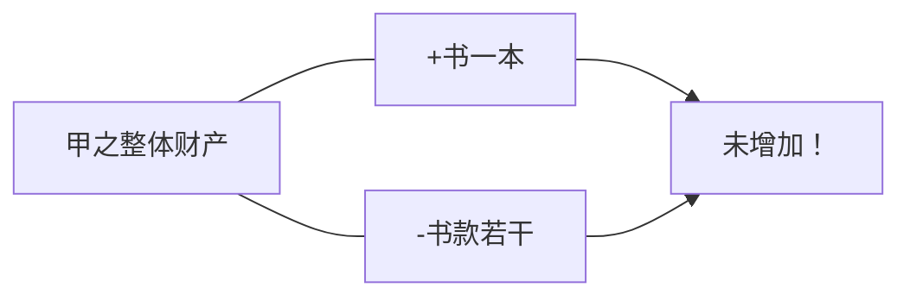
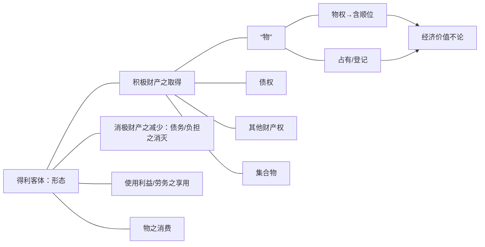
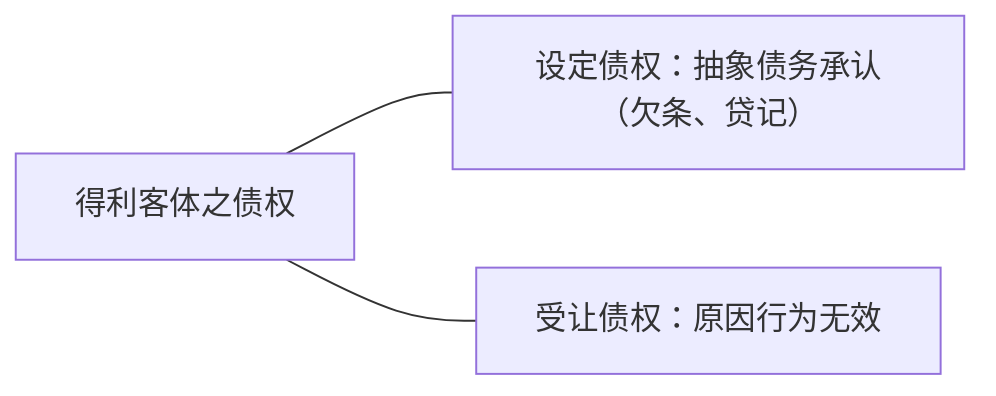
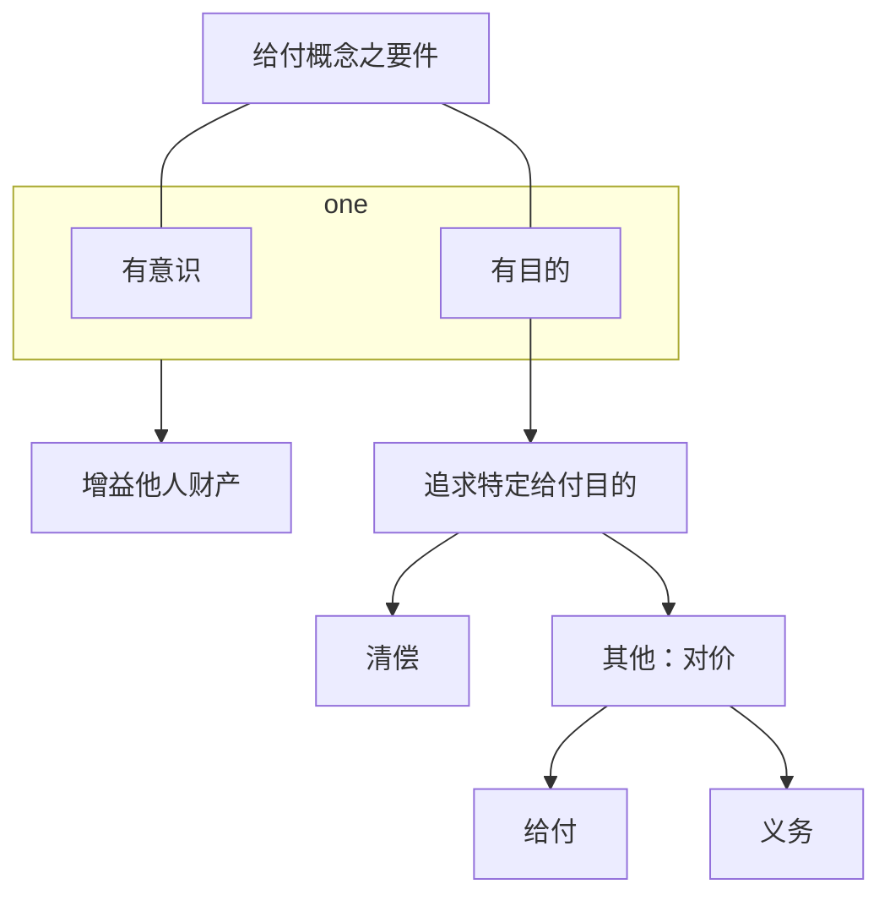
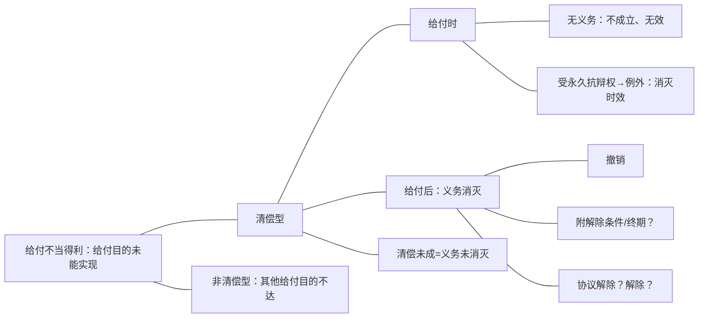
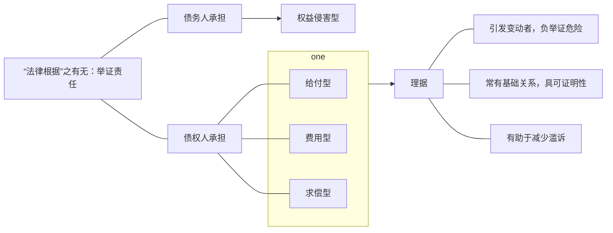

- 不当得利
	- 一般规定
		- 要件
			- 积极要件（[[第一编 总则#^4lo0ae|122]]、[[第三编 合同#^el18x2|985]]但书前）
			- 消极要件（[[第三编 合同#^el18x2|985]]但书）
		- 效果
			- 返还客体（[[第三编 合同#^el18x2|985]]、[[第一编 总则#^2i4wlr|157]]）
			- 返还范围（[[第三编 合同#^auj897|986]]、[[第三编 合同#^gyjhyj|987]]）
	- 特别规定
		- 对无偿受让人之直索（[[第三编 合同#^nkorll|988]]）
		- 法律行为无效、被撤销或确定不生效力之返还（[[第一编 总则#^2i4wlr|157]]）
		- 添附（[[第二编 物权#^4wqoiw|322]]）
		- 赠与之撤销（[[第三编 合同#^bd82ag|665]]）
		- 其他？

# （一）基础（不当得利请求权之一般规定：要件、法效果）
## 1．法条
不当得利，从整个民法典来讲，主要就只有4个条文，但是它内容非常广泛，因为它涉及到整个不当得利的基本体系问题，内容非常多。

不当得利可以分成两个部分，一个是不当得利的一般规定，另外一个是不当得利的特别规定。不当得利的一般规定，原则上讲就是民法典中[[第三编 合同#^el18x2|985]]、[[第三编 合同#^auj897|986]]、[[第三编 合同#^gyjhyj|987]]，[[第三编 合同#^nkorll|988]]我们也说它是一个比较特殊的规定。其他的还有很多特别的规定，比方说，法律行为终局的不产生效力之后的返还，规定在[[第一编 总则#^2i4wlr|民法典的157条]]，这个很明确，它就是个不当得利的规定，只是没有写在这里而已。是法律行为终局的不生效力之后返还的一个特殊的规定。那么[[第二编 物权#^4wqoiw|322]]添附的不当得利，实际上它也是不当得利的一种类型。[[第三编 合同#^bd82ag|665]]赠与被撤销之后的返还，这些其实都属于特别规定。

我想问一下[[第二编 物权#^4wqoiw|《民法典》322条]]的规定的添附不当得利是属于费用型不当得利？还是属于权益侵害型不当得利？还是作为单独的类型来看呢？
潘：同时囊括费用支出型和权益侵害型。决定因素是添附之后的物权归属。Brox，物权归属，添附部分

例1：甲将丙之建筑材料用于建筑自己的房屋，丙如何主张权利？
——甲因添附而取得“建筑材料”之所有权，属于那种类型不当得利？——【猜测是】费用型（猜错了吧，费用型是把自己的东西添附到别人的东西上，这是权益侵害型）。
例2：甲误将丙的建筑材料用于建筑自己的房屋，丙如何主张权利？
例3：乙将丙委托其保管的建筑材料出卖给善意的甲，丙如何主张权利？甲恶意呢？
例4：乙偷丙的建筑材料出卖给善意的甲，丙如何主张权利？甲恶意呢？
——例3、例4，若甲系恶意，甲并不会在乙交付之时取得材料之所有权，此时跟例1之情形相同。但，如何处理甲乙内部关系？——初步想法：甲乙系恶意串通，合同无效，非债清偿排除不当得利。

主要阅读材料：
Wieling：60～69（追认问题）；101～109（辅助性规则的适用及其例外）；金可可不当得利评注；
王泽鉴案例。
微信聊天记录，特别是孙维飞老师的观点。

![[第三编 合同#^u92g2q]]

![[第七编 侵权责任#^0azehq]]

其中呢，不适法管理和不法管理，受益人要在获得的利益范围内向管理人承担费用偿还请求权啊，损害补偿请求权啊，但这个获得的利益的返还，是一个费用或损害的补偿请求权，它和不当得利没有关系。

再看[[第七编 侵权责任#^0azehq|民法典1182]]，侵害他人权益造成财产损失的，按照被侵权人因此受到的损失或者侵权人因此获得的利益来赔偿，这样一来，涉及了侵权人因此获得的利益，但这个因此获得的利益的计算方法和不当得利也没关系，它是损害赔偿请求权。

接下去回到民法典中[[第三编 合同#^el18x2|985]]以下不当得利请求权的一般规定，它的要件和法效果分别是什么样子的，来作一个来简要的梳理。
## 2．构成要件
![[第一编 总则#^4lo0ae]]

![[第三编 合同#^el18x2]]
### （1）概述
- 规范目的：依通说，不当得利法之规范目的，乃在去除“受益人”无法律上原因所受的利益。其具有两个基本功能：
	- 一是“矫正缺乏法律关系的财货移转”， ^2pngcm
	- 二是“保护财货的归属”。 ^7w1dkz
- [[课堂笔记/民法笔记/金可可民法/不当得利/概述#^2pngcm|前者]]如买卖合同无效时，买受人请求出卖人返还已付价金。
- [[课堂笔记/民法笔记/金可可民法/不当得利/概述#^7w1dkz|后者]]如乙擅自出卖其保管的甲之玉石，丙善意取得，甲向乙主张玉石的价额偿还。
- 至于[[第三编 合同#^el18x2|本条]]但书第1项、第3项，系指不当得利请求权的积极构成要件虽得满足，但请求得利返还可能违反诚实信用原则（[[第三编 合同#^el18x2|本条]]但书第3项），或违背一般道德理念（[[第三编 合同#^el18x2|本条]]但书第1项）。至于[[第三编 合同#^el18x2|本条]]但书第2项，系为避免给付之徒劳往复，特别提示即使期前清偿，债权人受领利益（含提前受偿之期限利益）仍视为有法律上之原因。在法律规范体系上，本条系不当得利制度的一般规定，与合同（如本法[[第一编 总则#^2i4wlr|第157条]]以及[[第三编 合同#^69qd4g|第566条]]“）、无因管理（如本法[[第三编 合同#^cguwou|第979条]]、[[第三编 合同#^u92g2q|第980条]]）、物权（如本法[[第二编 物权#^axo3xh|第235条]]、[[第二编 物权#^5yogki|第459条]]、[[第二编 物权#^txitne|第460条]]、[[第二编 物权#^m0eqwm|第461条]]）、侵权责任（如本法[[第七编 侵权责任#^0jplgg|第1165条]]）等各个领域均有密切联系。在对本条进行解释适用时，需要特别注意本条的解释适用与各相关规定的协调。
	- 首先看[[第一编 总则#^4lo0ae|§122]]和[[第三编 合同#^el18x2|§985]]，都说有了[[第三编 合同#^el18x2|§985]]，[[第一编 总则#^4lo0ae|§122]]还有什么意义呢？金老师个人的答案是毫无意义。因为[[第一编 总则#^4lo0ae|§122]]之所以没有删除，乃是因为最后在编纂进民法典的时候，做了一个不修改的决定。如果不作这个决定，[[第一编 总则#^4lo0ae|§122]]会完全和[[第三编 合同#^el18x2|§985]]重复的，应该删除的，所以是一个偶然决定造成的，所以[[第一编 总则#^4lo0ae|§122]]只有说明意义，“法律上会保护这样的不当得利请求权”，但是它的构成要件等等，都是在[[第三编 合同#^el18x2|§985]]。所以呢，金老师个人意见是，有了[[第三编 合同#^el18x2|§985]]，不需要再援引[[第一编 总则#^4lo0ae|§122]]。
	- 再往下看，[[第三编 合同#^el18x2|§985]]分成两个部分：第一个部分，看，“得利人没有法律根据取得不当利益”，这是一个构成要件，积极构成要件。法效果是什么？—受损失的人可以请求返还取得的利益，这是一个法效果。“但是有下列情形之一的除外”，下面三个都是消极要件：虽然具备了前面那个积极要件，如果有下面三种情形的，前面所说的法效果也不会产生，所以这是[[第三编 合同#^el18x2|§985]]的一个基本的构成逻辑。

再往下看，这个不当得利请求权的要件，从[[第三编 合同#^el18x2|§985]]来看，应该包括什么？

**不当得利之要件：各类型中之含义**

||一方受有利益|源于他方之不利|无法律依据|
|:---:|:---:|:---:|:---:|
|给付型|得利|因他方给付|给付目的未能实现|
|（非给付型）权益侵害型|得利|本属他方权益范围|权益变动欠缺正当事由|
|（非给付型）求偿型|得利|因他方之代为清偿|无清偿义务|
|（非给付型）费用型|得利|因他方为其物支出费用|无费用支出义务|

- 不当得利之要件
	- 取得利益
	- 没有法律依据
		- 统一说：公平/正义/债权/权利
		- 非统一说
			- 给付型：给付目的未能实现
			- 非给付型
				- 侵害权益型：权益变动欠缺正当事由
				- 求偿型：无为他人清偿之义务
				- 费用型：无为他人之物支出费用之义务
	- 以他人之利益为代价
		- 给付型：给付人
		- 非给付型
			- 侵害权益型：权益之原本归属者
			- 求偿型：为他人清偿之人
			- 费用型：为他人支付费用之人

- 我们会说，按照这个[[第三编 合同#^el18x2|§985]]，我们可以提取出来的不当得利请求权的积极要件是什么？—积极要件是三个：
	1. 一方受有利益，他的财产有增加；
	2. 必须是这个不利，来自于他人的某一个行为；是以他方所受到的不利，来让他自己受到一个利益；
	3. 一方所受的利益没有法律根据。

- 我们看一下[[第三编 合同#^el18x2|法条]]，这三个要件是怎么提取出来的：
	- 一方取得了、受有利益这个要件；
	- 第二个，有个受损失的人，也就是说，这意味着什么？某个人所取得的的利益，实际上是源于他方的代价；
	- 第三个，特别强调没有法律根据，不当的利益。所以这是没有法律根据这个要件怎了来的。

那么这三个要件，我们会说，在这三个要件里面，我们特别要强调的就是各种不同的不当得利类型中，这些要件怎么去理解它，在等会儿讲下去的过程中会详细讲的，这里先大概说一下。
### （2）要件一：一方受有利益
#### A.以整体财产为断（？）：非以整体财产未断——具体得利客体
第一个要件，必须是一方受有利益。这个怎么来判定，是不是受有利益不能以整体财产来看，而是要求某一个具体的形态来看，一定要分析出具体的得利客体。举一个例子来说明：甲从业马逊订购《中华人民共和国民法典》一本，并支付购书款若干。次日，亚马逊将书送交于甲。其后发现买卖合无效。亚马逊要求甲返还该书。
看一下，任何判定甲是不是受有得利，按甲的整体财产来看，这就会产生一个问题：甲的财产中现在是多了书一本，少了书款若干。如果我们认为这本书的价值和他付出的价金书款是一样的，这个时候就甲的整体财产来看，就不能说甲受有得利。这个结果是不当得利法不能够接受的，按照我们得利法的判定是什么？——我们不看甲整体的财产有没有变，看甲的财产中有没有多出不应该多出的具体东西。这里面的具体东西是什么？——具体东西是这本书。如果合同有效，他会买到这本书，但合同无效的话，就不应该有这本书，客体好像是这本书，这个是具体的，一定是具体的。但是，得利客体，说是这本书，又不精确。虽然把它看成个体了，但是“个体”的描述，必须要准确。我们说这个时候甲的得利客体是什么？—是书的占有还是书的所有权啊？还是两者都有？——我们说，这个取决于承不承认处分行为无因性，如果认为是有因的，它就没有所有权，在书的占有。如果是行为的无因性，会说这个时候得利客体是书的所有权和占有。

那么也就是说，得利的客体，要落实到各种利益上面去，所以我们再看，按照这个视角，精确描述具体得利客体的视角，我们可以将得利分为三个类型：

首先我们说得利的客体，可以是取得某一个具体的积极财产。积极财产意味着什么？一一一个有财产价值的东西，这个时候本来不应该取得，进入了某一个人的财产。那么这些积极财产包括什么呢？——我们说，
#### B.积极财产的增加 
##### （A）“物”
###### a.包括物（权）、登记顺位
物前面讲过了，我们真正在适用不当得利法的时候，千万不能说得利客体是物，这么一讲就极不专业了，不可以这样讲，必须要指出，是物权还是占有，还是物的登记，一定要讲清楚。所以，举个例子来说（得利客体是物权的）：前面讲过了，这本书的买卖，如果认为是物权行为是有无因性的，买卖合同无效，得利客体就是物权，所有权，以及占有。那么如果买卖合同无效，没有无因性，那么这个时候它的得利客体就是物的占有。

- 接下去拿不动产为例：买了一个房子，合同无效。
	- 现在问，得利客体是什么？——肯定没有人再说是房子了，要么是房子所有权，要么就是一个登记法律地位而已。
	- 如果认为买卖合同无效，所有权从来就没有移转过，那么唯一进入买受人财产的内容是什么？——就是一个登记。这个登记是一个有财产利益的法律地位，本身属于不当得利的客体。
	- 所以呢，在这种情形下，我们看到，买卖合同无效，买受人的财产中多了一个登记，此时要求乙把这个登记去掉，有哪些请求权？——更正登记请求权，所有权是甲的。第二个请求权是什么？——用返还，是更正请求权到不当得利的返还请求权，它最后的操作方式，都是要求乙把这个登记涂销，内容是一致的。
###### b.登记、占有
再看，物权里面的不当得利的内容，也可以是物权里面的其他物权，包括建设用地使用权什么都有可能的，就是负担行为无效的情形等等。那么担保物权也有可能（比方说也是担保合同无效了）。那么我们值得指出的是在物权的情形，它有可能得利的客体是物权的顺位，比方说甲有一个房子，它要为乙登记第一顺位的抵押权，为丙登记的第二顺位的抵押权。登记的时候登记反了，按照甲和丙之间的合同，来只需要给它登记一个第二顺位的抵押权，而给它登记的却是第一顺位，此时得利的内容是什么？——就是一个按照不当得利返还可以要求更正顺位。
###### c.不考虑经济价值
与物的经济价值是没关系的，不考虑。eg：比方说情书等等。
都是属于得利客体之一，这个都没关系。
##### （B）什么情形下会有债权呢？
- 刚刚讲了得利的客体必须要去看具体的形态，不能以整体财产来看，必须是按照一个具体的得利客体来看。而这个具体的得利客体呢，我们会说，一定要把它具体的形态描述清楚，那就是我们分了这么多类型。所以根据这些类型，以后在实务过程中，可以按照这些类型来判定它具体的得利客体是什么，一定要讲到一个最精确的类型上面去。
	- 第一个，得利客体可能是物，但是物本身，它不是一个法律术语不是得利客体意义上的法律术语。作为一个得利客体，必须要明确，是物上的权利还是物上的占有还是登记，一定要落实到这个最细的地方。所以刚刚讲到的买了一本书，有可能得利客体是书的所有权，也有可能得利客体是书的所有权加上占有。有的时候，得利客体是纯粹的占有，比方说某人无权占有A这本书，他的得利客体就是这个占有，很典型就是占有而已。
	- 那么在不动产上面，我们会讲得利客体有可能是不动产上面的物权，也有可能是不动产上面的登记，这个刚才也提到过了。就是买卖一个房子，过户登记办完了，后来发现买卖合同无效。我们会说，如果不承认物权行为及其无因性的话，我们会讲，买受人财产中唯一增加的是什么？——就是上面多了一个不应该有的登记。所以，对于这个登记而言呢，对于出卖人而言，要想把这个登记给去掉，有两个请求权基础。
		1. 更正登记请求权，因为买卖合同无效，这个所有权登记在乙的名下也登记错了，真正的所有权在甲那里呢。乙这里只有这个登记了，登记时错误的，可以要求错误更正。
		2. 第二个请求权是不当得利，因为财产中多了一个不该有的登记，要求还给本人。
	- 无论是更正登记请求权还是按照不当得利请求他返还登记法律地位，请求权的内容实际上是一样的，都是要求这个买受人同意涂销这个登记。这就是以登记作为不当得利客体的情形，是这样一个情形。
	- 那么在得利客体是物权的时候，我们会讲，得利客体不仅是有可能是物权，还有可能是物权的顺位。最为典型的例子如上（甲以自己的财产为乙丙两个人设定抵押，约定好第一顺位是乙，第二顺位是丙。现在呢，去登记的时候，误把丙登记为第一顺位，把乙登记为第二顺位。那这个时候就讲，这个时候对丙来说，本来他应该只得到第二顺位的登记，现在变成第一顺位的登记了，属于不当得利，可以要求返还，返还的结果就是同意变更为第二顺位的登记）。
	- 第三个，就是得利客体如果是物的，无论是物权还是物上的占有或登记，这个物本身也没有经济价值，这是在所不论的。哪怕经济价值不明显或没有经济价值的物，本身也可以成立得利客体。我们通常教科书里讲的，比方说情书（甲写给乙的情书被丙没有法律上的原因占有，那么乙可不可以要求丙返还？当然可以返还，理由是什么？也是不当得利，为什么？—虽然没有价值，它仍然是个物，这个物上的权利和占有，仍然可以成为不当得利的客体。）

###### a.债权转让
我们好多情形都会出现这样的不当得利。不当得利的客体还可以是债权。在债权转让的过程中，有可能债权是不当得利。

eg：甲对乙有一个债权，甲把对乙的债权卖给了丙，做了个债权买卖合同。根据债权买卖合同，甲就有义务把对乙的债权让与给丙。现在买卖合同签好了之后，甲为了履行这个义务，于是和丙做了个债权让与合同（这是个处分行为，前面买卖是负担行为），做了一个处分行为之后，债权就过去了，债权过去之后发现，甲和丙之间的债权买卖合同。
这个时候就要注意了，我们说，它得利客体就是个债权。在这里呢，得利客体是个债权（第一种情形出现了，债权转让过程中负担行为发生问题）。
###### b.抽象债务承认
第二种情形中得利客体是债权，指的是设定债权，结果呢，没有基础关系。最为典型的是什么？——

- eg：甲和乙有长期的业务往来，现在双方要进行结算，结算下来乙还欠甲100w，乙就写了个欠条，成“是的，我欠你100w”，根据前面的算法，他误以为欠100w就写了。写了之后，事后发现算错了，乙根本不欠甲钱，一分都不欠。那么这个100w本身能不能产生效力呢？
	- 我们说，100w叫抽象的债务承认，它这100w的欠条上面的意思表示就是，“现在开始，我承认我对你负有100w的债务”。如果是把这样一个欠条理解为真正发生债务的意思的话，那它叫抽象债务承认。这种情形呢，我们就说，这个设定债权了，那么实际上后面这个基础关系不存在，那么乙所取得的这张欠条上所记载的债权就失去了法律上的依据了，这个时候可以要求不当得利返还。
	- 在我们国家，这种单纯的发生债务的抽象债务承认，在刚刚那个例子里面可能会有点争议，但其它的例子里面就不一定会有争议（两个主体不一样就不会有争议）。刚刚那个争议在哪里呢？——刚刚的争议说，你单纯的是确认以前的债务，没有想要发生新债务的意思，所以它不叫抽象债务承认，这是通常又的一种争议。

- 现在把例子换一下就没问题了：eg：甲和乙长期业务往来，丙知道乙换不出钱，于是他在乙和甲算完钱之后，100w，丙向甲写了个欠条，“现在开始我欠你100w”，这么一个明显是发生新债务的意思了，当作免责的债务承担也好，当作并存的债务承担也好，都是新债务了吧。最后发现，甲和乙之间一算下来，算错了，实际应该不欠钱。
	- 那么这个甲和丙之间所做的发生债务关系的负担行为，产生了新的债权（它本身不因为算错而无效，它还是有效的，这个时候可以构成不当得利要求他返还这个债权。
	- 问题是这个债权怎么返还呢，这个债权的返还我们讲，退出或免除，这个时候丙对甲有个免除请求权，这种方法，不当得利请求权里通过免除的方法来履行）。
###### c.贷记
- 另一种情形的得利客体是贷记。银行贷记记错了：eg：A在银行有个账户，本来里面只有10块钱，银行不知道为什么，某人往别人汇款错汇到A的账户里面了。银行在A的账户里面就打上了10w这么一个贷记。这么一个贷记是抽象的债务承认，一旦记在上面，债权债务就发生了。打错了，只能请求返还，而不能直接说那个东西是无效了，这不行。
	- 这个时候贷记本身记载了一个债权可以要求不当得利来返还。
	- 可能就有疑问了，在受让债权的时候，债权买卖合同无效，那个债权怎么还呢？不当得利的时候？——这个时候就要一个反向的债权让与，再让与回来就行了。
	- 得利客体是债权也是有可能的。
##### （C）其他财产权利
在我们看，得利客体也有可能是其他的财产权，那就很常见了。商标也有可能了，专利权（知识产权）、股权，都有可能。
##### （D）集合物
###### a.事实上的集合物
那么积极财产里面得利客体还可能是集合物，有事实上的集合物、法律上的集合物，都有可能。[^1]事实上的集合物，

[^1]:事实上的集合物的本质仍然是单个物的总和，其和自然集合体（natuerlichen Mehrheit）（例如扑克牌、稻谷）跟数个物的紧密联系（mehrere Sachen fest zusammengefuegt）（例如汽车）相区分，区分标准是 依照一般的交易观念，以经济视角出发进行区分；法律上的集合物有两类，公司（Unternehmen）和财产(Vermoegen)。vgl.Brox: BGB AT.S.348ff.

eg：有很多很多书，打包卖给别人，这个得利客体是什么（当事人买卖合同无效）？
得利客体我们可以简称为集合物，那么多的书（一个图书馆里的书），这只是一个简称而已，真正分析起来，得利客体是里面一本一本书的所有权和占有，但是也可以有集合物来指称。
###### b.法律上的集合物
还有法律上的集合物，叫企业买卖的情形，买卖的就是企业的财产整体啊，这个时候也叫集合物。
#### C.也可以是消极财产的减少。
消极财产的减少指的是什么呢？
##### （A）债务消灭
eg：比方说甲欠乙一笔钱，现在某丙替甲把钱还了。丙为什么想替他把钱还了？——丙以为，自己对甲负有这个义务，所以才替甲还钱。
一还，第三人清偿，丙一拿，甲的债务就消灭了。后来发现，丙根本对甲没有这个义务，丙以为产生义务的合同是无效的，这个时候我们讲，这个甲有什么得利呢？——它的得利是本来欠乙一笔钱，财产中有一个负资产，因为丙的清偿让它债务消灭了，得利客体就债务的消灭。
##### （B）负担消灭
也有可能是负担的消灭，这个负担指的是什么？——物上的负担（就是担保物权、用益物权这种情形）。以担保物权为例，甲把自己的房子为乙设定了一个抵押权，后来乙错误的把这个抵押权给涂销了，涂销错了。这个时候我们说，甲的得利是什么？甲的得利就是一个负担的消灭，担保物权的消灭。这个都是完全有可能的。

>Wieling:[^2]
所取得的东西可以体现为某种拘束的解脱，如在权利保有人无法律上原因地丧失了某项物权或债权的情形下。
例子：S有义务为自己对G承担的债务设定担保物权，故将自己的金表质押给G。后来G误以为S已清偿了债务，于是将表还给了他。
质权依第1253条第1款和第1255条的规定而消灭，S无法律上原因地从G的质权中解脱出来。G可以将质权的抛弃作为不当得利请求返还，亦即要求重新设立质权。
例子：S对G欠了1000欧元，暂时无力支付。他的朋友F向G还了这笔债，打算以后朝S把钱要回来。S获得得了债务解脱。

[^2]:《德国不当得利》，第9页。

#### D.使用利益／劳务之享用
##### （A）使用利益
- 第三类得利的客体，我们讲，叫适用利益或者叫劳务的享用。什么意思呢？——我们来举个例子：eg：A租了一套房子，租的这套房子啊，租了三个月。三个月之后发现这个租赁合同自始无效，问，A的得利是什么？
	- 得利就是对这套房子的居住的使用，就是这个使用利益而已。那么，对方的得利是什么（出租人）？——A给B的租金，双方都要相互返还。
	- 租金怎么还？——还给A就行了，付一笔钱给A。
	- 使用利益怎么还？——后面会讲到的，它无法按原样返还的，只能做价额偿还，折价补偿。
	- 怎么折价补偿啊？这个时候A对这套房子的使用，值多少钱，市场上值多少钱还多少。通常有个推定，推定是什么？——一个有效租赁合同中这个租金可以用来计算这个适用利益的市场上的价值。当然，前提是我们这个租赁合同的无效事由不是因为行为能力和意思瑕疵导致的，使用利益是个单独的得利客体。
##### （B）劳务享用
还包括劳务的享用，最简单了。某甲到某个地方去理发，理完发发现理发合同无效，问，甲的得利客体是什么？一一不就享受了一个理发的服务吗？这个很常见的，各种劳务合同，一旦无效，得利客体就劳务的享用，都是一样的。
##### （C）费用的节省？
现在来看一看，这里一定要注意一点，传统的书上，在适用利益的情形，在得利客体是适用利益或劳务享用的情形，通常把这个得利描述为什么？——费用的节省。这种考察方法完全是错误的，这种思维方法是错误的。因为，只有在找不到这种得利客体的时候，我们才会用费用的节省来描述什么有没有现存利益，这个待会儿会讲到的。总之，希望在这里注意一下，传统上叫什么？——叫“费用的节省”，我们现在不用这个概念了。
#### E.物的消费
- 还有一个得利客体叫物的消费。物的消费指的是什么？eg：某甲买了一个苹果，让人送，结果送到邻居乙家去了。乙看到这个苹果，以为是自己妈妈买的，很高兴的拿了一个苹果吃了。我们看一下，这个被吃掉的苹果，它的得利客体是什么？
	- 很显然，他拿的这个苹果，肯下第一口之前，这个苹果所有权不是乙的，得利客体不是所有权。
	- 第一口啃下去，也没有把这个所有权啃成自己的，只是说这个苹果是属于甲的苹果上少了一口，第二口啃下去，同样的所有权剩下那个部分还是甲的，只是变成一个被咬了一口的苹果，属于甲了。
	- 但是，咬进去的两口，在咬进去的同时所有权就消灭了，等到乙把这个整个苹果都吃完，整个苹果所有权都消灭了，但是整个过程中，得利客体是不是苹果所有权？——没有，整个过程中，乙从来没有取得过这个苹果所有权，所以这个得利客体，单纯的就是物的消费，还有其他的零星的得利客体，待会儿还会讲到。

>Brox: [^3]
3.Verbrauchbare und nicht verbrauchbare Sachen
a) Verbrauchbare Sachen sind bewegliche Sachen, deren bestimmungsmäβiger Gebrauch in dem Verbrauch oder in der VeräuBerung besteht(§92 1). 
Beispiele:Nahrungs-und Genussmittel,Brennstoffe,Geld.
Bewegliche Sachen aller Art werden dadurch zu verbrauchbaren Sachen, dass sie zu einem Sachinbegriff (§ 35 Rn. 8) zusammengefasst oder in einen solchen eingefügt werden, dessen bestimmungsmäßiger Gebrauch in der Veräußerung der einzelnen Sa-chen besteht (vgl. § 92 I1).
Beispiele:
Bücher
einer
Buchhandlung,
Konfektionswaren
eines Bekleidungsgeschäfts, Möbel eines Einrichtungshauses sowie Warenlager aller Art.
b) Nicht verbrauchbare Sachen sind alle übrigen Sachen. Der allmähliche Verschleiß durch Abnutzung ist kein Verbrauch.
Beispiele: Bücher,Bekleidungsstücke, Einrichtungsgegenstände.
c) Diese Unterscheidung ist für Gebrauchsüberlassungsverträge und Nutzungsrechte bedeutsam.
Beispiel:A »leiht« ihrer Nachbarin N zehn Eier. N soll nicht wie bei der Leihe nur zum unentgeltlichen »Gebrauch« der Eier berechtigt (§ 598) und verpflichtet sein, diese Eier nach dem Ende der Vertragsdauer wieder zurückzugeben (§ 604 D). Vielmehr soll N befugt sein, diese Eier in ihrem Haushalt zu verbrauchen;sie ist nur verpflichtet, andere Eier gleicher Art und Güte zurückzuerstatten (§ 607 1: Sachdarlehen).
Da verbrauchbare Sachen nur durch ihren Verbrauch genutzt werden können, wird der Nieβ-braucher verbrauchbarer Sachen deren Eigentümer; nach Beendigung des NieBbrauchs hat der Nießbraucher dem Besteller den Wert der Sachen zu ersetzen (§1067).

[^3]:Brox,S.355

##### （三）消费物与非消费物
###### 1．消费物是指其合于用法的使用在于消费或让与的动产（第92条第1款）。例如：食物和享乐品、燃料、钱。
通过以下方式所有种类的动产均将成为消费品：使它们结合为集合物或者装入其中，该集合物合于用法的使用在于逐个地让与物（参见第92条第2款）。
例如：书店中的书、服装公司批量生产的商品、房子以及客栈中的各种家具。
###### 2．非消费物是所有其他物。消费并非指使用造成的逐渐损耗。
例如：书、衣服、家具。
###### 3．这种区分对于使用让与合同以及用益权非常重要。
例如：A女士“借给”女邻居N十个鸡蛋。N不应像在使用借贷（Leihe）的情况下那样只享有无偿“使用”这些鸡蛋的权利（第598条）并负有在合同届满后返还这些鸡蛋的义务（第604条第1款）。更确切地说，N应当享有在家中消费这些鸡蛋的权利，她只负有以种类和品质相同的其他鸡蛋进行偿还的义务（第607条第1款，物的消费借贷合同）。
因为消费物只能通过消费被使用，所以消费物的用益权人是其所有权人，用益终止后用益权人须向设定人赔偿物的价值（第1067条）。

陈卫佐：[^4]
§598 Vertragstypische Pflichten bei der Leihe
Durch den Leihvertrag wird der Verleiher einer Sache verpflichtet,dem Entleiher den Gebrauch der Sache unentgeltlich zu gestatten.
第598条 在使用借贷的情形下的典型合同义务
因使用借贷合同，物的贷与人有义务无偿地许可借用人使用该物。
「使用借贷合同是无偿合同。无偿性是使用借贷区别于使用租赁（德国民法典第535 条至第580a条）的根本特征。此外，虽然使用借贷和赠与（德国民法典第516条至第534条）都是无偿合同，但使用借贷的贷与人只是将对物的使用和对物的直接占有暂时地 交给借用人，而赠与人则是将财产所有权永久地转让给受赠人。Vgl．Medicus／Lorenz，Schuldrecht Il，Besonderer Teil，16．Autl．2012，S． 209-210。」

[^4]:《德国民法典》第269页（8598）脚注。

陈卫佐：[^5]
§607 Vertragstypische Pflichten beim Sachdarlehensvertrag
(1)Durch den Sachdarlehensvertrag wird der Darlehensgeber verpflichtet,dem Darlehensnehmer eine vereinbarte vertretbare Sache zu uberlassen.Der Darlehensnehmer ist zur Zahlung eines Darlehensentgelts und bei Falligkeit zur Ruckerstattung von Sachen gleicher Art,Gute und Menge verpflichtet.
(2) Die Vorschriften dieses Titels finden keine Anwendung auf die Uberlassung von Geld.
第607条 在物的消费借贷合同的情形下的典型合同义务
（1）因物的消费借贷合同，贷与人有义务将所约定的可替代物交给借用人。借用人有义务支付消费借贷的报酬，并在清偿期到来时以种类、品质和数量相同的物予以偿还。
（2）本节的规定不适用于金钱的交给。
「物的消费借贷的例子：从邻居那里借10个鸡蛋，消费后以同种、同质、同量的鸡蛋予以偿还，并支付报酬。物的消费借贷合同（德国民法典第607条至第610条）区别于使用借贷合同（德国民法典第598条至第606条）的地方：在物的消费借贷的清形下，借用人成为贷与人所交给之物（如上述例子中的10个鸡蛋）的所有人，借用人只须以同种、同质、同量的可替代物予以偿还；在使用借贷的情形下，物的贷与人仍然是物（如无偿地出借的书）的所有人。此外，物的消费借贷是有偿合同（德国民法典第609条），而使用借贷是无偿合同（德国民法典第598条）。
Vgl. Der Brockhaus Recht,2002, S.171;Medicus/ Lorenz,Schuldrecht II,Besonderer Teil,16.Aufl.2012,S.220。」

[^5]:不宜把“消费借贷”（Darlehen）译成“借贷”，因为除消费借贷外，使用借贷（德 国民法典第598条至第606条）也属千借贷。此外，除第607条至第610条所规定的“物的消费借贷“（Sachdarlehen）外，德国民法典旧文本还在第488条至第498条规定了“金钱消费借贷“（Gelddarlehen）。然而，在《债法现代化法》自2002年1月1日起施行以后，德国民法典现行文本第488条至第505e条将Darlehen等同于 Gelddarlehen，也就是说，消费借贷如果不加修饰语，就是指金钱消费借贷（贷款）。这在逻辑上并不是无懈可击的。译注者认为，“消费借贷”应当是一个上位概念（属概念），它的下位概念（种概念）是“金钱消费借贷和“物的消费借贷＇，不应把＇金钱消费借贷跟“消费借贷”等最齐观。尽管如此，为了方便读者理解，本书仍然将 Darlehensvertrag 译成“贷款合同”。参见译注者为德国民法典第488条第1款加的注解。参见《德国民法典》第271页（§607）脚注。
#### F.延伸：无权处分与费用之节省
所以，在这里希望掌握的一点是什么？——得利客体，一定是金老师这个表格中一个一个具体的类型。

- 得利客体之疑难问题
	- 无权处分
		- 对价？
		- 债务之消灭？
		- 处分权？
	- 费用之节省？

在无权处分里面，得利客体是什么，他会又一些疑难的问题，待会儿再讲，这里不多说。
#### G．江平（鄢；600页）
受益人受有财产上的利益，即“得利”，表现为两方面：积极的得利和消极的得利。积极的得利，受益人现在的财产或利益都在积极地增加，消极的得利：财产或利益本应减少 而未减少。既有得利又有损失，但其损益抵消后剩余有利益的，仍为受有利益。

任何具有财产价值的权利均可成为不当得利的客体。例如，所有权、他物权、知识产权的取得，当然为受有利益。债权的取得，性质上也为受有利益。但如果受益人取得的债 权是须为对待给付的债权（双务合同），因取得人须以减少自己的财产作为对价，不构成受有利益。
本应设定的权利负担未设定。依据我国《担保法》的规定，在财产上设定抵押，除应当办理登记之外，其他财产的抵押是否办理登记，采自愿原则。如当事人约定办理登记而 禾办理，财产的所有人即为受有利益。通常，劳务的提供或者为履行债务，或者为无因管理，或者为纯粹的助人行为。如果劳务提供的基础法律关系不存在（如误耕他人之田）、无效或被撤销，劳务的提供人不得请求报酬。劳务的消费人因他人劳务的提供节省了自己的支出，因而构成受有利益。元合法权源或者合法权源消灭后而使用他人之物的，因其使用 具有财产上的价值，且可以减少自己的费用，故可以构成受有利益。例如，租赁关系消灭后，承租人仍使用他人房屋。
### （3）要件二：没有法律上原因
第二个要件必须是没有法律上根据，或者叫没有法律上原因。传统的术语叫没有法律上原因，我们的法条呢，叫没有法律根据。没有法律根据，怎么来解释什么叫没有法律上根据呢？——以前有统一说和非统一说。
#### A.统一说
- 统一说及其缺陷
	- 公平说：受利益而违反公平正义原则→空泛
	- 正法说：受利益违反维护正当生活之法律基本理念→空泛
	- 债权说：受利益无其所依据之债权者→解释力不足：善意取得
	- 权利说：受利益而无保持该利益之权利→解释力不足：添附

统一说什么意思呢？不用区分不当得利的类型，所有的不当得利，都用同一个理论来说，什么叫没有法律上原因。有四种学说：公平说、正法说、债权说、权利说。

公平说：你拿到利益不公平，那就是没有法律上原因了。这个就不知道在说什么了。因为，相当于用公平来替代了一个法律上原因的概念，而无论是法律上原因还是公平，都是一个需要具体化的、模糊的概念，这个就没有意义了。我们需要的是，你就没有法律上原因，找出一个具体的判定辨准，这种公平说不能给我们。

正法说：同样的，它说维护正当生活的法律基本理念，这个说了跟没说是一样的。

- 债权说：说，你如果受了一个利益，受这个利益没有一个债权来支撑你的话，那就是无法律上原因了。这个很具体了，但可惜的是解释力不足，看下面这种情形：eg：【债权说之缺陷】乙擅自出卖其替甲保管的笔记本电脑于善的丙，丙善意取得。其无须不当得利返还，法律上原因：善意取得。
	- 现在问，丙善意取得之后，他需不需要把自己善意取得的这个笔记本电脑所有权再不当得利返还给甲？我们说不需要了，那么到底是什么东西在阻却甲对丙有这个请求权呢？
	- 我们说善意取得本身，为了维护善意取得的制度目的，必须要认为他本身包含了法律上的原因，进而可以阻却甲对丙主张不当得利。那么，在这种例子里面，法律上的原因完全不是债权，是善意取得，所以，债权说不周延。

- 我们再看，进而提出了权利说，权利说说，你受有一个利益，但你又没有保持这个利益的权利，那就是无法律上原因。它又碰到一个解释力不足的现象：看案例eg：【权利说之缺陷】乙将甲委托其保管的木材用于装修自己的房屋，木材附合于自己的不动产：有权保有“木材”，仍负不当得利返还义务。
	- 我们说乙也没有权利把附在上面的木材继续保有呢？——当然继续保有，成为重要成分了。
	- 但是他虽然有权保有这个木材，却仍然要就木材的价值对甲附不当得利的返还义务，所以，有权保有木材，他不影响不当得利发生了。所以，光有保有的权利，不能阻却不当得利。
#### B.非统一说
- 非统一说
	- 给付型：给付目的未能实现
		- 清偿型：自始/嗣后无给付义务
		- 非清偿型：其他给付目的不达
	- 非给付型
		- 侵害权益型：无权益变动之约定/法定事由
		- 求偿型：无为他人清偿之义务
		- 费用型：无为他人之物支出费用之义务

最后我们就发展出了一种非统一说。非统一说说，你要统一的找出一个东西来论证什么叫法律上的原因，没有意义，始终会不周延。第二个，你提出一个周延的，就会太空，没有判定的使用价值。所以非统一说要根据各个不同的不当得利类型分别来论证它的法律上的原因是什么，每个类型不一样。在这个思想之下，出现了上图。
##### （A）给付型
给付型不当得利：什么叫没有法律上的原因呢？一一是给付目的不能实现就是没有法律上原因了。这个时候我们要看看，什么叫给付不当得利：

- 给付的概念
	- 给付不当得利首先来学习一下什么叫给付的概念，什么叫给付？——给付有3个要件，
		- 第一个要件：是因为某个人的行为让他人财产增加了。一定有一个因行为而财产增加的要件。
		- 第二个，这个他人财产的增加，是有意识和有目的的行为所致的。有意识是第二个要件，有目的是第三个要件。所以加起来就一句话：有意识、有目的增加他人财产的就叫给付。

###### （a)有意识
那么我们看一看，什么叫有意识？

eg：甲之羊误入乙之羊圈，乙喂养数日后发现。
问，甲因此所受的不利是因给付所受的不利还是非因给付所受的不利？——答案非常清楚，非因给付。为什么乙为甲的羊不是给付？——因为乙不是有意识的去增加他人财产，他都不知道这是甲的羊，哪有想到去增加甲的财产啊？（没有这个意识，误以为是自己的东西而去管理自己的东西等等，永远不会构成给付）

eg：报错孩子案：
同样的，抱错孩子的这些案型是一样的，此时误以为这孩子是自己的，所以没有去增加他人财产的意识，这都不会构成给付的。要讨论的，就只有非给付不当得利的可能性。

再看下面一个例子，很典型的，就是装修装错房子了。
eg：2010年12月9日，原告杨某在A小区购买了一套房屋，原告一直在外，未入住该房屋，2012年下半年，原告准备回家装修该房屋时发现被告吴某在原告的上述房屋里生活居住。经询问得知被告是自己楼下的房主，是被告错将原告杨某的当成了自己的房屋进行了装修入住。原告要求被告搬出该房屋，被告不愿意，两家协商未果。
在这个里面怎么看？这个误把别人的房子装修了，这个是不是给付不当得利呀？答案很清楚，不是。因为他从来没有想着去增加别人的财产的利益，他一直以为是自己财产增加利益，这是增加他人财产的意识。
###### （b）有目的
第二个呢，他不仅要有意识的想让他人财产增加。

eg：举个例子，A签了个买卖合同，把手机卖给某个人，现在把这个手机交给这个人的行为。
A是不是有意识想让他的财产中多一个所有权/占有啊？这是A的有意识做的行为，这就是有可能成为给付了【这是有意识的想要做一个行为，增加他人财产，增加什么？一一所有权+占有】。

- 再看，倒没有买卖合同，反而是有意识的往B的包里面放了一本书，有可能构成给付。但是最终是不是构成给付，还要取决于下面一个要件：这个行为必须在追求特定的给付目的。一定是在追求一个目的，这个目的要大家，尤其是要给付的受领人看得出来。什么样的给付目的呢？看：
	1. 清偿目的
		- 第一种可能的给付目的是清偿。eg：A把这个手机卖给B，现在把手机交到B的手里。
			1. 有意识的增加他人财产，让B多一个所有权，多个占有。
			2. 交给B有个目的，这个目的是什么？清偿A对B的债务，买卖合同上的债务。而这个清偿目的，一个理性的B，一看A这样的行为就知道，这个买卖合同被履行了。清偿目的可以为理性的相对人所知啊。反过来把例子稍微改一下： A和B从来没签过买卖合同，现在A突然把这个手机寄到了B的家里，B收到了这个。A是不是有意识增益乙的财产？当然是的，A是有意识往B家里寄的。但是B收到了之后，B能不能看出A的给付目的是什么？——B一头雾水，不知道A要干嘛，此时仍然不是给付。如果A是记错了，注意，是非给付不当得利，而不是给付不当得利。为什么？——B看不出自己追求什么给付目的。
	2. 清偿之外的目的案型再变一变：
		- eg： A把手机又寄到B这边，双方此前没有签过合同，但是，双方之前谈起过。
			- 照理说B看不出来这个是什么合同。这个情形中前面有个背景，这个背景让B能够看出来为什么。A希望B不和自己分手，现在B一直不同意，想跟B分，A又寄个手机过去。此时，正常的乙一看就应该看出来，A想通过给手机的行为来希望B和A不要分手。所以呢，这个时候注意一下，它就是一个理性的B能够看出A的目的所在，是一个不作为。这个时候我们说，他也在追求一个清偿之外的其他给付目的。因为B看得出来A希望自己要做什么。这种做什么，都是一种追求某一种对价。
			- 也就是说，归纳起来，就是两个：给别人有意识的增加财产，要么是在清偿自己的债务，对方看得出来自己在清偿债务（清偿目的）；要么是追求清偿之外的目的，相对人看得出来要追求什么其他的目的。这是给付概念最最要紧的，待会儿具体案件中还会讲到怎么判定。掌握了这两个概念之后怎么判：
	3. 给付目的之确定：客观相对人视角
		- eg：甲欠乙货款37万元，故指示其开户工商银行向乙转账37万元。1.工商银行——乙：无； 2.甲——乙：清偿； 3.工商银行——甲：清偿。
			- 在甲和乙的关系中来看，构不构成给付？乙一看到这37w，转账的人是甲，一个理性的乙应该怎么认为？理性的乙应该认为甲还钱了，所以呢，应该说，这个甲的付了这笔款，有意识增益乙财产的行为，具有给付目的。这个给付目的是什么？——清偿债务，因为理性的乙看得出来。所以甲对乙呢，就是给付了，转账的过程就是个给付了。
			- 如果甲和乙之间发现，甲根本就不欠乙钱，是弄错了，这个时候的返还叫给付不当得利的返还。我们再看，甲打开自己的账户一看，工商银行已经把钱转到乙的账上去了，那么在这种情形，甲会怎么认为呢？—甲会认为，工商银行之所以会把这笔款打到乙的账上，实际上在清偿工商银行自己对甲的债务，什么债务呢？——他们有一个账户的合同，我们中国也叫委托合同（事务管理契约），那么，有了这么一个合同之后呢，银行有个义务：甲给银行发指示，他就要去做，前提是甲账户上有足够的钱。现在甲在账户上有足够的钱，向银行发了个指示，此时就负有一个把钱转过去，也就是在银行的账户上做一个贷记（上次讲了，从甲的账户上可以扣掉37w，可以这么做）。那么银行这么做了，就是在清偿对甲的这么一个委托合同项下的义务。
			- 所以给工商银行钱现在打到乙的账上去了，但是他的给付却是对谁做的？一一就是对甲做的。如果甲和工商银行之间的合同有问题，假设合同无效，这个时候注意一下，工商银行也可以要求甲返还不当得利，这个不当得利也叫给付不当得利，因为理性的甲可以看到甲的这个行为是有清偿目的的。
			- 再看，对乙来说，在工商银行和乙的关系上，乙看到账户上多了37w，他会不会认为工商银行转给自己，工商银行对自己最求什么目的啊？
			- 理性的乙不会这么想，所以呢，一个理性的乙不会认为工商银行转给自己，工商银行对自己在追求什么特殊目的，看不出来，所以工商银行和乙的关系，是非给付的关系。既然是非给付的关系，如果（这里倒没有如果了，这个案型都没有如果）这个案子只有他们俩的话，工商银行本来应该向丙转账，错误的转到了一个毫不相干的乙那里，那么从乙的角度来讲，乙是不是看不出来银行为什么转给自己钱？看不出来就是非给付。那么银行向乙要求返还是给付不当得利还是非给付不当得利？——那就是非给付不当得利。
	4. 给付目的之功能
		- 要注意，这些如果不掌握，那不当得利是没法准确适用的。接下去再看给付目的在整个不当得利里面的功能（很重要的，给付和非给付的区分是最重要的；而在给付概念中，有意识又目的增益他人财产，目的是最重要的）：
			- 给付目的之功能
				- 确定是否构成给付→区分：给付与非给付不当得利
				- 构成给付时→确定
					- 法律上原因之有无
					- 不当得利之债权人与债务人（数人关系之例外）
			1. 确定是不是构成给付
				- 在前面讲过了，构成给付就是给付不当得利了，不构成给付就是非给付不当得利。
				- 如果判定下来构成给付，给付目的又来决定什么呢？（待会儿会讲到的）——通过给付目的的指向来确定法律上原因之有无。举个例子：eg：手机交给他，甲交给乙。乙看得出来是清偿双方之间的债务。
			2. 确定法律上的原因
				- 好，法律上原因之有无，就完全取决于清偿目的所指向的这个债务在不在，完全是给付目的指向什么，原因就在那里，有没有就看那里。
			3. 确定债权人与债务人
				- 同时，构成给付了，又通过给付目的来确定不当得利债权人和债务人是谁。看这个例子：eg：甲手机交给乙，最后清偿目的很清楚，指向买卖合同债务人的债务。最后，通过给付目的的指向，说这个买卖合同（法律上原因：买卖合同）不存在。
					- 好，不当得利，法律上原因也没有了。债权人债务人是谁啊？——债权人债务人就是，甲是债权人，乙是给付目的所指向的那个人，这样就把债权人债务人通过给付（债权人是做给付的那个人，债务人是受领给付的那个人）就很清楚了，全把它搞清楚了，这就是给付目的。
					- 接下去看，给付目的知道之后，给付目的未能实现，一律构成不当得利（给付型不当得利），没法律上原因指的是什么？——给付目的实现不了。其中，给付目的是清偿的，我们叫清偿型的给付不当得利。那么，清偿型的给付不当得利，目的不能实现，指的是什么？——其实指的是要么是所清偿的债务不存在；要么是清偿效果没有发生。
					- 所清偿的债务不存在指的是什么情形？——前面讲过的，手机给你，买卖合同无效。他清偿目的指向的债务不存在，那就是没有法律上原因了。也包括一开始债务不存在的，清偿的时候买卖合同是有效的，清偿了，清偿之后发现买卖合同有瑕疵，撤销了。那是不是时候变成没法律原因了？就事后给付消灭了，也包括。
					- 第三种情形，非清偿型的给付不当得利，没有法律上原因是什么？——给付效果没有发生。什么叫给付效果没有发生呢？就是向没有受领权限的人做了一个给付，做了一个给付／清偿。比方说，债权质押：eg：甲对乙有一个债权，甲把债权质押给丙了，质押给丙之后，也通知这个乙了。
					- 通知这个乙之后，乙就不能向甲清偿了，甲就没有受领权限了，受领权限就到债权的质权人丙那里去了。但是乙的员工不知道，员工在有一次就仍然向甲付了钱，我们说甲能不能看出给他这笔钱的清偿目的／给付目的是什么？—看出来他想清偿，也看得出来他弄错了，所以这仍然是个给付。但这个给付付给甲，能不能产生清偿的效果？【这是清偿未成？？？】——不能产生。如果这种情形下能够产生清偿效果的话，债权质押有什么用呢？
					- 清偿型给付不当得利之给付目的未能实现分为给付时未能实现、给付后未能实现和清偿未成（义务未消灭）三类！！！
					- 所以债权质押一定要有个要件，要件就是一定要通知这个债务人，一通知这个债务人乙之后，甲的给付的受领权限就没有了。所以呢，举的这个例子指的是是什么呢？清偿类型只有一种类型：其实债务是在的，但是向一个没有受领权限的债权人付了钱，这个时候由于债务并没有消灭，甲拿了这笔钱之后，它债权其实没有消灭啊，构成不当得利，所以还是要给付不当得利返还。
					- 在给付型里面，给付目的不能实现，还有非清偿型。非清偿型指的是什么呢？刚刚讲过了，它的给付目的相对人看得出来的，是在追求其他的给付目的（这个后面也会讲到，包括前面的为了不要分手，给了一笔财产案型—一这个在追求清偿意外的其他给付目的，如果最后仍然分手了，给他的可以拿回来，叫做给付目的不达型的不当得利），但有个前提，这个其它所追求的给付目的，一定是给付的受领人可得而知的，看不出来那就不能构成这么个类型。

##### （B）非给付型
###### a.侵害权益
1. 权益变动
	- 什么叫侵害权益呢，我们说，第一种情形：eg：A手机被乙抢了。
		- A有4个请求权了：原物返还请求权（所有物返还请求权）、占有物返还请求权、不当得利、侵权上的返还4个。
		- 第三个不当得利，这里的不当得利，为什么是不当得利？——这个手机占有和所有都是A的，现在被乙抢过去之后，占有变成在乙那里了，但按照法律的预设，占有应该归谁啊？——未经A同意，占有应该始终在A这里。所以，是乙的行为侵入了A的权利空间，在他那里是占有，本来应该归属于A，只要符合在A那里的权利或者占有，本来应该在A这里的这个要件，就是侵害权益型的，这个时候要看，他取的这个占有，也没有正当事由啊？——本案中抢的，没有正当事由，那就是不当得利。
		- 再说一遍，侵害权益指的是什么？——一个本来应该归属于A的利益，突然倒B那里去了，又找不到到B那里去的正当事由，侵害权益型不当得利。
2. 正当事由
	- 什么情形下有正当事由呢？——那就是各种各样的（通常是有一个合同来排除），本质上就不是侵害权益的问题。这里要注意的是，侵害权益不等于侵权，完全可能是不侵权的侵害权益不当得利。举个例子，以前司法考试经常考的题目，说：eg：某甲有个鱼塘，某乙有个鱼塘。某甲的鱼塘在山坡上，某乙的鱼塘在山脚。现在下大雨，某甲鱼塘里的鱼水漫出来，漫到乙的池塘里面去了。
		- 是不是侵害权益不当得利？——当然是。
		- 本来应该属于甲的鱼，现在到乙的鱼塘里面去了，那么这么一个权益变动也没有正当事由呢？——没有，就是侵害权益不当得利。
		- 乙也没有侵权？——乙什么行为都没干，怎么可能侵权呢？这要注意一下。所以，侵害权益，不能望文生义，不能理解为侵权。单纯的是属于甲的权益，突然跑到乙那里去了，有找不到一个正当事由，都叫侵害权益，跟侵权没有关系。
###### b.求偿型
- 再接下去看求偿型非给付不当的得利。求偿型这里指的是第三人清偿，只有在第三人清偿中才会出现求偿型的不当得利的问题。我们说什么情形呢？就是：eg：甲欠乙一笔钱，现在丙以第三人清偿的意思，替甲去还钱，乙收下来了，钱清偿掉了。这个时候乙有可能向甲求偿吗？
	- 这个求偿有可能是不当得利，也有可能不是不当得利。为什么这么讲？
		- 如果是乙向丙付钱，第三人清偿，替甲清偿，如果是基于甲和乙之间的合同，这个时候乙向甲清偿，就是合同上的清偿（我替你清偿，你给我钱，委托合同）。
		- 如果乙和甲之间没有合同，乙替甲付钱，有可能构成适法无因管理，如果是完全符合甲的可得而至的意思和利益，适法性具备的话，乙向甲求偿，是求偿什么呢？——费用，是无因管理上的费用偿还请求权。
		- 如果乙为甲清偿，却没有适法性（比方说他不符合甲的心意，甲本来对这个债权另有安排等等），在这种情形下，乙再向甲求偿，就是求偿型的不当得利。
		- 如果乙受领了这笔钱，从而乙的债权得到了满足，那么它的得利客体是什么？甲的得利客体是什么？——债务消灭了。乙就是一个债务消灭的不当得利请求权，得利客体是债务的消灭，就是这么来的。
	- 第三种，求偿型的不当得利，主要就出现在第三人清偿里面，还要排除掉第三人清偿有合同，第三人清偿有无因管理，都排除掉之后，才有求偿不当得利的可能性。还有一个给付目的事后变更这些不去讲它。
###### c.费用型
- 最后一个类型，费用型。费用型什么意思呢，最典型的情形是什么呢？——eg：有一个东西，明明是甲的，误以为是自己的，A就在这个东西上面给它进行了装修，为它支出了费用，导致了这个东西有增值。
	- 在这种情形下面，A能不能（最后发现是甲的）不当得利要求甲返还不当利益呀？可以呀。
	- 这个费用型，实际上最为常见的类型是什么？——添附了。A把自己的油漆都涂到人家墙上去了，把木材装到人家房子里去了，都发现弄错了，能不能要求返还？——费用型不当得利。有它的特点。这是非统一说。
	- 看，在求偿型里面，刚刚讲了，什么叫没有法律上原因？——没有合同，乙没有替甲清偿的契约义务，乙对甲也没有构成适法无因管理，这两个都去掉之后，即变成没有法律上原因，排除法。
	- 费用型：添附（装错房子了），这个时候看也没有法律上原因是什么？A也没有义务替他来装这个东西，就看这个东西，没有义务就说明没有法律上原因了。按照给付和非给付各种类型的区分来看，其实也没有法律上原因，按照非统一说，按照各种类型，是非常容易判定的（至少在普通的情形是容易判定的）。
##### （C）非统一说之实益：
- 非统一说之实益
	- 有无“法律依据”：举证责任
	- “受损失的人”：判断标准
	- 请求权排除事由：适用范围
	- 非给付不当得利：补充原则

非统一说有什么好处呢？——我们说，按照各种类型来看，也没有法律上的根据，也没有法律上的原因，它的举证责任的分配，在不当得利各种类型里面是不一样的。非统一说，就按照各种类型来配置了，怎么配置的，看一下法律上有无原因的举证责任：
###### a.举证责任

- 债权人自行引起之不当得利（给付型、费用型、求偿型）
	- 在给付型、费用型、求偿型这三种不当得利里面，债权人负举证责任（债权人是不当得利请求权人）。为什么在这三种清新由债权人负举证责任呢？理据主要有三：
		- 不当得利都是谁引起的？——不当得利都是债权人自己引起的，请求权人自己引起的，自己引起的人，它应该来证明自己引起的那个情境下有关引起事实变动的事实等等，他都容易举证。相反，另外一个消极的得利人，它不容易来证明啊，所以要引起变动的人，让他来举证（就是因为他容易举证）。
		- 第二个，让他（引起变动的人自己）来承担举证不利的后果也是合理的，谁叫你引起的呢？在债权人自己主动引起不当得利的情形，尤其是给付型，两个人之间通常是有基础关系的，有基础关系，就不再是消极事实的证明了。
		- 什么意思呢，例如：甲打了一笔钱给乙，既然是给付型，就看得出来甲在追求什么（通常是清偿），既然通常是清偿，两个人此前就是有过合同，有过合同，这个请求权人，他就不是单纯来证明一个消极事实，它是要积极的证明有过合同，合同无效，来证明没有法律上原因，这就转化为积极事实，这就没有举证上的难度。
		- 看例子：eg：【“蔡某诉高某不当得利案”】案情：原告蔡某向被告高某的银行账户内分别存入20万元和10万元。2个月后，蔡某就该30万元款项以民间借贷纠纷为由起诉至杭州市萧山区人民法院，要求高某立刚归还30万元借款。法院以原告的证据不足以证明借贷关系存在为由，判决驳回其诉讼请求。其后蔡某再欢以不当得利为由提起诉讼，称高某虽否认借款关系，但并朱否认收取30万元的事实，因而负有不当得利返还义务。这是个真实的案件。钱拿到了，法院又说不是借款，那就没有法律上原因了，所以负不当得利返还义务。我们讲，这个情形下，法院虽然说不能证明是借款，但是举证责任不因此就转到被告那里去了，原告还是要积极的能够证明这个钱是缺乏法律上原因的，证明不了的话，那就自己倒霉。为什么会这样？——这个时候如果让被告来承担举证危险的话，对被告来说是极为不利的。原告借钱给别人，自己可以保留一切的有关的书证，被告，完全可能手上没有任何东西，也有可能是有关的证据什么（因为有可能原告本来是欠被告钱，还了30w之后，被告也没有可能把借条还给原告？也有可能），所以，通过这个例子来说明一个什么内容呢？——就是说，在这里面，由原告（债权人）来承担举证危险相对比较合理。
	- 证明基础关系，减少滥诉
		- 第二个，在给付关系中，通常会有基础关系，那么通过基础关系来证明。比方说举下面一个基础关系的例子：
			- 不当得利债权人证明“无法律根据”的具体方式
				- 示例：甲错误汇款给曾具有业务往来的公司乙
					- 误认合同有效/误认尚未清偿：合同无效/已经清偿
					- 向财务错误指示受款人
						- 对乙债务均已清偿
						- 与正确受款人之基础关系
				- 这个时候不再是证明消极事实了，怎么来证明自己会给他没有法律上根据呢？—如果是误认合同有效，或者误认合同下的债务没有清偿，实际上已经清偿了而汇过去的话，甲就可以证明：
					1. 我们之间有合同；
					2. 合同无效了。打过去的钱正好是合同项下的钱，举证责任完成。甲也可以证明，合同是有效的，但A打给他，自己以为钱还没付，实际上已经付过了，前面一笔汇款给对方看，举证责任又完成了。所以有基础关系是容易证明的。
				- 如果甲错误汇款给乙是因为之前向财务错误指示受款人，本来这笔钱应该付给丙的，结果跟财务说的时候，“你付给丙公司吧”，财务就操作了。这个时候甲怎么来证明汇错了呢，怎么来证明没有法律上根据呢？很简单，和乙之间没有这笔钱的往来。没有这笔钱的往来，相反，和正确的受款人丙是有基础关系，应该给他这笔钱，自己说错了嘛。这都容易证明，所以举证责任会完全不一样的。
- 权益侵害型不当得利
	- 在权益侵害型，要有债务人来承担不当得利的举证责任，“我的东西都跑到你那里去了”，这个时候权益侵害由债务人来承担不当得利的举证责任，也是相对合理的，这也是通说。这是非统一说下举证责任分配的原理。
###### b.补充原则
- 请求权的排除事由能够适用于哪些不当得利，也是要分类型的。非给付不当得利还有个补充原则：如果是给付不当得利，那么两者的关系就很奇妙，一律是给付不当得利优先的，非给付不当得利只是补充性的，正因为这样，所以要区分给付和非给付。看例子：非给付不当得利：补充性原则→因他人给付而受益者，仅对此他人负给付不当得利，向任何人均不负非给付不当得利返还义务。