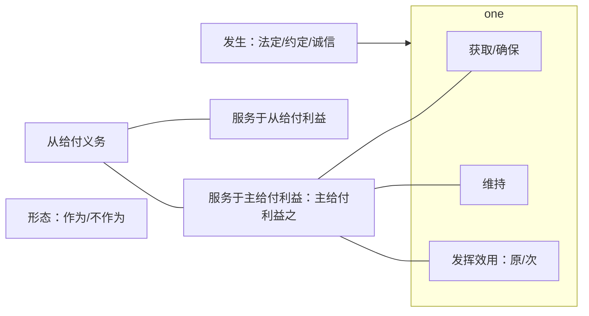
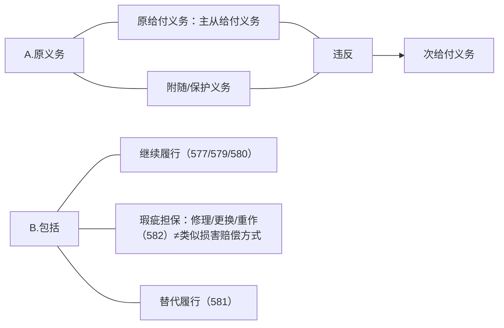
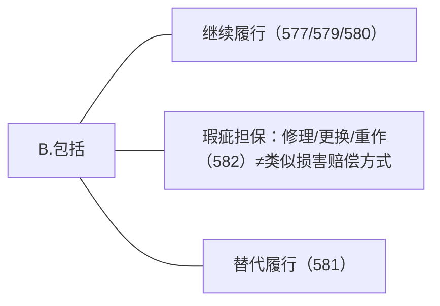
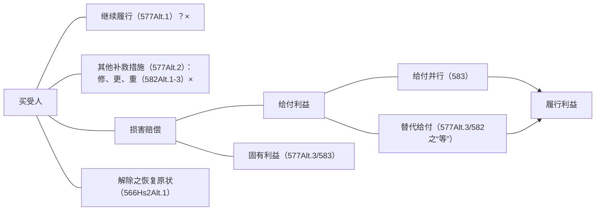
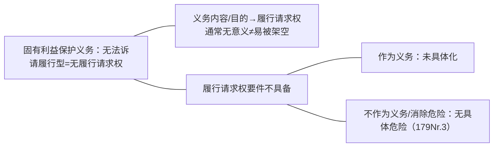

上次课我们讲的内容简要的做一个回顾。首先我们开始讲债务的体系，那么在债务里面面我们首先讲主从给付义务义务和附随义务是怎么区分开来的，怎么区分开来的？首先要掌握什么叫给付利益，什么叫固有利益。我相信同学们已经知道了什么叫给付利益，什么叫固有利益，这个给付利益就是按照债务的规划实现之后会带给对方什么利益，这是完全不折不扣的按照债务实现之后会带来的利益。所以我们知道如果是买卖合同，那么买受人的给付利益是什么？——标的物的的占有及其所有权。出卖人的给付利益是什么？——价款。如果是买受人本来买的是一辆红车，人家给了他一辆黄车，两辆车价值完全一样，我们讲买受人给付利益得到满足没有？——没有。给付利益必须是完全不折不扣按照债的规划规划来实现，不允许有任何改动，一改动就是给付利益受侵害了。

反过来给付利益和履行利益不一样，履行利益是什么？——这个合同正常履行之后，他可以赚到多少钱，是个数字，是个财产的金额。所以刚刚那个案件里面同学们都知道了，刚刚给付利益受侵害了的对不对？红车换成了一辆等值的黄车，给付利益仍然是有损害的，但是履行利益说起来没有？履行利益是多少？——0。因为给黄车财产中也是这么一个价值，给红车财产中也是这个价值，这个价值没有变化。好，这是一个给付利益。

什么叫固有利益？有一个债务，这个债务带来的利益叫给付利益，而除此之外的一切利益都属于固有利益。不仅是签这个合同之前，既有的叫固有利益，签了这个合同之后新增加的利益，只要不是因为这个合同而形成的，全部属于固有利益，明白了吧？只要和这个合同没关系的都是固有利益。 

那么大家知道给付利益和履行利益需要区分，而信赖利益需要和固有利益相区分。履行利益前面等过了，它是财产的增长额和那么如果因债务不履行导致因增长而未增长，那么通常情况下我们讲他的履行利益有损失了，对吧？这个时候就要赔偿履行利益。

信赖利益是相信一个法律行为有效而支出的有关的费用，最后导致了一方因信赖行为有效受到损失等等，那么这个叫信赖利益。那么值得注意的是，信赖利益所受的损失永远都是他固有利益中的一个部分，但是固有利益中因信赖行为成立有效而支出的那一部分财产，就叫做信赖利益，明白吧？否则是没法区分的，只能说这一部分被花出来了。这些东西不需要有什么理解，听明白就好了，没什么道理，就记住它，这是这些概念。

上次算了很多钱，履行利益和固定利益、信赖利益和落后费用。算钱在这个过程中很复杂，有几个点金老师临时算错了，所以呢课后是不是发了一个补充的说明给大家是吧？这边都收到了吗，而且金老师太粗心，发给大家的补充说明好几个错误，字就写错了。后来又重新来了一遍，一定要以我最后发给大家的说明为准。有一个地方给付并行和替代给付没有区分开，两处都写成了给付并行。另外一个地方大概是丙和丁写错了，就这两处。

那么错的在哪里？就是重点在替代交易的时候，本来有一个人 B 要给 A 一辆车，这是买卖合同，B 不给 A，A 催告 B，B 又不给 A。这个时候 A 是不是可以解除了，我也可以主张替代给付的损害赔偿，对吧？一旦这个要件具备，A 就可以做替代交易了，然后 A 就找到另外一个人去买了一辆车，叫替代交易。也就是说 A 是找到另外一个人，A 自己去通过 A 的购买行为，把原来 B 给 A 的给付利益 A 自己实现了。自己实现了，因此支出的费用是不是应该对方承担？所以这个时候要注意一下，A 从 C 这里买回来一辆车支出 15w，B 本来要给A 这辆车，我只要付 10 万，中间是不是有差价？所以大家要知道替代交易的时候赔什么？——赔原来合同中的买价和 A 现在替代交易的价格之间的差额，是不是固有利益的侵害。就可以赔这 5 万块钱。

但是赔了 5 万之后有一个问题，上次有同学们问这个问题，把我带偏了。同学说“他赔了 5w，给 A 赔了 5w，本来 A 不是从合同一、合同二都可以赚到钱的吗？赚不到钱还要不要赔？——我本来没想好，被他一问，就说就要赔了，后来发现这个是错误，被误导了，误导在哪里？问，两个合同中本来可以赚的钱，履行利益要不要赔？——不赔，为什么不赔？赔不赔完全看。A 把这个车子买回来之后，这两个合同中应该赚到钱，赚到了没有？——如果已经赚到了，那就不能再赔了；没赚到就要赔，所以决定的事是 A 有没有赚到。

问本来没问错，因为我对数学不敏感，弄错了。大家看，在第一个合同，这样的车子一进来意味着什么？我第一个合同是不是给付利益已完全满足了？能赚到的钱肯定赚到了呀。 假设这辆车是值市价是 12 万，当时的买价是 10 万，车子一进来是不是等于我财产中有一个 12 万的车子了？二本来需要支出的买价到 10 万，可能赚 2 万块对不对？但是因此多支出的费用是不是赔了？——相当于还是 10 万块钱把 12 万的车买回来了，2 万赚到对不对？

第二个合同中可得利益赚到没有？是不是要看第二个有没有被解除啊？第二个合同只要履行掉了，是不是就可以拿价款了？拿了价款相当于 A 要付出一个 12 万的车，拿进来 15万的块钱，是不是这个样子的？只要合同没有被解除，A 就还是可以赚到第二个合同中的钱，道理对不对，因为我会达到 15 万块价款嘛，3 万还是赚到了。

所以同学们道理很简单，我算数就忽略一点，忽略了第二个合同中什么问题呢？——A可以拿到价款，只要这 12 万对车一进来，A 就可以拿到钱了，对不对？

所以在替代交易中同学们记住，金老师上次就讲过一句话，只要赔了那个差价（替代交易费用和买价的差价），他就有可能实现原来用 10 万块钱所能实现的一切利益，有没有可能？那么这个时候就不需要另外赔偿了。

但是另外一种情形不一样，A 虽然买了一辆车过来，但是买了这辆车过来之后，第二个合同因为太晚了，已经被对方解除。所以第二个合同中的相对方解除了，这个时候是不是这个里面的价款是不是拿不到了？只要被解除掉了，第二个合同中的可得利益仍然应该赔偿。道理就是那么的简单，同学们听明白了没有？

所以金老师非常不适合学习跟数字有关，一碰到这个问题就头脑混乱，那么所以跟同学们讲一下，所以最后我给同学们昨天做了一个 PPT。对数字敏感的人，他有天赋的，像打扑克牌，有些人对数字特别敏感，打牌水平高的很，有些数字能记住。 

金老师讲的是不是道理啊？看转售的可得利益要不要赔，就看转售合同被解除了没有，对吧？大概抽象的可以这么讲，也就是说只要这个合同还在，A 还可以去履行这个合同，那么意味着这个合同可以赚到的钱是不是肯定可以赚到？只要 A 有权请求第二个合同中的价款，那意味着什么？这个合同中的钱是不是 A 能够赚到，那就不用再赔了。如果是第二个转售的合同被解除了，被对方主张替代给付的损害赔偿了等等，导致合同中的钱赚不到了，那就是要赔偿可得利益来。同学们，这个我讲明白了吧？就这个道理。

第二个，替代交易给了差价，给了差价意味着原合同的履行利益必然实现了，前面已经说明了，对不对？A 只是多花了钱，导致了实现了同样的给付【给付利益已获满足】，原来那个合同是不是已经实现了，对吧？第二个合同到底能不能再赔呢，差价要不要赔？也要看就看最后这个合同实现了没有？就是上面的规则。

- 大致损害赔偿中，跟违约有关的算法基本上都在这一块。细节的损害赔偿到时候再说。好，这是算起来怎么算？好，知道了给付利益和固有利益的区分，接下去我们来看这个义务到底怎么区分的，我们来看：
	- 如果是保护给付利益决定债的类型，并且有履行请求权的，那叫主给付义务，上次都讲过了不重复了。第二个，如果这个义务的内容是保护给付利益，但是他不决定债的类型，有履行请求权的（应该说通常有履行请求权的）是从给付义务。第三个只要保护固有利益的都是附随义务，对不对？这三个是没有争议的，有争议的是这个，保护给付利益，但没有履行请求权，对吧？有人把它作为附随义务，有人把它作为从给付的义务。上次课讲了之后，我觉得应该知道了。
	- 那么什么叫保护给付利益，没有履行请求权呢？上次也讲了，把 PPT 稍微改一下，内容一样，这种情形为什么有履行请求权？就是通常的所谓保护给付利益，但没有履行请求权，不能诉请履行指的是什么情形？指的是两种现象，第一种现象是有履行请求权，但作用不大，还记得为什么作用不大，这种情形是不是“他不知道”，请求权就没意义，对吧？知道了，如果你直接知道的是内容，那这个请求权目的就实现了，你都知道使用方法了，你还问对方，履行请求权就直接消灭了。如果是你知道的不是内容，只知道有这么一个东西，有个特殊情况要求他告诉你，他给你瞎说，你最后一点办法对不对？最后就转化损害赔偿。所以讲来讲去这个履行请求权作用不大，真正能够保证对方履行债务的，不是这个履行请求权，而不是损害赔偿请求权。对吧？是这个东西，这是第一种现象，有履行请求权作用不大。

![[履行利益与信赖利益的计算#^ja41gb]]

# 示例：保护给付利益+无法诉请履行？
- 【例1：甲将自制机器一台售予乙，却未告知乙读机器须遵循说明书未载明的特殊使用方法。未依此使用，虽无害于人身财产安全，机器却难免毁损。】
	【例2：甲系机器生产商，出售某型号机器7台予乙，约定三月后付款交货。签约后，乙放置机器的仓库漏水，全部机器有生锈毁损之虞。
	1.乙可否请求/诉请甲采取妥善保管措施？
	2.设甲欲将同一批机器出卖并交付，移转所育权子丙，乙可否请求甲不得为之？
	- 第二种保护给付利益的，它没有履行性授权，为什么没有？——是因为它不是独立义务。还记得这个保管吗？（上次都已经讲了，最后的时候讲的）他没有妥善保管的义务，这个出卖人对买方只负担一个什么？——交付移转所有权的义务，那么你前面保管不善，保管人在不在，只要进入交出了同样的东西，移转了所有权，问，要不要赔偿？——不赔偿，对不对。所以可见，出卖人对买受人只负有支付交付并移转所有权的义务，所以前面保管不是独立的义务，它是什么呢？——它唯一的意义在于，出卖人交不出同样的货的时候，或者交货晚了的时候，是不是他已经违反了自己的给付义务了？——此时要看他是有过错还是无过错，如果他是保管不善导致交不出货，那叫有过错。如果是尽力保管了，那就是没有任何过错，导致了给付义务的违反。所以这种所谓的“保管义务”，我们叫前置的义务，它是不独立的，它这是判定过错用的。所以我们在学债法的时候要准确的判定甲对乙负的到底是什么义务，所以我们说这里它不是独立的。

# 示例：非独立义务→无履行请求权
- ![[第三编 合同#^7a5f9m|民法典784]]
	【例3：甲乙签订买卖合同，乙送货上门时，甲因过失不知其门口出现一个隐蔽的坑，故未提醒乙，乙坠坑受伤。】
	- 那么我们也讲到了他和自助行为之间怎么协调对吧？在上次就讲过了，这里不重复了。 同样的我们看这个条文，上次也讲了，“妥善保管完成的工作成果”，是不是个独立的义务，是不是独立的义务？——承揽人对定做人负有的义务是保管他人的工作成果，还是做好工作成果交给对方？——做好工作成果交付给对方，给付义务是这个。如果是因为保管不善导致最后交不出来，问，违反的是保管义务还是交付工作成果的义务。——交付工作成果的义务。保管义务是前置的义务，非独立的义务。
	- 所以上次可以讲了，经常会讲到一些其实不是独立义务，（比方说有个坑，你要告诉给你送货的人）债权人，是不是应该告诉债务人，“你来送货，我家门口有个坑，你看不见。”好，这个时候负的是什么义务？对债务人来说有意义的是不是告诉他？但他因过失忘记了，或者因过失不知道有没有这个坑。那是不是有一个去查明这个坑的义务啊？——没有。因为对债务人来说（送货的人），来说有意义的是就是告诉他，而前面因过失而不知道这个坑，它不是一个独立的义务，只是这个“义务”的意义在哪里？——当最后没告诉他的时候，我们要察觉原因，原因是什么？——如果因为你过失而不知道，对不起你就过错。所以一定要搞清楚，对对方有意义的那个才是义务（其他的是非独立的义务）。
	- 好，讲完这个之后，就开始回顾了，对于这种所谓的保护给付利益无法诉请履行，或者没有履行权这种现象怎么放，是不是决定了两个不同的体系？第一个体系说，“满足给付利益，没有履行请求权的放在附随义务里面”，这是当年拉伦茨先生以来的传统，包括王泽鉴先生也是遵循了传统，其实是没有任何可以争论的，我都仔细看过原文，我本来期望我讲出个好道理来，对吧？发现就是一个法学大家，信誓旦旦的讲了一番话，“我觉得这个比较好”，没有任何的道理，大家因为他比较权威了，都抄，抄到现在为止，这是第一种学说。
	- 第二种学说，满足给付利益，但所谓的没有履行请求权的，经过金老师的分析是不是只有这两种情形啊？一种实际上它就没有这样的义务——请求保管的义务，保管义务是不是不独立的，当然更不会有请求保管的权利，对吧？这种连义务都不是的，就不用放进去了，对不对？没有独立的义务嘛。所以我们只要把什么东西放进去？——只需要把有履行请求权，但请求权作用不大的情况才放进去。
	- 同学们经过金老师分析，是不是不存在有一种保护给付利益，但是没有履行请求权的现象？有没有？——没有。再说一遍所谓的保护给付义务没有履行请求权，是不是两种情形——一种是有请求权；另外一种是非独立义务就没有请求权。就讲来讲去是不是不存在这种现象，这种现象根本就不存在，听明白了吧？所以我们只是把有履行请求权，但未必起作用的情形直接放到从给付义务中。

所以金老师的体系就是很清楚了，给付义务都是保护给付利益的，都有履行请求权。但是有一种情形，履行请求权起的作用不是太大，通常会转化为什么请求权？——损害赔偿请求权。再接下去看，所谓的附随义务都是保护固有利益的，它可以分成有履行请求权和无履行请求权。待会儿可以将。好，所以这个是上次课讲的主要内容：
![[履行利益与信赖利益的计算#^8xemqm]]

>法工委：[^1]
合同义务的违反，可以从被违反的义务角度区分为违反主给付义务、从给付义务、附随义务和不真正义务。主给付义务，是指债的关系中所固有、必备，并以之决定债之类型的基本义务。从给付义务，指补助主给付义务以确保债权人利益能获得最大满足的义务。附随义务，指根据诚信原则产生的顾及对方当事人法益和利益的义务。不真正义务，指债权人的受领义务或者采取适当措施防止损害扩大的义务。例如，通过网络交易购买一台空调，卖方交付空调并转移空调所有权是主给付义务；卖方交付质保书、发票的义务是从给付义务；卖方不得将其所获知的买方的个人信息泄露是附随义务。买方在空调出现问题而漏水时尽量采取措施减少损失扩大是不真正义务。

[^1]:民法典合同编解读上册，第 403 页。

>法院：[^2]
合同履行中，因债权人单方过错使债务人未能履行合同，债务人应否承担违约责任：
关于因债权人单方过错致使债务人末能按约履行合同，债务人应否承担违约责任，学理上认为，根据合同分配风险规则，履行障碍的风险由造成障碍者承担，即债权人造成了履行障碍，其过错行为致使债务人履行不了合同，当然应由债权人承担合同未能履行的法律后果。
例如，我国《民法典》第 832 条规定，由于托运人、收货人的过错造成运输过程中货物的毁损、灭失的，承运人不承担赔偿责任。
又如，《民法典》第 893 条规定，寄存人交付的保管物有瑕疵或者根据保管物的性质需要采取特殊保管措施的，寄存人应当将有关情况告知保管人；寄存人末告知，致使保管物受损失的，保管人不承担赔偿责任。寄存人未将有关情况告诉保管人属于有过错的情形，是保管人不负责任的前提。
在某旅客诉中国铁路客户服务中心一案中，旅客因遇交通拥堵未能赶上火车，退票未果后诉至法院，称其末按时乘车构成违约，愿意承担票面金额 5% 的违约责任并要求退票。法院认为，“乘车〞对旅客而言是权利，误车不构成违约，也没有违约责任的适用余地。 从误车行为的法律性质来看，误车属旅客对自身权利的放弃，尽管在因交通堵塞等原因而造成的误车中，这种放弃是被动的、无奈的。但无论如何，旅客误车实际上发生了承运人运输义务被免除的法律后果。

[^2]:合同编理解与适用二，第 720 页。

（1）法工委举的例子是既包含给付利益（空调），又包含固有利益的（漏水导致其他损失）。传统观点认为，若保护给付利益无履行请求权，放在附随义务。
但是此处有履行请求权「采取措施防止」，并没有放在从给付义务，而是放在附随义务。
也就是说，附随义务在保护给付利益的情形但是有履行请求权，也放在附随义务。因此可见，法工委的态度并不支持传统观点——认为统统没有履行请求权的放在附随义务里面。
（2）法工委：受领义务是不真正义务。最高院：依据风险分配规则进行调控。

接下去我们具体看给付义务，给付义务分成主给付义务、从给付义务。它都是保护的是什么利益？——给付利益。好，给付义务有什么特点？都是保护给付利益的，在此基础上有什么特点？——第一个，主给付就决定了债的类型。是不是？决定了债的类型，上次都讲过了，买卖租赁都有不同的主给付义务。第二个同学们要注意，一个合同中所谓的给付利益实际上是由主给付义务来限定的。比方说出卖人的给付利益是什么？——拿到价钱。为什么是拿到价金？反过来他主给付义务必然是请求支付价金，对不对？买受人的给付利益是什么？——拿到标的的占有和所有权，是不是这个道理啊？问，主给付义务是什么？是不是就是请求交付并移转所有权啊？你看，这个给付利益是由什么东西限定的？——它就是主给付义务限定的。注意一下，他两个基本上可以划等号。（但我待会儿会讲一个小小的例外，但这都基本是成立的）。

- 主给付义务→转化成新生给付关系之主给付义务
	- 决定债之类型+限定给付利益→对应于债权（狭义）→履行请求权
	- 契约之债：要素
	- 双务契约：对价义务

所以我们通常讲的债权，A 对 B 有个债权，A 请求 B 交付并移转所有权，这个债权在狭义的意义上就指的是与主体负义务相对应的履行请求权。A 对 B 是不是有一个交付并移转所有权的请求权？这叫债权，最狭义的债权。

再往下看，这反正就是个限定问题，本身不需要多展开。第二个，在合同之债里面这个主给付义务必然构成要素。学过民法总论都知道一个表示价值，表示价值，表示价值是不是要求有至少权利问题看得出来，并且能够落实啊，是不是这里面主要就是表示内容一定得有体现的要素啊？没有要素，它的权利义务就没法落实，对吧？[[合同的订立与成立#^zsil3d|与要素是相对的，是不是叫偶素，叫常素、偶素对吧？]]不多说了。所以呢，注意一下，从[[意思表示之构成要素（3）#B.表示价值：内部—外部|表示价值]]的角度来讲，也就是说表示价值最低构成部分，叫要素对不对？好，主给付义务(Hauptleistungspflichten)一定是要素。同学们，记住这句话要素(essentialia negotii))是什么？——表示价值的最低组成部分（法律另有规定的除外），少了之后就没了，不行了。好，这是原则。再说一遍，要素是表示加值的最低组成部分（法律另有规定的除外）。

我们国家价款可不可以由市场价来确定？都没约定可不可以？价格是要素啊，对不对？所以法律特别另有规定的出来。只要法律把它补上去了，实际上也就有了，你把它当例外没关系。

这个能够理解吧？买卖合同没有要支付价金的义务，是不是买卖合同？——那肯定不是，没有支付价金的义务，那就变成什么了？肯定不能买卖了，如果说不 B 给 A 一个东西来换A 一个东西，叫什么？给的不是钱，那叫互易。那就不是买卖了，叫互易了。

如果是一个 A 把房子借给你，然后向你收钱的叫什么？——租赁。不收钱的叫什么？——借用，是不是？所以你看这要素很重要的，如果没有支付租金的义务，那叫什么合同？——可能叫借用。有支付租金的义务叫什么？——租赁合同。你看，要素缺了一个，它就会变成另一个合同，或者是就不能成立。

从刚才金老师举的这个例子，是不是说明它决定了债的类型，支付租金，变租金了；也是同样给你用，不收钱叫借用了。

好，第三个，如果这个契约比较有意思，它不是普通契约，是双务契约。也就是说，你对我负有义务，我有对你负有义务，两个义务处于交换关系之中，这叫双务契约，还记得民中应该提到对吧？那么在这里面只要在双务契约中，这个主给付义务一定是对价义务，属于交换关系中的义务就是对价义务。

再说一遍，什么叫双务，“我对你负有义务，你也对我负有义务，两个义务处于交换关系中，而处于交换关系中的义务就是主给付义务。听明白了吧？注意交换关系中的义务叫对价义务，对价义务必然是主给付。这个没问题吧？这些都不需要什么理解的，你记下来就行了。

主给付义务里面同学们要注意一点，在同一个债务关系中，有可能因转化或特定事实的发生，产生出一些新的给付关系。这些新的给付关系中有新主给付义务。

# 新生给付关系——返还义务：回复清算关系之主给付义务
![[第三编 合同#^bnsvyh|民法典733S1]]
	
![[第三编 合同#^2s26qm|民法典675S1]]

![[第三编 合同#^ytfaqs|民法典899]]

![[第三编 合同#^69qd4g|民法典566I]]
	
![[第三编 合同#^el18x2|民法典985]]

给大家看个例子，[[第三编 合同#^bnsvyh|民法典733S1]]“租赁期限届满，承租人应当返还租赁”。租赁物承租人的给付利益是什么，获得一段时间的使用或者收益，对不对？就这段时间他来用它的收益，出租人的解除利益是什么？——拿到租金，很简单，就这两个给付利益了。好，为了这两个给付利益实现，法律是不是设定了两个主给付义务了？第一个主给付义务是什么？——对于出租人来说，有没有权利请求对方支付租金；相应的承租人是不是有义务要支付租金啊？支付租金的义务，主给付义务。第二个为了保障承租人的支付利益，获得一段时间的占有使用收益，这个时候设置了一个什么主给付义务？出租人有什么义务？——一是不是要交给他，第二是不是要容忍他使用这段时间？第三个，是不是要保障它这段时间使用的没问题啊？要符合品质。如果这个房子漏水了，不能住人了，交了也不算实现它的给付利益。主要就是三个义务，一，交给他，二，容忍他用那么长时间，第三个用的时候呢，租赁物要正常，对不对？就三个义务，三个主给付义务。

现在问，用完了要不要还？——要，要还是个什么业务呢？我们学说上，跟你说五花八门，真的五花八门，你别小看就这么一个很简单。好，告诉大家有人说是主给付义务，为什么？——它是不是共同决定了债的类型？是吧？租赁合同不还叫不叫租赁合同？——不还不存在租赁。只要决定债的类型就叫做主给付义务。这个观点对不对呢？——不对，主体负义务是不是一定要是让对方实现给付利益的？问，还给出租人，对出租人来说实现了什么给付利益？这个房子本来是谁的？本来是出租人的，那债在合同签订之前就属于他固有利益的组成部分，哪可能是给付义务呢？对吧？即使决定了债的类型，但是对出租人来说，他的给付利益很简单，给钱啊。所以它还过来是实现了原有的固有利益，那怎么能叫主给付义务呢？所以虽然决定了债的类型，但他没有服务于给付利益，可见不能叫做主给付义务。

德国人没办法了，觉得这个也不大对呀？怎么办？那换一种学说，说叫从给付义务。什么叫从给付义务呢？——也没什么道理，反正放不回到主体义务里面，那我们总得给他想个名字好，大致不是主就是从。也不对，它是不是针对出租人的给付利益，不是，他是固有利益。

好，第三种情况出现了，这确实也不对，那叫附随义务吧，附随反正是一个框，哪里都可以放。反正你前面两个放不进去，因此是附随义务。同学们，附随义务好像也不大，对吧？那么这个时候怎么来观察呢？

金老师提出一个观察方法，你看本来在合同履行之前，合同签订之前，我出租人既有的财产里是不是有这个标的物的所有权，有标的物的占有使用全部在我这里。好，现在合同签订了之后，我要交给他，交给他之后按照合同可以让他用一段时间，用完之后要还。注意一下，从这个时间点开始观察，应该还的这个时间点，金老师的固有利益是不是已经减少了？占有使用是不是已经不在我这里？从这个时间点开始观察，他还给我是不是给我新增利益啊？听明白了没有？从合同签订的那一刻起，固有利益是那样。但是从他应该还的时间点，占有是不是不在我这里？他还给我让我实现以前的固有利益，这也是给付利益呀。听清楚了没有？从这个时间点去观察他，金老师是没占有吧？这个还过来就算给付利益。

所以，我认为这是一种新的给付关系，这个新的给付关系是什么呢？合同签订之后，他的固有利益的一个部分已经转移到这里了，他占有了，那么租期结束之后，再反过去就变成了一种给付利益。之所以这么讲，是因为按照合同预定，它在那个时间点，它的固有利益本来就少了占有对吧？所以只要这样去理解，它是一个新增的给付关系。只要把交过来，属于以前有的固有利益，因合同履行少了一块，少了一块，我的固有利益里面就跟少了一块的固有利益，对不对？现在从那个点开始要还给我，是不是在增加我的固有利益了？叫给付利益了。

好，这是一种合同履行之后一个新增的给付利益，所以这就变成这种返还关系的主给付义务。再说一遍，这是一个独立的打引号的独立，或者说这是新生的新产生的一个给付关系中的主给付义务。而这个新产生的给付关系和原来的租赁合同什么关系？——是整个租赁合同的组成部分。

好，同学们，这不是偶然的，这样的现象非常多。我们来看借款要不要还，凡是按照合同预定规划要还的，那还都是一个独立的给付利益，独立的给付关系。保管要不要？——要，也是。好，接下去来了，刚刚要觉得有点不大理解的话，讲解除就很清楚了，AB 俩有个买卖合同，A 支付了价格，B 给了货，后来发现质量问题，A 符合了解除的要件，把它解决了。一解除之后双方是不是要返还了，问，这个返还关系，A 要把货还给 B，B要把钱还给 A， 对 AB 是不是给付利益，这是不是给付义务？如果一律站在合同签订之前去观察，肯定就是原来固有利益的实现嘛 ，怎么可能变成给付利益和给付义务呢？

同学们，不能这么想，学说通说认为合同一解除，产生一个反向的返还关系，这都是给付关系，是给付利益。这是通说，听明白了没有？再说一遍，先说解除之前好吧？——解除之前是不是 B 要给 A，A 要给 B，两个是给付利益吧？好，也是给付关系，对不对，给付义 务。好，一解除产生反向的返还义务，也是给付关系和给付利益，这是通说。

所以，这是不是原合同转化过来的一个新的给付关系？同学们，你就记下来就好，这个是通说。再说一遍，原买卖合同有两个正向的给付，两个给付关系，都是给别人新增加利益。一解除之后就要从解除的那个时间点去观察，A 要把那个货还给 B，对 B 来说是给付利益，也在新增了。因为在这个时间点，B 要还给 A，从这个时间点一般上对 A 来说也是新增，所以它都是给付利益。

那接下去看，不当得利。A 有一笔钱打错了，微信转账不小心转给 C，C 也不小心就点了那这个时候是不是不当得利关系，如果站在一律站在行为之前，说他本来是属于 A 给付的，本来是属于 A 固有利益的组成部分，那是不是 A 要回来就不是个给付关系了？不当得利能这样观察吗？不当得利是不是债务关系？——是。要回肯定是个给付利益嘛，是主给付义务嘛。所以一步一步推下来，发现一开始好像不大可以对不对？——全部是可以的。所以本来是固有利益的，因为固有利益的丧失和侵犯，有可能会产生出一种新的给付关系和给付利益，同学们听明白了没有？所以第一感觉觉得不合理的，经过后面这两个例子来看，这就是通说呀，而且是毫无争议的，印证了前面。所以我得出一个结论，前面三种只要是按合同约定，应该返还的全部是一个独立的返还关系。一个新产生的给付关系，新的给付利益，这样才能够理解。

第二种新生的给付关系叫费用偿还请求权，主要指的仅指为维护他人利益而支出的费用。你看这个是不是不动产给他的占有；我捡到了一只狗要求捡到了，而你家一只狗跑到我家来了，现在我是不是要把它喂好？在找到主人之前要喂他，不喂的话是不是会死掉了？那就喂狗，喂狗是不是要支出费用啊。在我管这只狗的期间，找到主人期间，狗生病了要不要给他治一下，兽医都是支出费用的。问，最后狗主人找到了，能不能向他要费用？是不是必要费用可以要？只要是善意占有的就可以。这个一直以设想为善意，中国法很奇怪，其他没学过不多说。反正由此可以要必要费用，对不对？
# 新生给付关系——费用偿还：费用偿还关系之主给付义务
![[第二编 物权#^txitne|民法典460]]

![[第三编 合同#^yoffae|民法典921]]

![[第三编 合同#^cguwou|民法典979I]]

要了必要费用之后，同学们，这个必要费用是什么？——我请你把喂狗的费用给我，治 狗的费用给我。如果站在以前角度来讲，我支出的一切钱是不是都可以要？能不能说因此让你把费用给我就不是一个给付关系啊？肯定是给付利益，我为你支出的钱你再钱还给我，是不是从那个时间点角度来讲，我的财产中少了一块钱，少了一段东西对不对？——你还给我就是新的给付关系，费用偿还请求权。

再接下去委托人。我替你去做事，帮你买了那么多 东西回来，我为此支出的费用能不能向委托人要？——当然可以，能不能说，因为它本来是固有利益的组成部分，所以它不是 个给付关系啊？不可以，它就是个给付关系。

而无因管理管理人是能不能向别人要有关的费用，是不是也可以的？不多说了。所以费 用偿还也是为同样的问题，发生新的给付关系。

好，所以明白了，原来的合同中有个主给付义务，一来一去，两个主给付义务。并不意味着不可能发生其他新的主给付义务，明白了没有？只要是按照合同预定的——主给付义务。所以转化和新生的结构关系中的主体服务，同学们看，我前面本来没讲这个东西，这里可以讲。

给付利益、固有利益，对吧？但是因固有利的保护，甚至有时候因给付利益的保护可以转化和新产生一个给付关系。而因此转化和新产生的给付技术关系其实会构成新的给付义务。现在听明白了，我来讲这个东西。好，最简单的是一个什么？——刚才没讲，固有利益。金老师是不是现在我的人身健康的安全是不是固有利益啊？现在有个人拿刀把我刺伤了，手上出血，是不是我的固有利益受侵害了？那么接下去我为了这个固有利益来让治疗对不对？现在就支出了一笔钱，我财产中是不是少了一块？你可以赔给我，问是不是给付利益？当然是，损害赔偿，天经地义的债务关系，债务关系怎么能不叫给付利益。所以你看，站在什么角度去观察它？——受伤之后支出之后去就观察它，他就是个给付利益对吧？

固有利益的损害赔偿，固有利益的丧失，叫回复清算和返还关系，全部是为他人的利益而支出费用、费用偿还都是。

回去好好的把脑子转一转，转不过来也没关系，概念清晰不清晰的问题没有太大作用。好，主给付义务。

第二个我们来讲从给付义务。前面讲到主给付，该讲从给付。从给付我们现在要给它细化，从给付，前面我们 前面讲的，服务于给付利益。注意一下，从给付服务于的给付利益有两种，一种叫主给付利益一种叫从给付利益。什么叫主给付利益，前面讲过：凡是由主给付义务所限定的给付利益，因主给付义务的履行所带给对方的利益都叫主给付利益，明白了吧？——主体负义务履行给对方新增的利益。

^bmay4r

好，那么前面讲过的所有例子都是主给付利益。我先讲一个什么叫从给付利益呢？（这个书上一般都没有的，同学们多批评）租赁了。你看，再说一遍，出租人的主给付利益是什么？——租金。承租人的给付利益是什么？——一段时间的占有使用。租赁没了，返还关系中还有个给付关系，返还也是给付利益，没了对不对？现在问，承租人的主体付义务是一段时间占有使用吧？但是法律会额外给他赔两个新的利益，第一个利益叫什么？——优先购买权，第二个利益叫优先使用权。什么叫优先购买权？——A 住在 B 的房子 A 住在里面了，在房子 A 使用期间、承租期间，出租人 B 要卖房子了，他把房子卖给了 C，所有权移转给女同学了。同学们，租赁合同，A 和谁定的？B，对不对？——A 跟 B 订的租赁合同，所以 B 说，“A，你出去”，A 可以说，“对不起，我们有合同，我不出去”，对不对？

现在是不是新的所有权归这位女同学了？A 说，“我现在是所有权人，我跟你没有合同， 请你出去”，是不是 A 原则上就要出去了，因为 A 和 C 没合同，对不对？好，债的相对性决
定了 A 要出去。这个时候法律为了保护 A 承租人居住上的需求，他进行了一个利益衡量。你看，承租人是不是很可怜，没房子住才需要租嘛，是不是？而对于 B 同学来说，他出租就不需要房子了。正因为他不需要可以卖给别人了。好，卖给别人之后，如果允许别人，新的所有权人随时可以把我赶走，是不是？这可怜的承租人 A 的租赁合同没有什么意义，我哪怕定 10 年都没有用，对不对？随时就这一卖房子合同就没了。法律上说承租人太可怜，要保护了。

怎么的保护方法呢，法律设置了这么个指标，法律说这个新的所有权人一买到房子，成为新的所有权人的时候，本来 A 和 B 之间的合同自动移转到 C 身上上去了，C 自动替代 B成为出租人了，C 还是承租人。既然作为新的所有权人自动成为出租人了，C 能不能给我改是吧？——债的相对性赶不走。听明白了没有？这个叫买卖不破租赁。

这个事是对的，只是我应该讲的是优先购买权。从头来说一遍。

承租人的给付利益是获得一段时间的占有使用，对不对？好，但是法律同时自动的配给他两个利益，新的利益。第一个利益就是刚才讲到是不是如果所有权已经移转给 C 了，是不是 C 不能把 A 赶走。

第二个保护来了，优先购买权。不仅不能赶走，而且 B 在卖之前，要先问我的意见。“A，我准备把这套房子卖给 C，他很可爱，我只卖他 500 万，A 你要不要买？”注意一下，必须这样告诉 A，B 不告诉 A，B 就在侵犯 A 的优先购买权了。如果 A 说，“我要买”。对不起， B 只能把房子卖给 A，不能卖给 C，听清楚了吗？A 这个权利厉害不厉害？优先购买权，这是合同签订以前 A 有没有利益啊？没有这个利益吧？是不是因为合同签订新增加的一个利益啊？它也是给付利益。但他是不是整个合同的主给付利益呢？它是覆盖的，实际上它是一定程度上是为了让主给付利益，是不是能够发挥很大的效益啊，对不对？而配了一个次要的新的给付利益，这叫从给付利益。说清楚了吗同志们？再说一遍，这是不是新增利益？肯定是合同形成利益对不对？但他不是主给付利益，所以它只能叫什么？从给付利益了。法律自动配的。

第三个权利是什么？承租人的保护？B 同学在合同期间没有卖房，他知道 A 有优先购买权，太复杂了，不卖。等到租期好不容易结束了，他想租给身边这位同学。注意一下，他得以先告诉 A，“A，我准备把房子租给 C，你要不要租？”A 要租 B 得先租给 A。这是不是在租赁合同签订之前没有这个权利啊？这个权利以前没有吧？只能理解为从给付利益，对不对？

好，这两个从给付利益没有什么太大的问题，我说清楚了吗？这是一个从给付利益。第二个情形，从给付利益。同学们注意一下，我们是不是讲到受领义务啊？你要交给我，我当然要受理，受理是不是原则上是个不真正义务啊。不真正义务意味着什么？履行之前，你有没有权利请求我受理啊？——没有履行职权。第二个，我违反了之后有没有损害赔偿请求权？——也没有。所有的不利，就是前面讲过的自己承受不利，但不配给对方一个请求权对吧？但是同学们要注意，在有些情形下受理呢，会变成一种从给付义务，会变成一种新利益。这种情形是很特别的。

金老师说，“我这边是清仓大甩卖”，清仓意味着什么，这仓库要空出来，店面我要空出来的，否则我就麻烦了。所以我说的很清楚，我跟你签合同，你必须 3 月 1 号之前把货来拿走，讲明白了吗？如果不拿走你要向我支付违约金的。在这个时候是不是意味着我清楚的通过合同约定了？讲清楚了，你的受领是不是对我们来说是一种新的利益？

本来我从头讲起，本来你来受领，对我来说是不是个利益？——不是新的利益，按照合同规划是你的利益，是你的新利益对不对？说受理是不是为你自己的新利益服务的，所以叫一个对己义务啊，对不对？但现在的清仓大甩卖的情形，我是不是从情节就可以看出来，及时取走，对我来说是个独特的新利益呀？本来这个东西占在这里很麻烦，我这个仓库租不出去了，店面租不出去了，对不对？店面晚交我要付向别人付违约金，所以你即使把他领走对我变成了一种新利益，此时受领就变成一种给付义务了，听明白了吗？

所以不是所有的受领义务都可以平白无故的成为起诉义务。只有当证明这个受领对我出卖人来说，构成了一种独特的新利益的时候，需要保障的时候才变成从给付利益，说清楚了吗？这是清仓的时候同学们注意一下，真正的清仓从形式看得出来，A 对搬走其实搬走有重大利益的时候，一定是个给付利益，这个给付利益是新增的对不对？合同决定新增的，但它决定债的类型吗？不决定，所以从给付义务，从给付利益。

# 从给付义务——服务于从给付利益：现行法示例
![[第三编 合同#^4eqmp7|民法典726I]]

![[第三编 合同#^4au2oz|民法典734II]]

示例：清仓甩卖/双方特别约定买方违反受领义务应负损害赔偿责任。

接下去再看不是清仓，但双方通过特别约定，你必须在 5 月 1 号之前把货拿走，否则你要向我付违约金的，通过违约金的。通过是不是说明了你及时搬走对我有重大的利益？它也成为一个给付业务了。但这个基础业务是主给付还是从给付？——只能是从给付。

所以同学们注意一下，德国法把买卖和承揽中，债权人的受领义务一律提升为一种所谓的给付义务，违反之后产生损害赔偿请求权，同学们是有问题的。听到金老师分析，我说清楚了没有？德国买卖中不管任何情形，只要我没有及时去拿，我是不是违反受领义务啊？一律可以给对方一个损害赔偿请求权。同学们你们觉得这样的规定本身可能是后果上和体系上是不是有些问题啊，我不知道同学们听得明白没有？我多讲两句啊，听不懂没关系，这种做法的问题在哪里？——（1）违反之后要赔出卖人钱，没有及时受领要赔钱，法效果上没有问题，可以赔钱，但它是不是必然是给付义务？——前面讲过了，只有当受理的结果，对我来说有重大利益的时候，是新增利益的时候才能成为给付业务，对不对？所以德国法律规定，在这种对我们的重大利益的时候，你不受理，叫给付义务的违反，要给钱。如果没有情况证明受理对我来说是一个很大的利益，这个时候只能说什么义务被违法？——不真正义务，不会给对方一个赔钱的机会的。这是什么？——是附随义务。德国通过立法立法把受领义务一律提升为应该赔偿的附随义务，这个听明白没有？估计有同学已经听明白了，同学还没听明白，没关系。

再说一遍，德国法把受理义务提升为真正义务了。真正义务违反是不是要赔钱？——要赔钱。但是不是一律是给付义务？——不是，什么时候是给付义务。？在这两种情形说明它是给付义务。其他情形都不是，是附随义务，明白了吧？这个体制对了。

好，同学们有没有发现，在那个从给付义务的情形是不是有保护从给付利益的情形啊？他也是新增的，但不是主给付义务，主给付利益。对吧？

这个要特别论证，为什么要特别论证？这个是想出来的，不一定对，所以要特别的论证，被你们批评。好，接下去，通常的从给付业务都是服务于主体服务利益的，它服务于主给付义务什么呢？同学们我们来看，（1）有些从给付义务为了保证债权能获得主给付利益，主给付义务的获得。
# 从给付义务——服务于主给付利益：获取/确保
比方说包装，包装的目的是什么？——出卖人是不是有妥善包装的义务，是不是保证他这个货物能够拿到，对吧？一个叫取得给付利益。看看包装的目的是什么，是不是不包好可能会坏掉？让他保证对方能够达到货物，是不是确保主给付利益东西过去啊？没问题吧？

第二个供电人应当及时抢修，在维护什么利益？供电合同，用电一方它的给付利益是什么？随时想用就可以用，这就是它的想实现的主给付利益。及时抢修是什么？——主给付利益的实现。你不抢修好是不是这个主给付利益被毁掉了？供电合同是想用随时可以用啊，这个主给付利益被毁掉了，及时抢救的恢复，保证他获取，没问题吧？

第三个应当履行租赁物的维修义务。承租人给付利益是什么？这段时间的占有使用，而且占有使用是合格的租赁物，对不对？现在租赁物坏掉了，及时维修在干什么？不仅是主给付义务已经获取了，用的不好了是主体给付利益的确保。在我这里不好了变成好的，是不是确啊，保证它是好的。

融资租赁不说了，一样的道理。

![[第三编 合同#^zglby5|民法典774]]

![[第三编 合同#^vqkvod|民法典779]]

![[第三编 合同#^vquhp4|民法典780]]

![[第三编 合同#^sho2ym|民法典798S1]]

![[第三编 合同#^m11p38|民法典911]]

再看下面，承揽人提供材料的，应当按照约定选用材料，并接受定作人检查。定作人是，我有个东西想让你做，我定做人，你是承办人，对不对？是承揽人自己的材料，定做人是不是有权利可以检查？——这个检查是为了什么？承揽人要有接受检查的义务，这个义务的目的是什么？是不是保障一个定做人的主体福利一样，对吧？定做人主给付利益是什么？做出来东西要合格，东西合格前提是材料合格。你看他就在保障，是主给付利益的确保，是不是保证质量要好啊？是确保，获取质量要确保。

我讲明白了吗？这个义务是什么？再说一遍，是不是承揽人有个义务啊？要接受定做人检查，对吧？——这个接受检查的义务是在确保定做人的主给付利益，工作成果要好啊，对吧？确保。再看承揽人要接受监督检验是不是一样的？监督检验，接受监督检验的义务是不是一个主给付利益的确保，对吧？

再看隐蔽工程在隐蔽之前申报的，应当通知发包人检查，承包人来造房子，隐蔽工程隐蔽之前，这里面的线路等等，这种通知对方的义务在保障什么？是不是也在保障工程交给我之前质量要好啊？凡是质量要好，都是主给付利益的确保，保障主给付利益是好的。

保管人要同意检查或提取样品。我仓储的保管人，你来检查，我同意你来检查，这个义务在确保什么？你作为寄存人，你的主给付利益是什么？——是不是我帮你保管好，到时候管好了还给你啊？这个时候中间你来检查一下，我必须要接受你的检查，是不是在确保这个主给付利益的实现，对吧？管好，所以这个时候也是主给付利益的确保。

![[第三编 合同#^n6pgaz|民法典924]]

![[第三编 合同#^hb4erj|民法典943]]

![[第三编 合同#^02ze4t|民法典982]]

![[第三编 合同#^s8xcuc|民法典983S1]]

![[第三编 合同#^b93nkj|民法典619S1]]

![[第三编 合同#^4ozzxa|民法典653]]

![[第三编 合同#^3pieaz|民法典712]]

![[第三编 合同#^lhcb9h|民法典741]]

# 从给付义务——服务于主给付利益：维持
![[第三编 合同#^v8stoc|民法典546I]]

例1：部分售后服务。

例2：出卖营业（书名等），不得竞业。

好，第二种情形是主给付利益的维持。从给付义务在于维持主给付利益。就是给付义务给你了，这个还要说吗？都一样的，你们仔细回去自己想想看好吧，全部是维持。

什么叫维持？——给付利益已经让你完好的实现了，但是我后面还要做一些事情，保证已经取得的给付利益不至于受到影响。拿到了给付利益有可能会消灭的，最典型的是债权让与的通知。

金老师对这位同学有一个债权，债权不管是什么债权有债权。债权是不是可以让与啊。金老师有债权的时候就通过一个处分行为跟[[法律行为之分类：负担行为与处分行为#2．准物权行为|准物权行为]]让与给了 B，金老师说，“我把对甲的债权让与给你，你要不要”，B 说“好的”。是不是应该准物权行为就达成了，对不对？而准物权行为要不要公示？要不要公示？凡是说要公示的同学回去自己看一看民法总论中的讲课。物权行为才需要公示对不对？准物权行为一般不需要公示。民法总则很重要。也就是说我们物权合意，准物权合意一达成，债权就可以发生。

那么债权买卖合同项下的给付利益是不是它实现了？B 已经取得了、买到了债权。但是同学们，这里面金老师往往根据合同有个义务，金老师有义务通知债务人，“同学，我给你的债权，已经转让给 B 同学了”，我必须要这么做一下。我这么说一下目的是什么？我必须向债务人说一下，我的债权已经转让给 B 了。这个义务如果不确保的话，如果我不通知会有什么后果？我不通知的话，B 虽然是真正的债权人，但债务人不知道仍然不知道，向我付钱的话，是不是 B 的已经取得的债权会因他的善意清偿而消灭？B 的给付利益是不稳固的。金老师有义务做了个通知，通知完了之后他的给付利益就稳固了。这位同学，债务人，只能向新的债权人的付钱而免责了，这个从给付义务是不是在确保给付利益的维持啊？

好，第二，一部分的售后服务。我买来的东西之后，东西用的是不是会坏？我买到东西，是不是给付利益实现了？坏了有地方保修，是不是意味着他在维持我的给付利益？——保修义务往往是从给付义务，往往是，不一定所有都是。有的瑕疵担保，直接是主给付，有的是从给付，看是不是新增的。

接下来民总讲过的，补充解释典型的例子。甲有一个书店，一个书店，他把书店卖B同学了。B 同学在书店经营一个月之后，甲又回来在原来的地方开了一个书店。是不是讲过按照补充解释甲不能开，这个叫不能竞业，不能和原来那个竞争。 问，这种不能竞业的义务，不竞争的义务，在确保什么？是不是确保给付利益的位置啊。B 买这个书店是不是想做生意，他看中了这个店的预期对吧？营业量很好，如果一旦允许老的店主在 B 边上开店，是不是老客户全部到那边去了？这个叫给付利益的维持，这种情况下很容易理解吧。
# 从给付义务——服务于主给付利益：发挥效用
例1：提供产品使用说明书。

![[第三编 合同#^eodza4|民法典599]]

第三种情形是给付利益的什么呢？进一步发挥效用。你看这个例子，你卖给我一台电视机，同学们这台电视机你把所有权给我，把占有给我，是不是你的主给付义务是不是履行完了？是完全履行完了吧？没有任何问题了。但这里有个问题，我买了个电视机，它的作用是什么？为什么我要买电视机？是不是有这个问题？同学们，这里要区分两个问题了：（1）我为什么要订立买卖合同？——想取得占有和所有权，这是不是和他的合同中合同义务里直接体现出来的合同利益呀？所以第一性的合同目的，取得占有所有权。至于我电视机拿回来之后想干什么，想要发挥什么作用，实际上是第二性的合同目的，对不对？再说一遍，要买回来干什么，就不是合同管了，对不对？好，但是呢，买回来干什么？电视机的通常效用要不要发挥出来？是不是一定要有保障的？所以这个时候会要求出卖人提供一个产品使用说明书吧？所以占有给我，所有权也给我。

但是电视机还好，有些复杂的机器没有使用说明书根本用不了，对不对？这个时候买回来是不是让这个合同中看得出来的通常的效益发挥啊？所以说这个使用说明书是不是就在于，让你买卖合同中买回一个东西之后，给付利益实现之后，让给付利益的效用得到正常发挥啊。这是一个正常发挥，正常发挥还可以被容纳在原有合同中的合同目的里面，听清楚没有？——有些进一步的效用就不一样了，它超出了原合同的范围。

你看我买了一个电视机，通常电视机是不是用来看的？回来看电视对不对？我买这个电视机是准备装到我家开的餐馆的，墙上做一个装饰用的，不用，就是为了装饰用的。这是我的一个目的，这个目的是不是通常定的一个买卖合同想不到的用法？这个时候原给付利益就没什么关系了，是不是？对这个用，假设电视机买回来发现，这个电视机我家墙上挂不上去，出卖人要不要负责？要不要负责？这已经不属于原给付利益的范畴了，而电视机要能看是不是原给付利益的范畴啊，这两个不一样的对不对？超出了原给付利益的的部分，让效果发挥，这是一个，像装饰。

另外一个我买了电视机准备转卖的，有没有可能？转卖卖不出去，问，出卖人要不要负责，也不要，超出了原给付利益的范畴，对不对？好，但是这种进一步的使用的目，给付效果的发挥，注意一下，在有的时候出卖人也会负有相应的配合，这前提是什么？前提是他知道或应当知道我是用来干什么的。 

举个例子，我买了这批电视机目的是出口的，或者我买了这批苹果是出国的。你知道我是出口的，我有没有权利要求你给我一些检疫证书，要不要给我？照理说你把苹果交给我之后你就不用管了，苹果能吃就行了，对不对？但是合同上或者诚实信用会要求你给我相应的检疫证书的义务，我说明白了明白吗？所以看，“提供有关的单子和资料”。

通过这个例子同学们看，让主给付利益进一步发挥效用的义务有可能有两种情形，一种是不是还属于原给付利益的范畴之内啊，施工说明书就是为了正常的功能发挥。第二个呢是不是超出了原给付利益的范畴啊？但是相当于当时有个特别的约定，或者对方知道要诚实信用要让他进一步效应发挥，都属于从给付义务。好，这是从给付义务。
# 服务于从给付利益的从给付义务——属于主给付利益的从权利：主给付义务
![[第三编 合同#^07le75|民法典547]]

在这里要注意一点，刚刚是不是讲到服务于从给付利益的从给付义务啊？和属于主给付利益的从权利要分开。你看，债权人转让债权是不是取得与债权有关的从权利啊？

我举个例子，我对这位同学有个债权，这个债权有担保，什么担保？这位同学的朋友拿了一个房子抵押给金老师。金老师是不是（1）有个债权？（2）债权在那个房子上有抵押权。现在金老师把债权卖给了 B，债权让与，债权给他了。我这个抵押权是不是还登记在金老师的名下？所以这抵押权在债权给 B 的那一刻开始，是属于金老师还是属于 B？看法条是属于谁？债权已经移转过去了，抵押权还没过户，问抵押权归谁？看完它告诉我归谁，归金老师还是 B？——归 B 了，这叫自动跟着过去了，自动取得了。那么也就 B 同学要求把登记更正到他名下去，是更正，不是过户，对不对？就买到债一刹那登记就错了，更正了。

好现在回来，现在问大家，B 是不是买债权，但是抵押的也就跟随着过去了，这都是从权利啊。问，金老师是不是要配合他去过户过去啊？配合他把登记去变过去，金老师配合义务是从给付义务还是主给付义务？问，这是从给付利益还是主给付利益？这是主给付利益，不是从给付利益。为什么？B 这边是不是看中有抵押权才买债权？正常人是不是都是这样的，看重有个抵押权才买，因为债权本来是没保障的一个东西。有抵押权的债权才值得买吧。所以在 B 买债权的时候，表面上买债权实际上是在买有抵押权的债权，所以说抵押权跟过去是主给付义务，权利是从权利，但是在债权买卖过程中是主给付义务。

![[债务的体系#^bmay4r]]

好，现在我们看，从给付义务同学们知道了，一种是服务于主给付利益，一种是服务于从给付利益。而主体给付利益它怎么服务的呢？有的时候是努力让主给付义务能够取得，取得的主给付利益不能让它因此后来受到损害。第三个取得的主给付利益让他发挥效用，总共就是这么几种情形，都属于从给付义务。

从给付义务的发生，有的是让法律的规定直接发生。前面讲的包装义务是法定的，约定是不是有很多约定的情形？很简单，很多事情你要约定，你要及时来受理，否则你就要赔我钱，就把约定为一个从给付利益了。

因诚实信用产生的从给付义务多的很，前面讲过了。我和你向你买一批苹果，我没有在合同里说你要给我提供简易证书，但是我告诉你了，我是要出口的，是相关的一切事情要配合我。这个就是诚实信用而产生。

从给付义务的形态，有的是作为，有的是不作为，以作为为常见，从给付义务就是要你干个什么事情。但是不作为的从给付义务也是有的。什么叫不作为的从给付义务啊？前面讲过的开书店不能竞业，不能和他竞争是不是不作为义务啊？他服务于主体部利益的进一步维持，当然是从给付义务了。不作为也是有的。

这是主给付义务和从给付义务的区分。 

- 我们国家的债务不履行不是无过错责任吗，无过错责任为什么前面要去说保管是不独立的，要判定过错？同学们要注意，我们国家说债务不履行是无过错责任，这句话是
	1. 针对合同来说的，合同因为以前的 107 条规定的很明确，上次刚刚讲过的，它确实没有写过错。这是通俗认为，因此认为合同上的债务不履行，他就是无过错责任。但是超出合同之外的其他债务，是不是无过错责任？没有这么说过，这是第一个。
	2. 在合同范围内，大家要注意一下，对于即使通说认为合同上的债务不履行是无过错责任，是不是意味着每种有名合同都是无过错责任？——不是，各种有有名合同要按照各种有名合同的法律规定单独判断，有的有名合同明确了过错责任；有的有名合同，有各种买卖啊，租赁啊，各种有名合同，虽然没有规定过错责任，但是理解起来是用过错责任更好，也不用适用合同法通则所谓的无过错责任。我讲清楚了吧，这个是会有例外的，也就是说分则中的各种合同有可能都是过错责任，好多都是。只有分则中没有明确规定过错责任，按照理解也不需要解释为过错责任的情形，这个时候才适用总则中通说认为的无过错责任来适用。我说清楚了没有？

最后一个，即使对通说中所说的无过错责任，也是有不同看法的，金老师就不赞同我们国家的债务不履行，在没有规定的情形都适用无过错责任，这个是不一定对的。所以讲来讲去，把通说认为债务不履行是无过错责任，这一点先讲清楚。第二个，即使债务不履行是无过错责任，问在合同履行过程中有过错是不是仍然很有可能的？是不是？仍然会有可能吧？这个时候你去判定过错的什么问题呢，没有问题的，我把现象讲清楚，这个时候只是因为有过错造成的债务不履行。那么即使债务人是债务不履行是无过错责任，有个过错不影响他承担债务的责任，对吧？甚至可能会考虑一个加重的情节都有可能吧。好，这是第一个问题澄清。

第二个问题是有同学问，这里刚刚讲了承租出租人的给付义务或者承租人的给付利益是什么？一，取得占有；二，用一段时间；三，要合乎品质，对不对？他说你把合乎品质讲为主给付义务了，接下去要维修为什么是从给付义务呢。为什么是从给付义务不利？——同学们，注意一下，这个确实要纠正一下，幸好这位同学进一步提出来，主给付和从给付到底区别在哪里，它的区别其实很简单，区别就是决不决定债的类型，清楚了没有？问，维修是不是在满足主给付利益？——肯定在满足主给付利益嘛。它决不决定债的类型？我们合同是约定，出租人说，“坏了你自己修”，我不修，可以吧？完全可以。

所以当这个义务被约定去掉，特约排除之后，约定去掉的时候，它还是不是租赁合同？仍然是，所以它是从给付义务。而主给付义务特点是什么？一旦去掉就没了，这不是租赁了。讲明白了这个地方？这个差别就在这个地方，所以刚刚讲起来所谓的三个主给付义务，第一个主给付义务，交付；第二个主给付义务，用到约定的时间；第三个，维持品质，品质要好，交货的时候品质要好，没有约定交货要好，对吧？后面修就务属于从给付义务了，这个可以讲讲。好，这是一个是主从给付。
# 从给付义务——服务于从给付利益：现行法示例
![[第三编 合同#^4eqmp7|民法典726I]]

![[第三编 合同#^4au2oz|民法典734II]]

示例：清仓甩卖/双方特别约定买方违反受领义务应负损害赔偿责任。

还有一个是确实一个地方没讲清楚，我以为你们都理解了，其实这个要再讲一讲，讲的太快。这个地方，那么这两个是从给付利益我能够理解，但从给付义务是什么呢？你看，优先购买权是不是新的利益？放不到主给付利益，所以从给付利益。优先承租权也是吧？义务是什么？义务是出租人要及时的通知承租人，让他来行使这个通知的义务，让他行使的义务。讲清楚了没有？这是个从给付义务，这个确实是我说漏，我这句话没讲出来，我讲清楚了没有？也就是说在这两个权利之下，出租人负有什么义务：我要卖房子，得通知他问你行不行使。我要出租房子了，我得问你要不要先租，讲清楚了吗？——义务是这个，好。

最后一个，倒数第二个，有个同学问我他，说这里为什么一定要把抵押权算到主给付利益里面去？能不能说主给付利益就是债权，怎么来界定主给付利益？——同学们，挺简单的，在合同里面，交换关系的合同里面，就抓住一点：一方拿自己的财产想要换回来的那个东西就是主给付义务。问，这里他想拿钱换回来的是债权还是债权加抵押权？——债权加抵押权。明白这个就行，不能把它减少了，减少就不符合意思自治了。所以在合同里面主给付利益其实是谁界定的？是当事人意思自治界定的，你想换什么决定了它是什么？

[[履行利益与信赖利益的计算#^umn55a|最后一个同学们，我没纠正]]，要按照新的算法同学算一下，应该赔多少钱，上次我讲的多讲了 2w。要赔多少钱，（1）是差价 2 万；（2）这里没有转售合同，只有可得利吧，2 万加上可得利 3 万就行了，5 万。这是我的疏漏。有同学说为他纠结的很厉害，我以为我纠正完了，因为我没意识到我自己当时多赚了 2 万。当时多赚两万，是因为第一个合同还要赔，对不对？第一个合同是不是机器买回来就不用赔了？ ^7581xz

[[履行利益与信赖利益的计算#^fjq32n|还有一个他说也没纠正]]，这里同学们也按照新的规则自己算一遍，跟以前就不一样了。12 万买回来了。这 12 万不是花多花了 2 万吗？后面的都实现了，赔 2 万块对吧？但是说的是多少？——4w，还要加上履行利益，但是说错了，没有履行利益，机器买回来就没有了。就 2w。所以还是要训练规范的思考方法，金老师思考方法不规范，说错了抱歉抱歉。 ^3i38ew

好，接下去下面看给付义务，原给付义务、次给付义务。好，也就是说给付义务除了主 从之外，还可以分为原次，另外一种分类。
# 原/次给付义务

原给付义务、次给付义务，首先讲原给付义务。首先原给付义务讲原义务，在债务关系之下原义务是什么？原义务包括原来的给付义务，包括主从是原的。第二个，有没有附随义务啊，附随义务是不是原的？但是原附随义务它不叫给付义务对不对？好，所以原义务包括给付义务，和原来的附随义务——保护义务。而附随义务是不是也是原的？但是原附随义务它不叫给付义务，对不对？所以，原给付义务包括原来的给付义务和保护义务。

而无论是给付义务的违反，还是附随义务保护义务的违反，都可能会产生次给付义务，次给付请求权。比方说给付义务违反，你东西机器没交给我，是不是要赔偿我的损害？次给付义务。再比方说，你在交货的过程中把我撞伤了，是不是侵犯我的固有利益了？违反了是不是附随义务啊？要不要赔的钱？——要赔，所以这个也是次给付义务。讲清楚了吧？所以大家注意一下，这是附随义务、保护义务，它不是给付义务，但它的违反会产生新的给付义务，叫次给付义务。

从时间维度而言，保护义务是非常广泛的，不仅是有效的契约中存在保护义务，在契约无效的情形、缔约阶段都存在保护义务；从保护范围（空间）纬度，保护范围也有所扩张，包括除缔约人以外的第三人。问，在契约成立但未生效阶段是否存在保护义务？——当然存在，在缔约阶段都已存在，何况契约已成立阶段。

除了在契约法（即当事人已缔约「成立、有效、无效」或准备缔约）中，在生活中存在一般的保护义务，违反将因侵权行为产生损害赔偿义务。依据当事人在不同阶段的特别联系（Sonderverbindung）程度，分为一般保护义务（无缔约意思），缔约保护义务（准备缔约）以及附随义务（已缔约）。 

对于契约无效、契约已成立、缔约过失阶段，以及对第三人保护义务的违反而发生的损害赔偿请求权不是次给付请求权，因为根本没有原给付请求权。 

强调：所有保护义务的标的（客体）都是保护固有利益（权利、法益？、利益）。

# 容易忽略的原给付义务
![[第三编 合同#^pqlryz|民法典577]]

![[第三编 合同#^88p22r|民法典582]]

![[第三编 合同#^6fnvg4|民法典581]]

原给付义务，容易混淆的原给付义务，好多书上或者会动错。第一个，同学们看[[第三编 合同#^pqlryz|民法典577]]、[[第三编 合同#^6wr2zj|民法典579]]、[[第三编 合同#^m7fbim|民法典580]]的继续履行。你看我们信息是不是要继续履行。自己看法条，是不是金钱债务，非金钱债务，都有两个条文都说可以要继续履行啊，对吧？就是这两个条文。凡是继续履行，看它写在哪一章里面，看法条（同学们用电子版的法条有一点不好，你没有体系感）是不是现在违约责任怎么样？违约责任是不是让人家感觉到是违反之后产生的次给付义务了？同学们注意一下，这是个错觉。注意一下，你看，本来我有权请求你交付并移转所有权，因为你拒绝交付，所以我起诉要求你交付，在违反之前是原给付义务吧，是不是？违反之后，继续要求交货就变成次给付义务了？事实上没有这样的道理，它就是原来的义务没变过，它就是原来的义务，这叫违约之后的继续履行，是原给付义务，原给付请求权的延续，并没有变成次给付义务。同学们讲清楚没有？

所以以后解题的时候就做案例练习的时候，我们会特别讲到，他该交货不交，我请他继续交，请求权基础怎么列啊同学们？——请求权基础实际上，你光列[[第三编 合同#^pqlryz|民法典577]]是不够的，一定要引用到原来的那个原给付请求权。继续履行是不是必须嫁接在一个原给付请求权上？这个本质上是个原给付请求权了。[[第三编 合同#^pqlryz|民法典577]]结合某一个原给付请求权，才是违约之后的请求权基础，它本来就是原来那个。这是继续履行，他是原给付请求权。

有学说反对说，不能根据这个条文推出来，我们国家的债务不履行是无过错责任。为什么不能根据条文推出来是无过错责任？原给付请求权有个特点：我请求你履行永远是不以过错为要件。你看，违反之前我请求你履行，我要加上说，所以你要履行吗？不需要，是不是原来合同约定了需要履行。法秩序已经认定了它的正当性，不需要额外另加要件可以要求履行，是不是？违反之后会不要以过错为要件？是不是原来合同的也需要，只要以前法秩序认可过的权利内容，继续实现，不需要加过错要件，对不对？所以违反之后的继续也不需要以过错为要件，这是原给付请求权的特点。

再说一遍，凡是法只需原来认可过的原给付请求权权，在它范围内就是无过错的。凡是原给付请求权范围内的权利，都是无过错。这个道理很好的话，为什么都是无过错的？因为法治序已经认可过他的正当性了。认可过的正当性的权利，继续实现无条件，无条件继续实现，听明白了没有同学们。

违约责任的形式：（1）价格制裁「[[第三编 合同#^1bi37a|民法典513]]」、（2）违约金「[[第三编 合同#^g34ckv|民法典585]]」、（3）定金罚则「[[第三编 合同#^1hjeom|民法典586]]、 [[第三编 合同#^cq7np5|民法典587]]、[[第三编 合同#^aizcx7|民法典588]]“三金规则”」

我想这应该能理解的。好，现在来看，有人说这个条文不能推出来，我们国家的债务不履行是无过错的，为什么？这一条它继续履行啊？他为了照顾到继续履行，能写以过错为要件吗？一写不就变成继续履行原给付请求权以过错为要件了吗？所以不能写是因为继续履行不能写，推不出来我们国家的债务不履行是无过错责任。这个解释方法也可以吧？

所以你看这个说道理就是在用法条在说道理，对吧？这个就会更有说服力，这个是不是以后再说啊，你们自己判断，把这个学说告诉你。

第二个，瑕疵担保里的修理、更换、重做，都是给付义务。你看，你应该依合同应该交给我一辆车，交给我，这个车怎么都好就是发动不了。同学们，在这种情形能不能要求 B 给我修一修？——可以修，修一修要以过错为要件，还是不以过错为要件？——不管他有没有过错，只要交的东西是不好的，我就可以要求他给我修好，因为这是原给付利益呀，是不是？注意一下，修理的结果是不是让我的原给付利益得到实现？注意一下，在这里面它实际上是原给付请求权的一个变形，仍然属于原给付义务。为什么无过错可以要求修啊？它是原给付利益呀，是原给付义务的一个变形了。

同样的，更换。修不好我是不是有权要求换一个？换的话，是不是不管他有没有过错都要给我换？原给付请求权了。

重做只适用于承揽。B 同学来帮我做一辆车，做了之后交给我，这辆车什么都好就是不能开。同学们，这个时候能不能让他重新给我做一辆？就是承揽了对不对？他帮我做一辆车，定做的，承揽，当然可以重新做一个了，无过错不需要以过错为要件。是不是约定好的一定要无条件的给我？

再说一遍，这是属于交的东西质量不合格造成的，三个请求权吧？修理、更换、重做，都是原给付请求权的变形，都是原给付义务。与此相应的修理、重做、更换，尤其修理和更换，大家看，在损害赔偿中也有修理重做更换，我们来看承担民事责任的主要方式[[第一编 总则#^dot2gb|民法典179条]]第一款第6项，是不是“修理、重做、更换”，看到了没有？修理和更换，这里我们要讲一个

小知识点：损害赔偿的方式。
## 容易忽略的原给付义务：修理、更换、重作
![[第一编 总则#^dot2gb|民法典179I]]（六）→损害赔偿请求权

![[第三编 合同#^88p22r|民法典582]]修理、重作、更换→原给付请求权

- 损害赔偿之方式
	- 财产损害
		- 恢复原状（[[第一编 总则#^dot2gb|179]]I Nr.5）
			- 修理（不含瑕疵担保）
			- 更换（不含瑕疵救济）
			- 其他：返还财产（[[第一编 总则#^dot2gb|179]]I Nr.4）
		- 金钱赔偿=赔偿损失（[[第一编 总则#^dot2gb|179]] Nr.8）
	- 精神损害（精神痛苦之慰抚）
		- 金钱慰抚：慰抚金/精神损害赔偿（[[第四编 人格权#^x6gr1l|996]]/[[第七编 侵权责任#^0azehq|1182]]/[[第七编 侵权责任#^okgh5r|1183]]）
		- 其他方式
			- 赔礼道歉（[[第一编 总则#^dot2gb|179]]I Nr.11）
			- 消除影响、恢复名誉（[[第一编 总则#^dot2gb|179]] Nr.10）？

损害赔偿我们分成财产的损害和精神的损害，财产的损害是一个人的财产变少了，财产总额本来那么多，因为你的侵害财产少了一块，财产损害。精神损害是什么？因为你的行为导致我精神上痛苦，精神的痛苦只是精神的痛苦？——这个损害跟钱没关系，首先是精神很痛苦。财产的损害少了一块，原则是把它填平、赔偿。精神的损害我很痛苦，原则是你要安慰、慰抚。精神痛苦需要通过慰抚来平息我内心的痛苦。

那么先说精神的痛苦怎么慰抚呢？现在说用钱来慰抚吧？注意一下，在 19 世纪的时候，这种事情被认为，钱怎么来用来慰抚精神痛苦呢？作为一个歧视，绝对不能要用以钱来要求赔偿精神痛苦，所以原则上当时不是说，用其他方式来慰抚才是慰抚。比方说你让我受伤了，我很痛苦，你向我赔礼道歉吧？说清楚了吗？你侵犯我的名誉权了，你来给我消除影响、恢复名誉吧，这都是一种慰抚方式。我讲明白了没有，这才是安慰嘛对不对？精神损害里面的以前只能用这些方式。

好，现在随着时间的工业化发展，现在大家接受这个观念了：我很痛苦，钱就能弥补我的痛苦。这个在 19 世纪都觉得很不适宜，这个人怎么这么不要脸了，对吧？用钱来弥补痛苦，这是很不好的事情，是不道德的事情。现在大家都接受了，这样可以利用金钱来慰抚了。注意一下，这不是损害赔偿，严格讲起来不是损害赔偿，他是精神痛苦的慰抚，叫慰抚金。德国和台湾叫慰抚金，现在我们国家叫什么？——叫精神损害赔偿。一定要牢牢掌握，它是慰抚痛苦。我是讲清楚了吧同学们？

好，接下去我们来看财产损害，财产损害是不是意味着我财产中少了一块，那就要填平它咯。填平它，里面有两种方式，一种叫恢复原状，一种叫金钱赔偿。我举个例子来说，先来一下恢复原状，比方说我我这个杯子被某位同学不小心一颗油漆它弄掉了，一颗油漆被弄掉了之后就不好看了。同学们首先看是不是出现一个状态的差别，以前是个好杯子，现在是个不好的杯子啊，那状态差好像是财产上有减损了，一个好的杯子，假设值 100 块，一个磕了漆的杯子，50 块，对不对？财产从抽象的数额和状态上来讲都有不利益的减损，怎么恢复原状？怎么来赔？第一个赔偿方法，恢复原状。恢复原状就是说你想个办法把漆给我补上，明白了吗？补上之后杯子的状态上的不利益的差别就被填满了，而数额上的不利是不是也被填满了？这叫恢复原状来填平损失。

那么如果是恢复原状恢复不了，可不可以再给我一个新的杯子？可以吧？更换，换一个可以吧？换一个是不是更原来那个很相像？财产中本来有个好杯子，被你弄成坏杯子了，现在再换一个好杯子不就好了吗？是不是？好像也叫恢复原状，到底叫不叫有点不大一样，对吧？我们也可以把它叫做恢复原状。仔细想它会有差别，我们暂时就这样，它也是恢复原状。

- 有没有有些恢复原状有些可能恢复不了？有可能这块漆它就是世界上再也没有人能涂上去了，有可能吧？涂也涂不到这样子，这叫恢复原状不能吧？恢复原状不能怎么办？是不是用钱来赔了？进入到金钱赔偿了。还有一种恢复原状是可能太贵了，我们也可以要求金钱赔偿：
	- 举个例子，恢复原状，这个杯子，一块漆弄掉，本来值 100 块，漆弄掉了值 50 块，我说你帮我找个厂家帮我弄好，一找厂家起码得一来一回，起码得 150。我能不能要求你恢复原状？注意一下，当恢复原状费用过高的时候，我就变成权利滥用了。这时候我的恢复原状就消灭了，变成金钱赔偿了，最多要求什么？——赔一个杯子的钱。讲清楚了吗？或者你给我换一个可以也可以，但是我不能要求再修了。
	- 所以有几种情形可能会让恢复原状不能，然后就进入金钱赔偿，一种情况是什么？
		1. 一种原因是什么？——恢复原状不可能；
		2. 第二种是会变成可能的太贵了，过贵的话也只能金钱来赔。这时候我是不是滥用权利了，对不对？就这个道理。这是回复原状。
	- 还有同学们要注意，我们来看一个条文啊，实际上它是在干什么？看侵权责任编，看[[第七编 侵权责任#^6zv4lw|民法典1179条]]，这个医疗费在干什么？我先讲一个小知识点，可以给你们对照一下。
		- B 把我的杯子弄坏了，但是 B 很坏，是故意把我杯子给弄坏了。我让 B 去帮我修好我放心吗？我是不是不放心啊，我这种担心不是多余的对不对？他故意要把我的杯子弄坏，再去给他拿去修，是不是风险很大。照顾自己的利益，法律说这个时候我可以不让他去，我可以自己找人去把这个杯子好，然后由他来承担费用，这个叫请求恢复原状的表面。你们这个说清楚了没有？再说一遍让他修我不放心，我说不行，我去来找另外一个人来修，但是修理费他来出，这叫恢复原状必要费用。恢复原状必要费有个限制，限制什么？过巨不行，对吧？我找个人去修，修了 2 万，杯子只值 100 块，不行，这个不能请求了，理解吧？
		- ![[第七编 侵权责任#^6zv4lw|民法典1179]]
		- 好，现在看[[第七编 侵权责任#^6zv4lw|民法典1179]]医疗费。医疗费到底是金钱赔偿还是恢复原状？还是恢复原状必要费用？你们觉得恢复原状必要费用还是金钱赔偿——本质上是不是让他回到以前的状态，把人修好了，对吧？这个时候实际上是恢复原状必要费用了，不直接是金钱赔偿，对吧？这个是有点差别的。
		- 好，同学们，在这里恢复原状和金钱赔偿了，这里要补充几个点，第一个点就是恢复原状和金钱赔偿，它在我们国家的法条中的体现。大家要注意，我们国家恢复原状就叫恢复原状，但是金钱赔偿叫赔偿损失。我给同学们列了很多法条，很有意思，这个还是有规律的。没有，那不好意思，你们自己回去找好吧？你们在法条中搜索恢复原状，他一般都和赔偿损失是并列的，听明白了吗？所以恢复原状，是损害赔偿的一种方式。赔偿损失是什么？恢复原状中的金钱赔偿？给同学们讲清楚。
		- 第二个是恢复原状和金钱赔偿的关系，有两种立法模式，一种立法模式说好你的财产受损害了对吧？原则上只能要求恢复原状，当恢复原状不行的时候，费用过巨的时候才能要求金钱赔偿，理由是什么？理由是你本来的状态的恢复的要优先，想清楚了没有？是不是我本来侵害了你，你以前是这么一个状况，那么让你完全回到以前一样的状态，是有优先的利益。比方说这个杯子，大家看这个杯子，这个杯子弄掉一块漆，现在产生一个争议，我要求 B 把这个杯子修好，费用也不过巨。B 说“金老师我不行，我赔你钱，金老师我给你换个杯子”。问，应该听谁的？一方要求修，另一方要求换，或者赔钱，是不是我对这个杯子有我自己特殊的利益呀？我肯定有情感，即使没有情感，我对原来我原来财产中的内容要求继续拥有它，它是不是应该优先予以保护啊？
		- 这种观点说，我原来才产生的内容应该得到尽量恢复原状的保护，所以恢复原状要优先，不管有没有特殊的意义就这样，这是这种立法模式，所以恢复原状优先，只有恢复原状不能或着费用过巨，才能得到金钱赔偿。这种模式是德国法。
		- 另外一种模式是瑞士的。瑞士说恢复原状的进行赔偿，原则上就金钱赔偿，为什么这么讲呢？工业社会呀，你有什么大不了呢？给你钱什么都可以买到，买就行了。金钱赔偿是原则。那么什么时候可以用恢复原状呢？你额外的受害人去证明我恢复原状对我特别有意义。 比方说我需要证明这个杯子，我对他情感非常丰富，丧失他我可能会痛苦，对吧？这个时候就恢复原状可以，所以这是另外一个模式，说金钱原则，恢复原状是例外，要证明有特殊利益。这是两种模式。
		- 我们国家那种模式不知道，没有法官想过这个问题。好，同样的金钱慰抚其他的方式之间，哪个是原则也不一样。有的国家会认为原则上就是金钱，例外的时候用其他的方式，有的国家反过来比较古老，原则上其他方式例外才能要求赔钱，这都有可能。我们国家应该是以金钱为辅为基本原则了，其他方式而有严格的要件。这是损害赔偿方式。
		- 围绕损害赔偿方式，同学们就知道了，在损害赔偿里是不是有修理、更换，这个修理更换和前面讲瑕疵担保里面修理更换有什么差别，看出来了吗？损害赔偿是不是原则上以过错为要件，尤其侵权的时候是这样的吧？所以注意一下，损害赔偿中的修理更换是次给付请求权，而瑕疵担保中的修理更换是原给付请求权。前者以过错为要件，后者不以过错为要件。
		- 再说一下瑕疵担保中的修理更换是原给付请求权不以过错为要件，而损害赔偿中的修理更换是次给付请求权，以过错为要件。同学们同样在保护我的固有利益，或者是在保护我的给付利益，问，为什么这时候损害赔偿中的修理更换以过错为要件？为什么？相当于这个时候是不是换了一种形态了？对吧？转化为损害赔偿了，它不是原来那个形态，重在价值填补，不是原来那个形态。好，同学们记住这两个差别就可以了。

这是第二个，原给付和次给付容易搞错。大家看，瑕疵担保中的修理、重做、更换不等于类似的损害赔偿方式。

- 第三个，[[第三编 合同#^6fnvg4|民法典581条]]替代履行。
	![[第三编 合同#^6fnvg4|民法典581]]
	- 是个什么意思呢？
		1. 有一个人，他对我负有一个行为债务，比方说他要开车把我送到浦东机场，金老师要出差，是不是一个行为债务啊？至少他负有一个义务做个事情对不对？义务里包含行为吧。好，
		2. 像这种包含行为的这种义务，他不来接我，我能不能强制他来接我？能不能强制来接我？注意一下，这种行为包含行为的这种义务，就我刚才的请求权，我们的起诉他要来接我，我只要时间来得及当然可以了，法官能不能判决说他要来接我？时间来得及当然可以了，时间来不及，也应该说有多久还要他来接我，他应该来接我对吧？最后能不能强制执行？时间来得及可以强制执行，但强制执行的方法有三种：一种是直接强制，一种是间接强制，一种是替代。
	- 直接强制是什么意思？你该给我什么我就强迫你给我什么，比方说你一个电脑要给我的，你不给我法警过来它拿走，交到我手里，是不是给我了？直接强制就是原给付义务如实实现，直接来实现；第二种是间接强制，间接强制是什么？——我不方便直接来强迫你把这个东西给我，这个时候我通过什么方式呢，通过把你记入黑名单，黑名单是不是间接强迫你把东西给我或者做这个事情啊，或者是你再不做，我判处你罚金；或者你再不做，我想个什么办法拘留；再接下去拒不执行人民法院判决裁定罪抓起来，这是不是有各种各样的方法强迫你来自己主动的来给我？间接强制。第三种叫代替执行，就这个时候我可以找个人来干，实现同样的原给付请求权，实现了之后让你来承担费用，钱是不是好执行一点啊。就这三种方法。像这种行为的义务同学们注意一下，通常就两种模式，直接你没法强制吧？你不能把这个司机绑起来就开车，对不对？你抢夺不了，只能是间接强制或者替代履行，替代执行。我讲明白了没有？——再说一下这个司机有个行为义务在强制执行上有很大的问题，要么间接强制，要么是找个人代替开，而无论是哪种情形，是不是要求我债权人就要起诉，取得胜诉判决，申请强制执行，最后才会取得一个间接强制或者代替执行的可能性。
	- 这个实现原给付利益的成本太高了，是不是不太高了？法条给了一个新的机会，说你不需要起诉，你看司机不来接你对不对？这个时候只要你换一个人来同样把你送到浦东机场，你的给付利益是不是一样能实现？有关的费用，你找他要就好了。这是不是把一个行为性质的义务直接转化为一个金钱债务啊？金钱债务你慢慢让他赔呗？说清楚了没有？
	- 注意一下，代履行的费用请求权是实体法上的原给付请求权，为什么？——它也不以过错为要件，是不是？只要你不来，我就有权换一个人来把我送到机场，说清楚了没有同学们？这个时候相应的费用可以向他要他，它是原给付请求权的变形，但仍然属于原给付请求权的范围。
	- 但是这里有一个分界点，哪些行为性质的义务是可以用这种方法来要钱的？前提是，换个人来履行，不会影响原给付利益实现的。有的行为是可以找人代的，有的行为找人代，原给付利益就不一样了。
	- 举个例子，我请某乙给我画画，某乙不给我画，我马上找到张大千给我再画一张，同学们，是不是不一样了？画画这个东西不能代啊，代不了啊，是不是？所以这里有个前提，只限于，可以找他们来做，实现的给付利益上，交易上的价值一样了。说清楚了没有？是可以找第三人代为履行。好，这是原给付义务。

- 次给付义务
	- 损害赔偿
		- 替代给付（[[第三编 合同#^pqlryz|577Alt.3]]/[[第三编 合同#^88p22r|582]]之“等”）
		- 给付并行（[[第三编 合同#^yeefig|583]]）
	- 解除之恢复原状（[[第三编 合同#^69qd4g|566Hs2Alt.1]]）
	- 其他

好，接下去看，次给付义务。损害赔偿是不是原给付义务违反产生次给付义务啊？损害赔偿包括替代给付和给付并行。再接下去，因为对方违反合同有没有可能解除啊，解除之后是不是恢复原状啊？给你的还给我，你给我的我还给你。恢复原状债务，前面讲过了是次给付义务。同时它是不是一个新产生的转化出来的新的债务关系啊？新的给付关系啊？，新的给付利益和给付义务产生了。这也是次给付义务，还有其他，比方比较法上还有代偿请求权等等，我们不一定有，这不多说了。这是次给付义务。
# 示例：次给付义务/请求权（买卖合同）

- 次给付义务，我们来看这个例子：以买卖为例，买受人的主给付义务，
	1. 继续履行是不是？虽然写在违约责任，它不是。
	2. 瑕疵担保里的买卖里面的修理、更换、重做是不是次给付义务啊？不是，他是原给付义务，不以过错为要件，对不对？好，
	3. 第三个损害赔偿是不是给付义务？——是的。
	4. 解除之恢复原状是不是？也是的？——好，接下去，损害赔偿里面，给付利益受影响之后，会产生给付并行的损害赔偿，是不是？也会产生替代给付的损害赔偿。无论是给付并行还是替代给付的，赔的都是履行利益，这都没问题吧？好，你给付要不要的问题，对不对？

好，接下来，固有利益侵害在债务关系中是不是也可以产生损害赔偿？这个损害赔偿，固有利益啊，肯定是给付并行的，即使把他们解除了，他也可以属于给付并行的，而不是替代给付。

接下去我们看出卖人，继续履行不是，对不对？损害赔偿才是。

- 附录：原给付、次给付——原权、救济权
	- 原给付请求权：首次发生
		- 未受侵犯即固有：原权
		- 受侵犯而发生：救济权
	- 次给付请求权：救济权

原给付、次给付，原权和救济权，民总讲过，这里不多说。

第三个，给付义务的其他分类：
# 给付义务之其他分类
## 行为给付义务——结果给付义务
刚刚给付义务做了哪几类分类啊？第一，主和从，第二呢？——原和次。第三个，在这里讲到，行为给付义务和结果给付义务。很简单，大家看下面的例子就全明白了。

行为给付义务是行为做完，结果发不发生在所不问。只要行为做完，行为做的是妥当的，结果不发生，债也清偿了。结果给付义务是行为做得再好，没结果，债务不履行。

- 行为给付义务—结果给付义务
	- 【例1：甲、乙签订买卖合同后，达成移转标的物所有权的合意并交付。后查明，标的物系甲偷窃所得，乙非善意。】
	- 【例2：甲将电脑送修，品牌店乙称整整修了三天，没能修好，要求支付报酬／电脑已修好，但甲发现乙其实是送到小摊上修的。】
	- 【例3：农场甲令员工乙负责薅羊毛，乙一个月都未能薅成。】
	- 【例4：医生甲虽尽努力，未能将乙治愈／医生甲失误，未能及时诊断乙之病。】
	- 【例5：律师甲与当事人已签订“包打赢”诉讼代理合同。】

甲乙签订买卖合同，后达成移转标的物所有权的合意，这是物权合意还是准物权合意啊？——所有权是什么？物权，移转它的可以是什么？——物权合意。物权合意达成，物权合意要不要公示？是不是一部分物权行为要公示啊？——移转动产所有权，通常要公示，对不对？这个时候公示方式是交付，那么一交付是不是物权行为的一个特别生效要件就具备了，从而整个物权行为就生效了，生效所有权就移转了对不对？但是这个物权行为还有个什么要件？是不是还有个处分权要件？是不是还有个处分权要件？

处分行为物权行为是处分行为的一种吧，凡是处分行为都要处分权要件吧？标的物是甲偷的，甲有处分权吗？——不能。乙不是善意，不是善意是不是能善意取得？对不对？偷来的%%盗赃物%%就不能善意取得了。

所以这个意味着什么？你看，这个甲是不是该做的都做了，行为都做了吧？交付了，物权合意做了吗？——做了，那他的行为做了，那他的义务清偿了没有？

问，这里乙取得所有权没有？没有处分权就不能善意取得，当然没有取得所有权咯？没取得所有权，问，甲是该做的一切都做了，问，但结果发生没有？——没发生，这个时候他有没有债务不履行？当然咯。所以买卖合同是个什么债务啊？结果给付义务，它不是行为义务。你行为做的再多没用的，一定要让结果发生，是不是啊？

第二个，甲把电脑送修，品牌店说，整整修了三天，这个电脑太难修了，投入大量精力物力，结果没做好。没修好说，你看没有功劳也有苦劳，你还是要付点维修费，打个折吧。要付吗？要不要付？确实全程录像，证明埋头苦干整整三天，饭都少吃两顿，确实没修好，能不能要求付维修费？

注意一下，这就取决于合同中的义务是行为给付义务还是结果给付义务。如果是行为给付义务，他那么尽心尽力的行为是不是没有任何问题啊？债务已经履行了，你报酬当然要给。如果是结果给付义务没修好，当然不能要钱咯。答案是，凡是维修都是承揽合同，承揽合同都是结果给付义务。没修好，你说我修的太辛苦了啊，没有钱的，明白吗？这是结果给付义务。承揽合同一定要给个结果的，所以本案中，没修好，不能要求支付报酬。

反过来，下面这个意思，甲去拿的时候电脑已经修好了，但是甲发现乙其实不是自己修的，乙拿到路边的小摊上去修的。本来有人就跟你讲说，你别送到品牌店了，你就在路边小摊修一修就好了。甲说，“我不放心”。有人说，“你有什么不放心的，品牌店又贵，修起来修好不一样吗？”。还是不放心，所以品牌店修一下 3000，路边小摊到 200。

现在问大家，这个时候能不能要求支付报酬？也就是说这是个结果义务对不对？结果完成了，什么都好，他只对结果负责，你管他怎么修的，讲清楚了没有。有人说他不是亏了吗？——亏了是你风险小了啊，他最终对你的结果负责啊。路边小摊谁跟你负责，是不是这个道理啊？就是道理？

但是如果中间过程中电脑修坏了，谁负责？不仅没修好，而且修坏了，是不是反过来赔我钱了，谁负责？乙负责还是小摊负责？——乙。（小摊不是履行辅助人，因为合同没有约定）

同学们看到承揽是个什么义务啊，承揽的义务是什么意思吗？结果解决的义务，行为再好，再尽心尽力，结果没发生照样不行。好，那么结果发生了，中间干的再不好，结果好一切都好，结果给付义务。

例三，农场主甲令员工乙薅羊毛，羊太难薅了。乙也比较笨，一个月都没薅出来。乙能不能请求甲报酬支付报酬，劳务工资？可不可以？——劳动合同是行为给付义务还是结果给付义务？——行为给付义务了。羊毛没薅成，这个行为只要天天去做了，没问题，可以拿全部的报酬。

例四，医生讲虽然努力，但是没有将以治愈，能不能请求支付相关的治疗费用？——当然可以，因为他是行为给付义务，不是结果给付义务。有人问，行为给付义务，那怎么去控制他债务履行呢？就看他你的行为做的是不是尽心尽力，是不是符合标准，这个标准来自于什么呢？来自于大众，正常人对这种行为履行的通常要求。一个医生履行他的行为义务，是不是要求他具有通常的专业水平啊？不要出现不符合通常医生专业水准以下的失误啊。如果没治好，他尽到了通常的水准，他没有医疗的过失和过错，是不是这个时候他完全不负责任啊？没有债务不履行，而且可以要求报酬。

如果这个病人没治好，但是他治的过程中是为什么没治好？是因为他没有尽到通常的专业水准，这叫医疗过失出现了，医疗过失医疗过错出现了，这个时候注意一下，构成债务不履行，要赔他的钱，要赔他的损失。只是这些损害赔偿有一些特殊的问题，你比如说像这里没有及时把他的病诊断出来，他的损失是什么？早点治治好的可能性是 80%，现在是 30%，丧失了 50%的存活机会，这个怎么会啊，对吧？这就是每年有好多硕士研究生都写论文说生存机会丧失是赔偿，讲到现在为止没有一篇论文讲清楚，所以我这学期上学期给研究生开题的时候就讲了，可以这么讲，同学们求求你们，没有没有金刚钻，不要揽瓷器活了，每年都好几篇，每年都写不清楚，何苦呢，对吧？很难的问题。

看下面这个律师甲，当事人乙签订包打赢的诉讼代理。注意一下，通常的律师代理合同是行为给付义务还是结果给付义务？——行为义务，对不对？行为做了，不包括给付。而且，我在这里做一个特别说明，有些典型的合同，他的典型合同义务是行为义务的，法律，为了避免道德风险，禁止把它约定为结果义务。包打赢的代理合同，法律不允许约定，我说清楚了没有？他为了避免道德风险啊，这个律师去……出现一些什么问题不多说了，所以它不允许做这样的约定。
## 给付义务之内容：作为/不作为
好，同学们现在知道有两种义务了，一种行为给付义务，一种结果给付义务，对吧？特征都应该明白了，接下去看，给付义务的内容也可以分成作为和不作为，我想这个也没问题吧。有些给付义务是要求作为是吧？——通常都是吧，但也有不作为的起诉。大家通常老师们上课喜欢讲的不作为的给付是什么？

我有一块地我套了个房子，邻居也有一块地在我前面，他照理说按照法律规定可以造 5 层，5 层，我前面的视野就不好看了，所以我向他付了 1000 万，说你以后造房子最多造三层，不超过 7 米，这个是不是不作为义务啊？这个不作为义务，是不是保护的是我的一个新的给付利益？——本来我的视野要被多拿到点，是通过不作为来履行的。

再比方说邻居老师在晚上 8 点弹钢琴，他 8 点可不可以弹钢琴？他可以。偏偏这个房子可以做不好，我是不胜其劳，于是我找到他说，“同志，你能不能晚上 8 点不弹弹琴，你不弹的话，然后每个月给你 3000”。可以吧？这个合同完全有效吧？这个时候是不是不作为啊？不作为给付嘛，就这个道理。
# 附随义务
- 分类
	- 有无履行请求权：独立/非独立→争议
	- 发生事由：法定/约定/诚信
	- 发生阶段：先契约/契约/后契约
	- 请求权内容：信息义务/协助义务/其他——作为/不作为
	- 主体：当事人/第三人

接下去我们看附随义务。我们重点先讲附随义务的分类。附随义务的分类，第一个分类：有无履行请求权。有履行请求权的附随义务，保护固有利益，有履行请求权叫独立附随义务。没有履行请求权的附随义务叫不独立附随义务。这两个概念无所谓，只要你知道有的有履行请求权，有的没有。

那么附随义务原则上有履行请求权，还是没有履行请求权呢？注意一下，以前的学说告诉我们，固有利益原则上没有履行请求权，例外才有。经过金老师仔细的分析检索，这个是错误的论断。所以有同学问我金老师你怎么把保密义务写在有履行请求权了？那是有道理的，你看：一个义务通常都会对应的一个履行请求权，这句话没错吧？否则这个义务干什么的对不对？所以说思维要反过来，什么情形下没有履行请求权，反而需要论证，这个出发点大家同意吗？没有请求权的义务是例外啊，需要论证。金老师思索了一下，通常文献中所说的没有履行请求权的附属义务，有那么两种形式：（我把文献都归纳完了，就这两种情形。就是主张附随义务，没有履行权利的就这两个理由，人家不一定这么写道，是我把它归纳到这一块）
## 固有利益保护义务：无法诉请履行型→履行请求权无意义
![[第三编 合同#^p2kmdg|民法典652]]

![[第三编 合同#^znky05|民法典723II]]

![[第三编 合同#^f9v63q|民法典896II]]

- 这几个通知义务它有什么特点？说你要断电，要提前告诉我啊；承租人租到房子，第三人说，“这个房子，房子是我的，你滚”，那你要及时通知出租人啊，对不对？有人说“房子不是你（承租人）的，让我滚了，”这个时候他得及时告诉他。第三个，一样的。有人对保管人提诉讼，说把保管物拿走了，保管人要不要及时告诉寄存人？——要告诉啊。同学们，问题在于，这三种通知它有什么特点？跟前面讲过一模一样。 ^emsk63
	- 第一个通知义务给他履行请求权，没啥意义。
		1. 他如果还没通知，你是不是就不知道。不知道，你说你履行请求权，你可以行使吗？——行使不了。 
		2. 你想要行使是不是现在得知道，一知道请求权就实现了，是不是？比方，说断电我不知道，我能请求他们，“请求你告诉我”，是不是不知道不会去做。第二个，知道要断电了，你还去找他干什么，你告诉我干么，我知道了，是不是这个道理啊？第三个，有个中间状态会出现，什么中间状态？——我知道可能要断电就这两天，但哪个时间段不知道，这个时候我可以过去跟他说，你告诉我，哪个时候断电你告诉我，在这个时候对方就不告诉他，他能怎么滴对吧？——不能怎么滴，赔钱，损害赔偿。所以真正能够让他有意义的是损害赔偿请求权。
	- 所以这三种情形不一样，这里面都是（1）有履行请求权，但是履行请求权，没有太大作用，是不是？好，这是一个一种情形，你不能说这没有履行请求权，这是有的。（2）第二种情形是有履行请求权，只是要件不具备，一时请求权没发生。
	- 举个例子，我们俩在缔约磋商的过程中，按照先契约义务，你是是负有义务要避免我受害，该采取措施的时候要采取措施吧，对吧？好，现在我知道你有义务，我们俩一开始谈就给你提出了，请求你要照顾我的人身安全。没有任何线索，没有任何具体的举措，我这请求权是不是意义？我们俩开始谈，一进来我就跟你说，“你好，请你履行保护人身安全的义务”，是不是这个请求权没意义啊？所以这种你看，本来的积极采取措施不让我受害，但是没有任何具体语境，是没有请求权的。一定什么形态才有？——比方说我一听到一些消息了，他家门口有个坑，有可能有个坑，但哪个地方不知道，这个时候你可以跟他讲对不对？“你要告诉我”，是不是这是具体语境啊？请求权内容具体化了之后就可以要求。再比方我知道他那个地方特别容易，山上容易掉石头下来，我这时候肯定跟他讲，请在谈判的地点或者你在履行债务的时候，协助我，协助一下，这可以吧？
	- 所以要作为义务，在附随义务保护里面，跟一切作为义务一样，必须有具体的行为内容。在具体行为内容产生之前没有履行请求权，讲清楚了没有？这个时候确实没有，但没有是不是一直没有，是一时都没有，但具体发生之前是没有，我这个讲明白了吧？好，这是一种。还有一个，所有的都不作为义务跟消除危险也是一样，凡是附随义务有没有不作为义务啊？你来送货，送货的时候不能撞到我，是不是有这个义务啊？不作为义务。
	- 但这个不作为义务不一定配一个履行请求权，在具有具体威胁之前是没有的。比方说你要向我履行债务，你是不是有不作为义务啊？那我平白无故的跟你说句话，想请求一下，“你别打我”，这句话有意义吗，同学们？就没意义啊，他又没有打你，也没有想要打你，我平白无故去说“你不许打我，我行使请求权”，是不是没有意义啊？——“你开车别撞我”，没意义，什么时候这个不作为义务要赔？
	- 你看，他搬货的时候，他搬货的动作太快了，很容易把我们家楼梯上面的墙，给它撞坏了，我这时候有不作为的请求权吧？请你慢一点。请你不要用这种方式来搬，请你把搬的东西都包装好之后再搬，这就是具体化了。说清楚了没有？
	- 所以同学们注意，所有的不作义务，其实它都只能用消除危险的方法来请求，而消除危险是一定要有具体的危险，才会发生请求权的。这两个所谓的履行请求权要件不具备啊，是好多附随义务的一个特点。附随义务是什么意思？好多附随义务不是一开始就确定的，他是在合同履行过程中，根据具体情境：比方说你看他搬的东西没有包装好；他这个搬法很容易把我家的墙撞坏了，所以我才会有具体的请求权出来。这是很多附随的一个特点，它要在具体行进中才会具体化，具体的请求权才会构成。 ^qk9s1z
	- 好，因此我们来讲所谓的固有利益的保护义务——附随义务。比如说通常没有履行请求权，这句话对不对？——不对。应该说原则上都是有履行义务权的，就是两种情形的，一种情形是有请求权意义不大；另外一种是请求权的要件暂时不具备，本质上一具备还是有请求权呀？
	- 所以呢，同学们我们得出一个结论，在附随义务里面，原则上都有履行请求权。刚才那两种实际上也是有的，只是说后面一种暂时不具备。所以我们来看，有没有请求权？订立合同要不要把这个正式情况告诉一下？请求权是不是有的？——当然有了，但是请求权意义不 大，对吧？那么在具体情境中，我可不可以要求，请求你提供给我一份你的企业的经营状况的资料，财务报表可不可以？有请求权，没问题啊。再看，“承租人应当妥善保管租赁物”，承租人是附随义务的，妥善保管是附随义务，保护出租人的固有利益。可不可以诉请履行啊？——“我看你保管不好，要帮我保管好”，当然可以了，这有什么不可以呢？你在以危害的方式使用租赁物，当然可以了。

![[第三编 合同#^pr891r|民法典822]]

822 承运人在运输过程中应当进行救助，急病、分娩，这两个是不是保护固有利益的？你在保护固有利益的时候，有没有可能有请求权？旅客说“你来救我”，请求权有吗？有，请求权是有意义的。这个得不出请求权是不是太奇怪了？就不会迟延，不会损害赔偿了，不可能的。

保密义务是一样的，可能会问，不是说保密义务不是没有履行请求权的吗？经过金老师讲解，有没有？有请求权的，是不是？那么具体一定要到具体情境中才会发挥而已 ，对吧？我知道你马上就不保密了，我马上跟你说你不许泄露给别人，这是可以的。我知道你要跟 B同学讲了，我说你“不许”就可以，只是需要具体化。这些其实都是可以的，同学们自己回去看 PPT，好。没有。