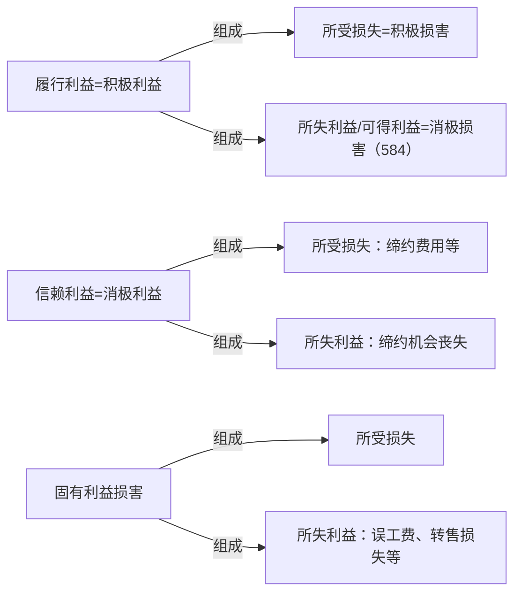

[[债务与普通义务#2.体系]]
前面讲了真正义务和不真正义务的区分，真正义务里面有普通的义务和债务的区分，债务里面还有很多很多区分。

首先，我们主给付义务、从给付义务、附随义务到底是怎么分的，先把它搞清楚。而这个区分建立在最最基本的基础上，就是看债务所保护的利益不同。再说明一下，前面讲了真正的义务保护普通的债务和义务，当我们在讲债务的时候，债的项下的所有义务都是指的债务，只是约定俗称是叫义务，但实际上叫债务，主给付义务/债务。接下去再看，那么，根据这些债务他所它所保护的利益，可以作这样的区分，最最基本的。

给付义务保护的是什么？——给付利益。而附随义务保护什么呢？——保护固有利益。到底是不是全部是保护固有利益，有争议，待会儿会说。但是现在我们要搞清楚，什么叫给付利益，什么叫固有利益。

A 委托 B 买三斤大枣，但买回的大枣是烂的，A 煮来吃了，最后生病了，问，侵犯了 A的什么利益？B 首先是违反了什么利益？——（首先违反的是）针对给付利益的义务，给付利益被侵害了，违反了给付义务了。但这个给付义务的结果导致 A 的人身受伤了。B 没有违反任何一个保护 A 人身安全的义务，没有违反侵犯固有利益的义务，他只违反了给付义务，但是没想到这个义务的违反会导致固有利益的损害，这个类似于叫瑕疵结果损害。一开始这只是个债务履行而已，这个债务履行只是把给付利益给侵害了，在给付利益侵害后续后果上都有害。

>**法工委：区分一般瑕疵履行与加害履行**
履行合同义务不符合约定，即债务人为不当为之事，也就是债务人虽然履行了债务，但其履行不符合约定，包括一般的瑕疵履行和加害履行。一般的瑕疵履行有数量不足、质量不符、履行方法不当、履行地点不当、履行时间不当等多种表现形式。当事人履行合同除有一般瑕疵外，还造成对方当事人的其他财产、人身损害的，为加害履行。加害履行的特征是往往造成违约与侵权行为竞合，例如，甲到乙饭店吃火锅，但乙提供的火锅因为不合格而爆炸，导致甲的人身损失，乙饭店的履行就是加害履行。加害履行也是一种瑕疵履行，故将与其对应的其他瑕疵履行称为一般瑕疵履行。

再举个例子：保管合同也是这种类型，对于寄存人而言，保管合同会带来新的给付利益是一段时间的妥善保管，最后得完璧归赵，最后还不是给付利益，给付利益是一段时间妥善保管好的状态；对保管合同来说，这个合同会带给他的新的利益是什么？——如果是有偿的，是保管费。A 把东西交给 B 保管，然后 B 还给 A，还给 A 的时候，因为东西在 B 那里保管不善，导致这个东西有放射性了，B 也没告诉 A，最后导致 A 受伤。这也是一样的，B 就本应该给 A 一个好的，B 违反了什么义务？——妥善保管的义务。后面导致 A 受伤是不是违反给付义务的后果啊？——这叫瑕疵的结果损害。

再举个例子，A 把一个杯子卖给 B，这个杯子什么都好，就是会爆炸。一个会爆炸的杯子符不符合约定的品质？——不符合，违反了给付义务（给付利益是应该给个好杯子，给个不会爆炸的杯子，但给了个会爆炸的，违反了给付利益，违反了给付义务），但是最后爆炸的结果是什么？——B 的固有利益受到损害了，因违反给付义务会导致固有利益受损害，这不是直接违反了维护固有利益的义务，这个不一样。

给付利益和固有利益一定要和履行利益和信赖利益分开，这是两个完全不同的概念，表述精确一点：履行利益和信赖利益都是因义务违反行为所导致的一个受害状况的差额。举个例子来说，A 交给 B 的杯子会爆炸，问，本来是应该给 B 一个（假设义务完全履行）不会爆炸的好杯子，这是它的完整的给付利益。给它的时候是一个会爆炸的杯子，A 给付义务违反的结果造成了一个 B 本来应该实现的财产状况（好杯子）和现在实际上的财产状况（坏杯子）（这两个杯子价值不一样），从而整体财产受有利益的不一样。本来它预设的是买卖合同履行完了有一个价值 500 的好杯子，结果因为 A 的义务的违反，B 的财产现在是只有一个价值 50 的坏杯子，平白少了 450 块钱，这是一个差别。现在本来有个价值 500 的好杯子是应然财产状况，现在财产中有一个价值 50 块钱的坏杯子是实然财产状况，这个区别是不是 A义务违反造成的？这个差别就是一个损害，这个损害怎么赔（是债务不履行的一个损失），这个要赔到如同合同正常履行的状态，怎么赔到如同合同正常履行的状态呢？——一个可能是修理，修不好换一个（修好，愿给付利益就实现了）；实在不行赔 450 块钱，或者说把破杯子还给 A，这个时候可以要求赔 500。

【（前面没什么争议：修好，原给付利益就实现了，差额就被填平了。唯一可能有差别的是，修好之前一段时间不能用，本来是当天就可以用了，一段时间不能用怎么办？——这个以后再说，至少修好。）赔钱怎么赔啊？——本来应该是 500 块的杯子，现在值 50 块，假设吧还要这个杯子，最简单，赔 450 就完了。但是 B 要给 A 多少钱？——取决于当时买杯子，约定多少钱，假设这个价值 500 的杯子是 420 买的，都做了一个赚钱的买卖。现在问，还要这个杯子，赔多少钱？——现在杯子价值 50，本来是想拿 420 买到一个价值 500 的杯子，现在话 420 买了一个价值 50 的杯子，差额是多少呢？（按数额算个人觉得是 290）——这个实际上叫减价，如果还要这个杯子就是价格减下来，中国有中国的算法，德国有德国的算法，是按比例还是按数额来算。等以后专门讲减价的时候专门讲它。】

现在讲最简单的，不要杯子，A 要赔他多少钱？——本来是想拿 420 买到一个价值 500，现在是一个价值 50 的杯子，现在不要了，问 A 要给 B 多少钱？——这个时候合同正常履行，财产中多多少钱？——出来 420，进去 500，这个时候他本来要赚多少钱？——多 80。现在这个合同 B 不要了，就相当于把 80 给 B 就相当于合同正常履行的状态。这叫履行利益，80，赔到如同合同正常履行的状态。所以，前面那个也是在赔这个差额，但是这个赔的方法不是我们这里讲的，我们现在只讲，这个东西他不要了，可以赔多少钱？——赔到正常履行状态，就赚 80，履行利益是个数字。前面讲的全部忘掉，再说一遍：

给了一个 50 的，B 不要了，A 换不了新的只好不要了。B 现在的财产状况是什么？——420 已经还给 B 了，杯子也还给 A 了，现在 A 是不增不减，但是合同正常履行应该是多少？——80。就记住这个差额就是履行利益啊，前面的铺垫全忘记。

我们根据这个例子来看一下，履行利益指的是什么？——就是因债务不履行所收到的损失，这个损失就是本来财产中应给可以增加多少钱（正常履行是增加 80，现在因为 A 的义务违反导致结果没有增加，就是这个差额），差额怎么赔呢？——赔到如同债务正常履行的状态，什么是债务正常履行的状态呢？——让它增加 80 就到了。履行利益是金钱赔偿的一个数字。

接下去讲给付利益和履行利益的差别。上次课也讲过了，A 要赔 B 这个杯子，B 最喜欢粉红色（约定好买粉红色的杯子），结果 A 却忘了，擅自主张却给了 B 一个黑色的杯子。A 心里觉得 B 用黑色杯子更有魅力，结果 B 很不喜欢，问，本来应该有一个红色的，现在给了个黑色的，履新利益上有没有差别？——没有，两个杯子价值一模一样。但是给付利益上有没有差别？给付利益有没有被侵害？——给付利益被侵害了，因为按照合同约定，应该给B 一个粉红色的杯子。给付利益就是按照原合同描述的那样一点都不能差，那个叫给付利益。换了一个东西，价值一样，不行。而履行利益是干什么？——财产的价值。在这个例子中，履行利益为 0，不能要求赔他钱，陪不了。给付利益被侵害了，B 所有的权利是什么？——给了一个黑色的，本来要求是粉红色的，给付利益仍然被侵害了；但陪不了钱，履行利益仍然是 0，怎么办？——换一个，是瑕疵担保责任中的换一个。请求权基础是§582,“修理、更换”，谁能把黑色杯子修成粉红色的？——所以还是换一个，更换是合理的方式。所以 B 有权要求 A 换一个，这是履行利益。接下去讲信赖利益：![[第三编 合同#^88p22r|民法典582]]

信赖利益是什么呢？A 和 B 签了合同之后，A 明明知道这个杯子会爆炸，A 跟 B 说，“这个杯子是世界上最完美的杯子”，B 相信了。是不是 A 欺诈了？——假设 B 的期待是合理的，（讲民总的时候讲过，信赖不合理能不能构成欺诈？错误的时候信赖必须合理吧？因为错是自己造成的吧？所以它不保护债权人。但是欺诈的时候是 A 很坏，B 很蠢，坏的跟蠢的保护坏的还是保护蠢的？所以这个形象的公式记住就可以了）骗了 B，B 买了这个杯子，买了杯子之后发现这个杯子会爆炸，危害安全，B 就撤销合同，把杯子还给 A。B 是不是因此受到一定的损失啊？会有什么损失？——B 跟 A 谈判磋商打电话，支出电话费 3 毛 5，这也是个损失，不要以为 3 毛 5 就不是损失。第二个，B 上门取货包了车，35，这是不是也亏了？第三个，B 要把杯子给 A 寄回来，运费顺丰 15 块，是不是这都是损失啊？现在问，B 的这些损失能不能向 A 要？——都是因为 A 骗 B 造成的。有观点认为，A 虽然骗了 B，但 B 不撤合同不就行了吗？能不能这么讲？——意思自治是要保护的，撤销是 B 的权利，所以，主要不是因为 B 撤造成了损失，而是 A 骗了 B 之后 B 才撤，撤了就造成了损失。所以这个损失，中间虽然 B 撤了，但是本质上是 A 的错造成的——欺诈，缔约过失了。

现在问，B 的损失怎么证明啊？——如果 A 不骗 B，B 会不会支出这笔钱？A 不骗 B 他会不会买？——根本就不会买，电话费也不会支出，这些小瑕疵我们不管它。接下去呢，打车费会支出吗？寄还给 A 的费用会支出吗？——都不会支出，所以，A 骗 B 的行为，哪些是因为 A 骗 B 而支出的？合计 50 是不是 A 骗 B 支出的？——是的。但是电话费是不是 A 骗 B 支出的？

所以全部的全部都等于说是 A 骗 B 的行为导致 B 的损失，假设 A 不骗 B，B 都不会支出。而这个损失假设要赔，是不是赔到如同 A 没有骗 B 都状态？（如果 A 骗了 B，B 又信赖的话）——这个时候注意一下，这些钱叫信赖利益。为什么叫信赖利益呢？——因为 B 相信会成立一个有效的合同才支出的这些费用，相信会获得这么好的一个给付利益，一个有效的合同会给他这么好的给付利益，所以 B 支出了这笔钱。是不是因为信赖行为有效而支出的成本啊？——【就是】信赖利益。那么义务违反造成的差额是什么呢？——本来如果没有义务违反，B 的财产中没有支出多少钱啊？——没有支出这 50.35，现在财产中支出了这 50.35。也就是说这 50.35 没有带来新的东西，这差额就是信赖利益。要赔他的时候怎么赔呢？——有好多种赔法，现在用钱来赔，怎么赔？——把 50.35 赔了就赔到如同没有义务违反行为时的状态了，A 不骗 B 的状态不就是没有支出这 50.35 的状态吗？——这叫信赖利益。

问，这个 50.35 当时是从 B 固有的财产中支出的还是从他的给付利益支出的？50.35 的来源是不是不属于合同新带给他的利益支出了？是固有利益支出了，为什么这里叫信赖利益，不叫固有利益的侵害？——是不是也从固有财产中支出的？——注意：只要是因为信赖行为成立有效而从固有利益中支出的一笔钱，这个就叫信赖利益。这种固有利益的损害就叫信赖利益，剩下的才叫固有利益了。它是特指固有利益因信赖行为有效而减少的情形。

现在假设，A 因为骗 B，把杯子交给 B，现在这个杯子让 B 受伤了，这个可以撤销，是不是完全有可能啊？现在问题是，B 受有什么样的损害了？——B 撤销了，撤销还应不应该构成给付利益？合同是不是相当于没定过？所以这永远谈不上给付利益的侵害，撤销就是没有给付利益的合同，只有固有利益。这里有两个所谓的固有利益了，一个是不是因为那 50.35因信赖合同有效的固有利益受侵害，这个叫什么？——信赖利益。另外一种是不是 B 的身体被 A 的坏杯子弄伤了？是不是也是固有利益侵害？——这个叫固有利益侵害。不一样的，完全不一样。

所以呢，信赖利益本来就是个固有利益，但是由于它独特的类型而独立出来。接下去，知道了这个原理之后，下面的都要来算钱，会算钱了就了不起了，这是后面损害赔偿的问题。

- 履行利益和信赖利益怎么算，首先把它讲讲：
	- 积极损害和消极损害，所受损失等于积极损害，所失利益等于消极损害。在履行利益中，一般不讲所受损失，是金老师把它拟制为所得损失，便于理解。要么在这里打个引号，“所受损失”=积极损害。这是一个用语的问题，为了概念精确，把所得损失打个引号，真正的所受损失是在其他地方。 ^iklnx3
	- 现在，所有的这些受侵害的利益，它都由两个项目组成，一个项目叫所受损失，一个项目叫所失利益。先从最容易理解的“固有利益讲起”。A 把可怜的 B 打伤了，这个时候打伤了之后，要支出医药费。医药费是不是让 B 固有的财产少了一块，这叫“财产不应减少而减少”，固有财产的减少谓之为所受损失，为积极损害。这是不是 B 的固有财产，本来可以不用支出的呀，支出了是不是固有财产减少了？——这个叫所受损失=积极损害。B 住院期间，本来应在公司上班，因为住院，所以 1 个月的工资没了，是不是有误工费啊，这个误工费属于什么？是不是还是他既有财产？——是他不住院将会获得的财产，这叫所失利益。所以所失利益是什么？——“财产因侵害行为，应增加而未增加”，等于消极损害。所以，一个是“不应减少而减少”（积极损害），另外一个是什么，“应增加而未增加”（所失利益）。工资是他被侵害时当时固有财产范围吗？——不是，是将来给的，这叫所失利益。 ^pizhlb

![[第三编 合同#^vkqgtu|民法典584]]

所以，A 不小心把可怜的 B 的手机撞坏了，手机是不是要修啊？修是不是固有利益的减损啊？是不是“不应减少而减少啊”，它叫什么？——所受损失，等于积极损害。后来查明，如果 A 不把 B 撞坏的话，B 已经把手机卖给 C 了，这个手机价值 300，卖给 C500，本来可以赚 200，现在被 A 撞了，交不了货，合同没了。是不是少了 200 块？——这个 200 块是不是 A 的侵害造成的损失啊？问，侵害的这 200 是不是 B 的财产？——将来可以拿过来，转售的利益，这个时候也叫所失利益，“财产应增加而未增加”。

接下去来看，第二个容易理解的，“履行利益”。履行利益有这两个部分组成，举个例子：A 还是把这个非常好的杯子卖给 B，杯子市场价值 500，卖给 B450，B 买了不是自己用的，B 还把它转卖给了另一位 C，卖 600，一转手，赚钱了。现在 A 违约了，唯一的杯子被 A 砸了，或者弄碎了。A 违约了之后要赔多少钱呢？——第一个，是不是要赔它履行利益？第一个合同正常履行 B 能赚到多少钱？——50。这个是不是 B 必然合同一签订就赚这个钱？——即使 A 不给这个杯子，法律也会给他 500，这个我们把它叫做履行利益中的所受损失。第一个合同中必然会赚到的差价。现在 B 积极的证明自己已经和 C 签了另一个合同了，如果A 不违约，这个杯子会转售给另外一个 C，B 又可以多赚另外一笔钱，价值 500 的杯子在他财产中卖了 600，赚了 100。这个是不是在侵害当时还属于他人的财产被拿进来了？这叫可得利益的、所失利益。这个是不是属于“应增加未增加”？这个时候就叫所失利益、可得利益。记清楚，标准术语叫所失利益，我们国家在履行利益的情形[[第三编 合同#^vkqgtu|民法典584]]把它称为“可得利益”。我们国家把所失利益叫做可得利益，而所失利益等于什么损害？——消极损害。这个概念把它顺起来。

（1）所受损失=不应减少而减少；所失利益=应增加未增加
（2）证明程度不同
（3）履行利益=所受损失+所失利益
（4）Eg：医药费+误工费（或者转售利益） ^t2bglp

也就是说，在这个情形里面，要赔两笔，第一笔合同中的 50 和转售合同中的 100，问，第一个合同中能赚到的 50 和后面转售合同的 100 有什么差别？——举证责任上的差别。就是第一个合同时铁定的已经证明了的，合同违约了，损失的就是没有赚到的钱。而所失利益有的时候具有盖然性的，它不一定能证明到，有的时候，比如在这个例子里是转售，在其他例子里，比方说刚刚讲到的误工费，这个时候没有正常工作，它有没有误工费？今天要工作，明天有没有可能去打工啊？送快递啊？也有可能吧？这种情形在盖然性就可以了，他和必然性不一样。知道有这两笔就可以了，这两笔略有差别。在前面这种情形，肯定合同签订了之后，通过交换的差价一减就能减出来，后面一个呢，它不一定铁定能赚到，有可能赚到，有可能有问题。而且可得利益受到“可预见性”的限制，仅限于“订立合同时可预见的”。所以呢，大致知道一下在履行利益中这两笔不大一样。

第三个，信赖利益。信赖利益也有两笔，一笔叫所受损失及其损害，另一笔叫所失利益消极损害。那前面，A 跟 B 签了合同，B 支出了 50.35，其后撤销，支出的 50.35 是不是缔约费用啊？是不是固有财产的积极减少？（“不应减少而减少”）这叫所受损失。A 跟 B 签合同的时候，本来有个 C 说，同样的这个杯子，A 卖给 B450，但是 C 卖给 B350，B 因为和 A 谈判在先，相信 A 卖给自己。于是果断的拒绝了 C。此时，是不是因 A 骗他，B 相信合同会有效，所以 B 丧失了一个有利可图的缔约机会？如果当时是跟 C 签订的合同，B 的财产是个什么状况？——少付 100 块就能过买回来一个价值一样的东西。这里有一个缔约机会的丧失，这个缔约机会是当时可能多赚 100 块钱的没赚到，这叫缔约机会的丧失。是不是在签订合同的时候，这不属于它既有财产的减少啊？而是一个本来可以进入固有财产的机会被毁了吧？——这叫所失利益。

(1)所受损失=不应减少而减少；所失利益=应增加未增加
(2)信赖利益=所受损失+所失利益
(3)Eg：缔约费用（例如车马费）+本来可以以更低的价格购买（[[履行利益与信赖利益的计算#^t2bglp|对比]]）

所以，这么一类比的话，所有的损害都有两个项目，一个叫所受损失，也叫积极损害；一个叫所失利益，也叫消极损害。

- 履行利益与固有利益：给付不能
	【例1：甲、乙签订机器买卖合同，约定乙以10万元购买甲之机器1台。甲生产／购买该机器的成本为6万元。交货途中，机器因甲过错灭失。问：下列情形中，乙可请求赔偿之金额？
	1．设机器市价为12万元；若机器市价8万元，又如何？
	2．设机器市价12万元，乙乃以一本价值10万元的秘笈与甲互易
	3．设机器市价12万元：乙将该机器转售予丙，售价15万
	（1）现因乙未履行合同，丙解除合同
	（2）现因乙未履行合同，丙解除合同，乙依约向丙负违约金3万元
	（3）现乙为履行合同，从他处购置相同机器，价款10万元／12万元／15万元】
	- 第一个，甲乙签订及其买卖合同，约定以 10w 块购买甲的机器 1 台，甲生产/买这个机器的成本是 6w，交货途中，机器因甲的过错灭失，问，下列情形中乙可以请求赔偿的金额： ^0r0m7z
		- 假设请求赔偿的时候，机器市价是 12w，要赔多少钱？——也就是说，这个时候合同是有效的，合同有效就不会产生信赖利益的问题。只能赔到的正常履行的状况，履行利益的问题。
		- 履行利益现在产生一个问题了，这个履行利益怎么算？——正常履行的财产状况是多少？——乙的财产中，会支出一笔多少钱？——12w。财产中会多一个什么东西？——多的是一个机器，机器值多少钱？——注意，机器的价值始终在变动，今天 12w，明天 13w，后天18w，大后天 8w，以什么时间点为准？——==请求赔偿的时间点为准==（不会像炒股嘛？赔偿数额取决于请求的时间点和市场，买方请求履行利益，如果履行的话货在手里，按市场价增幅算履行利益，==请求时的市场价-订立合同时约定的价款==）。这个时间点就算，以后的都没关系了，只能这样。
		- 现在问，在请求赔偿的时候这个机器在财产中值多少钱？——12w，应然是这个样子，应然的时间点就是出来 10w，进去一个价值 12w，财产中本来应该增加多少？——2w，现在增加没有？——没有。赔多少？——履行利益 2w。甲违约造成了对方“应增加而未增加的”2w。
		- 接下去看，机器的请求赔偿时的市价为 8w，乙说，“机器又没给我”。甲违约了没有？——违约了。乙要求甲赔多少钱？——应然财产状况，合同正常履行应然财产状况是多少？——支出 10w 块钱，买回来一个价值 8w 的机器。正常履行亏了多少？——亏了 2w，亏了2w 是不是要赔钱？——不可以。赔偿损失 0。 没有履行利益，凡是亏本交易都没有履行利益。刚刚这个说法就说明，合同一签订就已经亏了，没有财产上的履行利益了。
		- [[履行利益与信赖利益的计算#^0r0m7z|反过来讲]]，甲的这个机器是因乙的原因而损失的，或者是乙拒绝要货，最后甲解除了合同，现在这里假设乙说，“机器我不要了”，甲说，“你必须得要”，几番下来，但是乙始终不要，甲没耐心了，最后甲说解除。问，甲这里可以得到多少钱？是不是因为乙的义务违反行为导致甲这个合同没了，在机器市价是8w的时候，甲可以要求赔多少钱？正常履行的状况，甲的财产是怎么样子？——会收到 10w，而少了一个机器，少了一个机器值多少钱？请求赔偿的市价是多少？——8w，亏出去一台价值 8w 的机器（注意！不是以自己的成本 6w 来计算），赔 2w。
			- 甲本来就合同就能赚到的钱，我故意把它弄过来，好多都认为是 6w，为什么不能按照6w 来？——它的成本是 6w，但现在这个机器这个 2w 的涨（相对于现在的市价 8w），不是那个合同让它实现的，是合同签订时已经涨了。注意，成本不能放到履行利益的计算，只能按照请求时那个机器的市价来。所以这个时候是按照几 w 算？——按照 8w 算，成本不管它（因为成本机器还在甲手里，卖出去当然不按成本价卖，订立合同时价款10w，可得利润4w，请求赔偿时市价8w，可得利润2w，因为乙的违约甲可得利润少了2w）。
			- 再说一遍，从 6w 到 8w 的这个涨幅是不是合同签订也会涨到 8w？那个不能算作履行利益。反过来，再说一遍，假设现在机器价格是 12w，乙不要了，解除，然后现在，乙赔多少钱？正常履行甲的财产是多少？——收进 10w，出去一台机器市价 12w，甲亏本了（卖方请求履行利益，货物脱手，按脱手的市场价的降幅算履行利益，即如果履行本来能多赚的钱，==订立合同时的市场价-请求时市场价==）。好，履行利益为 0，倒过来要会算。
		- 现在回到正向来，现在回到交付过程中，甲最后没有诚信，乙最后能如期信赖。甲正常履行合同会是什么样子？——乙财产中会出去 10w，进去一台价值 12w 的机器，那么正常履行会赚 2w，在这种情形下给不给？机器市价还是 12w，请求赔偿。但是根据约定的内容，12w 的机器不是拿钱来还，而是给甲一本秘籍，秘籍价值 10w。现在甲把机器弄没了，该赔多少钱？——这时候出现两种算法：
			- 一种算法还是按照差额来算。正常履行的时候是怎么履行呢？——乙财产中突然少了价值10w块钱的秘籍，进去一台价值12w的机器，正常的差额是多少？——乙有权要甲赔2w。这赔 2w 意味着什么？秘籍还需要交给甲不？——秘籍不交了。这个时候甲违约，乙一定想把秘籍给甲呢，怎么说呢？甲违约，为什么乙想给甲秘籍的这个利益会消失啊？秘籍卖出去那是好事啊。所以，为了保护乙的利益，乙有权把秘籍交给甲。如果乙有权把秘籍交给甲，问，甲要赔多少钱？——12w。这个叫交换按照差额来算。实际交换成功来算履行利益，就是按照 12w 来算了。
			- 注意，第一种算法仍然按照差额来，在交换互易的情形，仍然按照 2w 差额来算履行利益，叫差额说。另外一种算法是要求只要乙想把秘籍给甲，甲就得接受。接受下来之后再算履行利益，那就是按照全额来算了，这个叫交换说。
			- 按照差额说，履行利益是多少？——2w。按照交换说，履行利益是多少？——12w。问，这个时候按照差额说来算还是按照交换说来算？谁来决定？——乙来决定。乙如果不想要，就不想再把秘籍交给甲，因为甲的违约，乙可以解除合同。一解除，乙就不会交给甲了，单纯的赔 2w。要是这个秘籍没有人买，买的人甲就是傻瓜，只有甲这个冤大头去买，那么乙把这个秘籍去除有很强烈的利益。这个时候乙就可以选择，乙还是把秘籍交给甲，甲要给 B多少钱？——12w。所以唯一的差别是把秘籍买出去。
			- 这两种算法里面，第一点，这个时候谁来选？——乙。由乙来决定有没有正当利益，决定觉得要把秘籍卖给甲，可以算后面一个。第二个，这两种算法的差别仅在什么情况下有异？——双方交换的给付都不是钱的时候，如果都是钱，第二种算法和第一种就是一样的。其中只要一方的给付是钱，就没用了。再说一遍，交换关系中只要一方的给付是钱，这个交换说就没用了。交换说和差额说产生的结果是一样的。只有双方交换的给付都不是钱的时候，交换说才有用。 #书签
	- 第三个，设这个机器的市价还是 12w，乙把这个机器转售给丙，售价 15w，现在甲交不出机器了，乙能不能履行和丙的合同呢？——也履行不了了。履行不了，丙是不是会解除合同啊？丙单纯的解除合同,其他的什么没有，现在问，乙可以要求赔多少钱？乙这里有没有固有利益的问题啊？有没有导致乙固有的财产中少一块？——没有，只有履行利益，该增加而没有增加的可能。我们再给他看，合同带给他的利益有没有不实现的？现在在第一个合同中，他可以赚多少钱？如果甲正常履行，乙可以赚多少钱？——出来 10w 块，进去一台价值 12w 的机器，赚 2w。第二个合同中能赚多少钱？——3w。第二个合同现在还能实现吗？赚的到吗？——赚不到了，合同被解除了。赚不到谁造成的？——还是甲造成的，所以第二个合同也可以算在甲头上，因为甲的义务违反导致他后面的一个合同中的钱赚不到。前面一个是不是叫[[履行利益与信赖利益的计算#^iklnx3|打引号的所受损失]]啊？2w 块钱，“所受损失”。后面那个是什么？——所失利益，3w。（[[履行利益与信赖利益的计算#^pizhlb|所受损失与所失利益]]）总共可以赔 5w，这 3w 和 5w 都是履行利益哦，后面 3w 还要受到可预见性的规制，这是一个。
		- 现在因为甲交不出机器导致乙也没法向丙交货，现在丙解除了，而且按照合同约定，只要是乙交不出货，要向丙支付违约金 3w，多了一个违约金的规定。现在再看固有利益了：丙的财产中有没有少？是不是固有财产里花出了 3w 块钱啊？——所以这个就不一样了，乙的第一个损失是固有利益中少了 3w（违约金支出），第二个在履行利益里面是看，第一个合同中，它是少赚了多少钱？——第一个合同没赚到吧？少赚了 2 万；第二个合同中也没赚到，3w；加起来一共多少？——8w。也就是说，固有利益和履行利益这两个能不能同时要？——当然可以，这两个完全不矛盾的，当然可以同时要，总共赔 8w。（甲给乙8w，乙给丙3w违约金）
	- 再看，第三种情形。甲没有履行合同，乙交不出货，乙这个时候聪明了，认为不能再等甲交不出货了，乙连忙跑到市场上去买了一台相应的机器，交给了丙。在下面的机器是不是也要支付价款啊？支出价款分别是 10w，12w，15w，问，这个时候这个乙可以向甲要求赔多少钱啊？即使把机器交了，机器交了有没有违约金啊？——没有，固有利益中第一笔没有了。接下去问题是，还有什么损害？——他机器买回来了，相当于原来合同中的给付利益是不是以另外一种方式实现了？一样的机器哦，第一个合同没受影响吧？——好像没受到。第二个合同有没有受影响啊？——第二个合同也履行了。只要机器一买回来，两个合同就都不受影响了。那唯一受影响的是什么？——本来是 10w 块买回这台机器，现在看乙多花 2w 实现了一台同样的机器？（再说一遍，本来是花 10w 就会有一台机器，然后后面两个合同才都实现了，现在是替代交易，看替代交易多少钱实现了后面的利益，差额就在于，原来对应的买价和现在替代交易的买价之间就是这个损失了。而这个损失是固有利益还是履行利益啊？——固有利益。替代交易中替代交易的价格叫替代交易费。
		- 本来是 10w 块就能赚到第一个合同，也能赚到第二个合同。现在甲不给乙机器，乙再买一台，是不是看买的价格是多少实现第一个合同、第二个合同？差别就在于这个差额的内在的差。这个差额，假设替代交易的费用 10w，乙就是同样以 10w 赚到了原来赚到的钱。有没有固有利益的损害？——没有。不需要给。如果支出了 12w，是不是以 12w 实现了原来可以花 10w 实现的利益？是不是固有利益多支出了 2w？——就赔 2w 固有利益损害。如果是 15w 呢？——就是多支出了 5w。所以这里要区分哪些是因合同正常履行的，哪些不是，在这里面，只要把这 5w 赔了，实际上他后面的一切利益都实现了，就是这个道理。
		- 是一个因合同新增加的一种形态。而信赖利益和固有利益侵害的都是什么？和给付利益相比都是侵犯固有利益的，只是这个固有利益的侵害是因为什么原因被侵害的？——信赖合同有效而被侵害的，而这个是进行其他被侵害的。对于侵害客体来讲，这两个都是固有利益的侵害。而这个履行利益是给付利益的侵害。
	- 接下去看，在固有利益被侵害的结果上又分成两项，一个项目叫所受损失，就是当时的固有财产中直接被减少了；第二个叫所失利益，当时财产中没减少，应增加未增加。可能会有疑问，“应增加而未增加怎么能叫固有利益呢？”——这个时候要注意，因为它侵害的是固有利益，这都是因固有利益受到的损害。这是两个不同的事情。所以，这个时候所失利益注意一下，它属于因侵害固有利益所造成的财产应增加而未增加，也属于固有利益损害。
	- 两个不矛盾，这是从侵害客体上来讲的。
		- 所受损失=不应减少而减少；所失利益=应增加未增加
		- 固有利益被侵害=所受损失+所失利益
		- Eg：替代交易费的多余支出（或第二次交易的违约金）+？
	- 第二个，刚刚只算了固有利益的侵害。替代交易的内容支出了一笔；本来正常要实现都可以赚到一笔钱？现在替代交易要实现，同样要花一笔钱，固有利益损失多少？是不是替代交易费用减去买价，10w 减 10w，固有利益为 0，不需要赔了。如果是 12w，12w 多支出 2w；多支出 5w，都是固有利益，要赔。但是本案中，乙还可不可以向甲要求履行利益的损害要求赔偿？——当然可以。说过同样的利益不可以要求赔，多花的钱才是。
	- 所以乙这个时候可以要求甲赔偿履行利益，可以要求赔多少？——正常履行第一个合同赔多少钱？——2w，第二个合同赔多少钱？——3w。这两项都没赚到。所以呢，履行利益赔 5w，固有利益取决于它价格，替代交易的价格。如果是 10w，固有利益损失是 0，加上履行利益 5，总共赔 5。如果 12w 买的，固有利益是多少？——2w；再加履行利益多少？5w。总共就是 7w。如果是 15w 买的，固有利益损失多少？——5w，另一个也是 5w，赔 10w。

- 履行利益与固有利益：给付迟延
	【例2：甲、乙6月1日签订机器买卖合同，约定乙以10万元购买甲之机器1台。9月1日交货。甲生产／购买该机器的成本为6万元，后甲届期未履行，乙致电限其9月11日前须交货，甲仍未履行。设乙请求甲赔偿损害时，机器市价为12万元。问：下列情形中，乙可请求赔偿之金额？
	1．设甲乙缔约后，乙将该机器转售于丙，售价15万元，9月15日交货。现因甲未及时履行，乙未能向丙履行合同，须向丙支付违约金3万元。
	（1）丙未解除合同，故乙请求甲继续履行，并赔偿损害
	（2）丙未解除合同，故乙从他处购置相间机器，价款10万元／12万元／15万元，请求甲损害赔偿
	（3）丙解除合同，乙解除与甲的合同，并请求甲损害赔偿】
	- 接下去再看：甲乙 6 月 1 号签订了买卖合同，约定还是一样的，10 万买机器一台，9.1交货。甲声称购买这个机器的成本是 6w，后来甲没有及时履行，乙催告他还是不履行。下面第一种情形：乙当时早就把机器转售给丙了，售价 15w，9 月 15 日交货。现在因为甲没有正式履行，乙是不是也不能及时交给丙？因此向丙支出了违约金 3w。这是不是甲迟给造成的？没有及时交货，对不对？——第一种情形，乙没有解除合同，乙要求甲继续交货。丙要求乙继续交货，丙会怎样？丙会不会要求甲继续交货？——他请求甲继续交货。除此之外，叫赔偿损失。当乙请求甲继续交货的时候，这个赔偿的金额是多少？——还是一样的，先看固有利益，再看履行利益。
	- 固有利益，现在因为甲的违约行为，乙遭受了怎么样的损失啊？——违约金 3w，固有利益 3w 一定是可以要求他赔的。如果这个违约金规定的太多怎么办？——这个时候就用可预见性来限制它。签约的时候预见没那么大，不公平，赔到一个合理的损失，法官酌情处理。现在不讲这个，至少 3w 块合理，合理就赔，它固有利益的损害。
	- 履行利益要不要赔？有没有履行利益？要不要赔？因为这个时候乙是要求甲继续履行了，继续履行两个合同中能赚到的钱都能赚到，履行利益未受影响。所以在这里面，要求继续履行的，履行利益在这里没有了。只需要赔违约的损害，固有利益的损害赔了就没了。
	- 注意一下，这个损害赔偿跟前面的损害赔偿有没有不一样啊？前面那个甲把机器弄没了，弄没了机器是不是都要不到了？要赔的时候就要求同时要赔履行利益，机器要不到了。只有前面那些损害赔偿叫替代给付的损害赔偿。是不是把原给付给替代掉了赔钱啊？这里是不是既要求履行，又要求赔偿损害？这叫给付并行的损害赔偿。与给付并行的损害赔偿。
	- 现在，丙没有解除合同，意味着乙要继续向他给货这个时候赔多少钱啊？先看固有利益，第一笔违约金，要交吗？——因为已经出了违约，现在要交付了之后，乙迟延了吧？再转交机器的，是不是固有利益 3w 块已经支出了？第二笔固有利益是什么？这个违约金是所受损失还是所失利益啊？——所受损失。所失利益是特别讲的。第二笔固有利益是不是替代交易的费用和原来买价之间的差额？——假设是 10w，第二笔固有利益的损害就是 0，如果替代交易的价格是 12w 就是 2w，15w 就是 5w。假设这里是 15w，那就是第二笔损失是 5w。履行利益是多少？原来甲正常履行，乙能赚多少钱？——第一个合同是赚 2w，第二个合同呢？——第二个合同是赚 3w。那这个钱要不要给呢？——是不是现在多花了一些钱来实现能赚同样的钱啊？应该还是要赔的。多花了 5w 来实现同样的利润，所以多花的钱要赔，原来的利润也要赔。原来能赚多少钱啊？——原来能赚 5w，第一个要赔 3 万，乙要赔了。
	- 第三个，丙直接解除合同了，丙解除了，乙也解除了和甲的合同，并请求甲损害赔偿。赔多少钱？——（1）固有利益。是不是 3w？没有替代交易，固有利益就是 3w。正常履行和甲的合同，本来能赚多少钱？合同一有 2w，合同二是 3w。合同一没赚到，被解除了，要赔吧？合同二赚到没有？——也没赚到。所以还是要赔 3w+5w（固有利益 3w，履行利益5w）。

- 履行利益与固有利益：给付迟延
	【例2：甲、乙6月1日签订机器买卖合同，约定乙以10万元购买甲之机器1台，9月1日交货。甲生产／购买该机器的成本为6万元。后甲届期未履行，乙致电限其9月11日前须交货，甲仍未履行。设乙清求甲赔偿损害时，机器市价为12万元。问：下列情形中，乙可请求赔偿之金额？
	2．设乙未转售，却因此停工。后乙从他处购置相同机器，价款12万；其停工期间，支出工资、租金等费用共2万元，丧失正常利润3万元】
	- 第二种情形来了，同样是下面的例子：乙没有转售，但因此停工了。乙不是拿机器来卖的，乙是拿机器来生产的。甲的机器一直不给，导致乙停工了。停工期间，乙是怎么干的呢？因为甲不给了，其他地方去买一台机器，因此还是有停工。其他地方买的是 12w；停工期间支出了多少呢？——工资、厂房的租金，都是停工要付的，付了 2w。丧失不停工能正常赚到的钱 3w，这个时候怎么赔？——（1）当乙从其他地方买到的机器，甲还能不能对乙说，“现在我有机器了，我给你”。乙要不要接受？只要乙有权从其他地方去买这台机器，替代交易成立了，意味着乙同时有权不要加给他这个机器了。所以叫有权的替代交易必然会符合不要甲的给付内容。而乙不要甲的给付，有两种可能，一种可能是他有解除的可能；什么时候乙再去买一台机器是合理的？——乙可以解除和甲的合同了，这意味着他可以不要甲的给付了。第二种情形是，乙可以向甲主张替代给付的损害赔偿了。替代给付的损害赔偿是不是意味着他可以不要这个给付了？那么这个要件是什么，待会儿讲解除的时候可以讲到。通常要求严重的违约才可以，本案中已经可以了。所以乙从其他地方可以购买意味着什么？再说一遍，乙有权从其他地方做替代交易，意味着什么？——乙已经可以解除和甲的合同了，或者乙可以向甲主张替代给付的损害赔偿。这个逻辑一定要串起来，一开始可能有点烦，最后都是通的。

所受损失=不应减少而减少；所失利益=应增加未增加
固有利益被侵害=所受损失+所失利益
Eg：替代交易费的多余支出（或第二次交易的违约金）+？不停工丧失本能赚到的钱