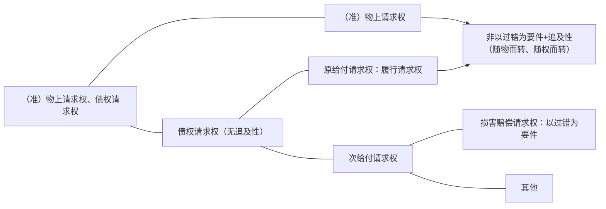
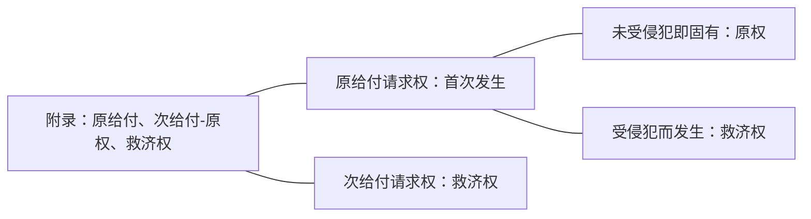
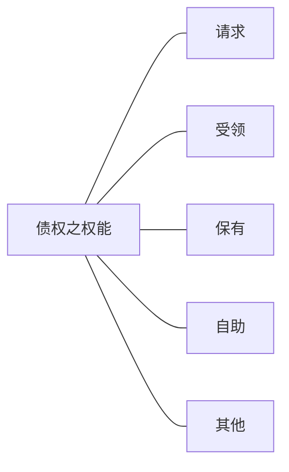

# 第一章 民事权利及相关现象
## 第一节 民事权利概述
### 一、概述
#### （一）概念：使主体得享受特定利益的法律上之力
#### （二）机能：定分止争、保障自由
#### （三）主观权利与客观法（详下附录）
>**附录：主观权利与客观法之语源**
Lex --ius
Loi--droit → droit subjectif/droit objectif
Gesetz-Recht→ subjektives Recht/objektives Recht
制定法一法/权利： （~~主观~~）权利/（~~客观~~）法律

古罗马有两个词，"Lex"和"ius"，"Lex"指掌握国家权力的主体所制定的法律，比如东罗马某一皇帝颁布了一部法律，就是这里的"Lex"，指的是某一国家所颁布的制定法、实证法；"ius"指自然法意义上的法，就是一种人类理性中的正当性，天经地义的法，又指个人权利。

法语中，"Loi"和"Lex"一样，指国家制定的法、实证法；"droit"一则指自然法意义上的法，二指个人享有的权利，当法国人讲权利的时候，用"droit subjectif"（主观意义上的"droit"），当法国人讲自然法的时候，用"droit objectif"（客观意义上的"droit"）。

德语中，"Gesetz"同样是制定法、实证法意义上的法；"Recht"既有自然法意义上的法律的意思，也有个人权利的意思，讲权利的时候用"subjektives Recht"（主观意义上的"Recht"），讲自然法的时候用"objektives Recht"（客观意义上的"Recht"）。
#### （四）为权利而斗争：对个人与社会之意义（耶林）
### 二、权利的本质
#### （一）意思说（温特夏德）
#### （二）利益说（耶林）
#### （三）法力说 （梅克尔）
#### （四）通说：利益说+法力说
### 三、类似概念之区分
#### （一）公权力（power）、公权利（right） 
"power"指国家政府及其机构的一种管理统治的职权，是一种命令性的权力，受公权力统治或公权力指向的对象对它具有服从的义务，无论这个对象是自然人还是它的下级机构；"right"指个人享有的公法上的权利，比如诉权、选举权和被选举权、通讯自由、集会自由，是公民在公法上享有的一种权利。

"right"的功能在于，凡是规定"right"的条文，其所指向的对象，比如民法上所有权规定“所有人对物有占有、使用、收益、处分”的权利，这个条文是对其他的平等主体在说，不能用“公民”来代替“平等主体”的说法，“公民”是公法术语，民法上讲的是自然人、法人、非法人组织，宪法13条第1款规定“公民的合法的私有财产不受侵犯。”的受众是公权力的掌握者，是对国家说的，对国家表达两层含义：其一，国家，私有财产不受侵犯，所以你不能侵犯我，为公权力的第一层含义-防御权；其二，国家，私有财产不受侵犯，所以你在立法、行政、司法、外交事务中都要尽到保护我私有财产的义务，为公权力的第二层含义-保护权。正因为第二层含义，国家制定了“物权编”、《知识产权法》等来落实宪法第13条第1款的保护义务，在行政权的行使中，也要贯彻对于物权、债权、知识产权的保护。
#### （二）自由：要约权？立遗嘱权？
金可可想卖书，可否向张三发出要约？当然有了，金可可有无要约权？金可可也可以立遗嘱，有无立遗嘱权？
表面上看是金可可有要约权，实际上所有人都可以向张三发要约，成为民法上所称的权利一定是有人可以做而有人不可以做，具有排他归属的才叫权利，如果一切人都可以做的叫自由而不是权利，“要约权”的概念不成立，而是每个人都有的要约自由，同样，每个人都可以立遗嘱，谈不上立遗嘱权，反过来，金可可对他的房子享有所有权，只是金可可有，这就是所有权，再比如生命权，你对你的生命有生命权，别人对你的生命没有生命权。

其实所有的权利都可以归纳入人身自由，不过有的权利被纳入物权，比如金可可有一本书，金可可要看书，有个人过来抓住金可可的手不让其看书，侵犯了所有权中的使用权能，这个时候已经不说侵犯人身自由了，而已经落实为物权了，行使物权的自由被侵犯了，也有的权利被纳入债权，比如金可可对张三有一个债权，上门取货，有个人为了不让金可可行使债权，路上阻碍金可可，这是侵犯金可可的人身自由，但已经落实为债权了，主要成为了妨碍行使债权的一种形态了，有的时候会和侵犯人身自由竞合。

立遗嘱没有被法律固定为一种具体的权利，所以还是属于自由的范畴。

路边有野花，某甲有没有权利采野花？有权。有无先占权？无先占权，因为每个人都能采，所以叫先占的自由。但是是有“先占权”这种具体权利的，比如某人就一片山林取得狩猎权、某人就一片河流取得捕捞权，这是国家特许的，这是通过各种各样的方式先占动物，这是排他的先占（至少是有一部分人不能做），为具体的先占权。
#### （三）（法律所保护之）利益（Interesse/interest) 
##### 1.反射利益：未落实为民法权利
遵守交通规则是法律的一个规定，作为一个法律规定，金可可看到一个人不遵守法律规定，乱闯红灯，金可可有没有权利阻止他？金可可说“我可以阻止他，因为交通规则的遵守涉及每个人的利益，所以我看到有人不遵守交通规则，我有权阻止他，否则交通一塌糊涂，我的利益也将受到侵害，我的安全也得不到保障。”如果按照这个逻辑，那么人人都可以去执法，若是人人都执法，那么到底有没有遵守规则这个判断的过程得不到保障，社会的秩序反而会因此而混乱，反而不利于交通秩序，遵守交通规则的法律规定首先是为了公共的利益而不是个人的利益，首先指向的是公共的秩序，尽管因为公共秩序维护好了，每一个具体的人都会因此而受有反射利益，但此种利益并非法条直接规制的目的。

反射利益即法条的目的不在于给你这个利益，而在于公共秩序，间接给你的利益，反射利益没有直接落实为民法上一个个人所享有的利益，有一个人违法了，不构成侵权，因为这不是你的主观权利。个人不能执法，有关的职权机关才能执法。个人违法了，其他人有权要求公权力机关执法。比如控烟条例。

与条文不一致的是反射利益，但是因为反射利益对应条文的违反直接导致权利被侵害，还是可能认定为侵权的，例如某甲不遵守交通规则，是反射利益，但因为违反交通规则撞伤了某乙，乙的身体权、健康权受侵害，当然构成侵权。[响水爆炸案](https://baike.baidu.com/item/3%C2%B721%E5%93%8D%E6%B0%B4%E5%8C%96%E5%B7%A5%E4%BC%81%E4%B8%9A%E7%88%86%E7%82%B8%E4%BA%8B%E6%95%85/23365231?fr=aladdin)，尽管规定生产安全的法条主要不在于保护一个一个的个人的具体权益，但是因为其违规操作，最后导致爆炸，导致很多人的房子损坏、甚至死去，是因为违反反射利益规定的法条导致他人具体权利的侵害，当然仍然构成侵权。
##### 2.人格利益/身份利益：人格权/身份权之客体
##### 3.债法上出现的利益
###### 契约法
给付利益：给付原定实现之利益，非既有
固有利益：非因给付所生、既有
###### 损害赔偿之范围
履行利益=正常履行之应然财产状况-实然财产状况
信赖利益=未缔约之应然财产状况-实然财产状况
###### 侵权法
权利：边界清晰，保护要件低
利益：边界不清晰，保护要件高
#### （四）权能（Befugnis）：具体内容
[[第二编 物权#^tq1zqo|民法典240]]在讲所有权，但所有权的具体内容即所谓权能。

[[中华人民共和国著作权法#^f7e37x|著作权法10]]讲著作权的权能。

有时候法条对于权能的列举不是完全的，比如金可可对一本书享有所有权，法条列举了有“占有、使用、收益、处分”四个权能，如果金可可把这本书出租给了甲，占有、使用的权能金可可暂时没有了，同时金可可又把这本书抵押给了乙，金可可也没有了处分权和收益权（民法典之前的规定是如此的），四项列举权能全部不在，但所有权依旧在金可可这里，所有权最大的一个权能名为“剩余获取权能”，四项列举权能在租赁、抵押消灭后都会回到金可可这里，这种权利回归又称为所有权的弹力性。
#### （五）权限（Zuständigkeit）
权限有两层含义，其一为职权机关的职权范围，比如疫情期间到底哪些主体有权发布疫情信息，如果认为中疾控有发布的权力，那么发布的权限就在中疾控，如果认为中疾控有收集和上报信息的权力而无权上报，那么中疾控就有收集和上报的权限而无发布的权限，即发布信息的内容是不是中级疾控的权力范围就是权限，属于则在权限范围内，不属于则在权限范围外。其二为民法上所说的权限，即[[民事权利与义务#^rwq4l2|受领权限]]。

> 受领权限
	>1. 意思表示：到达于何人可生效，到达了有受领权限的人，意思表示生效，到达无受领权限的人，到达也不生效。意思表示的受领权限的例外，比如要约人丧失行为能力，到达法定代理人承诺生效，再如法人破产后，其发出的要约的承诺的受领权限人为破产管理人。
	>2. 给付：向何人给付可消灭债务，给付是债权的客体，向有受领权限的人给付可以消灭债务，向没有受领权限的人给付不消灭债务。
	>>1.非债权人例外有受领权限，例如甲和乙签了某书的买卖合同，乙签完就丧失了行为能力，甲仍然向无行为能力之乙完成了书的交付，此时债务没有消灭，因为乙丧失了行为能力，即便其是债权人也没有受领权限，受领权限归乙的监护人，监护人虽非债权人，但此时例外的有了受领权限。
	>>2.此外，乙若授予受领权限予丙，丙也有受领权限，也是非债权人有受领权限的例外。
	>>3.注意，债权的继承是受领权限与债权一同继承，并非例外。 ^rwq4l2
#### （六）取得之期待：期待法律地位→期待权
期待法律地位不属于民法上的权利，而期待权属于民法上的权利。
#### （七）非属私权利之私权力（Macht／power）
私权力
享有利益→私权利 
不享有利益：非属私权利

监护权、形成权是不是民法上的right？监护权不是民事权利，这就要看回民事权利的定义了，权利是法律保护主体特定利益的法律上之力，金可可对儿子享有监护权，金可可并不因此而自己有利益，监护权完全是为了金可可之子的利益，相反反而是种负担（义务），是一种power，金可可对儿子有命令权，儿子有服从的义务，就这种power的行使本身金可可没有自己的利益，法律上给金可可监护权不是为了金可可享有利益，而是让金可可的儿子享有利益，不属于right，这种power叫作私权力。
抵销权、解除权，甲把书卖给乙，签了合同，按照约定，乙3天前应该给甲钱了，但一直没给，甲催告，乙未作回应，合理期间经过，甲通知乙解除合同，乙答复不同意解除，乙的不同意无效（[[第三编 合同#^xse0f1|民法典563（三）]]），支付价款是主要债务，甲也已经催告过了，合理期限经过后甲有解除权，乙的不同意无用，解除权为形成权，意思表示已经到达乙处，合同即已经消灭，形成权是power，但是这个power是为了让解除权人甲享有利益，这个power虽然是power，但是系为使主体享有特定利益，所以是私法上的right。
哪怕是个power，只要让主体享有利益了，那就是right，如果power不是为了给权利主体利益的，那就不能叫作right，只能叫作power。
金可可有一本书，可以自己卖也可以授权他人代理其卖书，于是金可可找了张三代理其卖书，以金可可的名义卖书，即张三向李四卖书，需要言明是替金可可卖书，书的买卖合同在金可可和李四之间生效，当事人是金可可，也可以让张三以自己的名义来卖书（非代理的方式），李四会认为当事人是张三。受托人帮委托人办事，可以有两种基本的架构，其一为以代理人的方式去做（符合显名原则、公开原则），其二为以自己的名义去做（不符合显名原则的代理人虽然有代理权，但其所做的行为是自己行为），自己行为下前的买卖合同归属于代理人而不是本人，是为了保护相对人对缔约当事人的信赖。问在显名情况下，代理人行使的代理权是power还是right？代理权的授予是为了本人的利益，所以代理人的代理权是power不是right，即便代理人收费，也不是基于代理权，而是基于委托合同，是有偿委托的问题。
## 第二节 民事权利之分类
### 一、财产权、人身权、中间型权利（按客体）
#### （一）财产权
#### （二）人身权
#### （三）中间型权利
##### 权能中兼有两者
比如著作权的署名权和发表权是没有经济利益的，为非财产性权利，而出版权、许可使用权是财产性的权利。
##### 基础与内容分属两者
### 二、支配权、请求权、抗辩权、形成权：乃某一具体权利之作用
#### （一）支配权
##### 1.权利之法定内容：支配→客体
金可可有一个杯子，金可可对这个杯子的权利的法定预设内容为金可可对这个杯子可以占有、使用、收益、处分，权利的客体即金可可可以对这个杯子做什么。
###### （1）客体性：权利人直接支配其客体
客体即上例的杯子。
###### （2）单方性→正常/应然实现方式：无需他人意思协作，可单方实现
即按照立法者预设的应然的实现方式，金可可对杯子的支配（占有、使用、收益、处分）无需他人的配合，单方即可实现。
##### 2.辨析：支配权之保护→请求权
比如张三抢走了金可可的杯子，金可可仍然是物权人，为了保护金可可的物权，法律上规定了基于物权人的地位的返还占有的请求权（[[第二编 物权#^axo3xh|民法典235]]），这个请求权叫所有物返还请求权%%原物返还请求权%%，为保护物权，这个支配权被配上了一个请求权，但并不因为请求权物权就变成了请求权，因为按照立法者的预设，物权的行使是单方的支配，只是异态的情形下加上请求权。 ^z4ztuc

[[第二编 物权#^khsx8p|民法典462]]，金可可占有了这个杯子，被张三侵占%%侵夺%%了，占有物返还请求权发生了，反之，若是金可可主动把杯子给了张三，金可可没有占有物返还请求权，因为没有侵占%%侵夺%%，金可可把杯子拉在张三家，对张三有原物返还请求权%%所有物返还请求权%%，张三为无权占有人。在杯子被抢走的情况下即有所有物返还请求权也有占有返还请求权，在杯子被拉在张三家时，只有原物返还请求权。本案还有不当得利请求权，张三占有杯子没有合法的根据，金可可对张三有不当得利返还请求权（对于占有的利益不当得利），不当得利请求权的客体是返还杯子的占有，因为张三并未获得杯子的所有权（[[第三编 合同#^el18x2|民法典985]]），为非给付型不当得利（侵害权益型不当得利）。 ^rk4tyn

占有为何为利益，例如甲对杯子有所有权，杯子丢了，被乙抢走，现在甲要把杯子卖给丙，原价5元卖2元，乙也不一定要，因为占有能不能取回还不知道，但是乙2元卖杯子给丙，丙反而愿意，因为杯子在乙那儿，占有本身能决定物权的价值，即便没有物权，占有也可以具备价值，比如比较法上的公然、和平、持续占有满一定期限获得所有权，并且比如甲委托乙保管杯子，乙卖给丙，丙是有可能善意取得的，占有人没有所有权，但可以凭借此法律地位剥夺所有权人的所有权。 ^wqo9dx

乙抢走甲的杯子，侵犯了甲对杯子的物权，虽然没有把物权弄没，但是物权肯定被侵害了，乙因过错侵害甲的民事权益，应当承担侵权责任，依照[[第七编 侵权责任#^0jplgg|民法典1165]]、[[第一编 总则#^dot2gb|民法典179（四）]]返还杯子。 ^1epchj

虽然乙对甲有所有物返还请求权、占有物返还请求权、侵权上的返还请求权、不当得利之占有返还请求权，但只能请求一次，为请求权竞合。

因妨害或侵害支配权所生请求权不妨碍支配权的性质。

物权、知识产权、人格权皆为支配权，身份权%%亲属权%%不是支配权。比较法上德国不把人格权作为支配权，承袭了康德的理念，人因为有尊严，所以人永远不能成为权利的客体，所以哪怕人对于人格是可以自主的、有单方性的，也不叫支配权，不是从技术层面否定，而是从意识形态上否定，所以实质上还是有支配性。
#### （二）请求权
##### 1.概念：权利人要求他人为特定行为（作为、不作为）%%给付%%之权利
金可可有一部手机，和张三签订手机买卖合同。

张三对金可可的债权的内容有两项请求权：（1）请求交付手机；（2）移转标的物手机的所有权。（[[第三编 合同#^ut8m6i|民法典598]]）

金可可对张三的请求权：支付价款。（[[第三编 合同#^an1kf7|民法典626第1句]]）

张三对金可可的债权的特点：约定好金可可今天中午交手机，但金可可就是不交，把手机放在家里，张三催促金可可交付手机，张三不能直接闯进金可可的家中取走手机，这不是张三债权的正当权利内容，立法者给张三的正当权利内容是张三只能请求金可可交付手机并移转所有权，张三可以催告金可可也可以请律师催告金可可，但绝对不能自己拿，如果权能中包含了可以直接拿走，债权就变成支配权了。那么金可可任凭张三如何请求就是不履行交付并移转所有权的义务怎么办？张三可以起诉至法院强制执行该手机买卖合同。
金可可的手机拿在手上，张三可以抢走吗？虽然金可可应该交付手机，但张三不能抢走手机，理由同上。

金可可把手机装在口袋里，不小心把手机掉在地上了，张三能把手机抢走吗？理由同上，抢走就是侵权，金可可仍然可以基于占有返还请求权或者原物返还请求权要回手机。

金可可手机不小心掉在地上，金可可不知道直接走了，这时候张三看到了，捡起了手机，张三可以捡起来，张三可以捡手机不来源于债权，可以捡并不意味着债权变成了支配权，“可以捡”是因为法律上规定的遗失物的拾得，别人的东西没有经过别人的同意，通常而言拿起来就是违法的，但如果是捡别人遗失的东西，目的是为了归还失主，则是“有权”捡，不是为了归还而捡是“无权”捡，但这里的“有权”和“无权”本质上不是权利（非right），只是一种[[民事权利与义务#（二）自由：要约权？立遗嘱权？|自由]]，“有权”是指当你是为归还失主而捡时，你碰到这本书时构成无因管理排除违法性，并且为物归原主所支出的必要费用可以要求所有人返还，比如坐公交车送过去所支付的金钱，在所有人发出悬赏广告时，在送还之后还有悬赏广告上的奖励的请求权。（[[第二编 物权#^lfdx6t|民法典314]]、[[第二编 物权#^i7samd|民法典317]]），在[[第二编 物权#^i7samd|民法典317]]的侵占情形（包括拾得时就是为了侵占），不仅不构成无因管理，还构成侵权，金可可可以主张侵权损害赔偿。 ^kkb6uw

手机买卖合同签订后，张三一直请求金可可交付手机，金可可表示绝对不交付，要他想要自己去法院起诉，金可可怒从心头起，恶从胆边生，把手机扔到湖里，在金可可将扔未扔之际，张三可否把手机抢走？张三有无权利抢走手机？此种情形张三是可以抢手机的，也不需要在手机脱手的一瞬间才能抢（此时有紧急性，手机一落入湖中，就无法实现请求权了，至少不能对这个手机请求），此时可以抢并不意味着债权变为支配权，这种抢的权利确实源于债权，同[[民事权利与义务#^kkb6uw|遗失物拾得的情形]]不一样，基于[[第七编 侵权责任#^z3fvw0|民法典1177]]的债权的权能中的自助行为，张三绝不能绕过请求权的行使而直接支配标的物，实现请求权不能则必须通过去法院起诉救济（请求不成，请求公力救济），允许自己抢则为私力救济（自力救济），一个现代的国家救济自己权利的方式原则是公力救济，因为自力救济会导致每个人的安全受到威胁，法秩序的前提是把行使暴力的权力都垄断在一个国家手里（社会契约论，相当于国家全部的人都把行使暴力的权力让渡给国家，由国家代替行使，保证每个人不至于受到他人非法暴力的侵害），但是在紧急的情况下例外的允许自力救济，即来不及请求公力救济介入的时候，主要在正当防卫、紧急避险[^1]、自助行为三种情形，本案情形即[[权利的自力救济#三、自助行为|自助行为]]，自助行为的行使遵循比例原则，其一措施要合理，扣留物品可以保全请求权则不得毁损，对物采取措施可以达到目的则不能限制他人人身自由，其二程度要合理，扣留一辆车可以保全请求权不得扣留两辆，且自助行为具有临时性，比如扣留汽车不能一直扣下去，要立即诉诸公力救济。这里的权利同样也不是right，而是违法阻却，即“可以”。自助行为需要同时满足五个条件始发生阻却违法的效果：权利性、必要性、紧急性、合理性、临时性。自助行为并没有使得请求权转变为支配权，虽然表面上看是对物的支配（也不是支配，不能处分物，控制物后需要立即诉诸公力救济），但这是在极端的情形下对请求权的保全，不是债权的应然实现方式，按照立法者的立法，债权的应然实现方式是请求，异态不能代表常态。

[^1]:正当防卫和紧急避险同属于自卫行为。

##### 2.特征
###### （1）权利之法定内容：无支配性→请求
###### （2）权利之正常/应然实现方式：他方之协作
>辨析：期前自愿履行，强制履行，自助行为
>期前自愿履行：金可可和张三签订手机买卖合同，在合同约定交付手机前三天主动把手机给了张三，张三拿到手机，张三的债权实现，张三虽然没有请求交付手机并移转所有权，说债权是请求权只是说债权的正常实现方式为请求，并不排除未经请求而实现债权。
>强制履行：金可可一直不履行交付义务，张三起诉，法院强制执行，未经金可可的协作，这是债权实现的异态，权利实现的异态不影响债券的请求权性质。

##### 3.请求权之基础权利（母权）：各种具体权利
###### （1）依基础权利之请求权分类
比如金可可的杯子被张三抢走了，引起了原物返还请求权的发生，该请求权的母权（基础权利）为物权（中的所有权），母权即引发请求权的权利。（[[第二编 物权#^axo3xh|民法典235]]）

[[第二编 物权#^khsx8p|民法典462]]保护的客体是占有，没有物权的人的占有也受此条文保护，占有物返还请求权的基础是占有，但这里说占有是基础权利就不精确了，因为占有不是权利，所以说请求权基础为占有而不是基础权利。

金可可还可以根据[[第三编 合同#^el18x2|民法典985]]主张[[民事权利与义务#^rk4tyn|不当得利请求权]]（[[民事权利与义务#^wqo9dx|占有为何为利益]]），这个不当得利请求权的基础权利为债权，不当得利之债为法定之债，同样是物权受侵害，基于不当得利的请求权的母权利为何为债权？对于物权的侵犯没有引发债，那么母权利就是物权，对于物权的侵犯引发债了，那么母权利就是债权（因为构成不当得利中间隔了一个债），这是物权的逻辑所决定的。

金可可对于张三还有侵权上的请求权，请求权的内容是要求返还财产（[[第七编 侵权责任#^0jplgg|民法典1165]]、[[第一编 总则#^dot2gb|民法典179（四）]]），这个请求权是侵犯物权的结果，母权利是债权，侵权行为产生的是债，无逻辑可讲，法学发展一开始的界定就是如此界定，是结论先行的。

根据手机买卖合同，金可可可以要求张三支付手机价款，张三可以要求金可可交付手机并移转所有权，这两个请求权的母权利是债权。金可可该给手机而不给，张三向金可可主张违约责任要求赔偿迟延履行的损失，请求权基础为[[第三编 合同#^pqlryz|民法典577]]（这是不精确的说法），这个请求权的母权利是债权。

有个人把金可可打伤了，金可可因此支出医药费71元，金可可有权要求赔偿（因为侵犯人格权），该请求权的母权利是债权而非人格权，因为是侵权行为引发的债。侵犯知识产权也是同理。

>怎样界定这个请求权是债权请求权还是非债权请求权？
[[第一编 总则#^rhkwya|民法典118II]]
![[债权之瑕疵]]
张三停车不小心停在金可可的车位上，金可可有权让张三把车开走，这个请求权是物权请求权，基于[[第二编 物权#^6wqo6p|民法典236]]排除妨害请求权。
债权在正常的情形下[[民事权利与义务#（四）权能（Befugnis）：具体内容|权能]]为请求，但其权能[[民事权利与义务#（四）权能（Befugnis）：具体内容|权能]]不限于请求（虽然[[第一编 总则#^rhkwya|民法典118II]]将债权定义为请求权），金可可把手机卖给张三，交付给张三，张三拿走手机，这是受领的权能，张三拿到手机后，张三的债权消灭，因为金可可向一个正确的有[[民事权利与义务#^rwq4l2|受领权限]]的人进行了给付，问题来了，张三债权消灭后，金可可并不能对张三说“你债权消灭了，把手机还给我，你不当得利”，因为张三有保有的权能，保有权能排除不当得利，请求权能不是占有手机法律上的原因，保有权能才是占有手机法律上的原因，所以有了债权的本质到底是请求还是保有的争论，债权的权能在特定情形下有可能是自助，即保全自己的权利，图中的“其他”比如根本违约导致的解除权。债权的权能有很多，请求权只是最能反映债权特点的一个权能。
###### （2）母权与请求权之关系
>不用请求权之权利：形成权——原因？

>基础知识：物上/准物上请求权之体系
>![[基础知识：物上、准物上请求权之体系]]
>物上请求权指的是物权法特有的请求权，一种是保护物权的请求权，一种是保护占有的请求权。（注意区别[[民法之调整对象#准物权→财产权利/非特定之物|准物权]]）
>
>1. 保护物权的请求权一为[[民事权利与义务#^z4ztuc|原物返还请求权]]；二为排除妨害，即侵犯物权的人虽然没有无权占有该物，但使得物权对物权的行使不顺畅，比如金可可在用手机，张三不让金可可用，抓住金可可的手机晃，金可可为了物权的完满状态，可以行使排除妨害请求权让张三把手拿开；三为消除危险，即别人还没有妨害其行使物权，但有产生妨害的可能性，不是必须等到物权行使受到妨害才能请求妨害，可以在妨害产生前请求消除危险，最为典型的例子是金可可的房子有一个院子，金可可的邻居的房子也有一个院子，邻居院子里的一棵树倒了，倒在金可可的院子里了，金可可要求邻居把树拿走，为排除妨害请求权，邻居家的树还没倒，今天刮风，眼看着就要倒了，金可可可以要求邻居加固树木，这叫消除危险请求权。（妨害并不是现实的，而是可能发生的）
>回到邻居的树倒掉的例子，金可可要求邻居把树拿走，邻居表示“树不要了，树是被风挂倒的，与我无关，我没有过错。”物权请求权最大的一个特点是不以过错为要件，无过错也要排除妨害。
>金可可把手机拉在了张三家，张三对手机构成无权占有，金可可可以要求原物返还，张三不可以拒绝返还，物权请求权不以过错为要件。
>邻居家的树倒了，同时把金可可的院墙给压塌了一部分，金可可让邻居把树拿走，并且把院墙修好，邻居说“不修，我无过错。”院墙毁损，导致金可可房屋价值减损，导致房屋价值下降的因素不归物权管，归债权管，这是一个损害赔偿之债，而按照侵权的规定，原则上只有过错才会损害赔偿，要求修院墙或者是赔给修院墙的钱都是损害赔偿，要求以过错为要件，邻居若能证明确实无过错，可以不赔修院墙的钱（[[第七编 侵权责任#^eopp5n|民法典1253]]），但必须把树拿走。
2. 占有保护请求权（保护占有的请求权），金可可有一部手机，手机是捡来的或偷来的，现在金可可的手机又被张三抢走了，金可可有占有物返还请求权，如果张三没有抢走手机，只是妨害金可可对手机的占有，金可可可以请求排除妨害，排除妨害在动产比较少见，多见于不动产，金可可无权占有房屋，张三（非房屋物权人）不能将树堆在房屋门口妨害金可可的占有，消除危险亦同，与上述物权请求权的排除妨害、消除危险同理，只是一个保护物权一个保护占有，当然在金可可有物权的情况下，可以主张物权上的请求权也可以主张占有保护请求权来要求排除妨害或消除危险，无论是规定在物权里的请求权还是规定在占有里的请求权都是物上请求权，都不构成债。
3. 准物上请求权%%也可以叫准物权请求权，因为没有占有的问题%%，对于跟物权没关系的支配权（知识产权、人格权、亲属权的部分权利），有可能这些权利受到侵犯，比如知识产权受到侵犯，要求停止侵害、排除妨害、消除危险，同样不以过错为要件，例如商标权被侵害，有人未经允许使用金可可注册的商标，金可可可以要求其停止侵害、排除妨害，即便用注册商标的人可能没有过错（误以为这不是注册商标，误以为别人没有这个商标），这种支配权上的请求权和物上请求权极其类似，但是因为不是物权，所以叫作准物上请求权（特别法通常会规定这些请求权，若没有规定，可以适用[[第七编 侵权责任#^gkx57d|民法典1167]]，[[第七编 侵权责任#^gkx57d|民法典1167]]无论规定在什么地方都是在物权和占有以外了。人身权的例子，比如有个人总是在外面说金可可每天到家乐福偷两包餐巾纸，并没有这回事，但这个人坚持不懈的这么散布谣言，金可可可以要求其停止侵害，即便说的人没有过错，比如因为有个派出所的民警伪造了笔录和处罚通知书给这个人看，导致这个人相信这个金可可偷餐巾纸还每次都被抓住的事实，没有过错也要停止对于名誉权的侵害（同样不以过错为要件，母权利为人格权里的名誉权）；再比如有个人被金可可锁在他的办公室里了，因为金可可没有注意到这个学生在他的办公室等他，学生等候的地方很奇怪，正常人都发现不了，金可可没有过错，学生同样可以要求金可可排除对于行动自由的妨害。
4. 上述概念和严格责任没有任何关系，严格责任只属于债法中的侵权责任，物权法上没有严格责任的概念。 ^45zzda

![[基础知识：原物返还请求权之要件]]
##### 4.重要形态
###### （1）（准）物上请求权、债权请求权

- 金可可的手机被张三抢走了，金可可对张三有两个物上请求权，一个是[[第二编 物权#^axo3xh|民法典235]]规定的原物返还请求权，一个是[[第二编 物权#^khsx8p|民法典462]]规定的占有物返还请求权，这两个请求权都不以过错为要件 。
	- 金可可基于[[第二编 物权#^axo3xh|民法典235]]原物返还请求权向张三要手机，张三把手机给了李四，金可可对张三的原物返还请求权已经不在了，原本金可可对张三有原物返还请求权是因为[[基础知识：原物返还请求权之要件|要件]]具备，张三把手机给了李四，张三已经没有在占有手机了，不再是现时无权占有人，所以对于张三的原物返还请求权消灭，李四为现时无权占有人，李四变为原物返还请求权的相对人，李四交给王五也是同理，无论转交多少次都是同理，前手要件消灭后手要件具备，起起灭灭随物而转。
	- 金可可的手机被张三无权占有，张三一直占有着没有交给别人，金可可对李四说“我把手机卖给你。”所有权归李四后，金可可对张三不再有原物返还请求权，李四对张三有原物返还请求权，同理，李四将手机让与给王五，李四的原物返还请求权消灭，王五对张三有原物返还请求权，原物返还请求权随权利移转而移转。
	- 以上为（准）物上请求权的追及。

- 债权请求权无追及性。
	- 原给付请求权：金可可把手机买给张三，张三对金可可有交付手机并移转所有权的请求权，金可可在交付手机之前又把手机卖给了李四，张三和李四均对金可可有交付手机并移转所有权的债权请求权，一物二卖，买卖合同效力均不受一物二卖而影响其效力，均为有效合同，金可可在交付的时候选择交付手机给李四，张三的债权仍然指向金可可，仍然对金可可享有交付并移转手机所有权的债权请求权，如果不构成给付不能（自始不能）的话，债权永远有效并指向金可可，不会随着标的物的移转而移转，但张三此时若把权利移转给王五，王五对金可可有请求权，在权利端的移转是追及的，但随物移转是不可能的。
	- 次给付请求权：
		- 张三请求金可可交付手机金可可不交，金可可把手机交给了别人，金可可无法履行对张三的债务，张三受有损害，典型的在此情形有损害赔偿，张三的损害指向对象和手机的移转没有关系，永远指向金可可，不会跟着物的移转而移转；
		- 再比如金可可的手机被李四抢了，李四把手机的一块漆给弄损了，导致手机价值下降的损害，金可可对李四有不同的请求权：（1）返还占有，可以有四个请求权基础-原物返还、占有保护、不当得利、侵权返还；（2）就手机价值减损有侵权损害赔偿请求权。要求损害赔偿的请求权为债权请求权，母权利为债权。现在金可可要求李四返还占有并损害赔偿时，李四将手机交给王五，金可可对李四没有原物返还请求权（原物返还请求权针对王五）但还有损害赔偿请求权，金可可的手机价值减损是李四造成的，这个债权请求权的[[基础知识：原物返还请求权之要件|要件]]仍然具备，李四因过错造成金可可手机的侵害，物不管流转到谁的手中，造成损害的是李四。
		- 金可可在针对李四主张不当得利请求权返还占有，李四把手机交给王五，根据[[第三编 合同#^auj897|民法典986]]、[[第三编 合同#^gyjhyj|民法典987]]，本案中李四知道自己获得了一个占有的利益，占有已经交给了王五，根据[[第三编 合同#^gyjhyj|民法典987]]，李四为恶意不当得利人，即便利益不存在，也需要返还利益，通常认为如果李四将手机交给王五，看李四和王五是什么关系，如果李四对王五有返还请求权，金可可可以要求李四将对王五的返还请求权让与金可可行使，如果要不回来了（手机再也拿不回来的情况），金可可可以要求李四还手机的价款（构成不当得利时的手机价款），此时和损害赔偿发生竞合。
		- 金可可如果按照侵权要求李四返还手机，为债权损害赔偿的内容，李四将手机交给了王五，金可可的侵权债权请求权仍然指向李四，涉及是否构成给付不能的问题。
		- 债权请求权（不当得利、侵权），无论手机给了谁，永远针对第一个抢手机的人。
			
###### （2）原（给付）请求权、次（给付）请求权
金可可和张三签订手机买卖合同，张三对金可可有请求交付手机并移转所有权的债权请求权，这是张三基于手机买卖合同对金可可享有的第一个请求权，也是债权债务关系原定的给付内容（原给付请求权），金可可该交付手机而不交，即迟延履行了交付义务，这是一种违约形态，就债务履行的迟延，张三可以要求金可可赔偿（[[第三编 合同#^pqlryz|民法典577]]、[[第三编 合同#^g34ckv|民法典585]]）。请求赔偿迟延履行损害的请求权不是手机买卖合同原定的给付内容。这个损害赔偿请求权有两个特点：（1）是原给付请求权违反后的新的救济，是对原给付请求权的救济，所以是次给付请求权（是第二个请求权）；（2）这个损害赔偿请求权不是金可可和张三签手机买卖合同时预设的给付内容，按照预设的规划没有这个损害赔偿请求权（不是合同预定的原定给付内容）。

次给付请求权是异常状态下产生的请求权。

原给付请求权（第一次请求权）有可能是对此前另外一个权利的救济，被救济的权利并非请求权，即对非请求权的侵害导致请求权的第一次发生。

对已经产生的请求权进一步的救济为次给付请求权。
![[基础知识：次给付请求权（买卖合同）]]

金可可被打了，这个侵害的人格权是原权，打金可可的人要赔钱，这是救济权，为原给付请求权，打人的人不给钱导致金可可损失，金可可要求赔偿是救济权，为次给付请求权。

- 原给付请求权和次给付请求权还有一点不同：
	- 张三基于手机买卖合同向金可可要手机，金可可说“我又没过错，为什么要给你手机？”，金可可的抗辩不成立，原给付请求权不以过错为要件，法律认为金可可和张三的手机买卖合同时有效的，即法律认为张三对金可可的债权是正当的，法律是要保护的，张三对金可可的受法律保护的债权[[民事权利与义务#（四）权能（Befugnis）：具体内容|权能]]（内容）即包括原给付请求权（请求金可可交付并移转手机所有权），已经因为法律的确认，原给付请求权有了天然的正当性了，要求实现当然不需要任何额外的要件。
	- 次给付请求权即损害赔偿请求权([[债务不履行]])则与原给付请求权不同，金可可一直没有交付手机，手机买卖合同没有约定交付日期，张三催告金可可交付手机，金可可没有交付的原因是金可可在的那几天生病了，在医院动手术住院了,一直处于昏迷状态而没有看到张三发的电子邮件，张三说“你迟延履行了，要赔我钱。”，金可可说“我没有过错。”，金可可不需要赔偿，损害赔偿请求权原则上以过错为要件，因为该请求权没有天然的正当性，法律认定的基于手机买卖合同正当的权利内容中没有损害请求权这一项，所以要让赔钱成为正当才可以发生损害赔偿请求权，法律的基本价值衡量是“赔钱原则以过错为要件。”这是法律给损害赔偿请求权加的要件，具备该要件才具备了正当性。（绝大多数国家都加上了这个要件）

[[第三编 合同#^pqlryz|民法典577]]中“继续履行”这四个字，张三要求金可可继续履行手机买卖合同的请求权，是原给付请求权，张三和金可可约定好3月29日中午12点交付手机，金可可没有交付手机，迟延履行了，张三对金可可仍然有交付手机并移转手机所有权的请求权，在金可可违约之后的继续履行请求权是手机买卖合同的原定给付内容，违约之前应该给的和违约之后应该给的内容是一样的，都是交付手机并移转所有权，其正当性都来源于合同本身，都具备天然的正当性。迟延履行的损害赔偿是损害赔偿的问题，为次给付请求权，需要以过错为要件[^2]，履行晚了还可以继续要则是合同原定给付内容，不以过错为要件。继续履行虽然规定在违约这一章中，表面上看是救济，实际上并不是救济。

[^2]:典型如因不可抗力导致的迟延履行，无过错，不承担损害赔偿责任。

[[第三编 合同#^88p22r|民法典582]]中的“修理、重作、更换”，修理请求权是原给付请求权，原定给付是给一个正常的手机，现在给了一个不好的手机，为了实现原定给付要把不好的手机变成好的，所以要拿回来修理，所以是原定正当给付内容的实现，为原给付义务的变种，同样不以过错为要件，金可可卖给张三一个坏掉的手机，张三要求修理，金可可不可以说“这个手机是我买来的，我没过错，不修。”金可可将手机用3天时间修好了，张三受有损失，3天的时间张三无法使用手机，该经济上的损失可以要求金可可赔偿，这个经济损失的赔偿不再是原定的给付，另加过错要件，为次给付请求权。

张三把李四打了一顿，李四因此支出医药费若干，张三需要赔偿李四的损失，这个赔钱的请求权是原给付请求权，原给付请求权是第一次请求权，在张三殴打李四之前，张三和李四之间没有权利义务关系，这项请求权是对李四人格权的救济，虽然是救济，但是为第一次请求权，仍然是原给付请求权。李四向张三主张医药费赔偿，张三拖了三个月就是不给，医药费5万，因为张三的迟延给付李四受有损失%%损害%%，损失为5万元存入银行的利息，针对因为迟延导致的损失，为次给付请求权，因为此项请求权是第二次发生的请求权，是为了救济原给付请求权即5万元医药费的请求权。为了救济原给付请求权而产生的新的给付请求权为次给付请求权。

金可可的书被张三抢走了，金可可可以根据[[第二编 物权#^axo3xh|民法典235]]的原物返还请求权要求张三返还该书，如果按照债权的方式去观察这个[[民事权利与义务#^45zzda|物上请求权]]的话（物权请求权可能准用债权请求权的规则），这是原给付请求权，但是如果张三拒不归还，拖了两个月，因此造成金可可的损害%%损失%%，针对此损害的请求权为次给付请求权。金可可同时享有占有物返还请求权，这是原给付请求权，还完了导致有损害是次给付请求权。金可可对张三有不当得利请求权（[[民事权利与义务#^rk4tyn|针对占有的不当得利]]、[[民事权利与义务#^wqo9dx|占有为何为利益]]），这个不当得利请求权是原给付请求权，没有及时返还导致的损失是次给付请求权。金可可还可以基于侵权要回书，侵权以过错为要件，以过错为要件产生的请求权，但依然是第一次请求权，在发生侵权关系之前金可可和张三只是路人，仍然为原给付请求权，只是法律在第一次请求权加上了过错的要件，加了过错符合要件的请求权是法律认可的正当的请求权，张三该还而不还导致的损失为次给付请求权。

|     | 物权：物权请求权 | 债权：原给付请求权 | 债权：损害赔偿请求权 |
| --- |:----------------:|:------------------:|:--------------------:|
|内容/目的：实现预定权利内容？|是 （回复对物圆满支配）|是 （原给付利益）|否 （填补财产差额）|
|必不可少之法定权能？|是|是|否|
|要件：过错？|否|否|是|
|独立让与？|不可 [[民事权利与义务#^qui4po\|理由1]] [[民事权利与义务#^sa5i8w\|理由2]]|不可 （[[民事权利与义务#^sjwrib\|无此问题]]）|[[民事权利与义务#^f46qp4\|可]]|
|消灭时效？|[[民事权利与义务#^x4pcbn\|常不适用]]（[[第一编 总则#^ax951y\|民法典196Nr.1,2]]）|通常适用|通常适用|
|追及性|有|无|无|

- 物权中的物权请求权为什么不以过错为要件？
	- 法律认为一个物权，它的[[民事权利与义务#（四）权能（Befugnis）：具体内容|权能]]就包含了物权请求权，物权认为，占有、使用、支配、处分的权能是所有权人的，在认可所有权的时候，就已经认可占有了，结果有个人把东西抢走了，所有权人把东西要回来，是在实现法律已经认可过具有天然正当性的内容，实现原本的物权权能，当然不以过错为要件。
	- 如果张三抢了金可可的书，书被弄坏了，金可可要回坏掉的书依然是物权请求权，但是这本书要回来的时候价值下降了（[[民法总论之体系构成#^cvnmd4|财产损害]]），财产总额下降，为财产损害，物的价值的下降不归物权管，维持物的价值不下降不是物权的[[民事权利与义务#（四）权能（Befugnis）：具体内容|权能]]，否则就麻烦了，金可可有一本书，一旦因为市场因素价格波动导致价值下降，金可可就可以行使物权请求权要求把书的价格提上去，这显然是不合理的，所以只有在使得书的价值下降的人在有过错的情况下才需要赔书价值下降部分的钱。把书要回来是原给付请求权，要求赔书的价值减损也是原给付请求权，在物权领域内是第一次请求权，在债权领域内的侵权也是第一次请求权。注意，损害赔偿是债的关系。（[[民事权利与义务#^45zzda|修院墙的案例]]也是同样的逻辑处理） ^90lh6h

>![[基础知识：损害赔偿请求权之体系]]
>1. [[民法学习概论#1. 同学是否有权请求老板赔偿交通费、医药费，精神损失费5万元，并赔礼道歉？|精神损害]]指精神痛苦，[[民法总论之体系构成#^cvnmd4|财产损害]]指财产总额的下降。
>2. 张三殴打李四，李四需要治疗，但没有去治疗，痛的要死但坚持自愈，问李四对张三有无损害赔偿请求权？
>虽然张三侵权了，但李四的痛没有使其财产总额减少([[民法总论之体系构成#^084m9a|与健康权比较]])，李四没有财产损害，反之，李四若支出医药费60元，李四的财产总额减少，减少的60元就是财产损害。
>3. 财产损害不止指积极财产损害，还包括消极财产损害，即本来能够增加的财产总额，比如李四因为张三的殴打五天没有上班的误工费。（因受侵害该赚到没赚到的钱）
>4. 财产总额下降有的时候并不反映在具体的客体价值上[^3]，单纯是钱变少了，这种为纯粹经济损失。
>5. 财产损害救济中的金钱赔偿即[[第一编 总则#^dot2gb|民法典179（八）]]规定的“赔偿损失”。财产损害的救济除了金钱赔偿还有恢复原状（[[第一编 总则#^dot2gb|民法典179（五）]]），即不通过钱来赔，而是通过其他方式恢复价值，这些方式包括修理、更换、重作[^4]等，抢走手机的侵权要求[[民事权利与义务#^1epchj|基于侵权返还占有]]的恢复原状也是这里的恢复原状的一种方式，因为占有的侵害也是财产损害，返还财产本身就有恢复价值的意思。（[[民事权利与义务#^wqo9dx|占有为何为利益]]）
>6. 即使没有财产损害也可能有恢复原状，比如修理、更换、重作在不同的体系都会出现，而在不同的地方出现，其性质也有差异，比如[[第三编 合同#^88p22r|民法典582]]的“修理、重作、更换”是合同履行不符合约定的情况，这里的修理、重作、更换是原给付请求权的继续实施，不以过错为要件，不属于损害赔偿请求权，即损害赔偿中的修理、更换、重作要排除[[第三编 合同#^88p22r|民法典582]]规定的合同履行标的物有质量瑕疵的救济，剩余的都属于损害赔偿请求权的范畴，在承揽以外如何重作金可可也搞不清楚。
>7. 精神损害赔偿在比较法上叫慰抚金，精神损害也有两种不同的赔偿方法，其一为用钱慰抚，比较法上一直有争论，精神痛苦怎么能用钱慰抚呢？所以一般来说，各个国家对于用金钱的方式慰抚都有严格的限制，现在有慢慢放开的趋势；钱以外的慰抚方式，比如张三打了金可可，金可可很受伤，张三赔礼道歉可以达到慰抚的效果，消除影响、恢复名誉不以过错为要件（[[民事权利与义务#^45zzda|准物上请求权]]），并非损害赔偿请求权。精神损害的赔偿通常以金钱慰抚为主，但瑞士依然坚持传统的做法，不以金钱慰抚为主而以其他方式慰抚为主。
>8. 财产损害原则上是恢复原状还是金钱赔偿，这种优先级的问题比较法上有两种立法模式，有认为恢复原状优先也有认为金钱赔偿优先，我们国家严格来讲没有区分顺位，看当事人自己选择（[[民法总论之体系构成#^bjg240|比较特殊动产-动物]]）。
>9. “赔礼道歉”并不限于人格权受侵害，见[[第七编 侵权责任#^okgh5r|民法典1183]]侵害具有人身意义的特定物情形的侵害物权。“赔礼道歉”是对对方极度的强迫，金可可认为属于损害赔偿范畴，要以过错为要件。
>
>[^3]:反映在具体的客体价值的情况如：张三抢走金可可的手机，手机被张三磕掉了漆。
>[^4]:重作是专门针对承揽合同的一种方法。

- 权能不能和物权分开让与
	- 理由1：金可可有一本书，被张三无权占有，金可可对于书有原物返还请求权，金可可不能保留所有权而将原物返还请求权让与给李四，因为如果允许让与，那么金可可的所有权就变成了无法恢复权能的所有权，物权一定要有能够回来的权能。 ^qui4po
	- 理由2：基于物权法定，物权的内容和种类都是法定的，当事人不允许改变，（[[第一编 总则#^8s4itx|民法典116]]），物权种类法定指法律规定几种物权就是几种物权，当事人不能创设法律规定以外新种类的物权；物权内容法定指选取了法定物权种类，不能改变该物权的内容。法律认为物权就应该是包括物权请求权在内的，如果将之让与出去，物权的内容就变了，法律上不允许。  ^sa5i8w
	- 注意：物权请求权和物权%%理由1情形为所有权%%一起让与是没有问题%%可以%%的。
- 债权请求权可否与债权分开让与
	- 原给付请求权：金可可把书卖给张三，保留对张三的价款债权，将价金请求权让与给李四，这样是不可以，这两个权利是不能分开的，金可可对张三的债权，实际上主要就是请求其付款的请求权，不存在将债权主要内容移转给别人而自己保留债权的问题，所以将债权原给付请求权转让%%让与%%给别人就是将债权转让给别人。 ^sjwrib
	- 损害赔偿请求权：金可可把书卖给张三，张三履行迟延，金可可可以保留继续让张三支付价款的权利，单独将损害赔偿请求权（次给付请求权）转让给李四，利息李四请求，价款金可可请求。张三把书抢走并且弄坏，金可可可以把原物返还请求权保留，将侵权法上的损害赔偿请求权让与给李四，因为[[民事权利与义务#^90lh6h|这不是物权的权能]]。 ^f46qp4

[[第一编 总则#^ax951y|民法典196Nr.1,2]]，Nr.1不以过错为要件，不适用诉讼时效；Nr.2因为权能回复的正当性，通常不适用诉讼时效，未经登记的动产物权适用诉讼时效是物权法上的特殊考量。其他的权利没有不适用诉讼时效这个特点。 ^x4pcbn
###### （3）债权与请求权
![[第一编 总则#^rhkwya|民法典118II]]

##### 5.请求权基础/规范 支持某项请求权之法律规范
- 金可可和张三签订了手机买卖合同，张三可以请求金可可交付手机并移转所有权，张三的请求权基础何在？
	- 请求权基础即找法律条文支持所主张的请求权，足以支持张三对金可可主张该请求权的法条即请求权基础。
	- 张三的请求权基础为[[第三编 合同#^ut8m6i|民法典598]]。
	- 金可可可以请求张三支付价款，请求权基础为[[第三编 合同#^an1kf7|民法典626]]。
###### （1）补充知识：法条类型
![[附录：法条类型概览]]
![[第一编 总则#^thda5j|民法典13]]
- [[第一编 总则#^thda5j|民法典13]]讲了两个构成要件、两个法效果。
	- 其一，自然人出生，民事权利产生。
	- 其二，自然人死亡，民事权利消灭。
	- 这种既有事实要件%%事实构成%%又有法效果%%法律效果%%的法条为完全法条。
	- [[第一编 总则#^thda5j|民法典13]]的法效果的产生不是请求权，为普通的完全法条%%其他完全法条%%。

![[第二编 物权#^axo3xh|民法典235]]
- [[第二编 物权#^axo3xh|民法典235]]为完全法条。
	- 事实构成为有一个人无权占有了他人的物。
	- 法效果是物权人可以请求返还原物。
	- 法效果的内容为请求权，这样的完全法条为请求权基础。

![[第一编 总则#^a6jgsa|民法典17]]
- [[第一编 总则#^a6jgsa|民法典17]]为不完全法条。
	- [[第一编 总则#^a6jgsa|民法典17]]为定义条文，定义什么是成年人。
	- [[第一编 总则#^a6jgsa|民法典17]]定义了[[第一编 总则#^atzw2t|民法典18]]中的成年人。
	
![[第一编 总则#^atzw2t|民法典18]]
- [[第一编 总则#^atzw2t|民法典18]]为完全法条。
	- 有事实构成：成年人。
	- 有法效果：完全民事行为能力人。
	- 法效果不是请求权，为普通完全法条。
	- 事实构成需要看[[第一编 总则#^a6jgsa|民法典17]]，并不影响其是完全法条，因为民法中几乎所有条文都在援引其他条文。

![[第三编 合同#^lp4g34|民法典496]]
- [[第三编 合同#^lp4g34|民法典496]]第一款为不完全法条中的定义规范。
- [[第三编 合同#^lp4g34|民法典496]]第二款为完全法条中的请求权基础。
	- 事实构成：提供格式条款。
	- 法效果：提供格式方有义务，通常而言，一方有义务，对方就有权请求，即通过规定义务的方式规定了请求权，比如说格式条款相对方请求提供方履行说明义务。

![[第三编 合同#^kgnygm|民法典497]]
- [[第三编 合同#^kgnygm|民法典497]]为完全法条中的普通完全法条。
	- 事实构成为所列（一）或（二）或（三）。
	- 法效果为格式条款无效，格式条款无效不是请求权，所以是普通完全法条。

![[第一编 总则#^vjdex2|民法典147]]
- [[第一编 总则#^vjdex2|民法典147]]是完全法条中的普通完全法条。
	- 事实构成为基于重大误解实施了民事法律行为。
	- 法效果为有权请求人民法院或者仲裁机构予以撤销。
		- 这是形成权，一起诉撤销对方没有反抗余地，无需对方配合，只是此条形成诉权特殊在普通形成权通过通知对方即可，而形成诉权必须通过诉讼实现。
		- 这里的“请求”是请求法院或仲裁机构而不是请求对方。非请求权基础，为普通完全法条。
		- 凡是提到“撤销、抵销、解除”的完全法条，都不是请求权基础。
- 不完全法条是指事实构成和法效果并不都具备的法条。
	- 定义规范例如民法典合同编有很多种合同，每一种类型都有对合同的定义。
	- 比如[[第三编 合同#^wldjtf|民法典595]]对于买卖合同的定义，看起来虽然像请求权基础，但性质和功能上属于定义买卖合同，买受人请求交付标的物和移转标的物所有权的请求权基础是[[第三编 合同#^ut8m6i|民法典598]]，出卖人请求支付价款的请求权基础是[[第三编 合同#^an1kf7|民法典626]]。

![[第三编 合同#^70cvoo|民法典646]]
- [[第三编 合同#^70cvoo|民法典646]]是不完全法条中的援引规范。
	- 既无事实构成也无法效果。
	- 单纯讲了出现一个不是买卖合同的其他有偿合同的情况下，有规定按照规定，没有规定参照买卖合同有关规定。
	- 这种没有告诉你答案而让你援引其他法律规定的条文为援引规范。

![[第三编 合同#^p0tx3p|民法典647]]
[[第三编 合同#^p0tx3p|民法典647]]的规定为易货交易，即互易合同（以物易物的交易），为不完全法条。 没有法效果，让你去看买卖合同的规定，为援引规范。

![[第七编 侵权责任#^vg6nju|民法典1208]]
[[第七编 侵权责任#^vg6nju|民法典1208]]也是典型的援引规范。

![[第二编 物权#^yqrwu3|民法典486]]
[[第二编 物权#^yqrwu3|民法典486]]为援引规范。

![[第一编 总则#^rlb3m4|民法典171]]
- [[第一编 总则#^rlb3m4|民法典171]]所规定无权代理通常效力待定。
	- 张三以金可可的名义和李四签了一个合同，现在李四已经知道张三无权代理，李四很不确定这个合同最终是否可以生效，此时法律为了避免李四遭遇过长的不确定的状态，给了李四一个权利，李四可以催告金可可一个月内作出追认与否的决定。
	- 金可可若追认合同自始有效，若不追认合同自始无效。
	- 合同因被代理人拒绝追认而无效，李四可以找无权代理人张三履行债务或者就其受到的损害予以赔偿。
	- 若金可可在收到催告后一个月没有表态，视为拒绝追认，金可可的沉默可能是多种原因，比如忘记回复、根本没注意到、想要拒绝追认但没说，金可可的真实意思（内心效果意思）未必是拒绝追认，但法律为了避免给李四造成不确定，将金可可的沉默拟制为拒绝追认（表示意思和效果意思均拟制），无论金可可内心真意为何均按照拒绝追认处理，这种沉默拟制为拒绝即拟制规范。
	- 拟制的特点有四：
		- 是A不是B，但是就按照B来处理。
		- 被拟制的法效果和实际情况相符的概率不一定很高。
		- 拟制不能用反证来推翻。
		- 拟制的标志性术语为“视为”。但是因为立法者没有使用精确的法律术语，有的时候并非拟制规范的情况下使用“视为”也是有的，没有“视为”二字通常不是拟制，有“视为”二字通常为拟制。

![[第三编 合同#^0p7p9d|民法典544]]
- [[第三编 合同#^0p7p9d|民法典544]]中的“推定”是指先按照当事人不想变更合同来认定。
	- 这种推定更符合事实状态，当事人想要变更合同通常会明确约定变更的内容，约定不明确推定为未变更。
	- 推定变更的情形，若能举出反证证明当事人之间有变更合同的合意，举证成功可以按照变更处理。
	- 推定的特点：
		- 推定的内容和实际情况相同具有比较大的可能性，一般来说推定的内容比较符合实际状况。
		- 原则上推定的内容可以用反证推翻。
		- “推定”实质是民事诉讼法上举证责任的倒置，例外情况也有不可推翻的推定。

![[第三编 合同#^vkqgtu|民法典584]]
- [[第三编 合同#^vkqgtu|民法典584]]是不完全法条。
	- 该条文表面上看很像完全法条中的请求权基础，但并非完全法条。
	- “当事人一方不履行合同义务或者履行合同义务不符合约定”并不是一定可以请求赔偿，需要另加要件，真正的请求权基础来自[[第三编 合同#^pqlryz|民法典577]]、[[第三编 合同#^yeefig|民法典583]]。
	- 但这两个请求权基础（[[第三编 合同#^pqlryz|民法典577]]、[[第三编 合同#^yeefig|民法典583]]）只讲了要赔偿损失，而没有讲损失如何计算（损失赔偿的范围如何界定）， [[第三编 合同#^vkqgtu|民法典584]]讲的是如果要赔偿损失，损失如何计算。
	- [[第三编 合同#^vkqgtu|民法典584]]的功能在于确定请求权具体的内容和范围，这样的条文为请求权附属规范。没有它请求权的具体数字就确定不下来。

![[第七编 侵权责任#^6zv4lw|民法典1179]]
- [[第七编 侵权责任#^6zv4lw|民法典1179]]并不是完全法条中的请求权基础。
	- [[第七编 侵权责任#^6zv4lw|民法典1179]]并没有说侵害他人造成人身损害在什么情况要赔，缺少事实构成，真正的请求权基础在[[第七编 侵权责任#^0jplgg|民法典1165]]。
	- [[第七编 侵权责任#^6zv4lw|民法典1179]]的功能在于界定人身损害赔偿的具体内容和数字，属于不完全法条的请求权附属规范。

![[第七编 侵权责任#^eb21kq|民法典1180]]
[[第七编 侵权责任#^eb21kq|民法典1180]]也是在界定造成多人死亡的情况下的赔偿的具体内容和数字也是请求权附属规范。

![[第七编 侵权责任#^0azehq|民法典1182]]
[[第七编 侵权责任#^0azehq|民法典1182]]也是界定赔偿的具体内容和数字，为请求权附属规范。

![[第七编 侵权责任#^bxqfbb|民法典1184]]
[[第七编 侵权责任#^bxqfbb|民法典1184]]为典型的请求权附属规范。

辅助性规范的意义在于使得完全法条的定义更加清晰。

![[第三编 合同#^m7fbim|民法典580]]
- [[第三编 合同#^m7fbim|民法典580]]看上去很像请求权基础，但并不是。
	- “法律上或者事实上不能履行”，比如金可可卖给张三一套房子，张三可以请求金可可交付房子并移转所有权，但是签了合同之后，金可可的房子被火烧了，金可可这套房子交不出来了，这套房子的所有权已经消灭了，这是“事实上不能履行”，此时张三对于金可可交付并移转房子所有权的请求权就消灭了。
	- [[第三编 合同#^m7fbim|民法典580]]系对请求权进行限制的条文，发生“事实上不能履行”的情形，请求权消灭，系属不完全法条中的抗辩规范。

![[第三编 合同#^ltxocr|民法典525]]
- [[第三编 合同#^ltxocr|民法典525]]，金可可把手机卖给张三，约定好一手交钱一手交货，现在金可可没有把手机交给张三，但要求张三把手机价款给自己，约定的时间到了，金可可有权请求张三支付价款嘛？金可可请求后张三是否有义务支付价款？
	- 金可可对张三的请求权是存在的。
	- 但是张三有一个临时的权利对抗金可可的请求权，即金可可不交手机，张三就可以不支付价款，金可可交付了手机，张三就必须支付价款。
	- 此为抗辩权规范。
###### （2）民法常见请求权基础
- 1.契约（单方允诺）
	- 原给付
	- 次给付
- 2.准契约
	- 缔约过失
	- 无权代理
- 3.无因管理
	- 所得移交
	- 费用偿还
- 4.物上
	- 物权请求权
	- 占有保护请求权
- 5.不当得利
- 6.侵权
	- 准物权请求权
	- 损害赔偿
		- 财产
		- 精神
##### 6.请求权竞合、聚合
###### （1）请求权聚合
###### （2）规范排除的请求权竞合（法条竞合）
###### （）
## 第三节 民事权利之行使、限制及其保护
[第5周](file:\\D:\BaiduNetdiskDownload\民法总论5.mp4)
# 第二章 民事义务与责任
