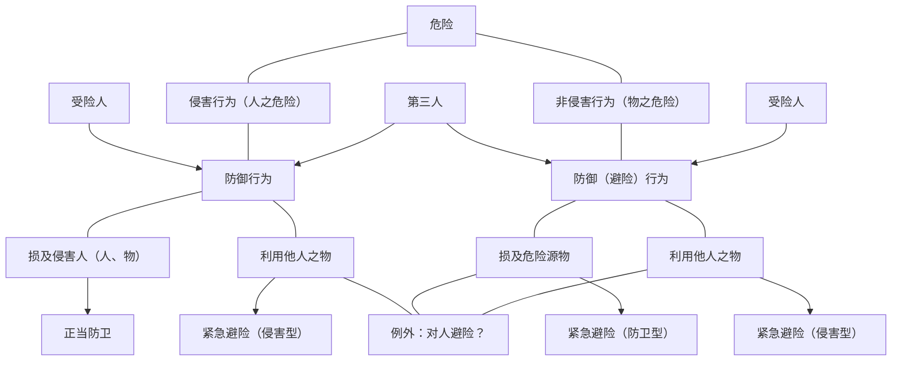

# （一）私力救济→公力救济
一个人的权利被侵害了，以公力救济为基本原则是因为文明社会的一个重要的基础就是暴力的行使经过法律的约束之后被垄断到国家的手中，这是一个基本原则，否则没有这种暴力的垄断，每个人都可以行使暴力的话，那么这个社会就没有什么秩序，文明社会也无法延续。由于暴力被垄断到国家手中，要救济权利就要申请公力救济。甲欠乙钱，乙不能把甲抓起来打一顿。

如果一律的认为所有的救济都必须诉诸公力救济，有的时候也会造成一些很不公平很不合理的现象，比如甲持刀攻击乙，如果按照暴力的行使被垄断在国家的逻辑，乙不可以正当防卫，因为甲在行使暴力，乙只能诉诸公力救济去找警察，但是这种情况通常不能及时找到警察，找到警察可能已经被侵害了，这个时候就产生了一个例外——如果在特定情形下权利被侵害或者权利有受到侵害的危险，但是又来不及诉诸公力救济的时候，那么应该允许公民在一定限度内行使合理的暴力。所以文明社会中，一切被允许的私力救济都有个前提——来不及诉诸公力救济。
# （二）私力救济之种类体系
- 自助行为
	- 一般自助行为
	- 特殊自助行为
- 自卫行为
	- 正当防卫
	- 紧急避险
- 其他私力救济手段

- 自助行为适用于请求权受侵害，能够侵害请求权的是请求权相对人，当相对人有某一种行为，这种行为会让一个请求权实现不了的时候，或者有可能实现不了的时候，紧急情况下允许请求权人实施一个自助行为，通过自助行为来保全自己的请求权。
	- 保全不是权利的实现，保全只是把权利实现的可能性给固定下来，比如债权人的撤销权，债务人虽然欠了很多钱，但原则上仍然可以把自己的财产无偿送给别人，不因为欠了别人钱就无权无偿处分自己的财产，如果处分自己财产的结果是使得自己的财产不够还钱，这个时候其债权人可以把债务人的无偿处分行为给撤销掉，白送给别人的东西要拿回来，这个东西拿回来之后债权人向债务人要钱的可能性就增多了，债权就不至于不能实现了，这叫保全。
	- 自助行为也是一样的，金可可要把自己的手机卖给张三，但是到期金可可不给手机，张三钱已经付给金可可了，经过无数次催告金可可还是不给，金可可来到湖边准备把手机扔进湖里，张三可以抢在金可可扔掉手机之前把手机一把抢走，这个行为的结果没有让张三的债权直接实现，抢下来之后手机还是金可可的，还要还给金可可，等金可可再交付给自己，张三在完成上述操作后要赶紧诉诸公力救济，所以自助行为实际上一种债权保全的方法。 ^611j03
# （三）自助行为
## 1.功能：紧急情况下，以私力保全自己的请求权
## 2.一般自助行为
### （1）要件
- 权利性（为保全自己之请求权）
- 必要性（若不及时采取措施，无法实现或有实现困难）
- 紧迫性（来不及受公力救济）
- 合理性
	- 方法
	- 程度
- 临时性
- 法效果：上述5个要件皆具备，排除不法性

![[第七编 侵权责任#^z3fvw0|民法典1177]]该条文放在侵权行为不合理，放在民法总则比较合理。
### （2）方法之限定性
扣押、毁损债务人之物，比如债务人马上就要跑了，可以把他的自行车轮胎戳破，这样他就跑不掉了。也可以彻底毁坏债务人之物，债务人眼看就要逃出国境了，这个时候在过国境线/海关之前，债权人过去把债务人的护照撕毁，这属于必要措施，是可以的，光损坏不行，撕毁才行。 ^waxrgh

拘束债务人之人身自由，比如债务人吃霸王餐吃了就要跑，跑的时候债权人可以把债务人扣下来。 ^lo1d8l

%%比较法%%有的国家认为自助行为仅限于上述两种情形（[[二、民事权利的保护#^waxrgh|扣押、毁损债务人之物]]；[[二、民事权利的保护#^lo1d8l|拘束债务人之人身自由]]）。一个是对债务人的物采取措施，一个是对债务人的人采取措施，对于人采取措施仅限于拘束自由，超出拘束自由是不可以的。
我国%%中国%%没有将方法限定在这两大类，只是在[[第七编 侵权责任#^z3fvw0|民法典1177]]写了“合理措施”，但是比较法上所说的这些限定的方法也就是通常的合理方法的范围，超出这些范围说措施合理一般就很难成立了，是一种科学性的限定。

>- 自助行为方法的合理性：
>	- 债权人不扣留债务人的东西，通过扣留债务人儿子的东西来自助，这是不可以的。可以扣留、毁损、毁灭的物都仅限于债务人，其他人的东西都不行。
>	- 限制人身自由仅得对债务人本人，不得对债务人以外第三人限制人身自由。
>	- 不能殴打债务人来自助，也不能为了给债务人舆论压力到处贴条说债务人欠钱的事实。对于人身、人格采取措施仅限于采取拘束人身自由，不得侵犯健康权、名誉权、隐私权。
>	- 方法里面有人有物，债务人之物、债务人之人，自助的方法有次序限制。
>		- 在人与物之间有次序优先限制：能够采取扣留物就保全自己债权的，就不能去扣留人，比如张三在金可可开的饭店吃霸王餐，吃完就准备走，金可可一看账单，200元左右，张三骑着电瓶车来的，金可可可以把张三的电瓶车扣留下来即可保全债权，这个时候就没有权利限制张三的人身自由，金可可看到张三骑上电瓶车，一把拉住，把电瓶车扣下就足矣了。
>		- 在物里面也有限度问题，对物的措施有扣押、损坏、毁灭，能够用扣押解决问题的，就不要去损坏；能够用损坏解决问题的就不要去毁灭。
>	- 自助行为方法合理是[[第七编 侵权责任#^z3fvw0|民法典1177]]的“合理措施”表达出来的。
>	
^ynu1qv

>- 自助行为程度的合理性：
>	- 扣押的情形，扣押一样物就能保全债权的，就不要扣两样物，即尽可能克制，因为本质上只要侵入对方的权利范围都具有违法性，所以只有在必要范围内才能排除违法性。
>	- 在损坏时，能够损坏小一点就不能损坏过大，当然在很紧急的情况下也不要求把握的那么严格，比如金可可看到债务人要骑电瓶车跑了，跑了就难以实现债权了，金可可赶紧把债务人的电瓶车一推，把电瓶车推坏了，虽然拉抓住电瓶车把手就可以防止债务人逃跑，措施超出了必要限度，但在正常情况下一个理性人在这样紧急的情况下是无法作出拉住电瓶车的判断的，过于严苛，不会有这样的要求。
>	- [[第七编 侵权责任#^z3fvw0|民法典1177]]“必要范围内”表达的是自助行为程度合理。
>	
^g8vlgj

- 自助行为的临时性：
	- 扣了车、扣了人没有及时诉诸公力救济，坐等债务人上门还债是不行的，一旦没有及时诉诸公力救济，就侵权了，具有违法性。
	- 自助行为只是临时的一时保全而已，一旦保全下来要及时诉诸公力救济，否则还是侵权。

金可可以为张三还欠自己钱，实际上张三已经把钱打到金可可的账上了，金可可看张三的样子以为张三要出逃赖账，金可可在符合一切要件的情况下，对张三采取了扣留其人身或者物品的措施，金可可的行为不构成自助行为，不排除违法性，自助行为的成立必须真正的有一个请求权，假想的请求权永远不可能构成自助行为，再怎么有正当的理由误认为存在请求权都不行。%%自助行为权利性%% ^a8vt18

金可可以为张三欠自己儿子钱，看着张三就要出逃了，若金可可是其儿子的监护人，其儿子尚未成年%%非完全民事行为能力人%%，金可可可以替其儿子行使自助措施，若金可可的儿子成年了，只能由金可可自己行使自助措施。

张三对金可可负有一笔债务，这个债务履行期限是18年1月1日，到21年的1月2日，实际上诉讼时效已经经过，金可可期间一直没有向张三请求履行债务，现在眼看张三就要出逃，金可可这个时候不能进行自助行为将张三限制人身自由，因为私力救济只是公力救济在紧急情况下的临时替代，如果公力救济的权利也受到限制了（诉讼时效届满），此时就不能以私力救济自助行为来替代了。自助行为是以请求权还可以强制实现为前提的。对方不能对请求权有抗辩权，有正当对抗权利就不可以自助。

张三是画家，金可可让张三为其画一幅画，这个时候合同已经签了，金可可钱也给了，张三一直不交付画，这个时候眼看张三就要逃了，逃的目的就是让金可可的债权得不到实现，这个债权是不适于强制执行的债权，这是没法强制执行的债权，手长在张三那儿，张三就是不给画，一点办法都没有，对于这一种请求权，由于可以采取的公力救济可以采取的办法是没有的，可以诉诸公力救济，但不能用强制执行的方法来公力救济，这个时候私力救济自助行为也不行。 ^odcmny

[[二、民事权利的保护#^611j03|金可可打算把手机扔到湖里]]，正准备扔，张三把手机抢走，金可可连忙对张三“正当防卫”；[[二、民事权利的保护#^lo1d8l|吃霸王餐的人要跑]]，金可可拉住吃霸王餐的人，债务人进行“正当防卫”一脚把金可可踢开。这些都不是正当防卫，正当防卫的对象是违法行为、不法侵害，现在表面上债权人的自助行为在侵害债务人的权利，实际上没有不法性，对于合法行为不可以正当防卫。自助行为由于排除了不法性，不能成为正当防卫的对象。
### （3）行使之限制
恰当性（比例原则）：方法、力度

临时性（及时诉诸公力救济）
### （4）法律效果
- 排除违法性→适法行为：不负损害赔偿责任
- 负赔偿责任之主要情形→有违法性
	- 假想自助行为
		- [[二、民事权利的保护#^a8vt18|假想有请求权]]
		- [[二、民事权利的保护#^29v79i|假想有自助情事]]
	- [[二、民事权利的保护#^sog0ic|自助过当]]
	- [[二、民事权利的保护#^3q7ih1|公力救济申请被驳回]]/申请迟延       
	- 扣押、毁损他人之物

金可可对张三有请求权，但是张三现在不是出逃，而是出国旅游，三天后回来，金可可以为张三是出逃，所以把张三的护照给撕了，这个时候实际上没有自助情事的发生，没有[[第七编 侵权责任#^z3fvw0|民法典1177]]所说的“不立即采取措施将使其合法权益受到难以弥补的损害”的自助情事的情况，必要性指的就是有自助情事的情形。 ^29v79i

前述违反自助行为[[二、民事权利的保护#^ynu1qv|方法]]和[[二、民事权利的保护#^g8vlgj|程度]]的合理性，超出了合理的范围采取了不当的方法是有可能违法的。 ^sog0ic

如果是没有及时申请，构成侵权，当然要损害赔偿，有违法性；如果申请是及时的，但诉诸公力救济被驳回了，说明请求权本身不正当，本来就没法诉诸公力救济，既然本来就没法诉诸公力救济，意味着私力救济是不行的，因为私力救济是很紧急很例外的情形下公力救济的临时替代而已（[[二、民事权利的保护#^odcmny|参见请求权过诉讼时效的公力救济]]），本身公力救济就不行，则也不可以进行私力救济。 ^3q7ih1

正因为自助行为是适法行为，自助行为原则上不需要负损害赔偿责任（侵权责任），所有的私力救济首要的就是排除不法性，这是私力救济体系最为重要的一点，如果某一个要件不具备即具有违法性的话还是要负赔偿责任的。
## 3.特殊自助行为：无须具备上述构成要件
- 在比较法上，其他国家或地区经常会规定一些特种的自助行为，也是允许采取自力的救济来保全自己的请求权，在这一点上和一般的自助行为是一样的，功能是一样的，不一样的地方在于要件不那么严格。
	- 比如有些国家和地区有这样一个法条是讲出租人和承租人之间的关系，比如张三租了金可可的房子，后来租期到了，张三有两期租金还未支付，这个时候不管情况是否紧急，也不管诉诸公力救济是否来得及，一律可以扣留张三留在金可可家里的东西（[[第445条|台民445]]），这叫出租人的特殊自助行为%%出租人的特殊自助权%%，这不是基于出租人物权来说的，东西完全就是承租人的，因为承租人有租金不付，出租人有权将承租人留在房子里的东西强行扣留下来，付清租金再归还给承租人，也没有及时诉诸公力救济这一回事，要件很宽松，之所以这么立法是因为民众的习惯长期就是如此，立法者觉得也不至于对社会造成太大危害，也公平合理，所以就采取了。
	- 又比方说有些国家规定，对于服务行业的经营者，比方说饮食店、宾馆，在对方的服务费没有付清之前，对其留在店里的物品都可以进行扣留，不需要具备严格的要件，无需立即诉诸公力救济。%%服务业的店主的特殊自助行为%%
	- 第三个特殊自助行为为大多数国家所采纳，为占有人的自助权。
		- 金可可有一本书，张三抢这本书，金可可可以防御不让张三抢走，但这是正当防卫。
		- 问题是如果这本书不是金可可的，金可可也是从路边捡来的，这个时候张三过来抢这本书，金可可也可以防御，占有不是一种权利而是一种事实，既然占有不是权利，张三抢书的行为就不是对金可可的发不法侵害，没有侵害金可可的任何权利，这个时候德国立法不得不规定保护占有人的防御权，这个时候就不是正当防卫了，而是占有人的防御权，因为防御的不是权利而是占有，但是占有人的防卫不是这里说的特殊自助行为。
		- 特殊自助行为是指上例张三来抢书，金可可进行防御没有防御成功被张三把书抢走了，张三抢到书就跑，这个时候金可可可以自己追上去把书夺回来，这里有一个涉及物权法的关键点。
			- 如果金可可一直跟着张三没有跟丢的情况下，总算抓住张三把这本书夺回来了，张三有权夺回，这属于占有人的自助权。
			- 如果金可可跟着跟着跟丢了%%跟丢之后自助权就消灭%%，半个小时后金可可又看到了张三拿着这本书招摇过市，就不再允许金可可把书夺回来了，这时候金可可不再有占有人的自助权了，只有占有保护的请求权，请求张三返还占有于自己，由自助权变为请求权，因为跟丢了，所以占有也丢了，有占有人的自助权变为占有保护请求权把丢失的占有要回来。
			- 在占有跟丢了的情况，又偶然预见侵夺占有之人，若对方消失在茫茫人海中，有占有保护请求权再也无法实现之虞，此时占有人的自助权已经消灭了，变成占有物返还请求权，但通常符合一般自助行为的要件，有
				- 权利性：占有物返还请求权
				- 必要性：不自助对方就消失在茫茫人海中，请求权难以实现
				- 紧迫性：诉诸公力救济是来不及了
				- 合理性：采取自助行为的方法和程度合理
				- 临时性：采取自助行为后立马诉诸公力救济
# （四）自卫行为
## 1.概念
自助行为的一个特点是保全自己的权利，从而为自己积极的实现权利奠定基础。而所有的自卫行为却是单纯的消极的防御，是避免自己的权利受到侵害而采取的一种措施。打一个比方的话，自助行为是积极的采取措施，积极在于将权利保全下来了，从而为自己权利的实现打下了基础；而自卫行为，无论是正当防卫还是紧急避险，都有一个特点，都是让自己的权利避免受到侵害，为此采取积极的防御行为。
## 2.刑法亦有规定→关系
民法上的正当防卫和紧急避险和刑法上的正当防卫和紧急避险，基本原理是相通的。
## 3.种类

### （1）正当防卫：因不法侵害，为反击行为
>- 甲牵着狗出来，甲看着乙，对自己训练有素的狗说“咬他”，狗听指示，扑了上去，乙无奈之下，一棍把狗打晕，属于正当防卫还是紧急避险？
>	- 为正当防卫。
>	- 表面上看是狗咬人，但是此种情形狗咬人是受甲的指示，狗无非是甲的侵害行为的工具而已，所以这个例子是人的危险而非物的危险。
>	- 在这个例子里乙一棍子把甲的狗打晕了，这个时候表面上在打狗，实际上在打人，是针对侵害人的正当防卫，把侵害人的物（狗）打晕了。
>    - 若乙在无奈之下一把抢过丙的包打狗，狗晕包毁。
>        - 对于狗晕支出的费用1000元，这个时候乙不需要赔偿甲，不用的理由是正当防卫属于合法行为，排除了不法性，所以是合法行为，不再构成侵权。
>        - 现在丙的包打狗坏了，对于丙的包受到的损害，甲虽然侵害乙，但甲没有侵害丙，丙之所以陷入如此复杂的关系是因为乙抢了他的包打狗，这个时候应该是丙去找乙要求适当补偿，这种因为自卫行为必须要容忍，容忍之后受有损害进行适当补偿的权利，叫作侵害型紧急避险中的牺牲请求权，无辜的丙必须要牺牲自己的包，因为牺牲产生的请求权，叫作牺牲请求权。牺牲请求权针对的是避险人。
>        - 牺牲请求权是被避险人因为负有容忍义务最后遭受损害而对避险人享有的请求权。[01:42:07](file:///D:/BaiduNetdiskDownload/%E6%B0%91%E6%B3%95%E6%80%BB%E8%AE%BA10.mp4#t=6127.460403)

正当防卫：侵害行为是人本身的意思的体现，属于人的危险，对于这种来自于人的危险进行防卫，如果导致侵害人受到一定的侵害，这种情况我们家称之为正当防卫。
### （2）紧急避险：因紧急危险，为避险行为
>- 甲养了一条狗，甲的狗有一天跑出来了，去攻击乙，乙逃无可逃，只好一棍把甲的狗打晕，属于正当防卫还是紧急避险？
>	- 为紧急避险。
>	- 狗之咬人，并非受甲之指使，并不是甲的意思的体现，不能视为是甲的直接侵害的行为。在此意义上不是人的危险，不是来自于甲的侵害行为。
>	
^94j83e

>- 甲牵着自己的狗出来了，甲的狗看到乙，突然不受甲的控制，扑向乙，要撕咬乙，乙把甲的狗打了，属于紧急避险还是正当防卫？
>	- 为紧急避险。
>	- 狗之咬人，并非受甲之指使，并不是甲的意思的体现，不能视为是甲的直接侵害的行为。在此意义上不是人的危险，不是来自于甲的侵害行为。
>	
^d0v6vv

- 紧急避险：
	- 危险不能归纳于人的侵害行为，对于物的危险，也就是危险源物给打晕了，损及危险源物，这个时候我们称之为紧急避险，为防卫型紧急避险，对于侵害我的物，我让之受伤。
	- 在前述两种情形（[[二、民事权利的保护#^94j83e|情形1]]、[[二、民事权利的保护#^d0v6vv|情形2]]），假设乙无奈之下抢走丙的一个皮包去打狗，把狗打晕了，这种情形下：
		- 就狗所受到	的损害是紧急避险，危险源物狗受伤了，意味着甲的财产减损了，因损及狗所受的损失，我们说是防卫型紧急避险。
		- 丙的皮包被用作打狗后也坏了，就丙这个皮包的损害而言，同样避免的属于物的危险，只要避免的属于物的危险，都是紧急避险，但是这个时候导致受害的，导致损失的物，这个时候除了危险源物还有一个丙之他人之物，利用了丙之他人之物损及了危险源物来把这个危险给防免掉了，这个时候就丙的皮包受到的损失，虽然也叫紧急避险，我们将之称为侵害型紧急避险，侵害型紧急避险是指如果没有紧急事由的话，乙抢走丙的包属于侵权，丙是和这件事情没有一点关系的人，侵害型紧急避险的侵害是指一个完全无辜的人的物的权利被侵害了，丙看到乙抢他的包不能正当防卫，紧急避险是权利的正当行使，不具有不法性，对于合法的行为，不能正当防卫，正当防卫只能针对不法行为，所以本案中丙负有容忍之义务，万一丙对于乙处于险情不知情，至少不能以正当防卫为由排除自己行为的不法性，丙很生气一脚把乙踹开了，丙要主张自己不承担责任有多种事由，其中一种事由是主张自己正当防卫，这个是不能排除丙的责任的，但是丙证明自己没有过错的话，按照[[第七编 侵权责任#^0jplgg|民法典1165I]]，也可以按照这种方式让自己不承担责任，如果丙的判断有误，正常理性之人都能看出乙在紧急避险，则丙有过错，要承担侵权责任。
		- 对于把狗打伤支出医药费，假设有1000元，乙不需要赔偿，因为没有不法性，当然不用赔偿，是狗主人没有管好自己的狗，对于危险源物的损坏不用赔偿。%%防卫型紧急避险%%
		- 对于丙的皮包遭受的损坏，无辜的丙必须容忍乙的紧急避险，因为必须容忍包被拿过去打狗，包受损害了，丙的损坏乙需要适当补偿，之所以叫补偿是因为赔偿是对违法行为而言的，违法行为所致的损害的是赔偿，合法行为所致的损害是补偿，例如征收的补偿，国家可以颁发征收命令，把老百姓的财产征收为国有，征收给的钱叫补偿。