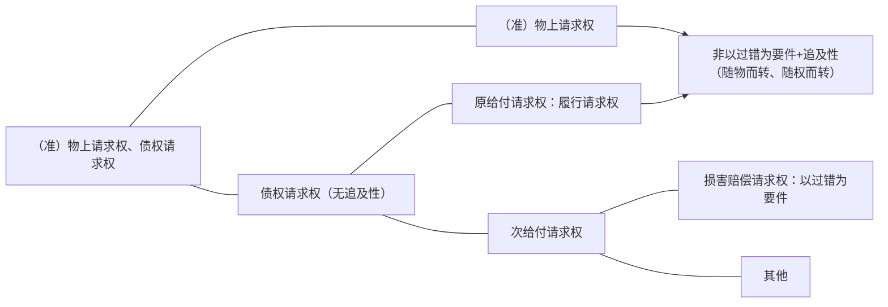
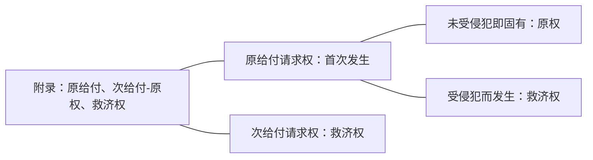
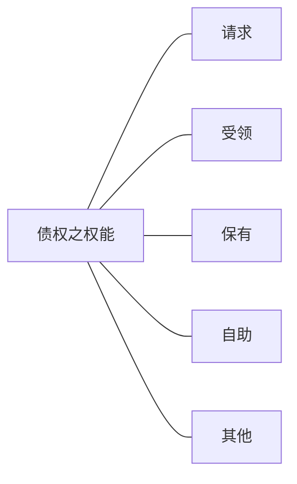

# 一、财产权、人身权、中间型权利（按客体）
### （一）财产权
### （二）人身权
### （三）中间型权利
#### 权能中兼有两者
比如著作权的署名权和发表权是没有经济利益的，为非财产性权利，而出版权、许可使用权是财产性的权利。
#### 基础与内容分属两者
# 二、支配权、请求权、抗辩权、形成权：乃某一具体权利之作用
## （一）支配权
### 1.权利之法定内容：支配→客体
金可可有一个杯子，金可可对这个杯子的权利的法定预设内容为金可可对这个杯子可以占有、使用、收益、处分，权利的客体即金可可可以对这个杯子做什么。
#### （1）客体性：权利人直接支配其客体
客体即上例的杯子。
#### （2）单方性→正常/应然实现方式：无需他人意思协作，可单方实现
即按照立法者预设的应然的实现方式，金可可对杯子的支配（占有、使用、收益、处分）无需他人的配合，单方即可实现。
### 2.辨析：支配权之保护→请求权
比如张三抢走了金可可的杯子，金可可仍然是物权人，为了保护金可可的物权，法律上规定了基于物权人的地位的返还占有的请求权（[[第二编 物权#^axo3xh|民法典235]]），这个请求权叫所有物返还请求权%%原物返还请求权%%，为保护物权，这个支配权被配上了一个请求权，但并不因为请求权物权就变成了请求权，因为按照立法者的预设，物权的行使是单方的支配，只是异态的情形下加上请求权。 ^z4ztuc

[[第二编 物权#^khsx8p|民法典462]]，金可可占有了这个杯子，被张三侵占%%侵夺%%了，占有物返还请求权发生了，反之，若是金可可主动把杯子给了张三，金可可没有占有物返还请求权，因为没有侵占%%侵夺%%，金可可把杯子拉在张三家，对张三有原物返还请求权%%所有物返还请求权%%，张三为无权占有人。在杯子被抢走的情况下即有所有物返还请求权也有占有返还请求权，在杯子被拉在张三家时，只有原物返还请求权。本案还有不当得利请求权，张三占有杯子没有合法的根据，金可可对张三有不当得利返还请求权（对于占有的利益不当得利），不当得利请求权的客体是返还杯子的占有，因为张三并未获得杯子的所有权（[[第三编 合同#^el18x2|民法典985]]），为非给付型不当得利（侵害权益型不当得利）。 ^rk4tyn

占有为何为利益，例如甲对杯子有所有权，杯子丢了，被乙抢走，现在甲要把杯子卖给丙，原价5元卖2元，乙也不一定要，因为占有能不能取回还不知道，但是乙2元卖杯子给丙，丙反而愿意，因为杯子在乙那儿，占有本身能决定物权的价值，即便没有物权，占有也可以具备价值，比如比较法上的公然、和平、持续占有满一定期限获得所有权，并且比如甲委托乙保管杯子，乙卖给丙，丙是有可能善意取得的，占有人没有所有权，但可以凭借此法律地位剥夺所有权人的所有权。 ^wqo9dx

乙抢走甲的杯子，侵犯了甲对杯子的物权，虽然没有把物权弄没，但是物权肯定被侵害了，乙因过错侵害甲的民事权益，应当承担侵权责任，依照[[第七编 侵权责任#^0jplgg|民法典1165]]、[[第一编 总则#^dot2gb|民法典179（四）]]返还杯子。 ^1epchj

虽然乙对甲有所有物返还请求权、占有物返还请求权、侵权上的返还请求权、不当得利之占有返还请求权，但只能请求一次，为请求权竞合。

因妨害或侵害支配权所生请求权不妨碍支配权的性质。

物权、知识产权、人格权皆为支配权，身份权%%亲属权%%不是支配权。比较法上德国不把人格权作为支配权，承袭了康德的理念，人因为有尊严，所以人永远不能成为权利的客体，所以哪怕人对于人格是可以自主的、有单方性的，也不叫支配权，不是从技术层面否定，而是从意识形态上否定，所以实质上还是有支配性。
## （二）请求权
### 1.概念：权利人要求他人为特定行为（作为、不作为）%%给付%%之权利
金可可有一部手机，和张三签订手机买卖合同。

张三对金可可的债权的内容有两项请求权：（1）请求交付手机；（2）移转标的物手机的所有权。（[[第三编 合同#^ut8m6i|民法典598]]）

金可可对张三的请求权：支付价款。（[[第三编 合同#^an1kf7|民法典626第1句]]）

张三对金可可的债权的特点：约定好金可可今天中午交手机，但金可可就是不交，把手机放在家里，张三催促金可可交付手机，张三不能直接闯进金可可的家中取走手机，这不是张三债权的正当权利内容，立法者给张三的正当权利内容是张三只能请求金可可交付手机并移转所有权，张三可以催告金可可也可以请律师催告金可可，但绝对不能自己拿，如果权能中包含了可以直接拿走，债权就变成支配权了。那么金可可任凭张三如何请求就是不履行交付并移转所有权的义务怎么办？张三可以起诉至法院强制执行该手机买卖合同。
金可可的手机拿在手上，张三可以抢走吗？虽然金可可应该交付手机，但张三不能抢走手机，理由同上。

金可可把手机装在口袋里，不小心把手机掉在地上了，张三能把手机抢走吗？理由同上，抢走就是侵权，金可可仍然可以基于占有返还请求权或者原物返还请求权要回手机。

金可可手机不小心掉在地上，金可可不知道直接走了，这时候张三看到了，捡起了手机，张三可以捡起来，张三可以捡手机不来源于债权，可以捡并不意味着债权变成了支配权，“可以捡”是因为法律上规定的遗失物的拾得，别人的东西没有经过别人的同意，通常而言拿起来就是违法的，但如果是捡别人遗失的东西，目的是为了归还失主，则是“有权”捡，不是为了归还而捡是“无权”捡，但这里的“有权”和“无权”本质上不是权利（非right），只是一种[[第二节 民事权利之分类#（二）自由：要约权？立遗嘱权？|自由]]，“有权”是指当你是为归还失主而捡时，你碰到这本书时构成无因管理排除违法性，并且为物归原主所支出的必要费用可以要求所有人返还，比如坐公交车送过去所支付的金钱，在所有人发出悬赏广告时，在送还之后还有悬赏广告上的奖励的请求权。（[[第二编 物权#^lfdx6t|民法典314]]、[[第二编 物权#^i7samd|民法典317]]），在[[第二编 物权#^i7samd|民法典317]]的侵占情形（包括拾得时就是为了侵占），不仅不构成无因管理，还构成侵权，金可可可以主张侵权损害赔偿。 ^kkb6uw

手机买卖合同签订后，张三一直请求金可可交付手机，金可可表示绝对不交付，要他想要自己去法院起诉，金可可怒从心头起，恶从胆边生，把手机扔到湖里，在金可可将扔未扔之际，张三可否把手机抢走？张三有无权利抢走手机？此种情形张三是可以抢手机的，也不需要在手机脱手的一瞬间才能抢（此时有紧急性，手机一落入湖中，就无法实现请求权了，至少不能对这个手机请求），此时可以抢并不意味着债权变为支配权，这种抢的权利确实源于债权，同[[第二节 民事权利之分类#^kkb6uw|遗失物拾得的情形]]不一样，基于[[第七编 侵权责任#^z3fvw0|民法典1177]]的债权的权能中的自助行为，张三绝不能绕过请求权的行使而直接支配标的物，实现请求权不能则必须通过去法院起诉救济（请求不成，请求公力救济），允许自己抢则为私力救济（自力救济），一个现代的国家救济自己权利的方式原则是公力救济，因为自力救济会导致每个人的安全受到威胁，法秩序的前提是把行使暴力的权力都垄断在一个国家手里（社会契约论，相当于国家全部的人都把行使暴力的权力让渡给国家，由国家代替行使，保证每个人不至于受到他人非法暴力的侵害），但是在紧急的情况下例外的允许自力救济，即来不及请求公力救济介入的时候，主要在正当防卫、紧急避险[^1]、自助行为三种情形，本案情形即[[权利的自力救济#三、自助行为|自助行为]]，自助行为的行使遵循比例原则，其一措施要合理，扣留物品可以保全请求权则不得毁损，对物采取措施可以达到目的则不能限制他人人身自由，其二程度要合理，扣留一辆车可以保全请求权不得扣留两辆，且自助行为具有临时性，比如扣留汽车不能一直扣下去，要立即诉诸公力救济。这里的权利同样也不是right，而是违法阻却，即“可以”。自助行为需要同时满足五个条件始发生阻却违法的效果：权利性、必要性、紧急性、合理性、临时性。自助行为并没有使得请求权转变为支配权，虽然表面上看是对物的支配（也不是支配，不能处分物，控制物后需要立即诉诸公力救济），但这是在极端的情形下对请求权的保全，不是债权的应然实现方式，按照立法者的立法，债权的应然实现方式是请求，异态不能代表常态。

[^1]:正当防卫和紧急避险同属于自卫行为。

### 2.特征
#### （1）权利之法定内容：无支配性→请求
#### （2）权利之正常/应然实现方式：他方之协作
>辨析：期前自愿履行，强制履行，自助行为
>期前自愿履行：金可可和张三签订手机买卖合同，在合同约定交付手机前三天主动把手机给了张三，张三拿到手机，张三的债权实现，张三虽然没有请求交付手机并移转所有权，说债权是请求权只是说债权的正常实现方式为请求，并不排除未经请求而实现债权。
>强制履行：金可可一直不履行交付义务，张三起诉，法院强制执行，未经金可可的协作，这是债权实现的异态，权利实现的异态不影响债券的请求权性质。

### 3.请求权之基础权利（母权）：各种具体权利
#### （1）依基础权利之请求权分类
比如金可可的杯子被张三抢走了，引起了原物返还请求权的发生，该请求权的母权（基础权利）为物权（中的所有权），母权即引发请求权的权利。（[[第二编 物权#^axo3xh|民法典235]]）

[[第二编 物权#^khsx8p|民法典462]]保护的客体是占有，没有物权的人的占有也受此条文保护，占有物返还请求权的基础是占有，但这里说占有是基础权利就不精确了，因为占有不是权利，所以说请求权基础为占有而不是基础权利。

金可可还可以根据[[第三编 合同#^el18x2|民法典985]]主张[[第二节 民事权利之分类#^rk4tyn|不当得利请求权]]（[[第二节 民事权利之分类#^wqo9dx|占有为何为利益]]），这个不当得利请求权的基础权利为债权，不当得利之债为法定之债，同样是物权受侵害，基于不当得利的请求权的母权利为何为债权？对于物权的侵犯没有引发债，那么母权利就是物权，对于物权的侵犯引发债了，那么母权利就是债权（因为构成不当得利中间隔了一个债），这是物权的逻辑所决定的。

金可可对于张三还有侵权上的请求权，请求权的内容是要求返还财产（[[第七编 侵权责任#^0jplgg|民法典1165]]、[[第一编 总则#^dot2gb|民法典179（四）]]），这个请求权是侵犯物权的结果，母权利是债权，侵权行为产生的是债，无逻辑可讲，法学发展一开始的界定就是如此界定，是结论先行的。

根据手机买卖合同，金可可可以要求张三支付手机价款，张三可以要求金可可交付手机并移转所有权，这两个请求权的母权利是债权。金可可该给手机而不给，张三向金可可主张违约责任要求赔偿迟延履行的损失，请求权基础为[[第三编 合同#^pqlryz|民法典577]]（这是不精确的说法），这个请求权的母权利是债权。

有个人把金可可打伤了，金可可因此支出医药费71元，金可可有权要求赔偿（因为侵犯人格权），该请求权的母权利是债权而非人格权，因为是侵权行为引发的债。侵犯知识产权也是同理。

>怎样界定这个请求权是债权请求权还是非债权请求权？
[[第一编 总则#^rhkwya|民法典118II]]
![[债权之瑕疵]]
张三停车不小心停在金可可的车位上，金可可有权让张三把车开走，这个请求权是物权请求权，基于[[第二编 物权#^6wqo6p|民法典236]]排除妨害请求权。
债权在正常的情形下[[第二节 民事权利之分类#（四）权能（Befugnis）：具体内容|权能]]为请求，但其权能[[第二节 民事权利之分类#（四）权能（Befugnis）：具体内容|权能]]不限于请求（虽然[[第一编 总则#^rhkwya|民法典118II]]将债权定义为请求权），金可可把手机卖给张三，交付给张三，张三拿走手机，这是受领的权能，张三拿到手机后，张三的债权消灭，因为金可可向一个正确的有[[第二节 民事权利之分类#^rwq4l2|受领权限]]的人进行了给付，问题来了，张三债权消灭后，金可可并不能对张三说“你债权消灭了，把手机还给我，你不当得利”，因为张三有保有的权能，保有权能排除不当得利，请求权能不是占有手机法律上的原因，保有权能才是占有手机法律上的原因，所以有了债权的本质到底是请求还是保有的争论，债权的权能在特定情形下有可能是自助，即保全自己的权利，图中的“其他”比如根本违约导致的解除权。债权的权能有很多，请求权只是最能反映债权特点的一个权能。
#### （2）母权与请求权之关系
>不用请求权之权利：形成权——原因？

>基础知识：物上/准物上请求权之体系
>![[基础知识：物上、准物上请求权之体系]]
>物上请求权指的是物权法特有的请求权，一种是保护物权的请求权，一种是保护占有的请求权。（注意区别[[民法之调整对象#准物权→财产权利/非特定之物|准物权]]）
>
>1. 保护物权的请求权一为[[第二节 民事权利之分类#^z4ztuc|原物返还请求权]]；二为排除妨害，即侵犯物权的人虽然没有无权占有该物，但使得物权对物权的行使不顺畅，比如金可可在用手机，张三不让金可可用，抓住金可可的手机晃，金可可为了物权的完满状态，可以行使排除妨害请求权让张三把手拿开；三为消除危险，即别人还没有妨害其行使物权，但有产生妨害的可能性，不是必须等到物权行使受到妨害才能请求妨害，可以在妨害产生前请求消除危险，最为典型的例子是金可可的房子有一个院子，金可可的邻居的房子也有一个院子，邻居院子里的一棵树倒了，倒在金可可的院子里了，金可可要求邻居把树拿走，为排除妨害请求权，邻居家的树还没倒，今天刮风，眼看着就要倒了，金可可可以要求邻居加固树木，这叫消除危险请求权。（妨害并不是现实的，而是可能发生的）
>回到邻居的树倒掉的例子，金可可要求邻居把树拿走，邻居表示“树不要了，树是被风挂倒的，与我无关，我没有过错。”物权请求权最大的一个特点是不以过错为要件，无过错也要排除妨害。
>金可可把手机拉在了张三家，张三对手机构成无权占有，金可可可以要求原物返还，张三不可以拒绝返还，物权请求权不以过错为要件。
>邻居家的树倒了，同时把金可可的院墙给压塌了一部分，金可可让邻居把树拿走，并且把院墙修好，邻居说“不修，我无过错。”院墙毁损，导致金可可房屋价值减损，导致房屋价值下降的因素不归物权管，归债权管，这是一个损害赔偿之债，而按照侵权的规定，原则上只有过错才会损害赔偿，要求修院墙或者是赔给修院墙的钱都是损害赔偿，要求以过错为要件，邻居若能证明确实无过错，可以不赔修院墙的钱（[[第七编 侵权责任#^eopp5n|民法典1253]]），但必须把树拿走。
2. 占有保护请求权（保护占有的请求权），金可可有一部手机，手机是捡来的或偷来的，现在金可可的手机又被张三抢走了，金可可有占有物返还请求权，如果张三没有抢走手机，只是妨害金可可对手机的占有，金可可可以请求排除妨害，排除妨害在动产比较少见，多见于不动产，金可可无权占有房屋，张三（非房屋物权人）不能将树堆在房屋门口妨害金可可的占有，消除危险亦同，与上述物权请求权的排除妨害、消除危险同理，只是一个保护物权一个保护占有，当然在金可可有物权的情况下，可以主张物权上的请求权也可以主张占有保护请求权来要求排除妨害或消除危险，无论是规定在物权里的请求权还是规定在占有里的请求权都是物上请求权，都不构成债。
3. 准物上请求权%%也可以叫准物权请求权，因为没有占有的问题%%，对于跟物权没关系的支配权（知识产权、人格权、亲属权的部分权利），有可能这些权利受到侵犯，比如知识产权受到侵犯，要求停止侵害、排除妨害、消除危险，同样不以过错为要件，例如商标权被侵害，有人未经允许使用金可可注册的商标，金可可可以要求其停止侵害、排除妨害，即便用注册商标的人可能没有过错（误以为这不是注册商标，误以为别人没有这个商标），这种支配权上的请求权和物上请求权极其类似，但是因为不是物权，所以叫作准物上请求权（特别法通常会规定这些请求权，若没有规定，可以适用[[第七编 侵权责任#^gkx57d|民法典1167]]，[[第七编 侵权责任#^gkx57d|民法典1167]]无论规定在什么地方都是在物权和占有以外了。人身权的例子，比如有个人总是在外面说金可可每天到家乐福偷两包餐巾纸，并没有这回事，但这个人坚持不懈的这么散布谣言，金可可可以要求其停止侵害，即便说的人没有过错，比如因为有个派出所的民警伪造了笔录和处罚通知书给这个人看，导致这个人相信这个金可可偷餐巾纸还每次都被抓住的事实，没有过错也要停止对于名誉权的侵害（同样不以过错为要件，母权利为人格权里的名誉权）；再比如有个人被金可可锁在他的办公室里了，因为金可可没有注意到这个学生在他的办公室等他，学生等候的地方很奇怪，正常人都发现不了，金可可没有过错，学生同样可以要求金可可排除对于行动自由的妨害。
4. 上述概念和严格责任没有任何关系，严格责任只属于债法中的侵权责任，物权法上没有严格责任的概念。 ^45zzda

![[基础知识：原物返还请求权之要件]]
### 4.重要形态
#### （1）（准）物上请求权、债权请求权

- 金可可的手机被张三抢走了，金可可对张三有两个物上请求权，一个是[[第二编 物权#^axo3xh|民法典235]]规定的原物返还请求权，一个是[[第二编 物权#^khsx8p|民法典462]]规定的占有物返还请求权，这两个请求权都不以过错为要件 。
	- 金可可基于[[第二编 物权#^axo3xh|民法典235]]原物返还请求权向张三要手机，张三把手机给了李四，金可可对张三的原物返还请求权已经不在了，原本金可可对张三有原物返还请求权是因为[[基础知识：原物返还请求权之要件|要件]]具备，张三把手机给了李四，张三已经没有在占有手机了，不再是现时无权占有人，所以对于张三的原物返还请求权消灭，李四为现时无权占有人，李四变为原物返还请求权的相对人，李四交给王五也是同理，无论转交多少次都是同理，前手要件消灭后手要件具备，起起灭灭随物而转。
	- 金可可的手机被张三无权占有，张三一直占有着没有交给别人，金可可对李四说“我把手机卖给你。”所有权归李四后，金可可对张三不再有原物返还请求权，李四对张三有原物返还请求权，同理，李四将手机让与给王五，李四的原物返还请求权消灭，王五对张三有原物返还请求权，原物返还请求权随权利移转而移转。
	- 以上为（准）物上请求权的追及。

- 债权请求权无追及性。
	- 原给付请求权：金可可把手机买给张三，张三对金可可有交付手机并移转所有权的请求权，金可可在交付手机之前又把手机卖给了李四，张三和李四均对金可可有交付手机并移转所有权的债权请求权，一物二卖，买卖合同效力均不受一物二卖而影响其效力，均为有效合同，金可可在交付的时候选择交付手机给李四，张三的债权仍然指向金可可，仍然对金可可享有交付并移转手机所有权的债权请求权，如果不构成给付不能（自始不能）的话，债权永远有效并指向金可可，不会随着标的物的移转而移转，但张三此时若把权利移转给王五，王五对金可可有请求权，在权利端的移转是追及的，但随物移转是不可能的。
	- 次给付请求权：
		- 张三请求金可可交付手机金可可不交，金可可把手机交给了别人，金可可无法履行对张三的债务，张三受有损害，典型的在此情形有损害赔偿，张三的损害指向对象和手机的移转没有关系，永远指向金可可，不会跟着物的移转而移转；
		- 再比如金可可的手机被李四抢了，李四把手机的一块漆给弄损了，导致手机价值下降的损害，金可可对李四有不同的请求权：（1）返还占有，可以有四个请求权基础-原物返还、占有保护、不当得利、侵权返还；（2）就手机价值减损有侵权损害赔偿请求权。要求损害赔偿的请求权为债权请求权，母权利为债权。现在金可可要求李四返还占有并损害赔偿时，李四将手机交给王五，金可可对李四没有原物返还请求权（原物返还请求权针对王五）但还有损害赔偿请求权，金可可的手机价值减损是李四造成的，这个债权请求权的[[基础知识：原物返还请求权之要件|要件]]仍然具备，李四因过错造成金可可手机的侵害，物不管流转到谁的手中，造成损害的是李四。
		- 金可可在针对李四主张不当得利请求权返还占有，李四把手机交给王五，根据[[第三编 合同#^auj897|民法典986]]、[[第三编 合同#^gyjhyj|民法典987]]，本案中李四知道自己获得了一个占有的利益，占有已经交给了王五，根据[[第三编 合同#^gyjhyj|民法典987]]，李四为恶意不当得利人，即便利益不存在，也需要返还利益，通常认为如果李四将手机交给王五，看李四和王五是什么关系，如果李四对王五有返还请求权，金可可可以要求李四将对王五的返还请求权让与金可可行使，如果要不回来了（手机再也拿不回来的情况），金可可可以要求李四还手机的价款（构成不当得利时的手机价款），此时和损害赔偿发生竞合。
		- 金可可如果按照侵权要求李四返还手机，为债权损害赔偿的内容，李四将手机交给了王五，金可可的侵权债权请求权仍然指向李四，涉及是否构成给付不能的问题。
		- 债权请求权（不当得利、侵权），无论手机给了谁，永远针对第一个抢手机的人。
			
#### （2）原（给付）请求权、次（给付）请求权
金可可和张三签订手机买卖合同，张三对金可可有请求交付手机并移转所有权的债权请求权，这是张三基于手机买卖合同对金可可享有的第一个请求权，也是债权债务关系原定的给付内容（原给付请求权），金可可该交付手机而不交，即迟延履行了交付义务，这是一种违约形态，就债务履行的迟延，张三可以要求金可可赔偿（[[第三编 合同#^pqlryz|民法典577]]、[[第三编 合同#^g34ckv|民法典585]]）。请求赔偿迟延履行损害的请求权不是手机买卖合同原定的给付内容。这个损害赔偿请求权有两个特点：（1）是原给付请求权违反后的新的救济，是对原给付请求权的救济，所以是次给付请求权（是第二个请求权）；（2）这个损害赔偿请求权不是金可可和张三签手机买卖合同时预设的给付内容，按照预设的规划没有这个损害赔偿请求权（不是合同预定的原定给付内容）。

次给付请求权是异常状态下产生的请求权。

原给付请求权（第一次请求权）有可能是对此前另外一个权利的救济，被救济的权利并非请求权，即对非请求权的侵害导致请求权的第一次发生。

对已经产生的请求权进一步的救济为次给付请求权。
![[基础知识：次给付请求权（买卖合同）]]

金可可被打了，这个侵害的人格权是原权，打金可可的人要赔钱，这是救济权，为原给付请求权，打人的人不给钱（迟延给付）导致金可可损失，金可可要求赔偿是救济权，为次给付请求权。

- 原给付请求权和次给付请求权还有一点不同：
	- 张三基于手机买卖合同向金可可要手机，金可可说“我又没过错，为什么要给你手机？”，金可可的抗辩不成立，原给付请求权不以过错为要件，法律认为金可可和张三的手机买卖合同时有效的，即法律认为张三对金可可的债权是正当的，法律是要保护的，张三对金可可的受法律保护的债权[[第二节 民事权利之分类#（四）权能（Befugnis）：具体内容|权能]]（内容）即包括原给付请求权（请求金可可交付并移转手机所有权），已经因为法律的确认，原给付请求权有了天然的正当性了，要求实现当然不需要任何额外的要件。
	- 次给付请求权即损害赔偿请求权([[债务不履行]])则与原给付请求权不同，金可可一直没有交付手机，手机买卖合同没有约定交付日期，张三催告金可可交付手机，金可可没有交付的原因是金可可在的那几天生病了，在医院动手术住院了,一直处于昏迷状态而没有看到张三发的电子邮件，张三说“你迟延履行了，要赔我钱。”，金可可说“我没有过错。”，金可可不需要赔偿，损害赔偿请求权原则上以过错为要件，因为该请求权没有天然的正当性，法律认定的基于手机买卖合同正当的权利内容中没有损害请求权这一项，所以要让赔钱成为正当才可以发生损害赔偿请求权，法律的基本价值衡量是“赔钱原则以过错为要件。”这是法律给损害赔偿请求权加的要件，具备该要件才具备了正当性。（绝大多数国家都加上了这个要件）

[[第三编 合同#^pqlryz|民法典577]]中“继续履行”这四个字，张三要求金可可继续履行手机买卖合同的请求权，是原给付请求权，张三和金可可约定好3月29日中午12点交付手机，金可可没有交付手机，迟延履行了，张三对金可可仍然有交付手机并移转手机所有权的请求权，在金可可违约之后的继续履行请求权是手机买卖合同的原定给付内容，违约之前应该给的和违约之后应该给的内容是一样的，都是交付手机并移转所有权，其正当性都来源于合同本身，都具备天然的正当性。迟延履行的损害赔偿是损害赔偿的问题，为次给付请求权，需要以过错为要件[^2]，履行晚了还可以继续要则是合同原定给付内容，不以过错为要件。继续履行虽然规定在违约这一章中，表面上看是救济，实际上并不是救济。

[^2]:典型如因不可抗力导致的迟延履行，无过错，不承担损害赔偿责任。

[[第三编 合同#^88p22r|民法典582]]中的“修理、重作、更换”，修理请求权是原给付请求权，原定给付是给一个正常的手机，现在给了一个不好的手机，为了实现原定给付要把不好的手机变成好的，所以要拿回来修理，所以是原定正当给付内容的实现，为原给付义务的变种，同样不以过错为要件，金可可卖给张三一个坏掉的手机，张三要求修理，金可可不可以说“这个手机是我买来的，我没过错，不修。”金可可将手机用3天时间修好了，张三受有损失，3天的时间张三无法使用手机，该经济上的损失可以要求金可可赔偿，这个经济损失的赔偿不再是原定的给付，另加过错要件，为次给付请求权。

张三把李四打了一顿，李四因此支出医药费若干，张三需要赔偿李四的损失，这个赔钱的请求权是原给付请求权，原给付请求权是第一次请求权，在张三殴打李四之前，张三和李四之间没有权利义务关系，这项请求权是对李四人格权的救济，虽然是救济，但是为第一次请求权，仍然是原给付请求权。李四向张三主张医药费赔偿，张三拖了三个月就是不给，医药费5万，因为张三的迟延给付李四受有损失%%损害%%，损失为5万元存入银行的利息，针对因为迟延导致的损失，为次给付请求权，因为此项请求权是第二次发生的请求权，是为了救济原给付请求权即5万元医药费的请求权。为了救济原给付请求权而产生的新的给付请求权为次给付请求权。

金可可的书被张三抢走了，金可可可以根据[[第二编 物权#^axo3xh|民法典235]]的原物返还请求权要求张三返还该书，如果按照债权的方式去观察这个[[第二节 民事权利之分类#^45zzda|物上请求权]]的话（物权请求权可能准用债权请求权的规则），这是原给付请求权，但是如果张三拒不归还，拖了两个月，因此造成金可可的损害%%损失%%，针对此损害的请求权为次给付请求权。金可可同时享有占有物返还请求权，这是原给付请求权，还完了导致有损害是次给付请求权。金可可对张三有不当得利请求权（[[第二节 民事权利之分类#^rk4tyn|针对占有的不当得利]]、[[第二节 民事权利之分类#^wqo9dx|占有为何为利益]]），这个不当得利请求权是原给付请求权，没有及时返还导致的损失是次给付请求权。金可可还可以基于侵权要回书，侵权以过错为要件，以过错为要件产生的请求权，但依然是第一次请求权，在发生侵权关系之前金可可和张三只是路人，仍然为原给付请求权，只是法律在第一次请求权加上了过错的要件，加了过错符合要件的请求权是法律认可的正当的请求权，张三该还而不还导致的损失为次给付请求权。

|     | 物权：物权请求权 | 债权：原给付请求权 | 债权：损害赔偿请求权 |
| --- |:----------------:|:------------------:|:--------------------:|
|内容/目的：实现预定权利内容？|是 （回复对物圆满支配）|是 （原给付利益）|否 （填补财产差额）|
|必不可少之法定权能？|是|是|否|
|要件：过错？|否|否|是|
|独立让与？|不可 [[第二节 民事权利之分类#^qui4po\|理由1]] [[第二节 民事权利之分类#^sa5i8w\|理由2]]|不可 （[[第二节 民事权利之分类#^sjwrib\|无此问题]]）|[[第二节 民事权利之分类#^f46qp4\|可]]|
|消灭时效？|[[第二节 民事权利之分类#^x4pcbn\|常不适用]]（[[第一编 总则#^ax951y\|民法典196Nr.1,2]]）|通常适用|通常适用|
|追及性|有|无|无|

- 物权中的物权请求权为什么不以过错为要件？
	- 法律认为一个物权，它的[[第二节 民事权利之分类#（四）权能（Befugnis）：具体内容|权能]]就包含了物权请求权，物权认为，占有、使用、支配、处分的权能是所有权人的，在认可所有权的时候，就已经认可占有了，结果有个人把东西抢走了，所有权人把东西要回来，是在实现法律已经认可过具有天然正当性的内容，实现原本的物权权能，当然不以过错为要件。
	- 如果张三抢了金可可的书，书被弄坏了，金可可要回坏掉的书依然是物权请求权，但是这本书要回来的时候价值下降了（[[民法总论之体系构成#^cvnmd4|财产损害]]），财产总额下降，为财产损害，物的价值的下降不归物权管，维持物的价值不下降不是物权的[[第二节 民事权利之分类#（四）权能（Befugnis）：具体内容|权能]]，否则就麻烦了，金可可有一本书，一旦因为市场因素价格波动导致价值下降，金可可就可以行使物权请求权要求把书的价格提上去，这显然是不合理的，所以只有在使得书的价值下降的人在有过错的情况下才需要赔书价值下降部分的钱。把书要回来是原给付请求权，要求赔书的价值减损也是原给付请求权，在物权领域内是第一次请求权，在债权领域内的侵权也是第一次请求权。注意，损害赔偿是债的关系。（[[第二节 民事权利之分类#^45zzda|修院墙的案例]]也是同样的逻辑处理） ^90lh6h

>![[基础知识：损害赔偿请求权之体系]]
>1. [[民法学习概论#1. 同学是否有权请求老板赔偿交通费、医药费，精神损失费5万元，并赔礼道歉？|精神损害]]指精神痛苦，[[民法总论之体系构成#^cvnmd4|财产损害]]指财产总额的下降。
>2. 张三殴打李四，李四需要治疗，但没有去治疗，痛的要死但坚持自愈，问李四对张三有无损害赔偿请求权？
>虽然张三侵权了，但李四的痛没有使其财产总额减少([[民法总论之体系构成#^084m9a|与健康权比较]])，李四没有财产损害，反之，李四若支出医药费60元，李四的财产总额减少，减少的60元就是财产损害。
>3. 财产损害不止指积极财产损害，还包括消极财产损害，即本来能够增加的财产总额，比如李四因为张三的殴打五天没有上班的误工费。（因受侵害该赚到没赚到的钱）
>4. 财产总额下降有的时候并不反映在具体的客体价值上[^3]，单纯是钱变少了，这种为纯粹经济损失。
>5. 财产损害救济中的金钱赔偿即[[第一编 总则#^dot2gb|民法典179（八）]]规定的“赔偿损失”。财产损害的救济除了金钱赔偿还有恢复原状（[[第一编 总则#^dot2gb|民法典179（五）]]），即不通过钱来赔，而是通过其他方式恢复价值，这些方式包括修理、更换、重作[^4]等，抢走手机的侵权要求[[第二节 民事权利之分类#^1epchj|基于侵权返还占有]]的恢复原状也是这里的恢复原状的一种方式，因为占有的侵害也是财产损害，返还财产本身就有恢复价值的意思。（[[第二节 民事权利之分类#^wqo9dx|占有为何为利益]]）
>6. 即使没有财产损害也可能有恢复原状，比如修理、更换、重作在不同的体系都会出现，而在不同的地方出现，其性质也有差异，比如[[第三编 合同#^88p22r|民法典582]]的“修理、重作、更换”是合同履行不符合约定的情况，这里的修理、重作、更换是原给付请求权的继续实施，不以过错为要件，不属于损害赔偿请求权，即损害赔偿中的修理、更换、重作要排除[[第三编 合同#^88p22r|民法典582]]规定的合同履行标的物有质量瑕疵的救济，剩余的都属于损害赔偿请求权的范畴，在承揽以外如何重作金可可也搞不清楚。
>7. 精神损害赔偿在比较法上叫慰抚金，精神损害也有两种不同的赔偿方法，其一为用钱慰抚，比较法上一直有争论，精神痛苦怎么能用钱慰抚呢？所以一般来说，各个国家对于用金钱的方式慰抚都有严格的限制，现在有慢慢放开的趋势；钱以外的慰抚方式，比如张三打了金可可，金可可很受伤，张三赔礼道歉可以达到慰抚的效果，消除影响、恢复名誉不以过错为要件（[[第二节 民事权利之分类#^45zzda|准物上请求权]]），并非损害赔偿请求权。精神损害的赔偿通常以金钱慰抚为主，但瑞士依然坚持传统的做法，不以金钱慰抚为主而以其他方式慰抚为主。
>8. 财产损害原则上是恢复原状还是金钱赔偿，这种优先级的问题比较法上有两种立法模式，有认为恢复原状优先也有认为金钱赔偿优先，我们国家严格来讲没有区分顺位，看当事人自己选择（[[民法总论之体系构成#^bjg240|比较特殊动产-动物]]）。
>9. “赔礼道歉”并不限于人格权受侵害，见[[第七编 侵权责任#^okgh5r|民法典1183]]侵害具有人身意义的特定物情形的侵害物权。“赔礼道歉”是对对方极度的强迫，金可可认为属于损害赔偿范畴，要以过错为要件。
>
>[^3]:反映在具体的客体价值的情况如：张三抢走金可可的手机，手机被张三磕掉了漆。
>[^4]:重作是专门针对承揽合同的一种方法。

- 权能不能和物权分开让与
	- 理由1：金可可有一本书，被张三无权占有，金可可对于书有原物返还请求权，金可可不能保留所有权而将原物返还请求权让与给李四，因为如果允许让与，那么金可可的所有权就变成了无法恢复权能的所有权，物权一定要有能够回来的权能。 ^qui4po
	- 理由2：基于物权法定，物权的内容和种类都是法定的，当事人不允许改变，（[[第一编 总则#^8s4itx|民法典116]]），物权种类法定指法律规定几种物权就是几种物权，当事人不能创设法律规定以外新种类的物权；物权内容法定指选取了法定物权种类，不能改变该物权的内容。法律认为物权就应该是包括物权请求权在内的，如果将之让与出去，物权的内容就变了，法律上不允许。  ^sa5i8w
	- 注意：物权请求权和物权%%理由1情形为所有权%%一起让与是没有问题%%可以%%的。
- 债权请求权可否与债权分开让与
	- 原给付请求权：金可可把书卖给张三，保留对张三的价款债权，将价金请求权让与给李四，这样是不可以，这两个权利是不能分开的，金可可对张三的债权，实际上主要就是请求其付款的请求权，不存在将债权主要内容移转给别人而自己保留债权的问题，所以将债权原给付请求权转让%%让与%%给别人就是将债权转让给别人。 ^sjwrib
	- 损害赔偿请求权：金可可把书卖给张三，张三履行迟延，金可可可以保留继续让张三支付价款的权利，单独将损害赔偿请求权（次给付请求权）转让给李四，利息李四请求，价款金可可请求。张三把书抢走并且弄坏，金可可可以把原物返还请求权保留，将侵权法上的损害赔偿请求权让与给李四，因为[[第二节 民事权利之分类#^90lh6h|这不是物权的权能]]。 ^f46qp4

[[第一编 总则#^ax951y|民法典196Nr.1,2]]，Nr.1不以过错为要件，不适用诉讼时效；Nr.2因为权能回复的正当性，通常不适用诉讼时效，未经登记的动产物权适用诉讼时效是物权法上的特殊考量。其他的权利没有不适用诉讼时效这个特点。 ^x4pcbn
#### （3）债权与请求权
![[第一编 总则#^rhkwya|民法典118II]]

### 5.请求权基础/规范 支持某项请求权之法律规范
- 金可可和张三签订了手机买卖合同，张三可以请求金可可交付手机并移转所有权，张三的请求权基础何在？
	- 请求权基础即找法律条文支持所主张的请求权，足以支持张三对金可可主张该请求权的法条即请求权基础。
	- 张三的请求权基础为[[第三编 合同#^ut8m6i|民法典598]]。
	- 金可可可以请求张三支付价款，请求权基础为[[第三编 合同#^an1kf7|民法典626]]。
#### （1）补充知识：法条类型
![[附录：法条类型概览]]
![[第一编 总则#^thda5j|民法典13]]
- [[第一编 总则#^thda5j|民法典13]]讲了两个构成要件、两个法效果。
	- 其一，自然人出生，民事权利产生。
	- 其二，自然人死亡，民事权利消灭。
	- 这种既有事实要件%%事实构成%%又有法效果%%法律效果%%的法条为完全法条。
	- [[第一编 总则#^thda5j|民法典13]]的法效果的产生不是请求权，为普通的完全法条%%其他完全法条%%。

![[第二编 物权#^axo3xh|民法典235]]
- [[第二编 物权#^axo3xh|民法典235]]为完全法条。
	- 事实构成为有一个人无权占有了他人的物。
	- 法效果是物权人可以请求返还原物。
	- 法效果的内容为请求权，这样的完全法条为请求权基础。

![[第一编 总则#^a6jgsa|民法典17]]
- [[第一编 总则#^a6jgsa|民法典17]]为不完全法条。
	- [[第一编 总则#^a6jgsa|民法典17]]为定义条文，定义什么是成年人。
	- [[第一编 总则#^a6jgsa|民法典17]]定义了[[第一编 总则#^atzw2t|民法典18]]中的成年人。
	
![[第一编 总则#^atzw2t|民法典18]]
- [[第一编 总则#^atzw2t|民法典18]]为完全法条。
	- 有事实构成：成年人。
	- 有法效果：完全民事行为能力人。
	- 法效果不是请求权，为普通完全法条。
	- 事实构成需要看[[第一编 总则#^a6jgsa|民法典17]]，并不影响其是完全法条，因为民法中几乎所有条文都在援引其他条文。

![[第三编 合同#^lp4g34|民法典496]]
- [[第三编 合同#^lp4g34|民法典496]]第一款为不完全法条中的定义规范。
- [[第三编 合同#^lp4g34|民法典496]]第二款为完全法条中的请求权基础。
	- 事实构成：提供格式条款。
	- 法效果：提供格式方有义务，通常而言，一方有义务，对方就有权请求，即通过规定义务的方式规定了请求权，比如说格式条款相对方请求提供方履行说明义务。

![[第三编 合同#^kgnygm|民法典497]]
- [[第三编 合同#^kgnygm|民法典497]]为完全法条中的普通完全法条。
	- 事实构成为所列（一）或（二）或（三）。
	- 法效果为格式条款无效，格式条款无效不是请求权，所以是普通完全法条。

![[第一编 总则#^vjdex2|民法典147]]
- [[第一编 总则#^vjdex2|民法典147]]是完全法条中的普通完全法条。
	- 事实构成为基于重大误解实施了民事法律行为。
	- 法效果为有权请求人民法院或者仲裁机构予以撤销。
		- 这是形成权，一起诉撤销对方没有反抗余地，无需对方配合，只是此条形成诉权特殊在普通形成权通过通知对方即可，而形成诉权必须通过诉讼实现。
		- 这里的“请求”是请求法院或仲裁机构而不是请求对方。非请求权基础，为普通完全法条。
		- 凡是提到“撤销、抵销、解除”的完全法条，都不是请求权基础。
- 不完全法条是指事实构成和法效果并不都具备的法条。
	- 定义规范例如民法典合同编有很多种合同，每一种类型都有对合同的定义。
	- 比如[[第三编 合同#^wldjtf|民法典595]]对于买卖合同的定义，看起来虽然像请求权基础，但性质和功能上属于定义买卖合同，买受人请求交付标的物和移转标的物所有权的请求权基础是[[第三编 合同#^ut8m6i|民法典598]]，出卖人请求支付价款的请求权基础是[[第三编 合同#^an1kf7|民法典626]]。

![[第三编 合同#^70cvoo|民法典646]]
- [[第三编 合同#^70cvoo|民法典646]]是不完全法条中的援引规范。
	- 既无事实构成也无法效果。
	- 单纯讲了出现一个不是买卖合同的其他有偿合同的情况下，有规定按照规定，没有规定参照买卖合同有关规定。
	- 这种没有告诉你答案而让你援引其他法律规定的条文为援引规范。

![[第三编 合同#^p0tx3p|民法典647]]
[[第三编 合同#^p0tx3p|民法典647]]的规定为易货交易，即互易合同（以物易物的交易），为不完全法条。 没有法效果，让你去看买卖合同的规定，为援引规范。

![[第七编 侵权责任#^vg6nju|民法典1208]]
[[第七编 侵权责任#^vg6nju|民法典1208]]也是典型的援引规范。

![[第二编 物权#^yqrwu3|民法典486]]
[[第二编 物权#^yqrwu3|民法典486]]为援引规范。

![[第一编 总则#^rlb3m4|民法典171]]
- [[第一编 总则#^rlb3m4|民法典171]]所规定无权代理通常效力待定。
	- 张三以金可可的名义和李四签了一个合同，现在李四已经知道张三无权代理，李四很不确定这个合同最终是否可以生效，此时法律为了避免李四遭遇过长的不确定的状态，给了李四一个权利，李四可以催告金可可一个月内作出追认与否的决定。
	- 金可可若追认合同自始有效，若不追认合同自始无效。
	- 合同因被代理人拒绝追认而无效，李四可以找无权代理人张三履行债务或者就其受到的损害予以赔偿。
	- 若金可可在收到催告后一个月没有表态，视为拒绝追认，金可可的沉默可能是多种原因，比如忘记回复、根本没注意到、想要拒绝追认但没说，金可可的真实意思（内心效果意思）未必是拒绝追认，但法律为了避免给李四造成不确定，将金可可的沉默拟制为拒绝追认（表示意思和效果意思均拟制），无论金可可内心真意为何均按照拒绝追认处理，这种沉默拟制为拒绝即拟制规范。
	- 拟制的特点有四：
		- 是A不是B，但是就按照B来处理。
		- 被拟制的法效果和实际情况相符的概率不一定很高。
		- 拟制不能用反证来推翻。
		- 拟制的标志性术语为“视为”。但是因为立法者没有使用精确的法律术语，有的时候并非拟制规范的情况下使用“视为”也是有的，没有“视为”二字通常不是拟制，有“视为”二字通常为拟制。[^11]

[^11]:因为中国%%我国%%立法者用语不规范，若干地方的“视为”其实等同于“是”。

![[第三编 合同#^0p7p9d|民法典544]]
- [[第三编 合同#^0p7p9d|民法典544]]中的“推定”是指先按照当事人不想变更合同来认定。
	- 这种推定更符合事实状态，当事人想要变更合同通常会明确约定变更的内容，约定不明确推定为未变更。
	- 推定变更的情形，若能举出反证证明当事人之间有变更合同的合意，举证成功可以按照变更处理。
	- 推定的特点：
		- 相关事实不清楚的情况下才会出现推定。
		- 推定的内容和实际情况相同具有比较大的可能性，一般来说推定的内容比较符合实际状况。
		- 原则上推定的内容可以用反证推翻。
		- “推定”实质是民事诉讼法上举证责任的倒置，例外情况也有不可推翻的推定。

![[第三编 合同#^vkqgtu|民法典584]]
- [[第三编 合同#^vkqgtu|民法典584]]是不完全法条。
	- 该条文表面上看很像完全法条中的请求权基础，但并非完全法条。
	- “当事人一方不履行合同义务或者履行合同义务不符合约定”并不是一定可以请求赔偿，需要另加要件，真正的请求权基础来自[[第三编 合同#^pqlryz|民法典577]]、[[第三编 合同#^yeefig|民法典583]]。
	- 但这两个请求权基础（[[第三编 合同#^pqlryz|民法典577]]、[[第三编 合同#^yeefig|民法典583]]）只讲了要赔偿损失，而没有讲损失如何计算（损失赔偿的范围如何界定）， [[第三编 合同#^vkqgtu|民法典584]]讲的是如果要赔偿损失，损失如何计算。
	- [[第三编 合同#^vkqgtu|民法典584]]的功能在于确定请求权具体的内容和范围，这样的条文为请求权附属规范。没有它请求权的具体数字就确定不下来。

![[第七编 侵权责任#^6zv4lw|民法典1179]]
- [[第七编 侵权责任#^6zv4lw|民法典1179]]并不是完全法条中的请求权基础。
	- [[第七编 侵权责任#^6zv4lw|民法典1179]]并没有说侵害他人造成人身损害在什么情况要赔，缺少事实构成，真正的请求权基础在[[第七编 侵权责任#^0jplgg|民法典1165]]。
	- [[第七编 侵权责任#^6zv4lw|民法典1179]]的功能在于界定人身损害赔偿的具体内容和数字，属于不完全法条的请求权附属规范。

![[第七编 侵权责任#^eb21kq|民法典1180]]
[[第七编 侵权责任#^eb21kq|民法典1180]]也是在界定造成多人死亡的情况下的赔偿的具体内容和数字也是请求权附属规范。

![[第七编 侵权责任#^0azehq|民法典1182]]
[[第七编 侵权责任#^0azehq|民法典1182]]也是界定赔偿的具体内容和数字，为请求权附属规范。

![[第七编 侵权责任#^bxqfbb|民法典1184]]
[[第七编 侵权责任#^bxqfbb|民法典1184]]为典型的请求权附属规范。

辅助性规范的意义在于使得完全法条的定义更加清晰。

![[第三编 合同#^m7fbim|民法典580]]
- [[第三编 合同#^m7fbim|民法典580]]看上去很像请求权基础，但并不是。
	- “法律上或者事实上不能履行”，比如金可可卖给张三一套房子，张三可以请求金可可交付房子并移转所有权，但是签了合同之后，金可可的房子被火烧了，金可可这套房子交不出来了，这套房子的所有权已经消灭了，这是“事实上不能履行”，此时张三对于金可可交付并移转房子所有权的请求权就消灭了。
	- [[第三编 合同#^m7fbim|民法典580]]系对请求权进行限制的条文，发生“事实上不能履行”的情形，请求权消灭，系属不完全法条中的限制性规范之抗辩规范。

![[第三编 合同#^ltxocr|民法典525]]
- [[第三编 合同#^ltxocr|民法典525]]，金可可把手机卖给张三，约定好一手交钱一手交货，现在金可可没有把手机交给张三，但要求张三把手机价款给自己，约定的时间到了，金可可有权请求张三支付价款嘛？金可可请求后张三是否有义务支付价款？
	- 金可可对张三的请求权是存在的。
	- 但是张三有一个临时的权利对抗金可可的请求权，即金可可不交手机，张三就可以不支付价款，金可可交付了手机，张三就必须支付价款。
	- 此为不完全法条中的限制性规范之抗辩权规范。
#### （2）民法常见请求权基础
- 1.契约（单方允诺）
	- 原给付
	- 次给付
- 2.准契约
	- 缔约过失
	- 无权代理
- 3.无因管理
	- 所得移交
	- 费用偿还
- 4.物上
	- 物权请求权
	- 占有保护请求权
- 5.不当得利
- 6.侵权
	- 准物权请求权
	- 损害赔偿
		- 财产
		- 精神
### 6.请求权竞合、聚合
#### （1）请求权聚合
- 甲将乙打成重伤致残。问：
	- 乙对甲有何种请求权？请求权基础何在？
		- 符合[[第七编 侵权责任#^0jplgg|民法典1165]]的事实构成，按照此条可以产生[[第七编 侵权责任#^6zv4lw|民法典1179]]的人身损害赔偿请求权、[[第七编 侵权责任#^okgh5r|民法典1183]]的精神损害赔偿请求权。
		- 民法典[[第七编 侵权责任#^6zv4lw|民法典1179]]所列的多项费用请求权可以同时主张并与[[第七编 侵权责任#^okgh5r|民法典1183]]规定的精神损害赔偿请求权并行主张。
	- 请求权之个数？
		- 其一为财产损害赔偿请求权，[[第七编 侵权责任#^6zv4lw|民法典1179]]为[[第七编 侵权责任#^0jplgg|民法典1165]]的请求权附属规范，所列的为财产损害赔偿的具体内容和计算项目，加起来的总额打包为一个请求权，即财产损害赔偿请求权。
		- 其二为精神损害赔偿请求权，[[第七编 侵权责任#^okgh5r|民法典1183]]为[[第七编 侵权责任#^0jplgg|民法典1165]]的请求权附属规范。
		- 这两个请求权可以同时主张，互不矛盾，既可以主张财产损害赔偿也可以主张精神损害赔偿，这种只有一个事实构成（甲把乙打成重伤残疾），而这个一个事实构成引发一个以上请求权，且多个请求权可以并行主张的情形为请求权聚合。
- 甲将某书出卖于乙。问：
	- 乙对甲有何种请求权？请求权基础何在？
		- 乙可以请求甲交付并移转该书的所有权。
		- 本案符合合同编总则[[第三编 合同#^phrylo|民法典509I]]的规定，甲和乙是合同的当事人，应当按照约定全面履行自己的义务，[[第三编 合同#^phrylo|民法典509I]]是更一般的规定，一切合同的当事人都应该遵守，而[[第三编 合同#^ut8m6i|民法典598]]是仅适用于买卖合同的规定，但规定内容其实是一样的，都是要全面履行自己的义务。
			- [[第三编 合同#^phrylo|民法典509I]]是一般规定。
			- [[第三编 合同#^ut8m6i|民法典598]]为特别规定。
			- [[第三编 合同#^phrylo|民法典509I]]与[[第三编 合同#^ut8m6i|民法典598]]的价值考量是一致的，即有合同上义务就要履行，只是在买卖合同中出卖人的具体义务是交付标的物并移转所有权，后者完全是前者的具体化，没有不同的价值考量，这种情形下特别规定优先于一般规定，援引请求权基础时应该援引更精确的条文，本案乙的请求权基础为[[第三编 合同#^ut8m6i|民法典598]]，此种情形为法条竞合。
			- 法条竞合的特点是一个事实构成符合多个条文请求权基础的要件，这个时候由于它们之间有一般和特别的关系，导致只适用特别法条，为特别规定排除一般规定的法条竞合。
	- 请求权之个数？
		- 所有权的移转和交付可以分开，这里是两个请求权。
		- 所有权保留买卖合同，东西先交付，但所有权不移转，约定好所有权不移转，那么交付就不移转所有权。
		- 不动产买卖合同，不动产交付不移转所有权，所有权移转必须去不动产登记机关办理过户登记。
		- 交付标的物和移转标的物所有权这两个请求权构成请求权聚合。
#### （2）规范排除的请求权竞合（法条竞合）
![[法条竞合图示]]
- 法条竞合：类型一（法效果相同型）
	- 甲将某书出售予乙，双方各自履行后，发现合同无效。问：
		- 甲、乙能否请求对方返还所得？请求权基础何在？[^5]
			- 本案情形为给付型不当得利。
			- 请求权基础
				- [[第三编 合同#^el18x2|民法典985]]，得利人甲拿到了一笔钱，这是利益，这个利益没有法律上根据，因为本来根据买卖合同可以拿这笔钱，但是现在合同无效，甲拿这笔钱没有法律依据，乙根据[[第三编 合同#^el18x2|民法典985]]可以要求不当得利人甲将该价金返还给自己。同理，乙获得该书的占有也构成给付型不当得利。
				- 甲和乙的返还关系也符合[[第一编 总则#^2i4wlr|民法典157S1]]的规定，本案民事法律行为无效，甲因该买卖合同获得的价金应当返还给乙，而乙也应当返还对于该书的占有。
				- 本案请求权基础为[[第一编 总则#^2i4wlr|民法典157S1]]，[[第一编 总则#^2i4wlr|民法典157S1]]是[[第三编 合同#^el18x2|民法典985]]的特别规定，因为所有的没有法律根据的不当利益都归[[第三编 合同#^el18x2|民法典985]]管，所谓的“因为没有法律根据取得不当利益”有的是因为给付而发生的，有的是非因给付而发生的，因给付而发生的不当得利情形之一为合同无效的给付，所以[[第一编 总则#^2i4wlr|民法典157S1]]的不当得利只是[[第三编 合同#^el18x2|民法典985]]不当得利事实中的一种，为一般规定和具体规定的关系，所以在援引法条的时候应该援引更为具体的[[第一编 总则#^2i4wlr|民法典157S1]]为请求权基础。
				- 立法者对于[[第三编 合同#^el18x2|民法典985]]、[[第一编 总则#^2i4wlr|民法典157S1]]没有不同的价值考量，只是函射的范围不同，法效果完全一致，援引错了援引成一般规定[[第三编 合同#^el18x2|民法典985]]，问题不大，只能说明受到的法律训练不够好，援引的不够精确。
		- 请求权之个数？
			- 一个。

[^5]:返还不可能是缔约过失，缔约过失只能是赔偿。

- 法条竞合：类型二（“只希望”型）
	- 案1：甲动物园之猩猩出逃，与乙发生争斗，致乙受伤。问：
		- 乙对甲有何种请求权？请求权基础何在？
			- [[第七编 侵权责任#^f5vmpr|民法典1245]]是动物侵权的基本条文，性质为无过错责任，动物园是动物的饲养管理人，事实构成符合，所以现在饲养的动物猩猩造成乙的损害，应该可以适用动物侵权的基本条文。
			- [[第七编 侵权责任#^pgilg7|民法典1248]]为动物侵权的特别条文，性质为过错推定责任，本案也符合[[第七编 侵权责任#^pgilg7|民法典1248]]的事实构成。
			- 本案应该适用[[第七编 侵权责任#^pgilg7|民法典1248]]，本案适用[[第七编 侵权责任#^f5vmpr|民法典1245]]和[[第七编 侵权责任#^pgilg7|民法典1248]]的法效果不同：
				- 如果适用[[第七编 侵权责任#^f5vmpr|民法典1245]]，动物园想要免责只能证明被侵权人即乙有故意或重大过失，故意是指乙希望被猩猩打，重大过失是乙以为自己可以和猩猩打，结果被猩猩打了（[[民法之调整对象#^pxtyo9|见马踢人案例]]），这在证明上是很难的，通常情形下被侵权人都不是故意或重大过失。
				- 如果适用[[第七编 侵权责任#^pgilg7|民法典1248]]，动物园只要证明尽到了对猩猩的管理职责[^6]，就可以免去侵权责任，根据[[第七编 侵权责任#^pgilg7|民法典1248]]，动物园更容易免责。
				- 立法者在此情形希望我们适用[[第七编 侵权责任#^pgilg7|民法典1248]]，立法者意为“动物园应该更容易免责，应该适用[[第七编 侵权责任#^pgilg7|民法典1248]]”，因为[[第七编 侵权责任#^f5vmpr|民法典1245]]所指动物通常为宠物，而动物园毕竟是为了社会公益目的或者是出于生计上的考量，所以动物园应该更容易免责，在动物园动物侵权情形，只能适用[[第七编 侵权责任#^pgilg7|民法典1248]]，绝对不能适用[[第七编 侵权责任#^f5vmpr|民法典1245]]。
			- 由于立法者独特的价值判断决定了必须适用[[第七编 侵权责任#^pgilg7|民法典1248]]，[[第七编 侵权责任#^pgilg7|民法典1248]]和[[第七编 侵权责任#^f5vmpr|民法典1245]]相比，在保护加害人而非受害人，受害人不能选择请求权基础，允许受害人选择请求权基础，就会导致立法者保护加害人的立法目的落空，最后的结果是法条竞合，只能适用[[第七编 侵权责任#^pgilg7|民法典1248]]。
			- 本案的法条竞合特点：
				- 一个事实符合两个请求权基础，但适用不同的请求权基础有不同的法效果。
				- 法效果之所以不一样是因为立法者的价值判断不一样，立法者只希望你适用特别条文，金可可将之称为“只希望”类型法条竞合。
		- 请求权之个数？
			- 一个
	- 案1之对照案型：甲在淮海路上溜其所养之藏獒，乙好奇，手持自拍杆猛敲藏獒头，藏獒怒，甲喝止无效、力有未逮，乙不幸被咬伤。问：
		- 乙对甲有何种请求权？请求权基础何在？
			- [[第七编 侵权责任#^0jplgg|民法典1165I]]，本案中，烈性犬是不允许养的，甲不仅养藏獒，还溜并且拉不住，是典型的有过错，本条文可以适用。
			- [[第七编 侵权责任#^f5vmpr|民法典1245]]是有免责事由的无过错责任，“饲养动物”，藏獒属于动物。
			- [[第七编 侵权责任#^r8aky0|民法典1247]]是没有免责事由的无过错责任，哪怕证明不刻抗力也要承担侵权责任，藏獒属于禁止饲养的烈性犬、危险动物。[^7]
			- 本案并不绝对要适用[[第七编 侵权责任#^r8aky0|民法典1247]]为请求权基础，立法者认为在禁止饲养的烈性犬造成损害的时候，应该适用没有免责事由的无过错责任，为立法者特别的价值判断，[[第七编 侵权责任#^r8aky0|民法典1247]]是在保护受害人，惩罚加害人，既然在保护请求权人，尽管立法者认为这个条文对请求权人最有利，但受害人可以放弃这个保护，选择[[第七编 侵权责任#^0jplgg|民法典1165I]]或[[第七编 侵权责任#^f5vmpr|民法典1245]]为请求权基础。
			- 当立法者特别的价值决断在于保护请求权人时，请求权人可以选择不适用对自己最有利的条文放弃保护，不构成法条竞合[^9]，为选择竞合。[^8]
		- 请求权之个数？
			- 一个。
	- 案2：甲赠与乙一台MacBook作生日礼物。某日，因质量问题，此电脑自燃毁灭。问：
		- 乙对甲有何种请求权？请求权基础何在？
			- 合同编总则[[第三编 合同#^88p22r|民法典582]]，其中“退货、减少价款或者报酬”无法使用，因为前提是有交换性质的合同。
			- [[第三编 合同#^3zlmn5|民法典660II]]规定赠与人只只在故意或者重大过失情形承担民事责任。
			- 立法者的价值考量是赠与人不应当赔偿或者修理、更换，因为赠与是白给的，所以要求赠与人故意或重大过失才承担民事责任，要保护无偿给予对方利益的一方减轻其责任，如果按照[[第三编 合同#^88p22r|民法典582]]来处理，那么立法者的保护目的就落空[^10]了，[[第三编 合同#^3zlmn5|民法典660II]]在保护可能的义务人，所以不允许请求权人选择，只能适用[[第三编 合同#^3zlmn5|民法典660II]]为请求权基础。
		- 请求权之个数？
			- 一个

[^6]:关在了合格的铁笼子，也没有放出猩猩，但没想到猩猩力大无穷破坏了铁笼子。
[^7]:有关公安机关会定期发布条例公布禁止饲养的烈性犬等危险动物的名单。
[^8]:即立法者的特别价值考量在于保护加害人（义务人）时，构成法条竞合，不允许受害人选择请求权基础，立法者价值考量在于保护受害人（请求权人）时，不构成法条竞合，因为权利可以放弃，请求权人可以选择放弃保护。
[^9]:在两个法条函射范围交叉的时候，是否构成法条竞合有争议，但交叉情形也会出现只适用某个条文的情况，这种情况不管叫不叫特别法与一般法都是法条竞合。
[^10]:法条竞合的规范排除，除了特别法优于一般法，还有新规定优于旧规定，新法出台并不一定意味着旧法失效，比如旧法为B法，新法为A法，只有一个条文相冲突，A法出台后B法并不失效，只是在适用这个冲突条文时，A法条文优先于B法条文。通常而言，一部新法生效了，与之同一内容的旧法就要失效，比如新担保法发布，旧的89年担保法整个失效，这叫新法优于旧法，谈不上法条竞合，法条竞合的情形是两部法律规定的方面不同，比如物权法规定了担保，担保法也规定了同一事实构成的担保，物权法制定日期更新，适用物权法。

![[基础知识：侵权责任之归责原则]]
#### （3）选择（择一）竞合：选权利+未实现，或可另选
对比[[第二节 民事权利之分类#^he4hli|选择之债]]

- 选择竞合
	- 法定择一型选择竞合
	- 自相矛盾型选择竞合

![[第三编 合同#^88p22r|民法典582]]
- “可以合理选择请求对方承担修理、重作、更换、退货、减少价款或者报酬等违约责任”中“修理”、“重作、更换”、“退货”、“减少价款或者报酬”每一项都是一个权利，立法者的考量为这些权利不能全都要，而是“合理选择”，所谓合理选择即只能选择一个，选择哪一个也应该合理，比如能修理先选修理，修理不了才能选择更换，修理不了也更换不了才能选择退货。
- 这种现象叫选择竞合，选择竞合的特点是：
	- 就买卖合同或承揽合同这一个事实构成，法条规定了一揽子权利，权利不能都要，只能选择一个。
	- 本条情形所选权利没有实现可以另选，比如标的物修理不好可以要求更换。选择竞合情形下可否另选要具体判断。

![[第一编 总则#^rlb3m4|民法典171III1]]
[[第一编 总则#^rlb3m4|民法典171III1]]“行为人实施的行为未被追认的，善意相对人有权请求行为人履行债务或者就其受到的损害请求行为人赔偿。”善意相对人对无权代理人只能在履行债务的请求权和损害赔偿的请求权中选择一个行使。

![[第三编 合同#^aizcx7|民法典588I]]
- [[第三编 合同#^aizcx7|民法典588I]] “当事人既约定违约金，又约定定金的，一方违约时，对方可以选择适用违约金或者定金条款。”中的定金指违约定金。（违约定金见[[第三编 合同#^cq7np5|民法典587S2]]）
- 违约金与违约定金罚则只能选择一种，为选择竞合。

![[第一编 总则#^iknj1u|民法典148]]
![[第三编 合同#^88p22r|民法典582]]
![[第三编 合同#^ut8m6i|民法典598]]
- 金可可把手机卖给了张三，金可可卖手机是有欺诈行为，说这个手机是肖战用过的，张三是肖战的粉丝，所以就买了这个手机，手机市场价格2000元，金可可卖了20000元。现在手机还没交付，履行期限到来之前张三发现了欺诈。  
	- 符合[[第一编 总则#^iknj1u|民法典148]]的事实构成，张三有权请求法院或仲裁机构予以撤销。
	- 符合[[第三编 合同#^ut8m6i|民法典598]]，张三有权请求金可可交付并移转手机所有权。
	- 此情形张三不能既撤销买卖合同又请求金可可交付并移转手机所有权，法律虽然没有说两种救济只能选一种，但这两种救济是相互矛盾的，事实上张三只能选一种，这种选择竞合是法律没有明确规定，但事实上只能选择其一的选择竞合。
	- 关于[[第三编 合同#^88p22r|民法典582]]，虽然很有争议，但是也有可能张三主张金可可交付的手机不是肖战用过的，交付的手机有瑕疵，从而产生瑕疵担保的问题。
		- “可以合理选择请求对方承担修理、重作、更换、退货、减少价款或者报酬等违约责任”为瑕疵担保责任请求权具体内容，本来是质量不符合约定，但本案是标的物不符合特点—肖战用过。
		- 张三也可以选择不撤销手机买卖合同，修理是修理不了的，金可可没办法把不是肖战用过的手机修成肖战用过的，除非找到肖战用一下，这是基本不可能的，也无法重作，如果金可可恰好有一部肖战用过的手机，张三可以请求更换手机；以上都不实际，张三可以请求退货或减少价款。
	- 张三还可以主张金可可承担缔约过失责任，该责任不以撤销手机买卖合同为必要。
	- [[第三编 合同#^88p22r|民法典582]]与[[第一编 总则#^iknj1u|民法典148]]有交叉，[[第三编 合同#^88p22r|民法典582]]通常适用于买卖合同和承揽合同，[[第一编 总则#^iknj1u|民法典148]]适用于一切法律行为，法律行为是最上位的概念，下面才是合同、单方行为，合同继续区分具体的各种合同，看似是上下级层级的关系，实际并不是，因为[[第三编 合同#^88p22r|民法典582]]合同履行不符合约定不必然是因为欺诈，瑕疵相关的欺诈也只是[[第一编 总则#^iknj1u|民法典148]]欺诈情形的一小部分事实构成，比如金可可误以为手机是肖战用过的，即[[第三编 合同#^88p22r|民法典582]]不一定针对欺诈、[[第一编 总则#^iknj1u|民法典148]]不一定针对合同，两个条文的关系为合同与欺诈两个原理的交叉关系，由于此时两个条文之间的关系如何？
		- 第一种说法：即使因为欺诈而导致合同履行有瑕疵也应该适用[[第三编 合同#^88p22r|民法典582]]，欺诈没有导致履行有瑕疵则可以适用[[第一编 总则#^iknj1u|民法典148]]去撤销，欺诈导致有瑕疵则只能适用[[第三编 合同#^88p22r|民法典582]]。此种理解即将[[第三编 合同#^88p22r|民法典582]]解释为闭合规定（也叫闭锁规定），闭合规定意为在履行有瑕疵之时[[第三编 合同#^88p22r|民法典582]]为唯一可适用的规定，其他规定都被排除，此时构成法条竞合。（通说，通常讨论的是重大误解与瑕疵履行） 
		- 第二种说法：立法者没有说履行不符合约定有瑕疵的情形，一定优先适用[[第三编 合同#^88p22r|民法典582]]，欺诈导致履行有瑕疵的时候[[第一编 总则#^iknj1u|民法典148]]和[[第三编 合同#^88p22r|民法典582]]都可以适用。即按照选择竞合来理解。

- 示例2：解除与继续履行请求权：假设金可可该交付手机而不交付，张三催告后合理期间金可可仍然不交，张三行使[[第三编 合同#^xse0f1|民法典563（三）]]之解除权，刚通知完，张三又催告金可可继续履行手机买卖合同，解除合同就不能要求继续履行，继续履行就不能解除合同，这也是事实上的矛盾，只能选择其一行使，为选择竞合。

- 选择竞合特点：
	- 同一个事实构成，立法者规定了两个以上的权利（既可以是请求权也可以是形成权）。
	- 由于立法者的明确规定或者事实上的矛盾只能选择其中一种权利行使。

>对比：选择之债：选给付+选定离手，不得反悔
>![[第三编 合同#^7yg4po|民法典515]]“债务标的”指的是给付，债务标的有多项指的不是给付有多项而是可能的给付有多项，通常的选择之债选择权在债务人，选择之债的选择权是典型的形成权。
>![[第三编 合同#^w23nox|民法典516]]金可可到一个卖盒饭的饭店，盒饭的卖法是30元钱，两荤三素，菜品自选，金可可和老板签了买卖合同之后，有两荤三素的选择权嘛？
>有，两荤三素的请求权是五个请求权还是一个请求权？
>是一个请求权。金可可总共对老板只有一个两荤三素的债权，但事实上的两荤三素五种菜品由金可可选定（另有交易习惯），金可可有一个请求权，两荤三素是具体的请求权内容，选的是给付（权利的内容）而不是权利。
>金可可选好了两荤三素，假设在饿了么平台下单，选好后金可可不能反悔，给付一旦选定就按选定的内容来，当然在刚选好，没有给盒饭店老板带来不便，对方允许反悔的，例外允许反悔。极端一点的例子，给付的内容为50项菜品，在选择给付完成后债的内容即固定，这时候对方按照此内容准备菜品，允许反悔是不合理的。 ^he4hli
#### （4）狭义请求权竞合：请求权内容相同→[[第二节 民事权利之分类#^jhohwx|清偿共同关系]]
- 类型
   - [[第二节 民事权利之分类#^cm2jim|真正竞合]]
	   - [[第二节 民事权利之分类#^7jjw4r|自由竞合说（选择说）]]
		- [[第二节 民事权利之分类#^uug243|相互影响说]]
	- [[第二节 民事权利之分类#^nuds2s|不真正竞合]]（请求权基础/规范竞合）
- 判定：各请求权功能是否独立
	- →必然同属一人？
	- →[[第二节 民事权利之分类#^ksirnu|功能独立：物上请求权、抽象债务关系]]
- 常见：侵权与违约竞合（[[第二节 民事权利之分类#^cqdkp6|案1]]、[[第二节 民事权利之分类#^ncimak|公交车案件]]）
	- 学说争议
		- 法条竞合说：违约规则排除侵权规则（该学说已经被彻底摒弃）
		- 狭义请求权竞合说
			- 真正竞合说
				- 自由竞合说
				- 相互影响说
			- 不真正竞合说
	- 我国（[[第一编 总则#^qf26mn|民法典186]]）：[[第二节 民事权利之分类#^pbnjqu|自由竞合说？]]

真正竞合：一个事实构成符合两个以上请求权基础，而这个请求权内容一样，只能实现一次的情形下，如果认为是两个以上独立的请求权，便是狭义请求权竞合中的真正竞合，“真正”的意思为真的有两个以上请求权。（[[第二节 民事权利之分类#^48oadm|案2]]、[[第二节 民事权利之分类#^9ix6uu|案3]]） ^cm2jim

不真正竞合：一个事实构成符合两个以上请求权基础，但实际上请求权只有一个，为不真正竞合，“不真正”的意思为并不真的有多个请求权，只有一个请求权，竞合不在请求权而在请求权基础。（[[第二节 民事权利之分类#^cqdkp6|案1请求权基础竞合说]] ） ^nuds2s

自由竞合说：在真正竞合的情形下，允许当事人在几个构成[[第二节 民事权利之分类#^jhohwx|清偿共同关系]]请求权中选择请求权，且条文的事实构成互相不发生影响。 ^7jjw4r

相互影响说：在真正竞合的情形下，允许当事人在几个构成[[第二节 民事权利之分类#^jhohwx|清偿共同关系]]请求权中选择请求权，但不管选哪个，另外一个条文的事实构成也要适用，以避免立法者的特别目的落空。 ^uug243

>一个请求权，数个请求权基础的例子（请求权基础竞合，不真正竞合）：
>- 损害赔偿请求权，通常都是一个请求权，数个请求权基础，因为损害赔偿请求权不可能分属于不同的人，损害只会出现在一个人身上。（主要见于此情形）
>- 价额偿还请求权，比如不当得利的价额偿还、解除的价额偿还，为一个请求权数个请求权基础。

>数个请求权的例子（真正竞合）：
>- 凡是物上请求权，通常都是独立的请求权，任何请求权和物上请求权碰在一起，都为两个独立的请求权，比如租赁物返还请求权和原物返还请求权、占有物返还请求权。
>- 凡是抽象债务关系，比如支票、本票上的请求权，新债请求权和旧债请求权为数个请求权。
^ksirnu

>![[第一编 总则#^qf26mn|民法典186]]
>- 我国%%中国%%采取的是不纯正的自由竞合说，一个非牛非马的学说，既然允许选择，那么应该是[[第二节 民事权利之分类#^cm2jim|真正竞合]]，[[第二节 民事权利之分类#^7jjw4r|自由竞合说]]允许重复起诉、允许单独让与，但我国不允许单独让与、不允许重复起诉，告了侵权就不能告违约，告了违约就不能告侵权，一个案子判下来就结束了，我们国家的特点是虽然允许选，但又不承认自由竞合说的两个后果。
>	- 我们国家目前的这种“不纯正的自由竞合说学说”非常不好，不好在于当事人一旦选定使用那个请求权，就要承担选择不利的后果，但当事人未必知法，在[[第二节 民事权利之分类#^cqdkp6|案1]]情形下，按照侵权来起诉会胜诉，按照违约来起诉会败诉。有的时候案情复杂律师也会吃不准选择什么法条更好，法院没有义务释明也不能释明律师怎么选法条（因为当事人是平等的，法院不能偏袒）。
>	- 最好的模式是请求权基础竞合（[[第二节 民事权利之分类#^nuds2s|不真正竞合]]），当事人只负责把事实告诉法官，法官来判定到底怎么适用法律，对于[[第二节 民事权利之分类#^cqdkp6|案1]]，要么适用[[第三编 合同#^v96fkd|民法典897]]，要么将[[第七编 侵权责任#^0jplgg|民法典1165I]]的“过错”改为“故意或重大过失”来适用。
>	- 在承认[[第二节 民事权利之分类#^cm2jim|真正竞合]]的同时采取[[第二节 民事权利之分类#^uug243|相互影响说]]，问题也不大，因为虽然不让重复起诉，但也在一次审理中查明了侵权和违约的全部事实，但中国的法官一般不愿意这么干，和所受的法律训练也有关系。
>
^pbnjqu

- 法条竞合和请求权基础竞合（不真正竞合）的区别：
	- 法条竞合最终能用的条文只有一个，其他条文被排除掉了（其他条文适用的可能性事先就被排除）；
	- 请求权基础竞合的情形可能适用的法条有几个，最后到底能用的法条是哪个，要么是当事人来选（[[第二节 民事权利之分类#^cm2jim|真正竞合]]），要么是法官来选（[[第二节 民事权利之分类#^nuds2s|不真正竞合（请求权基础竞合）]]），当事人来选择分为自由竞合说和相互影响说，即便是相互影响，可用的条文还是有两个。

只要符合[[第二节 民事权利之分类#^48oadm|清偿共同关系]]的，都以狭义请求权竞合的方式来考虑。

>金可可坐公交车，公交车司机开车不慎，急刹车，导致金可可摔伤。
>- 根据合同来说，公交公司违反了把乘客安全运送到目的地的义务，违约了。
>- 根据侵权来说，公交车因为过错侵害了金可可的[[民法总论之体系构成#健康权|健康权]]。
>- 这是典型的侵权和违约的请求权竞合。在比较法上：
>    - 认为系[[第二节 民事权利之分类#^cm2jim|真正竞合]]：
>        - 有些国家认为应该采自由竞合说，随便选，各法条的事实构成不互相影响。
>        - 有些国家有些学说认为应该采相互影响说，可以选择，但不管选哪个，另外一个条文的事实构成也要适用。
>    - 第三种学说为请求权基础竞合说（[[第二节 民事权利之分类#^nuds2s|不真正竞合]]），当事人不选法条，由法官来把几个条文捏起来一起用。
>- 侵权和违约，到底是真正竞合还是不真正竞合是有争议的。
>- 根据我国[[第一编 总则#^qf26mn|民法典186]]规定，只要可以允许当事人选一个的，那么通常就是真正竞合，因为有几个请求权才能选择其中一个。
>
^ncimak

>案1：甲无偿委托乙保管货物，乙因轻过失致仓库货物部分毁损。问：
>- 甲对乙有何种请求权？请求权基础何在？
>    - 至少有两个条文可以用，[[第三编 合同#^v96fkd|民法典897]]、[[第七编 侵权责任#^0jplgg|民法典1165I]]。
>        - [[第三编 合同#^v96fkd|民法典897]]所谓“保管不善”是指有过错，即有偿保管普通过错就要赔，但对于无偿保管合同，无偿保管人承担责任以故意或重大过失为前提。按照[[第三编 合同#^v96fkd|民法典897]]，乙的过错要件不符合，不需要承担赔偿责任。
>        - 按照[[第七编 侵权责任#^0jplgg|民法典1165I]]，乙因过错侵害了甲的民事权益（保管的货物所有权损害），符合要件，乙需要承担侵权责任。
>    - 保管人乙导致了乙的损失，假设毁损灭失的货物价值2000万元，无论按照[[第三编 合同#^v96fkd|民法典897]]还是[[第七编 侵权责任#^0jplgg|民法典1165I]]，损失都是2000万元，请求权内容相同，都是赔实际上遭受的损失，毫无疑问构成清偿共同关系，只能实现一次请求权。
>    - 在本案情形，请求权基础不同，导致的法效果完全不同。
>        - 所有权人甲以[[第三编 合同#^v96fkd|民法典897]]为请求权基础，不符合请求权发生的要件，其主张不能得到法院的支持。
>        - 所有权人甲以[[第七编 侵权责任#^0jplgg|民法典1165I]]为请求权基础，符合请求权发生的要件，保管人乙有轻过失。
>        - 这个时候有三种处理意见：
>            - 认为属于[[第二节 民事权利之分类#^cm2jim|真正竞合]]的情形。
>                - 自由竞合说（选择说）：甲可以自己任意选择请求权基础，选[[第三编 合同#^v96fkd|民法典897]]败诉，选[[第七编 侵权责任#^0jplgg|民法典1165I]]胜诉。这种观点不妥之处在于，在[[第三编 合同#^v96fkd|民法典897]]立法者用意在于保护无偿保管人（义务人），允许选就会导致立法者立法目的落空。
>                - 相互影响说：正因为允许选择请求权基础会导致立法者目的的落空，所以不允许甲选择请求权基础，即使允许选择，两个请求权基础也要相互影响。甲选了[[第七编 侵权责任#^0jplgg|民法典1165I]]，但是由于竞合的请求权基础[[第三编 合同#^v96fkd|民法典897]]要求无偿保管人故意或重大过失，为保证[[第三编 合同#^v96fkd|民法典897]]立法目的的实现，其构成要件要对[[第七编 侵权责任#^0jplgg|民法典1165I]]发生影响，将[[第七编 侵权责任#^0jplgg|民法典1165I]]中的“过错”改为“故意或重大过失”。
>            - 请求权基础竞合说（[[第二节 民事权利之分类#^nuds2s|不真正竞合]]）：只有一个请求权，甲不需要选，适用法律实际上是法官的事，甲起诉到法院只需要说“法官，我把东西委托给乙无偿保管，他弄坏了。”，告知事实即可，怎么适用法律是法官的事情，由法官按照最能使立法目的实现的方法来运用法律（捏起来用两个法条，将两个法条按照立法目的融合为一个请求权基础），即实际上按照[[第三编 合同#^v96fkd|民法典897]]处理。（法官知法，当事人不必知法）
>- 请求权之个数？（侵权与违约竞合学说存在争议）
>    - 若采请求权基础竞合说（[[第二节 民事权利之分类#^nuds2s|不真正竞合]]）
>        - [[第三编 合同#^v96fkd|民法典897]]、[[第七编 侵权责任#^0jplgg|民法典1165I]]产生的是一个还是两个请求权，取决于在其他的案型中有没有可能分属于两个不同的人，如果可以分属于两个不同的请求权人，说明这两个条文有独立的功能，为两个请求权，如果不可能分属于两个不同的请求权人，那么说明两个条文功能是一样的，为一个请求权。
>        - 由于[[第三编 合同#^v96fkd|民法典897]]、[[第七编 侵权责任#^0jplgg|民法典1165I]]都是规定损害赔偿请求权，而损害只可能发生在同一个人身上，请求权只有一个（请求权基础为分散在不同条文的一个请求权基础），不能分别单独让与也不能重复起诉，一旦以保管或侵权为由起诉败诉，即产生既判力，不得再诉。
>    - 若采自由竞合说、相互影响说（[[第二节 民事权利之分类#^cm2jim|真正竞合]]）
>        - 两个。
>        - 认为[[第三编 合同#^v96fkd|民法典897]]、[[第七编 侵权责任#^0jplgg|民法典1165I]]分属侵权和违约，功能不同，可以让与请求权其一而保留另一个。
>        - 在认为侵权与违约[[第二节 民事权利之分类#^cm2jim|真正竞合]]的情况下，对于是否构成重复起诉又有不同学说：
>            - 基于[[第二节 民事权利之分类#^7jjw4r|自由竞合说]]而认为选择其一起诉，法官就根据你选择的条文来判，就会出现一个胜诉不了还可以以另一个条文起诉的问题。
>            - 基于[[第二节 民事权利之分类#^uug243|相互影响说]]认为即使选择其一，另外的一个条文的事实构成也要综合判断，就不存在一个胜诉不了再以另外一个条文起诉的问题，因为在一个案件里事实认定都解决了。
> - [[第二节 民事权利之分类#^pbnjqu|我国对于该案件的处理]]
>
^cqdkp6

>案2：甲将某物出租于乙，租期届满后，乙拒不返还。问：
>- 甲对乙有何种请求权？请求权基础何在？
>	- 检索契约请求权，根据[[第三编 合同#^bnsvyh|民法典733S1]]，按照合同约定，期满之后乙需要返还租赁物，性质为契约请求权中的原给付请求权。
>	- 检索准契约请求权，无缔约过失、无权代理的事实构成。
>	- 检索物上请求权：
>	   - 无占有保护请求权%%占有物返还请求权%%，根据[[第二编 物权#^khsx8p|民法典462]]，没有“侵占”的事实构成要件，该还而不还不是这里的“侵占”，这里的“侵占”的意思是占有取得的本身违反前占有人的意思，“侵占”的通常情形是被人抢夺，即以法律禁止的暴力取得。
>	   - 有物权请求权（[[第二节 民事权利之分类#^45zzda|物上/准物上请求权体系]]）
>	      - 本案有原物返还请求权（[[基础知识：原物返还请求权之要件|原物返还请求权要件]]、[[第二编 物权#^axo3xh|民法典235]]），原物返还请求权针对无权占有的侵害形态，本案甲为物权人，这个物权（所有权）按照立法者的预设，有占有这个权能，承租人为现时的无权占有人，租期未满时，乙根据租赁合同的债权对乙有权占有，租赁期满，租赁合同消灭，现在为无权占有。
>	      - 没有排除妨害的请求权，排除妨害请求权针对侵害人没有取得占有但妨害物权行使的情形。
>	- 现在有两个可能的请求权基础[^12]—[[第三编 合同#^bnsvyh|民法典733S1]]规定的租赁物返还请求权、[[第二编 物权#^axo3xh|民法典235]]规定的原物返还请求权，这两个请求权的内容都是返还物，物的返还其实有歧义，可以指物上所有权的返还，也可以指物上占有的返还，这里指返还占有，甲不能基于[[第三编 合同#^bnsvyh|民法典733S1]]主张一次返还占有又基于[[第二编 物权#^axo3xh|民法典235]]主张一次返还占有，请求一次即实现了请求权人的救济了，这种情形叫做清偿共同关系。
>- 请求权之个数？
>    - 两个。学说上的判断标准为事实上能否分属两人。请求权竞合中两个请求权保护的功能是不一样的，所以是两个独立的请求权，如果两个条文的请求权最终只能同属于一人，说明两个请求权没有独立的意义、没有独立的功能，所以认为是一个请求权。
>    - 与[[第二节 民事权利之分类#^9ix6uu|案3]]对比可知，甲作为物权人（所有权）自己把东西出租，[[第三编 合同#^bnsvyh|民法典733S1]]的租赁物返还请求权与[[第二编 物权#^axo3xh|民法典235]]的原物返还请求权同属甲一人，在甲把别人的东西出租时[[第三编 合同#^bnsvyh|民法典733S1]]的租赁物返还请求权永远指向甲这个出租人，而所有权人永远只享有[[第二编 物权#^axo3xh|民法典235]]的原物返还请求权，可见这两个请求权是可以分属于不同的人的，两个请求权保护的功能不一样，[[第三编 合同#^bnsvyh|民法典733S1]]旨在保护出租人，不管出租人是不是物权人，[[第二编 物权#^axo3xh|民法典235]]旨在保护有占有权能的物权人，不管该物权人是不是出租人。
>    - 甲可以把[[第三编 合同#^bnsvyh|民法典733S1]]所产生的租赁物返还请求权单独让与给第三人，只要该请求权本身可以让与即可%%单独让与的前提是可让与请求权%%，保留[[第二编 物权#^axo3xh|民法典235]]产生的原物返还请求权（权能不能与物权分开让与：[[第二节 民事权利之分类#^qui4po|理由1]]、[[第二节 民事权利之分类#^sa5i8w|理由2]]）。甲与第三人同时请求乙返还，只需要还给其中一人即可，因为是清偿共同关系，两人同时起诉到法院，法官最多也只会判乙返还给其中一人。
>    - 甲可以先以[[第二编 物权#^axo3xh|民法典235]]为请求权基础起诉，如果败诉了，请求权没有得到实现，还可以以[[第三编 合同#^bnsvyh|民法典733S1]]为请求权基础再起诉一次，因为是两个独立的请求权。（[[第二节 民事权利之分类#^7jjw4r|自由竞合说]]）
>    - 自由竞合说和相互影响说只有在真正竞合的情形才有可能。
>    - 如果非本案情形，比如法条竞合情形，只有一个请求权，一次起诉失败不能再次起诉，即发生既判力，在只有一个请求权的情况下也不存在单独让与的问题。
>
[^12]:暂时不考虑不当得利等其他的请求权。  
>
^48oadm

>案3：甲将丙委托其保管之某物，擅自出租于乙，租期届满后，乙拒不返还。问：
>- 甲对乙有何种请求权？丙对乙有何种请求权？请求权基础何在？
>    - 甲擅自将丙委托保管之物出租，租赁合同有效，租赁合同无效的前提是该合同侵犯%%侵害%%丙的权利，但是对丙的权利的侵犯不来自于租赁合同本身。
>        - 基于甲乙的租赁合同，甲负有交付该物让乙使用的义务，乙有向甲支付租金的义务，虽然标的物是丙的，租赁合同上的权利义务归属于甲，光是租赁合同有效，并不会对丙有任何不利益，因为债务归属于甲，丙无任何法律上负担，假设甲把丙的东西出租了，后告知丙说租金对半分，丙同意了，没有任何问题，充分说明了租赁合同本身有效不会对乙有任何不利益。
>        - 租赁合同的履行才会侵犯%%侵害%%丙的利益，甲基于与乙的租赁合同将标的物占有移转于乙，未经丙的同意，这个未经同意移转租赁物占有的交付过程才是侵犯丙的权利，出卖他人之物、出租他人之物合同本身有效，因为产生的债权债务都是针对出卖人、出租人的，债权只有相对性而无对世性，无支配性，债务负担和移转占有需要分开看，债务负担本身不涉及对所有权的侵害，真正侵害所有权的是债务的履行即移转占有本身。
>    - 租期届满后乙拒不返还。
>        - 假设租期还没满，甲对乙、丙对乙有什么请求权？
>            - 甲对乙没有基于对承租人的租赁物返还请求权，不符合[[第三编 合同#^bnsvyh|民法典733S1]]的要件。
>            - 甲对乙不能行使原物返还请求权，因为甲是保管丙的东西，甲不是物权人；即使甲是物权人，也不能行使原物返还请求权，因为在租期期间，乙有基于租赁债权的自己的占有权，相对于甲而言并非物权占有。
>            - 丙不是出租人，没有办法对乙行使[[第三编 合同#^bnsvyh|民法典733S1]]的租赁物返还请求权。
>            - 丙可以对乙行使[[第二编 物权#^axo3xh|民法典235]]的原物返还请求权。丙是物权人，丙的物权的权能包含占有；相对人乙没有自己的占有权，对于标的物没有物权，对于丙也没有基于债权的占有权，乙和丙之间没有合同；相对人乙也没有传来的占有权，乙有无传来的占有权取决于中间人甲自己有没有占有权以及甲有无权利将占有移转给乙，甲对于丙基于保管合同占有标的物，有自己的占有权，但甲没有将占有移转给乙的权利，所以占有连锁没有连起来，乙也没有传来的占有权。所以即使在租期期间，乙虽然对甲来说是有占有权的，但是对丙是没有占有权的。
>        - 租期届满之后，甲对乙、丙对乙有什么请求权？
>            - 甲对乙有租赁物返还请求权，甲是出租人乙是承租人，符合[[第三编 合同#^bnsvyh|民法典733S1]]的要件。
>            - 甲对乙没有原物返还请求权，甲在本案中不是物权人。
>            - 丙对乙不能主张租赁物返还请求权，因为丙不是出租人。
>            - 丙可以对乙主张[[第二编 物权#^axo3xh|民法典235]]的原物返还请求权，租期期间可以，租期届满当然可以。
>        - 假设不是擅自出租给乙，而是经过丙的同意，由甲出租给乙，租期届满，甲对乙、丙对乙有什么请求权？
>            - 甲对乙的请求权只有[[第三编 合同#^bnsvyh|民法典733S1]]的租赁物返还请求权，因为甲不是物权人。
>            - 丙对乙不会有[[第三编 合同#^bnsvyh|民法典733S1]]的租赁物返还请求权，因为虽然经过丙的同意，但丙不是出租人。
>            - 丙对乙有原物返还请求权。乙不是物权人，与丙之间也没有合同关系，没有自己的占有权；中间人甲对丙基于保管合同有占有权，甲经过丙的同意有权利把占有交给乙，但租赁合同租期届满，已经消灭，占有连锁连不上，乙也没有传来的占有权。[^13]
>- 请求权之个数？
>    - 两个。
>
[^13]:当然，在租期期间，占有连锁可以连上，乙有传来的占有权，可以对抗丙，丙对乙无原物返还请求权。
>
^9ix6uu

>案4：甲之某物，为丙所抢。问：
>- 甲对丙有何种请求权？请求权基础何在？
>    - 原物返还请求权、占有物返还请求权、不当得利返还请求权、侵权恢复原状请求权，这四个请求权内容一样，都是返还占有。
>    - 四个请求权不能同时实现，只能实现一次%%共同清偿关系%%。
>- 请求权之个数？
>    - 四个。
>    - 见[[第二节 民事权利之分类#^bmj9hz|案5]]情形，甲有原物返还请求权和占有物返还请求权，但丙也有占有物返还请求权，可见占有物返还请求权具有独立于原物返还请求权的功能。
>        - 原物返还请求权只保护有占有权能的物权人，哪怕物被侵夺之时该物权人没有占有，也可以依据[[第二编 物权#^axo3xh|民法典235]]请求保护，比如甲的东西丢了被乙捡了，甲根本就没有占有，乙占有的东西被丙抢了，甲可以向丙主张[[第二编 物权#^axo3xh|民法典235]]的原物返还请求权。
>        - 占有物返还请求权保护占有人，不管占有人是不是有占有权能的物权人。
>        - 原物返还请求权和占有物返还请求权是两个独立的请求权，有不同的功能。
>
^gmrock

>案5：甲将某物委托乙保管，为丙所抢。问：
>- 甲对丙有何种请求权？请求权基础何在？
>   - 有原物返还请求，依据[[第二编 物权#^axo3xh|民法典235]]。
>   - 有占有物返还请求权（间接占有），丙侵夺了乙的直接占有，按照[[第二编 物权#^khsx8p|民法典462I]]，乙对丙有占有物返还请求权，甲对丙也有占有物返还请求权。
>   - 有不当得利返还请求权，占有不应该在丙那里，占有利益应该按照甲的意思来分配。
>   - 甲对丙有侵权的恢复原状请求权，有所有权的东西被丙抢了，有侵权上的返还请求权。
>- 乙对丙有何种请求权？请求权基础何在？
>    - 没有原物返还请求权，乙不是物权人。
>    - 乙对丙有占有物返还请求权，因为乙是前直接占有人，被丙暴力侵夺占有。
>    - 乙对丙有没侵权和不当得利的请求权是极具争议的，各个国家的规定不一样。
>- 请求权之个数？
^bmj9hz

>案6：甲将某物出卖于乙，价款若干，约定乙以其本票[^14]支付。现乙将本票交于甲。问：
>- 甲对乙有何种请求权？请求权基础何在？
>    - 甲对乙有[[第三编 合同#^an1kf7|民法典626S1]]的价金请求权，乙虽然给了甲一张本票，但价金请求权不因为本票而消灭，凡是以票据来支付债务的，票据是给了一个新的债权给债权人，以新的票据债权履行原来的价金债权，原来的债权是不消灭的，如果票据上的债务得到履行，则原来的买卖合同上的债权也消灭，以一个新的债权履行旧的债权，通常情形是新债不履行，旧债不消灭，也叫间接给付、新债清偿。
>    - 甲对乙有一个本票上的票据债权。
>    - [[第三编 合同#^an1kf7|民法典626S1]]的价金请求权和本票上的票据债权，两个请求权付的钱是一样的，请求权内容相同，只能实现一次。
>- 请求权之个数？
>    - 本票上的债权可以单独转让给别人，票据就是用来流通的，甲接受本票付款的原因就是本票到期之前是可以转让给别人的，比如现在是2020年，价款2000万元，2023年付款，价金债权转让起来就会麻烦，票据债权转让起来就会很方便。
>    - 由于甲将本票交给别人，是完全有可能本票债权归属于别人的，所以本票上的债权请求权和基于买卖合同的价金请求权是两个独立的请求权。甲转让本票后又向乙主张价金债权该如何？乙不会支付价金债权的，间接给付的一个特点是原则上先要新债，新债实现不了才能要旧债。甲转让了本票，甲的价金债权还在，直到本票最后持有人拿着本票找乙付钱（本票债权最后由谁实现都不影响），乙付了钱，甲对乙的旧债价金债权才消灭。
>    - 甲也可以自己保留本票，将价金债权转让给别人。甲在转让价金债权后向乙要本票债权该如何？甲当然可以以本票去求偿，本票求偿的情形，乙对甲转让给第三人的价金债务就消灭了，这个时候第三人就可以向甲主张违约请求权或不当得利请求权。
>    - 在实践中本案情形，经常出现这样一个现象，甲先拿着票据去起诉乙，如果胜诉了，就没有后续，如果票据之诉败诉了，再以买卖合同价金请求权提起对乙的诉讼。之所以先以票据上的债权请求权起诉是因为票据容易胜诉，票据不需要证明买卖合同相关事实，直接以票据就可以起诉了，票据诉讼的特点是只看票据本身，不看票据背后的买卖合同。
>
[^14]:本票的特点是我给你一张票据，付款人是我，你拿着票据，我付钱给你；支票的特点是，我给你一张支票，付款人是银行；汇票同样是出票人不付钱，银行付钱。支票、汇票由银行付钱的原因是出票人与银行有相关约定。
>
^0cllxd

>**真正竞合与连带（不真正连带）债务、连带债权**
>![[第三编 合同#^icr74s|民法典518]]
>甲将某物出卖于乙、丙，约定乙、丙应于十日后支付价款，届期甲可请求乙亦可请求丙付款。付款后三日交货，甲可将该物交予乙或交予丙。问：
>- 甲对乙、丙：请求权基础？请求权个数？
>    - 甲既可以请求乙也可以请求丙付款，乙和丙是连带债务关系（共同承担一个债务），甲可以请求其中任意一个就全部债务清偿。
>    - 甲如果向乙要到了全部价款，不能再向丙再要全部价款，连带共同债务也是符合清偿共同关系的，连带债务人一人履行，另外的其他人的债务相应消灭。
>    - 本案中，甲对乙、丙分别各有一个请求权，请求权个数为两个，甲可以把对乙的债权让与给A同时把对丙的债权让与给B，但A和B拿到债权之后最多加在一次只能拿一笔。
>    - 甲可以先起诉乙，如果胜诉了乙却拿不出钱，甲可以继续起诉丙，甲有两个请求权，但只能收其中的一个，一个实现则另一个消灭。
>    - 连带债务很像真正竞合，符合清偿共同关系，但不是真正竞合，因为真正竞合是两个相同主体之间的一对一的关系，德国学者拉伦兹把连带债务、连带债权等同于真正竞合，金可可觉得不大合适，会混淆两个不同的现象，但是二者有共同点，都是[[第二节 民事权利之分类#^jhohwx|清偿共同关系]]。
>- 乙、丙对甲：请求权基础？请求权个数？
>    - 乙和丙对甲有一个债权，甲将标的物交给乙或丙均完全履行了自己的债务，乙和丙为连带债权，请求权个数为两个。
>
>甲将某物出卖于乙，价款若干，约定乙以丙银行的承兑现金支票支付。现乙将支票交予甲。问：
>- 甲对乙有何种请求权？请求权基础何在？
>    - 乙将支票交予甲，甲对乙的价款请求权依然在，间接给付、新债清偿，新债不履行，旧债不消灭。
>- 甲对丙有何种请求权？请求权基础何在？
>    - 甲对丙有票据上的请求权。
>- 请求权之个数？
>    - 两个。
>    - 甲对乙价金请求权和甲对丙票据请求权内容是一样的，只能要一次，属于清偿共同关系，实现其一，另外一个消灭。
>    - 在间接给付的情形，原则上只能先要新债，新债求偿不了再起诉旧债。
>    - 乙与丙之间也是连带债务，但这个连带有层级关系，最终真正承担责任，负担价金义务的是乙，这种有最终责任人的连带称之为不真正连带，因为乙和丙不是顺位相同的两个人，
>    - 不真正连带也属于[[第二节 民事权利之分类#^jhohwx|清偿共同关系]]，但是不属于真正竞合，因为其属于多数人之债的内容，而不是一对一主体的关系。

#### （5）基础知识：请求权竞合、聚合体系
- 请求权竞合（广义）（一个事实，数个条文，选择竞合或有例外）[20:59](file:///D:/BaiduNetdiskDownload/%E6%B0%91%E6%B3%95%E6%80%BB%E8%AE%BA7.mp4#t=1259.946186)
	- 规范排除的请求权竞合（法条竞合）：1个请求权
	- 选择竞合：数个权利（内容不同）%%一个事实，可能是数个条文，也可能是一个条文%%
		- 法定择一
		- 矛盾择一
	- 请求权聚合：数个请求权（内容不同），并存
	- 狭义请求权竞合（[[第二节 民事权利之分类#^jhohwx|内容相同]]，只能要一次）
		- 真正竞合：数个请求权，择一行使
		- 不真正竞合：1个请求权，数个请求权基础，合并适用

>请求权内容相同（即清偿共同关系）：
>- 指完全相同，比如按侵权算要给10000元，按违约算也是10000元，针对同一损害；再比如都是要求返还占有。请求权一个实现，则其他的也实现。
>- 有个人因违约把金可可给弄伤了，金可可所受损失为医药费、误工费等等，如果按照违约将损害赔偿填平了，侵权请求权的内容也实现了。
>- 清偿共同关系中的“共同关系”指几个请求权基础的共同关系。
^jhohwx
#### （6）附录二：具体判定步骤与方法
- 能否累加？
	 - 能：请求权聚合
	 - 不能：依其原因
		 - 法条间存在排除关系：法条竞合
		 - 因法定或性质矛盾而择一：选择竞合
		 - 因内容相同：狭义请求权竞合
			 - 独立之必要？→独立之功能与目的？→必然同属一人？
				 - [[第二节 民事权利之分类#^hnyfgp|真正竞合]]
				 - [[第二节 民事权利之分类#^3wkgre|不真正竞合]]

>真正竞合示例
>- [[第二节 民事权利之分类#^gmrock|占有返还]]
>    - 原物返还
>    - 占有物返还
>    - 不当得利返还
>    - 侵权赔偿之返还财产
>- [[第二节 民事权利之分类#^0cllxd|金钱给付]]
>    - 基础关系之债权
>    - 抽象债务关系所生债权
^hnyfgp

>不真正竞合示例
>- [[第二节 民事权利之分类#^cqdkp6|财产损害赔偿]]
>    - 债务不履行
>    - 侵权
>- 价额偿还（折价补偿）
>    - 不当得利
>    - 解除
^3wkgre

||不真正竞合|真正竞合|
|:----:|:----:|:----:|
|请求权个数|1个|数个|
|分别让与|×|√|
|分别起诉|×|√|
|请求权基础|数个，相互作用 数个=1个|相互独立→自由/选择竞合说 相互作用→相互影响说|

### 7.请求权之时间限制
- 消灭时效%%诉讼时效%%（[[第一编 总则#^2x1f47|民法典192I]]、[[第一编 总则#^ot1rdk|民法典193]]）
	- 诉讼时效%%消灭时效%%期间届满的，请求权没有消灭，“义务人已经自愿履行的，不得请求返还。”如果认为请求权消灭，那么义务人就没有法律上的义务了，可以根据不当得利要求返还，债权的存在是排除不当得利的因素。
	- 诉讼时效%%消灭时效%%届满，只是义务人多了一个对抗请求权人的方法，即抗辩权，[[第一编 总则#^2x1f47|民法典192I]]的表述为“抗辩”，实际上指的是“抗辩权”，此抗辩权是[[请求权、抗辩权及形成权#^akud67|永久抗辩权]]。
	- 诉讼时效%%消灭时效%%仅适用于请求权。
- 除斥期间（[[第一编 总则#^krf7t3|民法典199]]）
	- 存续期间届满，权利就消灭。
	- [[第二编 物权#^khsx8p|民法典462II]]，凡是存续期间届满，让请求权消灭的，都是除斥期间，但是除斥期间不限于请求权，其他的权利因为存续期间经过而消灭也叫除斥期间，比如形成权。
### 8.实体法上请求权——诉讼法上请求权
诉讼法上的请求权是向司法机关、仲裁机构请求，实体法上的请求权是向平等民事主体相对方请求。

- 确认之诉——无实体请求权（[[第二编 物权#^jfdagh|民法典234]]）
	- [[第二编 物权#^jfdagh|民法典234]]请求的对象是法院而不是对方当事人，物权发生争议请求对方确认个毛。权利发生争议，对于对方当事人是没有任何实体法上的请求权的，请求对方也是没有用的。
	- 确认某个权利，本质上都是请求法院来确认。
	- 确认之诉还包括合同无效的确认。
- 形成之诉——无实体请求权
	- [[第一编 总则#^iknj1u|民法典148]]中的“请求”不是指实体法上的请求权，而是诉讼法意义上的请求权，因为形成诉权一定要通过法院、仲裁机构来行使，所以才会使用“请求人民法院或仲裁机构予以撤销”的规定。
	- 形成之诉的“请求法院”意思为请求法院判决产生形成效力。
- 给付之诉——有实体请求权
	- 比如请求返还原物、请求损害赔偿、请求支付价款。
	- 凡是给付之诉，都对应着实体法上的请求权。
	- 要求法院判决对方给一个东西，作出一个行为的，为给付之诉，对应的一定是实体法上的请求权。

形成之诉、确认之诉、给付之诉都是诉讼法上的请求权，请求法院或仲裁机构，请求确认、请求发生形成效力、请求判决对方给付。

file:\\D:\BaiduNetdiskDownload\民法总论7.mp4