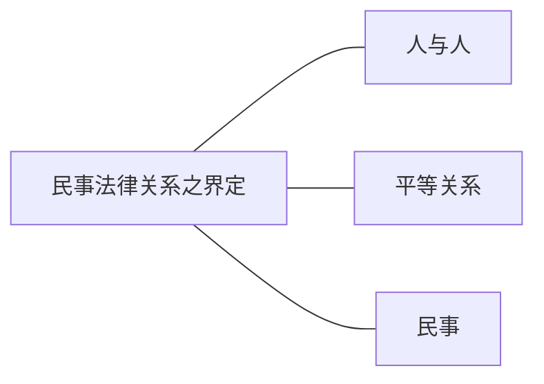

[[第一编 总则#^8g5wqw|民法典1]]
[[第一编 总则#^yb5ojv|民法典2]]
___

# 1.民事法律关系之界定

## （1）人与人→排除：人与无权利能力者
甲是家乐福的一个送货的工人，开车送货的路上不小心把乙撞了，是否符合人与人的定义？是两个自然人还是自然人和法人的关系？
家乐福是一个公司即一个法人，它的员工撞了人，首先发生的是法人和自然人之间的关系，同样也是人与人之间的关系。

家乐福向某公司采购了一批口罩，此合同是否符合人与人之间的关系？
符合，这是法人与法人之间的关系。

上海市人民政府向某公司买了100万只口罩捐献给伊朗，符合人与人之间的关系嘛？
上海市政府购买某公司的口罩符合人与人之间的关系，也是法人与法人之间的关系，上海市政府也是法人，但不是私法人而是公法人，公法人即按照公法产生的法人，私法人即按照私法如公司法产生的法人。

合伙企业与法人签订合同，是否符合人与人之间的关系？
法人与非法人之间的关系。

各种各样的组合都没有太大的问题
### 自然人
[[第一编 总则#第二章 自然人|民法典总则编第二章]]

### 法人
[[第一编 总则#第三章 法人|民法典总则编第三章]]

人与人的集合被法律承认为一个独立的主体，比如很多同学集合在一起做买卖，大家一起出钱批发口罩再卖出去，假设有100个同学欠约一起搞，签了一个合伙协议，债权债务属于这100个同学还是合作的1个组织体？
在合伙的情形，法律认为没有一个组织体独立于100个同学，最后签订的合同由100个同学直接承担。
当100个同学打算成立一个公司了，此时同样是一起做买卖对外卖口罩，有关的债权债务归属于公司，公司独立于其背后的100个同学，公司还不起债，100个同学不用继续还，独立于背后的个人的这个法律上的认定便是法人。
#### 法人之权利能力
[[第一编 总则#^mri6bm|民法典59]]
#### 设立中的法人
[[第一编 总则#^f3l3xs|民法典75]]
#### 清算中的法人
[[第一编 总则#^ar96h3|民法典72I]]
### 非法人组织
[[第一编 总则#第四章 非法人组织|民法典总则编第四章]]

也是100个同学合作起来做买卖，但没有采取公司的形式，而是采取合伙企业的形式，签合同合伙企业去签，签了之后不同于自然人合伙协议的形式下权利义务直接归属于这一个一个的自然人，而是合伙企业对外承担债权债务，但又不同于法人，没有法人的独立性，法人的形式下，公司还不起债，背后的100个同学不用继续还，合伙企业在合伙企业还不起债时，背后的100个同学要承担补充的清偿责任。
即合伙企业下，先由合伙企业承担债务，不足以承担再落到设立合伙企业的自然人。

### 人和物之间有没有可能产生法律关系？

金可可有一本书，金可可对这本书有所有权，为何不能说金可可和这本书之间有法律关系？为什么说民法调整的是人与人之间的法律关系？
从现象上看是人对物有所有权，具体为对物的占有、使用和支配
1. 法律保护对物的占有使用和处分，是保护金可可对这本书任意的占有、使用、收益、处分而不需要别人同意。占有、使用、收益、处分不需要经别人同意，如果需要别人同意就不能叫作所有权了，成为法律意义上的所有权，所有权第一个层次就是有权不经过他人同意任意的占有、使用、收益、处分。
2. 如果法律说，金可可可以占有、使用、收益这本书，但别人在金可可占有、使用、收益这本书时可以任意干涉他的权利行使，这也不是一个有效的所有权，所有权第二个层次就是在占有、使用、收益、处分的时候别人无权干涉。
3. 如果金可可可以不经别人同意占有、使用、收益、处分这本书，别人也无权干涉，但别人也有权不经金可可的同意占有、使用、收益、处分，所有权也不是一个有意义的所有权，所有权的第三个层次是未经所有权人同意别人不得占有、使用、收益、处分。

所以要成立一个有效的所有权，必须要划清背后的人与人之间的关系，人与物的表面关系核心还是在讲人与人之间权利范围的划分。

德国法学家为论证物权是人与人之间的关系，引用了《鲁滨逊漂流记》，鲁滨逊漂流荒岛，就不需要有所有权了，因为岛上就他一个人，都是他的。
### 人和动物有没有可能产生法律关系？
金可可有一只猫，猫[[民法总论之体系构成#动产所有权|在法律上被认为属于动产]]，与物在法律上没有太大区别，没有和动物产生法律关系的可能性，本质上还是人与人之间的法律关系。

观看该[马踢人的视频](https://haokan.baidu.com/v?pd=wisenatural&vid=5274269077471405453)，这个视频的情形会产生什么样的法律关系？
[[第七编 侵权责任#^f5vmpr|民法典1245]]，按照此法条，应该由动物的饲养人或管理人承担侵权责任。
被马踢是否是被侵权人故意或重大过失（拍马屁股）造成？就拍马屁股这件事这个动作是故意的，但是民法上考虑[[故意]]或过失不是动作是否是故意的，而是权益被侵害的结果是否是故意的，如果按照动作是否故意，那么民法上就几乎没有过失了，因为绝大多数动作都是行为人有意识的去做的，但是有意识去做的动作和损害之间的关系才是民法上所讨论的故意，即故意与过失指向损害发生的结果。被侵权人有意识去拍，但不想被踢，所以不是民法上的故意。
被侵权人是[[过失]]还是重大过失？一个正常的人都能预见到的风险，而行为人没有预见到，这个时候一般认定为重大过失；正常人预见不到被踢的风险，但某一个专门养马的专家可以预见，该专家按照常理应该预见（[[民法专著/王泽鉴九阴真经/侵权行为/第二编 一般侵权行为/民法第184条第1项前段—故意或过失不法侵害他人之权利/过失#（二）善良管理人的注意：类型化的客观归责|善良管理人之注意]]），但这次居然没有预见被马踢，这个时候为普通的轻过失（[[抽象轻过失]]）。
本案很有可能构成受害人的重大过失，从而减轻甚至不赔偿。
本案尚有一个问题，闹市区是否允许骑马？马的出现本身也有违法性，未必能够全部免责。（[[第七编 侵权责任#^r8aky0|民法典1247]]）
马踢了人，产生的是动物管理人或饲养人要不要赔偿受害人的法律关系，也是人与人之间的关系。 ^pxtyo9

人持刀刺伤马，如何处理？
产生的是刺马之人与马主人之间的法律关系，即刺马之人是否需要赔偿马主人，侵害的是动产所有权。

在英美法系没有特别重视人与人的限定，[老佛爷的猫](https://baijiahao.baidu.com/s?id=1705501425343048241&wfr=spider&for=pc)在美国有个老太太，去世之前立了一个遗嘱，遗嘱说所有的财产不给任何一个子女，都给自己最喜欢的小猫咪，这个遗嘱在美国有效，但在中国的法院一定无效[^1]，在中国法律上动物为[[民法总论之体系构成#动产所有权|动产]]，不是人，不享有权利能力，不可以作为法律关系的主体。（[[第一编 总则#^thda5j|民法典13]]、[[第一编 总则#^g6okk9|民法典15]]）无效之后应该如何处理？既然遗嘱无效就按照法定继承处理。假设老太太遗嘱说，2/3在儿子之间按特定比例分配，剩下的都给猫，遗嘱的效力为给猫的部分无效，该部分遗产按照法定继承处理。

[^1]:此无效并不涉及公序良俗。

老太太去世前特别想把遗产留给猫，在中国法律框架下该如何？
（1）[[第六编 继承#^t8g22s|民法典1144]]，在遗嘱或遗赠中附带遗产特定比例用于照管猫的义务。
（2）信托，专门找一个负责管理这笔遗产的人，这个管理人按照老太太事先指定的方法管理这笔财产，比如说这笔遗产多少比例用于照管猫，多少比例用作管理人的报酬，也可以指定猫生了小猫，遗产继续用于照顾小猫。
（3）设立基金会，基金会为财团法人，老太太捐助一笔钱，这笔钱本身在民政部门登记后变成基金会，本质是一笔钱，经过法律的认可后变成一个法人，这个基金会需要有章程（在捐助申请中写明）、工作人员，章程决定未来这笔钱该怎么用，所有执行老太太遗愿的人都叫财团法人的雇员。（[[第一编 总则#^r40g3h|民法典92]]、[[第一编 总则#^ez7vxo|民法典93]]）专门为一只猫设立基金会是否可行有待探讨，因为基金会法人一般具有公益性。
## （2）平等关系→排除：命令、服从法律关系
>（1）甲身强力壮，殴打体弱多病的乙，民法管不管？身强力壮对体弱多病是否平等？
（2）金可可对杨天宇同学说“小杨啊，你这手机不错，多少钱买的？”杨天宇答“5000元。”金可可说“老师看中了，50元卖不卖，不卖挂你科。”杨天宇被迫无奈50元卖掉手机，民法管不管？老师与学生之间是否平等？
（3）金可可去家乐福买东西，发现家乐福购买凭据写明“本店售出商品一律不退不换”，金可可认为违反消费者保护法，前往收银台与收银员争论“你们这样是不对的。”员工看了金可可一眼说“你买不买，不买就走，买就按这个条件来。”金可可想了想还是买了。金可可与家乐福是否平等？
（4）金可可在高铁站，还未检票，金可可烟瘾发作，跑到窗户边把头伸出去抽了几口烟，被管理人员发现，要对其罚款，金可可说“你太过分了，我才抽两口你就要罚款。”管理人员还是要罚，金可可问“罚多少？”管理员答“50元。”金可可讨价还价“30元行不行。”，最后罚了30元。民法管不管？高铁站与金可可是否平等？
（5）税务机关对金可可发出通知“今年你要缴纳7万元税款。”金可可说“你们的税收太多了。”民法管不管？
（6）警察在路上发现小偷并追捕，警察说“站住！”小偷跑得更快了。民法管不管？
^dxcmm0
### A.判定标准：应然的权利、义务关系
上述[[民法之调整对象#^dxcmm0|案例1~3]]为事实上力量关系的不对等，身强力壮的欺负体弱多病的、老师利用批阅试卷的权利欺负学生、家乐福店大欺客（无磋商余地，想买就买不想买就走），但此事实上的不平等并非法律所认可的应然的不平等，无论事实上再不平等，在法律认定上都是平等的，理由在于一方对另一方没有命令的权利，他方对一方没有服从的义务，从应然的关系而论这就是平等的。

身强力壮之人没有殴打体弱多病之人的权利；老师有批改学生试卷的权利，也有命令学生写作业在限定时间提交的权利，但没有以此来低价购买学生手机的权利，就本案手机买卖事件老师没有命令的权利，学生没有服从的义务；家乐福没有命令顾客服从该“本店售出商品一律不退不换”条款的权利，顾客也没有服从该条款的义务。

[[民法之调整对象#^dxcmm0|案例4]]中，高铁站有罚款的权利，管理员罚款的通知一说出口，金可可听到，这个行政行为就发生效力了，金可可的财产之上就产生一个罚款的债务，即将罚款上交国库的义务，这个义务不履行金可可就会受到惩罚，金可可必须服从该命令。

[[民法之调整对象#^dxcmm0|案例5]]中，金可可不可以和税务机关讨价还价，纳税机关的通知一到达金可可处，此行政行为即发生效力，金可可就有了纳税的义务.

[[民法之调整对象#^dxcmm0|案例4、5]]都是职权机关有命令之权利，金可可有服从之义务，金可可若就是不交罚款，拔腿就跑（税款跑不掉），后高铁站也找不到金可可，虽然事实上没有服从职权机关命令，但不意味着职权机关与金可可就平等了，因为从应然的角度而言，金可可还是必须得服从，职权机关有权命令。

[[民法之调整对象#^dxcmm0|案例6]]，小偷事实上并不会服从警察“站住！”的命令，但不意味着警察和小偷之间平等，按照法律规定小偷有服从警察的义务。
### B.辨析
#### 职权机关之民事行为
公安局夏天要给员工发防暑用品，所以去家乐福购买20箱花露水，这个属于民法管嘛？
公安局可以履行行政职权，虽然手上有行政职权，但购买花露水与行使行政职权无关，买卖的过程中没有运用行政职权，在没有行使行政职权时并无命令服从之关系，在此情形下双方是平等的，到底是不是民事关系不看主体本身有无职权，而是看具体的法律关系中是否在行使职权。
#### “不平等”的民事法律关系？
[[第三编 合同#^y1flw9|民法典922s1]]、[[第七编 侵权责任#^sk7ygz|民法典1191I]]、[[第七编 侵权责任#^ofravf|民法典1192I1、3]]、[[第七编 侵权责任#^9qqk0b|民法典1193]]

>承揽人不需要服从定作人的指示，只就工作结果负责，因为正是定作人自己做不好才会找承揽人。

>用人单位和用人单位的工作人员的关系是劳动合同关系，劳动合同的“不平等”关系比雇佣合同更为严重，具有长期性。

[[第七编 侵权责任#^sk7ygz|民法典1191I]]、[[第七编 侵权责任#^ofravf|民法典1192I1、3]]的共同点在于都有命令服从的关系，用人单位工作人员有服从用人单位指示命令的义务，雇员有服从雇主的义务，正因为这两种情形都需要服从指示，所以用人单位的工作人员和个人雇佣的雇员在执行劳动和工作任务的过程中造成别人损害的%%侵权%%，由单位和雇主承担责任，至于事实上有无指示在所不论，在法律上应该%%应然%%接受指示已为足矣。

[[第七编 侵权责任#^9qqk0b|民法典1193]]是因为从法律的应然角度说，承揽人不需要听定作人的命令指示。 ^hpmq1w

雇佣、劳动合同等似乎存在不平等，民法为何还管？
现在不平等的局面是经由双方平等意思自治协商的结果，双方不签合同就不会有一方对另一方的命令权和他方对一方的服从义务，作为一个意思自治结果而产生的命令权，当然不影响民法的平等性，因为在合同签订之前并不基于法律产生应然的不平等的命令与服从。

##### 监护：不平等的民事关系？

 [[民法之调整对象#^u05rg3|最有利于原则]]（[[第一编 总则#^zl3ck7|民法典35I1]]）
非为其利益，不得处分其财产（[[第一编 总则#^zl3ck7|民法典35I2]]）

###### 1.行权之限制

仅得为被监护人之利益 ^u05rg3

不得超出必要限度（[[第一编 总则#^zl3ck7|民法典35I1]]）

监护人对被监护人有命令权，被监护人对监护人有服从义务。
你小时候想看电视，妈妈说不许看，要你做作业，法律上你有义务听你妈妈的，这是妈妈对你的监护权的内容，监护权里有一项内容是教育的权利，比较法上台湾叫作教养的权利（[[第1084条|台民1084]]），那么监护还归不归民法管？在监护当中，一方对另一方有命令的权利，被监护人对监护人有服从的义务，但是这是一个例外，如果这种命令与服从关系的出发点都是为了有服从义务一方的利益，这个时候本质上还是平等的，监护权的行使按照法条的规定只能为了被监护人的利益行使（[[第一编 总则#^zl3ck7|民法典35I1]]），比如父母可以打小孩，但必须在必要限度内出于特定教育纠正目的实施惩戒权，判断标注是是否为了被监护人的利益，教育理念不适当也是为监护人利益，但不得超过必要限度，打小孩打的很过分即便出于为了被监护人利益仍然构成侵权，打小孩打着玩不是为了被监护人利益，超出监护权范围，构成侵权。 

小孩%%被监护人%%被爸爸%%监护人%%，长期不正当殴打，假设妈妈也不管，小孩有何救济权？
警察抓不抓、民政部门管不管都不是民法范畴的，按照法条[[第一编 总则#^pb3j13|民法典34II]]，爸爸是要承担民事责任的，当然可以起诉，但小朋友该如何行使自己的正当权利？限制行为能力人起诉需要法定代理人代理起诉，法定代理人就是监护人即父母，可是爸爸是侵权人，妈妈又不管，根据[[第一编 总则#^9i0haa|民法典36]]，爸爸的行为严重损害被监护人身心健康，完全可以撤销监护人资格，指定其他监护人，换一个监护人就可以起诉了。

###### 2.义务性

生活中经常听到，一个小孩的父母去世了，结果他的亲戚都不愿意作其监护人，最后就监护发生争议而由法院指定，因为监护是一种责任性很强的义务，但是也会出现抢着当监护人的情形，因为监护人可以管理被监护人的财产。

致其受害（[[第一编 总则#^pb3j13|民法典34III]]）
比如爸爸养孩子，经常打着玩，后来了解法律发现不能打着玩了，就觉得养着没意思，开始放养式教育，结果一天小孩被一个20岁的男青年打伤了，谁承担责任？
当然20岁的男青年需要对小孩承担侵权责任，假设没有人打小朋友，小朋友在街上摔了一跤受伤了，监护人是否要对小朋友承担责任？[[第一编 总则#^pb3j13|民法典34III]]，监护人要承担责任。假设小朋友是被车撞伤了，谁承担责任？机动车驾驶人要承担机动车交通事故侵权责任，监护人没尽到监护职责，同样要对小朋友承担责任。

致其加害（[[第七编 侵权责任#^p8ugj7|民法典1188]]）
比如爸爸养孩子，经常打着玩，后来了解法律发现不能打着玩了，就觉得养着没意思，开始放养式教育，结果一天小孩把一个20岁的男青年打伤了，谁承担责任？
[[第七编 侵权责任#^p8ugj7|民法典1188]]，监护人承担侵权责任，假设监护人尽到了监护责任，比如爸爸知道不能打着玩，但也不能放养，于是把孩子每天关在家里不让乱跑，没想到小朋友挺有本事偷偷跑出去把人打伤了，这个时候可以说监护人尽到监护职责了，但根据法条，即便尽到监护职责也只是减轻侵权责任，可以看出监护权是一种很重的责任。
[[第七编 侵权责任#^xf05q3|民法典1189]]，监护人有事把小孩给临时监护人照管，临时监护人同样把小孩关住不让乱跑，临时监护时小朋友把男青年打伤了，受托临时监护的人不承担责任，还是监护人承当侵权责任。

##### 形成权之行使

[[民法学习概论#^ns10j0|蛋饼案老板不能抵销]]，假设案情是老板要求抵销6元蛋饼钱给65元，同学不同意，一定要老板给71元，再给老板6元，同学可以不同意，但并不是因为同学不同意所以老板不能抵销，而是因为老板的故意侵权导致抵消权被排除，老板本就没有抵销权；但如果对调，是同学要求抵销，让老板给65元，老板不同意，一定要先给同学71元，再让同学给6元，老板的不同意无效，提出抵销的同学没有故意侵权，抵销权没有排除，抵销权是形成权，同学话一出口，老板一听到，老板的债务就从71元变成65元了。

在故意侵权的情形下，故意侵权的一方不能抵消，是不是很不平等呢？
双方并不是真的不平等，在侵权行为发生前双方是平等的，一方没有命令权另一方没有服从义务，因为对平等法律关系的侵害所产生的后续的一切不平等法律关系实际上都是平等法律关系的结果。

所有有命令、服从的法律关系，都属于公法的管理范畴，比如行政法、刑法、诉讼法，公法除了个人对有关机构的服从还有机构对机构的服从、命令，比如上海市政府有命令松江区政府的权利，松江区政府有服从的义务，某个政府的处的公务员需要听从处长的指示，这种上下级的命令与服从也属于公法管理。

## （3）民事→排除：因职权或主权之平等关系

上海市政府没有命令江苏省政府的权利，上海市政府和江苏省政府的关系是平等的，这个关系民法管不管？
双方%%机关法人%%的平等关系是职权划分上的平等关系时，也不属于民法管理的范畴，民法只管非职权之间的平等，同样属于公法管。

中国没有命令美国的权利，美国也没有服从的义务，双方的关系是平等的，这个关系民法管不管？
因主权产生的平等关系也不属于民法管理范畴，至于特朗普觉不觉得中国和美国平等，那是他自己的感觉，按照国际法%%从应然角度%%双方是平等的。

是否是公法看是否与职权、主权相关，或是因职权产生的命令与服从关系，或是职权与职权、主权与主权之间的平等关系，即有没有行使职权、主权，以及是否因职权主权产生平等关系。

## （4）归纳
![[民法不调整什么]]

## （5）争议类型
### 行政协议（[[中华人民共和国行政诉讼法#^gdawwm|行诉法12INr.11]]）：[陈宏等诉张芝山镇案](https://www.legalai.cn/detail?id=d4e8a57c-2044-4b00-b53e-7a29fa3eae81&title=%E6%B1%9F%E8%8B%8F%E7%9C%81%E5%8D%97%E9%80%9A%E5%B8%82%E9%80%9A%E5%B7%9E%E5%8C%BA%E5%BC%A0%E8%8A%9D%E5%B1%B1%E9%95%87%E4%BA%BA%E6%B0%91%E6%94%BF%E5%BA%9C%E4%B8%8E%E9%99%88%E5%AE%8F%E7%AD%89%E6%8B%86%E9%99%A4%E8%BF%9D%E6%B3%95%E5%BB%BA%E7%AD%91%E8%A1%8C%E6%94%BF%E7%BA%A0%E7%BA%B7%E4%B8%8A%E8%AF%89%E6%A1%88%E2%80%94%E2%80%94%E4%B8%BA%E6%8B%86%E9%99%A4%E8%BF%9D%E6%B3%95%E5%BB%BA%E7%AD%91%E8%AE%A2%E7%AB%8B%E7%9A%84%E8%A1%8C%E6%94%BF%E5%8D%8F%E8%AE%AE%E7%9A%84%E6%95%88%E5%8A%9B&keyWordInDoc=&annoTitle=&annoId=)

行政法上也会签合同，是行政法管还是民法管？
陈宏等人因为历史原因违章占有一块土地造了一个厂房，当时没有审核制度，现在审核制度严格了，要拆违章建筑，任务落在了张芝山镇上，陈宏一家在当地比较有名，不大好惹，张芝山镇强拆觉得心里忐忑，所以与陈宏一家达成协议“陈宏一家主动拆掉违法建筑，拆掉之后给予一定的赔偿并给另一块合法的地皮。”双方谈妥后镇政府盖章，陈宏一家拆除工厂，镇政府反悔，说“我本来就有权拆你的，我不给你赔偿，会导致国有资产无理由流失。”陈宏一家问“那说好的地呢？”张芝山政府答“按照法律规定给你地皮需要省政府批准，我没法给。”陈宏一家愤然起诉到法院。
本案虽然看似平等协商的结果，但是属于行政协议，应该归行政庭管，事实上也是行政庭管的，虽然是以平等的方式解决了一个问题，但是这个问题本身是行政职权行使的替代，德国通说为用来替代行政权行使的协议为行政协议。
判决书说了一点“虽然看起来国有资产确实流失了，但是比起政府不守信来说，这个损失是小的，长远来看，一个政府诚实守信才是一个社会长治久安之道。”

政府采购合同（[[中华人民共和国政府采购法实施条例#^oa6k28|政采法43]]、[[中华人民共和国政府采购法实施条例#^7uc3d1|政采法50]]）？
政府采购口罩，比较法上有两种立法模式，其一，认为政府采购更多是行政法上的内容，政府在采购中有一些特权，和政府签约之后，供应商没有违约的余地，政府说要，就可以强制执行拿过来，并且政府有解约的特权，所以认为应该用行政法来管；其二，认为上述政府特权不合理，按照平等的民事买卖关系处理。
我国的处理涉及当年行政法学界和民法学界的大辩论，最后民法学界获胜，金可可认为归入民法不合理，因为有行政职权替代的性质，我国政府采购合同按照民事法律关系处理。

政府特许经营协议？
政府把高速公路造好了，包给一个机构运营；政府造了一个游乐场，包给其他单位经营。这类合同的限制目前还很有争议。

公立高校与学生：[于艳茹诉北京大学案](https://www.sohu.com/a/161146333_683950)
要区分不同的情形，如果涉及到教学的管理、学位的授予、奖学金的评定、打卡制度、学籍的教学管理有关事项，这些都是按照行政法律关系处理；到食堂就餐、在宿舍住宿都是按照平等的民事主体法律关系处理。
于艳茹在获得学位后发表论文时被某个期刊举报其论文抄袭，北京大学没有听取于艳茹申辩，作出撤销学位的处理，于艳茹以没有给出申辩机会起诉。于艳茹败诉。

高速公路收费？
一个人开车上了高速公路，后在高速公路行驶过程中因山体滑坡导致受伤，此时按照什么民法还是行政法起诉？
有人认为高速公路收费系属国家职权的行使，应该按照行政法起诉，被否认；高速公路收费是民事法律关系，因为收费形成了合同。

### 土地和房屋的征收（[[第二编 物权#^e4tnkb|民法典243]]）

国家的征收权，通知一生效，抗议也无效，土地所有权和房屋所有权就消灭了，就已经归国家了，与此相类似的还有征用，征收是终局的征收所有权，征用用完了还要还。

土地征收后需要足额进行补偿，这个补偿本身是否属于平等法律关系？
存在争议，现在通行的学说认为，征收本身属于行政行为，而征收后的补偿、赔偿为平等的民事法律关系。（两阶段说）
补偿有标准，但也是双方可以协商的。

# 2.民事关系→民事法律关系
（因法律之调整，平等主体间以民事权利义务为内容之关系）

甲周六8点要去人民广场，乙恰巧也要去，于是甲乙约定周六7点在某地汇合拼车，后甲忘了这件事情，这个民法不管，这是典型的情谊行为%%好意实惠行为%%。

受法律调整之前的民事关系和受法律调整之后的民事法律关系有什么差别？
普通的民事关系没有法律上的权利和义务，调整后的民事法律关系有法律上的权利和义务。

# 3.民事法律关系之特征

## （1）具备民事关系之特征
人与人之间
因民事
平等
## （2）法律关系：法律拘束力
权利→请求权
义务

甲男乙女谈恋爱，乙女失业，甲男有没有给乙女扶养费的义务？
没有法律调整，不归民法管，不产生民法上的请求权。

甲男乙女是夫妻，乙女失业，甲男有没有给乙女扶养费的义务？
此时甲男有义务支付扶养费（[[第五编 婚姻家庭#^6gxhtr|民法典1059]]），法律关系主要体现在权利义务，主要是请求权的发生。 

# 4.民事法律关系之要素：主体、客体与内容

## （1）主体：详上“民事关系”部分

### A.概念：享受民事权利、承担民事义务之“人”

权利主体

义务主体

### B.（自然）人，是民法的目的！

## （2）客体（权利标的、权利对象）

### A.概念：权利（义务）指向对象
### B.各种权利之客体

#### 物权→物

#### 债权→人之行为=给付
甲卖给乙一本书，甲对乙的债务是作出把书给乙这个动作%%给付%%的行为。（[[第三编 合同#^ut8m6i|民法典598]]、[[第三编 合同#^an1kf7|民法典626S1]]、[[第三编 合同#^au4pv2|民法典703]]）

#### 知识产权→精神创造/非物质存在

某甲7岁，某日诗兴大发，在一张纸上，给女同学乙写了一首情诗。
甲可以取得著作权嘛？
7岁之甲没有行为能力，为无民事行为能力人，无民事行为能力人写了一首情诗，行为能力的适用范畴为法律行为以及部分准法律行为（意思表示），通过创作取得著作权，创作是个事实行为，事实行为不适用行为能力制度。

著作权客体是什么？
思想情感的独特表达方式，如果著作权保护的是内容，那么相同内容别人就不能写了，也不是思想情感本身，7岁甲对乙所表达的情感是“我喜欢你”，如果保护的是思想情感本身，除了甲别人都不能有喜欢这种情感了，这是不可能垄断的。
甲爱乙，丙也爱乙，法律只保护表达的方式，并且这种表示还必须独特、有创造性。（[[中华人民共和国著作权法实施条例#^1bu1nc|著作权法实施条例2]]、[[中华人民共和国著作权法#^xf1z1g|著20]]、[[第三编 合同#^xov74w|民法典600]]）
这种受著作权法保护的独特的表达方式叫作作品。作品和作品的载体是不同的概念，作品的载体是物权的客体。（[[中华人民共和国著作权法#^xf1z1g|著20]]）

#### 人身权→人格利益、亲属利益

#### 准物权→财产权利/非特定之物

权利质权和动产质权的差别在哪里？
支票质押，交付权利凭证支票票据，质权人之所以愿意接受质押，显然不是这张纸本身的价值，真正值钱的是支票所承载的对银行的债权，所以支票质押实际上是票据上的债权的质押，支票质权的客体是债权，不是以物作为客体而是以某个权利作为客体的就是准物权，以知识产权质押同理。

#### 继承权→被继承人全部财产（遗产）

## （3）内容：主体所享有之权利、负担之义务

# 5.财产关系
## （1）财产
物质性财产
非物质性财产
## （2）财产关系：静态——动态
## （3）特征：原则上之非专属性+直接经济价值

非专属性：可以转让

直接经济价值：转让过程中可以卖钱，用金钱进行评价

人格权则具有专属性：例如生命权不可转让，人死权灭；医疗实验试吃药物不是对健康权的放弃，医生充分告知试吃药物的风险，试验者签字，生命权、健康权依旧在，第三人侵犯生命权、健康权依旧构成侵权，医生告知不充分不明确导致生命权、健康权受侵害依旧构成侵权。卖两颗肾，生命权、健康权也依旧在，对方要求履行合同，卖肾者不愿意履行，对方把其抓走摘肾，依然侵犯身体权、健康权、生命权。人格权不因上述合同的签订被减损。

### A.专属性/非专属性：权利及其使用，能否与主体相分离

#### “生离”
##### 权利本身：移转？抛弃？
某甲有A书，某甲生时有这本书的所有权，在某甲活着时，其可以转让%%无论有偿还是无偿%%该书、抛弃该书。
##### 权利之使用：许可他人使用？
甲也可以把这本书租给别人、借给别人用，权利的使用本身可以和权利以及权利人相分离。
#### “死别”：消灭←→继承？
某甲死亡，权利若随之消灭，说明该权利专属于某甲；某甲死亡，该权利不消灭，而由后代继承，说明该权利非专属。即“死别”意义上的专属性和非专属性，“死别”的意义上所有权也是非专属权。
### 直接经济价值：能否直接以金钱评价

#### 权利之移转
把书的所有权移转给别人，可以收钱，不违背善良风俗亦无法律上其他禁止规定，所以有直接经济价值。

债权之转让也是同样，乙欠甲500万元，还有一个月届满，甲着急用钱，把债权转让给丙，480万卖出，在债务期限届满前，债务人已经有了债权，丙取得债权的时间为债权转让合同生效之时，[[第三编 合同#^v8stoc|民法典546]]所称的“通知债务人”是债权让与对债务人生效的要件，未经通知，债务人乙是不知道债权人已经变成了丙的，若未通知乙，乙将甲作为债权人的给付有效，不需要再向丙给钱，即保护善意的债务人。丙因为乙误向甲付钱的行为导致了丙的债权消灭，丙可以向甲主张不当得利，甲没有债权却受领给付，没有法律上的根据。若已经通知，乙仍然要向甲付钱履行债务，此时乙并非善意，丙的债权并未消灭，乙还需要再向丙支付金钱，乙不可以向甲主张不当得利，乙并非赠与甲金钱，甲虽然构成不当得利，但乙明知非债而清偿排除不当得利请求权（[[第三编 合同#^el18x2|民法典985（三）]]），立法目的为“不能调戏法律”，明知不必给钱而非要给，给了又要要回去，这样是会浪费司法资源的。

[[第三编 合同#^155873|民法典545]]，债权可以让与。

债务可以让与%%债务承担%%，但需要征得债权人同意，理由是不同的债务人还钱的能力不一样，债务转让不能影响债权人的利益（[[第三编 合同#^xgg356|民法典551I]]）；债权转让不需要征得债务人的同意。

债权与债务可以一并转移给第三人。（[[第三编 合同#^7r0kk9|民法典556]]）

#### 权利之使用
把书的所有权不彻底给别人，只是把使用权能移转给别人，可以收钱，不违背善良风俗亦无法律上其他禁止规定，所以有直接经济价值。

# 6.人身关系
## （1）种类

### 人格关系：以人格利益为客体

### 身份关系：以身份利益为客体
身份权上的精神利益不可抛弃、不可转让，甲乙为夫妻，甲表示要乙对自己的忠诚义务或同居请求权，这是无效的，悖于善良风俗，可以在事实上不行使，但是抛弃不掉。

身份权上的财产利益比如抚养费请求权，不能抛弃，可以事实上不行使，也不得转让。比如甲乙为夫妻，乙失业，乙对甲的扶养费请求权不得转让给丙。
## （2）特征：原则上（[[民法之调整对象#^rorute|例外]]）

### 专属性

在“死别”意义上，人死权灭。

### 无直接经济价值

- [[民法之调整对象#附录：人格权之体系]]
	- 凡是没有高亮的权利，都是无法从生理层面转移给别人，被判处死刑是依法剥夺生命权，一旦生命剥夺成功，这个主体的生命权就没有了，但是没执行死刑时生命权依旧存在，期间被狱友击杀依然侵犯了生命权。
	- 凡是没有高亮的权利，也是无法抛弃的，自杀与生命权的区别是自杀是剥夺自己的生命，但在剥夺之前一直是有生命权的，甲欲自杀，写了遗书“我自愿抛弃生命权”，跳入河中，天冷，不想死了，往河边游，热心市民乙路过看见遗书，阻挠甲上岸，乙侵犯了甲的生命权，遗书中的抛弃生命权意思表示没有效力。
	- 注意上述二例都是行为人死亡之前仍然有生命权，执行死刑、自杀完成都不是生命权消灭的原因，而是因为死亡丧失权利能力进而丧失生命权。

名誉权可否抛弃？金可可修习佛法，开始“忍辱”，对学生说，都来侮辱我，我抛弃名誉权了，金可可的名誉权依然存在，侮辱、诽谤者依旧构成侵犯名誉权，仅仅是金可可放弃了对侵犯名誉权后的救济。能不能预先抛弃侵犯名誉权的救济也有争议，预先抛弃认定无效的情形下在判决时会考虑减轻对方的损害赔偿责任，因为毕竟是金可可诱发他人侵犯自己的名誉权，构成与有过失。

生命权和身体权、健康权等同样无法许可他人使用，比如拿光头做广告在法律上认定为无效。卖淫也是无效的。献血是分离身体一部分为物再给别人用。卖肾也是无效的，根据人体器官移植条例，器官只能无偿捐献（[[人体器官移植条例#^37e0qn|器官移植条例7]]）。身体许可他人使用的合同所产生的身体使用债务永远不会发生，不会有强制执行力，签了卖肾合同也不能在对方违约之时强行或诉诸法律强制执行该合同。

姓名、肖像、声音语言人格利益可以拿来做广告，甚至一定程度上隐私权也可以商业利用（在使用上没有专属性），比如明星贩卖自己的隐私接受记者的有偿访问，个人信息也是同理。
可以做商业利用的上述人格利益，如姓名权、肖像权都是不能抛弃的，只能抛弃救济的利益，改了新的姓名也还是原来的姓名权，只是原来的姓名不再是你的姓名。

人格上的财产利益在主体死亡后怎么处理？比较法上有不同的立法模式，有的国家认为按照继承处理；有的国家认为与人格相关不许继承，但是就肖像等的保护由近亲属代为行使。

## 附录：人格权之体系
### （1）人格之各种构成要素→具体的人格权
A.物理存在类：生命、身体、健康
B.辨识性存在类（标志类） ：==姓名、肖像、声音语言人格利益==
C.外界评价类：名誉权、荣誉权、信用权
D.私人空间类：隐私（权）（含==个人信息==）
E.具体的自由权类：身体行动自由权、婚姻自主权、贞操权
F.其他具体人格权；==著作人格权==

人格权包括纯粹的无财产内容的人格权，这是人格权上纯粹的精神利益，另外一部分是人格上利益可以用作商业利用，为人格权上的财产利益。
1. 人格权上的精神利益具有绝对的专属性，活着的时候权利本身既不能移转也不能抛弃，权利也不能给别人使用，死亡权利即消灭。
2. 人格权上的财产利益在权利本身和个人的关系上绝对不可能分离，但权利的使用可能产生分离，死亡时权利有可能继承，这取决于各个国家的立法。人格权只有在许可他人使用的意义上可以用金钱评价。 ^rorute
### （2）概括的人格权：人格尊严、人身自由（民总112、精赔解释IN.3）→必要性证明：个人形象之公开扭曲/死者亲属之孝思

___