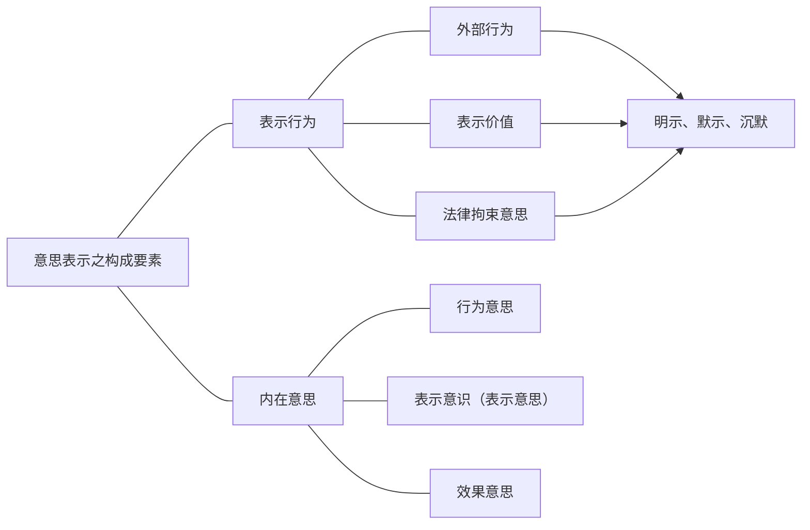
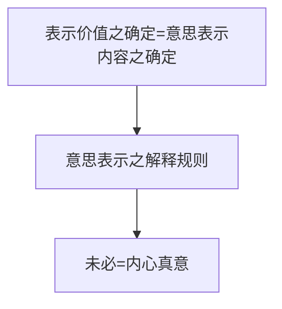

# （一）概述
接下来我们看意思表示的构成要素，构成要素就比较重要了。我们把意思表示的构成要素分成内部和外部：

一个意思表示（前面讲过了），必须有一个把意思表达在外部的行为。这个行为称为表示行为。

- 看到这个表示行为这个概念之后就要知道了，在民法上，在两个地方讲到表示行为，含义有所不同：
	1. 第一个表示行为是在法律事实里面，法律事实的行为分为适法行为和不适法的行为（违法行为）。适法行为里面又分成表示行为和非表示行为，含义是：表示行为一定是以表示为要件的，非表示行为不以表示为要件（也叫事实行为）。表示行为又分为法律行为（意思表示）、准法律行为。那是法律事实中的表示行为。
	2. 第二个表示行为就在这里讲：作为意思表示一个构成要素的表示行为。刚才讲到意思表示非得有一个表示于外部的行为，这里所说的意思表示的外部构成要素，也叫表示行为。

其次，他不仅有表示行为，而且意思表示通常来讲，有3个内心的要素使他成了一个意思表示。表示行为（外面有个行为）、内在意思（内心有个意思）。把意思表达在外面的行为，叫表示行为，两个是一个有机的结合。

表示行为里面又有3个必不可少的构成要素，内在意思里面又有3种不同的心理上活动（3种成分）。这3种成分在一个正常的意思表示中都是具备的。这些要素都在讲什么？讲完了之后再回头看，是不是有必要搞得那么复杂，这些是不是我们这些搞法学的人没事儿干，硬要给他创造一个复杂的体系。讲完了就明白了，绝对不是没事干，里面每一个概念都在解决法律实践中碰到的问题，缺了这个概念就解决不了。抽象地讲没意思，我们具体往下讲。
# （二）外部客观要件：表示行为
## 1.概述
- 意义→意思表示[[意思表示之构成要素#^fqvyib|是否存在]]
- 功能
	- 发出：内→外→脱离 ^fqvyib
	- 到达：相对人之了解可能性

## 2.构成要件
- 外部行为
	- 未停留于内心
	- 脱离表意人之支配：[[意思表示之构成要素#^za63ek|发出]]
- 表示价值：可推知行为人之效果意思
- 法律拘束意思：可推知欲受法律上拘束 ^za63ek
### （1）外部行为
#### A.未停留于内心
- 脑电波案
	- A特别喜爱B的一个收藏品（一个挂件）。A非常想要B的挂件，于是，A来到B面前，不停地向B发脑电波（不好意思直接说，所以只好发脑电波），“5w块卖给我好不好，5w块卖给我好不好”，这是不是意思表示？为什么？
		- 不是；没有表示行为。凭什么没有表示行为？——因为没有外部的任何动作。纯粹停留于内心想法，绝对不会构成外部行为。表示行为需要一个外部的动作，他没有外部的动作，纯粹停留于内心，不行。
		- （脑电波在现行技术下不能作为外部行为；但在某一天，脑电波同样能让对方清楚地感受到表意人的意图、意愿，那么当然，那一天就成了一个表示行为了，现在做不到）

- 沉默
	- 甲向乙发出要约，欲以500元购买乙之某书，要约载明：“接信后祈于两周内回复，届期未复，视为承诺”。乙接信后，深思数周，未予回复。
		- 甲对乙的要约是否构成表示行为？——当然构成。都叫要约了，当然构成意思表示，要约是典型的意思表示。
		- 但乙的行为是否构成承诺？——不构成。乙没有外部动作，这种“不作为”，我们称为沉默。
		- （不是“真正的不作为”。什么都不做，法律上不能叫“不作为”，只有一个有作为义务的而不做，才能叫不作为。本案中，乙没有义务做回复（法律既没有规定，当事人也没有约定）。所以没有回复的义务，不能叫不作为。但是在意思表示的表达方式里面，我们可以称为沉默，什么都没做，叫沉默）
		- 这里的沉默，不能构成承诺。为什么不能？——因为没有行为。我再举个例子对比一下：A来到B前面，深沉的看着B，没有说任何话，能不能理解为要约？不能，因为没有外部行为。
		- 同理：B向A发个要约，A意味深长地看着B，没有说话，是承诺吗？
			- 不是，因为沉默原则上都不算是一个外部的行为。什么都没说、什么都没做，外部行为都没有，即使在特定情形下，沉默被理解为特定的行为，但沉默的含义很难确定：意味深长的看着甲，到底是同意接受要约还是不同意，看不出来。
			- 所以“接信后深思数周未予回复”，实际上他的内心意思是什么不知道，也没有通过一个外部行为表达出来，所以这个时候他不会构成承诺的，外部表示都没有（在本案中）。
	- 甲、乙约定，接到对方要约后，应于两周内回复，若不回复，视为同意要约。后甲向乙发出上述要约，乙深思数周而未复。这个乙深思数周而未复，是不是承诺？为什么？
		- 是，是的原因是两个：他由于有回复的不真正义务（按照约定2周内应该回复），这个约定给乙设定了一个不真正义务，不真正义务的内容是：如果你不回复的话，自己倒霉，就是视为同意要约。不管你心里怎么想的，都按照要约的同意，按照承诺来，这是典型的不真正义务（概念要随时串起来）：是一个照顾自己利益的义务，你不做，不会让别人有损害赔偿请求权，你不会害到别人，但是不做会害到自己，做了对自己有好处。
		- 即然乙有了一个不真正义务，那么他的什么都不做，就构成不作为了。现在是违反了约定的义务，所以他什么都不做的行为，可以理解为不作为，它就变成一个外部行为了。
		- 变成了外部行为，这个外部行为的含义能够确定吗？——通常情形，没有特别约定，这个沉默这个外部行为，它的含义是确定不了的。因为含义过于丰富。沉默是金指的是：沉默想要表达的含义千千万万，对方自己琢磨。
		- 现在，对这个沉默本身的意义，双方已经约定过了，就应该按照双方的约定来理解这个沉默的含义了。沉默的含义固然有千千万万种可能，但是在这个情形中，就按照双方的约定来理解，就是：同意要约，构成承诺。所以，因为约定了回复的义务，沉默就构成了外部行为，而且沉默的意义，含义确定。
#### B.脱离表意人之支配：发出
##### （A）未投递之信件案
- 再往下看：甲起草信件，内容为欲以500元购买乙之某书，信件写毕，置于办公桌上尚未装入信封、投邮。乙恰因公事来访，见甲桌上信件内容，大喜而承诺之。
	- 合同成立吗？——合同成立不成立取决于有没有要约，有没有承诺。问题在于，甲信写好了，已经放在办公桌上了，这个时候被乙看到了，甲的信算不算一个有效的要约？——如果算一个有效的要约，那么乙说的很清楚，“我买了”，乙的行为肯定是承诺，关键是甲的是不是要约。如果甲的是要约，乙的肯定是承诺了。
	- 现在问，甲有没有纯粹停留于内心？——甲想用500块买乙的书，他并没有纯粹停留于内心，而是做了个外部行为了。信都写好了，只是没装入信封，没投邮而已呀。现在问，这个时候构不构成意思表示呢（构成意思表示就是要约）？对已经有个外部的动作了，信都写好了，为什么不构成要约？有没有表示行为（有表示行为再分析他有没有内心的要素）？
	- 本案中的结论是，他不是意思表示，所以不是要约。为什么不是意思表示？——因为他还没有表示行为。明明有个外部的动作了，但还不算表示行为：尽管有个外部的动作了，但这个时候，意思表示的外部行为构成与否，要取决于这个表示的载体（表示的内容）有没有脱离表意人的支配。如果他还在表意人的控制范围内，这个时候虽然对表意人来说是外部行为，对于相对人来说，仍然是在表意人的内部，也不算外部行为。
	- 那么这个表意人支配范围的脱离，法律上有个术语，叫“发出”。本案中，其实甲还没有发出自己的意思表思，没有发出意思的表示，我们就说，表示行为还没有。他只是把内心的意思写到了外面的一个载体上面，这个叫“表示的做成”（做成了表示载体，但是还没有发出）。一发出，我们说这个时候就是属于外部行为。这第一点要理解，不是说他内心表达出来就是外部行为，还需要脱离表意人的控制，脱离表意人的支配（判断标准是发出。什么是发出以后再讲）。
	- 但是有一点应该看出来，判定发出有一个至关重要的点是什么？本案中为什么说甲还没有发出？还不是外部表示？——因为甲还没作最终的意思决断。所以说，发出的一个判定标准实际上就是最终作意思决断的一个点就是发出的点。什么情况下是最终作意思决断的点呢，我们假设一下：甲拿了这封信，走到邮局，塞到邮箱的邮筒。塞进去的那一刹那，就认为他是一个终局的意思决断了。而就在那个点，就是这封信脱离了他的支配范围，这两个点是合一的。通常情形下，终局的意思决断，就是这个表示脱离他的一刹那。
##### （B）对话
- 再举个例子：A对B说，“我这个挂件卖给你好不好，5块钱”，什么时候算有外部表示了？
	- 同样用的是要看发出的时间点：A的话一说完，这句话就脱离A的控制了，听不听得到是他的事了，A已经控制不了了。那个时间点就是发出了，那个时间点A的表示行为、外部行为就已经有了。
	- 脱离A的控制范围和A终局的意思决断往往是合一的，而那个点让A的外部行为成为了表示行为。

>Frage 1：信件发出之前不是可以追回吗？——Antwort1：对呀，这叫什么现象？

- 信件发出了，但是后面可以叫快递说，“你回来，不要给了”，这叫什么？
	- 既不是撤销，也不是撤回。为什么本案不是撤销？——还没到达B处。为什么不是撤回？不是还没到吗？——因为有个特征不对：无论是撤回还是撤销，最终都有两个表示到达对方，一个是被撤的，一个是撤的。本案中一个表示都没有到达对方。第一个行为半路上就被叫回来了，最终一个都没有到达。所以无论是撤回还是撤销，需要用新的意思表示，去把前面的意思表示给撤回来，而这两个表示都会到达对方。
	- 本案中，是让第一个意思表示，根本不到对方。凡是不让第一个意思表示到对方的，叫“阻止意思表示到达”，既不叫撤回，也不叫撤销。
	- 术语是“阻止意思表示到达”，说明这已经构成意思表示了，才叫“阻止意思表示到达”。为什么他已经构成意思表示了？—因为已经发出了：发出的点（作出终局意思决断的那个点）是A对快递说，“这封信帮我送一下”。A当时就已经做出了一个终局的意思判断。
	- 在这种情形下，只是根据货运合同（快递是货运合同）的规定，A对对方有一个指示的权利，权利而已。但是终局的意思决断，在那个时间点已经作出来了，也认为那个时间已经脱离支配了。
	- “阻止意思表示到达”必然以构成意思表示为前提，构成意思表示就是发出的点叫构成。什么时候发出：交给快递并说，“请你送一下”，就是发出（发出是意思表示的成立要件，没有发出就没有意思表示，谈不上生效）。
##### （C）决议
- 接下去再看：甲公司董事会通过决议，拟向乙发出以6000万元购买其大楼之要约。决议通过后，甲公司董秘丙 将决议内容告知乙，乙大喜，向甲公司为承诺。承诺到达前，甲公司董事会又以决议将前一决议撤销。
	- 决议行为已经做出了，决议行为就生效了。决议行为生效产生什么效力呢？——有内部效力。
	- （这就是功底，记住它首先才是功底，功底就是这么一点点养成的。这些讲的东西，表面上是远离实务，你以后出去就知道了，这些东西是真正有用的东西，在技术上一点点给你打磨的东西。以后就知道了，记住金老师这句话，这些东西表面上看起来很抽象，以后出去真正有用的就这个，你这个掌握好，你实务上就是一把好手，没有疑问的。）
	- 现在问：合同成立没有？乙能不能诉请甲，请求他，支付价款？为什么？——不能，因为他的决议只表明公司内部又这个意思，但是不能替代外部表示。外部表示什么时候算有啊？——发出。【本案】没有发出。

>Frage 2：一定要董事会发？—Antwort2：不一定。可以是法定代表人发，也可以是经过法定代表人授权的人发，也可以是董事会指示的传达人／使者来发，都有可能。这个等以后再说。但是一定要作出外部行为，就是发出。
#### C.中间结论
- 可见，外部行为这个构成要件：
	1. 一定要求不是纯粹的内心的想法，一定要由内到外；
	2. 这个“外”，还不仅是脱离了自己内心的这个“外”，这个外还有个要件是发出（发出是真正的外，“内外”之交接点在发出）。

在前面这些例子里面，由于缺乏了外部的行为，有的都没有外部的动作；有的虽然有外部动作，但没有发出：就说明它没有外部行为，还不构成外部行为。不构成外部行为的结果是什么？——意思表示外部构成要件中的表示行为就不具备。而表示行为都不具备的话，他对整个意思表示的影响是什么？——它决定了意思表示根本不存在，根本就不构成了。
（今天我们讲的每一个要素，每一个要素都要回到这一点来：缺了这个，对整个意思表示的影响是什么。）

再来讲一下逻辑，啰嗦一点不要紧，第一次要听懂：如果停留于内心，没有外部动作，或者随构成动作，不构成发出的，此时认为没有外部行为。没有外部行为意味着——没有意思表示构成中的外部要素（表示行为）不具备表示行为。表示行为如果欠缺，对意思表示的影响是“根本不成立”。世界上根本就没有意思表示这个东西，这个意思表示根本不存在。
所以里面这些东西（外部行为、表示价值、法律拘束意思）最后到要落实到表示行为上来，缺了它（表示行为）意思表示根本就不会有的。所以它是意思表示生死存亡的一个要素，叫表示行为，外部要素。

意思表示既有内心的意思，又有外部的表示，为什么强调必须有外部表示啊？缺了表示认为它根本不存在，为什么呢？——因为意思表示的目的不就让别人了解，没有外部的东西，人家怎么了解呢。所以这是意思表示最根本的功能决定的，外部的行为特别重要。

（2）表示价值：可推知行为人之效果意思

（3）法律拘束意思：可推知欲受法律上拘束
## 3．表示价值
- 这是一个学生食堂中贴的一个告示：由于比较吵（打饭的时候），又隔了一块玻璃，这个时候食堂贴个告示，“请用手语叫号”。一个同学对师傅说，是1号3份呢还是3号1份呢？——两种含义都有可能。所以这个时候，这个表示能不能构成意思表示？为什么？
	- 不能。因为它有没表示价值。任何一个理性的相对人，看了这个表示，现在都还没法确定，你到底想要的是什么。我们讲，意思表示是要追求一定的（私）法效果吗？不就想追求一定的权利义务吗？这个私法上的权利义务看不出来，看不出来就不能认为它是有表示行为了。
	- 表示行为存在的目的就是为了构成意思表示，连追求的法律效果就看不出来，何必让它构成表示行为（意思表示）呢？所以呢，这个叫表示价值有问题。这个时候通常会说，“一定要反问才能确定的，通常都认为是没有表示价值的。”

- 表示价值含义：经解释可得而知之“效果意思”

- 表示价值之要求
	- 确定→清晰无歧义、矛盾
	- 具体→法律行为之要素

### （1）含义：经解释可得而知之“效果意思”
所以，什么叫表示价值？一个正常的人，通过解释，就可以知道表意人在追求什么样的法效果。

- 而当事人内心希望追求的法效果，那叫效果意思。比方说：A对B说，“我愿意把这本书用5块钱卖给你”，这个时候A内心的意思是什么？这句话的表示内容是什么？
	- 内心的意思是：A愿意负担一个交付并移转所有权的债务来换取请求B支付价款的债权。这是A内心的意思，现在A把这个意思表达出来了。A这句话的表示内容是：经过意思表示的解释，任何一个正常的相对人，听到A这句话都会认为，A想追求的法效果是：A愿意负担交付并移转所有权的债务来换取一个请求B支付价款的债权。这样经过解释，最终确定下来的表示的含义，它就是叫表示价值。
	- 这个表示价值就是经过解释得出的内容，其实和A内心的效果一致。所以说，实际上它都是“经过解释，让一个正常人所能够理解的所谓的内心的效果意思，实际上就是表示价值”。当然这个表达是不精确的，大致的意思是经过解释可以知道，他希望所追求的那个法律效果，就是表示价值。而这个希望所追求的法律效果，就是这个意思表示的内容。

- Dollar案
	- 接下去再看：Dollar案：美国人甲与加拿大人乙在新加坡签订买卖契约，约定甲将2吨美国产西洋参出售予乙，美国发货，加拿大收货，价款为20万Dollar。现在产生纠纷了：甲说，“我这个dollar是USdollar”，乙说，“我指的是新加坡dollar”，或者还有人说是加拿大dollar，到底是那个dollar呢？
		- 有多种可能的dollar，含义不清楚了。因为订立买卖合同是在新加坡，有可能买卖合同是新币。那么人的角度来说，甲是美国人，有可能是美币（卖的人是美国人有可能是美币吧）；而买的人是加拿大人，有可能是加币。3种可能的dollar都有可能。这个时候我们说它没有表示价值。本案中没法确定表示价值。
		- 没法确定表示价值，那么问，这个合同效力如何？——我们说，本案中，无论是要约还是承诺，都不能构成。因为它都不算意思表示。所以既没有要约，也没有承诺。没有意思表示合同不成立。合同不成立，谈不上生效了。

- 国资收购案
	- 下面看，这是一个真实的案件。若干年以前，金老师碰到的一个案件，给他做了一个咨询活动。国资收购案：民企甲收购国企乙的部分资产，合同第6.1条约定：“本合同自产权交易机构为交易双方出具交易凭证后生效。”，第13条约定：“本合同自双方签字、盖章之日起生效”。
		- （看了这个合同之后，金老师是对起草这个合同的律师充满鄙视之情。他也值得鄙视，这种情况下不鄙视都不行。）
		- 问题来了，本合同什么时候生效？两个约定是矛盾的。到底什么时候生效？——就这个意思表示的其他的内容当事人都认可的，有矛盾的只是这个生效的时间点。两个生效的时间点，现在有矛盾，这个矛盾有可能可以通过解释来克服，也有可能通过解释克服不了。
		- 通过解释来克服，比方说，双方当事人另外提供了一个证据，好多证人证言，证明双方当事人心理真实想的是，第13条。因为第6.1条是格式条款，是产权机构提供的标准文本。而第13条是双方加上去的。双方的真实意思是第13条。这样解除于合同文本之外的要素，
		- 我们就可以通过解释认定为，真是的意思是第13条。所以这个时候通过解释把矛盾给去掉了：13条才是真实的意思，所以13条就有效。
		- 也有可能通过解释没法克服矛盾，没有通过合同外的其他要素来确定当事人真的是希望哪个。当出现这种可能的时候，我们会怎么说呢：本案中，这两个条款相互矛盾，其表示价值没法确定。所以，这两个条款都不产生效力，但是这个合同中意思表示的其他部分，仍然有效。因为这只是个小部分而已，仍然成立、有效。
		- 所以通过这个例子要告诉大家的是，对于矛盾型的意思表示，会有个特殊之处：如果矛盾的只是一个大的意思表示的小部分，它不会导致整个意思表示不成立，只会导致矛盾的这部分不成立。
		- 合同不是不生效？——合同是按照法定规则生效。（[[第三编 合同#^lqwwxx|民法典502I]]）
		- 本来双方当事人如果没有矛盾的话，那就按照约定来。现在，当事人作了约定但是产生了矛盾，这样就没有“当事人另有约定的除外”，那就看法律也没有另有规定——法律没有。所以，结论就回到这一块，“依法成立的合同，从合同成立时生效”，就按照这个规定来产生效力。最后法院就采纳了这个意见按照这个思路来认定了合同的效力。
		- 也就是说，有两种情形可能会因为不够确定而没有表示价值（从而导致没有表示行为，从而导致意思表示不成立或部分不成立）：（1）有歧义，多义性；（2）相互矛盾。

- 商品房包销合同纠纷案
	- 厦门东方设计装修工程有限公司与福建省实华房地产开发有限公司商品房包销合同纠纷案（最高院（2005）民一终字第51号判决书；公报案例）
		包销期限：自《商品房预售许可证》签发之日起30个月内。包销保证金：……余下100万元待《商品房预售许可证》颁发之日起一个月内付清。逾期三个工作日未交足第二笔保证金，实华公司有权没收第一笔保证金并终止合同。
		包销进度及期限：第一阶段，东方公司在取得预售许可证后60天内完成已取得预售许可证楼体销售面积的20％的销售业绩。第二阶段，东方公司保证在预售许可证颁发后180天内完成已取得预售许可证楼体销售面 积的50％的销售业绩。……
		违约事项：实华公司应在2003年11月30日前办妥该楼盘的《商品房预售许可证》，否则逾期三个月，实华公司应双倍返还东方公司已付保证金，东方公司有权终止合同，或继续履约。
		- 一个房产商把一个自己小区里的房子，交给一个销售商，叫东方公司来包销。双方当事人约定，包销的期限是预售许可证签发之日起30个月内要包销。有个包销保证金，它说你剩下的保证金从预售许可证颁发之日起付清。如果预期3个工作日，发包方实华公司（开发商）就可以中止合同。后来有争议的是，后来没想到，这个商品房预售许可证居然是分阶段颁发的（这栋楼先发给你一个，那栋楼再发给你一个）。
		- 现在双方产生争议了：实华公司说，应该从第一栋楼颁发预售许可证之时间点开始算，一个月你就要付清保证金了，即然现在按照第一栋颁发许可证的时间点，一个月过去你没付，逾期3个工作日也没付，那我现在把你赶走了。东方公司销售的包销商认为：应该是全部楼盘他的预售许可证全部拿到之日起算一个月，如果这一个月还没给，预期3个工作日还没付的话，那么你有权赶我走，现在你预售许可证还没有完不出来，你不能赶我走。现在产生歧义：“《商品房预售许可证》颁发之日”，指的是“第一栋楼的预售许可证颁发之日”，还是指“全部商品房预售许可证的颁发之日”？就有两种解释的可能性了。也是有歧义了，这个歧义怎么办呢？
	- 有歧义不要紧，歧义要看能不能通过合同的解释来克服它：如果通过合同解释能知道某一种意思是当事人的真实的意思，那么就按照真实的意思来；如果通过解释没法克服的话，这个合同效力就会出问题。本案中，有好多其他的事实：
		【实华公司分别于2004年2月12日、3月18日、5月11日分三批取得该楼盘19幢楼体的《商品房预售许可证》。
		东方公司于2004年2月19日接到第一批《商品房预售许可证》办妥的通知后，当日即提出书面异议：“该《商品房预售许可证》仅为实华·蓝年湾雅境楼盘的部分许可证，而非全部。
		2004年2月23日，双方“关于“实华·蓝湾雅境＇楼盘包销等相关事宜协调会会议纪要”：实华公司分批向东方公司提供《商品房预售许可证》。实华公司以实际所取得预售楼盘幢数考核东方公司销售业绩。
		2004年3月30日，实华公司函告东方公司，除依照福州市房地产管理局通知必须终止《房产包销合同》外，东方公司未按合同约定支付第二笔保证金，实华公司可以终止合同。】
		- 第一栋楼的预售许可证一办妥，实华公司就通知了东方公司，东方公司一接到就提出异议了，书面的异议，“你怎么只给我部分许可证呢，应该给我全部啊，所以这个包销的成绩不能按照这个来算，我是按照整个你全给我了我才来算。”所以，04年的时候，接到异议双方就进行协调，协调了明确了，“我分批向给你预售许可证，这个时候不要求你按照整个楼盘来算销售业绩，你只需要按照已经取得预售许可证的那个栋数来算你的销售业绩”。因为它销售业绩有个比例，20％，50％这些，不按照全部，只按照取得多少，按那个的多少来算。
		- 根据这些事实，法院最终判定是：
			厦门东方设计装修工程有限公司与福建省实华房地产开发有限公司
			商品房包销合同纠纷案
			（最高院（2005）民一终字第51号判决书；公报案例）
			【争议焦点：合同终止之要件“《商品房预售许可证》颁发之日”，可指：①整个楼盘的《商品房预售许可证》；②单个楼体的《商品房预售许可证》。
			一审法院：“签发”、“颁发”是指“单份”《商品房预售许可证》的签发或颁发，“办妥”是指整个楼盘《商品房预售许可证》的办妥。
			二审法院：结合当事人之间交易往来之过程，将之认定为全部楼盘之《商品房预售许可证》。】
			- 一审法院：“签发”、“颁发”是指“单份”，办妥是指整个楼盘的办妥。所以呢，按照一审法院的观点，可以赶走。按照二审法院的观点：不行，结合当事人交易往来，实际上所谓的办法之日，实际上指的是整个楼盘。所以保证金是指整个楼盘全部预售许可证颁发之后才需要交的。
			- 如果双方当事人下来都认为是一栋，下来就要交保证金，那么东方公司也不会提异议，双方也不会开协调会了。这个例子在想说明一点，有歧义的时候，有可能通过解释把它克服掉，克服掉之后就没有歧义了；克服不掉，保留歧义之后，合同效力可能就受影响。
### （2）表示价值之要求
- ![[第三编 合同#^ndjm18|民法典472]]
	- [[第三编 合同#^ndjm18|民法典472]]，这个“内容具体确定”是对什么东西的具体要求？实际上在将要约中意思表示的哪个要件？—他就在讲外部表示中的表示价值。
	- 内容具体确定怎么确定呢？＜合释（二）＞第一条第一款 当事人对合同是否成立存在争议，人民法院能够确定当事人名称或者姓名、标的和数量的，一般应当认定合同成立。但法律另有规定或者当事人另有约定的除外。
	- 最高院的司法解释说，只要能确定当事人、标的和数量，那么就可以认定合同成立，内容就算具体确定了。就是最高院认为，什么事内容具体确定呢——三个因素：当事人、标的、数量。也就说，这是内容具体确定中的最低组成要素，缺了一个他就不行，不能构成意思表示了。最高院的这个解释对不对？
#### A.确定→清晰无歧义、矛盾
这么一种意思表示要有表示价值，意思表示的内容（也就是追求的法效果）一定要是内容是确定的，确定的意味着一定是没有歧义，没有矛盾的。一旦有了歧义或者矛盾，并且通过解释不能克服的话，那么这个时候，表示价值因为不确定而被排除了。
#### B.具体→法律行为之要素
- 但是，除了确定之外，还要求表示价值一定是具体（具体指的是必须要具备法律行为的要素：当事人、标的和数量）的。他的意思是这三个是最低的组成部分了，少一个就绝对不够具体，因不够具体而没法构成意思表示了。一个意思表示没有当事人是不可能的，一个意思表示没有具体想要做什么，没有指向标的，没有指向数量也是不可能的。
	- 当事人、标的和数量，它是在讲构成意思表示的最低组成部分，最高院其实是在讲具体呢还是在讲确定？——少了一个就不够具体而没法让这个权利义务落实下去。而这种要让他具体（表示价值的最小组成部分），把它叫做要素。最高院理解的要素对不对？是不是具备这3个就行了？
		- 金老师认为，有这3个，有可能还不够具体。A对B说，“B，这个给你”。这个表示够不够具体？为什么？
	- 按照最高院的观点，具体了。因为——要素（当事人是A和B，标的是“这个”，数量是“一个”）都具备了，很清楚了。A甚至可以再加一句话，“B，5块钱”，A还讲了比他多了一个的价款呢，这样具体不具体？为什么？
		- 不具体，这里少了一个什么：一个正常的B，看到A这么一番表示之后，他确定不了A想要追求什么样的法效果。A这到底是5块钱租给他呢；还是5块钱卖给他呢；还是请你帮我保管一下，我给你5块钱呢？——根本说不清楚。
		- 所以可见，这里面所说的要素，只是一切合同都必须具备的要素，但落实到某一个合同上面，它就缺了一个什么东西？——叫典型契约义务（vertragstyp）。而这个典型契约义务，其实最需要描述的是什么？还记得前面讲的要因行为吗？—把你这个典型的原因要讲出来：买卖、租赁，把内部的因给表达出来。而且这个内部的因不能是抽象的对价，而必须表明是哪一种类型的对价，是租赁中的对价还是买卖中的对价。所以不是抽象的内部因，而是具体的内部因。
		- 所以，讲的不够具体，会导致意思表示不能构成，刚刚那个是典型的例子。
#### C.中间结论
那么回到这里来说，我们可以看到了，要有表示价值，从而能够构成表示行为，从而能够让意思表示成立（存在）。表示价值除了确定（也就是没有歧义、没有矛盾）之外，还需要一定是具体的，具体到足以把权利和义务界定并落实下去。“B，5块钱”，不知道权利义务是什么，没有把权利义务具体落实下去。
#### D.负担行为与处分行为之要素差别
- 某甲来到小卖部，说，“老板，来3瓶啤酒”，老板学过民法，他现在想要作物权行为，老板说，“我愿意把后面架子上其中3瓶啤酒移转给你，你要不要？”某甲说要，现在不考虑处分行为能不能生效，单纯的考虑这个移转所有权的处分行为的要约，能不能成立？老板的这个表示够不够具体？反过来，老板说，“我现在愿意把后面的3瓶卖给你，5块钱1瓶，你要不要？”——这样一个债法上的表示，同样没有指明是哪三瓶，够不够具体？
	- 这就是负担行为和处分行为的差别了：负担行为可以是种类之债。所以，甲对老板说，“来，来3瓶啤酒”，他不需要说哪三瓶就已经足够具体，因为它的目的就把某三瓶交付并移转给自己的债权来换取一个自己支付给老板的债务。所以从负担行为的角度够了，成立了，
	- 但从处分行为的角度，老板说，“现在我愿意把后面某3瓶的所有权移转给你，要不要”不能构成物权【行为】要约，因为处分行为客体要特定。
	- 所以看到这个“要素”，会根据负担行为、处分行为会有不同了，因为处分行为会要求客体要特定。只有从特定物描述的客体，才能构成一个处分行为中的要约。现在说清楚了，也就是说，“具体”指的是法律行为的要素，而各种法律行为的要素可能是不同的（金老师举的例子，负担行为、处分行为可能不一样）。

- 表示价值：心约遗嘱案
	- 看下面这个真实的例子：表示价值：心约遗嘱案（上海市第二中级人民法院（2012）沪二中民一（民）终字第2441号）【案情：2009年11月6日，夏乙、赵A分别作为立嘱人，并委托他人代书，在同一张纸上立下字据（以下称为遗嘱）言明：“如果万一我先走了，在我名下全部财产归我的妻子赵A所有，由她按我俩的心约，全权支配，特立为证”；“如果万一我先走了，在我名下全部财产归我的丈夫夏乙所有，由他按我俩的心约，全权支配，特立为证”。该遗嘱上有见证人倪美云、张秉勋、高秋萍签名并注明年、月、日及身份证号码，其中高秋萍为遗嘱代书人。】
	- 这是典型的代书遗嘱，后来妻子赵A去世了，去世了产生一个问题了：赵A的妈妈和赵A的女儿出来主张赵A留下的遗产（房子）。男方（夏乙）说，按照医嘱，这个（房子）归我。赵A的妈妈和赵A的女儿就说，“不应该归他，这是应该归我们的”。现在来看，首先，遗嘱能不能成立？“由他按我们俩的心约全权支配”。他们俩的心约是就是他们内心的约定了（可能是一个私下的秘密的约定了，没写）这个遗嘱能不能成立？——二审：表示价值：心约遗嘱案（上海市第二中级人民法院（2012）沪二中民一（民）终字第2441号）【二审：遗嘱应当内容完备，文字表述明确。该代书字据虽有赵A的签名，也涉及死后个人财产处分内容，即：在我名下全部财产归我的丈夫夏乙所有。但同时又阐明：由他按我俩的心约，全权支配。应认为夏乙取得全部财产的前提是要按“心约”支配财产。而立遗嘱人赵A未明示“心约”的内容，该“心约”在履行中可作随意解释，难以保证支配遗产时完全符合赵A的真实意思，故该遗嘱意思表示不明，应认定无效。】
	- 法官实际上在说这个遗嘱的表示价值不确定。虽然说要“归他支配”，但同时说要“按照心约来支配”。按心约来支配，意味着什么呢（有可能是归他之后，要他来做特定的事情）？![[第六编 继承#^t8g22s|民法典1144]]
		- 他实际上想的就是，反正我东西给你了，你有个义务（义务是什么，没有说出来）。现在连义务是什么都不知道，那么这个附义务的遗嘱连义务内容都不知道的话，那么就是表示价值不确定。你不能认为“这个时候至少说明虽然给他了”，说“这一部分有效”，这样不行，他不符合立遗嘱人真实的意思（给你，但你要履行义务，也就是你履行义务我才给你）。现在履行的义务内容不清楚，对不起，整个遗嘱，内容都不确定。如果内容是具体确定的话，这个继承契约类似于共同遗嘱。
		- 如果这个遗嘱的内容是具体确定的，有表示价值的，那么这就是一个继承契约（当然，前提是两个人不能是闹着玩的，两个人是真诚的想它产生效力的）。因为案件中夏乙曾经还说了一句，“其实当时我就写着玩的，为了安慰她”，如果这样的话就另外一回事了。
		- （这个心约遗嘱案，应该说在网上能够搜到视频的，可以去看一看。这是一个表示价值的一个典型的内容。）
	- 现在知道了，要有表示行为：
		1. 得有外部的行为（外部的行为，指的是不能停留于内心；即使在外部，也要发出）；
		2. 第二个，要有表示价值（表示价值实际上就是，表示内容要能够确定下来，能过清楚的了解到意思表示的内容是什么，他追求什么权利义务）。
	- 为了实现表示价值的要求：
		1. 要确定（也就是不能有歧义，不能有矛盾）；
		2. 要具体（具体到能够落实其权利和义务的程度）。

- Frage 3：表示价值是效果意思吗？——Antwort3：可以写成“表示上的效果意思”、“表示上的法效意思”。实际上它和效果意思没有关系。不管你内心想什么，最终确定下来的表示内容就是表示价值：A心里想的是a （买蛋饼），但由于在打电话，只指向了饭团，问，这个时候表示价值是什么（饭团还是蛋饼） ？
	- 这个时候取决于意思表示的解释，如果按照意思表示的结果，应该解释为饭团，那么表示价值就是饭团。哪怕A内心强烈的想的是蛋饼，表示价值就是饭团。那么按照这个说法来说，最后确定的表示内容是饭团（也就是表示价值是饭团），那么他就是和内心价值是不一样的。而A内心追求的法效果叫内心真意（内心想追求的法效果是买蛋饼）。所以内心的真意才是效果意思、法效意思。
	- 本案中，如果一个正常的老板看到A的指向，应该能够理解为是饭团，那么就按照这个解释规则来，把这个表示内容理解为饭团。理解为饭团之后，A内心的效果意思和表示价值就不一致了，这个时候不能说表示价值就是表示上的效果意思了。
	- 如果反过来，结合本案的情形，如果能够作这么一个判定：一个正常理性的老板，都能够看出来，A虽然指向了饭团，实际上心里想的是蛋饼。此时表示价值（表示内容）就会认定为蛋饼。意思表示被认定为蛋饼，就是表示价值被认定为蛋饼。这个时候，表示的价值和A内心的效果意思是一致的，所以表示价值就可以表述为“表述上的效果意思”。所以这不是绝对的，你可以在打引号的意义上用。
	- 我们把效果意思严格限定为内心真意，表示内容就是表示价值，这样两个绝对不会混起来。有可能表示价值和内心真意不一致。

- Frage 4：要是A一边打电话给别人说，“我今天早上吃个蛋饼”，然后给老板指的是饭团呢？——Antwort4：这个时候完全就还是那么一句话：在这个语境中的老板，正常的老板会怎么理解。
	1. 你打电话说的话，老板会不会听见； 
	2. 听见了，是不是足以引起老板的注意（因为A有可能说，“早上吃个蛋饼”，也可能说的是，“早上已经吃了个蛋饼”）。如果具体语境是，一个正常的老板，应该又再问一下，“你到底想要蛋饼还是饭团”，这个时候就变成没有表示价值了。完全看具体语境，一个正常的老板会怎么看。
### （3）表示价值之确定
- 表示价值之确定
	- 原则：客观相对人视角→相对人合理信赖
	- 例外
		- 特约
		- 交易习惯（）
		- 法律规定：推定、拟制
		- 真意
			- 无相对人
			- 相对人无合理信赖

接下去我们看表示价值怎么确定（也就是说意思表示的内容怎么确定）。这两个完全是同义的：表示价值的确定，就是确定这个意思表示的内容。意思表示的内容怎么确定，就是按照意思表示的解释的规则来确定。但通常（在有相对人的意思表示解释里面）要按照“一个理性的相对人通常会怎么理解”来确定意思表示的内容。
#### A.原则：客观相对人视角→相对人合理信赖
- 比方说，刚刚讲的指向蛋饼，一个正常的人都会认为A指向的是蛋饼，那么这种解释就可能决定了意思表示的内容就是蛋饼。
	- （这一些列的表示价值的确定的规则，简单提一提。这个原则其实也不是特别精确，在讲意思表示解释的时候会详细讲到底怎么解释。通常情形，我们就先粗糙的这么讲。）
	- A对B说，“5块钱卖给你”。这个时候一个正常的人会怎么理解，这意思表示内容就怎么确定。一个正常的相对人会认为，“A愿意负担一个交付并移转所有权的债务，换取请求B支付价款的债权”，正常人都会这么理解。所以呢，表示内容就按照客观相对人的视角来理解。
	- 为什么要按照客观相对人的视角，一个正常理性相对人的视角，来确定意思表示的内容？——因为这是一个有相对人的意思表示，这个时候是不是要保护这个相对人对这个表示的合理信赖。如果不保护这个合理信赖，交易就没法进行了，这个很容易理解。
#### B.例外
##### （A）特约
但是这么一个原则有的时候会突破的：
###### （1）有特约的情形。比方说：
- 甲男性惧内怕老婆，老婆讨厌他抽烟，所以他也不敢买香烟。买烟的看到他，如果他和他老婆在一起，他跟买烟的商量好了，“你不能给我说要卖烟给我，你必须跟我说“发夹”，“红发夹”就是红塔山，“白发夹＇就是白沙烟”，约定好了。这一天，甲和老婆一起出去，正好碰到卖烟的，卖烟的看见他老婆在，就跟某家说，“甲，最近到了一批红发夹，倒时候来挑几个，10块钱1个”，那么他是在发出一个要约了，这个要约内容真的是买红发夹吗？为什么呢？
	- 这不是通谋虚伪表示。虽然说的是红发夹，但是由于他和甲事先约定好的，这个时候甲对这个“红发夹”不再有善意信赖了。恰恰相反，一说红发夹，应该理解是红塔山了，此时就没必要按照客观相对人的视角来界定表示内容，因为他对客观表示内容恰恰是没有任何的信赖。
	- 再说一遍，为什么这里要按照客观相对人的视角来确定表示内容：因为有相对人的意思表示，要保护相对人的合理信赖。有了特约，这个客观表示含义恰恰是对客观表示没有信赖的，当然就没必要了。此时恰恰相反，两个人按照约定的来。
	- 所以好多特约，经常发生在有暗号、密码的情形；

经常A和B长期交往，甲有时候发的订单，很简单，“33号，2吨，赶紧发货”，一个正常的人看到33号是不知道什么叫“33号”，就他们俩知道什么叫33号（他们对货物编号了，有个特约）。
##### （B）交易习惯 
###### （2）交易习惯：
甲向乙发了个订单，订单内容说成是，“乙，给我20斤红货，赶紧发货”，一个正常人看到什么叫红货，是红色的衣服还是红色的书啊，还是红色的李子？后来一查，甲和乙长期从事香烟买卖，凡是这个行业的人，都是用“红货”来指称红塔山的。
甲和乙没有特约，他们俩没有商量过。但是这个行业的人，交易习惯就把红塔山叫“红货”了，此时“红货”两个字就按照交易习惯来处理。再说的极端一点，在这个行业里，就把红塔山用“苹果”来指称的（交易习惯就叫“苹果”，完全有可能吧）。

甲对乙说，“来来来，给我20箱苹果”，那么正常的水果店老板真的给你发20箱苹果过来。但是在这个行业里的人，接到要约之后，就不应该发20箱苹果要发20箱红塔山。
交易习惯有“行话”的，这个意思。所以有了交易习惯，不按客观来。
##### （C）法律规定：推定、拟制
###### （3）还有个，按照法律规定的含义，来确定表示价值。
- 推定
	- ![[第三编 合同#^kmozr8|民法典686II]]
		- （一般保证和连带保证的区别：如果是一般保证，他享有先诉抗辩权；也就是说债务人不履约的时候，一定要求先去找主债权人，主债权人找了之后，就他的财产强制执行，还拿不到钱的，这个时候才能去找一般保证的保证人，这个叫先诉抗辩权。先诉要求先诉主债务人，而且这个诉不尽是“诉”，而且还要强制执行完了才行。连带保证呢，债权人就可以随意选了，他想选保证人就按照保证人来还，想选债务人就选债务人，两个是没有先后顺序的。）
		- 法条规定的就是，“没有约定或约定不明的，按照一般保证承担保证来”，这个按一般保证，是绝对按一般保证来吗？双方当事人在合同中确实没有写什么保证，确实没有讲，但是当事人另有证据证明说，我们这个实际上是约定了连带保证，当时因疏忽没有写上去（或者打勾的时候，一般还是连带没有勾）。假设当事人其中一方有证据证明，真的是按照连带来的，这个条文还能不能用？应该按照连带来还是按照一般来？
		- 虽然这个条文写的是“按照”，实际上是“推定”，推定“按照一般保证来”，推定你们的意思表示是一般保证。推定的意思有反证是可以推翻的。
		- 推定和拟制的差别：
			1. 推定也有不可推翻的推定，但通常的推定，都是可以用反证推翻的；
			2. 推定的内容和生活实践通常是大概率相符的。而拟制的特点是，不可以用反证推翻的；拟制的内容和实际上的内容相比来说，不一定是现实生活中最贴切的，往往是现实生活不贴近的。
		- 所以本案中，当时人在保证合同中，对于一般还是连带没有说。按照意思表示的一般规则来看，没有说的含义可能有两种：有可能是连带，也有可能是一般保证。实际上它是有两种可能性的，有歧义的。但这个歧义，由于法律规定了一个推定规则：你既然没说，就推定为一般保证。有了这个推定规则给这个歧义定性了（没有歧义了）一一一般保证。除非你要举证推翻，那是另外一回事的。所以，推定是可以把歧义解决掉的。
		- 本来按照客观含义来的话，是有歧义而没有表示价值的，现在正因为有了保证合同中的这个推定的规定，就让它表示价值确定了，不再是不确定了（本来没有表示价值，由于推定规则，表示价值确定了，按法律规定的来嘛）。

- 拟制
	- 还有一种叫拟制。![[第一编 总则#^1m0v3s|民法典145]]
		- 甲和乙签了一个合同，乙是限制行为能力人，他所做的行为对乙来说既不是纯获利益，也是超出他能力范围，此时就效力待定了。甲连忙催告他的法定代理人，说“你30天内追认”，他的法定代理人丙结果没有追认（或者忘记回复了）。
		- 这个法定代理人的额沉默（他什么表示都没有），他沉默的含义可能是：
			1. 丙愿意追认；
			2. 也有可能是丙拒绝追认；
			3. 也有可能是你别急，我再想一想；
			4. 也有可能是（认为）“你吃饱撑着了，我不理你”。都有可能。
		- 照理说按照客观解释来讲，没有表示价值。但是法条明确规定了，你这个沉默在这里就“视为拒绝追认”。这样一来法条就把这个沉默的含义给确定了。法条即然把沉默的含义确定了，这个时候有表示价值了。
		- （沉默为什么没有表示价值？按照前面讲的哪个要素没有具备所以它没有表示价值？是不够具体还是不够确定？—主要是不够确定，有歧义，意思太多了。前面讲过“沉默是金”，“金”就在于含义过于丰富。）
	- 再看一个例子，无权代理：![[第一编 总则#^rlb3m4|民法典171II]]
		- 同样是效力待定，同样是相对人可以追认的。相对人催告，被代理人未做表示的，同样是“视为拒绝追认”。“视为”这两个词就是拟制了。一样的，本来是没有表示价值的，现在有了拟制的规定之后，就把它理解为含义就确定了。
		- 再说一遍，推定，你有反证是可以推翻的，拟制是不能推翻的。本案中，法定代理人和这里的被代理人，假设他举了很多很多的证据说明A未做表示真实的想法是追认，但A太忙了，忘了跟B说了。假设100个人可以证明，他真的是这么想的，他要追认。他举了那么多证据能不能推翻这个条文？——不能，你再证明你真实的意思，没用的，你不能推翻的。
	- ![[第六编 继承#^7li4bh|民法典1124]]
		- （前面我们讲过财产行为、继承行为了，继承行为中有可能出现放弃继承、接受继承。放弃继承是意思表示法律行为、接受继承只是一个意思通知。）
		- “继承开始后，没有表示的，视为接受继承”。同样，没有表示可能性很多，有可能他想接受，有可能他想放弃，有可能他忘记回复了。但是法律不管你有多少种客观可能性，一律规定，“只要你没表示，一律视为接受继承”。这就是拟制啊。
		- 再看，受遗赠就不一样了。到期没表示的可能性很多吧，但是法律规定没有其他可能性了，一律规定按照放弃受遗赠来处理。

- 中间结论
	- 举了那么多例子之后，应该能够理解了。一个表示的含义是由法律来决定的，通过推定规则或者拟制规则，实际把它含义确定好了，此时就不要要按照客观解释来了，不需要按照客观相对人的视角去处理了。
##### （D）真意
要在这个时候讲我就系统的讲一讲，什么时候按照真意来呢？先举一个例子：A和B签合同，A向B发了一个要约，A说，“我有一套房子是三星北路E小区第X栋301卖给你，500w”，实际上A两套房子，301、302都是A的，A实际上想卖的是302，但是在要约中写成了301。B看了这个要约之后，很高兴的承诺了，最后双方当事人（假设还）签了书面的合同。这个时候A的要约应该解释为按内心真意302还是按照客观的内容301呢？
这个时候一个正常的相对人B都会认为A500w想卖301，此时必须要保护他的信赖，所以这个表示内容、表示价值就被确定为301。

- 相对人无合理信赖
	- 有的时候，表示价值还要按照真意来确定，那就是客观含义和内心不一致的情形：A跟B经过长期的谈判，最后A要向B发要约了，A在合同书上签好自己的名，内容也填了。以前的谈判一直针对的是301，价格差不多了，于是A拿了个标准的合同，价款什么都贴好，寄给B，请B签子，没想到写成了302。现在变成500w买302了（心里想的是301）。现在这个情形下这个合同应该怎么解释？是500w卖301还是500w卖302？
		- 以前谈判谈的是301，和A经过正常谈判的B，应该知道A是笔误，此时他对写在上面的302是没有合理信赖可言的，此时仍然应该按照A内心真意（是相对人可得而知的内心真意来认定表示内容和表示价值），此时就还是按照内心的真意来，表示价值是这么确定的。
	- 心里想的是蛋饼，指向的是饭团，一个正常人都会认为是饭团，此时表示内容就是饭团，这个时候内心真意就不一致了。但是一个正常的老板知道或者应当知道，A心里想的是蛋饼的话，此时这个表示就要按照内心真意来认定了。为什么？
		- 因为他这个时候对客观含义“饭团”的信赖不再是合理的，知道或应当知道A内心的想法就没有必要保护对所谓的“客观含义”的信赖，按真意来确定了。

- 无相对人
	- 另外一种情形是没有相对人的情形，一样的。看下面一个例子：A立了一个遗嘱，遗嘱的内容是，“我的301给我的大儿子，302给我的小儿子”，其实A写反了。现在，A死了，死了之后其他家里人包括其他家里亲戚等等见证人都出来证明说，当时说的真的是302给大儿子，301给小儿子，当时是笔误写错了。在这么一种情形，这个遗嘱怎么解释？是按照可以证明的真意来，还是按照表示的含义来？
		- 表示的客观含义就是301给大儿子，302给小儿子；内心真意是反过来，302给大儿子，301给小儿子。此时遗嘱是没有相对人的，所以遗嘱这个时候要按照内心真意来，任何人对遗嘱都谈不上信赖（不能主张信赖的）。所以这个时候，即使客观内容写的是“301给大儿子，302给小儿子”，仍然要按照可以证明的不同内心真意来认定表示内容。没有相对人的时候，就不需要按照客观来，按照真实的意思来。
		- （但并不是没有相对人一律按照这个来，待会儿讲意思表示的解释的时候会特别讲，但至少遗嘱的情形会按照这个来）

讲到这里为止，大概知道表示价值怎么确定了，讲起啦一句话：按照意思表示解释的规则来确定。
### （4）中间结论
讲到现在为止，表示行为的构成要件：
