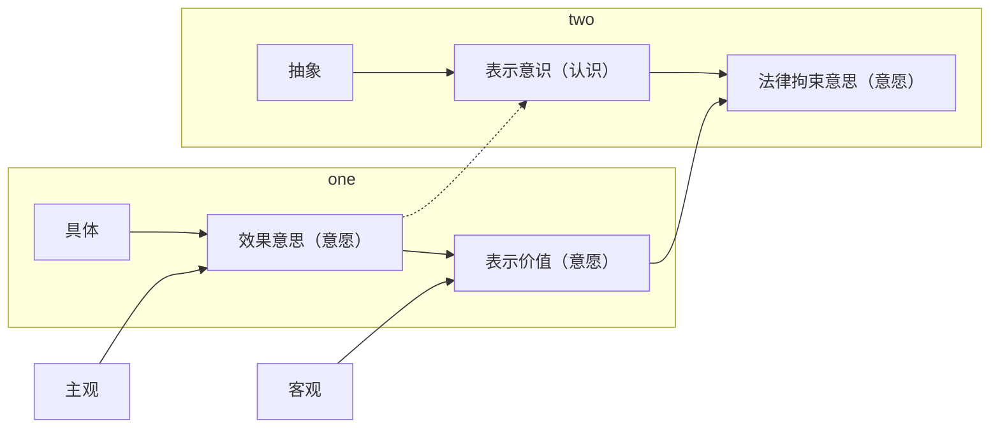

- 上次课讲了行为意思，意思表示有外部的要件和内心的要件。
	- 外部的要件就是表示行为，表示行为包括3个部分：
		1. 外部有个动作；
		2. 要有表示价值；
		3. 要有法律拘束意思。
	- 那么内心来讲呢，分成3个要素：
		1. 行为意思；
		2. 表示意识；
		3. 效果意思。

- 行为意思我们上次讲了总的来说，无论是外部要素的3个组成部分还是内部要素的3个组成部分，以前讲过，在学习的时候始终要关注一点：
	- 如果这个要素缺了，它对意思表示产生的影响是什么。比方说，没有外部行为，我们说它就不会有表示行为，外部要件就不具备了。
	- 凡是外部要件不具备的，那就不具备意思表示，意思表示都没有，谈不上生效的问题。
	- 同样的，表示价值没有、法律拘束意思没有，那么这个所谓的行为就不再是一个意思表示了，因为外部行为就没有。
	- 那么回到内部意思里面，内部意思里面我们讲了行为意思如果欠缺的话，通常会认为，行为意思一旦欠缺，那么意思表示就不存在了，它不是生效的问题。是意思表示根本不构成的问题。
## 3.表示意识＝表示意思？
- 今天讲表示意识：
	- 含义：明知自身行为系法律行为/意思表示
		- 抽象性：不必明知具体内容
		- 认识而非意愿问题：不希望生效≠无表示意识（授课举例、戏谑）

仍然要关注一下，这个缺了表示意思，对于意思表示的影响是什么。我们来讲，什么叫表示意识呢？
### （1）含义：明知自身行为系法律行为／意思表示
#### A.网购案：有表示意识
- 我们来看例子：甲在某购物网站上选中A款电脑，并点击“发送订单”图标。
	- 甲，就这个点击行为，
		1. 他有没有行为意思？——就看他对这个点击的动作本身自己知不知道，以及这个行为是不是受自己控制的。很明显，他既自知又自主，这里是受自己控制的行为，有行为意思。
		2. 第二个，他在点击“发送订单”的时候，他知不知道自己发出了一个要约／意思表示？——哪怕他没学过法律，他应该知道这个东西是法律上有意义的。所以呢，实际上他是知道的。
	- 这个情形呢，我们就说：他既有行为意思，他又有表示意识。因为他知道自己的行为，是会构成法律行为／意思表示的，哪怕他不知道术语，他应该知道，这个行为是具有法律行为上的意义。

- 抽象性（不必明知具体内容）：错误型号案 ^f6knvd
	- 甲欲购买A款电脑，但记错型号，在某购物网站上误选B款电脑而不知，点击“发送订单”图标。
		1. 同样来分析一下，这个同学甲点击发送订单的时候，他对自己这个动作，有行为意思吗？同样的分析一下：
			1. 是表示自知？他知道自己在做动作吗？——知道；
			2. 是不是自主？这个动作受他自己控制吗？——是的。那这样他就具有一个行为意思了。
		2. 第二个要分析的就是，他点击“发送订单”这个图标的时候，他知不知道自己在做个意思表示：他知道自己在做意思表示，但是他心里以为的意思表示内容是买一个A款电脑，但实际上发出的意思表示内容的客观是含义是B款电脑。所以这种情形看一下，有没有表示意思？一一如果从表示的内容来看，他是不知道的，他不知道具体意思表示内容是什么（他不知道实际上是B）；但是从这个行为的性质来看，对于自己在做这个意思表示，他是个意思表示，他是知道的。
		- 所以我们再看，这个到底是有没有欠缺表示意思呢？——答案是非常清楚，知道表示意思。所谓的“知道自己在做一个法律行为／意思表示”只要求知道“性质”，不要求知道“内容”。
		- 明知自身行为系法律行为／意思表示：表示意识明明知道自己的行为是个意思表示，但是不要求知道具体内容，只要求知道行为的性质上是属于意思表示就可以了。所以这个例子可以记住它，这就是“虽然不知道内容，实际上是有表示意识的”。表示内容弄错了并不影响他仍然是有表示意识的，因为他至少知道自己在做个法律行为，只是法律行为的内容他弄错了而已。
#### B.错交作业案：无表示意识
- 甲在某购物网站上选中A款电脑，准备考虑后再决定是否点击发送，恰好友乙来电诉说情感困扰，此时甲突想起某网课作业提交时间马上截止，便边接电话，边登陆学习网站提交作业，忙乱中误点击购物网站上的“发送订单”因标，挂电话后才发现出错。
	- 甲的这么一个点击“发送订单”这个图标的行为：
		1. 有行为意思（这个过于简单）；
		2. 他有没有表示意识呢？做这个点击行为的时候有没有认为自己在做一个意思表示（他有没有认识到自己的行为，会构成一个意思表示）？——他心里想的是提交作业，他以为自已这个行为是在提交作业，所以没有认识到。
	- 所以呢，这个例子就是典型的欠缺表示意识的例子：因为他欠缺表示意识，所以他不会认可发出去的这个表示内容，也就是说点击“发送订单”这个内容也不是他内心想要的（这个表示内容）不是他想要的。
	- 和[[意思表示之构成要素（3）#^f6knv|第二个例子]]有什么差别？——在第2个例子里面，他认识到自己的表示／行为是个意思表示的，只是把表示内容弄错了，导致表示内容不是他想要的；在这个例子里面呢，是因为根本没有意识到自己的行为是个意思表示，即使这个表示内容看上去像个意思表示，他当然不会认可后面这个行为中的表示内容了。
	- 所以呢，最后发生的表示内容的法效果不是表意人所想要的，但原因不同：有表示意识是因为知道是意思表示，弄错了内容（没有效果意思）；没有表示意识是因为自己根本不知道是个意思表示，所以当然不会认可表示内容。
#### C.惊雷案：无行为意思（非自主）
甲在某购物网站上选中A款电脑，准备考虑后再决定是否点击发送，不料窗外忽起一记惊雷，甲惊吓之下，手中鼠标点中发送订单因标。
这是个什么问题？欠缺了什么？——欠缺行为意思。即然是欠缺行为意思，最后会导致这个行为的表示内容也不是他想要的。但这个时候他不想要的真正原因更往前一步了：动作都不是他自主的了。
#### D.中间结论
- 所以看，同样是最后的表示内容不是表意人想要的，不是他内心意思的真实体现，但他的原因是多方面的：
	1. 有的原因是没有行为意思（动作都不是他自己想要做的）；
	2. 第二种情形是动作是他想要做的，但根本不知道这是个法律行为，导致表示内容也不是他自己想要的；
	3. 第三种情形是动作是按照他意思来做的，他也意识到自己这个动作会构成意思表示，只是把表示的内容给弄错了，所以最后导致他表示内容也不是他想要的。

所以这种不同的原因，我们就意识到这是意思表示里面意思瑕疵的不同程度的瑕疵。例[[意思表示之构成要素（3）#^f6knvd|2]]、[[意思表示之构成要素（3）#B.错交作业案：无表示意识|3]]、[[意思表示之构成要素（3）#C.惊雷案：无行为意思（非自主）|4]]里面哪个瑕疵最严重？——肯定是[[意思表示之构成要素（3）#C.惊雷案：无行为意思（非自主）|例4]]最严重，因为动作就不是他想要的；其次严重的是他自己做的，但是他没意识到自己是个意思表示；第三种是他意识到自己是个意思表示，但是他把意思表示内容弄错了，瑕疵程度不一样。大概知道有这么一个程度、层级之分那就行了，以后慢慢的我们会越来越发现词汇很丰富的。

用一句话表达出来，什么叫欠缺表示意识：他没有意识到自己的动作，在性质上会构成一个意思表示／法律行为，这就叫欠缺表示意识。
### （3）无表示意识之情形
#### A.特利尔葡萄酒拍卖案：善意相对人
- 那么欠缺表示意识的情形有很多的，举几个例子：
	- 著名的特里尔葡萄酒拍卖案，这是德国教科书里经典的一个案例：（特里尔在北威州，德国的北威州。那个地方气候特别适合长葡萄，所以盛产葡萄酒，葡萄酒很有名，我专门去特里尔酒吧里喝过他们的葡萄酒。当地因为葡萄酒很盛产，所以每到一定的季节，他会举办一个葡萄酒节，葡萄酒节好多游客就去参观。其中葡萄酒节上会有一个活动叫拍卖。葡萄酒拍卖当地有个习俗，就是你进去坐下去，那边有人拿葡萄酒出来拍卖。游客只要参加这个拍卖会呢，举手就视为是应拍，这个案子就发生在这样的背景下。）
		- 有个外地游客就到了特里尔，走进了一个拍卖会的会场，这个时候拍卖人在上面叫，这一桶酒比方说“500ERO一次，500ERO 两次”，这个时候这个游客惊喜的看到，拍卖会的对面坐着自己一个多年不见的好朋友，于是他很高兴的向他好朋友举手示意，“Hey，你好”，这个时候拍卖人看到有人举手了，很高兴，“落锤成交”。这情形，这个游客举手示意的时候，他有没有意识到自己的行为会构成意思意思表示？是在应拍，发出一个要约呀？
		- 没有意识到，这是典型的欠缺表示意识的情形。我们知道，在拍卖的这种情形，想这样一种拍卖的话，通常会认为呢，这个拍卖人在上面叫价，“500ERO一次”，那是要约邀请，接下去有人去应拍，这是个要约。最后拍卖人说“成交，落槌”，这叫承诺，合同就成立了。所以举手客观上让对方以为是个应拍的意思表示，是个要约，但心里其实他根本不知道自己这个行为是个意思表示，他只是以为在向朋友招手，这就欠缺表示意识了。

>Frage1：如果拍卖会前告诉过他，举手算是应拍的，但是这个游客他举手的时候就忘记了，他只想着和朋友招收呢，那么这个时候他有没有表示意识？——Antwort 1：还是没有。但只是对于这个没有表示意识他自己有错：你不应该没有表示意识，你应该认识到这是个要约。所以这种错的成分会在后面的处理中被体现出来，到底会体现出来是什么法效果，这里先不说。
#### B.签名案：恶意相对人
- 第一种情形：特里尔葡萄酒拍卖案。第二种情形：签名案。签名案，比方说，经常举的例子：A是一个演艺公司，非常想请刘德华，帮该演艺公司到上海来开一个演唱会。但是刘德华很忙，没时间，价格也很高，请不动。又一次刘德华到上海来，A知道了，A先到虹桥机场等着，装作是他的歌迷，刘德华一出来，A就递一个本子过去，“我是你的歌迷，帮我签个字”。刘德华一看是歌迷，就帮A签了个名。但实际上呢这张纸前面写的是一些合同的内容，是个演艺合同。刘德华签字就签了乙方，相当于欠了这个演艺合同，以比较低的价格给A在上海开个演唱会。
	- 刘德华这个签字的行为，他在签字的时候没有意识到自己在签一份合同，他只是以为在给歌迷签名，这是典型的欠缺表示意思。
	- 但是这种欠缺表示意识的情形会发现，和前面的特里尔葡萄酒拍卖案，和[[意思表示之构成要素（3）#B.错交作业案：无表示意识|例3]]（错交作业案）都有点不同在哪里：无论是特里尔葡萄酒拍卖案还是例3，收到意思表示的相对人，他都是善意的（游客举手，拍卖人看到了，他不知道他内心是没有表示意识的；这个电脑的网站看到了一个订单，他不知道某甲是欠缺表示意识的情况下点击的）案型。
	- 但是在这个例子里面，A拿了一个合同折叠之后让他去签字，A明明知道刘德华欠缺表示意识，所以A知道他内心的瑕疵，这个时候是相对人恶意的案型，也属于一种广义上欺诈的案型。那么相对人的善意和恶意，会对这种意思表示瑕疵的处理，会产生不同的影响。这是第二个案型。

- 与此相关的签名案型还有：一个人去参加一个俱乐部，俱乐部里面左边一个签名簿，右边一个签名簿。左边一个签名簿是签到，右边一个签名簿是订购这个俱乐部的某一些商品或者刊物。某家去参加俱乐部，他问也不问，直接在右边的签名簿上签了字，他心里想的是“我签到”。没想到最后是订购了。
	- 这个例子很清楚某家在签名的时候也没想到自己是在订购，所以呢，也是欠缺表示意识的。这都叫签名案型。

（注意哦，学民法，抽象的东西不是太重要，记例子，一定要结合例子来记结论，这样才会有效的。）
#### C.宾馆案
- 某甲居住宾馆，宾馆里通常会有一次性的拖鞋，也会一般都会有赠饮。某甲进了房间之后，理所当然的把衣帽柜里面的拖鞋拿出来拆开就用，然后也理所当然的把桌上放的一瓶水打开就开始喝了。这个时候他突然发现，拖鞋那个包装上写着，“本拖鞋并非赠品，拆开视为购买，价格45元”。又发现桌上放的矿泉水有两种：一种写的是赠与，另外一种写的是标价20元。拆开的是标价20元。某甲这两个行为，他在拆开拖鞋的时候，他没有想到自己在买这个拖鞋；拆开这瓶矿泉水也没有想到自己会喝这瓶水去付费的。
	- 所以这是典型的欠缺表示意识，非常典型的，这个就是欠缺表示意识的案型。
#### D.停车场案
还有一种案型：某甲开车到某一个地方去听演唱会，看见路边有一个一个的地方可以停车，连忙停进去了。停进去呢，也没有人来收费，他就高兴的走了。回来的时候看见有个人站在他车旁边，拿了一个本子，“先生你来了，来付钱，20元”。某甲停车的时候没有想到这个地方是付费的停车，他以为是免费停车的。但是出来之后发现要收钱的，这个时候实际上他停上去，相当于被人理解为是个付费停车的要约了。
所以，他也没有意识到自己在做一个需要付费的停车的行为，在做一个跟停车有关的意思表示，这都是欠缺表示意识的案型。

>Frage2：其实路边是贴了一个牌子，要收费的，“一小时5块”，但他没看见，很高兴的以为是不收钱的，停上去了。在这种情况下，他应该看见还是没看见？他有没有表示意识？——Antwort2：他应该看到但没看到，仍然没有表示意识。这都是表示意识的一个特点：它应不应该有表示意识是另外一回事。表示意识是个事实，事实上认不认为自己的行为在构成意思表示，和应不应该一点都没关系，就是个事实状态。“知道还是不知道”（他“认为还是不认为”）和他“应不应该知道看见”、“应不应该认为”都没有关系。

#### 认识而非意愿问题：不希望生效≠无表示意识
##### （A）授课举例
- A老师上课举例子，A和B签了一个买卖合同，A愿意以500块钱把这本书卖给B，A和B成立了这个合同，这个合同能不能产生效力？为什么？A在做这个上课举例子的时候，A有没有表示意识？
	- 不能产生效力；大家都知道，A是没有法律拘束意思的，只是为了上课举例子而言。
	- A只是充分的向各位展示了A是在上课举例子，所以A不愿意让这个看上去像意思表示的东西变成一个意思表示。
	- A不希望让它生效，A表达的是“我不希望让它生效，我没有法律拘束意思”，A表达出来了。
	- 但是如果A没有把这一层意思表达出来：课间休息的时候，刚下课的时候，A对B说，“你这本书5块钱卖给我好不好？”B答应了，这个时候A同样一句话就变成意思表示了。
	- 所以可见在上课举例子的这种情形，A的本质不是自己没有意识到自己“这个行为是还是不是法律行为”，A的本质是“不愿意让它生效”。A不愿意让它生效，但A应该知道，如果A表达的不清楚的话，是会有可能被人家当成意思表示来看的。所以A要表达的更清楚，避免B和全体同学误解。

- 解说
	- 在这种情形下，就需要清楚，表示意识的功能：由于A意识到，A这个行为在大家看来可能会构成意思表示，如果A这么认为的话，A就有表示意识了。所以A就负有一个谨慎表示的义务。如果A根本没有意识到自己的动作会构成一个意思表示，A就没有这个谨慎表示的义务。

- 意义：非存在问题，系效力问题（通说）
	- 有→谨慎表示义务→违反：表示责任
	- 无→其他注意义务
		- 违反：应知
			- 法律错误（误赠与、免除为非法律行为）=有
			- 其他情形？
		- 未违反：无过失而不知（无意思表示+无责任）

这里就很清楚，A就一定要表达的很清楚，“B，我只是在上课举个例子而已哦，千万不要误会，我不想卖书，这本书我不想500块卖给你”，A就一一定要把这个意思表达出来。可见，这个例子里面，为了赋予A表示义务，还是应该认为，A是有表示意识的，A只是不想让这个意思表示产生效力，A表达了这么个意愿。

所以，表示意识是个认识问题，不是意愿问题。所以，A上课举例只是不想让它生效，并不意味着没有表示意识，A还是有表示意识的；A还认识到“这个行为如果自己讲的不清楚，他就成为法律行为了”。只要有这个认识，A就是有表示意识了。

所以，有表示意识意味着 A认识到自己这个动作有可能构成意思表示，所以自己就负有一个谨慎表示的义务：自己想要什么要讲清楚，自己不希望它产生效力自己要讲清楚。如果一旦违反会按照A自己事实上所作的表示那样承担责任了。比方说A对B说，“5块钱买你的书”，A没有讲清楚，那这个时候保护B的信赖，A这个要约就生效了。
##### （B）戏谑和真意保留
- 同样的，戏谑和真意保留。真意保留的例子：A跟B说，“这本书，是个作家毛尖送给我的，这本书它真的有签名。签名版500块卖给你”，其实A心里根本不想卖，A就想和他开玩笑的。A不希望这个表示生效，只是在和B开玩笑。这个时候我们把它叫戏谑。（真意保留和戏谑这有差别，下次课应该会讲到）。
	- A不希望它生效，但是A意识到如果自己讲的不清楚，别人就会信以为真，他就会构成意思表示。即然A在做这个意思表示，A在做这个戏谑或真意保留的时候，A是有表示意识的，因为表示意识的功能就是：你既然意识到到这个动作有可能被理解为法律行为，你就要谨慎的去表示，违反了这个义务，有可能要保护对方信赖的。你不想要表示内容，还是按照对方的信赖（按表示内容产生效力）。
	- 这两个都知道了之后就比较好办了：不希望生效不等于无表示意识。这里就有个特殊的例子：“上课举例”和“戏谑”。因为这个动作在客观上容易被人理解为是表示，是意思表示／法律行为，所以A就有谨慎表示的义务，所以因此应该认为A是有表示意识的，这个逻辑应该知道。
##### （C）法律错误
接下去，再看，如果有法律错误怎么办呢？

- A对B说，你欠给我的500块不要了，A在做一个免除的法律行为。但A误以为这不是法律行为，因为自己不懂法，以为这个说了没用的（不算数的，自己随时可以反悔的）。那么问，这个时候A有没有表示意识？
	- A心里以为这是没有法律拘束里的，那是A对法条的认识有错误。凡是对法律的认识有错误的，法律一律不保护的。）所以看（蓝色字体），有法律错误的情形，虽然因为有了法律错误，所以他误以为这不是法律行为，但是由于对法律的错误，法律是不保护的（任何人都不应该以不知道法律来作为抗辩）。所以这个时候实际上还是把它当作有表示意识来处理的。
	- 其实就A对B说这句话的时候，A心里的逻辑是这样的：A在做一个免除（免除又不是法律行为），所以A心里的认识是自己没有在做法律行为，自己这个动作和法律行为没关系，这是A心里的实际认识，所以A心里实际上是没有表示意识的。但是A这个认识错误是因为法律的认识错误，所以这个时候没有当有来处理，因为法律错误不受保护。
	- 逻辑就是：心里是没有的一一但这种没有是因为一个不受法律保护的法律错误造成的一—即然法律错误不受保护——所以就当作有表示意识来处理。这样有助于A自己好好了解法律，自己请教律师。大概就这么一个逻辑。
#### E.错误签署文件
- 这就是表示意识的通常情形怎么去认定它，接下去来看下面这种情形怎么去认定：
	- 秘书乙对公司老总甲称，要签署一批会议纪要，其中，乙偷偷塞入一份合同，甲未及审阅均签署之。
	- 秘书乙对公司老总甲称，要签署一批原料购销合同，其中，乙偷偷塞入一份电脑买卖合同，甲未及审国均签署之。
	- 他都是被乙骗了，第一个／第二个例子甲有没有表示意识？
	- 第一个例子：没有。在第一个例子里，他以为签的是文件，这个时候是没有表示意识。
	- 第二个例子：虽然也弄错了，这个电脑买卖合同也不是他想要的，但是他欠的时候是心里想的是自己在做法律行为，所以他就是有表示意识。辨别的话很简单，不多说了。

（要注意的是，以后在实践中（你们毕业了什么之后），欠缺表示意识的案型，十有八九会和意思表示错误混起来，或者跟欺诈混起来。因为一般情形下，容易混淆。现在掌握了就不容易混淆了。）
### （4）法律后果
#### A.相对人恶意：不存在／无效
- 接下去再看，如果欠缺表示意识会怎么办呢，法律后果是怎么样的呢：
	- 学说争议
	- 解决方案：相对人
		- 恶意：不存在/无效
		- 善意：类推错误
			- 存在，有效
			- 表意人：撤销权+过错赔偿

- 我们看特里尔葡萄酒拍卖案和刚刚讲的签名案型。看签名案型：A拿着这个【海报之类的】当歌迷，请刘德华签名，A知道刘德华签名的时候内心没有表示意识的。
	- 这里马上讲到意思表示解释的基本规则了：如果相对人内心的真意是a，那么他签了这个字和客观表示价值是b，表示内容是b，这个时候就要看A是不是知道或者应当知道他内心的真正想法。如果相对人知道或应当知道内心是a的话，这个时候就按照内心的真意a为准，因为A没有值得保护的信赖。对这个客观上的bA根本就不信。甲心里想的是a，作一个表示客观上是b，如果A根本不知道也不应当知道，这个表示内容当然应该按照客观上的b来（保护A的信赖）。
	- （这本身并不是恶意不值得保护的问题。之所以按照客观来，全部的正当理由就在于要保护A的善意信赖。即然A明明知道或应当知道，这个时候就意味着A没有信赖，没有信赖就不需要按照b来。所以这个逻辑尽量不要说成是“恶意不值得保护”，逻辑是因为这里没有善意信赖，所以不需要保护。这两个略微细微的差别）
	- 所以在本案中，刘德华内心并没有表示意识，A明明知道刘德华并没有表示意识，所以这个时候，A明明知道刘德华不想要这个表示内容，意思表示就不存在或者无效，更为精确的说法是“意思表示根本不存在”。
#### B.相对人善意：类推错误
- 再看特里尔葡萄酒拍卖案：游客举手，拍卖人是善意的（他不知道也不应当知道他是在向朋友致意，他不知道也不应当知道游客内心欠缺表示意识），所以为了保护善意呢，这个时候通常的说法是怎么说的？
	- 通常的学说会认为：这个意思表示仍然存在有效，仍然是发出了一个存在的、有效的要约。但是这个要约不是游客内心真正想要的呢，所以这个时候相当于错误，很像重大误解。
	- 重大误解的结果就是内心想要a，实际上发出了一个b，这是典型的重大误解。现在他内心什么都不想要，结果是也发出了一个b，一样的是非故意的（不是故意的）。这个时候就类推错误（重大误解）的规则处理，让表意人去可以撤销它。表意人可以撤销它也就是游客可以把这个合同撤掉，撤掉之后，要按照过错来赔偿。过错赔偿在「[[第一编 总则#^2i4wlr|民法典157]]］：![[第一编 总则#^2i4wlr|民法典157]]
	- （停车案：停车的地方应该看到要收费的，结果他没有看到，他有过错。由于相对人是善意的，如果有过错意味着他停车的行为仍然会被理解为是一个意思表示，据此对方和他成立一个合同。成立合同之后他可以撤销。因为它毕竟类似于重大误解，类推重大误解的规则「[[第一编 总则#^vjdex2|民法典147]]」。撤销完了之后，撤销的一方要不要赔给对方钱，要看行为人对这个重大误解本身有没有过错。在这里相当于说要看对于欠缺表示意识有没有错：他应该看到上面有个标志的他没有看到，所以对于欠缺表示意识他是有错的，有错的要类推「[[第一编 总则#^2i4wlr|民法典157]]」，赔偿对方的损失。）
	- （同样的，那个游客由于进门的时候，人家告诉过他说“举手视为应拍”，那么固然他在举手的时候忘记了，所以他还是欠缺表示意识的。但他这个欠缺表示意识是有错的，有错的则类推错误的规定他可以去撤销。但撤了之后由于是有错的，有错的一方应当赔偿对方由此所收到的损失。（在葡萄酒拍卖案里面，对方的损失可能的损失是缔约费用（要付出拍卖费、中介费当作损失来算））
#### C.中间结论
- 现在知道欠缺表示意识是怎么处理的：
	1. 欠缺表示意识的看相对人，相对人知道A内心欠缺表示意识，意识表示直接无效。当然不需要赔相对人钱，因为相对人是恶意的，它受的任何损失，跟A没关系。
	2. 如果A内心欠缺表示意识，相对人是善意的，这个时候：
		1. A可以撤，类推错误；
		2. 撤了之后要看A有没有错（过错当然包括故意和过失，但是在这里欠缺表示意识不会是故意的，只会是过失的。故意的就进入另外一种法律关系了），如果A有错要赔，A没错A不赔。就是这么一个情形。
	- 其他国家有这么一种说法：如果A内心欠缺表示意识，A又没有错的话，A连撤都不需要撤，也是按照相对人恶意处理，意思表示一样根本就不存在，根本就无效。这种说法仅供参考，我们国家就一般会按照刚刚我讲的方法来处理。
### （4）中间结论
- 现在归纳一下，什么叫欠缺表示意识：
	1. “我在做这个动作，但我不知道这个动作会被理解为是个意思表示”，这个时候自己就欠缺表示意识了。那么在认定的时候要注意“我不希望这个表示生效”，但这个时候“我”是有表示意识的（上课举的例子和戏谑的例子）。
	2. “我”虽然认为这个动作他不是一个意思表示，但是这个认识是由于法律错误造成的话，那么他仍然当作有表示意识来处理。这是认定上的问题。

- 第二个是法律后果上的问题，法律后果上的问题就非常简单：
	1. 看相对人对内心的表示意识的欠缺是恶意还是善意，如果是知道或应当知道那就是恶意，此时相对人不受保护，“我”这个表示完全没有效力，也不需要赔对方钱；
	2. 如果相对人是善意，也就是他知道且不应当知道，那么这个时候可以类推错误／重大误解的规则来撤销他。撤销了之后呢，如果“我”有错，“我”就赔他钱，法条的依据已经告诉大家。

行为意思欠缺，通常会导致意思表示的构成根本不存在、不成立。欠缺表示意识，对意思表示所造成的影响（法效果）是什么？——就是缺了表示意识，意思表示不一定不成立，不一定不产生效力（善意的情形就完全不影响）。所以我们讲，表示意识意义是“不是意思表示存在问题，而是个效力问题”。就是至少知道一句话：表示意识的欠缺，不一定会影响意思表示的存在，但有可能影响它的效力。
## 4.效果意思／法效意思
- 含义：发生特定法律效果之意思
	- 具体性≠全面性、专业性
- 区分
	- 表示价值：内部——外部
	- 表示意识：抽象——具体

### （1）含义：发生特定法律效果之意思
- 具体性≠全面性、专业性
	- 接下去我们看效果意思：效果意思就比较简单。我们来举刚刚那个例子：甲在某购物网站上选中A款电脑，并点击“发送订单”图标。
	- 甲对自己的动作是有行为意思的，甲点击发送订单的图标的时候，他也知道对方会理解为是个严肃的意思表示的。现在问，甲在点击发送的时候，对这个意思表示的内容他心里是这么想的？——他心里想的是很具体的，“我希望以网站上所标的价格来买到这个A款电脑”（用法律语言翻译一下就是，“我愿意负担一个支付网站上标明价款的义务来换取一个请求网站交付并移转某一个A款电脑的所有权的债权”）。
	- 想的很具体，这种具体的权利义务的意愿，我们叫做效果意思。
### （2）区分
#### A.表示意识：抽象——具体
所以效果意思和表示意识有什么不同：表示意识是个认识问题，只需要认识到这是个法律行为就可以了（抽象的认识就可以了）；而效果意思有什么特点：他既要求认识到具体的内容是什么，而且他是个意愿问题一一就是“我”心里想要的法效果是什么（这个法效果毕竟是具体的，具体的权利义务都在里面）。所以这叫效果意思：“特定法律效果”有具体性。

- 接下去再看效果意思和表示意识有什么差别：
	1. 表示意识是认识问题，和意愿没关系（“我”事实上知不知道自己这个行为会构成法律行为）；而效果意思是个意愿问题，“我”希望发生什么样的法律效果；
	2. 表示意识是抽象的，只需要认识到性质上是什么，内容不需要知道；但是效果意思是具体的，具体的权利义务是不是他意愿所指向。这就是他的差别。
	- 效果意思在各种合同中会不一样的，买卖合同的效果意思是“你给我所有权，“我”支付价款”，它就特定的。而且这个特定法律效果一定要指向一个具体的标的的，抽象的讲也不行。比方说：A想和B定一个合同，A想买卖B的某一本书。这个某一本书一定要是能够确定的，比方说就这本《民法总则》，那就可以。
	- 如果A真的是现实生活中就这么想：B有好多书，A买它任何一本书，那这样一来就没法操作。就一定要具体到能够落实的地步为止，这个和表示价值是一样的。
#### B.表示价值：内部—外部
- 表示价值也要求具体，要求具体到最后这个合同能够操作下去的程度，能够履行下去为止。所以我们讲，效果意思和表示价值的差别：A把这本书500块卖给B，A说的时候把它说成了300块，说错了（写电子邮件写错了，发微信发错了也可以），现在问，A内心的效果意思／真意是，“我愿意以500块的价款把自己这本书卖给B”。现在，A的客观上的表示内容是“300块把这本书卖给B”，现在产生一个问题了，表示内容按照哪个来认定？
	- 如果按照A内心真意来认定的话，认定之后的表示内容就是500；如果按照客观表示价值来认定的话，认定之后的内容就是变成300。这里就我们清楚的看到表示价值和内心的效果意思有什么差别了。
	- 客观上的表示含义，我们通常把他叫做表示价值。表示价值是300；A内心效果意思是500块来卖这本书。所以，表示价值和效果意思他的联系在什么地方：效果意思是内心怎么想的；表示价值是外部的、具体的、客观的含义，叫表示价值。
	- 而效果意思和表示价值有可能不一致的，这就是他的差别。但他们共性是都是具体的（一定要具体到能够具体落实为准，他的权利义务是很丰富、很详细的）；表示价值和效果意思共同点除了具体性之外，还有都是意愿问题：表示价值是“我”愿意300块卖给你这本书（“我”的意愿）；“我”内心效果意思是“我”愿意500块把这本书卖给你（也是意愿问题）。
	- 所以归纳一下，表示价值和效果意思有2个共性：（1）具体性；（2）意愿问题（不是认识问题）。它们两个的区别就在于：一个是内部的（主观的）、一个是外部的（客观的）；两个还有可能不一样。
	- 没什么更多的东西需要了解的，只需要知道什么是效果意思就可以了。

### （3）相应瑕疵类型
- 相应瑕疵类型：如果效果意思出问题了怎么办？
	- 无效果意思：虚伪表示
	- 效果意思形成瑕疵
		- 非自愿：欺诈、胁迫
		- 动机错误
	- 效果意思≠表示价值：内容/表示/传达错误
- 意义：不影响存在，可能但未必影响效力

前面讲过行为意思出问题了，通常意思表示不成立；表示意识出问题了，通常是意思表示可能不一定受影响，但是他的效力可能受影响。接下去我们看，欠缺效果意思会怎么办：
#### A.无效果意思：虚伪表示
第一种欠缺效果意思是“我”内心根本没有效果意思。最典型的是刚刚说的开玩笑：“我”明明500块不想把这本书卖给B，心里还故意跟他这么说。
这个时候“我”是故意造成自己没有效果意思，但客观上看上去有意思表示的情形，这叫虚伪表示。内心是假的，内心其实根本不希望它产生这样的效力（法效果）。但客观上却造成了一个想让他发生法效果想发生这样法效果的这么一个表示，一个外部的表象。故意造成的，这叫无效果意思的虚伪表示。
#### B.效果意思形成瑕疵
##### （A）动机错误
- 第2种情形是效果意思形成中的瑕疵：A有这个杯子，A以为这个杯子是宋朝的汝窑的杯子，是真的。所以A就出高价，买这个杯子，发出个要约，实际上这不是宋朝汝窑的，是现代人仿制的（赝品）。
	- A形成内心的效果意思是以吗5亿购买这个杯子（很具体）。但是促使A做出这样一个决定的因素是A内心认识错了，以为它是真品实际上赝品的。
	- 所以效果意思是真实的：A真的是想5亿让B卖这个杯子。但是促使A形成这个效果意思的因素是有问题的，因为A弄错了，所以才愿意做这样的决定，才发生这样的效果意思，这个叫动机错误。这个错是A自己造成的才叫动机错误。
##### （B）非自愿：欺诈、胁迫接下去再看：
- A去买杯子，卖杯子的跟A说，这个是宋朝汝窑的、真的，A听了之后就信了，信了之后A就5亿（发了个5亿的要约把它买下来）。
	- 同样的，A的效果意思是5亿买这个汝窑的杯子。但是促使A下这个决定，促使A发生效果意思的因素是A弄错了，A以为这是真品，实际上是赝品。A为什么弄错了（前面那个例子是没人骗A，A自己弄错的，叫动机错误）？现在是因为对方骗了A才弄错的，叫欺诈了。
	- 所以，欺诈和动机错误其实在后面两个环节是一样的：A弄错了，所以A下个决定买它。但问题出现在什么地方呢：动机错误是A自己弄错，欺诈是因为别人骗A才弄错。所以都是效果意思形成过程中的瑕疵。

- 再看下面这个例子：A去买杯子，对方（B）跟A说，5亿买这个杯子，你不买都不行，否则我杀你全家，这个时候A也下了个意思决定，意思决定内容是5亿买这个杯子。
	- A为什么要买这个杯子？—使A下这个决定的因素是B威胁要杀A全家，被胁迫了。
	- 这些情形效果意思是有的，但是促使效果意思形成的那个因素有问题：不正当的。要么A自己弄错，要么A受了欺诈或胁迫。所以，形成中的效果意思包括不自愿形成的。
#### C.效果意思≠表示价值
第三种瑕疵类型是：A有效果意思，A这个效果意思形成过程中也没有任何瑕疵，但是A效果意思和A的表示价值却不一致了。
##### （A）内容错误 
- 有1、2号杯子，A心里想的是买1号杯子，效果意思是“500块买这个杯子”，讲的非常清楚。接下去就有这个问题，“A怎么跟对方说呢？”于是A要寻找表示符号，某个符号代表2号，A弄错了。
	- 注意，效果意思已经形成了，形成之后弄错了，效果意思很清楚：A就要买1号杯子。形成过程没有错，形成之后A找表示符号弄错了，A以为某个符号是1号，实际上代表2号。
	- 所以A就跟对方说，“同志，我买你们的2号杯子”，A发了这个要约。对这个理性地相对人／正常的人来说，会以为是2号杯子。所以，A内心的效果意思是500块买1号杯子，客观的表示价值是500块买2号杯子。错在效果意思形成之后的错误，这个叫内容错误：A因为选取了错误的表示符号，使A内心已经形成的正确的效果意思，却没有被正确的表达出来（表示符号选错了）。这也是一个效果意思的问题（瑕疵），是效果意思≠表示价值。
##### （B）表示错误
- 下面这个类型再举个例子，把后面内容提前讲一讲就清楚了：A心里形成的效果意思是500块买1号杯子，A要找一个表示符号来说，这次A认识对了，这个杯子叫1号，所以A准备给对方说是1号，A张口就跟对方说，“同志，你好，我买2号杯子”，口误说错了。
	- 这个时候，A内心效果意思是对的：500块买这个1号杯子；A找的表示符号也是对的（心里已经决定好了A自己怎么说：“500块买1号”）。但是在把表示符号往嘴巴里吐出来的时候吐错了，舌头一卷说成了买2号了。这个叫表示错误：错不在错在内心，错在嘴巴。
	- 但是，不管什么阶段发生的错，最后的结果是：A内心想要500块买的是1号杯子；对方听到了，表示价值是500块买2号杯子。还是效果意思和表示价值不一样。这种错误叫表示错误：不是内心选取表示符号的错误，而是表示符号选对之后，嘴巴里的错。

- 同样，这种表示错误还有：A心里想的是应该写上1号（A写个电子邮件给B），打字的时候打成2号，A不知道，［然后］发出去了。
	- A内心想的表示符号是对的——1号。此时错在手（不是内心的错，也叫表示的错）。
##### （C）传达错误
第三种情形：A心里想的很清楚“A要买1号杯子，500块”，表示符号选的也没错。但这个时候A没有自己去说，找了个朋友替自己传达一下，A找到自己的朋友或跟秘书讲，“秘书，你跟对方去说，500块买他的1号杯子”，到现在为止，没有任何错。（内心的效果意思是“500块买这个杯子”；选取的表示符号能够忠实的把A的效果意思表达出来；A嘴巴里对秘书说，“500块买1号”，也没错）秘书记错了，过去跟对方说“老板让我告诉你，500块买2号杯子”。是秘书说错了。
所以，在A和秘书之间是对的，是传达的人把它弄错了，最后导致对方听到的表示价值是，“500块买2号杯子”，还是造成了效果意思和表示价值的不一致。但这个不一致跟A一点关系都没有，是传达人造成的，A的阶段都没错，这叫传达错误。后面还会在讲到，这个过程会再重复一遍。
##### （D）中间结论
大概能够理解了，就是效果意思方面的瑕疵，最复杂。现在知道了，它最复杂。狭义的所谓“意思表示上的瑕疵”都是在效果意思上的问题才叫意思表示瑕疵。看：虚伪表示、欺诈、胁迫、动机错误、内容错误等等，传统上三大意思表示瑕疵都出现了。
#### D.法律效果
效果意思缺了，它的法律效果很丰富，有的时候会认为意思表示无效，有的时候会认为意思表示是不成立（法条规定的不成立比较少，实际上是不成立，规定为无效了）。根据不同瑕疵的类型会不一样的。但是它最常见的类型是可撤销。
可撤销就是意思表示是存在的，法律行为是成立的，也是有效的，但是你可以撤销它。撤销之前是成立有效的，撤销之后就视为从来没有生效过（自始无效）
在最常见的类型里面，欠缺了效果意思，不会影响意思表示的存在，因为法律行为都成立、生效了，所以它意思表示是没有受影响的。

一种比较少见的类型是欠缺效果意思，认为这个法律行为无效。因为通常规定为法律行为无效了，所以一般会认为：这个意思表示的存在是不是也不受影响，这个等以后再讲。

总之，记住一点，既然通常规定为可撤销的比较多，可见欠缺效果意思不一定会让意思表示不存在，只是可能会影响效力。
# （四）意思与表示之关系
- 接下去看，意思和表示的关系：
	- 三种倾向
		- 意思主义：按效果意思
		- 表示主义：按表示价值
		- 折衷主义：区分各类型
	- 区分实益

所谓意思和表示的关系有3种倾向：
## 1．意思主义
意思主义。A内心的真意和外面的表示不一致的时候，意思主义说：按照内心的真意来，不按照表示的客观含义来，因为法律行为的根基不就是意思自治吗，如果你内心都没有真意，那么怎么能按照，这个表示生效呢，真正能让表示生效的是真意呀，所以应该按照真意来。这个学说就认为意思表示最重要的是要符合内心的意思，所以按照意思来是最重要。
## 2．表示主义
表示主义的含义是内心的真意是A，客观上表示含义是B，这个时候表示主义说按照B来，因为意思表示的功能，不仅要保护你的意思自治，你的意思表示是个沟通行为啊，你是要和人家沟通的，所以按照沟通的功能来说，你要保护相对人的信赖，所以按照客观含义来，不就保护了信赖了吗？这叫表示主义。
### 3．折中主义。
折中主义说，不能一概而论，要区分各种意思表示的类型，各种意思表示瑕疵的类型，瑕疵不一样，处理不一样。现在我们通常都是按照折中主义来的。到底怎么按照折中主义来，我们具体会在讲意思表示瑕疵的时候会展现给大家。这里不多说。