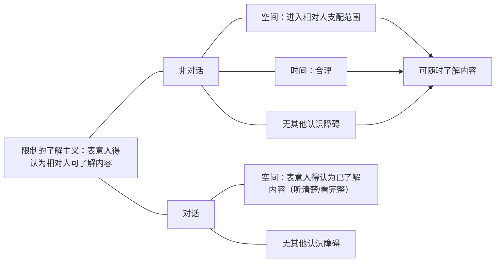

先回顾一下上次课的内容。我们讲，意思表示的生效，就是先要想清楚，它是意思表示的类型，类型里面上次课也讲了，有相对人／无相对人，有相对人里面还分了对话和非对话。进过上次的讲解，都应该清楚的额知道有相对人／无相对人，是以有相对人为基本原则：意思表示会影响他人对方的利益，而通常都要有相对人。无相对人是例外。

在对话和非对话，怎么区分要知道一个标准：就是相对人能不能自主的决定了解表示内容的时间点，掌握了这个，判断它就没有什么困难了。这是一个意思表示的分类，我们先把它掌握。掌握好了之后呢，我们就要知道这个分类是用来干什么的。

分类一定有实际意义的，这个实际意义先看有相对人／无相对人，实际意义是有相对人就意味着要到达生效（跟前面讲过的逻辑是一样的）：因为意思表示的一生效，就会影响相对人的利益，所以要到达他，让他有了解的可能性才生效。这样才公平合理，能够保护对方的利益。

无相对人通常是意思表示的生效根本不影响任何一个人的利益，要么是只会对特定的人产生好的影响，这样一来只有好的，也不需要它据此作出什么反应的话，那就可以不到达就生效了。

所以上次课讲了，有相对人的概念，脑子里马上反应出来是到达生效的意思表示；无相对人的意思表示概念，马上跳出来：这个意思表示是不需要到达就会生效的。不需要到达，发出（表示完成）就生效。这时牢牢需要掌握的，这个区分的目的在哪里。

![[意思表示之生效#^4iqg1w]]

- 在这个区分之下，我们进一步会看到，有一些衍生的区别：
	1. 有相对人的意思表示，有传达问题（传而达之，传了才到达叫传达）。而无相对人的意思表示，因为不需要到达，所以就没有传达的问题。如果一个无相对人的意思表示让他人代为完成，那是表示行为的代为。
	2. 第2个，有相对人的意思表示就有个到达前的撤回问题，无相对人的意思表示就不会有到达前的撤回问题。「[[第一编 总则#^n0lt4c|民法典141]]」说到达前一律有撤回权的，但这种情形对于无相对人意思表示就不会出现，因为无相对人没有到达，所以就不会有到达前的撤回权。所以呢，他只会有到达之后的撤回权，「[[第六编 继承#^jw7dzt|民法典1142I]]］“遗嘱人可以撤回”等等。
	3. 还有一个衍生的区别是，发出的要件不一样：
		- 无相对人和有相对人发出要件不一样：有相对人，发出的人（表意人）一定要通过自己的行为表达出终局性：这是自己终局的意思决断（通常是有一个表示脱离它控制范围的这么一个行为：比方说把信投进邮箱，脱离他的控制了，终局性已经表达出来了；或者是拿了信，对自己的秘书／使者说，“请你帮我传达”，表示（内容）一交给他，然后把指示做完，终局的意思表达出来了）。
		- 但是由于有相对人的意思表示还有个让（意思表示）生效，它最终的目的是为了让意思表示生效，所以在发出里面，他就一定要为到达作准备才算发出来了：自己在有终局的意思（作出一个让表示脱离自己的行为的时候；离开自己支配范围的时候），这个时候自己采取的方式一定是“通常可预期到达”的。所以，这个“通常可预期到达”的只要求有相对人（的意思表示）在发出里面会加上这个要件；而在无相对人情形，是不会要求加上这个要件的：因为无相对人本来就没有到达对方才生效这一说，它不需要到达，所以它只需要通过把表示完成，把终局的意思表达出来就行了。
		- 所以呢，我们讲，发出的要件哪里不一样：有相对人的表示要到达才生效，所以在发出里面，一定要“终局性＋通常可到达”；无相对人只有“终局性”。

![[意思表示之生效#^v5mgni]]

这是有相对人／无相对人的区别就在这里。再看对话和非对话，它的意义在于：对话和非对话，其实最主要的问题在于发出、到达的要件不一样；是不是能够撤回要件不一样。

- 我们先讲发出它们两个有什么差别（对话和非对话的情形）：A给B一个书面的表示，投进B的邮箱（或者投进邮局的邮箱，也一样），脱离A了，按照这个方式通常能到达了。这就是发出了。
	1. 但是在有相对人里面的对话意思表示，它由于没有一个发出和到达的时间间隔。发出标准不是说通常可预期到达了（上次讲课说了），而这个表示A有没有理由认为它会进入B的听觉系统／视觉系统，强调的是这两个，它有差别：没有时间差（A话说出来，B要么听清，要么没听见）。A有理由认为B能够听到这个声音的，就是发出了；A有理由认为B会看到这个表示内容的，就发出了。
	所以，有相对人里面的非对话就不大一样：A有理由认为会到达B，会进入B的支配范围，这是经过一个漫长的空间距离，A是有理由认为他会进入B的支配范围；但是在对话的时候会变成有理由认为进入对方的视觉／听觉系统，这是差别。在到达里面，还会有不一样，呆会儿再讲。
	2. 还有一个，有相对人意思表示有到达前的撤回问题。但是要注意，在对话这种有相对人的意思表示里面，实际上没有到达前撤回的可能性。若A对B说，“B，你这本书你要不要？”A话一说完，B要么听见，要么没听见。如果A这边是没有理由认为B会听得见，那就没有发出了；如果A有理由认为它是能够进入听觉系统的，那么这个时候呢，它就到达了。在到达之前A再说一句话把它撤回是没有可能性的（A的撤回肯定不可能比它先到的，撤回不了了；要么没到达，没到达就不需要撤回了）。
	所以，我们讲，“有相对人意思表示可以到达前撤回”，这句话要修正：对话好像做不到（A这个做不到指的是当面的对话「或者说直接的对话」，A打电话给B，面对面对着B。但中间如果是用了一个使者的话还是有可能的）
	- 接下去我们来回顾一下“发出”。发出的判定标准一定要掌握：
		1. 发出原则上要求是按照表意人的意思脱离他的支配范围，这个是要件。如果有些情形没有经过它意思叫脱手／脱离意思表示了，我们说原则上不构成发出的。但在一定程度上，为了保护相对人的信赖，有可能例外的把它视为发出，上次课讲过了。
		2. 第2个，除了这个要件之外，有相对人的话，既要表达出终局的法律拘束意思，让这个表示脱离自己的支配，还要一个“通常可预期到达对方”；无相对人只需要有终局的效果意思，并且表示要完成。
	- （“并且”：绝大多数情形，法律效果意思一表达，表示就完成了。无相对人这两个意思表示一起的，比如“抛弃”，表示完成的同时，表达出一个法律拘束意思，表示就完成，这是一体的。但是有的表示是托别人来发布公告的，这个时候，A终局的效果意思和表示的完成是两个概念，这个时候必须要看表示完成为准。）
	- 上次课讲的：A委托一个报社给自己发个悬赏广告，A把这个表示内容交给报纸作出指示之后，实际上A的终局的效果意思表达出来了。但是按照A和报社之间的合同和A的预设，一定要在报纸上登出来才算A的表示完成。所以这个时候表示完成，它会比A的终局的效果意思表达出来要晚一点。
	（这个时候特别像传达，但不是传达。这是表示行为的代为，无相对人意思没有传达。针对不特定人没有传达问题。）
	3. 接下去，第三个要讲的内容：[[意思表示之生效#1.发出之意义：诸多法律问题之判定时间点|发出的意义]]就很重要了。上次课都讲过了，不重复了。这些都要掌握，这个就是功底，好好掌握。
# （三）意思表示之到达：有相对人之意思表示生效
- 意思表示之到达：有相对人之意思表示生效
	1. 到达之意义：生效→原因
	2. 到达之标准：主观→客观标准（限制了解主义：表意人得认为相对人可了解内容）

## 1.到达之意义：生效→原因接下去，我们讲到达。
（到达很实用，但是，很实用的内容，往往理论性还蛮强的。因为理论性很强是因为好多地方法条也好不一定把握得很好。）

看见到达，脑子里第一个反应出来的念头应该是：有相对人意思表示要到达生效。能够第一个反应是这个你就到家了。所以我们讲，到达的意义是有相对人意思表示要到达生效了。
## 2.到达之标准：主观→客观标准
- 第2个，我们在这里着重掌握的知识点（说第一个知识点也行）：就是到达的标准怎么判定，怎么算到达。下面举一个例子，来判定一下怎么样的到达标注最合理。这个时候假设自己是立法者，立什么规则：
	- A要给B寄一封信，一个意思表示，这个意思表示有几个过程，那个时间点算到达比较好？
		1. 第一个时间点：A自己写好信，签好名；
		2. 第2个时间点：A把这封信投进了A家里的邮筒；
		3. 第三个时间点，邮差取了信；
		4. 第4个时间点：邮差到了B家门口，投进了门口的信箱；
		5. 第5个时间点：B把信从信箱里取出来了；
		6. 最后一个：B看了信。哪个点当作到达的时间点最妥当呢？
	- （我们说，意思表示为什么要到达生效，我们要牢牢抓住立法目的：为了保护相对人的利益。到达的目的是为了让相对人知道：因为意思表示生效会影响他的利益，所以必须让他知道。）
	- 按照这个逻辑，到达的时间点、最好的时间点应该是按照B看信。从理论上来讲，单纯去考虑相对人这一方利益的话，好像是相对人看信是最好的，实际了解表示内容是最符合到达的立法目的的。但是如果采取第5个（B看信）为到达标准的话，会有两个致命的弊端：
		1. 意思表示什么时候到达，也就意味着意思表示什么时候生效，那就意味着意思表示什么时候生效的时间点完全控制在B的手中了，B信拿回去了，他就是不看。如何B今天看，今天生效了，明天看，明天生效，B如果是把这个信放在一年之后再看呢，一年之后再生效。这是整个法律的交往所不能容忍的，我们的制度设计，一定要让表意人能够控制意思表示生效的时间点。
			- A做了一个意思表示，一定要能够控制意思表示什么时候生效的，否则的话，A就不能形成一个有效的预期了，A没法进行安排了：假设A给B发的是要约信，B一年之后才看，那A发出之后有可能是有义务的（前面讲过）。一年之内A不能卖给这个杯子别人。
			- 所以一定要让A能控制A的要约生效的时间点。同样的，承诺也是一样的，假设B发出承诺，A什么时候看B不知道，那B就不知道这个合同成立／生效没有，B就不知道这个杯子能不能再卖给别人，就一直傻乎乎拿在手里等着他看信。
			- 所以这种标准叫主观标准，会让A没有办法来控制A自己表示生效的时间点。
		2. 凡是采取（相对人）主观标准的，都会导致证明上的困难。
			- 假设A说，“我的表示已经生效了”，那A必须要想办法证明B看信了，实际上信的内容都看到了。A怎么来证明B看信了？
			- A证明不了，这几乎是魔鬼证明，证明不了。反过来：A说自己的表示，没生效，B想证明自己看见了，所以生效了。B怎么来证明自己看了？
			- 很难，总不会自己边看边录像吧，一般不会的（但是是可能的），而且这个到达时间点完全不确定了，但第1个弊端还在。即使说自己看信的时候录个视频，这个时候B能证明，A还是证明不了。B这个录像不给A看，A还是没法证明。所以，尤其是表意人，会碰到证明上的困难。

- 限制的了解主义：表意人得认为相对人可了解内容
	- 正因为有这两个弊端，所以我们意识到，这个时候，一定不能采取一种主观标准，要采取一个客观标准：能够让表意人能够控制意思表示生效的时间点，但同时要保障相对人的认识可能性（因为到达的目的是为了让B知道）。如果虽然标准客观了，但是它不可能知道，那这个到达对相对人不公平了。举个例子：A写好信，或者A把信投到自己家附近的邮箱，如果认定为是一个到达标准的话，现在客观了：生效时间不取决于相对人（用邮戳也能证明A什么时候投的，大概是就这么能确定的）。现在就是为什么这个客观不行？
		- 因为在A投进邮箱的时候，实际上B是没有办法看到这封信的，如果把这个时间点当作到达时间点，那么对方的知情可能性完全没得到保障，这样的到达就不再是我们所说的那种到达，不符合到达的目的。
		- 再反过来，在邮差，把信投进B的信箱，和B取信之间，哪个更合理？取信同样是主观标准：B什么时候取信，完全取决于B，B自己的什么时候想取。信今天晚上5点进入B的信箱，B今天取就今天生效；B一年忘记取了，1年没生效。这个同样是主观标准和B看信是一模一样的。就是要到达时间纯粹操之余B之手，A没法控制了。
		- 再倒退一下：邮差把信投进邮箱。把信投进邮箱客观上保证了B随时可以看到信的可能性：只要B想拿就拿得到，想看就看得到，已经足以保障B的认识可能性了。而且，邮差把这封信投进邮箱，对A来说能控制这个时间：A可以通过选择各种邮寄的方式（邮差寄、寄平信、寄特快专递、叫快递，也可以自己塞进他的邮箱，实际上A控制的了的），这是客观的。
		- 那么来归纳一下，也就是说，实际上到达的标准，一定要满足两个要件：
			1. 由于到达是为了让相对人知道，一定要切实保障对方的了解可能性；
			2. 一定要让表意人有办法来控制表意生效的时间，保护他的预期。
		- 这两个要件一结合：A作为表意人，A一旦投进B的邮箱，A有理由认为B的了解可能性已经被保障了（任何人都会认为A有理由认为A已经保障了B的知情可能性），而A有理由认为的时间点是客观的（A自己控制的时间点）。
		- 这就是整个逻辑，整个标准。只要是“客观上表意人有理由认为相对人已经可以了解内容”就到达了。
### （1）非对话

接下去先讲非对话：刚刚那个逻辑都认同了，这时一个最终的标准：“表意人得认为相对人可了解内容”（表意人有理由认为相对人已经可以了解内容了）。所以接下去的一切讲解都围绕这个标准“满足了没有”来做文章。
#### A.空间：进入相对人支配范围
#### B.时间：合理
- 现在增加一个要件了：A的这封信，投进了B的这封邮箱，如果是在晚上12点投进B的家中，这个时间点到达了没有？
	- 如果认为这个时间点到达了，会导致的现象：自己认为到达的时间点B是没有了解的可能性的。通常这个情形是B在睡觉（一个正常的人都在睡觉）。也就是说，这个时候对A来说，A是没有理由认为这个时候B已经有了了解可能性了。哪怕B真的每天都睡得很晚，每天都是两点睡的，A也不能预期到晚上12点B来取信。
	- 所以，投进B家里的邮箱，只是在空间上让这个表示进入了B的支配范围，所以A有理由认为在空间上，A已经保证了B的了解可能性。但是一定要还在另外加上一个时间：只有在合理的时间进入相对人B的支配范围，A才有理由说、有理由预期、有理由认为“A保障了B的了解可能性”。
	- 所以在刚刚那个时间点里面，12点就投进去的，A有理由认为B已经可能了解的时间点是第2天早上正常起床的时间点、正常工作生活的时间。
	- 所以呢，归纳一下：
		1. 空间上要进入他的支配，进入他的支配意味着：他可以随时决定什么时候了解内容。空间上的了解可能性有了。
		2. 还有时间上的了解可能性，进入的时间点不合理，哪怕空间满足了，你要到一个合理的时间，这才会到达。刚刚讲的例子就是。
#### C.无其他认识障碍
- 再问，类似的例子：A到一个公司之后，没有找到自己要找的那个人（法定代表人）。A想了一下，就把这个信塞在了这个法定代表人坐的办公桌的地毯下面（这个时候是工作时间）到达了没有？
	- 在空间上进入B支配范围了，时间上也合理，这个时间点正常人看的。但这个没到达，因为虽然进入支配范围了，A还是没有理由认为B可以了解表示内容（谁会一进来到地毯下取翻信啊？）。
	- 所以，这个时候，我们只要掌握了最根本的原理，一切案型都可以解决了。虽然表示已经被控制了，但由于控制的方式是A没有理由认为B会可以了解的（正常人不会去地毯下取翻信的），还是不行。

- 再加一个要件：A跟对方公司发了一封信（是承诺）。A突然觉得自己好久没用德语了，A用中文发了个要约，A就写了个德语版过去了，A说自己接受这个要约。是在正常的工作时间，进入了这个公司的邮箱，问，到达没有？
	- 要看以往的交易习惯。A跟公司以前都是用中文交流的，A也没有理由预期对方会懂德语的，A就突然想用一下德文，所以写了个德文信过去，到达没有？对方如果是德国公司，可以（也不一定的，德国公司的法定代表人，如果是中国人，员工都是中国人，还是不行）。因为A跟公司之间就是用中文交易的，A没有理由预期对方会看到德文，还是一样的。总而言之，一句话，如果A有理由认为对方应该是懂德文的，那么到达了，在这句话下可以千变万化。
	- 比方说：这个公司虽然是德国公司，以前经常用德文交流的，A此时是有预期的；虽然是德国公司，A却一直用中文交流的，这个德国公司是在中国的，A就也没有预期对方会懂的问的，那还是没有了解可能性的。
	- 我们只要抓住这个总纲，千变万化的案例都不怕，我们就可以判断到达与否。

- 把案例再改一改：现在A是用中文，向对方公司发了一个承诺信，承诺信是塞到公司的邮箱里的。塞进去的时间是礼拜日的下午两点，问，这封信是什么时候到达？
	- 正常就是周一，这个公司的营业时间点（工作时间点的起始），不一定是8点。
### （2）对话
#### A.空间：表意人得认为已了解内容
现在了解非对话的情形，我们抓住总纲之后，很容易判断到达了，很简单。接下去我们看，对话意思表示。对话意思表示的到达和非对话的到达会有些不一样（原理都是一样的，但是在实际上内容上有点不一样）。

我们在非对话，都是在保障对方的了解可能性。但在对话情形，B要么听到，要么没听到。如果听到了，到达了。如果没听到，那就没到达。所以不是保障他的了解可能性，它本质上在于保障它实际上听到没有（是否足以了解内容）

（因为它没有自主了解保障的能力，就保障现在进入听觉系统内没有、进入听觉系统能否听清楚。就保障这两个。如果是以视频、书面的这种对话，这个时候要这些文字都进入对方的视觉系统没有。以及B看清楚、看完整没有，就保障这个。）

- 下面举个例子：A跟B说，“这个杯子5块钱卖给你，好不好？”在说这句话的时候，一个火车呼啸而过，A都听不见自己在说什么。问，这个时候发出／到达没有？
	- A没有理由认为自己这句话进入了对方的听觉系统，就没有发出。对话意思表示通常是A的声音被B听到就到达，B虽然是可以听到的（耳朵是可以进去的），但是A还是没有理由认为B听清楚了，这是一种情形。

- 或者用另外一个情形来表达：现在这封要约信，“B，你看吧。”这个时候，A只要有理由认为B能够看到这些字，那就发出了，但是A给B看的时间太短了就拿走了，通常不能保证B把它看完，A没有理由认为B能够看完整，这个时候就是没到达。
	- 所以发出管的是A的声音、A的图形，有没有进入B的视觉／听觉系统；到达管的是它听进去了，有没有清楚（足不足以了解它的内容）。“图形有没有进入他的视觉系统”是发出；“A有没有理由认为进入到他视觉系统的内容是完整的、是他能够了解的”，这是A要保障的内容。
#### B.无其他认识障碍
- 在什么情形下，尤其会出现问题呢？尤其会出现不到达：B向A发个要约，A用阿拉伯语对B说，“我接受这个要约”，外语意思表示。
	- 这个时候，A是不是有理由认为B已经听到了A的声音（A的声音进入B的听觉系统了）。但是A没有理由认为B听懂了：B是一个中国人，A也没有迹象表明B懂阿拉伯语。所以，在这种情形，声音都进去了，但是A还是没有理由预期B了解内容。

- 同样的，外语意思表示，前面讲过了：A给B对话的时候，给B看一个德文信，A没有理由预期B会懂德文的。所以，这个时候，B看得再清楚都没用，还是不到达。
	- 所以，对话意思表示，发出的时候着重只管自己有没有理由认为自己的声音、图像已经足以进入他的视觉系统、听觉系统。
	- 而到达管对于进入B视觉系统、听觉系统的图像和声音，A有没有理由认为对方能够了解其内容。最典型的记住这个例子：外语意思表示。这样就是对话的独特性造成的：它的发出和到达之间没有时间间隔造成这个现象。
### （3）中间结论
- 这是到达的标注，大致应该能过理解了，怎么理解到达。大致知道之后，我们就稍微详细一点了解这个内容：![[第一编 总则#^hd8s36|民法典137I]]
	- 以非对话方式作出的意思表示，到达相对人时生致。以非对话方式作出的采用数据电文形式的意思表示，相对人指定特定系统接收数据电文的，该数据电文进入该特定系统时生致：未指定特定系统的，相对人知道或者应当知道该数据电文进入其系统时生致。当事人对采用数据电文形式的意思表示的生数时间另有约定的，按照其约定。
	- “非对话方式作出的意思表示，到达相对人时生效”；“数据电文····”。非对话方式分为两种：一种是数据电文，里面写了那么多字，进入系统知道或应当知道，这都是数据电文的非对话，就到达提出了特别的、具体的标准，法条直接把它到达的标准给它具体化，不需要回到这里来看了（说句实话，它【法条】规定的不合理，不合理就会出问题，因为它不符合这个原理）；对于非数据电文的非对话，法律没有把到达给具体化，这时候标准，就是上面这个标准：他没有具体化，这就需要我们用上面这个原理来给它具体化。

这个原理是最根本的，掌握原理掌握好了，一切条文在面前都可以解破它，都可以改造它，通过法学方法论来解释它。