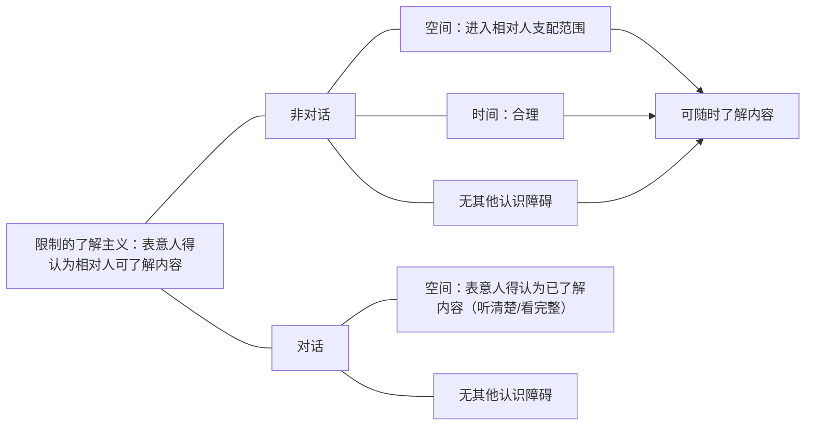
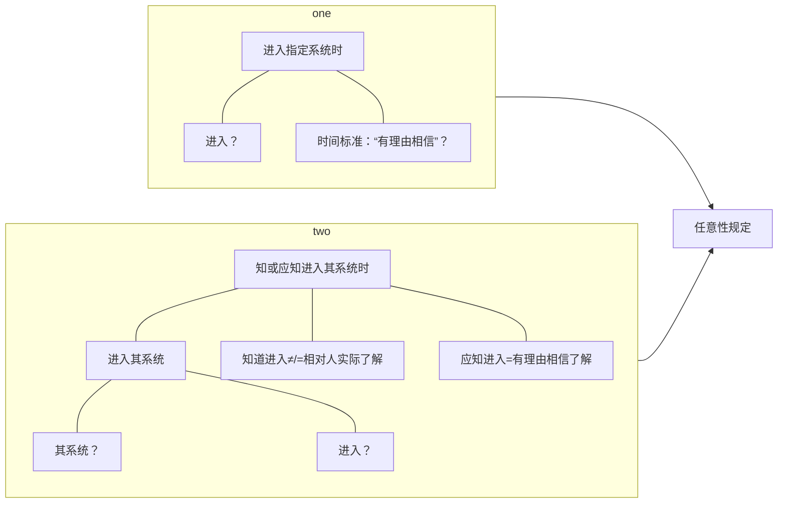
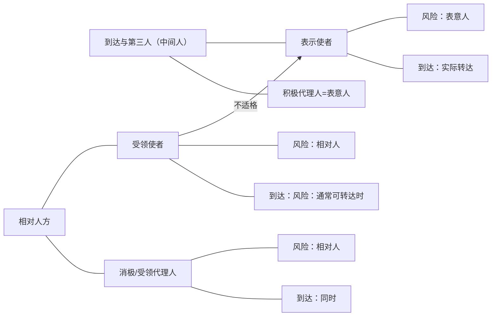

先回顾一下上次课的内容。我们讲，意思表示的生效，就是先要想清楚，它是意思表示的类型，类型里面上次课也讲了，有相对人／无相对人，有相对人里面还分了对话和非对话。进过上次的讲解，都应该清楚的额知道有相对人／无相对人，是以有相对人为基本原则：意思表示会影响他人对方的利益，而通常都要有相对人。无相对人是例外。

在对话和非对话，怎么区分要知道一个标准：就是相对人能不能自主的决定了解表示内容的时间点，掌握了这个，判断它就没有什么困难了。这是一个意思表示的分类，我们先把它掌握。掌握好了之后呢，我们就要知道这个分类是用来干什么的。

分类一定有实际意义的，这个实际意义先看有相对人／无相对人，实际意义是有相对人就意味着要到达生效（跟前面讲过的逻辑是一样的）：因为意思表示的一生效，就会影响相对人的利益，所以要到达他，让他有了解的可能性才生效。这样才公平合理，能够保护对方的利益。

无相对人通常是意思表示的生效根本不影响任何一个人的利益，要么是只会对特定的人产生好的影响，这样一来只有好的，也不需要它据此作出什么反应的话，那就可以不到达就生效了。

所以上次课讲了，有相对人的概念，脑子里马上反应出来是到达生效的意思表示；无相对人的意思表示概念，马上跳出来：这个意思表示是不需要到达就会生效的。不需要到达，发出（表示完成）就生效。这时牢牢需要掌握的，这个区分的目的在哪里。

![[意思表示之生效#^4iqg1w]]

- 在这个区分之下，我们进一步会看到，有一些衍生的区别：
	1. 有相对人的意思表示，有传达问题（传而达之，传了才到达叫传达）。而无相对人的意思表示，因为不需要到达，所以就没有传达的问题。如果一个无相对人的意思表示让他人代为完成，那是表示行为的代为。
	2. 第2个，有相对人的意思表示就有个到达前的撤回问题，无相对人的意思表示就不会有到达前的撤回问题。「[[第一编 总则#^n0lt4c|民法典141]]」说到达前一律有撤回权的，但这种情形对于无相对人意思表示就不会出现，因为无相对人没有到达，所以就不会有到达前的撤回权。所以呢，他只会有到达之后的撤回权，「[[第六编 继承#^jw7dzt|民法典1142I]]］“遗嘱人可以撤回”等等。
	3. 还有一个衍生的区别是，发出的要件不一样：
		- 无相对人和有相对人发出要件不一样：有相对人，发出的人（表意人）一定要通过自己的行为表达出终局性：这是自己终局的意思决断（通常是有一个表示脱离它控制范围的这么一个行为：比方说把信投进邮箱，脱离他的控制了，终局性已经表达出来了；或者是拿了信，对自己的秘书／使者说，“请你帮我传达”，表示（内容）一交给他，然后把指示做完，终局的意思表达出来了）。
		- 但是由于有相对人的意思表示还有个让（意思表示）生效，它最终的目的是为了让意思表示生效，所以在发出里面，他就一定要为到达作准备才算发出来了：自己在有终局的意思（作出一个让表示脱离自己的行为的时候；离开自己支配范围的时候），这个时候自己采取的方式一定是“通常可预期到达”的。所以，这个“通常可预期到达”的只要求有相对人（的意思表示）在发出里面会加上这个要件；而在无相对人情形，是不会要求加上这个要件的：因为无相对人本来就没有到达对方才生效这一说，它不需要到达，所以它只需要通过把表示完成，把终局的意思表达出来就行了。
		- 所以呢，我们讲，发出的要件哪里不一样：有相对人的表示要到达才生效，所以在发出里面，一定要“终局性＋通常可到达”；无相对人只有“终局性”。

![[意思表示之生效#^v5mgni]]

这是有相对人／无相对人的区别就在这里。再看对话和非对话，它的意义在于：对话和非对话，其实最主要的问题在于发出、到达的要件不一样；是不是能够撤回要件不一样。

- 我们先讲发出它们两个有什么差别（对话和非对话的情形）：A给B一个书面的表示，投进B的邮箱（或者投进邮局的邮箱，也一样），脱离A了，按照这个方式通常能到达了。这就是发出了。
	1. 但是在有相对人里面的对话意思表示，它由于没有一个发出和到达的时间间隔。发出标准不是说通常可预期到达了（上次讲课说了），而这个表示A有没有理由认为它会进入B的听觉系统／视觉系统，强调的是这两个，它有差别：没有时间差（A话说出来，B要么听清，要么没听见）。A有理由认为B能够听到这个声音的，就是发出了；A有理由认为B会看到这个表示内容的，就发出了。
	所以，有相对人里面的非对话就不大一样：A有理由认为会到达B，会进入B的支配范围，这是经过一个漫长的空间距离，A是有理由认为他会进入B的支配范围；但是在对话的时候会变成有理由认为进入对方的视觉／听觉系统，这是差别。在到达里面，还会有不一样，呆会儿再讲。
	2. 还有一个，有相对人意思表示有到达前的撤回问题。但是要注意，在对话这种有相对人的意思表示里面，实际上没有到达前撤回的可能性。若A对B说，“B，你这本书你要不要？”A话一说完，B要么听见，要么没听见。如果A这边是没有理由认为B会听得见，那就没有发出了；如果A有理由认为它是能够进入听觉系统的，那么这个时候呢，它就到达了。在到达之前A再说一句话把它撤回是没有可能性的（A的撤回肯定不可能比它先到的，撤回不了了；要么没到达，没到达就不需要撤回了）。
	所以，我们讲，“有相对人意思表示可以到达前撤回”，这句话要修正：对话好像做不到（A这个做不到指的是当面的对话「或者说直接的对话」，A打电话给B，面对面对着B。但中间如果是用了一个使者的话还是有可能的）
	- 接下去我们来回顾一下“发出”。发出的判定标准一定要掌握：
		1. 发出原则上要求是按照表意人的意思脱离他的支配范围，这个是要件。如果有些情形没有经过它意思叫脱手／脱离意思表示了，我们说原则上不构成发出的。但在一定程度上，为了保护相对人的信赖，有可能例外的把它视为发出，上次课讲过了。
		2. 第2个，除了这个要件之外，有相对人的话，既要表达出终局的法律拘束意思，让这个表示脱离自己的支配，还要一个“通常可预期到达对方”；无相对人只需要有终局的效果意思，并且表示要完成。
	- （“并且”：绝大多数情形，法律效果意思一表达，表示就完成了。无相对人这两个意思表示一起的，比如“抛弃”，表示完成的同时，表达出一个法律拘束意思，表示就完成，这是一体的。但是有的表示是托别人来发布公告的，这个时候，A终局的效果意思和表示的完成是两个概念，这个时候必须要看表示完成为准。）
	- 上次课讲的：A委托一个报社给自己发个悬赏广告，A把这个表示内容交给报纸作出指示之后，实际上A的终局的效果意思表达出来了。但是按照A和报社之间的合同和A的预设，一定要在报纸上登出来才算A的表示完成。所以这个时候表示完成，它会比A的终局的效果意思表达出来要晚一点。
	（这个时候特别像传达，但不是传达。这是表示行为的代为，无相对人意思没有传达。针对不特定人没有传达问题。）
	3. 接下去，第三个要讲的内容：[[意思表示之生效#1.发出之意义：诸多法律问题之判定时间点|发出的意义]]就很重要了。上次课都讲过了，不重复了。这些都要掌握，这个就是功底，好好掌握。
# （三）意思表示之到达：有相对人之意思表示生效
- 意思表示之到达：有相对人之意思表示生效
	1. 到达之意义：生效→原因
	2. 到达之标准：主观→客观标准（限制了解主义：表意人得认为相对人可了解内容）

## 1.到达之意义：生效→原因接下去，我们讲到达。
（到达很实用，但是，很实用的内容，往往理论性还蛮强的。因为理论性很强是因为好多地方法条也好不一定把握得很好。）

看见到达，脑子里第一个反应出来的念头应该是：有相对人意思表示要到达生效。能够第一个反应是这个你就到家了。所以我们讲，到达的意义是有相对人意思表示要到达生效了。
## 2.到达之标准：主观→客观标准
- 第2个，我们在这里着重掌握的知识点（说第一个知识点也行）：就是到达的标准怎么判定，怎么算到达。下面举一个例子，来判定一下怎么样的到达标注最合理。这个时候假设自己是立法者，立什么规则：
	- A要给B寄一封信，一个意思表示，这个意思表示有几个过程，那个时间点算到达比较好？
		1. 第一个时间点：A自己写好信，签好名；
		2. 第2个时间点：A把这封信投进了A家里的邮筒；
		3. 第三个时间点，邮差取了信；
		4. 第4个时间点：邮差到了B家门口，投进了门口的信箱；
		5. 第5个时间点：B把信从信箱里取出来了；
		6. 最后一个：B看了信。哪个点当作到达的时间点最妥当呢？
	- （我们说，意思表示为什么要到达生效，我们要牢牢抓住立法目的：为了保护相对人的利益。到达的目的是为了让相对人知道：因为意思表示生效会影响他的利益，所以必须让他知道。）
	- 按照这个逻辑，到达的时间点、最好的时间点应该是按照B看信。从理论上来讲，单纯去考虑相对人这一方利益的话，好像是相对人看信是最好的，实际了解表示内容是最符合到达的立法目的的。但是如果采取第5个（B看信）为到达标准的话，会有两个致命的弊端：
		1. 意思表示什么时候到达，也就意味着意思表示什么时候生效，那就意味着意思表示什么时候生效的时间点完全控制在B的手中了，B信拿回去了，他就是不看。如何B今天看，今天生效了，明天看，明天生效，B如果是把这个信放在一年之后再看呢，一年之后再生效。这是整个法律的交往所不能容忍的，我们的制度设计，一定要让表意人能够控制意思表示生效的时间点。
			- A做了一个意思表示，一定要能够控制意思表示什么时候生效的，否则的话，A就不能形成一个有效的预期了，A没法进行安排了：假设A给B发的是要约信，B一年之后才看，那A发出之后有可能是有义务的（前面讲过）。一年之内A不能卖给这个杯子别人。
			- 所以一定要让A能控制A的要约生效的时间点。同样的，承诺也是一样的，假设B发出承诺，A什么时候看B不知道，那B就不知道这个合同成立／生效没有，B就不知道这个杯子能不能再卖给别人，就一直傻乎乎拿在手里等着他看信。
			- 所以这种标准叫主观标准，会让A没有办法来控制A自己表示生效的时间点。
		2. 凡是采取（相对人）主观标准的，都会导致证明上的困难。
			- 假设A说，“我的表示已经生效了”，那A必须要想办法证明B看信了，实际上信的内容都看到了。A怎么来证明B看信了？
			- A证明不了，这几乎是魔鬼证明，证明不了。反过来：A说自己的表示，没生效，B想证明自己看见了，所以生效了。B怎么来证明自己看了？
			- 很难，总不会自己边看边录像吧，一般不会的（但是是可能的），而且这个到达时间点完全不确定了，但第1个弊端还在。即使说自己看信的时候录个视频，这个时候B能证明，A还是证明不了。B这个录像不给A看，A还是没法证明。所以，尤其是表意人，会碰到证明上的困难。

- 限制的了解主义：表意人得认为相对人可了解内容
	- 正因为有这两个弊端，所以我们意识到，这个时候，一定不能采取一种主观标准，要采取一个客观标准：能够让表意人能够控制意思表示生效的时间点，但同时要保障相对人的认识可能性（因为到达的目的是为了让B知道）。如果虽然标准客观了，但是它不可能知道，那这个到达对相对人不公平了。举个例子：A写好信，或者A把信投到自己家附近的邮箱，如果认定为是一个到达标准的话，现在客观了：生效时间不取决于相对人（用邮戳也能证明A什么时候投的，大概是就这么能确定的）。现在就是为什么这个客观不行？
		- 因为在A投进邮箱的时候，实际上B是没有办法看到这封信的，如果把这个时间点当作到达时间点，那么对方的知情可能性完全没得到保障，这样的到达就不再是我们所说的那种到达，不符合到达的目的。
		- 再反过来，在邮差，把信投进B的信箱，和B取信之间，哪个更合理？取信同样是主观标准：B什么时候取信，完全取决于B，B自己的什么时候想取。信今天晚上5点进入B的信箱，B今天取就今天生效；B一年忘记取了，1年没生效。这个同样是主观标准和B看信是一模一样的。就是要到达时间纯粹操之余B之手，A没法控制了。
		- 再倒退一下：邮差把信投进邮箱。把信投进邮箱客观上保证了B随时可以看到信的可能性：只要B想拿就拿得到，想看就看得到，已经足以保障B的认识可能性了。而且，邮差把这封信投进邮箱，对A来说能控制这个时间：A可以通过选择各种邮寄的方式（邮差寄、寄平信、寄特快专递、叫快递，也可以自己塞进他的邮箱，实际上A控制的了的），这是客观的。
		- 那么来归纳一下，也就是说，实际上到达的标准，一定要满足两个要件：
			1. 由于到达是为了让相对人知道，一定要切实保障对方的了解可能性；
			2. 一定要让表意人有办法来控制表意生效的时间，保护他的预期。
		- 这两个要件一结合：A作为表意人，A一旦投进B的邮箱，A有理由认为B的了解可能性已经被保障了（任何人都会认为A有理由认为A已经保障了B的知情可能性），而A有理由认为的时间点是客观的（A自己控制的时间点）。
		- 这就是整个逻辑，整个标准。只要是“客观上表意人有理由认为相对人已经可以了解内容”就到达了。
### （1）非对话

^cbr94d

接下去先讲非对话：刚刚那个逻辑都认同了，这时一个最终的标准：“表意人得认为相对人可了解内容”（表意人有理由认为相对人已经可以了解内容了）。所以接下去的一切讲解都围绕这个标准“满足了没有”来做文章。
#### A.空间：进入相对人支配范围
#### B.时间：合理
- 现在增加一个要件了：A的这封信，投进了B的这封邮箱，如果是在晚上12点投进B的家中，这个时间点到达了没有？
	- 如果认为这个时间点到达了，会导致的现象：自己认为到达的时间点B是没有了解的可能性的。通常这个情形是B在睡觉（一个正常的人都在睡觉）。也就是说，这个时候对A来说，A是没有理由认为这个时候B已经有了了解可能性了。哪怕B真的每天都睡得很晚，每天都是两点睡的，A也不能预期到晚上12点B来取信。
	- 所以，投进B家里的邮箱，只是在空间上让这个表示进入了B的支配范围，所以A有理由认为在空间上，A已经保证了B的了解可能性。但是一定要还在另外加上一个时间：只有在合理的时间进入相对人B的支配范围，A才有理由说、有理由预期、有理由认为“A保障了B的了解可能性”。
	- 所以在刚刚那个时间点里面，12点就投进去的，A有理由认为B已经可能了解的时间点是第2天早上正常起床的时间点、正常工作生活的时间。
	- 所以呢，归纳一下：
		1. 空间上要进入他的支配，进入他的支配意味着：他可以随时决定什么时候了解内容。空间上的了解可能性有了。
		2. 还有时间上的了解可能性，进入的时间点不合理，哪怕空间满足了，你要到一个合理的时间，这才会到达。刚刚讲的例子就是。
#### C.无其他认识障碍
- 再问，类似的例子：A到一个公司之后，没有找到自己要找的那个人（法定代表人）。A想了一下，就把这个信塞在了这个法定代表人坐的办公桌的地毯下面（这个时候是工作时间）到达了没有？
	- 在空间上进入B支配范围了，时间上也合理，这个时间点正常人看的。但这个没到达，因为虽然进入支配范围了，A还是没有理由认为B可以了解表示内容（谁会一进来到地毯下取翻信啊？）。
	- 所以，这个时候，我们只要掌握了最根本的原理，一切案型都可以解决了。虽然表示已经被控制了，但由于控制的方式是A没有理由认为B会可以了解的（正常人不会去地毯下取翻信的），还是不行。

- 再加一个要件：A跟对方公司发了一封信（是承诺）。A突然觉得自己好久没用德语了，A用中文发了个要约，A就写了个德语版过去了，A说自己接受这个要约。是在正常的工作时间，进入了这个公司的邮箱，问，到达没有？
	- 要看以往的交易习惯。A跟公司以前都是用中文交流的，A也没有理由预期对方会懂德语的，A就突然想用一下德文，所以写了个德文信过去，到达没有？对方如果是德国公司，可以（也不一定的，德国公司的法定代表人，如果是中国人，员工都是中国人，还是不行）。因为A跟公司之间就是用中文交易的，A没有理由预期对方会看到德文，还是一样的。总而言之，一句话，如果A有理由认为对方应该是懂德文的，那么到达了，在这句话下可以千变万化。
	- 比方说：这个公司虽然是德国公司，以前经常用德文交流的，A此时是有预期的；虽然是德国公司，A却一直用中文交流的，这个德国公司是在中国的，A就也没有预期对方会懂的问的，那还是没有了解可能性的。
	- 我们只要抓住这个总纲，千变万化的案例都不怕，我们就可以判断到达与否。

- 把案例再改一改：现在A是用中文，向对方公司发了一个承诺信，承诺信是塞到公司的邮箱里的。塞进去的时间是礼拜日的下午两点，问，这封信是什么时候到达？
	- 正常就是周一，这个公司的营业时间点（工作时间点的起始），不一定是8点。
### （2）对话
#### A.空间：表意人得认为已了解内容
现在了解非对话的情形，我们抓住总纲之后，很容易判断到达了，很简单。接下去我们看，对话意思表示。对话意思表示的到达和非对话的到达会有些不一样（原理都是一样的，但是在实际上内容上有点不一样）。

我们在非对话，都是在保障对方的了解可能性。但在对话情形，B要么听到，要么没听到。如果听到了，到达了。如果没听到，那就没到达。所以不是保障他的了解可能性，它本质上在于保障它实际上听到没有（是否足以了解内容）

（因为它没有自主了解保障的能力，就保障现在进入听觉系统内没有、进入听觉系统能否听清楚。就保障这两个。如果是以视频、书面的这种对话，这个时候要这些文字都进入对方的视觉系统没有。以及B看清楚、看完整没有，就保障这个。）

- 下面举个例子：A跟B说，“这个杯子5块钱卖给你，好不好？”在说这句话的时候，一个火车呼啸而过，A都听不见自己在说什么。问，这个时候发出／到达没有？
	- A没有理由认为自己这句话进入了对方的听觉系统，就没有发出。对话意思表示通常是A的声音被B听到就到达，B虽然是可以听到的（耳朵是可以进去的），但是A还是没有理由认为B听清楚了，这是一种情形。

- 或者用另外一个情形来表达：现在这封要约信，“B，你看吧。”这个时候，A只要有理由认为B能够看到这些字，那就发出了，但是A给B看的时间太短了就拿走了，通常不能保证B把它看完，A没有理由认为B能够看完整，这个时候就是没到达。
	- 所以发出管的是A的声音、A的图形，有没有进入B的视觉／听觉系统；到达管的是它听进去了，有没有清楚（足不足以了解它的内容）。“图形有没有进入他的视觉系统”是发出；“A有没有理由认为进入到他视觉系统的内容是完整的、是他能够了解的”，这是A要保障的内容。
#### B.无其他认识障碍
- 在什么情形下，尤其会出现问题呢？尤其会出现不到达：B向A发个要约，A用阿拉伯语对B说，“我接受这个要约”，外语意思表示。
	- 这个时候，A是不是有理由认为B已经听到了A的声音（A的声音进入B的听觉系统了）。但是A没有理由认为B听懂了：B是一个中国人，A也没有迹象表明B懂阿拉伯语。所以，在这种情形，声音都进去了，但是A还是没有理由预期B了解内容。

- 同样的，外语意思表示，前面讲过了：A给B对话的时候，给B看一个德文信，A没有理由预期B会懂德文的。所以，这个时候，B看得再清楚都没用，还是不到达。
	- 所以，对话意思表示，发出的时候着重只管自己有没有理由认为自己的声音、图像已经足以进入他的视觉系统、听觉系统。
	- 而到达管对于进入B视觉系统、听觉系统的图像和声音，A有没有理由认为对方能够了解其内容。最典型的记住这个例子：外语意思表示。这样就是对话的独特性造成的：它的发出和到达之间没有时间间隔造成这个现象。
### （3）中间结论
- 这是到达的标注，大致应该能过理解了，怎么理解到达。大致知道之后，我们就稍微详细一点了解这个内容：![[第一编 总则#^hd8s36|民法典137I]]
	- 以非对话方式作出的意思表示，到达相对人时生致。以非对话方式作出的采用数据电文形式的意思表示，相对人指定特定系统接收数据电文的，该数据电文进入该特定系统时生致：未指定特定系统的，相对人知道或者应当知道该数据电文进入其系统时生致。当事人对采用数据电文形式的意思表示的生数时间另有约定的，按照其约定。
	- “非对话方式作出的意思表示，到达相对人时生效”；“数据电文····”。非对话方式分为两种：一种是数据电文，里面写了那么多字，进入系统知道或应当知道，这都是数据电文的非对话，就到达提出了特别的、具体的标准，法条直接把它到达的标准给它具体化，不需要回到这里来看了（说句实话，它【法条】规定的不合理，不合理就会出问题，因为它不符合这个原理）；对于非数据电文的非对话，法律没有把到达给具体化，这时候标准，就是上面这个标准：他没有具体化，这就需要我们用上面这个原理来给它具体化。

这个原理是最根本的，掌握原理掌握好了，一切条文在面前都可以解破它，都可以改造它，通过法学方法论来解释它。
### (4)非对话
#### A.非数据电文：“到达”（[[第一编 总则#^hd8s36|137II1]]）之判定
我们再看，非对话里第一类，非数据电文，到达需要具体化：第一个标准是要空间标准（要进入相对人支配范围）：
##### （A）空间标准：进入支配范围
- 空间标准：进入支配范围
	- 支配范围
		- 指定空间
			- 指定方式？
			- 违反之后果
		- 无指定空间：有理由相信之任何地址
	- 进入
		- 标准：可自主决定了解时间
		- 方式：须合理
		- 障碍？进入后灭失？

进入相对人的支配范围，为什么空间上一定要进入支配范围：进入支配范围就意味着相对人能在空间上的知情可能性得到保障了。相对人支配了载体，支配了载体就是想看就看、想听就听。这个时候就在空间上保障了相对人的知情可能性、了解可能性，所以采用这个标准。

即然所谓的支配范围是起到这个作用的，那么下面的一切实际上也在围绕这个“是否保障了相对人的知情可能性”来判定有没有进入支配范围，这是两个相互循环的论证。

- 支配范围
	- 直接看，什么叫“支配范围”： 
		1. 有指定空间的，那就一定要放到指定空间。
			- 举个例子：（我跟地产公司的一大帮法务给他们讲课，他们说， “我到底应该把信送到哪里？这是很困惑的问题，送的不好，法院就认为没到达，没到达，意思表示就不生效，不生效就麻烦。”我们介于这个基本的规则）甲公司，注册的时候注册在A地，它实际上在B地开设业务，但是他还有另外一个辅助的分支机构在C地，ABC三个地。现在问，和甲做生意的乙，想要把这个合同解除掉，应该发到哪个地点？
				- 答案很清楚，如果在合同中双方当事人说了，以后所有的往来信件，必须送到C地。那么这个时候一定要注意，指定优先（相对人自己指定的地址是优先的），这是在合同中进行了指定。即使合同中没有指定，事后甲根乙发了个函，“以后有信你都送到C地来”，这个时候，以后乙就只能把信送到C地才能到达，送到AB两地都不能保证到达。因为相对人自己说了，“送到这里我都会看的，就是保障我的（知情）可能行了”，他自己说的就按照他自己说的来。
				- 还有，指定的方式不一定都是明确的，也有可能是默示的。比方说：
			- ABC三个地，虽然A地是注册地，B第是实际经营的地点，C点事分支机构的地点。如果是双方当事人合同就在那里签的，并且一方给另一方交的名片什么的等等上面写的地址都是C，包括合同中写的地址（注意，一般签合同，甲方，名字是什么，会写一个地址是什么，再会写个电话是什么，都会写的），写上去的是C地址。注意一下，他不一定是明确指定的地址，有可能地址是写的A地，但是合同中指定，信就要送到C地，C地是指定的。但合同中没有C地的表述，这个通常会认为上面写的“甲的名称是……，地址是……”，这个地址是默示指定的意思表示到达地址。
				- 所以指定有明示、默示的。
				- 违反的后果：乙指定了C地，偏偏给他送到了A地，这时候没到达。送到A地去了的情形才到达，需要表意人乙积极的证明甲看到了。
				- 由于为了保护乙，为了保护表意人能控制时间到达，所以要采取客观标准。乙自己送错了地点，到达标准不保护的。乙有重新负有一个很难的问题，要举证证明甲事实上看到了。之所以以前不让乙证明，是因为保护乙；乙自己做错了就不保护了，自己来证明了。证明不了就是没到达。
		2. 如果没有指定的空间，真的一点迹象都没有，这个时候乙把它送到哪里能够到达呢？——我们会讲，乙作为一个正常的人，有理由相信会到达的任何地址都可以。就没指定嘛，这个时候乙送到A地去没有问题的。甲确保是在B地经营的，送到B地去也没问题。这个时候就有选择的余地了。但是一般为了靠谱呢，一般都会查公司上的登记注册的地址来送。这是比较容易得到认可的方式。

- 进入
	- 第2个，进入。是不是算进入来支配范围，也有个标准：一定是要让对方自主决定了解时间才算进入。
	- 举一个例子就明白了：A向B发了条微信，微信上说，“B，这个杯子5块钱卖给你，好不好？”两分钟内A可以撤回，问，两分钟可撤回期间内，这个微信上的表示到达了没有？
		- 没有到达。因为这两分钟内，A如果撤回，B就看不到了。所以这两分钟内，B看表示的时间，是被A决定的。
		- 所以，B在两分钟之内还没有达到可自主决定了解时间的程度。所以A微信发给他的两分钟之内，A还没有切实保障B的了解可能性，还是不确定状态。两分钟过了之后真的就到达了。也就是说两分钟之内还不靠谱。
	- 换一个例子： A到B家里，把这封信塞到了B家的门缝里，但是这封信上绑了根绳子，绳子乙拉就可以拉出来，绳子还在A手里，问，到达了没有？
		- 这时没发出，绳子还绑在A手里，A的终局意思还没表达出来，这个都算没发出。
		- 它和微信那个不一样的，微信是A这么发出来，通常就可以有理由认为A是终局的，至于A是不是把它弄掉，就有点反悔的味道了；A现在虽然塞进去了，绳子还捏在手里舍不得放的时候，A就没有终局的意思让它生效，这个就没有发出。
	- 第2个讲过了，进入的方式必须要合理。前面讲了：A到老总的办公室里，看没人，塞在它的作为的地毯下面，主观不算到达。因为方式不合理，不能保障它实际的履行可能性。
	- 还有一个，到达障碍的问题。这里提一提，待会儿还会再提到。“进入障碍”：B跟A讲，“A，你以后有什么信，一定要送到我家的信箱里面，塞进去就行了”。结果有一天，A去送信了，发现B家的信箱拆了，拆了就没地方塞了。这时候怎么办？另外一个例子：A和B签了，合同里写了，“以后所有的意思表示往来，请你一定要发传真”，传真号写下了。然后呢，A怎么给对方拨号都没有信息，因为后来知道，B的传真机后来坏了。这导致A的意思表示进入不了B的支配范围，谁负责呢？
		- 这个叫到达障碍的问题。到达障碍进不去了，要看谁负责。如果是由表意人负责的进不去，那就意思表示没到达。这个到达障碍的风险A承担。如果是因B要负责的情形，相对人要负责的事情，而导致意思表示没发进入支配范围，那么就相对人负责。相对人负责意味着：即使没进入支配范围，也视为进入了支配范围，视为到达，叫到达障碍。
		- 所以到达障碍很简单，记住一句话：到达障碍，看上去意思表示进不去支配范围，没发到达的是由谁表意人负责就是因到达障碍到达不了；相对人负责，虽然有到达障碍，进不去，也算进去了，也算到达了。
	- 最后一个，进入之后灭失怎么办？A把信已经塞进了B的信箱，现在问：塞进去之后，B取信之前，信箱着火了，整个信箱都烧没了，问，意思表示到达了没有？
		- 不一定。因为还有两个因素：时间上是不是合理以及有没有“其他认识障碍”。假设都没有，那就到达了，剩下两个障碍没有的话，就到达了。到达了之后不会因为表示到达之后的灭失而让它又变成不到达，因为一旦到达永远到达，怎么会因为到达之后的灭失而变成不到达呢，一个构成要件具备了，没法让它变成不具备的。
		- 所以我们讲，进入之后灭失，要看如果进入的时候已经到达了，灭失不会影响到到达的。
	- 如果进入了，但进入的时间点不合理，在那个时间点的时候还没到达，然后灭失了，那么到合理的时间点它永远再也到达不了了：12点钟进入B的信箱，1点钟信毁了。原来那个点没到达，等到那个合理时间点表示又没了，那就没到达了。
	- 可以编出很多案型，因为原理掌握了，随便编，都万变不离其宗。记住两句话，
		1. 一定要保障相对人“切实了解”可能能性；
		2. 一定要让表意人能够控制表示生效的时间，只要他有理由认为对方能够了解就行了，它不需要切实保障对方真的了解。保护他的信赖就行了，表意人有理由预期、有理由认为对方已经了解了就已经够了。就记住这两句话。
	- A那封信塞到B家的门缝里面，手上还绑了一根线，这个时候A的终局意思没有表达出来，所以这个时候还没发出。后来A想了又想，思考成熟了，把这根信剪断了，剪断了到达没有？
		- 还要看时间是不是合理，有没有认识障碍。假设时间是合理的，没有认识障碍，则到达了。到达了之后：
			- A刚往回走，走了两步，又后悔了，认为这个信不划算。A趴在门缝下面看了一看，门缝还挺粗的，所以，A想办法，找了一根铁丝，把信掏了出来，问，意思表示到达没有？
			- 到达了：一句话，“一旦到达，事后又把它拿回来，不影响到达的”。只是这个时候假设B不知道这封信到过，他不会主张到达，那是另外一回事。哪怕 A 翻墙进去把这封信偷出来，同样不影响到达。
		- 第2个，这不是撤回，也不是撤销。因为已经到达了没法撤回了。撤回是先发了一个，再发一个把他撤回来，所以撤回情形，一定有两个意思表示到达对方，一个是被撤的，一个是撤的。本案中，就1个意思表示到达对方，1个表示塞进门缝里。后面一个是塞进门缝之后把表示给拿回来、消灭掉，和A不拿回来，A翻墙进去在B家里一把火把这封信烧了没差别。相当于到达之后把它灭失掉了（把表示再给去掉）。
		- 那如果到达之后，当着B的面把信拿回来呢：这就有可能理解为撤回了。因为默示的撤回也是有可能的，第二个行为是表达出了撤的意思，这也有可能。
	- 微信上，给B发了个要约，两分钟之内，B看到了，A把它撤回了（1）这是不是撤回？这里的重点不是没到达了，是没有两个意思表示到达对方。这没有两个意思表示，它本身是在到达之前消灭表示而已，把表示载体给消灭掉。
		- 核心不在于没到达，核心在于是在到达之前把这个表示载体给消灭掉，本身不符合撤回要两个意思表示。
		- 现在换一种方式了：A给B微信留言，留了言之后，后悔了，这次还可以撤，但是没有撤，马上补了一句，“不好意思，我这个信息不算数了”，问，这是什么？
		- 这时是撤回了，两个意思表示都在他支配范围了，这就是撤回了。为什么不是撤销？
		- A先给B在微信上留了一个言，两分钟之内A可以撇的，A没撇，A说的是两分钟之内A加说了一句话，“不好意思，不算数了”。在这两分钟之内，第1个表示到达没有？
		- 前面说了没到达，这没到达就不是撤销，指的是这个。如果A说第2句话的时候，两分钟已经过了，这时是撤销了。
	- （这里讲意思表示到达还挺有意思的，虽然我们讲是生活中的例子，但是这些东西完全是可以在商业交易中都用得上的。）
##### （B）时间标准：有理由相信可了解其内容→排除不合理的时间点
接下去看时间标准：

- 时间标准：有理由相信可了解其内容→排除不合理的时间点
	- 营业者
		- 限于通常业务时间（[[第一编 总则#^oxggis|民法典203IIHs2]]）
		- 受领人自身原因（示例：临时歇业）
			- 不影响到达
			- 通知、预防措施之“义务”
	- 非营业者（私人）
		- 限于合理时点→不合理，不能即时到达
		- 受领人自身原因：不影响即时到达

- 营业者
	- 时间标准同样是“有理由相信在时间上对方也有了解可能性了”，目的在于排出不合理的时间点。这里简单讲讲，对于营业的者，既包括经营者（搞商业经营的），也包括政府的营业部门、政府机关等等，通常认为通常的业务时间是合理的时间点，一进入它的空间范围就生效。
	- 如果不是在通常的业务时间进去的：礼拜六下午两点中进入支配范围，要到周一上午正常营业时间的起点才生效，才是到达。晚上八点进入它支配范围的，通常要认为第2天上午正常营业时间的起点才生效。
	- 在期间的计算里面，「[[第一编 总则#^oxggis|民法典203II]]」可以用来参照，可以用来准用：在停止业务时间点之后进去的，要到第二天才能算。![[第一编 总则#^oxggis|民法典203II]]
	- 虽然是在通常业务时间进入了支配范围的，但是由于受领人却没有了解可能性的，这个时候不影响到达。
	- 举个例子：临时歇业。
		- 某公司就是3天临时歇业不干活的，结果A发了个解除通知，发了个什么表示过去，着3天内通常的业务时间进入了它支配范围，现在问，这个表示什么时间点到达？是合理时间进入系统、支配范围的那个时间点还是那3天满了之后的工作日的起点？
		- 答案是这是你自己的原因造成的，所以还是在通常业务时间进入支配范围的时间点，仍然生效。至于你自己原因自己看不到，不能影响表意人的信赖、表意人的预期。
	- 换个例子：
		- 相对人这3天要盘点、要歇业，事先告诉A了（所有客户都通知了）。这个时候，A在3天之内的一个通常业务时间，把1封信放到了它支配范围，问，什么时候生效？为什么？
			- 这就是3天满了之后工作时间为起点，因为对方告诉之后自己就没有理由认为3天之后会到达了，A的有理由认为被摧毁了。现在有理由认为对方有实际了解可能性的时间点变成了3天之后营业时间的起点了。所有的逻辑都是一致的，只要把前面掌握好，后面就全部是顺的。
			- 所以，这就意味着因受领人自身原因导致在合理时间进入支配范围，但还是没有了解可能性，不影响到达。所以就逼着受领人在这种情形，他有义务来进行通知，采取预防措施（通知客户，采取预防）。这种“义务”是不真正义务。意味着他没有尽到“义务”，他自己会遭受不利：不影响到达（看不到也到达、没有了解可能性也到达，谁叫你不做呢？）

- 非营业者（私人）
	- 非营业者就是私人。比如：晚上10点放进B家的信箱，到达了没有？
		- 表意人没有理由认为晚上10点还有人出来取信，所以会认为没到达，要到第2天早上才到达。
		- 但是有观点说，怎么来判定，这个时候就个案考量了，以后有等待司法解释、判决，挖掘出一些案型，提取出统一的规则，现在没法判定，只能按一个一个个案来。
		- 总之，作为法官也好，作为律师也好，要考虑：对方在这个时候会不会来取信。
	- 同样，另外一个问题来了：A晚上8点，往B的电子邮箱发了一份要约信，或者承诺信，那个时间点到达了没有？这取决于B看信的习惯和看信的频率，合理不合理呢？
	- 所以这个时候就逼着法律必须要制定一个规则（但这个规则现在还没有）：法律上一定说，你只要交易中使用了邮箱的，法律一定会规定，你多久有看一次信的不真正义务。只要把这个邮箱投进了交易，让交易想对方往这个邮箱发信的，自己就有不真正义务，一天看一次，或者是多久看一次。只有有了这个规则，这个案子才能处理好了，我们才能解决B这个时间点能不能到达。
	- 如果是工作上的事务，这个案子会判定为：A没有理由认为B会在业余时间去看公众邮箱，那么这个时候就是要到第2天早上为止了。如果法律行为是完全的私人中的法律行为，这个时候就特别难讲了，有两种观点：
		1. 晚上8点是合理的；
		2. 一律适用推定规则：到那个点隔一天之后，认为到达（因为我们要制定的规则，私人邮箱的时候自己的邮箱得24小时看一次）。
	- 现在规则现在还没有，但大致说一说，总之是要有合理时间、合理时点。也就是说，有理由认为相对人会看的时间点就生效了。
#### B.数据电文：
接下去看非对话的数据电文：
数据电文：“生效”（[[第一编 总则#^hd8s36|民法典137II1]]）=到达

##### （A）进入指定系统
- 数据电文采取什么标准呢？—如果要指定系统，是“进入指定系统时”；如果是没有指定系统，是“知道或应当知道进入它的某一个系统时”就生效了。这是数据电文到达的具体标准。这个具体标准我们看，合理不合理：假设某甲某乙两个人做交易，甲指定了一个邮箱，乙在晚上12点给甲发了个电子邮件，问，是不是进入了指定系统了？这个时候能让它到达生效吗？按照前面的原理符合不符合？
	- 不符合。作为法官、作为律师，就要对这个条文进行增加要件：指的是表意人有理由相信相对人会看到时间点，才是一个到达的时间点。否则不合理、不合逻辑。
	- 比方说，这是一个表示，表示生效，一定要马上对方作反应的。如果真的是进入指定系统时不考虑合理不合理，那乙为了让对方没有时间来反应，就会有意在凌晨两点发，让甲来不及反应。所以要加上“表意人有理由相信的时间点为到达时间点”才是合理的，不能机械适用法律。
##### （B）知或应知进入其系统
- 知道＝事实上看信（非实际内容）
	- 第2个：知道或应当知道进入其系统：甲没有指定，那么也就是说，这个所谓的“其系统”是任何一个表意人有理由看到的系统都可以。比方说他有3个邮箱，往任意一个邮箱发一个，都可以。
	- 这里要注意了，“知道进入系统”等不等于“相对人实际了解内容或者相对人应该了解表示内容”？——不一定的，“知道进入系统”，有可能是相对人自己一点开看了，这个时候就是知道了，表示内容当然是到达。
	- 但另外一种“知道”进入是怎么样一种知道进入呢：晚上12点，甲往乙的邮箱发了个信，然后马上发了个短信给乙，“我往你邮箱发了一封信，你看一眼”。乙假设当时就看到了，还回复了，“好的”，或者是还回复了，“我明天看”，现在问，哪个时间点是到达时间点？
	- 这个时候是知道进入了，因为甲告诉他了。但是甲“有没有预期乙马上会看”？——这个太严苛了，12点该睡觉了。
	- 所以在这种情形，还是不能以“知道其进入”的时间点来判定到达时间点。所以对这个“知道”应该做这样的理解：不是“通知他去看信”的“知道”，而是“真的看到信”的“知道”。那么实际了解了当然就到达了。
	- 我再增加一个变形：礼拜六下午，把信投进了相对人的信箱，是不是应该礼拜天的上午9点才生效／到达？但是礼拜天的下午，公司的法定代表人，正好路过公司，看了这封信了，看了这封信之后呢，还把有关的内容马上给表意人发了个短信，“你的信我正好路过看到了”，有证据了。现在问，哪个时间点是到达的时间点？是法定代表人看信，还是礼拜一上午的九点？
	- 刚才那些一切的客观标准，都是为了保护表意人。当表意人有证据证明受领人实际上看到、了解表示内容时间点，是早于这个标准的时候，那么就要以实际更早的了解表示的时间点为到达时间点（他事实上都看到了，一定是以事实上看到的时间点为到达时间点「如果它更早的话」）。
	- 哪怕按规则，应该是第2天9点才能预期它去看的，但他如果事实上已经看了信，当然以事实上看电子邮件的时间点为准，“知道”是要理解为“事实上看信”

- 应当知道
	- “应当知道”一定要按照刚刚那个理解为：表意人有理由认为对方了解了表示内容，那就完全跟前面一样了。比如：晚上9点发了这封信，不能认为相对人应当知道，因为“应当知道”的判定是“表意人有理由认为相对人会看”，有理由认为这个时间点就是第2天上午9点，这个时候才是相对人应当知道进入系统的时间点。
	- 整个不管它怎么千变万化，掌握前面一句话，所有的案型都能处理，这是非对话。
	- 讲的那些具体的东西都是到达的具体标准。要明白体系，这是非对话意思表示中到达的具体标准而言，它的生效实际标准还是“到达”，牢牢抓住这个点。
##### （C）特约
这些法律的规定能改（任意性规定）：双方当事人约定说，“我就不按照这个来，一律按照进入指定系统先算到达”。当事人可以另作规定，不仅是数据电文中的到达标准可以改，所有的到达标准，当事人都可以另作约定，都是任意性规定。非数据电文也可以改，对话意思表示也可以改（凡事到达都是任意性规定）。
#### C.中间结论
回来看条文：![[第一编 总则#^hd8s36|民法典137]]
非对话里面如何具体化讲完了。而非对话里面的数据电文里面有那么多具体的标准，我们也讲清楚了，都应该符合「[[第一编 总则#^hd8s36|民法典137IIS1]]」的标准，按照「[[第一编 总则#^hd8s36|民法典137IIS1]]」来解释才合理。第3个，我们讲述了，所有的到的的这种规则，实际上都是任意性规则，当事人可以另作约定的。
### （5）对话：
#### A.纯粹了解主义？→限制了解主义！
- 接下去我们讲对话意思表示，什么叫“相对人知道其内容”；![[第一编 总则#^hd8s36|民法典137I]]这个标准有没有什么问题？按照这个逻辑，就变成什么呢？
	- A跟B发了个要约或者承诺，A要主张表示生效，A就得证明B知道。A怎么证明B知道表示内容？
	- 这是不可能的证明。哪怕A证明B现在就在看这封信，B说“看了之后还是不知道”（因为这是他可以自己说的）。所以可见，所谓“相对人知道其内容”是主观标准，A没法举证的。所以这么一种“纯粹的了解主义”（主观标准）已经被抛弃了。
	- 其实，这个条文就是抄台湾法的，台湾是抄德国的。内容确实是这么写的，但是德国以及我国台湾地区对这个条文的实际使用却不是这样，实际用的时候采取的是：A跟B讲了一句话，没有异常情况，A有理由认为B已经了解表示内容了。只要A有理由认为B了解表示内容，就生效。
	- 所以可见，不是“知道其内容生效”，是“表意人有理由认为相对人知道其内容时生效”，这样就客观化了。A怎么来证明：A跟法官说，“当时讲的时候，没有任何噪音，B的听力没问题的，所以我有理由认为他知道了”。这样一客观化之后，A能够客观情势的来证明它到达，这叫“限制的了解主义”：“表意人有理由认为已经了解表示内容”就是到达了。

![[意思表示之生效（2）#^cbr94d]]

所以，所谓的“知道其内容”（[[第一编 总则#^hd8s36|民法典137]]），一定要改为“表意人有理由认为对方已经了解内容”这几个字，理解才正确，否则就会碰到不能克服的举证困难。
#### B.非对话之“了解”为到达的一种情形
- “对话的生效要不要以到达为要件”？这是到达之外的标准（跟到达平行的标准）还是这只是到达下面的一个具体判断标准（是到达的一种情形）？
	- 我们讲呢，千万不能认为对话意思表示就不能以到达为要件了，我们还是要坚持认为，这只是到达的具体判定标准，为什么这样呢：![[第三编 合同#^w23nox|民法典516I]]
		- 「[[第三编 合同#^w23nox|民法典516I1]]」如果认为对话意思表示不需要以到达为准，那就意味着这个行使选择权的“通知”只能是非对话的，对话就不能通知了。因为这里是“到达才生效”，而对话是不到达的。很明显，我们这个立法没有意图把选择权的通知理解为非对话，口头的通知也行。
	- ![[第三编 合同#^ugb85g|民法典565I]]
		- 同时，「[[第三编 合同#^ugb85g|民法典565I1Hs2]]」解除通知是到达对方生效，难道解除只能是非对话吗？对话就不能解除吗？同样能解除的。
	- ![[第三编 合同#^usvbsb|民法典568II]]
		- 「[[第三编 合同#^usvbsb|民法典568II2]]」抵消的通知也到达对方才生效，这个时候对话行的。既然「[[第三编 合同#^usvbsb|民法典568II2]]」的“通知”都包含了“对话”，可见，对话也是以到达为标准，这个只是“到达”的具体化。
## 3.到达与第三人（中间人）
接下去讲讲到达与第三人：

有的时候呢，到达是通过第三人到达的，主要有两种情形，表意人方和相对人方的。
### （1）表意人方
#### A.积极代理人
表意人方的：表意人有可能积极找来一个代理人替他做表示。这个时候要注意代理人做出一个表示，意思表示的表意人是谁？是自己还是代理人？——注意，代理人是独立作出意思表示的，代理人虽然是为自己作意思表示，但意思表示的表意人不是代理人，这个时候谈不上意思表示是通过他来传达的。也就说，表意人做的是他自己的表示，代理人的意思表示到达对方，这个时候谈不上到达是通过第三人的，是代理人自己的意思表示直接到达相对人，谈不上通过第三人。
#### B.表示使者
表意人方还有一种情形是使者（表示使者）：A把表示已经做好了，然后交给秘书，秘书送过去，这叫表示使者。是表示使者把这封信交到对方手里叫到达，或者表示使者把这封信塞进对方信箱，合理时间点就到达。按照这个标准来。

- 风险：表意人
	- 表示使者如果在传达A的表示的时候，内容弄错了：A对表示使者说，“杯子5块钱卖给B，你帮我说一下”，结果表示使者到达B那边，对B说，“A说，6块钱想把他那本书卖给你”。这个时候意味着，表示的传达不准确，问，应该以什么为准呢？以A告诉使者的为准还是使者告诉B的为准？
	- 注意一下，这个到达的风险，是由表意人承担。这意味着：如果是传达错了，将错就错，要保护B的信赖。那么传达的风险包括：不仅会是穿错，还包括没有及时传，或者甚至没有传。那么没有传，由于表示风险、到达风险是A承担的，表示使者又是A挑的人，所以不到达的风险是A承担的。所以当表示使者实际上没有替A传的时候，那就没到达；如果表示使者虽然传达了，传达时间比预想的时间要晚（5天之后才传达），那么就是按照5天之后的时间认定到达，这样一个处理不会让相对人受到任何的不利，到达风险都在A这里。
### （2）相对人方
接下去看，相对人这一方，它的情形：相对人方可以设两种人替他来接受表示。第一种是设置一个消极代理人（也叫受领代理人），另外一种是设立受领使者。
#### A.消极代理人
消极代理是：一般是相对人挑的代理人，代理人可以替他做意思表示，但是这个代理人因为B授予给他一个积极代理权了，可以替他作意思表示了，同时他就赋有另外一个权能——同时也可以收意思表示。所以说意味着，自己给了他一个作意思表示的权利，同时就意味着自己也通常给了他替自己收意思表示的权利。

那么，赋予他替自己作意思表示的权利，叫积极代理人；自己同时因此赋予他一个受意思表示的权利，他就同时成为消极代理人和受领代理人。对方（表意人）把一个意思表示交给了消极代理人，这个时候到达消极代理人的那个时间点，就是到达A的时间点，中间没有间隔的，一到达消极代理人就是视为到达A。

- 同样，如果消极代理人，（1）没有告诉A；（2）告诉A的时间点晚了；（3）如果他实际上告诉A的内容错了，这个风险谁承担？
	- 注意一下，风险A承担。因为他是A挑的人。风险A承担意味着：如果他没有告诉A也到达（谁叫A挑他告诉自己呢？）；第2个，如果是他告诉晚了，对不起，还是按照当时到达受领的时间点认定为到达时间点，至于A实际上了解晚了，自己承担不利（谁叫是A选的人呢？）；第三个，如果是消极代理人告诉A的内容，和他本来的表示内容不一致，A误信了消极代理人的话，表示内容不按照误信的来，还是按照到达受领代理人的意思表示的内容来，到达风险是A承担了。
#### B.受领使者
- 受领使者：首领使者通常不是相对人自己设的，一般是和相对人共同生活，共同工作的人，举个例子来说：A到达B家里，B不在，B的爸爸在家，A能不能把这封信交给B的爸爸？这种情形什么时候到达？
	- 根据他们俩的生活关系、家庭关系，A交给他爸爸，可以认为他爸爸是一个有权利替他受意思表示的人，但这个时候没经过他授权，他就叫受领使者。
	- 到达：此时和受领代理人不一样了：（假设他爸爸是代理人）一交给他爸爸就生效了、到达了；这里不一样，交给他爸爸那个时间点不生效，是A有理由认为他爸爸应该会转交的时间点才是到达：（下午两点交给B爸爸）正常的B下午六点，所以认为放学转交的时间就是到达（通常放学回家的时间就会转交），中间有个时间差的。如果B的爸爸，没有及时把这个信交给B；或者是没有交给B；或者是传达的时候口头传达错了，这个风险B承担。
	- 有人说，这个人不是B挑的，为什么让他承担，道理很简单：和自己共同生活的人造成的风险由自己承担比由A承担更合适。
	- 所以，假设B爸爸没有告诉B，意思表示到达（通常转达的时间点就到达、生效）；如果B爸爸说的晚了，还是按照前面那个时间点认为到达了；说错了，还是按照A原来给B爸爸说的那个内容来生效。

- 风险：相对人
	- 所以我们讲，受领使者和受领代理人，在到达时间点上不一样，但在风险承担上完全一样。
### （3）案例分析 
- A到了B家里，B家里没有大人，只有一个B家的一个亲戚（小孩子5岁），在跟B共同生活的时候。A能不能现在跟小朋友说，“你能不能跟你的B姐姐说，A想把这本书50块钱卖给她，好不好？”小朋友记住了，A就走了。后来这个小朋友，没有告诉B，或者告诉B晚了、告诉错了，这个时候谁承担风险？A挑这么一个人来转告表示，靠谱吗？
	- 很不靠谱。既然是找了一个不靠谱的人，A就没有理由信赖他会（正确）转交，这个时候不再是受领使者了。A找的受领使者不靠谱的话，变成A挑的表示使者了（这个小朋友完全当时表示使者来看待，谁叫A自己挑的人不靠谱呢，谁叫A挑了一个不靠谱人来“转交”呢「不是“受领使者”」？）
	- 这就是到达和第三人的关系。
## 4.到达风险与到达障碍
含义：未到达、不及时、不正确 ^fz60wu

- 到达风险和障碍：
	- [[意思表示之生效（2）#^fz60wu|到达风险]]
		- 原则：表意人
		- 例外：可归责于相对人
			- 受领使者
			- 到达障碍之部分
		- 到达障碍→拒收/接受设备障碍/外语意思表示
		- 未迟发而迟到：表意人信赖之保护→相对人不真正义务
### （1）到达风险
其实前面都已经讲过了，只是集中在第三人的时候，到达风险由谁承担。现在不管是不是第三人，到达风险的承担有个基本规则：到达风险原则上表意人承担，A要想意思表示生效，当然A要确保他能到达，万一到达不了，那都是原则上是A的事。但在受领使者情形的时候，要相对人承担。
### （2）到达障碍
第2个，到达障碍的一部分：B的传真机坏了A怎么样也发不过去，或者A误以为已经发过去了，但实际上传真机是坏的。现在间，这个时候谁负责：如果是A负责，意味着意思表示没到达，如果认为，虽然没进入支配范围，仍然算到达了，那就B负责。
前面讲过了，这种到达障碍，由于是B自己控制范围内产生的传真机，B负责。到达风险B承担了。
#### A.拒收
第一种到达障碍：拒收。

- A给B送了封快递信，B拒收，到达障碍谁负责？
	- 要看B有没有拒收的权利、拒收合理不合理。如果A给B写封信，此前A和B也没有任何约定（任何交易往来），A跟快递说“到付”（写了封要约信）。B一看，莫名其妙的来了一封信要“到付”，B可以拒收（只要他有权拒收，拒收是合理的），这个到达障碍表意人负责，那就是没到达。
	- 如果B的拒收不合理，举个例子：B明明知道A这封信是解除和自己之间的租赁合同，他一看是A的信，连忙说“我拒收”，这个时候怎么处理？
		- 他的拒收违反诚实信用，所以这个拒收的到达障碍是B负责。所以虽然是拒收了，按照到达处理。

- 再举个例子：A要跟B说，“我解除和你的合同”，B知道A的来意之后，就把耳朵捂住了，“听不见、听不见、听不见”，这个时候他的拒收违反诚实信用了，A的表示到达了。
#### B.接受设备障碍
第2个，接受设备障碍：一般情形下，接受设备的障碍，都是对方相对人自己负责的，所以B没有好好把这个接受设备维护好的话，那么，即使没进入支配范围，也由他负责。
但是，B这个维护义务主要适用于自己主动的投入交易的（B主动告诉A的接受设备，电话号码、传真等等，谁叫把它投入交易了呢），其他设备他不一定有这个维护义务。
#### C.外语意思表示
- 第3个，外语意思表示：A对B发了个承诺，是阿拉伯语的，到达障碍谁负责？
	- 说白了就是看B也没有义务找翻译。如果此前没有约定，一个正常的中国人／中国公司，看到阿拉伯信，没有义务把它翻译成中文，那就是不到达，这个风险A自己承担。
	- 如果此前有约定，B受到A的信，B是可以用阿拉伯语跟A沟通的，既然说了B可以用阿拉伯语跟A沟通，那么B就负有翻译的义务了。
	- 但这个时候到达时间点，要往后延，合理时间进入支配范围还不够，A必须要给B翻译的时间点。所以有理由认为已经把它翻译出来的时间点才生效，这是外语意思表示的处理。
### （3）未迟发而迟到：表意人信赖之保护→相对人不真正义务
还有一个，未迟发而迟到，是独特的一个情形。
#### A.迟发而迟到
- 先看一个迟发而迟到：受要约人有个承诺期限（承诺期限是承诺到达要约人的最后期限，超出这个期限未到达的，要约已经失效了，承诺就不能成立了）：![[第三编 合同#^mtl9tw|民法典468]]
	- 受要约人都超过承诺期限发了就是迟发；或者虽然在承诺期限内发但发的太晚了（通常情形都到不了的），也叫迟发。所以这两种迟发：一个是期外迟发，一个是期内迟发。只要是因对方的迟发造成的到达不了，这个承诺到达对方的时候，要约就失效了，这个承诺被解释为新的要约了。
	- 但是虽然是个新要约，要约人如果及时通知新要约人说，“我还是同意它作为一个承诺”，那么这个时候一通知就不解释为新要约了，还是会构成承诺：因为承诺期限是不是在保护要约人自己，要约人自己放弃是没问题的。所以相当于要约人说，“你这个不算迟到”，相当于要约人通过“及时通知”把承诺期限延长了，还是有效。
#### B.未迟发而迟到
- 这是迟发而迟到的情形，但重点是为了讲下面未迟发而迟到：受要约人在承诺期限期内发的，而且按通常情形是能够到的，快递就1天到的。但是由于这个快递，突然运输车辆什么的在路上产生了一个灾难、事故什么等等，结果这封信5天之后才到，结果逾期了。这个迟到非常的异常（这叫未迟发「因为按通常情形是会到达的不会迟到」结果却迟到），这个时候这个表示怎么处理？这个承诺怎么处理？![[第三编 合同#^iybymn|民法典487]]
	- 「[[第三编 合同#^iybymn|民法典487]]」原则上这个承诺就有效，但是要约人及时通知受要约人说，“你承诺过期”，这么一说的话，承诺就不产生效力。假设要约人不说，为什么原则上有效？为什么要作特殊处理？这里有两个原因：
		- 对表意人来说，它是正常的预期这个信是会到的，有个很合理的“不迟到”的预期。结果却迟到了：表意人往往不会知道自己迟到。所以这个时候，一个符合诚实信用的要约人，一看到这个情形，发现是未迟发而迟到，要约人就有个不真正义务：不要让对方在那里傻等。
		- 要约人就要告诉A，“注意，你迟到了”。他一说“迟到”A就明白了，A就没有这个预期：承诺会生效了。
	- 所以说，我们讲，这个条文的真正立法目的在于：表意人本来有个不迟到的预期，相对人发现表意人有这个预期之后，应该按诚实信用及时提醒A（按照诚实信用原则负有一个不真正义务）。如果B没有提醒A的话，要约人B违反了提醒A的不真正义务，所以为了惩罚他，这个承诺就有效。
	- 所以，这个条文有一个没表达出来：要约人提醒的义务以“要约人要看得出来是未迟发而迟到”为前提。假设要约人看不出来是未迟发而迟到（邮戳都已经模糊了），他不具有提醒义务，这个承诺就不能因为不通知而有效。
#### C.表意人信赖之保护→相对人不真正义务
这是未迟发而迟到而引发的独特的内容：因为表意人有信赖，所以相对人产生了一个不真正义务：提醒对方。提醒的前提是相对人要看得出来。如果他看的出来而不提醒，那就是违反了不真正义务了，最后导致一个结果是“未迟发而迟到的表示视为有效”。
这是到达风险和障碍。

- 现行法：意思表示生效之判定体系：
	- 无相对人
		- 一般：表示完成（[[第一编 总则#^svss4i|民法典138]]）=发出
		- 公告：公告发出（[[第一编 总则#^rm106v|民法典139]]）
	- 有相对人
		- 对话：知道内容（[[第一编 总则#^hd8s36|民法典137I]]）+有理由认为
		- 非对话
			- 非数电：到达（[[第一编 总则#^hd8s36|民法典137II1]]）
				- 空间
				- 时间
				- 其他
			- 数电
				- 指定系统：进入（[[第一编 总则#^hd8s36|民法典137II2]]）
				- 未指定：知/应知（[[第一编 总则#^hd8s36|民法典137II2]]）