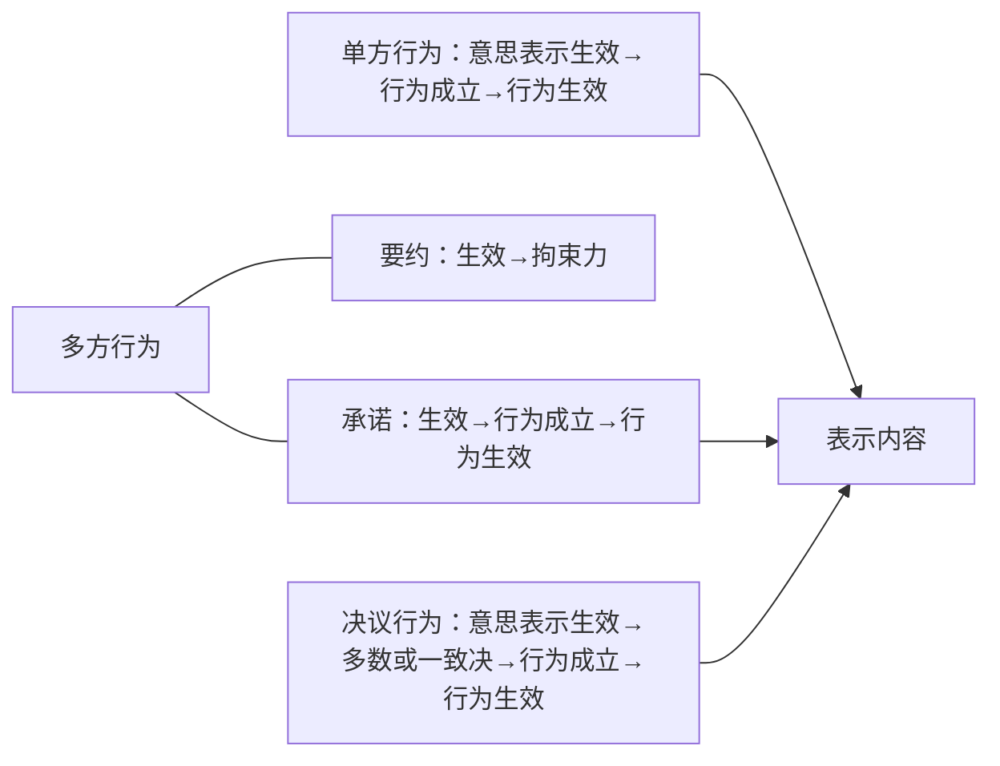

最后一个，意思表示生效的效力和法律行为生效的效力要分开，从头讲一遍：

# （一）单方行为
A发一个解除通知给B，解除首先是解除的意思表示，这个意思表示到达B就生效了。因为意思表示生效，所以解除法律行为就构成了，就成立了。而这个解除法律行为成立之后，它生效的点如果具备就生效了。如果这个解除意思表示没有到达B，那么虽然有意思表示，意思表示没生效，解除法律行为就不成立。
# （二）多方行为 再看多方行为：
- A跟B发一个要约，要约到达B就生效，但是法律行为中的权利义务没有发生（法律中的权利义务意味着这个行为要按照表示内容来产生权利义务，要约没有让它产生按照表示内容发生权利义务的一种效力）。要约只是给对方一个拘束力：
	1. 形式拘束力（不可撤销性）：[^1]A的要约不能随便后悔它，不能随便改了；
	2. 第2个，实质拘束力：要约一到达一生效，对方就取得了承诺的资格。B向A作承诺，合同就成立了。其它没有承诺资格的人，哪怕向A承诺也不会成立。（韩世远书第129页：《合同法》原则上并未规定要约的形式拘束力，但如果要约人确定了承诺期限或者以其他形式明示要约不可撤销，或者受要约人有理由认为要约是不可撤销的，并已经为履行合同做了准备工作，则不再可以撤销要约，要约在很大程度上就具备了形式拘束力。）
	- 再接下去，B向A做一个承诺，承诺一到A这里就生效了。生效的结果是“合同成立了”，如果这个成立的合同能生效的话，最后才是法律行为生效的效力：按表示内容产生权利义务。

[^1]:“建议草案”的起草理由：“关于要约的拘束力，本草案不采纳粹德国法“因要约拘束”之规定，而采纳《公约》于‘接受时受拘束之旨意’以使要约得以撤销”。
# （三）决议行为
再看决议行为，A说，“我投赞成票，他投反对票”，一到达决议的有关机关，这个意思表示就生效了。这个意思表示一生效、一组合，达到多数或一致决（符合法定的要求），决议行为就成立了。一成立之后决议行为符合生效要件，那就决议行为生效。最后，就按照决议的内容产生的权利义务。
# （四）中间结论
所以我们讲，意思表示生效的效力是：要么因它的生效让单方行为直接成立；要么是意思表示的生效，对行为的成立产生一个预备效力（要约最后就是为了让最后合同成立：这个拘束力想目的是要让承诺生效。承诺生效的目的是能够让行为成立）；决议行为是一样的：意思表示生效的结果就是配上多数决，最后让行为成立，然后让行为生效。

这样都知道，什么叫意思表示到达之后生效的效力，指的是意思表示生效，有可能让行为成立，或者为行为成立作准备。但它的效力绝对不是按表示内容来产生效力，按表示内容产生效力必须是法律行为生效之后。现在大概能够了解这个体系。

意思表示成立、生效之区分

|意思表示|判定标准|法效果|
|:---:|:---:|:---:|
|成立|发出|存在|
|生效（无相对人）|发出|行为成立（或其预备效力）|
|生效（有相对人）|到达|行为成立（或其预备效力）|