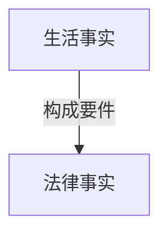

那么同学们接下去我们讲一个重要内容，叫法律事实。
前面讲了法律关系的变动（权利的变动）有哪些形态，以及各种不同的形态，它的特点是什么。接下去我们讲法律关系到底为什么会发生变化呢？变动的原因是什么？或者变动的事由是什么？
# 一、生活事实、构成要件、法律事实

## （一）区分生活事实与法律事实
- 我们说法律关系，它是权利和义务关系。权利义务的变动，是现实生活中的变动，还是人类精神世界中的变动？
	- 好多同学说是现实生活，实际上不是的。法律世界的权利和义务都不是这个物理世界中存在的内容，它本质上是精神世界中的内容，能明白吗？你现实生活中拿一个权利给我看看，你看不到的，这不是物理世界中的问题。只是由于人类的精神状态、精神创造写了个法条，经过立法机关的通过，他就有个权利义务，但是看不见摸不着。
	- 那么现在我们看这么一个抽象的法律世界，我们说权利义务在变动，那么是什么事情才能让他权利义务有变动呢？一定是我们这个物理世界中产生了某一个变动，才会引发出一个抽象的法律世界中的变动。如果物理世界中没有变动，那么抽象的法律世界也不会变动了。只有在物理世界中有变化，才有可能引发出法律世界中的变化。
- 那么接下去就要掌握一点：是不是所有的物理世界中的变化都会导致法律世界中的变化？
	- 我现在在上海在松江，我现在静静听外面，我可以听到外面在下雨，在刮风。
		- 下雨刮风是不是我们物理世界中的一个变化？——当然是。
		- 但它有没有导致权利义务的变化？法律世界的变化有没有？他未必有。
	- 我刚才休息的时候下去看了一下我儿子，这家伙拿了一本漫画书看得开心，在那里笑。
		- 他看漫画书在笑，是个物理世界中的变化。
		- 但它有没有导致我们法律世界中的变化？——根本没有法律世界中的变化。
	- 就在刚才我打了个电话和一个朋友聊了一会天，我听了之后觉得蛮开心的。
		- 我们聊天聊了好一会儿聊天物理世界中有变化。
		- 但有没有法律世界中的变化？——没有。
	- 金老师向丽娜同学发出过一个邀约，王泽鉴老师签名的书500块钱卖给你好不好？
		- 这句话本身是不是物理世界中的变化？一一是的。
		- 这个物理世界中的变化有没有引发出法律世界中的变化？——有。
## （二）介入构成要件
这个问题就来了，哪些物理世界中的变化能够引发抽象法律世界中的变化呢？让权利义务发生变动，这里面有什么规律可循吗？有没有什么规律可循？答案非常简单，金老师这个图已经放在那里了：
一切物理世界中的变化（我们把它简称为生活事实），如果它符合了法律所规定的构成要件，那么它就能够引发权利义务的变动，这个生活事实就变成一个法律事实。
如果一个生活事实。不符合一个法律条文的构成要件，那它就不会引发法律所

规定的权利义务的变化。
所以前面听老师讲的，外面在刮风下雨、我儿子在看漫画书在笑、刚刚有位朋友给我打电话，这些事实为什么没有引发法律上的权利义务，没有引发法律世界中的变化？——因为它不符合任何条文的构成要件，当然不会引发这些条文所规定的法律效果。
为什么“这本书500块卖给你好不好”这个事实为什么能够引发法律世界的变化？——因为它符合了一个条文的构成要件，472条：
第四百七十二条 要约是希望与他人订立合同的意思表示，该意思表示应当符合下列条件：
（一）内容具体确定：
（二）表明经受要约人承诺，要约人即受该意思表示约束。
由于完全符合要约的构成要件，要约的法效果就发生了。什么叫要约的法效果？（1）第一个法效果，我不能随意反悔，除非法律有特别规定。恰恰我国有个特别规定，所以我国可以反悔，对吧？（总之这是一个基本原则，讲出去的话是不能随意反悔的，除非法律有规定——撤回撤销。）
（2）但更重要的法效果是什么？我这句话一说出来，到达了丽娜同学，丽娜同学那边的权利义务就产生了变化——他取得了一个承诺的资格。他有承诺资格，所以他一旦说了“好的”合同就要成立。
为什么他说“好的”合同就能成立？另外一个同学也听到这句话了，他对我说好的合同不会成立的，为什么？因为我要约到达的是丽娜同学，我要约所指定的受要约人是丽娜同学，所以要约的法效果就使得丽娜同学取得了一个承诺的资格。而旁边听到那个人金老师没有想给他什么资格，也不会取得承诺资格。
所以说同学们看，是不是由于我说的这句话（这本书500块卖给你好不好），这个物理世界中的变化（生活事实）正好符合了472条的构成要件，所以就能引发它的法效果：丽娜同学取得承诺资格。

（三）小结
第一个，如果是一个生活事实没有符合法律条文的要件，它就不会变成法律事实，也不能引发权利义务的变动。如果一个生活事实符合了条文的构成要件，那么它这个时候就变成了一个法律事实，引发了法律事件的变化。
第二个，那么构成要件是不是把生活事实的所有内容都转化为了法律事实？还是构成要件只提取了生活事实中的一部分，提取出来的部分就变成法律事实。
（四）构成要件的作用
Z．B．今天是5月5号（五一小长假的最后一天），小明在家里心情很好。躺在床上。拿着手机或者拿着iPad在玩个电脑游戏，玩得很开心。小明的妈妈对小明说，“小明你有没有空帮妈妈去打一瓶酱油？”小明心情很好，于是很爽快就答应了，帮妈妈去打酱油。为了打酱油，把前两天刚买的牛仔裤、鞋子换上了，小明就吹着口哨或者了小曲，跑刚刚跑到楼下门口的时候，看见外面雨刚停，天边的有一道彩虹。所以小明就觉得生活如此美好，正在这么想的时候，小明一脚抬到楼下门口，没注意到一个水坑，脚就踏在水坑里面，崭新的耐克鞋弄脏了，牛仔裤弄湿了，小明一看十分的恼怒，张口就骂了一句国骂。这个时候乙正好骑车从小明身边经过，他没注意到小明踩到了水坑这个事实。他听到了小明这句国骂，以为小明是骂自己的，大怒，所以停下车来，乙就把小明打了一拳，导致小明到医院去支出了医药费71块。

同学们，那么多的事实？这个时候有什么法效果？有什么权利义务的变化？那么多事实是不是都引起了法律世界中的变化？——没有。
那么到底最终引起的法律效果是什么？法律世界的变化是什么？——变化很简单，就是要打小明的乙要赔偿小明医药费71块，还有可能说不定还要赔礼道歉。但是这个法效果的发生是全部事实的作用吗？——不是。因为构成要件提取出来的是什么，法律只关注什么？——提取出来的是，乙故意打了小明，侵害了小明的身体权和健康权，因此应当承担侵权责任。我们民法典1165条第一款规定的。
那么多事实：小明在家里玩Ipad、今天是5月5号假期最后一天、小明的妈妈对小明说能不能打个酱油、小明心情要说好的、下楼穿什么新衣服什么等等，这些事实全部被忽略了。
构成要件只提取了他所关注的内容，他关注内容就是有一个人他做了一个行为，这个行为侵犯了小明的身体的健康，这个行为是故意的，是过错里面的故意，所以要件符合了，自动得出结论：乙要承担侵权责任。
所以我们说构成要件在生活事实和法律事实之间起到什么作用？——提取、筛选的作用。经过构成要件的筛选之后，被筛选上来的内容成了法律事实，其他内容被认为和法律无关，忽略掉。
所以同学们看金老师画的构成要件这个图（中间是有空格的噢，它是个网，构成要件的网，你看前面的生活事实是比较粗的箭头，过滤下来之后变成细的了），就是这个意思。

（五）构成要件所导致的问题以及建议
正因为法律事实是生活事实的提取。它不是把整个生活事实都放在里面，所以呢，这里会出现一个问题的：（1）它往往把很多重要的、在当事人看来很重要的内容，法律上却认为不重要，完全把它忽略掉了。
本案中，乙就会很委屈：我明明听到他骂我了，他骂我了我还不能打他？我们的民法典1165条第1款就会告诉他：对，他骂你你也不能打他。
因为这个条文提取的要件是：你不能故意侵犯他人权利。
所以经常侵权人有时候很委屈：他先惹我的。因为法条按照法条的构成要件，“他先惹的”这个事情被忽略掉了，这样乙心里会觉得很郁闷。
所以第一个，当事人的心情（他会觉得最后法条适用的结果始终觉得不大合理。）（2）第二个后果就是，你们随着训练的深入，法律人的思维会培养起来，法律的思维的特点是：
只关注法律事实，只关注构成要件和法律事实。而这些构成要件法律事实之外的内容，你随着训练的深入，你自动就会把它排除。所以你在处理同一个事情的时候，法律和非法律人思维会很不一样。最后你在从事法律职业的时候，你也会发现你这个思维和别人不一样，从而你会不耐烦。
举个例子来说：
z.B.金老师经常有这个感受，有朋友介绍当事人向金老师来咨询，当事人喜欢从头到脚把他的心里的感受什么等等全部讲给我听。我听了前面开头之后，我就知道我应该关注哪些点了，所以我会很不耐烦的打断他，“这个没关系，你不用讲了；这个有没有，那个有没有”当事人心里就很不舒服，因为在他看来那个是更重要的，金老师不关心我的，我有委屈啊，我的正当感都是从那里来的，你却不关心。
当你成为真正的法律人之后，你要注意到：你的思维已经把生活事实中很多当事人认为重要内容给忽略掉，而你认为是天经地义的，当事人却不会这么认为。所以你一定要关注到你的思维和他思维的差异性，适当的照顾对方的感受，你如果不

照顾对方的感受，对你以后从事法律实务会有一定影响的。
你明明办案是给他办得很好，你法官判决明明是很公正的，当事人就会觉得你太不公正了，你看你都不听我说说，同学们说清楚了没有？这是一个常见的形态的差异。那么这个因素的来源就是因为我们这里所讲构成要件，只提取了部分的事实，剩下的那些被他认为无关要忽略掉，而被他忽略掉的，恰恰当事人可能觉得很重要。这是一个生活事实和法律事实的关系。
（六）竞合：一个生活事实符合数个法律事实

[02:48:01](file:///D:/BaiduNetdiskDownload/%E6%B0%91%E6%B3%95%E6%80%BB%E8%AE%BA11.mp4#t=10081.527337)
