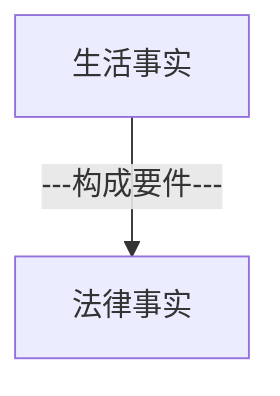
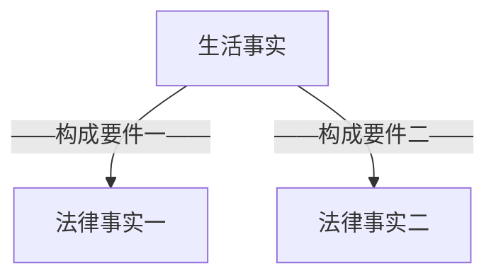

那么同学们接下去我们讲一个重要内容，叫法律事实。
前面讲了法律关系的变动（权利的变动）有哪些形态，以及各种不同的形态，它的特点是什么。接下去我们讲法律关系到底为什么会发生变化呢？变动的原因是什么？或者变动的事由是什么？
# 一、生活事实、构成要件、法律事实

^llny0l

## （一）区分生活事实与法律事实
- 我们说法律关系，它是权利和义务关系。权利义务的变动，是现实生活中的变动，还是人类精神世界中的变动？
	- 好多同学说是现实生活，实际上不是的。法律世界的权利和义务都不是这个物理世界中存在的内容，它本质上是精神世界中的内容，能明白吗？你现实生活中拿一个权利给我看看，你看不到的，这不是物理世界中的问题。只是由于人类的精神状态、精神创造写了个法条，经过立法机关的通过，他就有个权利义务，但是看不见摸不着。
	- 那么现在我们看这么一个抽象的法律世界，我们说权利义务在变动，那么是什么事情才能让他权利义务有变动呢？一定是我们这个物理世界中产生了某一个变动，才会引发出一个抽象的法律世界中的变动。如果物理世界中没有变动，那么抽象的法律世界也不会变动了。只有在物理世界中有变化，才有可能引发出法律世界中的变化。
- 那么接下去就要掌握一点：是不是所有的物理世界中的变化都会导致法律世界中的变化？
	- 我现在在上海在松江，我现在静静听外面，我可以听到外面在下雨，在刮风。 ^l606au
		- 下雨刮风是不是我们物理世界中的一个变化？——当然是。
		- 但它有没有导致权利义务的变化？法律世界的变化有没有？他未必有。
	- 我刚才休息的时候下去看了一下我儿子，这家伙拿了一本漫画书看得开心，在那里笑。 ^az7usq
		- 他看漫画书在笑，是个物理世界中的变化。
		- 但它有没有导致我们法律世界中的变化？——根本没有法律世界中的变化。
	- 就在刚才我打了个电话和一个朋友聊了一会天，我听了之后觉得蛮开心的。 ^xk1ril
		- 我们聊天聊了好一会儿聊天物理世界中有变化。
		- 但有没有法律世界中的变化？——没有。
	- 金老师向丽娜同学发出过一个要约，王泽鉴老师签名的书500块钱卖给你好不好？
		- 这句话本身是不是物理世界中的变化？一一是的。
		- 这个物理世界中的变化有没有引发出法律世界中的变化？——有。
## （二）介入构成要件
- 这个问题就来了，哪些物理世界中的变化能够引发抽象法律世界中的变化呢？让权利义务发生变动，这里面有什么规律可循吗？有没有什么规律可循？答案非常简单，金老师这个[[法律关系（权利）变动之原因：法律事实#^llny0l|图]]已经放在那里了：
	- 一切物理世界中的变化（我们把它简称为生活事实），如果它符合了法律所规定的构成要件，那么它就能够引发权利义务的变动，这个生活事实就变成一个法律事实。
	- 如果一个生活事实。不符合一个法律条文的构成要件，那它就不会引发法律所规定的权利义务的变化。
	- 所以前面听老师讲的，[[法律关系（权利）变动之原因：法律事实#^l606au|外面在刮风下雨]]、[[法律关系（权利）变动之原因：法律事实#^az7usq|我儿子在看漫画书在笑]]、[[法律关系（权利）变动之原因：法律事实#^xk1ril|刚刚有位朋友给我打电话]]，这些事实为什么没有引发法律上的权利义务，没有引发法律世界中的变化？——因为它不符合任何条文的构成要件，当然不会引发这些条文所规定的法律效果。
- 为什么“这本书500块卖给你好不好”这个事实为什么能够引发法律世界的变化？——因为它符合了一个条文的构成要件，472条：![[第三编 合同#^ndjm18|民法典472]]
	- 由于完全符合要约的构成要件，要约的法效果就发生了。什么叫要约的法效果？
		1. 第一个法效果，我不能随意反悔，除非法律有特别规定。恰恰我国有个特别规定（[[第三编 合同#^98fhvl|民法典477]]），所以我国可以反悔，对吧？（总之这是一个基本原则，讲出去的话是不能随意反悔的，除非法律有规定——撤回撤销。）
		2. 但更重要的法效果是什么？我这句话一说出来，到达了丽娜同学，丽娜同学那边的权利义务就产生了变化——他取得了一个承诺的资格。他有承诺资格，所以他一旦说了“好的”合同就要成立。
	- 为什么他说“好的”合同就能成立？另外一个同学也听到这句话了，他对我说好的合同不会成立的，为什么？因为我要约到达的是丽娜同学，我要约所指定的受要约人是丽娜同学，所以要约的法效果就使得丽娜同学取得了一个承诺的资格。而旁边听到那个人金老师没有想给他什么资格，也不会取得承诺资格。
	- 所以说同学们看，是不是由于我说的这句话（这本书500块卖给你好不好），这个物理世界中的变化（生活事实）正好符合了[[第三编 合同#^ndjm18|民法典472]]的构成要件，所以就能引发它的法效果：丽娜同学取得承诺资格。
## （三）小结
1. 第一个，如果是一个生活事实没有符合法律条文的要件，它就不会变成法律事实，也不能引发权利义务的变动。如果一个生活事实符合了条文的构成要件，那么它这个时候就变成了一个法律事实，引发了法律事件的变化。
2. 第二个，那么构成要件是不是把生活事实的所有内容都转化为了法律事实？还是构成要件只提取了生活事实中的一部分，提取出来的部分就变成法律事实。
## （四）构成要件的作用
- 今天是5月5号（五一小长假的最后一天），小明在家里心情很好。躺在床上。拿着手机或者拿着iPad在玩个电脑游戏，玩得很开心。小明的妈妈对小明说，“小明你有没有空帮妈妈去打一瓶酱油？”小明心情很好，于是很爽快就答应了，帮妈妈去打酱油。为了打酱油，把前两天刚买的牛仔裤、鞋子换上了，小明就吹着口哨或者了小曲跑，刚刚跑到楼下门口的时候，看见外面雨刚停，天边的有一道彩虹。所以小明就觉得生活如此美好，正在这么想的时候，小明一脚抬到楼下门口，没注意到一个水坑，脚就踏在水坑里面，崭新的耐克鞋弄脏了，牛仔裤弄湿了，小明一看十分的恼怒，张口就骂了一句国骂。这个时候乙正好骑车从小明身边经过，他没注意到小明踩到了水坑这个事实。他听到了小明这句国骂，以为小明是骂自己的，大怒，所以停下车来，乙就把小明打了一拳，导致小明到医院去支出了医药费71块。 ^xpcdbg
	- 同学们，那么多的事实？这个时候有什么法效果？有什么权利义务的变化？那么多事实是不是都引起了法律世界中的变化？——没有。
	- 那么到底最终引起的法律效果是什么？法律世界的变化是什么？——变化很简单，就是要打小明的乙要赔偿小明医药费71块，还有可能说不定还要赔礼道歉。但是这个法效果的发生是全部事实的作用吗？——不是。因为构成要件提取出来的是什么，法律只关注什么？——提取出来的是，乙故意打了小明，侵害了小明的身体权和健康权，因此应当承担侵权责任。我们[[第七编 侵权责任#^0jplgg|民法典1165]]第一款规定的。
	- 那么多事实：小明在家里玩Ipad、今天是5月5号假期最后一天、小明的妈妈对小明说能不能打个酱油、小明心情要说好的、下楼穿什么新衣服什么等等，这些事实全部被忽略了。
	- 构成要件只提取了他所关注的内容，他关注内容就是有一个人乙，他做了一个行为，这个行为侵犯了小明的身体的健康，这个行为是故意的，是过错里面的故意，所以要件符合了，自动得出结论：乙要承担侵权责任。
	- 所以我们说构成要件在生活事实和法律事实之间起到什么作用？——提取、筛选的作用。经过构成要件的筛选之后，被筛选上来的内容成了法律事实，其他内容被认为和法律无关，忽略掉。
	- 所以同学们看金老师画的构成要件这个[[法律关系（权利）变动之原因：法律事实#^llny0l|图]]（中间是有空格的噢，它是个网，构成要件的网，你看前面的生活事实是比较粗的箭头，过滤下来之后变成细的了），就是这个意思。
## （五）构成要件所导致的问题以及建议
- 正因为法律事实是生活事实的提取。它不是把整个生活事实都放在里面，所以呢，这里会出现一个问题的：
	1. 它往往把很多重要的、在当事人看来很重要的内容，法律上却认为不重要，完全把它忽略掉了。
		- [[法律关系（权利）变动之原因：法律事实#^xpcdbg|本案中]]，乙就会很委屈：我明明听到他骂我了，他骂我了我还不能打他？我们的[[第七编 侵权责任#^0jplgg|民法典1165]]第1款就会告诉他：对，他骂你你也不能打他。
			- 因为这个条文提取的要件是：你不能故意侵犯他人权利。
			- 所以经常侵权人有时候很委屈：他先惹我的。因为法条按照法条的构成要件，“他先惹的”这个事情被忽略掉了，这样乙心里会觉得很郁闷。
			- 所以第一个，当事人的心情（他会觉得最后法条适用的结果始终觉得不大合理。）
	2. 第二个后果就是，你们随着训练的深入，法律人的思维会培养起来，法律的思维的特点是：
		- 只关注法律事实，只关注构成要件和法律事实。而这些构成要件法律事实之外的内容，你随着训练的深入，你自动就会把它排除。所以你在处理同一个事情的时候，法律和非法律人思维会很不一样。最后你在从事法律职业的时候，你也会发现你这个思维和别人不一样，从而你会不耐烦。
		- 举个例子来说：金老师经常有这个感受，有朋友介绍当事人向金老师来咨询，当事人喜欢从头到脚把他的心里的感受什么等等全部讲给我听。我听了前面开头之后，我就知道我应该关注哪些点了，所以我会很不耐烦的打断他，“这个没关系，你不用讲了；这个有没有，那个有没有”当事人心里就很不舒服，因为在他看来那个是更重要的，金老师不关心我的，我有委屈啊，我的正当感都是从那里来的，你却不关心。
			- 当你成为真正的法律人之后，你要注意到：你的思维已经把生活事实中很多当事人认为重要内容给忽略掉，而你认为是天经地义的，当事人却不会这么认为。所以你一定要关注到你的思维和他思维的差异性，适当的照顾对方的感受，你如果不照顾对方的感受，对你以后从事法律实务会有一定影响的。
			- 你明明办案是给他办得很好，你法官判决明明是很公正的，当事人就会觉得你太不公正了，你看你都不听我说说，同学们说清楚了没有？这是一个常见的形态的差异。那么这个因素的来源就是因为我们这里所讲构成要件，只提取了部分的事实，剩下的那些被他认为无关要忽略掉，而被他忽略掉的，恰恰当事人可能觉得很重要。这是一个生活事实和法律事实的关系。
## （六）竞合：一个生活事实符合数个法律事实


- 同学们再看，同一个生活事实。有没有可能同时构成两个法律事实？——请求权竞合就是典型的这样的现象（不仅是请求权，各种权利的竞合了）。
- 侵权与违约，举一个例子，甲把一个东西交给乙保管，乙擅自就把这东西卖给丙并交付了，甲丧失所有权了。
	- 那么甲和乙之间有保管合同，所以以擅自出卖的行为
		1. 违反了保管合同。
		2. 乙擅自出卖让甲的所有权没了，侵犯了甲的所有权，同时也侵权。
	- 所以我们看了刚刚那个事实，生活事实只有一个：甲委托给乙保管，乙擅自卖给丙。这就是同一的一个生活事实。
	- 但是为什么它同时成为侵权和违约两个法律事实呢？——因为生活事实
		1. 既符合违约的构成要件。
		2. 这个生活事实同时又符合侵权的构成要件，我们说它是一个第二个法律事实——侵权行为。
- 所以现在知道竞合怎么来的了吧：同一个生活事实同时符合两个以上的构成要件，被两个以上的构成要件所提取，提取出来两个法律事实，当然会引发两个权利，义务的变动。
## （七）法律事实之分类
这个很简单，后面难的就来了。接下去我们要分析，各种法律事实的类别，我们要给各种法律事实都给贴个标签，叫什么名字，这个非常重要。这个东西是不是掌握的好，对将来的学习是特别重要的，民法上必须要使用的概念工具。
- 法律事实的类型 ^n9pjob
	- 自然事实
		- （自然）事件
		- （自然）状态
	- 行为
		- 适法行为
			- 表示行为
				- 法律行为（意思表示）
				- 准法律行为
					- 意思通知
					- 观念通知
					- 感情表示
			- 非表示行为（事实行为）
		- 违法行为
			- 债务不履行（违约行为、缔约过失等）
			- 侵权行为
			- 侵夺占有行为
			- 失权行为
			- 其他
### 1.自然事实
那么这就是这个图就是[[法律关系（权利）变动之原因：法律事实#^n9pjob|各种法律事实的类型]]。
- 好，接下去我们来看各个法律事实的类型有什么特点？通过例子来讲：风吹果落：牛顿坐在树下思考问题了，一阵风吹来，树上的苹果掉下来，砸到了牛顿的脑袋。 ^70e5v0
	- 现在这么一个事实里面，风吹果落是不是法律事实？
		- 同学们，这个问题的思考方式只有一个：如果你说不是，意味着你认定在整个风吹果落的过程中，法律世界中没有产生变化，权利义务都没变动。如果你说是，意味着你已经找到了法律世界中的变化，你才可以说是。不能结合环境，就到此为止了。
		- 我们的321条第一款：![[第二编 物权#^or1xrv|民法典321]]
		- 这棵树肯定有个所有权人，掉下来的苹果叫“天然孳息”，孳息——生出来的东西。那么在这个条文里面，构成要件是天然孳息。天然孳息引发的法效果是什么？——天然孳息的权利，由所有权人取得。
		- （砸到的时候被他是不一样的，现在截取其中一个事实，后来慢慢再扩展（砸到牛顿头上，骂了句国骂）。现在只截取“风吹果落”这个事实，有没有导致权利义务的变动？
		- “风吹果落”本身结局那么小的4个字，已经是个法律事实了，既然说到法律事实，肯定要先找得到权利义务的变动，才能说它是个法律事实。
		- 我给大家解释：构成要件是天然孳息，法律效果是所有权人会取得天然孳息的所有权。
		- 但是，这并不是这里所说的权利义务变动的全部，在天然孳息由所有权人取得权利变动的之中，蕴含了一个在先的权利义务变动：
			- 本来苹果长在苹果树上，有几个所有权？这个苹果是不是个独立的所有权？假设树上有100个苹果，一棵苹果树，问上面有几个所有权： 当然是1个。这时候的苹果是苹果树的组成部分，所以只有一个所有权，这个所有权就是苹果树（结了100个苹果的苹果树）的所有权。
			- 本来只有一个，但是在风吹果落的那一刹那，被吹落的苹果从苹果树上和苹果，树分开了，在分离的一刹那，有几个所有权？——两个。在分离的那一刹那，分离的苹果已经不再是苹果树的组成部分了，当然会出现一个新的所有权。
		- 所以同学们注意到：风吹果落已经是个法律事实了，这个法律事实所引发的第一个变动是什么？——苹果独立的所有权发生了（苹果也有了独立的所有权，此前它只是苹果树所有权的组成部分而已。）
	- 那么有同学问，你说一分离就有所有权，这个哪里来的（没有条文）？你不是说一个生活事实，经过构成要件的提取就会变成法律事实，那么你说构成要件在哪里？
		- 同学们，就是老师要教你们的：天然孳息这4个字，问，长在树上的苹果是不是天然孳息？——答案是，不是。
		- 这就需要老师教你们了——长在苹果树上的苹果是苹果树的组成部分，不是天然孳息。天然孳息的定义就是要和原物相分离的，掉下来的苹果在那一刹那成为天然孳息。
		- 所以这个构成要件是学理上告诉，是由天然孳息的定义中所包含的构成要件。
		- 现在知道了这一点之后，我们来看风吹果落这个生活事实。它（风吹果落）符合了学理上天然孳息定义中的哪个构成要件（天然的隐含了一个要件）？——和原物相分离的要件。
		- 第二个变动就是苹果所有权归谁，由[[第二编 物权#^or1xrv|这个条文]]来决定。
			所以风吹果落一刹，那生活事实符合了这个构成要件（和原物相分离），所以成为一个法律事实。这个法律事实，就使得苹果所有权发生，至于发生的苹果所有权谁取得呢？
			- 由于有[[第二编 物权#^or1xrv|这个条文]]（有所有权人按所有权人来）。[03:20:01](file:///D:/BaiduNetdiskDownload/%E6%B0%91%E6%B3%95%E6%80%BB%E8%AE%BA11.mp4#t=12001.298885)
			- 如果既有所有权又有用益物权，比方说土地是甲的，苹果树也是假的，但是用益物权是归一个土地承包经营权人乙的，那么这个掉下来的苹果归谁？——归土地承包经营权人。
			- 也就是说在本案中在第一个例子里面，我希望同学们掌握个事情
				1. 第一个你说它是不是法律事实的回答，你必须要先去看法律世界中有没有变化，才能回答。你没有想过法律事件中有什么样的变化，直接回答思维方法是错误的。
				2. 第二个，那么法律事件中有没有变化，你怎么去找？你当然要看有没有哪个条文的构成要件被符合，本案中就是天然孳息里所包含的潜在构成要件被满足。
				- 这两个结合起来你才能说它是不是法律事实。
	- 本案法律事实有什么特点？——与原物相分离。
		- 法律要的是分离的结果还是分离的原因，构成要给你有没有要求人的行为，必须是用手摘下来的、用杆子打下来的，才会导致天然孳息的发生；还是不管什么结果，只要分离了都会导致天然孳息的发生，独立所有权的发生？
		- 这个时候注意一下，在这里面构成要件中没有要求行为，不一定是需要行为把它摘下来才会导致孳息发生。
		- 凡是让法律事实产生的构成要件，没有要求人的行为参与的这种法律事实，我们都叫自然事实。
### 2.行为
- 我们再看下面一个例子，出卖人乙逾期不交标的物，且打伤路人A。
	- 这是不是法律事实？—当然是。而且这里面有两个法律事实： 
		1. 出卖人以逾期不交标的物，这是个生活事实对应法律事实是违约行为； 
		2. 出卖人乙打伤了，路人A是个侵权行为。两个法律事实，被两个构成要件所提取，得出两个法律事实。
	- 这个法律事实有个什么特点？没有行为的话，会符合它构成要件吗？它的构成要件，是不是一定要有行为参与的，才能构成违约行为和侵权行为的？
		- 我们看条文：![[第三编 合同#^pqlryz|民法典577]]条文明确“一方要不履行合同义务或者履行合同义务不符合约定”，“不履行合同义务和履行合同义务不符合约定”这是不是两个行为？——一个是不作为，一个是作为。他都要求一些构成要件中，要求必须要有行为，没有行为不会符合他构成要件。
		- 看侵权：![[第七编 侵权责任#^0jplgg]]
			- 条文明确要有一个侵害他人民事权益的行为，没有行为他不可能构成侵权的，当然这个行为在特定情况下可能是不作为（该管不管也有可能侵权的）：比方说公共场所的维护者没有好好的设置好标志牌，他没有做是不作为，同样会构成侵权行为的，但是无论如何构成要件要求行为。
			- 这种构成要件中非有行为不可的法律事实，我们给它一个名称，叫行为。
	- 到现在为止同学们明白了，什么叫自然事实？——构成要件说，构成要件中不要求有行为参与，有没有行为都可以，随你便。而另外一种法律事实是什么？构成要件中，非有行为不可的。
### 3.界分：是否以行为为构成要件
#### （1）摘苹果案：先找法效果
- 知道了这个之后我再来改造一下[[法律关系（权利）变动之原因：法律事实#^70e5v0|例子]]：下面这次苹果不是被风吹下来的，假设是牛顿自己的苹果树，牛顿该搭了个梯子爬上去摘下一个苹果，这是个什么法律事实？
	- 同学们，我们思考它是不是法律事实以及是什么法律事实。第一步要先找什么？——法律世界中有什么变化：
		- 牛顿爬上树，把苹果摘下来，这是一个生活事实，你要凭这个来判定是什么法律事实是什么是没用的，看生活事实中的形态一点都没用。
		- 先要找到生活事实做完之后有什么权利义务的变动，你们告诉我哪个地方有权利义务的变动？——苹果本来没有独立的所有权，因为被牛顿摘下来，现在有了独立所有权，这是唯一的一个法律世界中的变化。
		- 苹果把它牛顿做完这个事情之后，法律事件所引发的唯一变化就是苹果独立所有权发生。
		- 接下去要判定这是个什么法律事实，就要看构成要件要求了什么？——对于苹果独立所有权的发生，构成要件要求什么：要求必须有人的行为去把它摘下来吗？还是不管什么原因，只要分离就可以？
		- 构成要件说只要分离就可以，有没有行为都无所谓。所以按照构成要件来界定法律事实，构成要件没有要求非行为不可，所以它是自然事实。
		- 本案中牛顿架了个梯子爬上去，这些全部可以被忽略，没有意义的，不是法律事实的组成部分。法律事实的唯一组成部分：分离。
	- 接下去我问你们任何问题，第一步应该先找什么？——不能看直观的生活形态（“牛顿爬上去的”，这个在这里边没有用），先找法效果是什么。不是构成要件，先找法效果（权利义务有什么变动），然后再看这样的一个权利义务的变动，法条要求了什么构成要件，看构成要件是不是非有行为不可。

>**法律事实之判定步骤**
>```mermaid
>flowchart TB
>1["法效果？"]
>2["构成要件：要求什么？"]
>1-->2
>```
>你如果没有掌握这个思维步骤、这么一个思维方法，你法律事实永远看不清楚的。

- 这时苹果树不是牛顿的了，牛顿搭了个很高的梯子，爬到了邻居家苹果树上，把邻居家的其中一个苹果偷偷摘下来，这是个什么法律事实？
	- 某同学：“首先看法律效果的话是产生了一个独立的所有权，它的构成要件是自然孳息，所以苹果从树上分离这个事实的话应该是一个自然事实。”
	- 金：不能按照这个来，他是自然事实一定是用构成要件来说话的。
	- 自然事实的特点是什么？——是为了引发苹果独立所有权这个法效果，它的构成要件里不要求行为，所以是自然事实。你要是把这句话都说我说完整了，就完全到家了。
	- 金第一个法效果：苹果独立所有权的发生。就此法效果，构成要件只要求分离，而不问分离的原因是什么，不要求人的行为参与。所以既然构成要件中不以人的行为为要件，那它就不是行为，只能是自然事实。这句话也要说完整。
	- 某同学：第二个法效果是侵权责任的发生，以行为为要件，所以它是一个行为。
	- 金：说得很好。第二个法效果：侵权责任的发生，其构成要件一定要有行为人的行为的参与，所以这个法律事实只能是行为。这句话也要说完整。
	- 上面金老师两句话一定要嘴巴说一遍。
	- 问，侵权行为侵犯的是什么？
		- 注意一下，侵权行为一开始去摘苹果的时候，侵犯的是对邻居的苹果树的所有权（不能用附属物这样的词）。
		- 摘下来之后，侵犯的是邻居对苹果的所有权，继续答的话就是无权占有（以无权占有的方式侵犯他的所有权，但侵犯的是苹果所有权），接下去会引发好多请求权基础，我这个讲清楚了没有？
#### （2）继承
- 再问大家一个问题：甲死了，他的财产他的财产都被他的继承人继承了，问这是个什么法律事实？ ^rlq2ln
	- 甲死了导致什么样的法律效果？——导致两个法律效果：
		1. 第一个法律效果是权利消灭。![[第一编 总则#^thda5j|民法典13]]
			- 所以死亡导致权利能力的消灭。
			- 现在问大家，就这个法效果而言，构成要件要求了什么？
			- 要求了死亡的结果，死亡的事实。
			- 不要求有必须有人的行为参与，所以就这个法效果而言，它是一个自然事实。
		2. 第二个法效果是财产被乙继承了。就继承这个法效果而言，构成要件只要求了死亡的结果，没有要求因什么原因死的。所以第二个法效果而言，也仍然是个自然事实，这样分析就对了。

- 现在我把[[法律关系（权利）变动之原因：法律事实#^rlq2ln|例子]]稍微改一改：甲被丙杀死了，这是个什么法律事实？（先说法效果，分开各个法效果分别说。看各个法效果各自的构成要件要求什么，分别来讲。）
	1. 第一个法效果：甲权利能力的消灭。就此法效果而言，构成要件要求了什么？——要求了死亡的结果，没有要求必须有人的行为的参与，所以是自然事实。
	2. 就第二个法效果来说，甲的财产会被乙继承，这时候同样构成要件只要求死亡的结果，不以人的行为为要件，所以仍然是自然事实。
	3. 第三个法效果，甲的继承人（甲的近亲属）有权丙主张一系列的侵权责任（甲自己死了不能主张了，由近亲属主张）。此时就侵权责任而言，要求必须要求侵权人行为，这才构成要件就要求侵权人行为的参与。所以就此法效果而言，法律事实是行为。
	- 甲如果是被继承人杀死就不能继承了，这是不是行为？
		- 同学们看这个法条：![[第六编 继承#^jtvfn8|民法典1125]]
		- 这个条文所引发的法效果是丧失继承权，对于丧失继承权条文，要件是要求有这个行为，所以它是行为。
#### （3）出生
- 再训练一下大家， 甲出生了，这是个什么法律事实？
	- 自然事件。
	- 但是有个疑问，出生不是妈妈很努力把他生出来的。即使不是妈妈努力生的，妈妈打了麻药之后剖腹产，你有医生的行为的参与，为什么它不是行为？
		- 法条对于构成要件要求的是生出来的结果（只要是小孩生出来是活的，并且和母体相分离的时候是活的）：
			1. 就生出来是活的。
			2. 和母体相分离。
			- 要的是这两个，至于它怎么出来的和构成要件就无关。
		- 它必然是有行为人的行为参与的，但构成要件没有要求把考虑到要件里面，只要求小孩和母体相分离，并且活在了世界这个事实。
#### （4）海难：
- 甲乘船出海，因海难下落不明，已满两年。是行为还是自然事实？应该是用40条还是第46条？ ^w6r0ut
	- ![[第一编 总则#^yfgae1|民法典40]]![[第一编 总则#^w8vws4|民法典46]]
	- 海难属于意外事件。先找出法效果：利害关系人申请宣告失踪、申请宣告死亡的权利发生。
	- 构成要件是什么？是不是非有人的行为参与不可？一一不是。下落不明，不管因为什么原因造成的，都可以算。既然都可以算，那么它就是自然事实。
	- 如果我稍微改一改，这个海难是人为造成的，由侵权行为人造成的。对于宣告失踪和宣告死亡权利发生，这个法效果，它的性质有没有变化？
		- 没有。
		- 也就是说由于它的构成要件中不要求行为的参与，但你有行为参与也不影响它仍然是个自然事实。因为虽然有人的行为参与，但这个参与不是构成要件所要求的，参与不要紧，也不会影响他的定性。
	- 意外事件一定是人都能参与的吗？——不是。在意外事件，狂风（不可抗力也算，没有人参与的意外事件也是意外事件。
	- 自然人下落不明是要件，但下落不明是不是行为？——不是，下落不明是个结果—人找不到了。什么原因找不到了，有可能有个人把它藏起来，那是行为，但这个行为不是要件所要求的，所以是自然事实。

- 事件与状态：[[法律关系（权利）变动之原因：法律事实#^70e5v0|风吹果落]]与[[法律关系（权利）变动之原因：法律事实#^w6r0ut|海难]]
- 现在问大家，这个自然事实和天然孳息「风吹果落」自然事实有什么不同？
- 和风吹果落相比，对风吹果落，一分离（物理世界中变动一发生），权利义务就发生了。而物理世界上变化一变，马上导致权利义务变动，这个叫事件。
- 下落不明，已经是个物理世界中的变化（这个人找不到了）。但这个变化物理世界的变化一发生，有没有直接导致权利义务的变动？——没有。等2年，或者等4年。
- 所以本质上是下落不明的状态，持续一段时间之后，才导致权利义务的变化。物理世界的变化一发生，没有变化，持续时间到满两年，变化来了，所以是持续满两年，加起来才是个法律事实。这时候物理世界一变化，法律世界没变化，物理世界的变化持续一段时间，法律世界才变化，这叫状态。
- 所以孳息独立→所有权的发生一一是事件。出生、死亡是事件。
- 诉讼时效的届满是状态。这是典型的是要求权利人（请求权人）不主张权利的状态持续，是典型的状态。
消灭时效届满的法效果是对方抗辩权的发生。对方抗辩权的发生要求什么？一一（1）消灭时效起算，该履行不履行；（2）但是是不是该履行不履行一发生就导致时效届满了呢？——没有，这个状态（不请求）要持续三年，对方抗辩权才发生。除斥期间也一样的，我有解除权了，但我没有在法定的时间内／约定的时间内行使，但不行使到一定时间，届满了权利消灭，所以这些都是状态。
#### （5）摘野花 
- 例子： 丙上山游玩，采路边野花数朵。（法律规定野生动植物资源都归国家所有，先把这个条文给它忽略掉。假设没这个规定）
	- 判断是自然事实还是行为——先看法效果是什么
	- 路边野花所有权采下来之前归谁？路边野花的主人是谁？——野花通常就是无主物。原来在路边的野花在采下来之前有一棵树，那么这个花被采下来之前就是树的组成部分。这个树都是无主的，你采下来之后花也不有主。所以在这个例子里面，花和树的分离不会产生花的所有权，分离的一刹那花还是没有所有权的。因为本来树就是无主物，下来的花也是无主物。
	- （花分离那一刹那没有独立的所有权）那么这里的法效果是丙取得了野花的所有权。
	- 丙是怎么取得野花所有权的？
		- 野花本来没有所有权，它是野树的组成部分。
		- 野树没有所有权，那么野花和野树刚分离那一刹那也没有所有权。
		- 所以野花也是无主物，就这个无主物丙先占为己有（这叫先占）了。
		- 因无主物的先占，丙就取得了野花的所有权。所以法效果是丙取得野花的所有权。
	- 构成要件要求什么？一一先占。
		- 此前（花和树的分离）连自然事实都不是，因为它没有导致法律效果的变化。
		- 本来是无主物，现在还是无主物。只有物理形态上的变化：花脱离了树。
		- 这里的分离和前面有主物的那棵树和果的分离不一样，因为树本来就没有所有权，你分离了之后只是花脱离了没有所有权的树，花没有产生所有权？——没有。法效果没有，怎么会成为自然事实呢？
		- 所以本案中唯一的法效果是什么？分离之后的无主物野花，被丙取得所有权了，本来没有所有权，现在有所有权（且被丙取得），为什么？——无主物先占。
	- 导致[[法律关系（权利）变动之原因：法律事实#^y66lio|法律效果（丙取得所有权）]]的法律事实是什么？
		1. 第一，有个无主物，至少是个可先占物。（我们国家虽然规定野生动植物资源归国家所有。但是法律没有禁止的，野生动植物资源还是可以先占的。国家保护的名贵珍稀动植物，你不能先占，普通的是可以的，这里就忽略了。不管你认为它是无主物、有主物也好，但只要它可先占，也行了。）
		2. 第二个要件是要取得于自主占有，就是丙要把这个东西占为己有。
		3. 第三个要有先占的权利和自由。

>**先占之要件**
>```mermaid
>flowchart LR
>1["无主物/可先占物"]
>2[取得自主占有]
>3[有先占之权利或自由]
>4[无法定之先占禁止]
>5[未侵害他人之排他先占权]
>先占之要件---1 & 2 & 3
>3---4 & 5
>```
^y66lio
