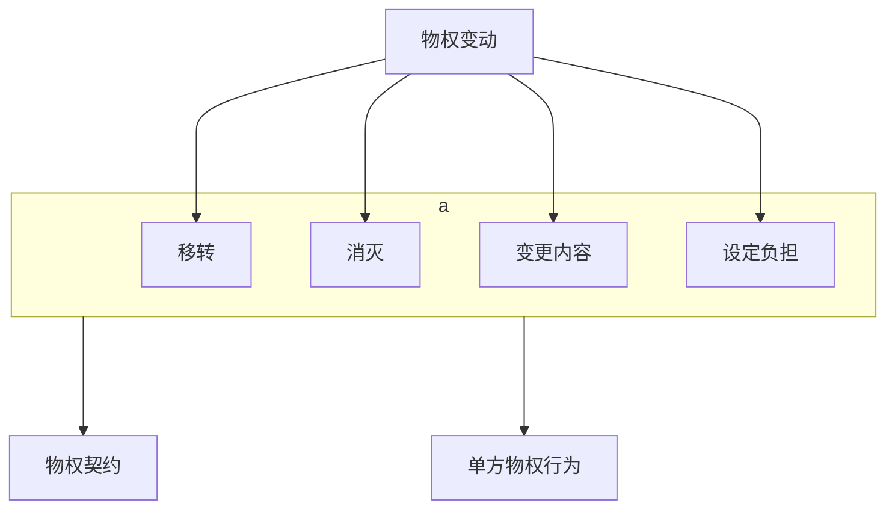

# （一）概念
- 债权行为：以发生债权债务为内容=负担行为
- 物权行为：以[[债权行为与物权行为#^xdqzzu|物权变动]]为内容→一种处分行为

^xdqzzu

前面学了负担行为（又叫债权行为）和处分行为。但是处分行为不等于物权行为，如果处分行为减损的权利是个物权，那才叫物权行为；处分行为所减损的权利，他如果不是物权，不是物权是其他权利叫准物权行为。

- 我们这里为什么要专门讲债权行为和处分行为中的一部分——物权行为的关系呢？——那就是因为，注意一下，在通常的情形对于处分行为的存在是不会有争议的，比方说：
	- 金老师把这本书抛弃了，大家都会认为这肯定是处分行为。
	- 金老师说我免除对你的债务，一样的，大家都会他都认为这（免除）是个处分行为没有问题。

但前面讲过，当前面有个负担行为，为了履行负担行为（负担行为要履行要移转、变动权利的时候），这个时候就会有争议：是负担行为本身就能把权利移转、变动过去；还是在负担行为之外，需要一个独立的处分行为来移转、变动过去。因为有这个争议，所以特别需要讲讲在有负担行为有债权行为的情形下，后面的权利变动是怎么发生的，这就涉及到物权行为需不需要认为有个独立的处分行为物权行为的问题。
# （二）几种立法模式
我们以买卖合同为例：有了一个买卖合同，所有权的移转需要有一个独立的物权行为，还是不需要独立的物权行为？以及如果认为有独立的物权行为，物权行为和买卖合同之间是有因还是无因的关系？根据这两个标准，我们可以分成四种立法模式：

- 四种立法模式
	- 一体模式
		- 意思主义=公示对抗主义
		- 形式主义：仅针对物权变动
	- 区分模式（物权形式主义）
		- 无因模式
		- 有因模式

我们都知道一体和区分指的是物权行为独立不独立的问题，买卖合同之外是不是另有物权行为的问题。在一体模式下认为只有买卖合同没有物权行为，所有权的移转不需要另做一个物权行为。在区分模式下认为，买卖合同本身只是发生债权债务，所有权（既存权利）的变动，还是需要一个独立的处分行为来完成。
## 1．一体模式
### （1）意思主义＝公示对抗主义
那么在一体模式和区分模式下，又可以分别分出两种不同的模式来。在一体模式下只有一个买卖合同，没有物权行为的。那么所有权怎么移转的？——第一种模式（意思主义）认为：“B同学，我以这本书500块卖给你”，B同学说“好的”。合意一达成，如果这个合同没有其他的无效事由，合同马上就生效了。合同一生效，所有权就归对方了，连公示都不需要。
#### A.公示（交付）之作用：权利强化
这个立法模式认为买卖合同一成立就生效，一生效所有权就一转，连交付都不需要，所有权已经归B同学了。那么交付起到什么作用：现在我们签了买卖合同所有权归B同学了，但我这本书还在我这里，所以我对C同学说，“C同学你看我有这本书，你要不要，450卖给你”，C同学说“好的”，我们又签了一个买卖合同，买卖合同一签之后，C同学也获得了所有权，也不需要交付的。现在是有两个所有权了，谁的所有权厉害？——跟合同签订在先在后没关系，看交付给谁。交付给谁，谁的所有权就厉害。

它产生了两个所有权的竞争模式，这个时候交付起到一个谁的所有权更厉害的作用。
#### B.分析
- 也就是说，在这个模式之下，我问四个问题：
	1. 第一个问题，物权什么时候变动的？——严格讲起来是合同生效，因为成立那之后有可能不生效，比方说附了个条件（买卖合同两个月之后如果天下雨的话就生效，合同是成立的，但是还没生效）。所以严格讲起来物权变动的时间点是合同生效。
	2. 第二，在这种模式下，物权变动的依据是什么？哪个法律行为？——就是负担行为（买卖合同）。在这个模式下，交付是什么？交付是不是一个独立的物权行为？他绝不认为交付的过程中是个物权行为，交付就是个事实，起到强化的作用。
	3. 所以，第三个，交付上面没有体现出物权行为，不能认为交付代表了一个物权行为。交付起到的功能是什么？——强化权利，谁拿到谁厉害，公示对抗。也就是说在这个模式下，交付就是一种单纯的公示而已。它的效力是公示之后权利会强化。
	4. 第四个问题，如果买卖合同无效，它的法效果是什么？——唯一的一个法律行为就没有效力了，所以当然所有权没有移转。无论交付在谁那里，还过来。
	5. 这个时候有几个请求权？——物权请求中的原物返还；不当得利。客体都是占有。
#### C.质疑
- 在这个模式之下，它逻辑上有什么问题：（1）怎么变成好像有两个所有权了？一个物上怎么会有两个所有权？（2）你不是所有权就卖给他了吗？你第二个所有权给他的依据是什么？你没有处分权，凭什么让他取得所有权？有两个逻辑上的问题。
	- （按照（债权）意思主义，当事人签订第二个合同的时候，他就没有想到有权处分、无权处分的问题。反正他就咬着牙说，第二个买受人也能取得所有权，逻辑是什么就讲不清楚了。照理说按照我们的逻辑很简单，你是不是处分过了，你所有权已经移转了，那你就没有所有权了，没有所有权怎么还能把权利处分给第二个人？——应该认为是无权处分，但是该国模式下就没有说无权处分的问题了。）
	- （当然日本学者有他自己的解释了，只是这个解释可能过于复杂，跟我们的目前的观念认识可能有点不相符合，大家不容易接受它。这是这个模式的问题。）
### （2）形式主义：仅针对物权变动
#### A.公示（交付）之作用：设权作用
第二个一体模式：这种模式之下也认为只有买卖合同，没有物权行为，不需要另做物权行为就能依照所有权。但是这个模式要认为所有权什么时候移转的？
金老师B同学达成了买卖，“愿意卖给你好不好？”她说“好的”。合同有了。所有权不移转，交付了才移转。此前（交付之前）B同学没有所有权。
#### B.分析
1. 第一个问题，就是什么时候移转物权？——交付。
2. 第二个物权变动的依据是什么？是买卖合同还是买卖合同之外的一个独立的物权行为？——既然是一体模式，怎么会承认独立的物权行为呢，他就认为没有物权行为。所以同样的，第二个问题的回答是，物权变动的依据还是买卖合同，绝不是物权合同。
3. 第三个，本模式之下，交付起到什么作用？它是什么？交付上面有没有体现出物权行为？——当然没有，因为它是一体模式，所以他绝不认为交付上面体现出来一个物权合意；交付就是纯粹的公示，只是这个公示作用不一样了（前面那个模式是公示起到权利强化的作用，但不公示不影响权利移转；本案中变成公示是权利移转的要件，不公示不移转。它不再是“权利强化”，这叫“设权作用”「让权利真正移转的作用」）。
它这个逻辑上就很难讲是生效要件，买卖合同早就生效了，就是权利移转的要件。法律行为只有一个：买卖合同，买卖合同早就生效了，但是买卖合同生效没有让所有权移转，必须交付才移转。
4. 第四个问题，负担行为无效，买卖合同假设无效，这个时候后果是什么？所有权在谁那里？金老师这里还是B同学这里？——如果买卖合同无效，所有权不移转，还在金老师这里。于是金老师对B同学还是两个请求权：物权请求权里面的原物返还请求权；不当得利返还请求权。返还的客体都是占有。很简单。
## 2．区分模式
### （1）独立物权行为之两种做法：是否结合公示
#### A.单独之物权行为
这是一体模式之下的两种经典情形，我讲清楚了啊。下面区分模式之下。区分模式意味着：他承认买卖合同之外有一个独立的物权行为来承担着移转权利的功能。他承认有个独立的东西。那么这个独立的行为有两种做法：一种是脱离公示单独做；另外一种是和公示一起做。买卖合同签好了，按照德国按照瑞士很清楚，所有权当然不会移转，无论怎么说不会移转，一定要先有个物权行为：金老师对B同学说，“B同学，现在我愿意把所有权移转给你”，她说“好的”，有个物权行为（物权合意）了，这个时候再来交付。B同学拿过去之后，物权行为因为一切生效要件就具备了。
（公示是物权行为的生效要件，而不是成立要件。是先成立，公示让它生效。）
#### B.结合公示之物权行为
这种情形是在公示（也就是交付之外）单独做了一个物权行为。也可以不单独做：“B同学，来，给你”，交付的同时也把移转所有权的意思表达（要约）出来了。B同学一把抓住（甚至他不说“好的”），同样以默示的方式表达出了愿意接受所有所有权的意思（承诺）。合意达成之后同时交付也完成了，所以物权合意又生效了。

第二种方式，就是在公示的过程中同时体现出了物权合意，他不需要和公示分开来做，也可以。
#### C.不动产
同样的，在移转不动产的过程中，这个物权行为可以和公示结合起来做，也可以分开做：金老师说“现在我愿意把房子所有权移转给你”，B同学说“好的”，我们俩在公证员面前说了这番表示，公证书都做好了，单独公证了一个物权合同（或者做了一个书面的物权合同）。但这个物权合同有没有生效？——没有，法律规定一定要登记才生效的。所以我和B同学到不动产登记中心去重新递交了一张登记申请表，表递进去之后，登记机关经过一段时间的审查，要件符合登记到登记簿上，一登记到上面，所有权在那个时候变动了。因为一登记成功，我们以前做的物权行为在登记成功的那一刹那就生效了，所以所有权就归她了。

也可以不动产移转（物权行为）和公示结合起来去做，不另做物权行为：直接来到不动产交易中心，递交了登记过户申请表，两个人都签字。这个表上清清楚楚也表达出了愿意移转所有权（过户给B同学）的意思，这就是在登记申请表中体现出的一个物权行为。没有单独做，在登记申请表中体现出了移转所有权的合意。后来登记机关依法登记到登记簿上，体现在登记申请表上的那个物权合意生效了，那个时间点所有权移转到了B同学的财产之中。
#### D.小结（意义：独立说公证后不可撤销）
也就是说独立的物权行为可以独立于公示方法做，也可以不独立于公示方法做。但无论独立不独立与公示方法做，观念上一定要认为有个独立的物权行为，你构造也要把它构造出来，这是这种区分模式的特点。

（两种做法都行，独立做和不独立做区别不大。以后讲下去讲物权我们可以说说有一个区别的：就是独立说有的时候经过公证之后，物权行为会具有不可撤销性的；不独立说就没有这个问题。这个问题现在讲可能讲不清楚，就不说了。）
### （2）分析（有因无因）
- 在这两种模式（区分模式）之下之下，我们来回答这四个问题：
	1. 在区分模式下，物权什么时候变动？——一定认为是物权行为生效的时间点物权才变动。物权行为通常完成了公示才生效，但并不尽然（中国法上有不需要登记就生效的情形）。所以最标准的说法是：要物权行为生效（但生效通常要公示）。所以由于物权行为生效通常都是以公示为要件的，那么这个时候我们把它叫做物权形式（公示）主义：光有物权行为的意思不能移转权利，必须要加上公示才能生效的叫形式主义。（一体模式之下，光有买卖合同不移转，一定要想到公示（形式）才能移转权利的，这种情形我们叫形式主义（债权形式主义是负担行为＋形式）。）
	2. 第二，物权变动的依据是什么？是负担行为还是处分行为？一一到这个模式之下，物权变动的依据不再是买卖行为了，就是物权行为了。
	3. 本模式之下交付是什么？——A．交付上面有可能体现出一个物权合同来；B．交付同时也是一个公示方法，能够让物权行为生效。
	4. 负担行为无效的后果是什么？——就取决于在区分模式之下，到底采的是无因还是有因了。
		- 物权形式主义有因无因的时候，如果是买卖合同无效，按照无因的物权形式主义，德国会认为处分行为有效，处分行为有效，这个时候出卖人对买受人仅享有不当得利请求权，因为处分行为有效，所以请求返还的客体是所有权。
		- 如果采取有因的物权形式主义，比方说瑞士买卖合同无效，物权行为也无效，所以所有权从来没移转过，出卖人仍然享有所有权。正因为如此，出卖人对买受人有两个请求权，第一个原物返还请求权，第二个不当得利请求权。两个请求返还的都不是所有权，因为所有权在出卖人这里，请求返还的只能是占有。
## 3．中间结论
- 现在我们根据前面讲的再来看这个表，巩固一下：
	1. 债权意思主义（公示对抗主义）：法国、日本
	买卖合同→物权变动→公示形式→对抗他人 ^v674tw
	2. 债权形式主义：奥地利、韩国、我国（原则）
	买卖合同＋公示形式→物权变动 ^kzq2de
	3. （无因）物权形式主义：德国
	债权行为＋||物权行为＋公示形式→物权变动
	4. （有因）物权形式主义：瑞士
	债权行为＋物权行为＋公示形式→物权变动

（[[债权行为与物权行为#^v674tw|1]]和[[债权行为与物权行为#^kzq2de|2]]都是一体模式之下的）一体模式之下都认为根据负担行为（债权行为）就能够移转所有权，所以叫“债权……主义”：一种认为负担行为（债权行为：买卖合同）本身就可以直接让所有权移转，不需要公示的，这叫债权意思主义（不需要形式的）（也叫公示对抗主义）。法国和日本都采取了这个模式。

第二种是债权形式主义：一定要公示才移转的，不公示不移转。奥地利、韩国都属于这种。我国好多学者都认为是这种，这个要有待于进行商榷，待会我会讲的。
（那么意思主义和形式主义的差别仅在于：处分行为什么时候生效的问题了，意思主义认为不需要公示，处分行为已经把所有权给处分过去了，那时候所有权就生效了；债权形式主义认为我们有处分行为，处分行为还是要公示才生效。）

第三种是无因的物权形式主义：买卖合同绝对移转不了所有权，一定得有个物权行为，但是物权行为一定是要公示才生效的。至少这是个原则：物权行为＋公示。无因的（模式）认为，买卖合同无效，物权行为还是有效的；有因的（模式）认为买卖合同无效，物权行为是无效的。
## 4．负担行为与处分行为一体主义
### （1）结构
- 好，按照这么一个理解之后，我们再回过头来思考一个问题：在债权意思主义和债权形式主义之下，认为只有一个买卖合同叫法律行为，这个买卖合同如果仅仅是负担行为，怎么能够移转所有权？法国学者、日本学者也觉得这个问题逻辑不通，所以他们产生出了一个新的解释模式：说我们虽然叫买卖合同，但买卖合同里其实既有发生债权债务的意思，同时也有移转所有权的意思。
	- 相当于我们订买卖合同的时候，我是这么说的，“B同学我愿意负担一个交付并移转所有权的债务来换取一个请求你支付价款的债权；同时我愿意移转现在愿意移转所有权给你”。B同学说“好的，我愿意负担一个支付价款的债务来换取一个请求你交付并移转所有权的债权；同时现在我愿意接受所有权的移转”。
	- 这么一讲我们达成的合意里是不是包括两个部分：发生债务的部分一一负担行为；同时有移转所有权的部分。在这个逻辑之下，一个买卖合同中有负担行为的部分，有处分行为的部分（两个合在一起了）。所以一体原则是一体为“两个行为是放在一起了”。这是一个变动。在这个一体主义的理解下，“买卖合同”是相当于二合一了，你可以把它理解为二合一的买卖合同模式。
	- 就是这种解释模式认为买卖合同里所谓的“买卖合同”实际上不只是我们刚刚讲的买卖合同，其中既有买卖合同发生债权债务的部分，也有处分行为的部分。定了一个合同，实际上两个意思都表达出来了：（1）愿意发生债权债务；（2）愿意现在就移转权利。所以一个买卖合同里包含着负担行为的部分、处分行为的部分。严格讲起来，这已经不能再叫传统上的买卖合同了。

>Frage1：交付是什么作用？——Antwortl：我前面讲了，在债权意思主义之下，不交付所有权就移转了，交付仍然是起到权利强化的作用，和前面是一模一样的。交给B同学，B同学的权利厉害，交给C同学，C同学的权利厉害。

### （2）质疑：交付之前之效力、无权处分
- 这种观点，在我们国家现在好多学者（还有一些年轻学者）都持这种观点。这种观点能不能成立呢？金老师个人很不赞同。假设是债权形式主义：在交付之前（还没交书的时候），金老师和B同学的这么一个买卖合同里面负担行为的部分生效没有？——肯定是生效的。问，我和B同学的“买卖合同”中，处分行为的这部分生效没有？——好像没生效，因为我们是形式主义。那么没生效，那么这个是个什么状态？是部分不生效？这个逻辑上怎么讲？
	- 这个好像讲不清楚，实际上，如果认为是你处分行为的不生效和买卖合同的这种负担行为不生效没有关系的话（这个「处分行为部分」不生效不要紧，负担行为已经生效了），为什么不把它理解为两个呢？理解为两个，无非是你逻辑上把它分成两个，不一定意味着行为要单独做。你为什么一定要认为是一个？认定为一个有什么好处？
	- 第二个在无权处分的时候：我把C同学的杯子签了个买卖合同卖给了B同学了。我们说这里按照这个逻辑就变成了——有效的“买卖合同”（负担行为）中就有一个有效的负担行为的部分，以及处分行为效力待定的部分，不就会发生这个吗？为什么要采取这个逻辑架构呢，分开不是很好吗？
	- （我只是讲了逻辑上可能存在的四种立法的模式，确实都有。四种模式的差别在哪里，这就要掌握的原理了。）
## 5．案例分析
这个例子同学们演练一下：甲、乙为好友。甲曾对乙谈起欲出售一本线装书，价格500元，乙表示有兴趣购买，但最近不宽裕，待日后再议。两月后，甲以出卖之意图，委托丙将该书带给乙，乙仍不宽裕，但误以为甲是将该书赠送于己，欣然接受。买卖合同效力如何？
（下次课我们就要开始讲意思表示了，你说有效无效，首先要讨论合同有没有成立，合同有没有成立，首先要分析有没有要约，有没有承诺，要约。就一方的表示内容是什么，另一方的表示内容是什么。确定下来，确定下来之后才能看双方表示是不是一致，一致才是合意，合意才有可能成立。）
甲的行为向乙发出的是什么样的信号，什么样的要约？是卖还是送？
### （1）意思表示之解释
甲的意思表示的内容并不按照甲的内心意思来确定，比方说金可可想的是这本书500元卖给丽娜同学，嘴巴上说的却是“丽娜同学，这本书200元钱卖给你好不好？”，问是200元卖还是500元卖？心里想的是500元嘴上说的是200元，要约应该解释为200元卖书，（这个时候我们意思表示的解释（有相对人意思表示的解释）通常不看表意人的内心是什么，而看一个正常的相对人，看了我这个表示会做何种理解。既不按照我内心的意思，也不按照相对人内心想的理解（不正常的理解），只考虑到一个正常的相对人应该怎么理解。

本案中甲内心想的是卖，但是乙看到丙带过来这本书，一个正常的乙应该怎么认为，这就是表示内容。乙心里认为的是赠送，这个赠送是不是一个正常的理解？——如果是正常人都会认为是赠送，那么这个意思表示就要理解为赠送的要约；如果一个正常人的理解不是赠送，应该是出卖，这个时候意思表示就要解释为出卖。不看表意人的内心，也不看相对人的实际理解，只看相对人应该怎么理解。

所以这个时候意思表示解释就有不同争议了，大家理解都会不一样了。金老师的理解是，此前说过要卖，这个时候突然找人把书这个书带过来了，说“给你”，这个时候一个正常的相对人应该反问一下“你到底想卖还是想送？”，才能确定甲的意思表示的内容。“需要反问一下”说明通过意思表示解释已经解释不出来了，这个时候会认为意思表示的内容无法确定，该表示不成立，既不是卖的要约，也不是送的要约，因为内容太模糊了，所以什么表示都不是。举个全新的例子：金老师来到B同学面前说，“来来来”。问，我这是什么？

正常人都不知道，不知道的时候绝对没有意思表示。意思表示要求内容具体确定，没法确定内容，没有表示价值，意思表示就不存在。
（你们以后当法官当律师，观点可以跟我不一样，意思表示解释永远有浮动的空间。）

假设金老师这个是对的，那么也就是甲没有做要约了，“乙欣然接受”，他心里想的是以为自己做出了一个赠与的承诺。但实际上乙说“好的，我接受”，从一个正常的相对人甲来说，他会理解为什么？——你要约不存在，那么你这个“好的”，一个正常的人也应该理解为甲自己表达不当，这个是还是按照一个正常的理解。这个时候应该认为赠与承诺也没有。所以买卖合同没有。不存在意思表示错误的问题，因为双方连意思表示都没有。
### （2）一体模式
- 问，买卖合同根本没有，所有权归谁？
	- （怎么敢直接回答是“甲”？你是在哪种模式下跟我讨论问题？你们胆子好大，你怎么敢直接回答讲甲？我讲了那么多，就用这个例子来演练你们的结果，你们直接不用那个模式就回答了，所以你们这个思路不对，要改一改。一个一个讲：）
	- 在债权意思主义之下，合同根本就没有，物权怎么会变动？唯一一个法律行为都没有发生效力，所以所有权归甲。那么甲对乙有什么请求权？——你们都知道。
	- 债权形式主义之下有没有变化？本来的特殊之处是合同都没有了，所以就没差别了。一样的，物权没移转。
### （3）区分模式
现在回到我们物权形式主义之下，所有权归谁？——先要看处分行为作出，生效了没有。这里因为没有单独做物权行为了，所以要通过整个交付的过程来解释一下双方有没有物权合意，物权行为有没有成立，成立之后有没有生效。甲以出卖的意图委托丙把这个书带给乙，能够解释为是个移转物权的要约吗（现在发现意思表示解释很重要，处分行为有没有都看解释，以及处分行为内容是什么都看解释）？一个正常的乙看到了丙带过来，能不能得出一个结论：甲想移转所有权？

（就是说，给东西的交付，有几种不同的交付：（1）有的是用来配合所有权移转的交付，买卖、赠与、互易都是移转所有权的交付；（2）另外一种交付是不移转所有权的交付，我借给你用、我租给你用（[[第三编 合同#^z4gs9b|民法典708]]）、我交给你保管（[[第三编 合同#^0ze8vh|民法典890]]）。）

正常的乙有没有理由认为这个交是借用的交，租赁的交，保管的交？——结合前面的背景，他没有理由这么认为。所以如果按照这个解释方法就会认为，既然不是，肯定就移转所有权了，只是移转所有权。它背后体现出来的负担行为的要约搞不清楚，移转所有权的意思还是能够解释出来的。如果按照这种解释方法，就会认为这边是一个物权的要约，那边可以解释为一个物权的承诺。合意达成，处分行为就有了，处分行为有了所有权就移转了。所有权移转了之后根据有因无因，大家都可以判断了。

按照另外一种解释方法说，你这里还是看不出来。说不定他就是想借给他呢，也有可能。所以乙是没有道理认定为这就是移转所有权的要约的，按照这个解释模式的话，那就这个时候没有处分行为，在区分模式之下没有处分行为，所有权就没有移转过，跟交付不交付没关系的。

所以这个案子取决于意思表示解释的结果。
# （五）我国的立法与实践
好，演练完了，我们看我们国家，我们国家就有争议了。前面已经讲到过两个争议了：一个争议有人说我们国家采取的是债权形式主义。那么关于债权形式主义里面有两派观点一派认为是负担行为加上一个公示移转了所有权；另外一派观点认为买卖合同是个二合一的东西，加上公示让二合一里面的处分行为生效了。但是即使按照后面二合一的观点，他没有认为这个二合一里面的处分行为是独立的，他说就在买卖合同里面，不必要另外做。反正就有这种争议，一种认为是买卖合同里面没有任何处分行为的要素，就能让所有权移转（加上公示就行了）；另外一种认为就是买卖合同里面有负担行为，有处分行为，加上公示让里面处分行为的部分产生效力了。
## 1．一体或区分模式：物权行为之独立性？
### （1）行为能力之保护目的
那么这涉及到，物权行为要不要独立的问题？一体一体模式好还是区分模式好？我们来看第一个例子：甲、乙签订买卖契约，缔约时甲具完全行为能力人。交付时，甲因故已无行为能力。问：1．各立法模式下，所有权之归属？2．若缔约时无行为能力，交付时有行为能力？
#### 1．各立法模式下，所有权之归属？
##### A.一体模式
签订合同的时候买卖合同是有效的，交付的时候，甲已经没有办法判别自己的事务。按照债权意思主义和债权形式主义（我们不讲二合一那种，二合一那种我待会再讲），所有权归谁？——买卖合同是有效的，交付要么起到权利强化的作用，要么起到仅仅是到公示的作用。大家知道交付不是法律行为，他不需要适用行为能力制度，所以只要交付没有被认定为法律行为，在一体模式下交付也必然不会被认定为包含了法律行为。

所以这个时候注意一下，行为能力制度在这里没作用，交付还是顺利完成了。那么按照他们的逻辑构造，买卖合同有效，交付又完成了，问，所有权移转不移转或者强化不强化？——当然移转、当然强化。所以在一体模式之下，在交付阶段，哪怕当事人没有行为能力，仍然可以让权利移转或强化，因为交付里面没有法律行为。
##### B.区分模式
在物权在区分模式之下，承认物权行为独立性的情况下，我们看买卖合同是有效的，但交付的时候一定会认为里面有个独立的物权行为的，这个时候会产生什么样的不同？——买卖合同有效，有个物权行为，做物权行为的时候甲是没有行为能力的，那么这个物权行为也是无效的，那么光交付没有用的。所以这个时候所有权还在甲这里。在交付的时候，如果交付的一方丧失行为能力，你看权利能不能移转完全就不一样。
##### C.反思
行为能力不足的人是不是要保护他？要不要保护到在交付阶段中移转权利的过程中的阶段？——可能认为在那个阶段也需要保护它，让他有一个理性的判断能力，才移转权利可能更好一点。否则在哪怕前面负有债务了，在自己不理性的情况下移转权利终归是不妥当的。

有人会讲，哪怕甲没有行为能力，他本来不就应该移转所有权的嘛，所以这个时候要有行为能力制度去保护他干什么？——同学们注意一下，甲和乙完全有可能约定同时履行抗辩权（一手交钱一手交货）的可能，那么甲在没有行为能力的情况下，他不会再去观察对方有没有一手交钱。这个时候仍然让他能够履行（能够把所有权移转），对他的保护就不够了。

即使负有债务，有可能因为无行为能力的移转让他丧失抗辩权，丧失获得价金的机会。所以我说这个阶段一定要保护他，这就是一个理由。

>Frage2：单纯交付本身不是法律行为？——Antwort2：交付当然不是法律行为，但是在区分模式之下，交付有可能解释出来上面同时表达出了物权行为（前面不是讲了可以分开做，合起来做）
##### D.小结
所以在区分模式下，交付可以体现出物权行为，认为上面就有个物权行为，而在一体模式下绝不可能解释出有个物权行为（法律行为）。这样的话一体模式下行为能力的欠缺没用，这个保护就落空了。
#### 2．若缔约时无行为能力，交付时有行为能力？
交付的时候有行为能力，先按照一体模式来：交付跟行为能力一点关系都没有，交付是成功的。但因为买卖合同无效，所以这个时候交付没有用的，唯一的一个法律行为都无效了，肯定是没有用的。

在区分原则下面我们来看，缔约时无行为能力，负担行为是无效的。交付的时候体现出了物权行为，这个时候是有行为能力的，所以物权行为还是成功的，所有权移转了。由于负担行为是无效的，所以按照有因无因两种模式处理，分别处理就对了。
### （2）意思自治之延续
- 前面第一个例子证明，在交付（也就是让权利实际移转）的过程中，还是有进一步贯彻行为能力制度保护的必要，所以来论证物权行为应该独立。第二个论证方式说物权行为应该独立，我们看下面这个例子：甲将其祖传名画《桃谷六仙》出售予乙，乙付款后，画价上涨，甲颇为后悔，拒绝交画；乙称：“合同已签，价金已付，画已是我所有之物，若不予，将诉请交画。”甲细思，此画所有权确已归乙，与其无谓讼争，毋宁自愿交付，遂交画予乙。问：各立法模式下，所有权之归属？
	- 交画的过程中，甲有没有移转所有权的意思？——一点都没有，他误认为所有权已经归对方了才交付的，所以这个交付无论如何体现不出移转所有权的意思来。但是这种没有移转所有权意思的交付，在两种模式之下（一体模式不承认物权行为，而区分模式承认物权行为）能不能产生作用完全不一样：
		- 一体模式是买卖合同是有效的，交付和意思（和法律行为），交付也是成功的。所以哪怕甲没有任何移转所有权的意思，所有权移转了，该强化强化了，该移转移转了，这种移转所有权意思的缺失，一点不起作用。
		- 反过来在我们区分模式之下，认为交付本身不能移转所有权，一定是物权行为才移转所有权。那么现在交付是有的，甲没有移转所有权的意思，所以处分行为没有。既然处分行为没有，交付过去了，所有权没有移转。
		- 所以在这里面，意思自治延续到所有权移转的阶段，恐怕还是有必要的。按照前面那种情形，哪怕没有移转所有权意思，交付完成了嘛，所有权还是移转，这个好像有点不大好，甲明明误会了（有个典型的一个“动机错误”，打引号的动机错误，不是真正的动机错误，因为没有意思表示），但没办法。但在物权行为下面就没问题了。
	- 好，讲到这里明白了，按照区分原则，他没有移转所有权的意思，所以阻却了物权的移转，而在一体模式之下没有移转所有权的意思，物权也移转。
### （3）撤销权
- 下面这个例子：甲、乙签订买卖契约，甲将其祖传《九阳真经》出卖予乙，并收取乙之价金。其后深感愧对先祖，遂拒绝交书。乙怒，以“六脉神剑”威胁之，甲惧而交之。问：各立法模式下，分别有何种救济？
	- 我们看一体模式：一体模式下交付和法律行为一点关系都没有，就是个事实。那么交付中胁迫了他有办法处理吗？![[第一编 总则#^h9zhba|民法典150]]
	- 仅限于民事法律行为。在一体模式之下，交书的过程中，有没有法律行为？——交付从来就没说是法律行为，在一体模式之下，交付上面不会认为同时存在一个法律行为或体现出法律行为。这样讲就精确了。
	- （交付没有任何人说他是法律行为的，任何一个模式下都不会这么讲。只是在一体模式之下，交付上绝不认为同时体现出了物权行为（法律行为）；而在区分模式之下会认为，有可能交付体现出了物权行为。）
	- 所以我们在一体模式之下，交付本身不会认为同时构成了一个物权行为（法律行为），所以这个胁迫不能影响交付的构成。胁迫不能影响交付的构成，又没有法律行为可以让他撤，所有权还是移转的。
	- 一体模式下，在交书过程中的胁迫，不能救济，没有办法救济。

- 欺诈也是一样的：甲不愿意交书，乙骗甲的儿子说，“来我给你一个棒棒糖，把你爸爸这个书偷出来交给我好不好？”这种欺诈性的他都可以把交付完成的。
	- 你撤不掉，没得撤，没有东西可以撤。
	- 在区分原则之下，交付的同时体现出了一个物权行为，这个物权行为是受胁迫受欺诈的，物权行为可不可以撤？——同样可以撤，撤掉之后这里的欺诈胁迫就有地方处理，有地方救济了。
	- 前面讲了，在交的过程中，行为能力不重要。交的过程中没有移转所有权的意思，没作用。一体模式之下，在交的过程中，有欺诈、胁迫没作用。这都不好。
### （4）所有权保留
- 最后一个例子：甲将其祖传《九阳真经》出售予乙，约定甲于缔约后次日交付，乙分十二期支付价款，付清全部价款时所有权方移转予乙，此前仍为甲所有（这叫所有权保留）。此系所有权保留（[[第三编 合同#^ny4api|民法典642]]）。问：各立法模式下，如何合理解释此种法律现象／交易形态？
	- 我们按照一体模式来解释解释看：
		- 这是附条件的所有权移转（你钱付清了，所有权过去了）。在一体模式下是只有一个买卖合同，你条件附在哪里？——如果附在买卖合同上面变成“买卖合同如果价金不付清，买卖合同不生效了”，这是不是违反当事人的意思？——当事人明明觉得买卖合同一签订就要生效，才会发生付款义务，所以这个条件好像附不到买卖合同上面去。能够附在交付上去吗？
		- 交付不是法律行为，在移交过程中没有法律行为，没有法律行为怎么能附条件（[[第一编 总则#^7bjqau|民法典158]]：“民事法律行为可以附条件”——条件仅限于附在法律行为上面）？
		- 所以它就纠结了，这个所有权保留怎么个构造呢？因为所有权保留一定是要求买卖合同已经生效了，但所有权暂时不移转。暂时不移转，被一个条件（价款付清）（延缓条件）限制住了。所以必然要认为中间还需要一个独立的移转所有权的行为，在这个上面可以附条件，在区分原则下就这么干的。
	- 区分原则下说，所有权保留的架构，买卖合同一签订就生效（这符合当事人的意思），付款义务就发生，交付义务就发生。在交付过程中会体现出一个物权行为，这个物权行为上面附了一个条件：在价款付清之前，哪怕交付了，物权行为先不生效；在付清最后一份价款的时间点，条件成就，物权行为生效，所有权自动移转。
	- （如果是采取前面二合一的模式来解释，说“买卖合同部分已经可以生效了，但是处分行为部分附了个条件”也可以。但是我去问一个逻辑，既然你认为这两个部分是不相关的，为什么一定要认为它是一个？你实际上逻辑上已经把它认为是两个了。所以对于二合一模式，它最难回答的就是我这个：明明是两个法律行为，你逻辑上也认为是两个法律行为，你为什么一定要说成是一个？）
## 2．实证法之解释
### (1)§598
- 这四个论证都用来证明物权行为独立比较妥当，这是逻辑上的论证。接下去看法条，法条中推演能够得出我们中国法上也承认买卖合同之中物权行为是独立的吗？![[第三编 合同#^ut8m6i|民法典598]]可见买卖合同本身不移转所有权。买卖合同发生了义务，之后你要履行（转移标的物所有权）怎么办？——至少买卖合同本身不移转。那么是不是交付就移转？——不行，交付和移转所有权分开的，可见移转所有权和交付是两个不同的概念。所以这个条文实际上区分了两点：
	1. 第一点是买卖合同和所有权移转不是一回事，买卖合同发生了所有权移转的义务，但本身没有让所有权移转。所以这就不是以前的债权意思主义了，也不是债权形式主义了。
	2. 第二个，移转所有权和交付把它分开了，交付和移转所有权两码事：不是因为交付了所有权移转的。%%不动产登记转移所有权，尚不足以论证中国法物权行为独立%%
### (2)§641
这是一个证据，但这个证据还有可疑之处，我们再看：![[第三编 合同#^i9yr4k|民法典641I]]我们规定了所有权保留，所有权保留的逻辑结构就告诉我们了，必须要承认一个独立的移转所有权的行为，不承认不行。哪怕你说二合一也是个变相的承认，这就是物权行为独立性的证据。
### (3)§597
- ![[第三编 合同#^qkzvmt|民法典597I]]
	- 没有取得处分权，买卖合同是有效的，只是标的物不能移转。为什么有了处分权标的物所有权就能移转呢？处分权作用于哪里呢？——逻辑上最好认为它作用于一个处分行为。处分权作用于处分行为，两个拼起来处分行为有效。所以我们说在买卖合同（负担行为）有的情况下，其实通过几个条文变相的已经承认了物权行为的存在。这是金老师的观点了。
	- （至于你作为学生，作为学习者，无论哪种模式下，你都要学会讨论问题，你都可以解题就行了。以后慢慢的会往着物权行为独立的方向去的，认可他的学者会越来越多，所以你们一定要几种模式都学会它，这对你们来说是最重要的。）