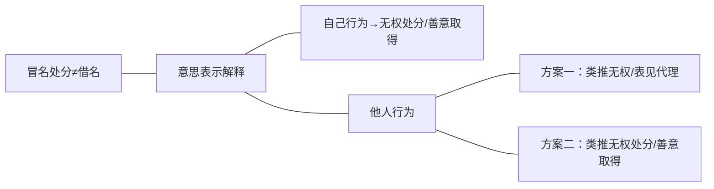

- 区分标准：发生新债务↔变动既存权利
	- 负担行为=债权行为：发生新债务（履行），而非既存权利之变动
	- 处分行为：变动既存权利（处分方权利的减损），未发生新债务
		-  变动既存之物权：物权行为
		- 变动既存之其他财产权：准物权行为

- 买画案：区分负担行为与处分行为
	- 看一个例子，通过这个例子我们来讲清楚负担行为和处分行为它分别是一个什么样的特点。这两种法律行为它的特征非常明显，而且像王泽鉴老师所说的那样，负担行为和处分行为的区分，就是民法中的任督二脉。练武功、练内功，要任督二脉一定要通，不通功夫就不好。民法功夫要好，你负担行为处分行为的区分一定要学好。
	- 甲向乙购买名画一幅，双方签订买卖合同。甲和乙签订买卖合同之后，因买卖合同双方产生了什么样的权利和义务？甲作为买方，他享有什么样的权利和义务？——他有权请求已交付并移转所有权。他有什么义务？——他要向乙支付价款。也就是说在买卖合同签订之前，甲对乙不享有这样的权利、负有这样的义务。也就是说买卖合同这么一个法律事实，给双方当事人的权利和义务产生了什么样的变动呢？我们看变动的效果是什么？
		1. 签约前
			- 我们来看一下签约之前乙的权利状况和甲的权利状况：
				- 乙的权利状况非常简单：签约之前乙有一幅名画，他对甲没有债权请求权，也没有债务；
				- 甲的财产状况是：甲有一个“所有权”（这里是打引号的，所有权不一定是现金，也可能是存款，存款就不叫所有权，这个以后再说），那就是一笔金钱。那么甲对乙没有债权请求权，也没有债务，这是两个人签约之前的状况。
		2. 签约后、交付前
			- 我们来看，因为签约本身会给双方当事人带来什么样的法效果。签约本身一签好之后，问，甲和乙的合同签订之后，这幅画的所有权是谁的？签了买卖合同之后画的所有权变成买受人的还是出卖人的？——还是出卖人乙的。买卖合同不会移转所有权的。同样签了买卖合同之后，甲所有的金钱会不会因买卖合同的签订自动就变成乙的？——也不会。买卖合同不具有移转财产的功能。
			- 所有权在乙这里没变，在甲这里都没变，那么到底买卖合同给双方的权利状况、财产状况产生了什么样的变动呢？——因为买卖合同的签订，乙作为卖方对甲产生了一个债权请求权（那就是交付价款支付价款的请求权）。也就是说买卖合同签订之前，乙对甲没有支付价款请求权，一签订就产生了支付价款的请求权了。同样的因买卖合同的签订，乙本来对甲是不负有债务的，因为买卖合同的签订，乙对甲负了一个债务——交付画并移转所有权的债务，这里简称为“交画”。好，再看甲的权利状况有没有发生变化：甲原来有金钱，现在还有金钱，这个没有变动，变动在哪里？——因为买卖合同的签订，甲对乙享有了一个债权请求权，债权请求权的内容是交付一幅画并移转标的物所有权。相应的，甲因此所负的债务是——甲负有向乙支付价款的义务。这是两个义务。
			- 同学们看一下，买卖合同他给双方当事人带来的权利义务的变化是什么：
				- 甲乙双方自己所拥有的财产，画也好，钱也好，并没有因买卖合同的签订发生移转；
				- 因买卖合同的签订却给双方当事人都产生了新的债权和新的债务（以前没有的，现在有新的）。同学们，这一种没有把双方当事人既有的财产变动过去，而只是让双方当事人产生新的债权债务的合同，尤其是新的债务的这种法律行为，我们称它为负担行为。买卖合同是给甲产生了新的债务，也给乙产生了新的债务，而甲的新的债务不就是乙的债权吗，而乙的新的债务不就是甲的债权吗。这种（法效果是）产生新的债务的法律行为，叫负担行为。
		3. 交画后
			- 好，同学们我们再看下面一个过程：合同签订之后乙负有一个交付并移转标的物所有权的债务，这个债务需要履行，于是呢，乙就履行了。乙拿着名画对甲说“来，现在我把所有权移转给你”；甲说“好的”，接下去交付了，然后你就把这幅画交到了甲的手中。
			- 同学们，这个过程是乙在向甲乙转所有权，乙履行自己的债务。这么一个法律行为，对甲乙双方的权利状况产生了什么样的变动？然后我们来看这个变动叫什么。画交完之后，（动产所有权的移转，原则上要求交付。现在是交付完成了，所以所有权移转了。）乙的权利状况在前面一个阶段的基础上产生了什么样的变化？——乙原来有一个所有权，因为这个行为做完之后，乙的所有权没了。现在所有权变成0了。因为他把画所有权移转过去了，交付也交付了，所以呢，乙已经完全履行了自己的债务啊，所以乙的债务消灭了。我们看甲的权利状况有没有变化一一甲的权利状况是：甲本来只有一笔金钱，现在财产中多了一幅画的所有权。这个行为有没有让甲产生新的债权债务？——没有，恰恰相反，甲既有的债权请求权因为实现所以消灭了，而他自己的原来的债务没有履行还在。
			- 所以我们来分析一下：像这么一个行为，它的法效果的特点是没有让乙或者甲发生新的债权债务。那么它到底变化在哪里？——变化在于两点：
				- 乙本来的财产中既有的财产有一部分移转到了另外一方那里，也就是说因法律行为的完成之后，乙的固有财产一部分没了，少了减损了。
				- 那么在本案中，这个既有财产到谁那里去了呢？——这个既有财产流入到了甲的财产中，甲的财产中本来没有这幅画，现在有了这幅画。所以我们说，这样一种行为，它没有导致甲和乙的新的债权债务的发生，相反只是让乙的一个既有的财产流出了他的财产，进入了别人的财产，那么这种行为不产生新的债权债务，只让既有财产发生变动的行为，这个叫做处分行为。处分行为的直接效果是画作所有权，从乙那里流入到了甲的那里，乙没有发生新的债权债务。恰恰相反，乙原有的债务因履行消灭了。再看甲这边：甲多了一个画作所有权，他没有产生新的债权债务。恰恰相反，他的某一个债权还应实现而消灭了，但至少没有产生新的债权和新的债务。
			- 所以买卖合同本身我们叫负担行为，因为这个合同签订之后给双方带来的权利义务的变化是产生了新的债务，所以它叫负担行为。他产生了新的债务，但没有让既有的财产发生变动。而交换的行为、移转所有权的行为，我们叫他处分行为。（1）没有给双方带来新的债务；（2）让既有财产发生了变动。
		4. 交款后
			- 我们再看下面一个动作：交款。甲现在还负有一个债务一一必须要交钱才能履行自己的价款支付的债务。那么假设支付了，我们看支付之后会有什么样的后果？
			- 现在甲对乙说，我给你一笔钱，我来履行我的债务，乙就拿过去了。
				- 那么这个行为做完之后，我们同样需要计算一下，给双方当事人的权利和义务带来什么样的变化。我们来看付钱的行为它起到什么样的作用？它叫什么？
				- 本来甲有两个所有权：
					1. 画已经拿到了；
					2. 他原有的金钱还在。
				- 现在这个行为做完之后，他的金钱的权利移转到了乙的那边。那么这个动作这个行为有没有给双方当事人带来新的债务？——我们说不仅没有带来新的债务，还让原有的一个债权一个债务消灭了。本来甲负有付款的债务，现在因为履行，付款债务消灭了。乙本来对甲享有一个付款的债权请求权，这个债权因为实现而消灭了。同样的我们看到，甲把现金付给乙的行为，我们看得非常清楚，它直接带来的后果是——甲既存财产中的一个标的，直接移转到了乙那里，于此外，没有给双方任何一方带来新的债权和新的债务，所以我们说付款的行为也是处分行为。
		5. 中间结论
			- 能不能准确的抓到处分行为和负担行为的特点？回答一下什么叫负担行为？最核心的特点是什么？——发生新的债务，而新一方发生新的债务意味着另外一方有新的债权，所以简称为产生新的债务也可以，你说产生新的债权债务也可以，它的特点一定产生新债务。而且它一般会不会导致既存财产的变动啊？一一它只发生新的债务，而双方当事人既有的财产化和金钱不会发生变动。所以我们给负担行为下个定义：负担行为是让当事人发生新的债权债务，但没有让既存的财产发生变动，既有的财产不会产生变动。什么叫处分行为啊？——处分行为是让双方既有的财产直接发生变动，但是不会给双方或者一方带来新的债务。所以这两个点都不能忽略掉。一个是对既存财产的影响，一个是有没有发生新的债务。

>**例一：甲向乙购买名画一幅，双方签订买卖合同**
>
>||乙之权利状况|甲之权利状况|
>|:---:|:---:|:---:|
>|签约前|所有权：1（画） 债权请求权：0 债务：0|所有权：1（金钱） 债权请求权：0 债务：0|
>|签约后、交付前|所有权：1（画） 债权请求权：1（交款） 债务：1（交画）|所有权：1（金钱） 债权请求权：1（交画） 债务：1（交款）|
>|交画后|所有权：0 债权请求权：1（交款） 债务：0|所有权：2（金钱+画） 债权请求权：0 债务：1（交款）|
>|交款后|所有权：1（金钱） 债权请求权：0 债务：0|所有权：1（画） 债权请求权：0 债务：0|

# （一）区分标准：发生新债务↔变动既存权利
- 负担行为它的特点是
	1. 发生了新的债务，但是没有导致既存权利的变动。既然它发生了新的债务，所以相应的，另一方当事人就产生了新的债权，所以负担行为又叫债权行为。
	2. 第二个，既然它发生了新的债务，所以负担行为必然会产生一个履行的问题，他需要通过清偿让债务消灭，有债务就要履行嘛，这是负担行为。

什么是处分行为？——同学们想想这个例子：无论是移转画作所有权的行为，还是支付金钱的行为，它的功能都是让双方当事人既存的权利发生变动，但没有产生新的债务。说清楚了之后，我们就来看下面一个例子，我们再来检验一下什么是负担行为什么是处分行为？
## 1．一房二卖：检验负担行为与处分行为
第二个例子是：甲与乙签订房屋买卖合同，乙当场支付全部价款。次日，甲又与丙签订该房屋之买卖合同，丙未付款，但当日即办理过户登记手续。
（在这个例子里是典型的一房二卖／一物二卖。在这个例子里面我们来分析一下，甲乙签订的买卖合同是负担行为还是处分行为？——要了解他是负担行为还是处分行为，就要看法律行为生效之后对双方当事人的权利义务带来的影响。如果影响是产生新的债务，肯定就是负担行为；如果没有产生新的债务，只是让既有权利进行变动的，那就是处分行为。）
### （1）甲乙之间
#### A.甲、乙签订买卖合同一：法律效果
- 所以我们看甲乙之间买卖合同一签订后，对双方当事人产生什么影响呢？——我们说，甲和乙之间本来没有债权债务，因买卖合同的签订，双方当事人就发生了新的债权和债务：
	- 甲有付款请求权，乙有付款义务；甲有登记过户的义务，乙有登记过户的请求权，这就是新的债权和债务都发生了。所以这个买卖合同是典型的负担行为。
	- 当然附带再检验一下：它对于物权的归属（既有财产的归属）有没有产生变动？——没有：甲的房屋所有权还在甲这里，乙的金钱所有权还在乙这里。所以既存权利没变动。所以甲和乙的买卖合同是典型的负担行为。

>例二：甲与乙签订房屋买卖合同，乙当场支付全部价款。次日，甲又与丙签订该房屋之买卖合同，丙未付款，但当日即办理过户登记手续。
>1. 甲乙之间
>    - （1）甲、乙签订买卖合同一：法律效果
>        - A.债权、债务：发生新的债权与债务
>           - 甲之付款请求权√↔乙之付款义务√
>            - 甲之登记过户义务√↔乙之登记过户请求权√
>        - B.物权归属：未发生变动
>            - 甲之房屋所有权√↔乙之金钱所有权√

#### B.乙支付价款：法律效果
- 接下去是乙当场支付了全部价款，这个付款行为的性质是什么？我们看对双方当事人权利义务的影响：
	- 首先对于物权归属的影响，本来是甲有个房屋所有权，乙有金钱所有权，因为乙支付价款导致乙的金钱所有权消灭，甲的金钱所有权发生，所以它是导致继承权利的变化。已经符合处分行为的一部分定义了，但这里很重要，看有没有符合第二个定义。
	- 第二个要件更重要的：它有没有产生新的债权债务？——甲本来有个付款请求权，乙本来一个付款义务，因为乙付款之后，这两个消灭了。甲本来有个登记过户的义务，乙有个登记过户的请求权，这两个没有变动，因为没有履行。

>- （2）乙支付价款：法律效果
>	- A.物权归属：发生变动（金钱所有权）
>		- 甲之房屋所有权√↔乙之金钱所有权× +甲之金钱所有权√
>	- B.债权债务：发生变动
>		- 甲之付款请求权×↔乙之付款义务×
>		- 甲之登记过户义务√↔乙之登记过户请求权√
>		- （A）构成履行行为，消灭甲的付款请求权
>		- （B）并未发生新的债权与债务
>		- （C）甲之债务、乙之过户请求权未消灭：违约责任

所以说我们说债权债务变动的是什么？——只会让既有的债权债务消灭，但是没有产生新的债权债务。所以他不是负担行为，是处分行为。同样，通过权利的计算，我们看出来了：甲的登记过户义务和乙的登记过户请求权都还在，也没有得到履行，没有得到实现。这个时候这个权利义务还能不能得到实现？——房屋已经登记给丙了，甲没有能力再把房屋登记过户给乙。所以这就是我们合同法110条第一项所称的不能了，这个叫履行不能、给付不能。这个给付不能属于法律上的不能，看合同法110条，看了就知道了。

在这里丙已经过户了，导致甲已经没法再把这个房子过户给乙了。问，乙对甲的登记过户请求权还在不在？——他虽然没有因为乙支付价款而消灭，但是随着甲把房子过户给丙（这是一个新的事实发生了），因为新的事实的发生符合了合同法第110条第一项的规定，所以请求权又消灭了。

![[第三编 合同#^m7fbim|民法典580]]

也就是说同学们要注意一下，在乙支付了价款之后，乙对甲的过户请求权，甲对乙的过户义务还是在的。那么什么时候他又因为一个新的事实而消灭了呢？——随着甲把房子过户给丙，这个时候乙对甲的过户请求权就变成了法律上的不能履行叫法律不能，因法律不能，对方（也就是乙）不再可以请求履行了，在学说上称为请求权消灭。但是这个时候是因为甲的过错导致了这个合同履行不能导致请求权消灭，所以甲要承担违约责任。这个请求权是被你弄没的，你要承担违约责任。

所以我们分析到现在为止我们看得很清楚，因为乙的支付价款，一笔金钱从乙的财产进入到甲的财产，乙的既有权利流入了甲的财产之中，在双方当事人之间并没有产生新的债务。相反因履行让一个原有的债务消灭了，这是典型的处分行为。
（甲的行为或者丙的行为有没有侵权？——我们学过债权的相对性，我们知道原则上债权不会构成侵权的客体，它的绝对性是很有条件的，知道了这个就知道不会构成侵权，仅在很特殊的情况下，故意背俗等等。）
### （2）甲丙之间
#### A.甲、丙签订买卖合同二：法律效果
接下去我们看甲丙之间签的买卖合同是个什么性质？

>- 2．甲丙之间
>	- （1）甲、丙签订买卖合同二：法律效果
>		- A.债权、债务：发生新的债权与债务
>			- 甲之付款请求权√↔丙之付款义务√
>			- 甲之登记过户义务√↔丙之登记过户请求权√
>		- B.物权归属：未发生变动
>			- 甲之房屋所有权√↔丙之金钱所有权√ 

甲和丙之间本来没有法律关系，因为签了买卖合同对双方当事人的权利义务产生什么样的影响：我们说，因为签了买卖合同，甲对丙有一个付款请求权，丙对甲有一个付款义务；甲对丙有一个登记过户的义务，丙对甲一个登记过户请求权。发生了新的债权债务。所以这是负担行为。那么这个买卖合同对双方既有财产（物权的归属）没有发生变动。
#### B.甲将房子过户登记给丙：法律效果
再看甲丙之间又做了一个行为，甲把房子过户登记给丙，我们看这个行为是个负担行为还是处分行为要看他对双方当事人权利义务的影响：

>- （2）甲将房子过户登记给丙：法律效果
>	- A.物权归属：发生变动（金钱所有权）
>		- 甲之房屋所有权×↔丙之金钱所有权√+丙之房屋所有权 √
>	- B.债权债务：发生变动
>		- 甲之付款请求权√↔丙之付款义务√
>		- 甲之登记过户义务×↔丙之过户登记请求权×
>		- （A）构成履行行为，消灭乙的登记过户请求权
>		- （B）并未发生新的债权与债务
>		- （C）甲之付款请求权、乙之付款债务并未消灭

首先看因为过户登记给丙，本来属于甲财产中的房屋，现在移转到了丙那里。所以既有财产发生了变动，这个时候进一步要看他有没有让双方当事人产生新的债权债务呢？——我们说没有。甲的付款请求权还在，但他的登记过户义务消灭了，仅此而已。所以这是典型的（只要没有发生新的债务，并导致继承财产的变动）处分行为。

## 2．准物权行为
### （1）债权让与
- 通过这个例子同学们再来检验一下，来判断一下负担行为和处分行为：假设A同学欠金老师一笔钱，10万块钱，金老师把对A同学的10万块钱的债权卖给我们B同学。金老师对A同学的10万块钱要5个月之后到期，金老师急着用钱，想卖债权融资来缓解财务困难，所以就找到B同学，卖给B，10万块钱9万就行了。B同学小算盘一打，划算呀。于是B同学和金老师就签了一个债权买卖合同。债权买卖合同约定：合同签订之后，金老师要把对A同学享有的债权马上移转给B同学，B同学要在同一天就向金老师支付9万块钱的价款。债权买卖合同签订之后，双方都按照约定履行了。金老师对B同学说，“按照我们之间的买卖合同，现在我把我对A同学享有的债权你转给你”，B同学说“好的”，话一说完，债权过去了。
	- （虽然这个时候对B同学来说，虽然拿到债权不靠谱——未经通知债务人A同学，对债务人不发生效力，他不能拘束B。A同学因为他不知道债权让与了，有可能仍然向金老师付款。这个时候向金老师付了款，也可以让实际上的债权人B同学的债权消灭。因为保护善意，A向金老师付了钱之后，金明明不是债权人了，因为他没有受通知，所以他要受保护。A给了金之后，A的债务就消灭，相应的B同学的债权就消灭。金老师就不当得利拿了一笔钱，这笔钱要给B同学。）
	- 金老师这次很厚道，马上通知了A同学，“A同学，你的债权被我卖掉了，已经归B同学了，你不要给我了”。金老师已经履行了自己的买卖合同中的义务，接下去B同学也要履行了：B同学把9万块钱交给我了。在整个过程中我们来看，哪个是负担行为，哪个是处分行为？债权买卖合同是负担行为还是处分行为？为什么？——负担行为；发生新的债权债务（B对金可可的9万元债务），没有既有权利的变动。
	- 金老师对B同学说，“我把对A同学的债权现在移转给你”，发了一个要约过去，B同学说“我要”。此时是一个要约、一个承诺一致产生了一个法律行为。这个法律行为按其法效果是负担行为还是处分行为？不是讲不能产生新的债权债务吗？那现在金老师对B同学说，我把我的债权给你，他说好的。B同学那里不是有个新的债权了吗？
	- 我来告诉你答案，这是我故意设的一个陷阱，等于说是：在这里面B同学拿到了一个债权，但是双方当事人没有产生新的债务。
		- 第一债权不是新的，是原有的；
		- 但更重要的一点，我通过这个例子是要问大家，到底是产生新的债权还是新的债务，它的核心在于有没有产生新的债务。双方当事人之间没有产生新的债务，所以既有债权的移转，他并不能认为是产生了一个新的债权债务。
	- B手上多了个债权，不能说因为有个新债权，所以是负担行为。因为
		- 是金老师本来财产中的债权已转过去了，所以不是新的债权；
		- 第二个，债务本身没有产生新的债务。
	- （为什么债务不改变？——也就是说换了一个债权人还是原来的债权。但是反过来换了一个债务人，就是新的债务，变成新的债权了。为什么会有这个结果？什么叫换了一个债务人呢，比方说：C同学欠我10万块钱，他现在对D同学说，“D同学你能不能承担我的债务，我退出”，经过金老师的同意，D来承担了这个债务，然后C同学就退出了。现在金老师对D有10万块钱了。这个我们学说上就认为这是一个新的债务，新的债权。所以在这个结论中很清楚，金老师如果把对A同学的债权移转给B同学，B同学手上的债权是给原来的债权。相反 A 同学把债务交给另外一个人来承担之后，换了债务人，却认为金老师的是个新的债权。所以答案是很简单的，因为债权的移转实际上不会导致债务人的变化；而对债权人来说，债务人的还款能力是很重要、资信很重要。所以债权的变化不认为是新的债权，而债务发生变化之后，对债权来说最为核心的还款能力发生了变化，责任财产发生了变化。所以在这个意义上，只要债务人变了，就认为是新的债务。换债务人就可能是负担行为了。换债务人我现在不讲。）

现在同学们只要先记住这个例子，金老师把债权通过债权让与的方式移转到了B同学身上之后，我们说B同学取得的是金老师既有的债权，双方当事人之间并没有发生新的债务，所以说这是一个处分行为。现在通过金老师举的这个例子，同学们要区分两个概念：（1）一个概念叫债权买卖（负担行为）；（2）一个概念叫债权让与（处分行为）。

所以我们[[第三编 合同#^155873|民法典545]]以下所讲的债权让与，注意一下，这是在讲处分行为。虽然用语用的是转让，同学们要清楚，这指的是让与，就是处分行为。金老师把债权成功的让与给B同学之后（处分行为），金老师的债权没了，到B那里去，金老师的债务在债权买卖合同中的债务，金老师履行完毕了。B同学还欠我一笔钱，要给我9万块钱。这9万块钱B同学给我了，问，这是负担行为还是处分行为？——处分行为。9万块钱现金所有权从他那里到我这里；没有产生新的债务。所以结论清楚了，这是处分行为。

知道了这么一个情形之后，我们来看，前面买卖一幅画。那么移转画的所有权的处分行为，他是变动的既存权利是物权，这种所变动的既存权利是物权行为；现在买卖的是债权，买卖债权之后，金老师直接做了个债权让与把债权移转过去的处分行为，它变动的既存权利不是物权，是物权之外的其他财产权，这里是债权，但他是处分行为。变动其他财产权的处分行为，我们叫做准物权行为。
### （2）股权让与：准物权行为
我再举一个例子来说明这个问题：金老师和5位同学成立了广富林法律图书有限公司，金老师在这个公司里有股权，金老师现在把自己的股权让与给E同学（当然让与股权有限责任公司的情形，要先取得其他股东的同意，让其他股东行使优先购买权。此处其他5个股东都说不要），于是金老师和欧阳明海同学签了1个股权转让合同，股权转让合同约定，我的股权价值500万，以550万的价格出卖给E同学。在合同签订之后的5天内，金老师要把股权移转给E同学并办理相关的手续。E同学要在金老师办理手续之后的三天之内，向我支付550万。股权转让合同是负担行为还是处分行为？——典型的负担行为，因为产生了债权债务。金老师要履行合同了，合同签订之后，金老师就和E同学签了一张再搞了一个书面的声明：现在我愿意把我的股权全部移转给E同学，E同学也签了字表示同意。这个行为如果产生效力的话，会导致什么结果？它是负担行为还是处分行为。
也就是说法律行为一生效就导致金老师财产中的股权没了，到E那里去了，典型的处分行为。问，这个处分行为是物权行为还是准物权行为？——准物权行为。
### （3）知识产权让与
还有其他的准物权行为：比方说可不可以买卖知识产权？商标权可以买卖、专利权可以转让。商标权专利权的转让行为，如果签了个买卖合同，那就是负担行为。如果根据这个负担行为履行了，实际上通过一个法律行为把商标和专利权移转到对方的财产中，这个叫准物权行为。因为变动的既存权利，不是物权，是物权之外的财产权，所以叫准物权行为。
# （二）负担行为与处分行为之关联
＊负担行为与处分行为之实例判定
## （1）土地出让
看下面一个例子：甲公司通过拍卖，拍得某地块70年之土地使用权，遂与土地管理部门签订土地使用权出让合同。其后，甲依约支付土地出让金，土地管理部门就该地块为甲登记建设用地使用权。

土地使用权的出让合同是负担行为还是处分行为？一一是负担行为。但是这个负担行为所负担的债务内容和以前不一样了：以前说你画所有权给我，我把钱给你，都是移转所有权。这里的双方当事人的相互所负的义务内容对甲来说是付钱了，也是移转所有权（财产权利）；那么对于土地管理部门来说，这里他所负的义务还是为他设定一个用益物权？不是移转土地所有权。也就是说土地使用权出让合同产生的效力是让甲公司负有一个支付土地出让金的义务，让土地管理部门负有一个为甲设定建设用地使用权的义务，所以这是负担行为。

>**负担行为与处分行为之实例判定**
【案例三：甲公司通过拍卖，拍得某地块70年之土地使用权，遂与土地管理部门签订土地使用权出让合同。其后，甲依约支付土地出让金，土地管理部门就该地块为甲登记建设用地使用权】
【案例四：某甲向乙银行借款，签订抵押贷款合同，约定由某甲在其所有之不动产A大楼上为某乙设定抵押权，某乙应于次日向某甲发放贷款1000万】
→试分析其：
①负担行为、负担行为所产生之请求权
②处分行为、处分行为所产生之物权变动

其后甲依约支付土地出让金，这是处分行为。
接下去问大家，土地管理部门就该地块为甲登记建设用地使用权（事实上按照合同把它登记好了），去登记的过程这个行为是负担行为还是处分行为？——是处分行为。这个处分行为的结果对既存权利产生了什么样的影响？
前面所有的处分行为都有个特点：本来所有权是我的，后面才跟过去了。但现在处分行为导致的结果是——土地管理部门本来有一块地是光滑的，没有负担的，上面没有限制物权的所有权，完满的所有权。为甲设定好建设性使用权之后，所有权有减损而已，所有权没有全部移转，只是所有权的权能被限制住了，减损了。减损的部分到甲那里去了——甲就这块土地有了建设用地使用权。
所以同学们要注意这个处分行为的特点：它并没有让土地管理部门完全丧失土地所有权，它只是在土地管理部门仍然保留的所有权上面，减损了他土地所有权的权能。这也是一种处分，因为毕竟是对既存权利产生了减损的影响。
## （2）抛弃书本
所以看了这个例子就知道，处分行为是不是必然有权利的完全丧失，是不是一定有权利的移转？不是。

再讲一个例子：金老师现在手里有一本书的所有权，金老师说这本书我不要了，于是金老师把它扔进了垃圾桶。这个法律行为叫抛弃。
现在问，抛弃是处分行为还是负担行为？——处分行为。因为双方当事人任何一个当事人没有因此产生新的债务，只是导致金老师既存财产中的一个财产发生了变动。但是这种处分行为所导致的变动和前面所有权移转很不一样：以前所有权的移转是，我移转，财产中我的所有权没了，流入到对方那里了；但是现在金老师抛弃结果是金老师财产中没了，但没有一个人取得所有权，单纯金老师没了。仅有金老师这一边所有权的减损，但是他人并没有相应的取得，这也是处分。
## （3）中间结论
所以说我现在把处分行为的概念进一步精密化，以前是讲处分行为导致既存财产的变动，举的例子都是变动的结果从一方流入他方。都是从一方的财产流入他方，财产一方的财产少了，另一方的财产多了。那么在这个例子里面（一方少了那一方多了），少的这一方叫处分人，财产减损的一方叫处分人；另一方多了，因处分行为的结果财产多的那一方叫取得人。所以金老师刚才讲的既存财产权利的变动，都是在讲这种类型，一方处分另一方取得。

但是处分行为是不是必然有一方丧失，另一方取得呢？——不一定。记住了抛弃这个例子就很清楚：处分行为的本质特征是一方的既存权利有减损，但并不意味着肯定有另一方财产会增加。因为在抛弃里面没有人取得。抛弃生效的结果是金老师才能做少了的所有权，但任何人财产中都没有多所有权，那他变成无主而已。现在知道了抛弃的例子，就很清楚了：处分行为并不必然要让一方取得权利。所以说处分的特点是它会让处分人这一方的财产有减损。至于对方是不是有取得要看情况，不同的处分行为有不同的类型。

- 那么处分的本质特征，处分行为的本质特征在于处分一方因处分行为的生效，既有财产会受有减损，这个减损有两种不同的减损法：
	1. 一种减损是整个权利都没了，被处分的权利整个都消失了，既包括消失之后流入对方，也包括消失之后变成无主物（有取得型与无取得型）；
	2. 另外一种减损方法是，处分行为中做处分的一方，他的既存财产中的权利并没有整个消失，它只是财产上面多了个限制物权。减损的方法，减损的程度不一样，一种是完全把它减没了，另外一种是纸张上面多了个限制物权（完全型减损与限制物权型减损）。

土地管理部门，就该地块为甲登记建设用地使用权是不是处分？——当然是处分。这个处分是有取得型还是无取得型？——有取得型，因为另一方就取得一个限制物权了。就减损本身而言，它是完全型减损还是限制物权型的减损？——限制物权型。这个很简单，一点都不难，但是极端重要。
## （4）抵押贷款
- 我们看案例：某甲向乙银行借款，签订抵押贷款合同，约定由某甲在其所有之不动产A大楼上为某乙设定抵押权，某乙应于次日向某甲发放贷款1000万。
	- 这是典型的抵押贷款合同，一般都这么做的：你先帮我设定好抵押权，设定好之后我就把钱给你。抵押贷款合同是负担行为还是处分行为？——因为抵押贷款合同一签订之后对双方当事人产生的权利义务的变动是：（1）甲有了一个为乙设定抵押权的义务（有了一个债务，新的债务）——设定抵押权；（2）乙有一个义务——在甲设定抵押权之后，乙就一定要向甲发放贷款1000万。既然发生了新的义务，它就是负担行为。
	- 甲按照合同和乙一起来到了不动产交易中心，双方填写了表格，表格内容是，甲说我愿意在我的A大楼上为乙设定一个抵押权，担保的债权是1000万。乙在上面也盖章签字同意了，这个表格递进去了。这么一个行为，如果生效之后，对双方当事人产生的权利影响是什么？这是个处分行为还是负担行为？——处分行为，这个处分行为的法效果是什么？由于没有为双方当事人创设权利义务，并且一方的既存权利发生了减损，所以是处分行为。处分行为中分为取得型和非取得型，本案中属于取得型处分行为；减损方法包括是该处分财产上全部减损和处分财产上设定一个限制物权，本案中属于设定限制物权。
## （5）中间结论
我这里再强调一点，我们讲处分行为是变动既存权利，这个“变动”指什么样的“变动”？
一是对处分人的既存权利是有减损的，他要求处分行为生效的结果是处分人的既存权利要减损（如果有取得，那么取得；如果没取得，那就单纯是处分方继承权利的减损）。也就是说这里的“变动”要理解为对处分方来说是减损。处分行为的本质特征是处分方的既存权利因处分行为生效而发生减损，跟我说一遍这句话。现在我把它精密化了，同学们牢牢记住我这句话。这才是处分行为最精确的定义。不仅是变动既存权利，它指的是减损处分方的既存权利，这就真正精密了。你碰到任何情况，按照这个公式去对，你就能准确地判定出什么叫处分行为了。

>**负担行为、处分行为：特征之比较**
>好，现在都已经知道负担行为和处分行为怎么判定了，接下去我们再来归纳一下负担行为和处分行为特征的比较：
>
>||负担行为|处分行为|
>|:---:|:---:|:---:|
>|新债权/债务（权利变动视角）|发生|不发生|
>|既存权利（权利变动视角）|不变动|变动|
>|消极财产（当事人视角，新的债权债务）|增加|不增加|
>|积极财产（当事人视角，既存权利）|不减损|一方减损|
## 3.负担行为与处分行为之联系
- 非周延之分类
	- 兼具双重性之行为
	- 既非负担、又非处分之行为
- 有负担行为、有处分行为
- 有负担行为、无处分行为
- 有处分行为、无负担行为
- 立法模式
	- 区分模式：处分行为独立
	- 一体模式：处分行为不独立
### （1）非周延之分类
#### A.兼具双重性之行为
##### （A）免责的债务承担
- 告诉大家，这（处分行为与负担行为）不是一个周延的分类。下面内容就稍微有点难了，同学们要有心理准备。现在我们看这个已经举过的例子：我对B同学有10万块钱的债权，B同学他现在想找A同学来当新的债务人，自己退出。
	- （这个叫债务移转，债务移转有一个标准的术语叫——债务承担。债务承担有两种形态，一种形态是一方退出型，这叫免责的债务承担；另外一种形态是原来的这一方不退出，新加入一个，这个时候单纯多一个债务人的债务承担，叫并存的债务承担——并存型债务承担，这种并存型又叫债务加入）。
	- 我现在问，并存的债务承担（债务加入）是负担行为还是处分行为？——因为它的加入行为让加入的债务人A产生了新的债务，所以是典型的负担行为。
	- 免责的债务承担要经过金老师同意，金同意之后就生效了，生效的结果就是换了债务人了。接下来问大家，免责的债务承担是负担行为还是处分行为？——我告诉大家，这个行为既是处分行为又是负担行为。处分行为体现在哪里？——金老师本来是对B同学有债权，因为免责的债务存在的生效，金老师丧失了那个债权。金老师的既有财产发生了减损，而且是完全丧失性的减损。同时金老师又取得了一个新的债权，A同学取得了一个新的债务，又是负担行为。再说一遍，他的处分的特点体现在金老师既有债权完全消失了（既有财产的减损），他的负担行为的特点体现在A同学产生了新的债务，金老师取得了新的债权。实际上就是这个行为它就有两个性质了。
##### （B）债权合同的变更
同学们我们再看一个例子：金老师说，“我把这本书卖给C同学”，双方签了合同之后，C同学后来提出来说，“金老师我们能不能换个标的物，我现在不想要你这本书了”，原来双方认为这本书画卖给他500块钱，现在同样是500块钱，C想买金的一幅画，金老师也同意了。
现在是发生了一个债权的变更的合同，现在问债权的变更合同是负担行为还是处分行为？本来是买卖书，现在变成买卖画，是负担行为还是处分行为？——都有，为什么都有？——本来C同学对我的债权本来是书，因为变更的结果是书的债权消灭了（既有财产减损了）；现在多了一个对金老师交画的债权（这对金老师来说是新的债务）。所以就C同学书的债权的丧失，他是处分行为是减损；就金老师新的债务的发生（交画债务的发生），这是个负担行为。
##### （C）和解
还有最典型的一个例子是和解（实际上和解和债的变更有点像），比方说：本来按照法律规定，甲本来欠乙500万约定好的两年之后支付，和解的时候有可能双方都做了让步。那么乙对甲说“你早点付钱，我给你免掉一点”。这种和解中经常也会发生这种类似的现象，还要看具体情况。

要记住的：（1）一个是免责的债务承担；（2）一个是债的变更（更新），是兼具两重性的行为。
#### B.既非负担、又非处分之行为
##### （A）遗嘱
- 现在同学们我们再看一种行为，这种行为有什么特点，我们先来看遗嘱：甲立了个遗嘱，甲有5个继承人ABCDE，甲说，我所有的财产在我死后都归A，后来死了，遗嘱生效了。问，遗嘱是负担行为还是处分行为？
	- 既不是负担也不是处分。遗嘱生效之后立遗嘱的甲（被继承人）财产不就没了吗？那么为什么这个遗嘱不是处分行为呢？它不是负担行为是显然的（在金老师举的这个例子不是负担行为是显然的），但他为什么不是处分行为呢？也就是说，问，甲的财产的减损是遗嘱生效的作用还是死亡的作用？是因为死亡而丧失财产，还是因为遗嘱生效丧失财产？——即使没有遗嘱，死的时候他财产也会丧失的。为什么会丧失？——丧失权利能力。
	- 所以说遗嘱表面上看起来特别像个处分行为，但是你要是知道某甲财产减损的原因是死亡，而不是遗嘱的作用，那你就明白了：原来遗嘱既不是负担行为，也不是处分行为，至少在金老师所举的例子里可以得出这个结论。因为处分行为最大的特点是：处分的一方因处分行为的生效而减损其权利，现在不是因处分行为的生效而减损其权利，是因为死亡。
	- 从这个例子可以看得很清楚，遗嘱在整个财产变动的过程中起到的作用是：人一死财产的他的财产全部从他身上离开是必然的（因为这是死的结果），但是财产留在于哪里取决于遗嘱，遗嘱只起到一个分配和导向的作用，这就是遗嘱真正的作用，所以它不是真正的处分行为。
	- 但是绝大多数学者会认为它是处分行为（尤其是我们国家），因为把遗嘱叫做死因处分了。所以很多有名的学者都在说遗嘱是处分行为，也就是受了这个词的误导。死因处分这个词是很不精确的，它只是不是处分意义上的处分，只是打个比方而言。
##### （B）遗赠
- 我把[[法律行为之分类：负担行为与处分行为#（A）遗嘱|这个例子]]稍微改一改：甲死之前立了个遗嘱：他的继承人有ABCDE，甲说我死后。全部财产都归好朋友X，ABCDE里面的一分都没有。 ^eohnb1
	- 这个叫遗赠，同样是一个遗嘱法律行为，因为给的对象不一样叫遗赠。遗赠到底是个什么法律效果？问X是直接取得遗赠的财产，还是遗赠财产先归5个人，然后X对ABCDE享有一个交付并移转财产的所有权的请求权？如果采取第一种说法，叫直接取得说（也叫物权取得说），这个遗赠就发生了物权的效力。再说一遍，假设直接认为遗赠一生效，甲一死亡，X直接取得财产的（这叫物权效力），直接取得所有权。
	- 如果认为后一种说法甲一死亡，财产在那瞬间就变成5个人共同共有，然后X取得了对这5个人的一个请求权：请你们把财产移转给我。一个债权，这叫债权取得说。
	- 如果是在物权取得说下，这个遗嘱是个什么法律行为？——它和遗嘱继承中的遗嘱没有差别，一样的，既不是负担行为，也不是处分行为。如果是债权取得说，甲一死亡，然后X取得了对这5个人的一个债权，他就变成负担行为了。所以我们要讲遗嘱，金老师告诉你们最精密的答案是什么——遗嘱继承中的遗嘱既不是负担行为，又不是处分行为；遗赠中的遗嘱，如果采债权取得说它就是负担行为了。
	- 我现在告诉大家，我们国家到底是怎么说？两个条文一对比你们就明白了：![[第二编 物权#^btzx22|民法典230]]按照[[第二编 物权#^btzx22|民法典230]]，我们国家采取的是物权取得说还是债权取得说？——都会认为是物权取得说。但是这么一种物权取得说由于很不合理，所以导致了大量学者对这个条文的批评，继承可以是物权取得说，但遗赠，债权取得说更合理。所以说民法典把“受遗赠”这几个字删掉了。由此意味着立法者也觉得至少认为受遗赠取得，直接采物权取得说不太合理，至少有争议，所以把它删除。而我们国家将来可能跟绝大多数的国家一样，会采取债权取得说。这是一个立法上的重要的变动。为什么债权取得说合理，不在这里说，等着你们上亲属法的老师、婚姻法的老师给你们讲，什么都讲不行。

第一种既不是负担行为，又不是处分行为的行为，那就是遗嘱。
##### （C）即时清结的赠与
- 第二个例子就真的有点难了：金老师到开元地中海去，发现路边有个乞丐，金老师觉得他真可怜，金老师掏出两个硬币扔给他，这中间有哪些法律行为？
	- 有处分行为是肯定的，金老师希望把两个硬币的所有权移转给他（处分行为），问题是同时有没有赠与合同？乞丐放在那里，能不能认为是一个赠与合同的要约呢？（“请你送给我一些东西”）然后我扔进去算不算赠与合同的承诺呢？或者反过来，如果认为赠与合同的要约要具体一点，不能说什么东西都赠与，这个时候金老师扔进去两块钱是赠与合同的要约，同时对方没有表示反对，就表示承诺了，赠与合同成立了，可能是这样理解更好一点。这样就产生赠与合同了，那么赠与合同是个负担行为还是处分行为？
	- 金老师有一辆摩托车想送给B，签一个赠与合同，合同约定内容是三个月之后，金老师要把这辆车所有权移转给B并交付，B同学说“好的”，双方签了合同。问，这个赠与合同是负担行为还是处分行为？
	这个合同很明显的，金老师负担了一个债务，债务内容是三个月之后移转车的所有权并交付，典型的负担行为。然后三个月到了，金老师把这辆车交给了B同学，再去办了过办理了过户手续，这个时候在整个过程中才移转所有权，移转所有权的行为是处分行为。所以在赠与合同中负担和处分很清楚的，赠与合同是负担行为，后面的履行行为是个处分行为（把所有权移转过去的处分）。也就是说我其实同学们告诉大家，合同法上所规定的那么十八九种有名合同，其实都是负担行为，都会产生新的债务的。
	- 问题来到金老师所讲这个例子：金老师把钱扔进去的过程，如果认为是一个订立赠与合同的过程，问题来了：金老师希不希望因为扔硬币而让自己负有移转硬币所有权的债务？金老师有没有这个意思？——没有这个意思，金老师单纯的想移转所有权，其实并没有希望想负担法律上义务的意思。这样一来，如果认为解释出一个赠与合同，那就麻烦了：赠与合同也有可能哪里出现瑕疵什么的，还要履行搞不好，金老师不希望发生这样的结果；你赠与的什么东西不合格什么等等，金老师还要负责的，这是不希望的。
	- 那么现在问：如果认为没有赠与合同（因为金老师不希望产生赠与合同上的义务），金老师扔进两块钱之后，走到前面的报亭想买张报纸，一摸口袋没钱了，这个时候金老师能不能回头对乞丐说“你那两块钱还给我，因为是不当得利（我单纯的移转给你所有权，但是没有法律上的合同做依据，所以你是不当得利，按照[[第三编 合同#^el18x2|民法典985]]要还给我）。”这个时候有不当得利返还请求权吗？——也不应该。
	（这不是无主物先占，金老师没有想抛弃所有权，如果金老师是抛弃所有权，那任何人都可以抢了，那不对。金老师只想把所有权给他的，所以它不是抛弃。）
	- 所以这个时候产生了一种法律架构：既不能认为金老师有义务（因为金老师不希望有义务），又不能允许金老师不当得利返还一一于是产生的架构叫即时清结的赠与：它也是个赠与，但是不发生赠与这样的义务，这个赠与因双方当事人的合意成立的赠与只起到一个作用：排除不当得利（相当于落实了约定了一个法律上的原因）。
	- 知道这个利益状况就知道了，我一定要实现一个结果：不能有赠与合同（否则我有义务了）；也不能允许我随便还会要回来（不当得利太离谱）。所以说我们中间达成了一个赠与叫即时清结的赠与。这种赠与的特点不发生普通赠与合同的义务，只是认为当中有一个关于法律上原因的约定，起到了排除不当得利的作用。所以这种即时清洁的赠与就单纯的是原因的约定，它既不是负担行为，也不是处分行为。这个有点难了。我不说理解没有，知道了就好了，你努力的按照我的方法去想，知道就是好的。以后讲债法会讲到清偿契约，债务清偿实际上也既不是负担行为，也不是处分行为。

负担行为和处分行为这个分类不是周延的，因为有的时候会出现一个行为，既是负担行为又是处分行为，有的行为既不是负担行为，又不是处分行为。
## （2）负担行为和处分行为之间的关系
第二个，我们要分析一下负担行为和处分行为之间的关系。
### A.有负担行为、有处分行为
有的时候是有负担行为，也有处分行为，最为典型的是买卖赠与等合同，这个合同都是负担行为，但后来需要履行，它的履行行为也是处分行为，先有负担行为后有处分行为。
### B.有处分行为、无负担行为
还有一种情形是有处分行为，没有负担行为的情形。前面讲过一个例子：抛弃是典型的有处分行为，无负担行为。还有一种情形：即时清结的赠与。前面那个是原因的约定，不是负担行为，后面是单纯的移转所有权而已，所以是有处分行为，但其实前面没有负担行为。
### C.有负担行为、无处分行为
#### （A）盖房子
还有一种行为叫有负担行为，却没有处分行为。我们来看一个例子：我请一个人到我家来帮我盖一套房子（盖房子是加工），也就是说债务内容是他负有一个帮我把房子盖好的义务；或者我有一个叫檀香木，我请乙到我家里来，把我檀香木雕成孟德斯像。
这两个债务内容是一样的，就是加工，加工出一个新的东西来。对方要履行债务，他需不需要做处分行为来履行？还是只需要做事实行为来履行？加工是事实行为还是处分行为？（处分行为是法律行为的一种，所有的事实行为都不可能是处分行为的，因为它不是法律行为——事实行为。所以在请人来加工的例子里面，仅有负担行为，没有处分行为，因为它的履行不需要处分行为，事实行为就履行了。
#### （B）打扫卫生
还有一种情形，有负担行为，但负担行为所负担的债务的内容不需要用处分行为来履行，也不需要用事实行为来履行，单纯的用某一个什么法律事实都不是的行为来履行。
- 举个例子：我请一个人帮我打扫卫生（扫地），问扫地打扫卫生是不是法律事实？
	- 不是，因为假设自己在家里打扫卫生，没有引发抽象的法律世界中的变动。所以你请人来打扫也是一样，它本身不是法律事实。所以有些负担行为的履行，他不需要处分行为。
	- Q1．打扫卫生的法效果不是引起债务消灭吗？
		- 在没有债务的情形，你自己打扫卫生不会引发权利义务的变动，这充分说明它（打扫卫生）本身不是一个法律事实。但是为什么我请人来打扫，他打扫的过程就是在履行他自身债务的过程，最后他履行完毕债务会消灭？可见在这个例子里面，是因为它打扫本身不是法律事实，但是它本身可以作为其他法律事实（履行清偿）的组成部分引发权利义务的变动。打扫卫生本身不是法律事实，但在因履行义务而打扫卫生的时候，打扫卫生本身变成履行这一个事实构成的组成部分了。如果打扫卫生是符合债的约定的（完全按照约定的打扫了卫生），债权就消灭了。所以加上了其他东西之后变成另一个法律事实——履行（标准的术语叫清偿）。清偿才是个法律事实。
		- 不是打扫卫生是清偿的要件，清偿的要件是——简而言之一句话——正确的人在正确的时间正确的地点按照正确的方法完成了约定的给付内容，这叫清偿。打扫卫生本身不是法律事实。假设换一个人来打扫卫生不会让债务消灭——不是正确的人。所以打扫卫生本身不是，只有当打扫卫生符合其他要件（正确的人在正确的时间的正确的地点做完了正确的给付内容）才会消灭债权。打扫卫生是“正确的给付内容”，没错的，但是它本身不符合清偿的要件，它只是清偿要件的一个部分而已，它不是清偿的全部要件。只是要件之一，它脱离了要件之后，它本身什么都不是，只有放在要件里面打扫卫生，其他要件都具备才行。
#### （C）出租和设定用益物权
- 在这里面尤其要注意的是，出租和设定用益物权的合同，它两个不一样：金老师把一块土地签了个合同，要为对方设定个用益物权，期限是20年；金老师把这块土地出租给对方，租赁期限是20年。这两个合同有没有什么差别？
	- 我们说合同签订之后，这个合同都是负担行为，负担行为为了履行合同，金老师：在前一种情形要为对方设定用益物权，这个时候就是有负担行为，有处分行为；在出租的情形也是负担行为，合同签订之后金老师一定要履行，履行怎么办？——把租赁的土地交付给他，供他使用（以交付的方式来履行）。那么交付给他供他使用的行为就不是处分行为，变成了只有负担行为，没有处分行为。为什么？——就记住一点：在租赁的过程中，“租赁物的交付”跟“供别人使用”本身它不是处分行为，你记住这个结论；而同样是土地给别人用，如果用的方式是要通过设定用益物权的方式给别人用，那就是处分，以处分行为来履行的。
	- 道理其实很简单，在租赁的情形，你交给对方没有导致权利减损，权利减损是前面的负担行为造成的，既存权利没有发生在变动，使用权没有受限制（这不是物权上的限制）。你就记住结论就行了，现在一下子跟大家讲不明白，以后会给大家讲的。也就是说在交的过程中，实际上没有一个独立的权利变动，只有债权债务本身的变动。
	- 打扫卫生和清偿的关系，包括租赁本身它属于第二种情形（有负担没有处分行为），设定用益物权是有负担行为也有处分行为，你知道结论就行了，现在暂时不需要你理解。
## （3）立法模式（有负担行为、有处分行为）
- 负担行为和处分行为的关系在第一种情形（既有负担行为又有处分行为的情形）下，其实是有两种立法模式的：
	- 一种立法模式认为，双方当事人签了一个买卖合同，买卖合同接下去是把书交给别人，这个交给对方不是个独立的法律行为，后面整个过程没有法律行为了，这叫一体模式。买卖合同本身就能够移转所有权，加上一个交付就行了。
	- 区分模式就刚才金老师讲的，买卖合同是个负担行为，“金老师，来，把书给你”是个独立的移转所有权的行为，那就变成两个法律行为了。
	交付事实上是让哪个法律行为生效导致所有权移转呢？——在区分模式下，交付是让处分行为生效，从而导致所有权的移转；在一体模式下，说买卖合同就能让所有权移转，所以交付是附在买卖合同上，让所有权移转。这个金老师以后会重点讲。
## （4）附图：负担行为与处分行为之体系
- 法律行为
	- 负担行为→债权行为
	- 处分行为
		- 物权行为
			- 单独行为：抛弃
			- 物权契约：所有权之移转、限制物权之设立
		- 准物权行为
			- 单独行为：债务免除（台）
			- 契约：债权让与、专利权让与、权利质押

- 我们会讲负担行为就是债权行为，因为它产生了新的债权债务；处分行为一定要导致继承权利的变动。更精确化一点，处分行为一定是因处分行为的生效，让处分方权利有减损。如果导致的是物权的变动，处分人物权的减损，这个时候我们叫物权行为；如果是导致处分人物权之外其他财产权利的减损，这个时候叫准物权行为。无论是物权行为还是准物权行为，我们说，会有单方行为和双方行为。有的物权行为是单方行为，单方行为的物权行为最典型的是抛弃，就单方就可以，一个意思表示就够了；那么双方行为，物权契约是典型的：
	- 金老师对B同学说，B同学，我把书所有权移转给你，她说“好的”，一个要约一个承诺才能构成一个所有权移转的契约，这个契约再加上交付，双方的处分行为才会生效。生效的结果是金老师的所有权进入到B同学的财产。所以有的物权行为一定要两个的意思表示一致才能达成的，这个叫物权契约（双方物权行为）。还有一种典型情形就是以设定限制物权的方式来进行处分的，处分内容是设定限制物权：把这个房子给你设定抵押权，双方当事人要到交易中心递个表，表上写的是“我现在愿意为B同学设定一个抵押权”，B同学说“好的”，这个法律行为单纯的是以设定限制物权为目标的一个法律行为，但是必须双方当事人意思表示一致的，交进去不动产交易中心才会受理的，最后一生效，我的房子上就给B同学产生了一个抵押权。
	- 准物权行为里面也同样有可能出现单方行为和双方行为的。前面所举的准物权行为：债权让与也好、专利权让与也好等等，它其实都是双方行为。但是在债务的免除，如果取单独行为说（单方行为说）的话，那么债务免除就是典型的单方的处分行为。在双方说下，需要双方意思表示一致，债权才消灭。

刚刚讲了把负担行为和处分行为如何区分的方法告诉大家，但是负担行为和处分行为的内容绝不限于此，我们在下次给我再下次课的时候会集中展开它里面细节的内容，是非常精妙的内容，这里今天讲一个初步，最前面的一部分。

上次课我们讲了负担行为和处分行为的区分。负担行为的特点是它肯定会发生新的义务、新的债务。处分行为绝对不会发生新的债务，它只会导致既存权利的变动。严格讲起来也不是既存权利的变动，而指的是处分人这一方既存权利的减损。

这个是是功底中的功底，绝对要搞得非常熟悉。也讲了负担行为和处分行为的联系，也说有的时候既是负担行为又是处分行为（免责债务承担就是），也存在既不是负担又不是处分的行为（典型的遗嘱继承中的遗嘱，还有是即时清结的赠与）。还讲了处分行为又可以包括物权行为和准物权行为，物权行为是变动的既存权利是物权，减损的既存权利是物权；准物权行为变动和减损的权利不是物权。无论是物权行为还是准物权行为，都有可能是单方行为和双方行为。
# （二）负担行为
下面我们重点讲一讲负担行为的一些基础知识：
- 负担行为
	- 功能
		- 发生债务（给付义务）
		- 作为法律上原因：排除给付不当得利
	- 特征
		- 意定效果：新生给付义务→债务关系
		- 义务人既存权利未受减损→无需处分权要件（合51之废除）

## 1．功能
负担行为的特征是要发生债务，具体而言就是要发生新的给付义务。

还有第二个功能：有负担行为它就构成了法律上的原因：排除给付不当得利。
我和B同学签了一个买卖合同，为了履行债务，金老师把书交给B同学移转所有权。一交给他债务就消灭了。这么一个状态，之所以我们说肯定要排除不当得利的理由在于负担行为：里面产生的债权，它会有一个保有权。实际上保有权的依据是：负担行为本身的存在就作为一个法律上的依据，债权就是法律上的原因。

负担行为是第二功能：能够产生法律上的原因，有了一个合法的债权债务来作为原因。
## 2．特征
### （1）意定效果：新生给付义务→债务关系
它的特征是意定效果产生了新生给付义务，产生新的债务关系。
### （2）义务人既存权利未受减损→无需处分权要件（合§51之废除）
负担行为的第二个特点就很清楚了：无权处分他人之物的买卖合同，应不应该有效？

- 这本书是B同学的，金老师把B同学这本书“无权处分”，卖给了C同学。金老师买卖合同是不是在在在处置B同学的书，问，这样的一个合同是不是应该有效？
	- 如果认为这个合同应该有效，说明买卖合同这种负担行为不需要经老师对这本书有处分权，没有处分权，负担行为仍然会有效的。如果认为，因为金老师对这本书没有处分权（因为这书不是我的），所以我就这本书缔结的买卖合同这一个负担行为效力就会受影响，那么说明处分权它就是负担行为的一个生效要件之一。负担行为的效力不受影响。
	- 善意取得这个制度是嫁接在（负担行为做完之后还要做）处分行为的：金老师现在把这本书处分给了C同学，善意取得考虑的是“这个处分行为能不能让对方善意取得？”买卖合同本身没有直接和善意取得关联起来。
	- 所以为什么说负担行为本身不需要以处分权为要件：金老师就这本书和C定了买卖合同，买卖合同是个负担行为，负担行为产生新的债权债务，金老师对C同学享有一个支付价款的债权，负担了一个交付并移交所有权的债务。现在问大家，这两个债权债务分别针对谁？和B同学有关系吗？
	- 和书的主人一点关系都没有。债务是金老师付的，债权归金老师，书的所有权人跟这个合同一点关系都没有。接下去金老师要交书了，金老师交不出书（因为这个书是B同学的），谁对对方承担违约责任？——金老师承担违约责任。
	- 可见这个负担行为和B同学一点关系都没有，绝不会因为负担因为本身而侵害到B同学的任何利益。既然没有影响他的利益，那么就让这种所谓的“无权处分”的负担行为，让他有效好了，完全让它有效才是对的。既然是有效，那么有什么好处：
		1. 有效是因为不影响他的利益；
		2. 有效还有积极的好处：金把它卖出去之后，有可能金老师再跟B同学订合同：“B同学，你这本书我多少钱，你卖给我好不好？”，B同学说“好的”，再交付过去，完全有可能。
			- 如果认为前面买卖合同无效，后面这个交易也就没法进行了，而且，按照交易实践，经常会出现这样的情形：我是先卖后买，因为我对B同学有充分的了解，她愿意卖。那么如果要求我一定先取得所有权再卖，我的资金上有很大的问题，库存也需要很多。
			- 所以这是交易实践的需要：允许先卖再买。这是减少库存，减少资金的占用量。

- 实践中还有好多时候在买卖的时候东西还没发生，买卖的时候卖的东西在世界上还不存在：把一批孟德斯鸠像卖给D同学，约定三个月之后交货，订单成立了，金老师开始去加工孟德斯鸠像。不能说此前没有孟德斯买卖合同就无效。
	- 所以说基于以下几个考量：
		1. 无害于真正权利人；
		2. 第二个交易实践的需要。
		- 所以我们讲，负担行为不需要以处分权为要件，所以完全有效。
	- 以前我们中国法上有个合同法51条：＜合＞第五十一条 【无处分权人订立的合同】无处分权的人处分他人财产，经权利人追认或者无处分权的人订立合同后取得处分权的，该合同有效。
		- 如果“该合同”理解为买卖合同这样的负担行为，那处分权就是影响到买卖合同的效力了，买卖合同这个负担行为也变成效力待定了：因为无处分权。这样处分权不就成为负担行为的要件了？那么这样的一种立法我们都说完全是错误的立法，因为这个条文抄的是台湾地区的民法。
		- 台湾地区的民法的“处分”，注意一下，它不指买卖合同，指的是买卖合同缔结之后的处分行为（移转所有权的行为）。我们拿来一放到合同法里面，合同法管负担行为，那这样语境就发生变化了，所以变成一个错误的立法。无权处分的处分行为当然是效力要受影响的，但无权处分的负担行为受影响就不对了。所以这个条文被认为是错误的立法。
	- 后来买卖合同司法解释对它进行了纠正，现在民法典之中同样的，把这个规则给删除了，完全采取了不同的立法模式：![[第三编 合同#^qkzvmt|民法典597]]既然可以解除合同，还可以请求出卖人承担违约责任，说明没有处分权的出卖人订的买卖合同当然有效。所以我们§597明确的把合同法51条给废除了，合同法51条本身也被删除了。所以这是一点，负担行为的特点是：由于前面讲过的理由，他不需要以处分权为要件，没有处分权，但是完全有效。
## 3．分类
- 接下去我们看负担行为的分类：
	- 按领域：债法、物权法、亲属法、继承法
	- 按意思表示个数及其关系
		- 合意原则
			- 双方行为
			- 共同行为
		- 例外
			- 单方行为
			- 决议行为

### （1）按领域：债法、物权法、亲属法、继承法
负担行为有可能规定在债法上，我们合同法上所有的合同都是负担行为。

也有可能发生在物权法上：建设用地使用权的合同，它规定一方要向另一方支付价金。这是典型的负担行为——产生了付费的义务，所以物权法上也有负担行为。

亲属法上也有负担行为：双方有个赡养义务、抚养的协议，这种赡养、抚养的协议不就产生一个支付抚养费的义务嘛，所以都是负担行为。

继承法上也有也有负担行为：遗赠抚养协议、遗产买卖合同都是继承法上的。

（所以同学们注意一下，前面讲到财产行为分类是负担行为、处分行为，这里发现其实也不是也不能完全这么讲，只能说按照领域上来讲：哪怕在出现在亲属法、继承法上，也会有些行为它是具有负担行为的特征的。）
### （2）按意思表示个数及其关系
- 再看按意思表示的个数及其分类：
	- 最典型的负担行为就是双方行为，合同法上所规定的有名合同基本上都是双方行为，也基本上都是负担行为（买卖、租赁等等都是）；
	- 第二个，共同行为也有可能是负担行为：很典型的合伙（合伙人都负有出资的义务）、公司设立的合同（各方都负有出资的义务）。所以典型的，共同行为也有可能成为负担行为。还有单方行为有可能是负担行为：如果悬赏广告被认为是单方行为的话，那就是单方的负担行为；还包括银行对票据所做的承兑等等。
	- 还有决议行为有可能产生新的债务：比方说股东决议决议之后决定增资，增资那么要负有出资义务的股东就要出资了。所以决议行为也有可能是负担行为。

记下金老师说这些话就行了，例子记下来就行了。
### （3）按法律效果
- 按法律效果：
	- 单方负担行为：一方负有债务
		- 单方行为
		- 双方行为
		- 决议行为
	- 双方负担行为：双方负有债务
		- 双务
		- 不完全双务

#### A.单方负担行为：一方负有债务
有的是一方负有债务，叫单方负担行为；另外一个是双方都负有债务，叫双方负担行为。（单方负担行为和单方行为要区分开，以单方行为产生的负担行为不叫单方负担。）

单方负担行为举个例子：赠与是双方行为，但他只让赠与人一方负有义务，所以是单方负担行为。单方负担行为也可以是用决议行为让单方负担行为产生，比方说三个股东做了决议要增资，其中一个股东都包了增资义务。这个决议行为让一方负有出资的义务，所以决议行为也有可能是单方负担行为。那么单方行为有没有可能成为单方负担行为呢？——当然有可能了：悬赏广告单方说。贴广告去找狗，找回来之后只有一方负有义务，是单方负担行为。所以有的时候哪怕是双方行为，他也会只让一方负有债务，这个叫单方负担行为。）
#### B.双方负担行为：双方负有债务（双务与不完全双务）
在双方行为的情形通常是双方都负担债务，包括借用买卖、租赁、有偿保管、无偿保管都是双方负有债务，但是说按照双方负有债务的关系，可以分成双务和不完全双务：如果两个义务处于有偿的交换关系之中，这就叫双务（有息借款合同、有偿保管合同）。

在无偿保管、借款无息、无偿借用的情形，双方都负有给付义务。但是借用里面“我给你让你用”的给付和“你还给我”的给付不是有偿交换关系，没有都给对方一个新的利益。所以这种情形，由于借用合同中双方互负有债务，但两者之间并没有处于一个有偿的交换关系，此时借用合同叫不完全双务。同样无偿、无息借款也是不完全双务。只有双方负有的债务是有偿交换关系才叫双务。

双务合同有个特点：（1）它可以适用履行抗辩权；（2）双方合同还要适用牵连性原则：我不需要再给你书了，请求权消灭了，这个时候按照牵连性原则：你向我付款的义务自动也消灭，因为我们本来就交换关系，我不给你你也可以不给我。（3）第三个，双务合同是狭义上的真正解除权的适用范围。

现在知道了什么叫双方负担，什么叫单方负担了。双方负担又分成双务和不完全双务。
### （4）按履行行为之性质
#### A.处分行为
按履行行为的性质：有了负担行为的特点是产生了债务，有债务必须要履行的，所以负担行为的特点是后面正常的话都会有个履行行为。履行行为有可能是处分行为（买卖合同最后履行金老师要移转书的所有权，用处分行为才能履行掉）；
#### B.负担行为（预约、担保、间接给付）
第二个履行行为有可能是负担行为（债务承担、预约）。

金老师和B同学签订了关于买卖这本书的预约，预约的功能就产生缔约义务，按照预约金老师和B同学负有一个5天之后订立本约（正式买卖合同）的义务。缔约义务的这个债务只能通过订立正式买卖合同的方式来履行。
所以履行行为的性质有可能是负担行为，预约、本约也是。

还有同学说担保：有偿担保的情形为——委托保证合同的情形。按照委托保委托保证合同，一方负有和主债权人订立一个保证合同的义务，这个义务只能通过去缔结保证合同（负担行为）来履行。

还有什么情形？——比方说买卖价钱约定好，通过给支票的方法履行。支票是个负担行为：根据支票产生了付款的义务（票据上的付款义务发生了），这个时候是一个新债来履行旧债，叫新债清偿（也叫间接给付）。新债清偿和间接给付的特点是：新债不履行，旧债不消灭。在金老师拿到支票并且实现票据上的债权之前，金老师的价金债权还在，万一支票实现不了，我可以回头向你要价金。所以新债清偿也是尝试用一个负担行为来清偿原来的债。所以履行行为的性质有可能是负担行为。
#### C.事实行为
负担行为的履行性质还有可能是事实行为：委托加工孟德斯鸠像；委托上山才野草莓，那是委托你做先占的这种事实行为，这都是做事实行为。

还有比方说委托创作：创作是事实行为——产生著作权；委托建房，也就是类似于加工，这个时候也是一个事实行为。
#### D.非法律事实
按照履行行为的性质，有可能是非法律事实：[[法律行为之分类：负担行为与处分行为#（B）打扫卫生|扫地]]、按摩，这都是非法律事实，至于它为什么是非法律知识，上次可以讲得很清楚了，可以去看回放。
### （5）要因、无因负担行为
第五个是要因和无因的负担行为。由于要因和无因本身我们要在下面再讲，今天我们就不讲要因和无因的负担行为。下次讲到要因无因的时候，我们可以在那里会讲，有的时候负担行为是要因为有的时候是无因的。

下次要讲的内容我给大家预告一下：处分行为肯定要讲完，处分行为有好多有意思的问题；再接下去会讲要因、不要因，下次课也要讲完的，这个是要动脑子的；然后是物权行为和债权行为要讲完的，也就是说法律行为的分类下次课都要讲完了，下次课的内容非常重要，请同学们一定要事先预习王泽鉴老师书中相应的部分。

上次课我们讲了有偿行为，无偿行为的区分，也讲了负担行为一些最基本的概念等等。
# （三）处分行为
那么接下去我们就讲处分行为，处分行为特别的重要：
- 处分（广义）
	- 事实处分
	- 法律处分（中义）
		- 负担行为
		- 处分行为%%处分人？%%（狭义/本义）

## 1．处分与处分行为
第一个，在处分行为项下，首先要解决一个问题：民法中，处分是一个多义的概念。对这样一个多义的概念，我们在碰到条文中出现“处分”这两个词的时候，就要准确的把握这个词在这个条文中究竟是在哪种意义上使用的，所以我们需要把条文中出现的“处分”这个词，它的含义给它梳理一遍。

最狭义的处分我们把它叫做“处分行为”，就是我们上课的时候讲的：直接导致既存权利变动，并且导致处分人这一方既存权利减损的行为。通常没有指明处分指的就是处分行为。还有一个中义概念上的“处分行为”（法律处分）：它指的是负担行为也属于处分。有的处分既包括买卖合同也包括后面移转所有权的行为，两个都属于条文中所说的处分。最大的处分还包括所谓的事实处分：就变更其形态、毁损其本体的我们都叫事实处分。

举个例子来说：金老师这一本书，我在这里看书，没有影响、变更它的形态，也没有毁损它。这不叫事实处分，这叫使用。但是如果把这本书撕了，这叫事实处分。

### 处分之含义
#### A．§311、§312：处分行为（狭义）
这样讲可能还没什么感觉，我们下面在具体的例子中，具体来分析这里所说的处分行为到底指的是哪一种意义上的处分行为：
![[第二编 物权#^y9zlt9|民法典311]]
![[第二编 物权#^zxno0t|民法典312]]
《物权法》106条（§311）讲的是善意取得。善意取得中里的“无处分权人”的“处分”，它实际上指的是狭义的处分行为。买卖合同不算，基于买卖合同所做的处分行为才是这里所讲的处分。
#### B．§221I：处分行为（狭义）
同样的，关于预告登记的条文：![[第二编 物权#^vnq20y|民法典221I]]
这个“处分”是有可能发生物权效力的处分，所以这个处分也是属于狭义的处分行为。那么＜物权法司法解释→（物权编法释§4）明确规定了：![[最高人民法院关于适用《中华人民共和国民法典》物权编的解释（一）（2021.1.1）#^5dr55d|物权编解释（一）4]]
这样就讲得更清楚了：处分指的是“移转不动产所有权”，或者“设定其他物权，都属于这里所说的处分。典型的说明了这个条文中的处分指的是处分行为，这个非常简单。所以这是狭义的处分概念，也就是指的处分行为。
#### C．§320：法律处分
再看，物权法115条（§320）：![[第二编 物权#^i6zqa8|民法典320]]

我国台湾地区民法典68条第二款（他们叫第二项）用了处分的概念：![[第68条]]

这个“处分”或者这里的“转让”是指的是买卖合同呢，还是指的是基于买卖合同而移转不动产所有权的行为呢？买卖合同就是负担行为对，移转所有权的那就是处分行为了，到底指的是哪个，问大家一个例子就很简单了：
##### （A）动产
- 我们学到物权法就明白，电脑是主物，鼠标是从物，这个以后具体的构成要件，主、从的关系，物权法上再去讲。
	- 第一个问题来了：金老师把电脑想卖给B同学，我们双方当事人签订了买卖电脑的合同，没有提到鼠标（双方签合同的时候都知道有鼠标，但写合同没有把鼠标写进去）。现在问大家，B同学给了5000块钱给我了，B同学有没有权利请求金老师交付电脑并移转电脑的所有权？问，B同学有可否请求金老师交付鼠标并移转所有权？
		- 肯定有了，买卖的是电脑；如果认为这里主物的转让及于从物，主物的处分及于从物，这个“处分”（转让）包括负担行为的话，就应该认为有，如果认为不包括就应该没有。
		- 答案是：没有特殊约定，双方当事人签约的时候都知道有这个从物存在的，只是合同里没有提到从物的话，按意思表示解释的规则，你这个处分主物的负担行为自动认为包含了鼠标。所以合同中没有提到鼠标，B同学对金老师仍然发生交付鼠标并移转鼠标所有权的请求权。如果按照金老师这个理解，意味着这里的“转让”、“处分”包含了负担行为。
	- 现在第二个问题发生了，金老师现在要移转电脑所有权，现在金老师向B同学发出一个移转电脑所有权的要约，“B同学，现在我把电脑所有权移转给你”，B同学说“好的”，达成了一个物权合意。现在金老师把这个电脑交过去，这样一来这个处分行为就生效了，生效之后B同学取得了电脑所有权，问，鼠标所有权归谁？
		- 如果认为这里的”处分”包括了处分行为，我们会说，主物做了一个处分行为，那就相当于从物也做了一个处分行为。
		- 从意思表示解释，我们可以这么去讲：说主物处分过了，从物相当于也被处分过了。但是鼠标没有交付，所以我们只能认为：移转电脑的所有权这个行为已经电脑所有权移转过去了，因为交付了，公示要件满足了，物权行为生效了，所有权已转过去了；你固然也可以说也达成了一个移转关于鼠标的所有权这么一个处分行为，你可以这么理解，但是因为它没有交付，所以处分行为也没有生效。
##### （B）不动产
- 但是如果[[法律行为之分类：负担行为与处分行为#（A）动产|这个例子]]稍微改一下就会不大一样：假设金老师是卖一套房子给B同学，这个房子还有一个独立的车库（有单独登记所有权的），但车库是和房子匹配的。买卖房子的时候签了买卖合同，只写了买卖房子，没有讲车库。现在我要问车库（没有登记的）所有权现在归谁？
	- 这个时候我们会认为：如果不是另有约定的话，我们会认为买卖合同就包括了车库，同样要做相同的解释。现在关键是处分行为：现在我要问车库（没有登记的）所有权现在归谁？——注意一下，这个时候会认为，由于主物的所有权自动移转了，从物虽然还没有登记，所有权自动跟着移转过去了。虽然还登记在金名下，但这个登记在金老师名下的车库的所有权已经属于B同学了。
	- 所以可见，通过不动产的例子，可以清晰的掌握：
		1. 不动产他的负担行为，如果没有特别的约定，也没有不同的交易习惯，你写了买卖合同，他买卖合同上的权利义务虽然只针对主物，但是实际上是要认为自动的把从物给解释进去的；
		2. 第二个，就不动产而言，主物如果做了个处分行为，并且处分行为一生效之后，认为从物也有个处分行为，这个处分行为自动就生效了，哪怕没登记就生效了。正因为这样子，所以我们说主物的处分处分既包括负担行为，也包括处分行为。
	- 当然这里可以看到了，动产和不动产采取了不同的做法：不动产主物处分过去，从物自动跟过去，不登记、不公示没关系的。而动产通常会认为，虽然主物处分过去了，所有权已经归他了，但从物所有权还是要经过交付，这是有一点不同的地方。但这个不要紧，要注意在解释上我们要采取统一解释，就认为这里（[[第二编 物权#^i6zqa8|民法典320]]）的转让，这里（[[第68条|台民68II]]）的处分都包括两种类别：一负担行为，二处分行为。
	- 既包括负担行为，又包括处分行为的这个“处分”就是叫“法律处分”，是中义上的处分。为什么叫法律处分？——它都是以法律行为形态所作的处分。
#### D．§301：争议
- ![[第二编 物权#^39iet4|民法典301]]这个处分就很有争议。
	1. 有一种观点认为既包括负担行为，也包括处分行为（事实处分也包括）。（广义处分）如果按这种理解，那么也就是说：共有人之间签订不动产的买卖合同，签订买卖合同就应该经过这么多的共有人的同意，再移转所有权当然更应该同意了。
	2. 另外一种观点说这个处分包括两种：
		1. 在法律行为里不包括负担行为，因为无权处分共有不动产，买卖合同应该有效（上次说过的负担行为不需要处分权为要件），包括处分行为：你签买卖合同，你哪怕是一个共有人签的，有效，但是债务是共有人一个人付的，跟其他共有人没关系，但是这个共有人如果要移转所有权了，对不起，要经过其他共有人同意，处分行为才能有效。所以说这个处分不包括负担行为，只包括处分行为。
		2. 但是在法律行为之外还包括事实处分。比方说：这本书是我们共有的，孟德斯鸠像是我们共有的，我想把这本书撕了，想孟德斯鸠像拆了或者想把孟德斯鸠像改成孔子像，问，要不要经过其他共有人的同意？——要不要？肯定要。所以在这个意义上，第二种观点认为处分不包括负担行为，包括狭义处分行为，包括事实处分。
	- 所以我们来归纳一下，对于共有中的处分，按照第一种观点认为它就是叫法律处分，甚至叫广义处分了，因为把事实处分包含进去都没问题的。按照第二种观点，包括事实处分，也包括法律处分中的处分行为。一般会认为第二种观点对一点。
#### E．§240：处分（广义）
- 接下去我们看第三种情况：![[第二编 物权#^tq1zqo|民法典240]]这个“处分”包括什么？所有权人有权对自己的物做什么样的处分？
	1. 可以做事实处分——撕掉他是可以的；
	2. 可以做负担行为；
	3. 能做处分行为。
	- 所以这是最广义上的处分概念。
#### F．§35：争议
- ![[第一编 总则#^zl3ck7|民法典35I]]这个处分有很多种学说：
	1. 第一种学说认为：我如果想把我儿子的书、玩具给撕了，这个属于不得处分的范围。这是事实上要毁损它了，你只有为他的利益着想才可以这样做，事实处分包含在里面。一定要为被监护人利益、为我儿子利益去处分。第二个，为他来签这个买卖合同、赠与合同，好像也是属于处分要管的内容。第三个，具体根据赠与合同来做处分行为（我把我儿子的玩具送给别人），这个时候好像也属于条文管。那么第一种学说认为处分是最广义的处分概念。
	2. 那么第二种学说就相对比较复杂，说：这个“处分”是事实处分包含在里面的；第二个，这里所说的法律行为意义上的处分，它指的是不要有处分的概念了，它指的是代理权、监护权：金老师对自己的儿子有一个法定代理权，凡是我替他做法律行为，都用代理的方式来做就行了。负担行为用代理的方式来做，处分行为用代理的方式来做。如果做的是赠与合同，那么这个时候不符合被监护人的利益，那么法律行为在代理权的上面会出问题。
	- 总之有好多种观点，有一种说法认为是广义的，其他的就是认为是事实处分和代理权。（[[法律行为之分类：负担行为与处分行为#^4dl1td|纠正]]）
#### G.死因处分（遗嘱、遗赠、继承契约）：非技术意义之处分
- 第三个：死因处分。死因处分包括遗嘱继承、包括遗赠，也包括继承契约。我们来看这个处分下面包含了哪些形态：
	- 肯定没有事实行为这一类了，毁损形态是谈不上了，只可能包括法律行为了。
	- 在遗嘱继承这一种死因处分里面，我们说它既不是负担行为，也不是处分行为；[[法律行为之分类：负担行为与处分行为#^eohnb1|遗赠]]就是典型的负担行为：遗赠一生效，继承就开始了，所有的遗产都归入了由全体继承人共有，然后全体继承人就对受遗赠人负有一个义务，这个义务就是把遗赠的财产标的移交给他，所以遗赠是个负担行为。继承契约里面也会包含处分的形态、遗嘱的形态在里面。
	- 所以死因处分里的处分，实际上它有可能包括了负担行为，有可能包括了既不是负担也不是处分的情形。所以死因处分（说实话）是在非技术意义上讲的处分，它不是完全技术意义上的处分，因为遗嘱继承它是不属于处分的，也不属于负担的。

讲了那么多，现在同学们大概知道了，民法中的处分概念有的时候是广义的（比方所有权人的处分），有的时候是中义的（那就不包括事实处分），包括负担行为、处分行为，最狭义的就是处分行为。
## 2．处分行为之分类
- 处分行为分类
	- 物权行为、准物权行为
	- 单方行为、双方行为
	- 令权利
		- 移转→移转取得
		- 设定负担（限制物权）→创设取得
		- 内容变更→非取得
		- 消灭→非取得

### （1）物权行为、准物权行为
处分行为包括物权行为和准物权行为，已经讲过了，不需要再重复了。
### （2）单方行为、双方行为
第二个，处分行为包括单方行为，也包括双方行为。同学们，单方行为的处分行为——抛弃、债务免除（台湾）。

（即时清结的赠与：给乞丐钱，在所有权的移转上，恰恰是有一个物权合意的，需要双方都有的。设立基金它不是处分行为，是负担行为，加工是事实行为，它不是法律行为，更谈不上处分行为了。设立基金会和票据承兑都是单方的负担行为。）

注意一下，单方行为还有一种典型的：如果对债务的免除持单方行为说的话，那么这个时候免除就是典型的单方的处分行为，相当于债权的单方抛弃行为。而中国法上的条文恰恰从文义上来看采取的是单方说（一方抛弃就生效了，只是债权人在合理的时间内可以提出不同的意见）。

- 再举一个双方的处分行为的例子：债权买卖相对应的处分行为叫债权让与。赠予、买卖之类的，凡是合同法上的有名合同，都是负担行为，不能再用它来指称处分行为。合同法上的这19种有名合同，每一种都是产生新的债权债务的，我们怎么能够以它来指说它是处分行为呢？权利质押、移转所有权的处分行为都是处分行为：
	- 一个买卖合同，后面履行，“达成了一个物权的合意”，就是双方行为。达成合意之后，加上公示要件的满足，物权行为就生效了。我这头需要有处分权，还得有一个公示要件，一满足，所有权就移转，所以叫移转所有权的处分行为。
	- 也就是说，凡是涉及到权利变动的，权利要交给另一方的，无论是把完整权利移转给另一方，还是为另一方设定限制物权，它都是双方行为（物权行为、准物权行为），因为单方的处分行为毕竟是例外，是少数。
### （3）令权利
按照处分行为对于被处分的权利的影响和作用，我们把处分行为分成：
#### A.移转→移转取得
金老师有这本书，书的所有权全部移转给B同学，移转所有权了。
这种物权行为（处分行为）是典型的移转权利的行为，那么这种行为我们叫做移转取得（继受取得的一种类型）。
#### B.设定负担（限制物权）→创设取得
- 第二种情形是令被处分的权利上面发生一个负担的，这个负担就叫做限制物权。仅仅是这个新设的一个限制物权，那叫设定负担。
	- 比方说：我有一块土地，为某一个人设定了土地承包经营权。这个处分行为的结果就是原来没有负担的土地上面现在多了个用益物权的负担，多了一个建设用地使用权。那么这个处分行为是典型的令权利上面出现一个负担的行为。
	- 所有的设定限制物权的行为都属于这个类别，那么这对应于权利取得方式中的继受取得里的创设取得。
#### C.内容变更→非取得
第三个，它可以是让权利的内容发生变更。比方说：设定的建设用地使用权本来是30年的，后来经过双方的协商，建设用地使用权时间下调为20年，或者上涨为上升为40年。
这是同一个建设用地使用权，内容发生了变化，这同样是一个处分行为。如果是建设用地使用权的年限上升了，这个处分是所有权人这一方的处分；如果是建设用地使用权的年限下降了，是建设用地使用权人的处分。这样我们把处分人一定要导致被处分权利的减损给他结合起来了，减损一方才叫处分人。
#### D.消灭→非取得
接下去，还有一个让权利消灭的这种处分行为，最为典型的让权利消灭的处分行为动产物权的抛弃。但是注意一下，并不是让权利消灭的一切行为都是单方的：有可能双方合意达成一个物权合意——你也同意、我也同意——然后把这个物权消灭掉：我的土地上本来有一个建设用地使用权，现在我商量我给你一笔钱，你把建设用地使用权消除掉。合意达成了一个物权合意之后，到登记机关去把建设用地使用权注销掉，这就是合意的消灭，合意就是双方行为。

这么一个分类实际上是按照处分行为对被处分权利所发生的影响来分类的。那么我们来看看，[[最高人民法院关于适用《中华人民共和国民法典》物权编的解释（一）（2021.1.1）#^5dr55d|物权编解释（一）4]]（物权编法释一§4）解释[[第二编 物权#^vnq20y|民法典221]]“处分”的概念是移转型的处分（转移不动产所有权）；也是创设取得型的处分（设定建设用地使用权、地役权、抵押权等其他物权）。讲这个东西主要明白处分行为的大致的形态是什么，凡是讲分类，通常让同学们熟悉的是处分行为的具体的内容。
## 3．处分行为之特别生效要件：区分意义之所在
今天我们要讲的一个重点是为什么要区分负担行为和处分行为，也就是讲了处分行为有什么区别于负担行为的特殊之处。具体而言有什么特别的生效要件：
### （1）客体特定原则：三重含义
#### A.客体特定原则：客体存在
- 和田玉雕像案
	- 我们来下面来看这个例子：甲有一件上好和田玉籽料，于2019年5月10日委托乙加工为一尊雕像，约定6月10日完工交付。5月17日，甲将该雕像出卖于丙，约定甲将对乙的交付请求权让与给丙，以代交付（物26）（[[第二编 物权#^w0ukw4|民法典227]]），甲保证丙于6月15日前取得雕像之所有权。后乙于6月20日完工，6月25日将雕像交付于丙。问：丙何时取得所有权？
		- 是一个典型的债权让与。双方当事人一达成合意之后，这个请求权已经归丙所有了。所以其实是丙对乙享有交付雕刻好的雕像的所有权的请求权。乙不知道，那么为了避免乙不知道而交错，现在最好通知一下。甲一通知之后你就只能交给丙。
		- 现在我要问大家的问题：买卖合同的负担行为什么时候成立的？——5月17号就成立了。买卖合同这个负担行为成立之后，甲就负有义务了：要交付雕像并移转其所有权了。为了履行这个义务，所以甲和乙是做了一个处分行为，处分行为没有明确说出来，但是从约定里（“约定甲将对乙的交付请求权让与给丙，以代交付「物26」[[第二编 物权#^w0ukw4|民法典227]]”）可以看得出来：甲希望把雕像的所有权移转给丙，丙也同意接受这个所有权，这两个人的合意已经可以看得出来。这就是通过这种替代交付的约定里默示地表达出了一个移转所有权的意思了。这个处分行为在移转物权，叫物权行为。
		- 如果法律没有特别规定，这个物权行为的生效是一定要满足公示要件的。（再说一遍，物权行为和普通的其他处分行为有不同，移转物权的处分行为（物权行为）法律如果没有不同的规定，它是必须要公示才能生效的。）也就是说，如果金：“我愿意把雕像所有权移转给你”，B同学说“好的”，我们俩达成了一致的意思，所有权不移转。以前很简单一句话：没交付，所以不移转。那么为什么不交付就不移转呢？——现在同学们告诉你们：因为移转所有权的物权行为还没有满足公示这个特别生效要件，所以这个物权行为（处分行为）还没有生效，没有生效，这个处分行为希望实现的意定效果（所有权移转到对方）就不会发生。
		- 能不能跟着我说一遍：为什么买卖合同不交付，所有权不移转？——因为现在不是因为没交付了，因为移转物权的处分行为（也叫物权行为），如果法律没有特别规定的话，必须要公示才能生效。而对于动产的公示方式就是交付了。现在交付没有完成，意味着移转动产所有权的处分行为（物权行为）还没有生效。所以所有权没有移转。
		- 现在甲把他对乙的交付请求权，通过债权让与的方式让与给了丙，这样是可以用来替代交付的。那么这是一种什么样的交付方式呢？我们讲，买卖合同中要移转所有权，一定是要交付的，交付通常是雕像做好了，甲拿到了交给丙（现实占有交给他），这叫现实交付，是直接占有的移转。但是为了交易的便捷，我们的法条规定了有几种其他的几种交付的形态（比较灵活），可以用来替代这种现实交付。现实交付是直接占有的移转，其他的交付替代形式包括指示交付（[[第二编 物权#^w0ukw4|民法典227]]）、占有改定（[[第二编 物权#^b09jqj|民法典228]]）、简易交付（[[第二编 物权#^2gkm7p|民法典226]]）（对简易交付还有不同的看法，但没关系）。
		- 明白了这个道理之后，我们就回头看这个例子，现在他们做出了一个替代交付的一个合意，通过这么一个约定，体现出甲希望把雕像所有权移交给对方乙，乙愿意接受雕像所有权，物权意思表示一致，物权合意达成。现在交付完成没有？本案中这样的交付算不算交付？——如果算交付，交付要件也具备了，公示也就满足了。答案是算交付，因为物权法规明确规定了：![[第二编 物权#^w0ukw4|民法典227]]
		- 相当于第三人乙（在加工过程中），负有交付义务的人是甲：甲把东西事先卖给丙了。他可以通过转让请求第三人返还原物的权利来代替交付。本案甲是本来可以请求乙把雕好之后的雕像交给自己，他现在可以通过把请求乙交付的权利转让给买受人丙。这个方式一做出相当于就交付完成了，交付完成就把所有权移转过去了。这是一种替代方式，这种方式叫指示交付。相当于甲对乙说了“我交付请求权让与给丙了，以后你交给丙”，相当于给乙发出了一个指示，所以叫指示交付。因为物权法规明确规定了，“可以通过转让这个权利来代替交付”，所以交付要件也满足了。
		- 交付要件满足了，现在问，这个处分行为生效了没有？如果认为17号那一天物权行为有了，公示要件满足了，物权行为就生效了，那么17号所有权就移转了。如果认为这里还有一点问题，那么到底什么时间所有权移呢？5月17号？6月20号？6月25号（物权行为什么时候生效，也就意味着他什么时候取得所有权）？——答案是20号，理由非常简单：
			- 处分行为有个特点，表面上看上来甲和乙的物权行为也有了，公示要件也满足了，但是处分行为一定要求处分的客体存在才可以生效。在17号物权合意达成并公示的那一天，这个客体不再。连所有权都没有发生，怎么可能把所有权移转过去？在客体都不存在的情况下，怎么把客体上的权利可以事先变动过去呢？不可能的。处分行为的目的不就是为了变动客体上已经存在的权利嘛，客体没有发生就没有权利，怎么能把权利移转过去呢。所以这就是处分行为的第一个要件：一定要客体存在。
			- 那么5月17号其他要件都具备了，唯一不具备的就客体还没存在，权利还没发生，没发生就不可能移转。所以只需要等到他缺的那一点（客体存在要件）被补上的一刹那，权利发生的那一刹那，马上权利就移转过去。乙是6月20号完工的，完工意味着完工之前孟德斯鸠像都没有发生，完工的那一刹那，孟德斯鸠像的所有权就发生了，发生那一刹那，前面那17号所说的物权行为缺陷就被弥补掉了，就在那缺陷被弥补掉的那一刻，物权行为生效了，所有权就到了丙那里。
			- 所以说为什么6月25号不是所有权移转的那一天？——6月20号不就是交付嘛，但交付前面已经被交付的替代形式都做完了。实际上前面就已经是移转所有权的交付了，所以后面的交付对移转所有权没作用，但对于完成买卖合同项下的义务还是有作用的。这是第一个例子。

- 《秋香图》案
	- 看第二个例子：2019年5月3日，甲向乙发出要约，拟以500万元购买乙收藏之名画《秋香图》。5月5日，甲估计乙必承诺，即与丙签订《债权买卖合同》，把即将对乙享有的债权以700万元出卖给丙，同日随即又签署《债权让与协议》。5月20日，乙之承诺到达甲。5月27日，甲将债权让与给丙的事实通知乙。问：丙何时取得受让债权？
		- 按照这个逻辑，处分行为什么时候达成的？——负担行为、处分行为5月5号都做好了，现在处分的是债权还是物权？——债权。前面讲过了，处分的如果是物权叫物权行为，物权行为原则上是要公示才生效；处分债权的处分行为它不叫物权行为了，不用公示生效。只有物权行为才有这个要件，准物权行为没这个要件。所以，由于这里处分的是债权，是准物权行为，他就没有公示要件了。
		- 这里现在为止，5月5号虽然处分行为的其他要件都具备了，但处分的客体债权还没发生（客体不存在）。所以只要这个要件的瑕疵被补上，处分行为就在那一刹那生效了。那么问，处分的客体（债权）什么时候发生呢？——5月20号。

- 现在同学们可以告诉我一下，用自己的话说一遍：
	- 为什么处分行为一定要客体存在才能生效？——负担行为是没有这个要件的：甲把一个所有权还没发生的雕像卖给丙，买卖一个还不存在的东西，买卖合同完全有效。
	- 但处分行为一定要等到客体存在才会生效，为什么？原理是什么？
	- 总而言这一句话：处分行为要移转权利、变动权利、减损权利，权利没发生怎么可能发生这样的效果呢？
#### B.客体特定原则：客体具体特定
- 青岛啤酒案
	- 第二个，看下面一个例子：甲对小卖部老板乙说：“老板，来三瓶青岛。”乙遂取三瓶青岛啤酒交付予甲。
		- 我要问大家了，这个买卖合同有没有效？——有效。这个买卖合同有个特点：没有说好，买卖的是哪三瓶青岛。哪三瓶其实对于买受人来说无所谓，对出卖人来说好像也无所谓。它只是讲明了这个标的物的特征是青岛。另外一种买卖合同是说，“老板，我要你买你手上这本书”，老板说“好的”。这个买卖合同的特点是直接指向一个特定的、具体的标的。而这里“来三瓶青岛”没有指向具体的哪三瓶青岛，只是归纳了标的物应该具备的特征和范围。所以这两种负担行为，这两种买卖合同，我们在债法上有个名称：“来三瓶青岛”我们叫种类之债；买卖“你手上的这本书”我们叫特定之债。
		- （有同学说这是“种类物”和“特定物”，其实种类物和特定物这个概念是不科学的，不存在这样的概念。真正所谓种类物指的是种类之债的标的，特定物指的是特定之债的标的。）
		- 所以本案中甲和乙就三瓶青岛达成的买卖合同，我们把它称为种类之债（种类买卖）。现在乙拿了三瓶青岛啤酒交付给甲，交过去所有权就移转了。为什么会移转？
			1. 客体存在：三瓶青岛存在了；
			2. 现在公示要件满足了没有？——交给甲，公示要件就满足了；
			3. 乙有没有处分权？——有处分权。所有权就移转过去了。
	- 那么现在换个方式能不能移转所有权：乙还没有拿三瓶青岛啤酒，乙学过法律，说“我们先来做个物权合意，做完物权合意，我们再来让它他生效”。乙现在说，“甲，现在我把后面的那么多啤酒中的三瓶所有权移转给你，要不要？”，甲说“好的”。这个时候物权合意能不能成立（不讲生效）？
		- 答案是物权行为根本就不成立，因为处分行为的目的是要移转标的上的权利，现在移转哪三瓶都不确定。那么问如果让它成立了、让它生效，它移转哪三瓶的权利就搞不清楚了。所以一个处分行为移转的是哪个标的上的权利都搞不清楚就让它成立生效，这是法律上绝对不允许的，不可能的。所以这样客体虽然存在（其中的三瓶在那里，这三瓶啤酒肯定存在了），但是由于不够具体不够确定，即使让它成立，即使让它生效，也是不可能实现处分行为的目的的：权利没法移转，哪三瓶移转搞不清楚。所以这就是处分行为的第二个特点，也是客体上的特点：不仅客体要存在，客体一定得是具体特定的。不具体、不特定，处分行为不要说生效，根本就不成立。
		- 现在乙对甲说，“我把我后面这么多青岛啤酒中的三瓶移转给你”，甲说“好的”，物权合意达成了，乙就从后面抽了三瓶交给甲，问这三瓶青岛啤酒所有权移转了没有？
			- 移转了。前面这个物权合意是不成立，现在为什么抽出来交给他所有权就移转了？——那是因为当你抽出三瓶之后并交付的时候，我们会认为前面物权行为是不成立的，但你在交付的过程中重新体现出了希望移转所有权的意思，而现在这个移转所有权的意思是针对具体特定的客体了，现在他可以成立了。当乙一交过去拿过去的时候，甲也表明了愿意接受这具体的三瓶啤酒所有权的意思，这个时候一达成合意，公式要件（交付）也具备了。前面那个确实不成立，但后面交的过程中，默示地体现出了一个新的移转物权的合同——物权合意。

- 因长期业务往来，甲对乙享有500项金钱债权，债权额均为15万元，各项债权编号分别为1—500。2019年5月3日，甲、丙签订债权买卖契约，约定丙购买其中三项债权，每项价款13万元；丙有权在签约后十日内指定所购买债权的编号。双方随即于当日又签订债权让与契约。5月7日，丙通知甲，购买其中第37、74、111号债权。问，37，74，111号的债权什么时候移转给丙的？
	- 这样一个客体不具体、不特定的债权买卖合同有没有效？——有效，它叫种类之债。学法律对术语要极为敏感。负担行为不需要客体具体特定的。5月7号移转（处分行为在5月7日）。
#### C.客体特定原则：一物一权
- 万卷藏书案
	- 甲藏书万卷，将其中5000册出售予乙，双方签订买卖合同。后甲将藏书装箱，一次性交付予乙。因疏漏，所交图书中有30册非出卖范围，出卖图书中有30册应交而未交。问：应交而未交图书30册归于何人？／不应交而已交30册图书之所有权归于何人？
	- 应交而未交的30册归谁？——有30册应交而未交，现在的问题关键在于，他把藏书装在一个大箱子里面，他是不是做出了一个物权合意，甲是不是说“我现在愿意把箱子里的所有的书的所有权移转给你”？或者再往前追溯一下，甲说“我愿意把5000册都卖给你”，双方就5000册签了买卖合同，双方的意思表示是一致的，买卖5000册书。就5000册书是签的是五千个买卖合同还是一个买卖合同？——一个。
	- 后来甲要交付了，把5000册一次性交过去了，那么现在一次性交过去有个问题：这里有几个物权行为？形态上来看，甲说“现在我愿意把箱子里的所有的书所有权都移转给你”，乙说“好的”。达成物权合意之后交付了，形态上只有一个物权行为。如果认为是一个物权行为，那么箱子里书的所有权都移转了。关键是物权行为是箱子里的书，还是买卖的5000册书，双方当事人心里是怎么想的，当时买卖的时候，这个问题因为涉及到那个意思表示的解释问题。我们会认为，它的所有权的移转的意思指向的是箱子里的5000册书，只是双方都误以为箱子里的书就是买卖中所讲的5000册书，这个意义上就构成了这个意思表示的错误。
	- 现在我要问大家的是，这里有5000个物权行为还是1个物权行为？——5000个物权行为。处分行为的特点是必须是一个标的、一个权利。一个权利一个物权行为（处分行为），这是处分行为的特点。所以你如果有5个标的就肯定有5个处分行为，只是你5个处分行为可以结合起来，一次性做完，没问题。但是从法律逻辑的分析一定认为它有5个处分行为。那么既然现在有5000个标的，它有个5000个物权行为。
	- 这5000个物权行为中现在应交而未交的这30册图书有没有达成物权合意？——实际上没有，双方误以为自己所讲的物权合意里面包含了这30册。甲说“我把箱子里所有的所有权移转给你，实际上里面没有交的30册，但他误以为在，但没在里面，已经做出了。所以关于30册的物权行为其实没做。买受人说”我愿意接受”，心里也以为是就是其中的30册，但实际上箱子里没有，所以实际上没有做。所以我们讲，应交的未交的30册书，实际上物权行为没有做，只是双方以为自己做了，没有表示价值。因物权行为没做，那么交付就没有用了，所以它缺陷很大，连处分行为都没有，怎么会移转所有权呢？所以应交的而未交的肯定没有移转。
	- 不应交而已交的这30册图书归谁？这完全取决于这30册图书的物权行为做了没有？甲有没有就这30册不应该交的图书做一个物权要约？甲说我把箱子里的图书所有权都转给你，意味着其中不应交的30册，他也做了一个移转物权的要约。乙在接受的时候，他说我愿意接受，也意味着对其中的那30册不应该交的30册，也做了一个物权合意中的承诺。这样一来就这不应交的30册书就达成了物权合意了。交付也成功了。我们来接下来检验一下物权行为整个要件它具备不具备了：物权行为做了（他有特别生效：客体要存在，30册不应该交的书存在；具体特定，就在那箱子里放着的；公示，公示成功了；接下去还有一个处分权：甲有处分权），物权行为所有要件都具备。答案是这30册图书即使是不应交已交的图书所有权也归属于乙了。
	- 虽然是按照买卖合同是不应该交的，但实际上物权行为已经做出了，所有的要件都完成了，所有权当然移转了。现在同学们要检索一下剩下的法律关系了，甲有没有履行完毕自己买卖合同项下的义务？——没有，所以乙有权请求甲交付并移转那30册应该交的书的所有权。
	- 对于乙已经拿到的不应该交的30册怎么办？——不当得利返还，拿到了没有法律依据的这30本书。错误的清偿了实际上没有实现清偿的效果，还可以要求不当得利返。那么在不当得利，它返还的客体是所有权还是占有？——返还的是所有权＋占有。那么所有权怎么返还？——甲对对乙请求，“请你还给我”，行使不当得利性请求权。乙对甲负有返还的义务，乙就必须要通过这个方式来履行：乙对甲说，“现在我愿意把错交了30册书的所有权还给你”，甲说“好的”。物权合意达成了，达成之后，物权行为要生效必须要再公示完成，书再到甲的手里。所以相当于用一个反向的物权合意（物权行为），乙就能够履行自己的不当得利的债务，甲就能够实现自己的不当得利请求权。
	- 还有一点，在移转30册不应该交的书，发生了意思表示的错误：甲心里想的是有30册书，30个物权行为，以为物权合意是针对30册应该教的书，结果就做成了30册不应该交的书，是典型的意思表示错误。这个时候也可以甲以意思表示错误为由撤销这个物权行为，物权行为一被撤销掉，书所有权自动回归到甲那里。但这个时候占有还在乙那里，这个时候甲对乙的不当得利请求权客体就单纯的是占有了。

- 遗产买卖案
	- 甲、乙约定，甲将其自丙继承的全部遗产出卖给乙。问：甲如何将其全部财产移转予乙？
		- 可以把继承的全部遗产出卖给乙，这叫遗产买卖，我们也叫集合物的买卖。
		- 集合物的概念指的是：把一些独立的物，从观念上把它组合成为一个整体，来进行交易。这5000册书每一本书都是一个独立的物权客体，但是在交易的时候把它作为一个整体打包，一起卖，叫集合物。集合物分成事实上的集合物和法律上的集合物。事实上的集合物指的是：里面全部是物，没有物以外的抽象的权利。像上例的5000册就是集合物，集合物里的标的全部是物。也有法律上集合物，法律上集合物指的是：这个集合物里的标的既有物又有权利，至少它里面肯定包含了物以外的权利。比方说甲从丙这里继承的遗产有物，有可能有债权、有可能有知识产权。所以这个时候的遗产里是遗产集合物里面的标的包含了物以外的权利，只要包含了物以外的权利，都叫法律上的集合物。
		- 是一个买卖合同？还是里面有几个标的，就有几个买卖合同？——买卖（就法律上和事实上的集合物买卖），凡是集合物买卖，一个就够了。那么它怎么样把全部遗产移转给乙呢？——答案就非常简单，一个标的做一个处分行为，能够并起来做的可以并起来。比方说物一类的（动产一类的）：衣服、鞋子、书什么可以打包放在一个箱子里，然后说“现在我把这些东西所有权都移转给你”，表面上只做一个，但是从法律人的视角上去看，有几个标的就有几个。债权也是这样的，里面有几个债权就有几个处分行为。

- 买卖独资企业案
	- A为个人独资企业，企业主甲将A企业出售予乙，问：甲如何履行其债务，将企业移转予乙？
		- 注意一下，企业是法律上的集合。我们再次强调一下（集合物）负担行为可以做一个，处分行为能够并起来的也可以并起来做。但是你并起来做，在法律的分析下面（法律的逻辑），仍然认为是多个。处分行为哪怕并来做，从分析的角度上，一定认为是一个标的上一个处分权，一个标的上一个处分行为。所以呢，这个就叫一物一权原则：指的是一个物上一个权利，一个权利一个处分行为，跟负担行为完全不一样。
#### D.中间结论
所以我们来归纳一下，处分行为的特别生效要件：

- 第一个要件叫，客体特定原则。这个客体特定原则包含了三重含义：
	1. 客体必须存在，处分行为才能生效；
	2. 客体不仅要存在，必须要具体确定才能生效。前面这两点原因是什么？——因为这是处分行为的特点决定了，他要移转那就是客体上的权利。如果客体不存在权利，不可能移转，客体不确定，就没法知道哪些客体上权利移转了，都不行。
	3. 第三个，无论处分行为是不是并起来一起做的，最后只要认为就每一个客体作出一个处分行为，那么它的原因主要在于法律关系的清晰性。
### （2）有处分权
优先原则→例外：善意取得

前面讲过负担行为不需要处分权的要件。负担行为为什么不需要以处分权为要件？——哪怕是没有处分权的人，就没有处分权的标的物订立一个负担行为，它不会影响标的物上权利人的利益，它无害于这个权利人，这就是它的特点，所以他不需要处分权的。也就是说，负担行为只让无权处分的人负有个债务，产生一个债权，却没有它指向的权利上面的既存的权利状况发生任何的变化。既然没有变化，负担行为就没有侵入到他人的权利范围，你何必要去禁止他呢？

处分行为就不一样了：假设我无权处分，把B同学的书卖给了C同学，买卖合同实际上和B同学的既存权利一点没有影响他，没有侵入他的权利空间。但接下去我要做处分行为就不一样了：这本书在我手里，我处分给了C同学，说“现在我愿意把所有权移转给你”，C同学说“好的”，后面交付过去。如果这个处分行为现在就能生效，假设现在就生效，因处分行为很现实的会让B同学的这本书的所有权就消灭了。

所以说也就是说，处分行为的特点是：他真正会让被处分的权利发生变动的。所以在这个意义上，如果允许没有处分权的人，也能让处分行为发生效力，那么就是允许他人就可以随意侵入他人的财产空间了：B同学的财产有什么保障啊？所以掌握一点，处分行为的特点是：他会真正的影响到他人的既存权利，真正的可以侵入到他们的财产空间（财产领域和权利范围）的，所以它必须要有处分权，才能生效。

如果处分行为没有处分权为要件，那就很可怕：B同学有一台很漂亮的电脑，我看中了，我就从B同学那里趁他不注意拿过来。“我抛弃”，一抛弃，电脑所有权就消灭了，因为不需要处分权嘛。那么现在“我先占”，电脑所有权就归我了，那这样一来B同学的财产有什么保障啊？但是相反，同样的我的财产也没有保障。我刚说“我抛弃”、“我先占”之后，有的同学就把我身上的衣服脱下来了，“我抛弃”、“我先占”，我衣服就没了。

所以，千言万语一句话：处分行为会直接影响既存权利，他可以侵入权利人的权利空间，所以必须是有处分权的人做了处分行为才能生效。所以必须是有处分权的人做的处分行为才能生效，否则就会使他人能够用处分行为随意侵入他人的财产权利范围，整个社会秩序和财产的归属秩序就会没有任何的保障。
#### A.衍生特点：优先原则（名画案）
- 由于有了这个要件，处分行为会衍生出另外一个特点，这个特点叫优先原则。什么叫优先原则呢？我们来看：甲将其祖传名画《春花秋月图》出租予乙，租期内先后出卖予丙、丁、戊。5月3日，甲、戊达成物权合意，并将其对乙的返还请求权（合235）（[[第三编 合同#^bnsvyh|民法典733]]）让与给戊以代交付（物26）（[[第二编 物权#^w0ukw4|民法典227]]）。5月4日，甲以除湿处理为名，自乙处将画取回，同日与丁达成物权合意，并交付予丁（物23）（[[第二编 物权#^n3trw7|民法典224]]）。5月5日，甲、丙达成物权合意，约定丙一个月内暂不取画，出租给甲（物27）（[[第二编 物权#^b09jqj|民法典228]]），甲应向丙支付租金若干。
	- 甲与戊：通过让与请求权（甲对乙）来替代了现实的交付，这叫指示交付。
	- 甲与丁：实际上把这幅画交过去了，这叫现实交付。
	- 甲与丙：本案中出让人甲约定了继续占有该动产，继续占有是基于租赁、借用等法律关系，那么这个时候我们说交付叫占有改定。本来占有应该拿给你的，现在暂时改定在我这里，这就算完成交付了，所有权就移转了。
	- （同学们我这里要先说一句话，刚刚我还没讲，已经能够答出是占有改定的同学，他们的学习处于正常的轨道上，非常好。我们大学学习的目标是什么？——大学学习的目标就是在老师不讲的情况下，你自己能够准确地获取知识。因为你以后出去的时候永远都会碰到老师没讲过的东西。这个时候难道你再回来问老师？前两年我老是碰到我以前教过的学生，现在当法官，当律师回来问我。回来问我就不对了，他学得不好。学得好的，回来不需要再来问我了，他自己能够获取知识了。同学们要注意，民法的学习，尤其要注重自己去解决问题，尤其是自己看靠谱的书来解决问题。）
	- 现在问题是，5月3号24点，画的所有权归何人所有？5月3号24点就意味着5月4号的时候甲丁物权合意还没达成，就到此为止（5月4号24点），所有权归谁？
		- 很简单，我们分析一下整个要件就行了：物权合意达成了，达成之后就看要件：客体存在；客体具体特定（就针对这幅画具体特定的）；那么至于一物一权，这里没有多个就不用去分析它了。接下去看，甲有没有处分权？——有，甲是所有权人当然有处分权了。公示完成了没有？——完成了，法律规定它可以替代现实交付的，当然完成了。所以到5月3号24点为止，戊取得所有权了。
		- 同学们要注意一下，5月4月，5月5号原则上都不会取得所有权。因为甲在5月3号做物权合意的时候是有处分权的，做完物权之后他处分权就没了，所以5月4号，5月5号他在做物权合意的时候已经没有处分权了，就按原则来说就不会生效。所以我们讲，既然处分行为以处分权为要件，那就意味着有处分权的人做的第一个处分行为可以生效，因为它符合要件，后面的处分行为都不会生效，因为他没有处分权。所以这叫优先原则：当作数个处分行为的时候，第一个生效，后面的不生效。
	- （表面上看金老师给你讲的很简单，以后有大用处，以后学债权让与什么的，都大有用处的。）

- 例外：善意取得
	- 好，接下去我们来看，优先原则有没有例外？5月4号甲再和丁达成物权合意的时候，有权处分还是无权处分？——对，这就是无权处分了。那么无权处分原则上就不生效了，但是有个例外：无权处分有可能善意取得。本案中有没有善意取得？现在我们来回忆一下善意取得要件：
		1. 第一要件是无权处分；
		2. 第二个要件是受让人在处分的时候是善意的，丁是善意的（本案中没有说，没有说，我想就是是善意的）；
		3. 第三个，有没有支付合理对价？——没有说，就认为对价是合理的；
		4. 第四个要件是要完成公示，该登记的登记，该交付的交付。本案是现实交付了，肯定完成了。那就善意取得了。
	- 你看，因为有了善意取得这个例外，处分行为的优先原则就被突破了：本来第一个有效，后面都不会有效；但现在因为有善意取得，你看第二个人取得所有权了，不优先了。第二个反而取得了所有权了。
	- （相当于实际上你说不突破也行，但实际上还是讲起来有点突破：戊取得过所有权，后来因为善意取得又被剥夺了。）

- 注意问题：明知负担行为不知处分行为
	- 于下列情形，5月4日24点，该画所有权归何人所有？若丁受交付时，明知甲戊已签买卖合同，但不知甲戊上述物权行为；
		- 这时候该怎么处理，善意还是恶意？——同学们要注意一下，这是善意。善意取得的善意和恶意针对的对象不是负担行为，针对的对象是有权处分还是无权处分。
		- 丁虽然知道他们已经签了买卖合同了，买卖合同本身不转移所有权，所以丁对于甲（已经签过买卖合同的甲）没有处分权的事实是不知道的（假设也是不应当知道的），那就是善意。
		- 我通过这个例子讲的是：你的善意恶意的对象是有没有处分权，光知道他签了买卖合同，能不能得出结论他肯定就没有处分权了？——得不出这个结论。至于你说丁应不应该知道，是不是属于重大过失，那么如果认为他应当知道、有重大过失的，那就是恶意。
		- Q.为什么可以知道签合同，然后不知道物权移转的？——因为这是两个法律行为，我明明知道你们签了买卖合同，但是“东西没交付、物权没有移转”，这个事实是另外一个事实。难道知道签了合同就意味着物权一定移转了？——情况多得很，包括甲违约什么，包括签了买卖合同被撤销了。所以知道买卖合同不能得出一个结论：物权移转了。因为移转物权需要履行的，没履行怎么会移转？即使履行了，物权行为不一定有效。而且你说知道买卖合同能推出“应当知道物权移转了”，这得不出来。所以严格讲起来就是“知道买卖合同不能得出甲已经无权处分这个事实”。所以他不是恶意的，是善意。

- 注意问题：法律错误
	- 若丁受交付时，明知甲戊已为上述物权行为，但误认为自己合同签订在先，戊不应取得所有权。
	- 这个时候要注意一下，丁就是恶意的。丁明明知道物权行为做完了，但是基于他对法律的认识错误，而误判物权没有移转。对法律的不知法律是不保护的。这个时候甲是恶意的，这个时候不能取得所有权。

- 注意问题：善意取得与占有改定
	- 若甲、丙达成物权合意时，丙明知甲丁、甲戊间之买卖合同，但不知其物权行为，则于5月5日24点，该画所有权归何人所有？
	- 道理是一样的，刚刚那个设想的案例只是想说明这个时候丙虽然知道买卖合同，但还是善意的。现在的问题来了：甲仍然是无权处分；丙按照刚刚金老师讲的是善意的；有支付合理对价；交付完成了没有？——完成了：占有改定。能不能善意取得呢？如果善意取得了，那么丁通过善意取得的物权，又因为新的善意取得又被剥夺了。——本案的答案是不能善意取得，理由是通说认为，善意取得中的“交付”仅限于“现实交付”和“指示交付”、“简易交付”，但绝对不可以是占有改定。至于其理由，我这里不讲，这里不讲物权法：通常认为，如果让占有改定也能构成善意取得的话，对真正的所有权人来说，他从外观上根本看不出来有物权变动，他就没有办法及时去主张自己的权利，会让所有权人误以为所有权还稳定的在自己手里。他是这个道理，所以不让它构成善意取得。
#### B.PPT剩余内容（含债权让与内容）（未讲）
4．若5月9日，丁追认甲丙间物权合意，又如何？

5．若5月9日，丁去世，甲系丁之唯一继承人，又如何？

6．若5月9日，甲去世，丁系甲之唯一继承人，又如何？

甲对乙有一项500万元的金钱债权。2019年5月3日，甲、丙签订债权买卖合同，将上述债权出卖予丙，价款480万元，但未作债权让与合意。5月4日，甲、丁签订同一内容的债权买卖合同，立即达成债权让与合意。5月5日，甲、丙达成债权让与合意。5月6日，甲通知乙，称债权已让与予丙。问：1．债权现归何人所有？2．设乙于5月8日向丙付款／向甲付款，发生何种法 律效果？
#### C.中间结论
这就是优先原则和善意取得中的问题。现在明白了“有处分权”这个要件意义在哪里。接下去有处分权自然会引发出处分行为的一个特点：它有个优先性（优先原则）的问题，先处分有效，后面的无效；但是有个例外，善意取得的话，仍然有可能发生例外。
（这一个小版块很重要很重要，所以我今天会讲的很啰嗦，这个你如果不懂你民法就没法学了，这个是不厌其烦地要讲。）
### （3）部分处分行为：公示原则（物权行为）
第三个，有一部分处分行为，除了上面的这些特别生效要件之外，还有个特别的生效要件。所有处分行为都要客体特定；有处分权。但是有一部分处分行为还有自己一个独特的（其他处分行为没有的）要件：要公示才能生效。前面我讲过了，哪一部分处分行为有这些独特的要求？——物权行为。但是不是所有的物权行为都是呢？——我前面加了个限定，法律另有特别规定的除外：没有特别规定都要用公示的；有特别规定，不用。
#### A.不动产
我现在给大家看法条，你们要记住这些，不是记住内容，知道有这些情形，有些物权行为不需要，但是原则上都要。首先我们看原则：![[第二编 物权#^2qvh15|民法典209]]从这个条文可以看出来，凡是移转或者变动不动产物权的物权行为，原则上是要经过登记才能生效。所以把登记作为了不动产物权行为的公示方式。所以不动产物权行为必须要经过公示才能生效，这个原则是在[[第二编 物权#^2qvh15|民法典209]]。

“但是法律另有规定的除外”：法律有的情形说，你不登记也行，也可以生效。条文很多，我随便举几个条文：![[第二编 物权#^ljuj2c|民法典333]]所以这就是法律另有规定的例外，但是没有这个例外的话，注意一下，一律要登记才生效。
![[第二编 物权#^dcqg5t|民法典374]]

不需要记住这些例子，但你脑子里现在要有印象了：处分行为的物权行为有个特殊要件是“公示”，那么公示只是个原则，有的时候法律也会例外的规定，不公示也会生效。那么你大致心里有点数：地役权不公示也会生效，公示只起到一个对抗的要件。这些例子你现在看起来还有很多，实际上你学下去自然而然全记住了，没有任何困难的。但是你现在回去你在学习的时候，尽量把金老师PPT讲的内容脑子里都要过一遍：不动产物权意味着原则上要公示，公示方式登记；那么但是也有法律另有规定的除外（土地承包经营权、地役权是例外的）。
#### B.动产
你看那么我们再回头看那个交付，你看动产：![[第二编 物权#^n3trw7|民法典224]]公示的原则在这里又体现出来了：动产物权原则上要公示的，动产物权的公示方式（法定公示方式）是交付。“但是法律另有规定的除外”，同样会有另有规定。

条文就在下面一条，其中一种类型是：![[第二编 物权#^fvok57|民法典225]]这些特殊动产，它的物权变动不登记就可以变动，但是未经登记不得对抗善意第三人。【疑似讲解有误，本条是登记对抗条文，并非登记生效】
#### C.中间结论
现在我们再来归纳一下，按照我们物权法刚才两个规定，确定了公示原则。物权行为原则上要适用公示原则，不动产物权的公示方式是登记；动产物权的公示方式是交付。那么不登记、不交付，公示原则不具备，原则上物权行为不生效；“法律另有规定的除外”，无论是动产还是不动产，都有例外的规定。原则上的规定叫登记生效主义（必须登记才能生效）；例外不登记也能生效的情形：情形之一是叫登记对抗主义，情形之二是不登记主义：
刚刚讲的例子都是登记对抗了，有的时候明确讲不登记也可以生效，但没有讲登记对抗。这都有可能，但都是例外。我们前面讲土地承包经营权，其实它就在本身设定的时候，他没有登记对抗这一说；以及我们国家规定的一些国家的土地所有权等等是不需要登记的。

- 首先纠正一下[[法律行为之分类：负担行为与处分行为#F．§35：争议|上次课的一个说法]]：![[第一编 总则#^zl3ck7|民法典35I]] ^4dl1td
	- 这个“处分”我纠正一下我的说法，不管对这个处分的理解是代理说还是处分说：有人说监护人对被监护人的财产有处分权；有人说监护人对被监护人财产没有处分权，只有代理权。
	- 无论是哪种观点，这里所说的处分的含义仍然可能包括三种情形：
		1. 第一种情形，监护人想要变更被监护人财产形态的行为（比如说把房子的车库给拆了，改造成猪圈）需不需要由这个条文来管？需不需要他必须为了被监护人的利益才可以这么干？如果这个命题成立的话，那就说明这种事情是属于这个条款所要管的。这个条文指的是监护人凡是对被监护人财产进行处置的话，都要符合被监护人的利益，这样才能够保障被监护人的利益，这是属于的。所以事实处分已经属于这个条文管的了。
		2. 接下去再看，监护人就被监护人的财产定了一个赠与合同（负担行为）。这个合同要不要属于这个条文管（符合他的利益的可以做，不符合他的利益的不可以做）？——好像也要管一下，不管对被监护人就太不利了。所以负担行为的形态也是属于这个条文的“处分”含义里面的。
		3. 第三个，监护人把被监护人的财产所有权直接移转给了第三人乙，这种行为需不需要这个条文来管？——处分行为好像也需要他管一下，只有为了被监护人利益，他才可以这么干。
	- 经过我的分析，这里的“处分”包括三种形态，都需要适用这个条文：
		1. 事实处分；
		2. 法律处分中的负担行为；
		3. 法律处分中的处分行为。
		- 所以它属于广义的处分。至于在这个项下所做的法律行为，到底采用什么结构，待会会讲到的。无论采取什么结构，都不影响对这个条文中“处分”这个词的含义的理解。
## 4．处分权
### （1）要件功能→负担行为无此要件
- 接下去同学们我们来分析一下处分权这个要件有什么功能：
	- ＜合＞§51之错误：无处分权的人处分他人财产，经权利人追认或者无处分权的人订立合同后取得处分权的，该合同有效。
	- ＜前买合释＞第三条第一款 当事人一方以出卖人在缔约时对标的物没有所有权或者处分权为由主张合同无效的，人民法院不予支持。
	- 处分权的要件有什么功能？——有了处分权要件才能避免没有处分权的人以处分行为随意地侵入他人的财产权利。如果没有“处分权”这个要件，我去处分别人财产随时都可以有效，那么这个人的财产权还有什么保障呢？上次课讲过了。所以说这个要件的功能就在于避免他人可以通过处分行为的方式来随意侵入别人的财产权利空间。负担行为是没有这个要件的，上次已经讲过了，原因我们也讲得很清楚，这里不强调了。
	- ![[第三编 合同#^qkzvmt|民法典597]]
		- 从金老师标红的这个地方来看（出卖人未取得处分权致使标的物所有权不能移转），从这个地方可以推出来什么？——标的物所有权移转的法律行为要生效是一定要有处分权的。所以这个条文是在买卖合同项下变相地树立了一个原则：移转所有权的处分行为需要有处分权才能生效。那么其他的处分行为没有道理作不同的理解。这样就可以得出：原来我们的所有的处分行为（不仅仅是移转标的物所有权的处分行为）都要以处分权为要件，所以这个条文写的是很巧妙的，非常巧妙。
		- 为什么要以这么巧妙的形态来写？这涉及到待会我们今天会讲的物权行为独立性的问题，因为有争议，所以只能以委婉的形式来写。现在写上去了之后，我们可以公开说了：争议已经消除了，买卖合同中的处分行为是独立的，它是需要以处分权为要件的。
		- （这一点我们要感谢人民大学的朱虎老师，他参与立法，苦心经营，总算以变相的方式把这个条文写进去了，这对中国民法学的发展具有重大的意义。朱虎老师也是我们华政的校友。）

### （2）处分权之归属：与其他现象之区分
接下去，既然有处分权的要件，我们就要看，“谁有处分权呢”？如果处分行为做成了，是有处分权的人做的，那么它就是有效的；没有处分权的人做了，它就可能欠缺了效力的要件。所以需要准确的来判定处分权归属于谁。

- 处分权之归属：与其他现象之区分
	- 归属
		- 原则：权利人→含：数人共享
		- 例外：第三人
			- 法定
				- [[法律行为之分类：负担行为与处分行为#^2ip5to|全归第三人]]
				- 并存
			- 意定：处分授权≠代理授权
	- 无涉归属
		- 权利本身无处分权能
		- [[法律行为之分类：负担行为与处分行为#（B）无涉归属之受制于第三人之同意|受制于第三人之同意]]→处分权限制 ^2ip5to
		- 处分禁止

#### A.原则：权利人（所有权人、债权人）
- 那么我们这里来讲一讲，处分权的归属有一个基本的原则：一个财产权利，它的处分权，原则上归属于被处分的财产权利的权利人。
	- 我给大家举一个例子：还是这本书，我要把它处分给B同学。我把这个书处分给他，做了处分行为，我这个行为移转的是什么财产权利？——所有权，那么对所有权的处分权归属于谁？被处分的权利是所有权，所以处分权的权利人就是被处分权利的权利人，也就是所有权人。
	- 再接下去：我对B同学有一个债权，我要把债权处分给C同学，我们做了一个处分行为。我们现在处分的权利是什么？——债权！那么谁有处分权呢？被处分权利的权利人是谁？——是债权人：债权人是金老师。因为被处分权利的权利人是处分权人，现在被处分的权利，是债权，所以接下去金老师所做处分行为有没有效，完全取决于金老师是不是被处分权利的权利人——债权人。这个逻辑就很顺，对不对？
	- 同学们再看：金老师现在把这本书质押给B同学，B把这本书拿过去之后具有一个质权，金老师是不是在处分自己的权利，为她设定质权？这个时候谁是处分权人呢？这也是一种处分，是设定限制物权（担保物权）的一种处分：要设定限制物权，就是要在所有权上分出一部分来给别人，所以这种情形下处分权人应该仍然是被处分的权利（所有权）的权利人。设定质权实际上是对所有权的一种处分，所以被处分的权利人，也就是所有权的权利人才有处分权。所以金老师给她设定质押的行为有没有效，完全取决于金老师是不是被处分权利——所有权的权利人。
	-  B同学把这本书拿过去了，假设金老师是所有权人， B同学对这本书有了一个质权。现在我们的债权，债务还没到期，金老师给不出钱，现在问：B同学能不能把对金老师的债权让与给别人、处分给别人，从而把质权也处分给别人？可以的，因为她是债权人，可以让与。第二个，能同时把质权也让与给别人。这两个一定要绑定起来让与的。讲“从属性”的时候只是说，你只让与债权、没提到质权怎么办？——质权是要自动跟过去的。现在被处分的权利有两个，一个债权一个质权，处分行为能不能生效，完全取决于她是不是被处分权利的权利人。她是债权人、她是质权人，所以有处分权。
	- 现在我问， B同学能不能把这本书的所有权让与给C同学？为什么？不能，因为被处分的权利现在成了所有权了，而B同学不是这本书的所有权人。所以这个处分行为就变成无权处分，不会生效。金老师有一个商标权，这个商标权要有效地处分给别人，取决于金老师是不是商标权人。很简单，一切财产权利都一样的。
##### (A)处分权之归属:数人共事
- 但是这里还要注意一点，权利人享有处分权有一种特殊情况，权利人是数个的时候（共，有），意味着要有数个权利人一起来享有处分权。我们看下面这个条文：![[第二编 物权#^39iet4|民法典301]]
	- （这里吐个槽，动产和不动产加起来其实就是“物”的概念，为什么这里不叫物？那么累赘！）
	- 也就是说在按份共有的情形，这个物是共有的。那么处分权要怎么行使？——通过决议行为来行使。如果有份额2/3以上的按份共有人表示同意的，这个行为就是有权处分了。所以这里指的是这个处分权是数人共享的。在共同共有就不是按照多数决了，而是按照一致决。所以如果被处分的权利是共有的状态，那么被处分权利的权利人就有数个，是由数人共享该权利的处分权。就要以决议行为的方式来做来行使处分权：按份共有2/3多数决；共同共有一致决。
##### （B）共有物之处分手共有份额之处分
- 假设这本书是我和B同学、C同学三个人按份共有的。
	1. 金老师想把自己的共有份额1/3卖给D同学，请问，金老师对被处分的权利有没有处分权？
		- 这取决于金老师有没有处分权。被处分的是什么？是共有份额还是共有物？——等比分的共有物一定要找到准确的被处分的权利，然后再找到被处分权利的权利人。
		- 被处分的是共有物还是份额？金老师是不是共有份额的权利人？——是的，所以金老师做的是有权处分。结论就出来了，这个处分行为应该是有效的。
	2. 好，现在金老师仍然是共有人之一，金老师想把整本书都处分给D同学，我们做了一个处分行为，问金老师所做的处分行为是有权处分还是无权处分？
		- 无权处分。所以在共有的情形，处分权所谓的“共享”针对的是整个共有物的处分，是对共有物所有权的处分。这个时候就是无权处分。
		- 我再说一遍：在共有情形要区分对共有物的处分和对共有份额的处分，共有物的处分要按照刚刚所说的共享规则来进行处分，通过决议来处分；共有份额是每个共有人自己的权利，所以每个共有人可以单独地进行有权处分。
		- 处分共有份额是因为这个财产权是他的，所以原则上它是可以处分的，但是为了照顾其他人的利益：其他共有人在同等条件下享有优先购买的权利。保障人家的优先购买权：![[第二编 物权#^makgj5|民法典305]]
#### B.例外：第三人
那么有没有什么时候被处分的权利的处分权却不一定是权利人享有的呢？也有这样的情形：
##### （A）法定——处分权之归属：第三人（破产管理人、遗产管理人）
-  第一种情形：因法律规定归第三人的，我们来看：
	- ![[中华人民共和国企业破产法#^vb2dmu|破产法25]]在这里面意味着管理人虽然不是权利人，但有处分权。问，管理人有了处分权，这个企业自己还有没有处分权？——在破产期间企业自己就没有了，管理人取得了全部的处分权。这种情形是因为法律的规定还是企业的授权？——因为法律的规定。所以这种情形下，按照，法律的规定，整个处分权归第三人了，自己没有留。
	- ![[第六编 继承#^fa0sb6|民法典1133I]]
	- ![[第六编 继承#^iju7on|民法典1145]]
	- [[第六编 继承#^fa0sb6|民法典1133]]规定了遗嘱执行人；[[第六编 继承#^iju7on|民法典1145]]是新增的条文，规定遗产的分割要有个遗产管理人。如果遗嘱指定了遗嘱执行人，那么遗嘱执行人就是遗产管理人。对这个条文同学们一定要有一个正确的理解：某甲死了，有继承人ABCDE，又指定了一个遗嘱执行人，或者是另外的遗产管理人X。现在问甲一死，财产归ABCDE五个人共同共有，这个时候处分权归谁？是X还是ABCDE？
		- 法条中好像没有明确写，但是我们一定要做这样的理解：它都指定了人了，希望他来分割、处理财产，相当于遗嘱中己经给了他一个授权，类似于这样。这个时候他已经有处理遗产的权利了，所以我们认为是归他。当然哪怕遗嘱没有指定，同样一定会有遗产管理人的，按照我们法律的规定一定会有的。所以只要有了遗产管理人，法律给了遗产管理人的一个授权，他就取得了处理遗产的权利。
		- 哪里推出来遗产管理人具有处分权：![[第六编 继承#^9t6l5m|民法典1147]]
			1. 是他要处理被继承人的债权债务。既然要处理被继承人的债权债务，有没有可能被继承人欠别人一个债务，比方说他负有交付这本书的遗传所有权的债务，这个债务他需，要履行（要处理就要履行），要履行，遗产管理人必须要做一个处分行为啊。所以他在处理债权债务的过程中，是需要做处分行为的。所以他有处分权。
			2. 我们看第六点， “实施和管理遗产有关的其他必要行为”。举个例子来说：遗产中有东西是易腐的，这个时候为了避免受损失，他需要把这个东西给卖掉。为了卖，为了处分需要做处分行为。只要是必要的他都可以做，说明他有处分权。
		- 在这种情形ABCDE是没有处分权的，处分权在遗产管理人手里。
##### （B）法定——处分权之归属：第三人与本人并存（失踪人之财产代管人、未成年人之监护人、担保物权人）
- 我们再看下面一种情形：![[第一编 总则#^5e1cx0|民法典43]]
	- 这里讲的是宣告失踪。一个人被宣告失踪了之后，法院会指定一个财产代管人，这个代管人的权能是妥善管理失踪人的财产。他的税款、债务等等由代管人从失踪人的财产中支付。看了这两点之后，虽然东西不是他的，财产代管人有法定的处分权。前面讲过，必要的管理包括处分：为了履行债务，他需要做处分行为。在这里很清楚，财产代管人因法律的规定当然地获得了处分权。
	- 现在问题是失踪人自己还有没有处分权？比方说：失踪人在失踪期间，在外地和别人做了一个处分行为，有没有效？
	- 当然有效，财产是他的。所以注意一下失踪人自己还是有处分权的。所以在这个意义上，是财产代管人有必要范围内的处分权，但是失踪人自己的处分权并没有被剥夺，还是有的。属于处分权并存的。

- ![[第一编 总则#^zl3ck7|民法典35]]
	- 处分被监护人财产必须要是为了维护被监护人的利益，这里的处分在构造上有争议（前面讲过）： 
		1. 有人认为监护人要去处分被监护人的财产，可以认为监护人有处分权；
		2. 另外一种观点认为，监护人对被监护人财产只有法定代理权，不需要有处分权。
	- （那么这两种观点有什么差别呢？我们接下去会在处分和代理的区别里面「无权处分和无权代理的区别里面」，我们会提到它。）
	- 如果认为这里监护人是有处分权的话问，被监护人自己有没有处分权？——有处分权的！被监护人虽然没有行为能力，处分行为是法律行为，当然要适用行为能力，但是是不是意味着行为能力不足的人对自己的财产就没有处分权呢？——他有处分权。虽然有处分权，但是另外一个要件——行为能力不足，所以他自己做不了。
	- 被监护人做了一个处分行为，被监护人说：我把这个书的所有权处分给你，这个处分有没有缺处分权的要件？
		- 没有，他还是有处分权的，但他缺了另外一个要件：行为能力。从来没有一个法条说被监护人没有处分权。法律行为有很多的要件，处分行为也有很多的要件。
		- 所以这种情形下，如果认为监护人有处分权的话，那么监护人的处分权和被监护人的处分权是并存的。
	- Frage1：只是在行为能力范围内有处分权？——Antwort1：不仅只是在行为能力范围内有处分权，在行为能力范围外也有处分权。法律行为（处分行为）有好多个要件，在这里，包括两个要件，一、处分权的要件，二、行为能力的要件，缺了一个都不会生效。而对于被监护人的保护，只要通过行为能力要件的保护就足够了，因为行为能力要件缺了之后，法律行为就不会产生效力了。既然有这个要件已经可以阻止法律行为的效力了，对被监护人的保护就充分了。
	- Frage2：此时被监护人的处分权效力待定？——Antwort2： “处分权”不是法律行为，权利只能有无，不能效力待定。被监护人的处分行为取决于被监护人所处的状态，如果被监护人是无行为能力人，则无效；如果被监护人是限制行为能力人，而处分行为又超出他能力的范围，那么这个时候就是效力待定。完全按照行为能力本身的规则来判定它的效力，和处分权没有关系，因为他是有处分权的。

- 下面都是担保物权：![[第二编 物权#^ru4gc2|民法典453]]![[第二编 物权#^c8tb7i|民法典410]]![[第二编 物权#^rqx4r1|民法典436]]
	- 留置权人一定情形下可以拍卖、变卖留置财产。质权可以拍卖变卖质押财产（抵押类似）；
	- 在金老师不还钱之前，B同学作为质权人，对这本书没有处分权，只是对她的债权和质权有处分权，但是一旦金老师还不出钱，符合了[[第二编 物权#^rqx4r1|民法典436]]第二款的要件，B同学就有了处分权，她可以把这本书卖掉，就其价款优先受偿。她为什么有处分权？是因为他是权利人，还是因为法律给了一个非权利人一个处分权？金老师还有没有处分权？
		- 是法律给了一个非权利人一个处分权：金老师还是有处分权的。B同学还没卖，处分权已经发生了，金老师这个时候也可以移转标的物所有权，仍然可以卖的。
		- 只是买的人会考虑到有个质权在，可能所有权会没有保障，所以价格会低一些；或者买受人会要求金老师，“我们一签买卖合同，你马上就要把钱还掉，把她的抵押权给消除掉”。所以这个时候不能认为B同学有了对标的物的处分权之后，金老师的处分权就消灭了，不妥当，所以这时候属于并存的。
		- （为什么金老师把钱还掉，就可以消除B同学的质权？——主债权消灭了，他的担保物权就自动消灭了。）
	- 我们讲担保物权，当担保物权人已经可以处分担保物的时候，实际上是一个法定的处分授权，法律给了他一个处分权。第二个，给了他一个法定的处分授权，所有权人自己的处分权不能认为是消灭。
	- Frage3： “所以就是比谁处分的快”？——Antwort3：也可以这么讲实际上因为质权、抵押权优先于所有权的，所以实际上指的是所有权人可以处分，处分了之后不会影响质权上的处分权。比方金老师成功把质物上的所有权移转出去了，问B同学的质权消灭了没有？——不会消灭的！B同学仍然可以把标的物卖掉，就其价款优先受偿。所以在这个意义上不是比谁快，永远是担保物权人优先的，但是不影响你卖，不影响你处分，所有权你随便处分好了，他的担保物权不会受影响。

##### （C）意定：处分授权≠代理授权（《易筋经》案）
- 处分授权与代理授权/无权处分与无权代理
	- 所以例外的情形，处分权有可能按照法律规定全部归第三人所有，而权利人自己却没有了：有的时候法律规定给第三人有，权利人自己还有。另外还有一种情形，第三人会取得处分权，这个时候叫“意定”：不是法律给的，而是权利人自己愿意为别人设定一个处分权。这里面同学们要搞清楚，处分授权和代理授权的差别。

什么叫处分授权？——处分授权就是：金老师说有这本书，“B同学我授予给你一个处分权”，我这么一说完，B同学就有对这本书有处分权了，那么B同学是以B同学的名义来处分这本书，还是应该以金老师的名义来处分这本书？
处分授权，授权的是被授权人以他自己的名义——以B同学的名义来处分这本书。

- 什么叫代理授权？金老师对B同学说“你帮我处分这本书，但是我不给你处分权，我只给你代理权”，那么这个时候B同学要成功的把处分行为做成有效的，B同学应该怎么做？她是以B同学自己的名义做，还是以金老师的名义来做，才能把这个处分行为做成？
	- 这个时候他就必须要以金老师的名义来做。因为这个时候他没有处分权，以他自己名义，做的处分行为是无权处分。那么当他以金老师的名义来做处分行为的时候，他有代理权，那么这个时候他就代理能够做成。
	- 所以也就是说处分授权给的是一个以自己行为来处分的权利，这个处分权嫁接在被授权人的自己行为上的；代理授权，是给了行为人一个以代理行为来处分的权利，这个不能叫处分权了，就是代理权。

>- 《易筋经》案：接下去我们来看具体的案子：【甲委托乙出卖其祖传秘复《易筋经》。
>	1. 如下情形，乙应如何行事？
>		1. 甲仅授予乙以处分权
>			 - 负担行为：以谁名义？
>			 - 处分行为：以谁名义?
>		2. 甲仅授予乙以代理权
>			- 处分行为：以谁名义?
>			- 处分行为：以谁名义?

- 甲委托乙出卖他的祖传秘籍《易筋经》，
	1. 在如下情形乙应如何行事？ 
		1. 如果甲仅授予乙B以处分权，这个时候负担行为他以谁的名义来做？
			- 同学们，这里就要看他们委托合同的约定了，从现在给你们的信息得不出来。如果委托合同说，“乙必须以自己的名义来做”，因为甲不想出面。如果委托合同中有这样的约定，那么乙就只能以自己的名义来做了。如果委托合同说， “乙，你必须以我甲的名义来做”，那么这个时候乙就必须要以甲的名义来做了。
			- （如果乙以自己的名义来做（行为人为他人做事，如果是以他自己的名义来做，这叫自已行为——这个概念是和代理行为相区分的），以自己行为，法效果就归属于他自己了，不发生代理上的效果。如果这个负担行为，最后乙是以甲的名义做的，那就叫代理行为了。以自己行为替他人买卖（不限于买卖，此处代表好多法律行为）的叫间接代理，间接代理权利义务先归属于乙，乙再把所得移交给甲，在商事关系中这个合同就称为行纪。所以行纪是间接代理的一种形态，是商人之间的事情，我们非商人也可以做间接代理：我对C同学说，“你去替我买一本王泽鉴老师的书，你以你自己的名义买，我不想出面”，这是间接代理，但不叫行纪，因为C不是专业的商人。）
		1. 现在负担行为讲清楚了：取决于委托合同的约定。那么处分行为以谁的名义做？甲仅给乙以处分权的话，他只能以乙自己的名义做，因为没有给代理权。如果这个时候乙以自己的名义做了一个处分行为，把【易筋经》移转给对方，问：处分行为有没有效？——有效了，有处分权。
			- 我在这里再说一遍，如果甲给了乙处分权，但乙在处分的时候乙是这么说的，“来，现在我以甲的名义替甲把这本书处分给你”，他这个行为他说成了代理行为（不是自己行为），问，他交过去了，处分行为能不能生效？——说成了代理行为，处分行为不能生效。因为他所做的这个意思表示说，“我以甲的名义把这本书所有权处分给你”，这个意思表示不能算在甲的头上。因为没有代理权，所以不能算在甲的头上。他把这个行为说成代理行为之后，这个代理行为的法效果要算在背后那个人的头上，前提是背后这个人给了我代理权。所以虽然授予处分权，他只能以自己行为的方式来处分，才是有权的处分。如果他以代理行为的方式来处分的话，这个时候要求的是他有代理权，他没有代理权。他没有，意思表示就放不到他后面的人上去。
		1. 接下去再看，假如甲仅仅授予乙以代理权，但没有给他处分权，负担行为以谁的名义做？——给了代理权，我们就说负担行为要做成代理行为才行，以甲的名义做。代理行为有没有效？ （代理考察的就是乙做的意思表示本身能不能算在甲的头上，它的法效果能不能落到甲的头上，这是代理行为要考量的）——那么现在乙所做的法律行为意思表示能不能算在甲的头上，法效果能不能落在甲的头上，完全取决于乙有没有代理权。有代理权的话，买卖合同生效，以代理行为方式做的买卖合同完全有效，因为乙有代理权。
		2. 第二个，甲仅授予乙代理权，乙要把《易筋经》所有权成功地移转给对方，应该以谁的名义来移转？这个时候如果乙对第三人丙说：“现在我作为代理人，以甲的名义把这本书的所有权移转给你。”他说的是代理行为，代理行为的效果能不能归属于甲，完全取决于有没有代理权。现在乙有代理权，所以这个处分行为就生效了。
			- 所以我们看到这里就清楚了，处分行为有两种做法： 
				1. 一种是处分人以自己的名义做，这个时候要看处分人有没有处分权，不需要看他有没有代理权，因为代理权讲的是他的意思表示能不能算到甲头上，本案没有这个问题。而处分行为（自己行为）讲的是他做的行为他有没有权限； 
				2. 如果是在处分行为是以代理的方式来做，这个时候行为人有没有处分权完全不重要，就看他有没有代理权。

>2. 甲尚未授予乙以任何权利
>	1. 乙即以甲之名义将出卖子丙，并→买卖合同：无权代理
>		1. 以自己名义将秘笈所有权移转且交付予丙→处分行为：无权处分
>		2. 以甲之名义将秘笈所有权移转且交付予丙→处分行为：无权代理
>	2. 乙即以自己名义将画出卖子丙，并→买卖合同：有效
>		1. 以自己名义将秘复所有权移转且交付予丙→处分行为：无权处分
>		2. 以甲之名义将秘复所有权移转且交付予丙→处分行为：无权代理
>3. 甲授子乙以代理权，乙以甲之名义移转所有权，后查明甲无处分权。

2. 甲尚未授予乙以任何权利
	1. 下面假设委托合同签了之后，甲没有授予乙以任何权利，这个时候乙以甲的名义把秘籍出卖给丙，签订了买卖合同，这个买卖合同有什么效力瑕疵？——因为它是乙以甲的名义卖的，所以买卖合同是代理行为（不是自己行为）。那么这个时候乙没有代理权，既然没有代理权，买卖合同就是无权代理，无权代理会导致什么结果？——效力待定，然后一方追认／拒绝追认，另一方撤销，导致合同向有效的或者无效的方向发展。
		1. 好，接下去要做处分了，刚刚是负担行为，乙又以自己的名义把秘籍所有权移转并交付给丙，这个处分行为是自己行为（不是代理行为）。自己行为形态的处分权只看行为人有没有处分权——他没有处分权吗，所以是无权处分。
		2. 乙现在是以甲的名义把秘籍所有权移转并交付给丙，这个处分行为是代理行为（不是自己行为）。是代理行为，就行为人而言，只看行为人有没有代理权——本案因为没有代理权，所以适用无权代理的规则。
	2. 接下去再看，改一下，乙以自己的名义把秘籍出卖给丙，这个负担行为是自己行为（不是代理行为）。自己行为不用看处分权，也不用看代理权，负担行为什么都不用看，直接有效。
		1. 接下来的做处分行为：如果乙是以自己的名义移转所有权，这个是自己行为形态的处分行为，自己行为形态的处分行为只看行为人有没有处分权——乙没有处分权，所以是无权处分。
		2. 如果他是以甲的名义来处分，那么是代理形态的处分行为。这个时候要看他有没有代理权——没有，则是无权代理。
	3. 甲授予乙以代理权，乙以甲之名义移转所有权，后查明甲无处分权：这是个有权代理行为，有权代理行为意味着所做的意思表示就相当于是甲自己做的，相当于甲自己做了一个处分行为，这个时候还要看甲有没有处分权。再说一遍：以代理方式做的处分行为，对行为人来说只看他有没有代理权，对背后授权人来说，还要看他有没有处分权，这样才是一个完整的链条。

>- 中间结论
>	- 处分行为乃自己行为：行为人须有处分权
>	- 处分行为乃代理行为
>		- 行为人须有代理权
>		- 被代理人须有处分权

如果处分行为是自己行为，只看行为人有没有处分权。

- 如果处分行为是代理行为，那就要同时看两个要件：
	1. 行为人一一做意思表示的那个人得有代理权，这样才能把这个意思表示算在甲的头上；
	2. 第二个，被代理人（也就是背后的甲）还得有处分权，两个不可或缺。

所以同学们看到，代理管的是什么？——代理其实不管权利的得失变更（它重点不关注权利会不会减损），它关注的是代理人做的意思表示能不能算在本人（被代理人）头上。处分权是用来控制什么？——用来控制处分人（无论处分人是权利人还是非权利人）所作的处分能不能对权利人生效，能不能去成功地减损权利人的权利。

（代理关系中被代理人是本人；无因管理关系中，管理人就是做无因管理行为的人，无因管理行为所指向的那个人——受益人、被管理人——叫本人。所以在我们的法律领域内最常见的“本人”是这两个“本人”。）
#### C.无涉归属
##### （A）权利本身无处分权能
在这里要补充一点，是不是所有的权利都有处分权？这里讲的所有的情形都是以权利本身可以处分，也就是权利本身有处分权能为前提的，但还有好多权利是没有处分权能的。

（1）第一，通常来说人身权利没有处分权能。

（2）第二，不是所有的财产权都有处分权能，我给同学们举个例子，在我们国家有些财产是国家专有的。![[第二编 物权#^0hq0v5|民法典247]]![[第二编 物权#^43tbje|民法典248]]![[第二编 物权#^en9oji|民法典249]]![[第二编 物权#^yqwodd|民法典250]]![[第二编 物权#^7z3mjr|民法典251]]![[第二编 物权#^id6vdb|民法典252]]![[第二编 物权#^fszcak|民法典253]]![[第二编 物权#^9d9jii|民法典254]]这些是国家专有的财产，以某种形态所做的处分就不行，比方说，不能把矿藏水流海域的所有权移转给他人，因为是国家专有，国家专有的财产通常不能把权利本身移转给别人，所以它在这个意义上处分权能是不充分的，移转所有权的处分权是没有的。但是他能为别人设定建设用地使用权、设定用益物权。所以他的处分权比较小。

- 刚刚讲的情形只能说是处分权受到限制，不完全，那么有没有什么财产权利是根本就没有处分权的？我给大家看一个条文：![[第三编 合同#^155873|民法典545]]也就是说，有的债权可能就不能转让，比方说：甲和乙签了个合同，甲委托乙为自己画一幅画，甲对乙的债权能不能转让？为什么？
	- 不能；根据债权性质不能转让。因为如果允许债权转让，实质上改变了给付内容。为甲画像和为别人画像不一样。所以所谓的根据债权性质不得转让，其中一种情形之一是“如果要转让会改变给付内容，改变债的内容”。这样一种具有专属性的债权，哪怕它是财产权，居然是没有处分权能的。
	- 所以我在这里归纳一下：有的权利本身没有处分权能，比方说人身权，比方说若干财产权，没有处分权能。此时就不用讨论处分权归属的问题了，本来就没有。所以这是讲了第一点：原则上权利人享有。
##### （B）无涉归属之受制于第三人之同意
前面讲了有的权利本身没有处分权能，这时候谈不上处分权归谁了。第二种情况和归属没关系，但是处分权有点关系的是：有的时候处分权全部是属于我的，但是我行使处分权却要经过第三人同意：在这个时候第三人没有处分权，第三人自己要处分不行，但是我处分要经过第三人同意，这个叫处分权的限制。

- 那么有例子吗？有例子，但容易有争议，我先给大家同学们举一个德国法上的例子，这个例子没争议，但在中国法上的条文解释都有争议：
	- 一对夫妻约定了独立财产、分别财产制（丈夫的财产是丈夫的财产，妻子的财产是妻子的财产），没有采取共同财产制。在这个情况下，丈夫有很多财产，其中最大的财产是不动产——一栋别墅。这栋别墅的处分权当然是归丈夫自己所有了，是他的单独财产，但是丈夫要处分自己的别墅要经过妻子同意。那么妻子对这个别墅没有处分权，妻子做处分不行的，妻子只有同意权，没有处分权。这样一来是典型的丈夫自己的处分权要加上妻子的同意之后，才能把自己的财产给卖出去。
	- （为什么要妻子同意？因为两个人毕竟在婚姻关系中，如果丈夫把他的财产的主要部分给处分出去了，会损害婚姻的基础。所以相当于丈夫对自己全部或者大部分财产把它卖掉或大部分卖掉的话，这个时候就要受到婚姻关系中的约束——妻子的同意。）
	- 这种情形和前面第三人和本人并存的情形不一样：第三人和本人并存的情况是第三人也有处分权，本人也有处分权：而这里受制于第三人同意的情况是本人有处分权，第三人没有处分权，但是本人的处分要经过第三人同意才有效，这叫处分权的限制。受制于第三人同意的情形，这个无涉于处分权的归属，只是处分权的限制。
##### （C）处分禁止
- 还有一种情形与处分权的归属没关系，叫处分禁止：
	- 假设金老师通过自己的辛苦的努力造出了五斤海洛因，金老师能不能成功的移转海洛因的所有权？——按法律规定我是不能处分，因为法律规定禁止处分。处分禁止是不是意味着他没有处分权能？
	- 不是的，是有处分权的，但是法律禁止他行使处分权，在合法的关系中海洛因是可以处分的。比方说为了治疗的需要有可能可以处分，处分权能本身不消失。处分禁止不是处分权的问题，是法律对于行使处分权加了一个限制，加了一个禁止性的规定。
### （3）处分权限制、处分禁止及类似现象
- 处分权限制、处分禁止及类似现象
	- 权利本身之限制：权利本身不发生处分权→无效
	- 处分权之[[法律行为之分类：负担行为与处分行为#^4xsyrv|共有]]≠并存→均未受限制
	- 处分权限制（法定）
		- [[法律行为之分类：负担行为与处分行为#^4xsyrv|全归第三人]]
		- 受制于第三人之同意
			- 效力待定 ^4xsyrv
			- 相对无效（含相对处分禁止）
### （4）意定之处分权限制
前面是不是讲过，有的时候需要受制于第三人同意，来限制处分权。处分权还有一种方法来限制——通过约定来限制：
- 意定处分权之限制  
	- 形态
		- 不得处分
		- 须经第三人同意
	- 效力
		- 原则
			- 无“物权”效力=仍有处分权
			- 有债权效力→债务不履行责任
		- 例外：债权
#### A.形态：不得处分与须经第三人同意
zB.比如我和B同学签了一个合同，实给B同学这本书，同时约定“B同学得到所有权之后，B同学不得转卖给别人，所有权不能转移给别人，只能你自己拥有”。这在限制所有权人B同学的处分权，这叫意定的处分权限制。或者在我们的买卖合同中约定了，“我把所有权交给B同学之后，B同学如果要转让给第三人，要经过金老师的同意，才能做处分”。这也在限制B同学的处分权。现在问大家，这种约定（不能处分或者经过同意）的效力如何？
如果B同学背信弃义，把所有权一转手卖给C同学，并且移转所有权了，那么B同学有处分权还是没有处分权？——答案是虽然我们有约定，B同学仍然是有权处分，也就是说B同学取得的所有权，它的处分权仍然是完好的。
#### B.效力
##### （A）原则：无“物权”效力、有债权效力
＊无“物权”效力＝仍有处分权
如果因为我们的约定导致B同学的处分权实际上会变少（受到限制或者没有），这个叫我们的处分权限制发生了物权效力，因为它实际上把物权内容（占有使用收益处分）变小（受到限制或者没有）了。如果认为我和B同学的约定是有效的，但B同学的处分权仍然丝毫没有受影响，这就意味着我们的约定有没有事实上让B同学的物权内容变少，所以这叫没有发生物权效力。在这个意义上B同学仍然是有处分权，物权权能一点没有变少，这就是“原则上无「物权」效力”的含义。

＊有债权效力→债务不履行责任
那么有同学就问了，B同学这个时候仍然有处分权，那么我们的约定有什么用？——这个约定只有债法上的拘束力，B同学对金老师负有一个债务——不违反约定来进行处分。现在他违反约定进行处分就是违约，违约要对金老师承担违约责任，也叫债务不履行责任。

（整个架构是功底，一定要搞清楚的。）

- 我下面补充下一个问题：B同学违反约定卖给了丙，丙现在明明知道我和B同学有约定，丙能不能取得所有权？
	- 好像是恶意的。要注意，恶意可以阻却的所有权的取得仅限于无权处分。B同学如果是没有处分权的，对方恶意，这个时候把他阻却了，对方善意就善意取得了。现在B同学是有权处分，有权处分和善意恶意没有关系。
	- 为什么要规定对处分权的限制不能发生物权效力？——直接法条上的理由是物权法定。物权法定包括两个内容的法定：（1）首先不能新创类型；（2）第二，即使找到了既有的类型也不能改变其内容。现在如果允许约定，事实上把物权的处分权给缩小，当然违反了内容法定。
	- （那么为什么要规定内容法定呢？——前面讲债权物权区分的时候，我们讲到了物权如果不法定会影响交易安全，我都不知道买过来的所有权是个什么样子的所有权，有可能它没有使用权能、有可能他没有处分权能。那就不敢买所有权了。所以这样会影响交易上的安全和稳定。所以一定要把物权做成一个内容一点不能变的标准化产品，有利于流通。）
##### （B）例外：债权：原则有物权效力、例外——金钱债权
- 原则：有物权效力＝无处分权
	- 有没有例外？我把例子改一改：金老师和B同学签了合同之后，金老师和B同学约定，“B同学对金老师的交付这本书、移转所有权的请求权，不得让与给他人”。B同学也说，“金老师对B同学的请求权（支付价钱的请求权），同样的对等原则，也不允许让给别人”。现在问B同学违反了约定，仍然把他对金老师的交付移转所有权的请求权，让与给了丙，做了处分行为。问：B同学有没有处分权？如果B同学有处分权，意味着我们虽然有合同中的约定，债权仍然成功的移转给了丙。再回过头来，金老师也违反约定，把金老师对B同学的金钱债权也让与给了丁，金老师有没有处分权？丁有没有取得债权？
		- B同学违反约定的处分，没有让丙取得债权。这个逻辑为什么跟物权不一样？——债权是相对权，相对权不会影响别人的利益，跟别人一点关系都没有，所以相对权没有内容法定，可以随意架构内容。所以债权既然可以随意架构，那么金老师给B同学的债权是个什么样的债权？——就是个不可以让予给他人的债权，就是个不可处分的债权。
		- 也就是说债权具不具有处分性完全要取决于金老师的意思自治。所以B同学从取得债权的一开始，债权就是没有处分权能的债权（而不是先有处分权，然后金老师再把它限制住），自始至终就给的就是一个没处分权的债权。
		- 所以B同学不能把自己从来没有取得过的权能给别人，B就不可能发生从来没取得过的债权。所以本案中，丙没有成功受让债权，因为B同学是无权处分。

- 债权不能善意取得（具有物权效力） ^u2fi5z
	- 有同学说，丙是善意的话怎么办？丙哪里知道我们之间有这个约定？债权能不能善意取得？——债权不能善意取得。如果债权允许善意取得，无异于我们可以随意为他人设定债务：我对D同学说，“D，现在开始你欠我200万”，这句话是无效的，没经过他同意，不能为他创造债务的，这是基本原理。如果债权允许善意取得，效果是一样的：我对D说了上面那句话是无效的，我很郁闷，于是我就伪造了一份和D同学之间的合同，把她的签名、盖章都模仿得惟妙惟肖，然后上面写了“D同学欠我200万”。现在我把这份合同拿给E同学看，它很善意，真的把“债权”买过去了。如果E同学能够善意取得的话，意味着：虽然D同学实际上没有欠我这个债务，因为E同学善意取得了债权，那么是D同学就负了一个债务了，这是不是相当于强制地为雨晴同学设定了一个债务？
		- 所以说债权是不能善意取得的。债权不能善意取得，还有一个核心的理由：你对债权的信赖其实是毫不合理的。
		- E同学凭什么看了金老师给你的合同，你就相信这个合同是真的？即使这个合同真的是真的，你凭什么相信D同学没有履行债务？你凭什么相信金老师和D同学没有解除合同呢？
		- 所以再说一遍，任何人对债权的所谓信赖都绝对称不上是合理信赖，对这种信赖原则上都不能保护。
		- 第三个理由（其实跟第一个理由是一样的）：在本案中，如果要保护受让人丙，实际上相当于金老师没办法控制自己所负的债务了。
		- 本来我所负的债务是对方不能转让的，所以我们是一定要让债务人自己来控制自己的债务内容，这就像未经我的同意不能为我设定债务，也不能为我设定超出我所同意的债务内容的债务，这道理是一样的。
		- 理解了这个之后，我们就知道本案应该怎么处理：B同学想违约没有违约成，因为这个处分行为不产生效力。

- 例外：金钱债权→无物权效力
	- 再看金老师：金老师也违反了约定，把金老师对B同学的价金支付请求权转让给了丁，丁有没有取得这个金钱债权？
		- B同学为金老师设定的是一个没有处分权的金钱债权，所以按照前面的原理，金老师没有处分权，处分不成功，所以金老师想违约没有违约成，第三人的善意不受保护。
		但是同学们，我们的立法对金钱债权的规定又是一个例外的例外：法律鼓励金钱债权流通，所以通常认为“B同学和我所做的这个金钱债权不得让与的约定”无效。因为立法者的逻辑认为，这个约定对B同学而言损人不利己，金钱流转出去对你没坏处，没坏处你为什么要禁止它。
		- 立法者两个考量：
			1. 一个考量是鼓励金钱债权流通；
			2. 第二个考量是反正流通了对你没坏处。
			- 所以金钱债权不得处分的约定根本就没有物权效力。没有物权效力意味着虽然有约定，但金老师还是有处分权，我就移转给丁就成功了。成功了之后金老师有有可能对B同学承担违约责任（要看她有没有损失了），就按照这个逻辑来。

- 中国法
	- 知道了这么一个基本的框架之后，我们来看中国法：中国法上对于这一块（原则是无物权效力）没有太大的问题，因为有了物权法定做最终的保障的话，一切规则都可以从这里推出来。而对于债权（原则上有物权效力），中国法却希望做一些不同的改造，基本上也是一样的：![[第三编 合同#^155873|民法典545]]
		- 这是这次民法典的新增内容。我们先看下面“约定金钱债权不得转让，不得对抗第三人”：这里的“第三人”，和前面对比一下，既包括善意第三人，也包括恶意第三人。也就是说哪怕第三人明明知道我和B同学做了约定“金老师的价金债权不能转让”，他仍然可以取得价金债权。这意味着恶意的人都可以取得金钱债权，意味着金老师是有权处分。所以B同学和金老师做的约定没有事实上导致债权的处分权丧失，约定不发生物权效力。现在金老师成功地把金钱债权让与过去了，金老师有可能要承担违约责任了，但我这个处分是成功的。这个逻辑和前面的逻辑是完全一样的，只是换了一种表达，我的表达是“不发生物权效力”，这里的表达是“不得对抗第三人”，实质内涵一模一样，处分权没有受到限制，仍然有处分权。
		- 非金钱债权就略有不同了，“当事人约定非金钱债权不得转让的，不得对抗善意第三人”。按照金老师前面的逻辑是：非金钱债权不得转让，他就没有处分权了。没有处分权，不管对方善意恶意都转让不过去。那么这里的逻辑是虽然约定了B同学不得转让，但是如果对方善意，不知道有这个约定的话，好像可以转让，能够成功的把债权移转过去。如果对方是恶意的，知道或应当知道有这个条款，这个时候我的债权确实是没有处分权的，所以可以阻却债权的让与。如果对方完全善意，就阻却不了了。这是采取了善意取得的逻辑，它也会认为B同学的债权自始以来就没有处分权，但是它也要保护善意，善意的情形是可以移转的，相当于善意取得了。
		- 同学们，他这个逻辑是很糟糕的，他借鉴了日本和台湾地区的立法，逻辑是不通的。好多台湾学者都说这个逻辑是通的，实际上不通，不通在哪里？——你在这里变相承认了债权的善意取得，那前面讲过的原理都被推翻了：你在这里可以保护善意，那么刚刚[[法律行为之分类：负担行为与处分行为#^u2fi5z|我和D同学的那个例子]]，为什么就不能保护E同学的善意？有了这个规定，让债务人金老师在某种程度上已经不能控制自己所负的债务内容和范围了，是违反了债务设定的基本原则。%%个人感觉没有处分权的债权和实际上并不存在的债权还是不一样的，并不存在的债权不该放在善意取得讨论，但确实存在伪造的债权没有相反证据推翻的情形，这种情形伪造的债权被法院认定为真的存在，那也没适用善意取得的余地，即便法院辨别的是伪造的债权，那么对于不存在的东西的处分本身就没效力就已经解决了%%
		- 所以我再说一遍，金钱债权约定不得转让，不发生物权效力，处分权是有的，这是第二款第二句的逻辑。在非金钱债权里面，约定发生了物权效力，这个逻辑跟我们前面是一样的，也就是处分权是没有的，但是规定了善意取得，至少规定了善意保护，而善意保护违反原理。

- 中间结论
	- 刚才讲的逻辑同学们大致听清楚了，你首先要掌握债权不能善意取得的基本逻辑在于：不能未经债务人同意为其设定债务，这是意思自治在债务的发生的要求，它特别强调一定要经过债务人同意。那么进而推到债权不能善意取得，进而推到这里面（[[第三编 合同#^155873|民法典545IIS1]]）实际上是一个善意保护，因善意保护而改变了原来我为自己设定的债务的内容。那么为了善意保护，可以未经我同意改变我为自己设定的债务内容，推演一下不就是债权的善意取得吗？不存在的债权可以因善意保护被创造出来吗？那么再推一下不就是可以未经债务人同意而为他设定债务吗对不对？你这个逻辑一旦确立，下面的逻辑顺理成章，哗就全出来了。
	- 债权原则上不能善意取得，但同学们注意一下，有例外（PPT上没写）：一些证券化的债券可以善意取得，例如支票、汇票、债券、国库券、提单、仓单。证券化的权利、凭证化的债权，由于法律的特别规定（使其具有权利外观，就可以引发合理信赖了）可以善意取得。现在不需要知道，你只需要知道债权原则上不能善意取得，但是对于证券化、凭证化的权利有可能善意取得，因为法律有特别规定。
	- （我为什么要在这里讲这一点？因为我民法学习的特点就是一个板块的内容，尽量都记在一起，这样有体系效应会非常好。）
	- ![[全国法院民商事审判工作会议纪要（九民纪要）#^130tdn|九民纪要8]]
	- 《德国商法典》第367条[^1]［某些有价证券的善意取得］第一项［13］第一句结合第三句考量，分别规定了无记名证券的占有脱离情形，善意取得制度的适用以及记名有价证券不背书的效力。背书是善意取得的要件之一。
	- ![[中华人民共和国票据法#^zgi6ku|票据法12]]

[^1]:本条规定：“一个无记名证券，以其从所有权人那里被窃盗、遗失、或者以其他方式丧失为限，被出让或者出质给一个商人，面该商人经营银行业务或者货币兑换业务的，以在出让或者出质时，证券的丧失已经在电子版联邦法律公报上公告，并且自公告之年结束之时起，时间经过不多于1年为限，其善意视作为被排除。指定式的债券，以及记名股票和股款缴纳凭证，在其载有空白背书时，等同于无记名证券。”
### （5）无权处分
接下去我们讲无权处分：
#### A.无权处分之界定
- 处分权不足
	- 非权利人、亦无处分权
	- 共享而单独处分
	- 处分权归第三人，权利人处分
	- 应经而未经第三人同意（部分）
- 不包括
	- 权利本身无处分权能
	- 处分禁止

##### （A）处分权不足
所谓的无权处分，指的是行为人做了个处分行为，但是他的处分权不足。他的处分权不足，包括什么情形：

＊非权利人、亦无处分权
金老师处分这本书，处分行为做好了，处分给B同学，但金老师不是权利人，金老师也没有获得法定或意定的处分权，这个时候是无权处分，这种情形是典型的——不是权利人，也没有其他的处分权。

＊共享而单独处分
第二种情形：金老师这本书是和B同学共有的，但金老师却单独处分了整本书的所有权，处分权也不足。共享照理说应该是两个人一起行使处分权，这个时候也不行，属于无权处分。

＊处分权归第三人、权利人处分
第三种情形：企业破产了之后，这个时候企业是权利人，是没有处分权的，处分权全部给破产管理人了，这个时候企业如果处分，则是无权处分，权利人被剥夺了处分权了，也属于无权处分。

＊[[法律行为之分类：负担行为与处分行为#（B）无涉归属之受制于第三人之同意|应经而未经第三人同意]]（部分）
第四种情形，也就是应该经过第三人同意的情形，勉强也算：金老师是权利人，金老师也有处分权，但是法律规定金老师要经过别人同意才能处分，这也算。
##### （B）不包括
- [[法律行为之分类：负担行为与处分行为#（A）权利本身无处分权能|权利本身无处分权能]]
- [[法律行为之分类：负担行为与处分行为#（C）处分禁止|处分禁止]]
#### B.效力
无权处分的情形，它的效力如何呢：
- 效力 ^ipjjch
	- 待定
		- 无效：拒绝追认
		- 嗣后有效
			- 追认（处分权要件）：溯及→例外：中间处分
			- 补正（不溯及）
				- 嗣后取得权利
				- 权利人成继承人
	- 其他
		- 允许=授权/有权处分：直接自始有效
		- 善意取得：？

##### （A）原则上效力待定
原则上效力待定，但是这里事先要说明的一点是：关于无权处分，效力待定（如果拒绝追认就无效，如果追认了或者补正了就有效），这样的规则在中国法上没有条文，但是这是最最基本的原理，事情的原理就是这样的。所以哪怕没条文，因为它符合道理，所以做法官、做律师仍然可以把它当做原理来用，因为它符合情理、符合事理。
（以后的司法实践肯定会一点一点吸收这样的规则，把它成为一个条文化的司法解释。这次我们在民法典的制定过程中多次强调要制定无权处分的具体规则，但立法者一直没有采纳。但是同学们放心，这个原理是可以用的，一定会被接受的。）

- 实证法规定
	- 好，我们先看中国法上是怎么规定的：＜合＞第五十一条 无处分权的人处分他人财产，经权利人追认或者无处分权的人订立合同后取得处分权的，该合同有效。
		- 原来的合同法51条去掉了，但是如果不去掉，把§51的“合同”理解为“处分行为”的话，恰恰是符合无权处分的效力的要件的：经过追认，处分行为就有效了；或者无处分权人订立合同后取得处分权就有效了。这规则改造为处分行为挺好的，但现在完全被删掉了。
	- ![[第二编 物权#^y9zlt9|民法典311]]从这个条文可以推出两点来，
		1. 无权处分的时候，所有权人有权追回，表明了一个基本原则——处分行为要以处分权为要件，没有处分权，处分行为不会生效，所以可以追回；
		2. 但是善意取得是个例外。从这个条文可以推出这两点来。处分权是个“要件”已经没问题了。
	- ![[第三编 合同#^qkzvmt|民法典597]]
		- [[第三编 合同#^qkzvmt|民法典597]]前面讲过了，“没有取得处分权，致使标的物所有权不能移转”，说明移转标的物所有权的处分行为是以处分权为要件的，这个也可以得出来。讲到现在为止可以清楚的知道，处分行为需要以处分权为要件，在中国法上条文已经有了。

- 追认时点与处分权（保管后出卖案） ^0qoyzm
	- 但缺的是什么？缺的是没有处分权了，这个要件不具备怎么办？——这个没规定。那么这个时候应该怎么理解呢？
		- 甲将某物交由乙保管，又将之出卖予丙，与丙达成物权合意，且将对乙之返还请求权（[[第三编 合同#^ytfaqs|民法典899I]]）让与给丙以代交付（[[第二编 物权#^w0ukw4|民法典227]]）。其后乙将该物无权处分并交付予丁，请求甲追认，甲追认。
			- （这叫什么交付？——回答“指定交付”（正确表述是指示交付）那几位同学，说明听完上次课之后就没有仔细地去整理笔记。同学们我再强调一遍，如果课后你不花大量时间去整理的话，你听我的课根本就没用的，听任何老师的课都没用的，你学不会的，民法就是要求你课后投入大量时间，听明白了没有？）
			- 第一点，无权处分之后，所有权人追认，能不能让无权处分产生效力？——法条没有，依当然之事理，所以这个规则我想没有法官会不承认的，哪怕没条文也不要紧，追认当然可以让它生效。反过来如果甲拒绝追认，除了善意取得以外，拒绝追认的情形会让处分行为终局地不发生效力，道理是一样的。这个规则已经没问题了，肯定是会被接受的。
		- 现在要考虑的是，追认要发生效力，要具备什么样的要件？主要是你们觉得追认人要不要有处分权？
			- 假设B同学把金老师的书无权处分了，那么有个同学请求C同学进行追认，你们觉得这追认有意义吗？
			- 肯定没意义，一定是有处分权的人才能追认的。处分权这个要件就在于保护权利人，保护处分权人自己的决定，避免他人以处分行为随意侵占我的权利空间。如果让一个没有处分权的人可以追认，那处分权要件就毫无必要了，直接让无权处分生效好了。所以追认要有处分权。
			- 现在的问题是什么时间点需要有处分权？是追认的时间点需要有处分权，还是无权处分的时间点需要有处分权？
				- 在本案中就是两个：乙把物无权处分的时候，甲应该有处分权；还是追认的时候甲应该有处分权？
				- 通常是追认的时间点，因为追认实际上就是一种相当于处分的授权（相当于事后授予处分权）。而在授予处分权的时候，一定要求授予人自己是有处分权的。
	- 在本案中我们来分析一下，甲在追认的时候还有没有处分权？这取决于甲前面和丙所做的处分行为有没有产生效力。还记得处分的优先性吗：
		- 甲把东西卖给丙，并且和丙做成物权合意，且将对乙之返还请求权（[[第三编 合同#^ytfaqs|民法典899I]]）让与给丙以代交付（[[第二编 物权#^w0ukw4|民法典227]]）。问：甲和丙所做的物权合意，也就是处分行为，生效了没有？
		- （有一部分处分行为（物权行为）原则上还要求公示，本案公示满足了。交付包括现实交付，也包括交付的替代形态（即观念交付）。交付的替代形态在中国法上包括三种：简易交付、指示交付、占有改定。指示交付可以替代现实交付是[[第二编 物权#^w0ukw4|民法典227]]明确规定的，所以公示完成了。）
		- 处分行为作为一个独特的法律行为，它有个特有的要件——有处分权。甲交给乙保管没有丧失权利，甲还是所有权人，所以甲和丙在做物权行为的时候，他是有处分权的，这两个要件都具备，法律行为没有其他的瑕疵，我们说处分行为生效了。
		- 既然处分行为生效了，现在乙请求甲追认，甲追认的时候还有没有处分权？——所有权已经归丙了，归丙之后甲不是权利人了，那么这个时候甲自己没有所有权了，没有所有权他就没有处分权，没有处分权就不能让追认有效。所以追认的时候已经没有处分权了，所以追认不产生效力。
		- 讲过这个逻辑，为什么追认的时候一定要有处分权：如果追认的时候可以没有处分权就产生效力，那就是相当于无权处分可以产生效力，那就可以任意剥夺别人的处分权。本案中如果甲没有处分权而仍然可以追认成功，相当于剥夺了丙已经取得的所有权，把丙的权利又给处分了。
	- 本案中间结论：追认的时间点原则上一定要是在追认的时间点有处分权。

- 脱离物案
	- 乙窃取甲之涂料，让与给丙，收取价金2000元。丙将涂料尽用于刷墙。甲发现后，追认乙之无权处分。
		- 乙把涂料所有权让给丙是无权处分，这个无权处分如果丙善意，能不能善意取得？——通说认为不能。如果这个涂料是甲委托乙保管，乙无权处分给丙，丙能善意取得。
		- （我们中国法上和德国一样区分两种善意取得：委托物可以善意取得；脱离物不可以善意取得。这是通说，遗失物是有争议的。委托物：无权处分人的占有是所有权人自愿给他的。金老师把书交给B同学保管，B同学取得占有是基于金老师的意思而取得的，这个时候要保护善意取得的丙，因为我自己是主动把占有给了不可靠的B同学，我自己负的责任大。所以这是所有权人自找的，更应该保护丙。脱离物：无权处分人占有的取得，非基于所有权人的意思而取得。比如我这本书丢了，被B同学捡到了，B同学无权处分给丙，或者是B同学把金老师这本书给偷了，无权处分给善意的丙。这个时候无权处分人的占有是未经经老师同意而取得的，这个时候通常认为这个善意取得不是金老师自找的，金老师和丙比起来，金老师更值得保护。）
		- ![[第二编 物权#^zxno0t|民法典312]]
		- （“遗失物”就是“脱离物”，“两年内是可以要求返还”的，有一种观点就认为这个时候其实丙没有善意取得，当然有不同的学说，我在这里只举一个大致的说法。遗失物都是这样的，那么被偷的是不是更应如此？所以这个是推出来的。当然金老师对于遗失物还是有不同观点，这个再说了，不管它。）
		- 本案这个基本原理就是，偷的东西一般认为不能善意取得。既然不能，现在乙无权处分给丙的是偷来的东西（是脱离物），哪怕善意也不能取得所有权。根据法律行为，丙从来没有取得所有权；但现在丙把涂料刷到墙上之后，涂料所有权转化为了丙的不动产所有权的一个组成部分，相当于丙已经由另外一种方式（添附）取得了涂料（不能叫涂料所有权了，因为涂料这个东西没了，用老百姓的话来说“涂料已经在他的墙上了，变成他的墙房子所有权的一个组成部分”，用老百姓的话来说相当于他取得涂料所有权了，当然这不精确，因为涂料没有了），那么现在甲发现后他居然追认乙的无权处分。
		- 要搞清楚甲为什么想要追认无权处分：如果甲不追认，甲这个时候会比较被动。甲追认了之后会有个什么好处：![[第三编 合同#^u92g2q|民法典980]]
			- （[[第三编 合同#^u92g2q|民法典980]]的前面一条是无因管理，无因管理有很多要件：为他人的利益、避免他人利益受损失等等。如果是好的无因管理，那么这个时候可以要求费用、损失等等。）
			- 如果“管理事务不属于前条规定的情形”，在本案中是不是无因管理？乙把偷来的东西让与给丙，他有没有为甲管理事务的意思？——没有。所以注意一下，这个就完全不符合前条的情形了。乙所做的事情全是为他自己的利益去处分他人的权利，这个叫不法管理。不法管理属于这个条文（[[第三编 合同#^u92g2q|民法典980]]）的适用范围，在不法管理的情形，受益人这叫“享有管理利益”（它实际上少了两个字，受益人“要求”或“主张”享有管理利益的），不法管理受益人可以要求对方把管理利益还给他。
			- 现在甲如果追认他的无权处分的话，甲就可以对乙说，“我要求你把管理利益（2000块钱）还给我”，不追认没有这个权利。
		- 我再说一遍，甲如果追认了乙的无权处分，这里的好处在于：甲就可以根据上面[[第三编 合同#^u92g2q|民法典980]]，要求乙把收到的2000块价金全部返还。现在的问题就在于他有没有追认成功，追认成功了，甲就可以要求2000块返还给我；不成功就不行。本案中要不要追认成功？追认的时候甲还有没有处分权？——没有了。追认的时候涂料都没了，哪来的处分权。
		- 本案是个例外：追认仍然成功。因为这种情形“让追认成功”没有像[[法律行为之分类：负担行为与处分行为#^0qoyzm|前面]]一样影响到一个丙的利益，不会因为这种追认（没有处分权的追认）会侵入了他人财产权利空间：追认成功意味着，丙在无权处分那个时候就已经取得所有权了，后面涂料刷上去都是自己的涂料了，那么现在其实追认不追认对丙没影响了。在这种情形下，甲追认时可以没有处分权，但要求在无权处分的时候得有所有权，得有处分权。那么问乙在无权处分给丙的时候，甲有没有处分权？——有的。
		- 所以这个例外我给同学们可以重复一下：有了一个无权处分，无权处分之后，无权处分没有让甲丧失所有权，是丙后面的行为法定取得了（按照法律规定自动取得）涂料所有权了，让甲丧失所有权。在这种情形下，甲在追认的时候可以没有处分权，但要求无权处分的时候有处分权。再说一遍，无权处分没有让甲丧失所有权，是处分之后因其他原因让甲丧失所有权。这个“其他原因”，在此处就是法定取得。这个时候是个例外。
		- （就记住这个例子就行了，你实在觉得这个问题太复杂了，就记住追认的时候得有处分权。如果认为追认没有效的话，那么这种情形下取得不法管理的利益就丧失了正当性。）

- 溯及力？
	- 第二个，一旦追认之后，在什么时间点处分行为生效？是追认的时间点生效，还是此前就生效了？你看第一个例子里面：“乙把东西无权处分交付给丁，请求甲追认”，假设在5月1号追认，无权处分发生在4月1号，问：处分行为什么时候生效的？追认有没有溯及力？
	- 原则上有溯及力的，追认是有溯及力的。

- 中间处分之效力
	- 但是如果是追认的时间点和无权处分的时间点之间，追认人甲又做了一个处分行为（而且是个有效的处分行为的话），那么这个溯及力不能影响中间处分行为的效力，这是善意保护的问题。我给同学们看个例子，关于中间处分的效力：甲将某物委托乙保管。乙将甲之物无权处分予丙。后甲不知，将该物为丁设定动产抵押并登记。现乙请求甲追认，甲追认。问：1．若丙未善意取得，丁是否享有动产抵押权？2．若丙善意取得，丁是否享有动产抵押权？
		- 委托乙保管时乙先做了一个无权处分，无权处分之后甲自己做了个有权处分，然后乙无权处分的行为被甲又追认了。问：甲的追认有没有产生溯及力？——产生溯及力的，也就是说这个时间点（乙作处分行为）就生效了，甲就已经丧失所有权了。
		- 那么甲在这两个时间点中间做的处分是有效吗？丁有没有取得动产抵押权？——注意了，因为毕竟当初在做的时候，实际上甲还是有所有权的，甲还是一个真正的有权处分。真正的有权处分不因为溯及地丧失所有权而变为一个无权处分。就是说，即使甲为丁设定动产抵押的时候是无权处分，丁也可以善意取得（要保护他的善意），更何况甲在设定抵押权的时候是有权处分，只是事后丧失了所有权而已，这种情形更应该保护丁的动产抵押权了。所以这是个基本原理，同学们注意一下：当初是有权处分，后来溯及地丧失所有权，中间做的处分一定是有效的。
		- 丙经追认而取得的所有权上面，仍然有一个动产抵押的负担，我这个例子其实很复杂，这里不多讲了，掌握这个原理就行了。

>Frage4：甲赠与给丁呢？——Antwort4：甲赠与给丁也是有效的，和有偿无偿没关系了，一定要保护中间处分的权利人的。
Frage5：和善意取得怎么协调？——Antwort5这个问题我们以后再讨论。
这里和丙的善意恶意没有关系了，这里是追认让它生效的。追认使事后变成有权处分了，丙的善意和恶意就没有关系了。再说一遍，丙当初在做处分的时候，他在接受物的时候，上面没有抵押权，所以他的善意恶意只有一个对象一一乙有没有处分权。哪怕丙明知乙没有处分权，现在由于甲追认了，乙没有处分权这个要件瑕疵被弥补了，那么丙的善意恶意没有关系。丙恶意也取得，因为是甲的追认让处分行为有效了。

- 中间结论
	- 来回到我这个表：![[法律行为之分类：负担行为与处分行为#^ipjjch]]
	- 追认：
		1. 要件要求有处分权；
		2. 时点原则上要追认的时候要有处分权；什么时候是例外？——无权处分没有让他丧失所有权，事后因为添附、附和等等丧失所有权了，这个时候要求无权处分的时间点有处分权就行了，这是要件上；
		3. 第二，追认的效力是什么？——原则上是溯及的；但是溯及不影响中间处分的效力，这个中间处分包括法院的扣押、拍卖：无权处分，法院扣押，然后接下去无权处分人要求甲追认，即使溯及，法院的扣押仍然有效。
		- 所以中间处分既包括甲自己做的处分，也包括法院做的强制执行措施。

- 《春花秋月图》案
	- 回到[[法律行为之分类：负担行为与处分行为#A.衍生特点：优先原则（名画案）|前面一个例子]]，挺有意思的：甲将其祖传名画《春花秋月图》出租予乙，租期内先后出卖予丙、丁、戊。5月3日，甲、戊达成物权合意，并将其对乙的返还请求权（合235）（[[第三编 合同#^bnsvyh|民法典733]]）让与给戊以代交付（物26）（[[第二编 物权#^w0ukw4|民法典227]]）。5月4日，甲以除湿处理为名，自乙处将画取回，同日与丁达成物权合意，并交付予丁（物23）（[[第二编 物权#^n3trw7|民法典224]]）。5月5日，甲、丙达成物权合意，约定丙一个月内暂不取画，出租给甲（物27）（[[第二编 物权#^b09jqj|民法典228]]），甲应向丙支付租金若干。
	- 《春花秋月图》出租给乙，租期内先后出卖给丙、丁、戊，5月3号甲和戊达成物权合意指示交付，戊取得所有权了（甲是有权处分，公示也完成了）。5月4号甲又从乙那里把画拿回来了，又把东西给了丁，也完成了现实交付。那么这个时候丁是无权处分取得所有权，但丁是善意的，所以丁又因为善意取得取得了所有权。丁善意取得所有权，戊原来的所有权就消灭了，被善意取得给破坏了（优先）。5月5号甲和丙达成了物权合意，约定占有改定，那么这个时候甲的无权处分，丙再善意也不能善意取得，因为占有改定不能善意取得。我们再来看下面的例子： ^8mg66d
		1. 若5月9日，丁追认甲丙间物权合意，又如何？
			- 丁善意取得了，丁是所有权人。但是5月5号有个无权处分，不能善意取得。但是9号丁追认了，
				1. 丁追认会产生什么效果？丁的追认能不能产生效力？很简单，就把前面的要件演练一遍，丁能不能让追认产生效力？丁现在在追认时有没有处分权？——有的。所以产生效力。
				2. 丙什么时候取得所有权？——5月5号。
				3. 问：丙取得所有权，是根据有权处分取得，还是根据善意取得？——追认就变成有权处分了（事后变成有权处分），这不是善意取得的逻辑了。
		1. 若5月9日，丁去世，甲系丁之唯一继承人，又如何？
			1. 丙有没有取得所有权？——甲当时做处分行为的时候是无权处分，无权处分完了之后，他突然因继承取得了被处分的权利（所有权归他了）。这个时候处分的时候没有处分权，过了两天突然有处分权了，问：这个时候他的处分行为的瑕疵能不能补上去？——答案是当然可以补上去。这个时候还允许甲耍赖的话，就太不合理了：
				- 本来两个人就有一个买卖合同应该履行，当时处分行为没有做成，因为甲无权处分，现在甲又有了处分权了。依据诚实信用，不需要追认，丙自动取得所有权，处分行为的瑕疵自动就补正了。
				- Frage6：让甲重新做一个法律行为让丙取得所有权？——Antwort6：不能让他重新做，你给他这个自由干什么？如果甲不愿意再做物权合意呢？难道这个所有权就不能移转了？没有必要。就是甲取得所有权那一刹那，原来有瑕疵的处分行为瑕疵就被补上了。
			1. 好现在问大家，既然处分行为被补上了，丙什么时间点取得所有权的？是5号还是9号？（[[法律行为之分类：负担行为与处分行为#^8mg66d|案情]]）——这个时候不能发生溯及力，因为会影响丁死前所做行为的效力：
				- 假设丁在5月8号死之前一天，在自己的物上为别人设定了一个抵押权或者什么权，如果你一溯及，就把丁这个行为给破坏掉了，破坏他的处分自由了。所以在这个时候叫补正，在这里不能发生溯及力。
				- 你看，补正（不溯及）的第一种情形是事后取得了权利：为什么不溯及？——因为死者以前做的行为得有效，你不能去破坏他以前的交易秩序、处分自由。
		1. 若5月9日，甲去世，丁系甲之唯一继承人，又如何？
			看下面第二种情形。刚刚是所有权人去世，无权处分人继承取得，事后取得财产。现在我们反过来了：处分人甲去世了，真正的所有权人丁居然继承了无权处分人甲的财产。你们觉得这个处分行为要不要有效？
			- 继承是把被继承人一切债权债务都继承下来了。现在一定要一步一步回答了，因为越来越复杂：假设甲去世之前负有债务（这个例子是典型的：交付并移转名画所有权之债），现在甲去世了，甲死了，无权处分人甲的债务也被丁继承了，丁现在负有债务。好，那么现在两种做法：
				1. 一种做法是丁负有债务，丁重新做物权行为；
				2. 另外一种做法是甲以前做的无权处分行为，丁也得接下来，免得再做一个了。直接认为这个时候丁反正要履行的，直接补正算了。也就是说被继承人甲做的无权处分行为，丁也得接下来。丁接下来的结果，就是效力瑕疵补好了，也得认。
			- 这个逻辑在这里：权利人成为无权处分人的继承人，反正他也要履行债务。无权处分人的无权处分行为也是继承的一个部分。相当于权利人自己做了个无权处分。别人替他做好的无权处分，他接下来了，那么他自动就有处分权了，同样的是补正了。
			- Frage7：我国采取限制继承原则，本案中，甲去世时，财产中已经不包含名画，为何拿原本属于丁的的财产中的名画去“补正”无权处分之瑕疵？

补正同样不能有溯及力，不能有溯及理由是丁此前做的行为依然有效，不能破坏他的处分自由。绕来绕去就那么几句话，你把原理搞清楚就行了，具体的细节以后慢慢再琢磨。
[03:11:24](file:///D:/%5CBaiduNetdiskDownload%5C%E6%B0%91%E6%B3%95%E6%80%BB%E8%AE%BA16.mp4#t=11484.938775)
##### （B）其他
允许
好了，现在同学们要了解一点，就是追认和允许的差别：允许和追认共同的上位概念叫同意。事先的同意叫允许，事后的同意叫追认。在处分行为里面：这本书是我的，我事先允许B同学处分，事先的允许=处分的授权。B同学经过我的允许进行处分的时候，她直接是因为意定的处分授权而直接做的是有权处分。所以允许就是事先的处分授权。事后的追认，就相当于事后补了一个授权，大致是这个样子。

- 善意取得？
	- 接下去无权处分最后一个问题点：善意取得是怎么发挥作用的？为什么明明是无权处分，善意取得却能取得所有权？有两种说法： 
		1. 一种说法认为，本来是无权处分（缺处分权要件），本来应该是效力待定的，现在因为善意取得，为了保护取得人的善意，这个时候法律拟制以前的处分变成有权处分。因为为了保护他的善意，把这个处分权的瑕疵给弥补掉了，所以因为善意的保护相当于变成有权处分。所以善意取得是因为处分行为的瑕疵因为善于保护而被弥补之后，有权处分生效而取得所有权。这样一来善意取得不就是基于法律行为，基于有效的处分行为而取得吗？这样一来它就变成继受取得（不是原始取得）。
		2. 另外一种说法认为：不对，无权处分为了保护善意，并不是作用在处分行为上面，处分行为还是无效的，是因为法律的特别规定，直接没有经过他的同意，把所有权搬过来了，这叫法定取得说。按照法定取得说，它就变成原始取得了，大致是这个样子。
	- 我现在告诉大家，按照德国人的认识，会认为采取第一种说法：善意取得的保护弥补了，处分权的瑕疵，从而整个处分行为完全有效了，所以他取得所有权。我们国家的通说认为是第二种说法，善意取得是原始取得，是法定取得，它并没有让处分行为变成有效。
	- （中间处分的例外，也有人提出来：我不要认为中间处分例外，直接对中间处分适用善意取得就算了，也有这种理论。我去年讲课详细讲过，今年意识到这个问题不能再讲了，越讲你们越乱。要听的话你去找去年的录音听，这个确实是很难的。）
## 5.处分行为之疑难问题
### （1）处分行为之界定难题
- 处分行为之界定难题
	- 形成行为？→处分客体之法律关系说
	- 对他人处分之同意
	- 死因处分：遗嘱？
	- 预告登记？
	- 租赁物之交付？
### （2）中国法上之处分行为？
- 中国法上有没有处分行为？ ^acpbxi
	- 无争议之情形
	- 有争议之情形：先有负担行为时
		- 区分原则
		- 一体原则

#### A.无争议之情形
当然有处分行为。债务的免除当然是处分行为；抛弃当然是处分行为，这个是毫无疑问的。
#### B.有争议之情形：先有负担行为时
- 但是有一种情形有争议：我和B同学签了买卖合同，完成交付，B同学取得所有权。这个时候先有一个负担行为，然后再权利移转。争议在于，这个权利为什么会移转？
	- 有一种观点认为，金老师把书交给B同学的过程中并没有处分行为，在这个过程中本身就是一个买卖合同加上一个交付就把所有权移转了，不需要处分行为，这个叫一体原则：个买卖合同加个交付，所有权就移转了，中间再没有一个处分行为了。
	- 那么按照金老师刚刚讲的原则：先有个买卖合同，然后金老师交给他的时候，实际上哪怕不说，在表达一个意思：现在我愿意把所有权移转给你；对方说“好的”，这样达成一个物权合意，变成一个处分行为之后，再交付过去，交付让处分行为生效，然后他才取得所有权。
	- （你们看，这两种架构的不同就是认为：（在买卖合同签订了之后）所有权的移转是根据买卖合同还是根据独立于买卖合同的处分行为。到底哪种合理？金老师在讲债权行为和物权行为区分的时候，会专门来论证哪个更好。这里我就先不说了，同学们先掌握一个基础：有一个买卖合同的时候，所有权的移转是根据买卖合同还是根据独立于买卖合同的一个处分行为？有争议了。如果认为是独立的叫区分原则，如果认为不独立，只有买卖合同，叫一体原则。）
### （3）冒名处分≠借名
- 冒名处分≠借名 ^31mtun
	- 意思表示解释
		- 自己行为→无权处分/善意取得
		- 他人行为
			- 方案一：类推无权/表见代理
			- 方案二：类推无权处分/善意取得
#### A.冒名行为
##### （A）被解释为他人行为（身份冒用）：保护善意
- 最后一个点，冒名处分出来了。先讲冒名行为：（这个其实很简单，一点都不难，表面上这个词字词高大上，解决方法非常简单。）
	- 甲欲向乙公司分期付款购买某款保时捷汽车一辆，因资信不良，遂伪造丙之身份证件，冒称为丙，与乙缔结分期付款买卖合同。
		- 买卖合同的当事人到底是谁？甲是当事人还是丙是当事人？——如果你说甲是当事人，甲自己说“我是丙，签合同用的也是丙的名字”；你说丙是当事人，丙自己没有签合同，这合同是甲签的，是不是有点两难？
		- 这个例子和代理有什么不同？——甲如果想代理丙的话，甲绝对不会说自己是丙，甲会对对方说：“我不是丙，我是丙的代理人，但是我以丙的名义签合同。”如果是代理，甲不会隐瞒自己不是丙的事实，相反甲一定会公开自己不是丙。所以代理有个原则叫“显明原则”（公开性原则）。你如果不公开就不是代理了。
		- 现在甲是怎么说的？——甲虽然用了丙的名义，但他有没有对人家说“自己不是丙”，恰恰他反过来说“自己就是丙”。所以冒名和代理的区别在这里：冒名的情形其实没有符合显明原则，没有符合公开性原则。
		- 本案中到底认为当事人应该是甲还是丙？当事人解释为谁要考量“最涉及到谁的利益”？——乙的利益！乙有缔约自由，是他来选取当事人。
		- （契约自由首先是缔约自由，缔约自由包括缔不缔约，也包括选取相对人。为了保护乙的缔约自由，也就要保护乙对他所选取的当事人的信赖。）
		- 在这个合同中，从乙的角度来看，他希望和甲缔约还是希望和丙缔约？他注重的是名义人，还是面前的行为人？——名义人，这个例子之所以签合同，就是看重名义人丙的信用很重要。
		- 所以从意思表示解释的角度（意思表示解释有个基本规则：有相对人的意思表示要从相对人的信赖来考虑问题「一个理性的相对人，他应该会怎么认为」），所以本案中我们要看一个理性的相对人会注重什么—他特别注重名义人的身份、特征、信用，所以本案应该解释为乙愿意缔约对象是丙：这个时候合同当事人的解释就确定了，为了保护乙的缔约自由，为了保护乙的信赖，一定要把合同当事人解释为丙。
		- 那么问题就出来了，在这个时候，丙被解释为当事人，但丙自己没有做意思表示，这个意思表示是甲做了一个意思表示，最后却被认定到丙的头上来。那么在当事人被解释为丙之后，它的结构就是代理结构了：相当于甲做了一个行为，这个行为最后解释的结果是当事人是丙，那不就是代理行为吗？为了保护乙的信赖和乙选择当事人的自由，合同内容已经被解释为丙是当事人了，这不就是乙为丙，以丙的名义做了一个合同吗。
		- 所以根据这种解释方法：甲所做的行为是代理行为。既然是代理行为，要看甲有没有代理权。丙从来没有给他过代理权，所以本案构成无权代理。无权代理，丙自己不追认的话，对丙不会产生效力。所以按照这种解释方法，丙完全受到保护。
		- 好，那么本案这样解释之后，丙拒绝追认，相对人乙可以请求甲（无权代理人）履行债务：![[第一编 总则#^rlb3m4|民法典171III]]
		- 如果要求甲履行的，你分期付款你得来付。但在本案中不会选甲了，太麻烦了，他本来信用就不好。第二个，他不选履行债务的话，乙就自己受到的损害可以要求无权代理人甲来赔偿，本案的结构就变成这样了。
		- 所以冒名行为的解释，要看相对人注重的是名义人还是面前人，如果注重的是名义人，应该解释名义人为合同当事人，此时这个行为就变成代理行为。由于冒名人一般不会有代理权，所以就变成无权代理了。在拒绝追认的情况下，相对人可以要求无权代理人承担无权代理人的责任。
##### （B）被解释为自己行为（姓名冒用）
- 看下面这个例子：七夕佳节，明星甲与妻乙共游泸沽湖，为免滋扰，甲冒称其助理丙，以丙之身份证件入住宾馆。
	- 同样是冒名，冒充自己是别人。这个时候住宾馆的合同（住宿合同），你们觉得谁是当事人？丙还是甲？——注意一下，对于宾馆来说，他愿不愿意缔约，其实根本不注重名义人，他看重的就是面前这个人，其实谁跟他缔约无所谓。所以本案的特点是宾馆不注重丙的身份，也不需要宾馆看重行为人，宾馆至少不看重名义人，不是非得名义人才和他缔约，不是名义人也照样会缔约，对他的利益没影响。
	- 所以这个行为从意思表示的解释来讲，就解释为是甲的自己行为，不再是代理行为，当事人就是甲。所以本案就是甲的住宿合同。

- 看下面一个例子：A冒用他人B的名义买蛋饼。
	- 你们觉得谁是当事人？——当然是A。对卖蛋饼的来讲，管你是强雨晴还是金老师，面前这个人给钱就行。所以他不注重名义人的情形（名义人不起作用），还是以行为人为当事人。本案中买蛋饼还是自己行为，当然本案中自己行为完全没有任何的缺陷，全部是有效的。
#### B.冒名处分（不动产）
- 接下去我们看，前面是冒名行为，现在要讲冒名处分了。下面是这么一个例子：黄有龙（赵薇的爱人）别墅案：靳某手持经公证的房主黄有龙之代理授权委托书，将黄之别墅出卖并过户予武某。后查明该公证授权证书的委托人系黄有龙司机，其冒称黄有龙，并通过了公证处的人脸识别系统检验，成功为靳某办理了授权委托书。问：1．何人是授权委托书之委托人？2．若司机直接冒称黄有龙，与武某签订房屋买卖合同，并登记过户，何人为买卖合同与处分行为之当事人？
	1. 何人是授权委托书之委托人？——同样取决于相对人的理解，肯定是当事人黄有龙。我把这个案子稍微改一改，就有点意思了：
	2. 若司机直接冒称黄有龙，与武某签订房屋买卖合同，并登记过户，何人为买卖合同与处分行为之当事人？——应该是黄有龙，因为买受人之所以愿意和面前这个人签合同，是因为他只愿和不动产登记簿上的所有权人签合同。所以为了相对人缔约自由的保护和信赖的保护，这个时候一定要把合同解释为是黄有龙是出卖人。这样一来，买卖合同变成代理行为了。那么这个司机是无权代理，照理它不产生效力。
	- 接下去看处分行为，那两个人到不动产登记机关去做处分行为去了，司机也是说“我是黄有龙”，那么处分行为的当事人是谁？是黄有龙还是司机？—同样的，买受人之所以愿意和这个人来做处分行为，不就是只愿意和所有权人签合同、做处分行为吗？所以这个时候处分行为的当事人还是黄有龙。
	- 那么这个处分行为是变成代理行为还是自己行为了？一一按照这个理解也变成代理行为了。问题来了：司机没有代理权，那么能不能够让处分行为产生效力？—一不能，这个结论已经出来了，按照逻辑结构就不能。
	- 但是这个时候一般会认为：买受人一点过错都没有，他很善意，他查了登记，确实是黄有龙是所有权人，面前这个人真的长得跟身份证的黄有龙一样，很类似的，看不出来。一个正常的买受人都辨别不出来的，这个人要不要受保护？—一要保护买受人，否则的话以后我们去买东西，大家都虽然尽力辨别了，但辨别不出来，我最后还买不到所有权，太亏了。
	- 这就是冒名处分了，解释为代理行为的，这个时候怎么弄呢？两种结构：
		1. 一种结构认为无权代理是无效的，但是表见代理是有效的。所以在这种情形下，由于相对人吴某有合理的理由信赖（有一个正当的信赖—尽管信赖的不是“有代理权”的外观；而是“把他当作本人”了，没有认为他是“有代理权”的），这个时候叫类推表见代理。
			- （什么叫表见代理：金老师拿了一张授权委托书给了C同学，事情办完之后没有收回来，C同学拿了委托书继续做生意，人家会认为金老师真的给了他，人家有理由信赖金老师给的这张授权委托书。所以为了保护相对人对授权委托书的信赖（对代理权外观的信赖），要认为相对人可以主张表见代理。对被代理人所出具的代理权外观（有个凭证）有一个合理的信赖的话，就是表见代理。无权代理变成表见代理而有效。）
			- 本案中相对人有没有信赖一个代理权的凭证？—没有。因为本案中司机说“自己就是黄某，我就是黄有龙”。本来是不能构成表见代理的，不是信赖有代理权，相对人（买受人）误以为就是自己行为。本来是不符合表见代理的要件的，就要类推表见代理。
			- 这是第一种架构就有效了，吴某取得所有权了。
		2.  另外一种说法叫类推善意取得：本案中不是无权处分，因为司机是以黄有龙的名义处分，而黄有龙是有处分权的。所以本案中缺的是司机的代理权。所以照理说不是无权处分，没有善意取得，但是为了让吴某取得所有权，这个时候类推善意取得。
		两种架构其实都不具备的，但就是为了让吴某能够取得所有权，在冒名的时候产生困难了，两种类推方法，哪种更好，是学说上很复杂的问题，你们可以进一步研究。
#### C.中间结论
接下去我回到冒名处分的问题，我来归纳一下：![[法律行为之分类：负担行为与处分行为#^acpbxi]]![[法律行为之分类：负担行为与处分行为#^31mtun]]

一个人冒充权利人来进行处分，叫冒名处分。冒名处分中有名义人和行为人，如果相对人在做处分行为的时候，很注重名义人，这个时候应该解释为名义人是处分行为的当事人，这个时候就构成了代理行为。但无论如何我们会认为吴某要保护对不对？要保护就产生两种结构，要么类推表见代理，要么类推善意取得。

如果相对人在处分行为中没有注重名义人，这个时候解释上就应该认为处分行为就是面前这个人。相对人只注重面前这个人，这个时候自己行为。自己行为就只有一种解释空间了，这个谈不上类推了，直接就是无权处分、善意取得了（PPT有误）。

一旦解释为代理行为，为了保护相对人的善意，要两个类推；一旦解释为金老师的自己行为，这个时候就看金老师有没有处分权，如果金老师没有，这个时候对方可以善意取得，直接就是用善意取得的原理。

Frage8：间接代理指的是什么？—Antwort8：甲受托为乙办事，那么受托为乙办事可以有两种方式：一种以乙的名义去办，这叫直接代理；另外一种甲是以甲自己的名义去办，这样这个法效果就不能直接给予乙了。甲签合同买了东西，然后再交给乙，这叫间接代理。
间接代理和代理其实完全没关系，只是传统上把它叫成代理了。间接代理是上位概念，商法上的间接代理叫行纪，商人之间的叫行纪，普通非商人之间的间接代理就叫间接代理。间接代理不符合显明原则，所以它本质上根本就不是代理，和代理一点关系都没有。间接代理和处分：间接代理的处分就是自己行为的处分，间接代理其实就是自己行为。
表见代理是代理行为，一定是解释为代理行为，然后相对人信赖代理人有代理权，那叫表见代理。间接代理不是代理行为，不会有表见代理的问题。

[16](D:\BaiduNetdiskDownload\民法总论16.mp4)