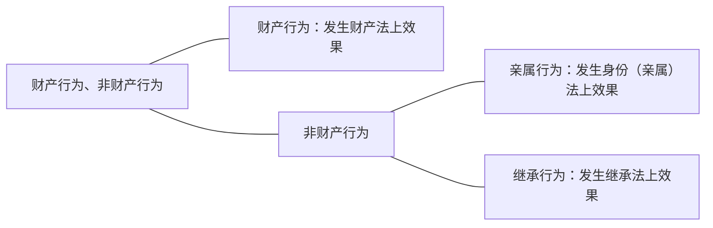

这个分类说句实话，从分类本身来讲不是特别重要，只是希望同学们知道一些基础的知识，通过这么一个分类，把一些法律行为的现象在这里露一下脸，让同学们知道一下。

什么叫财产行为？——财产行为它就发生财产法上的效果；那么非财产行为它就发生非财产法上的效果。什么叫非财产法上的效果？——亲属法上、继承法上的效果都是非财产法效果。

即使亲属法上的效果本身会涉及到财产，继承法上的效果当然更会涉及到财产，但是我们都把它归在非财产行为里面，理由是这两个部分本身不是单纯的财产法，虽然它会涉及到财产。也就是说在亲属法上、继承法上都会有财产法上的效果，但它由于不是单纯的财产法效果，所以这个时候仍然归入非财产行为。非财产行为如果发生的是亲属法上的效果，叫亲属行为；发生的是继承法上的效果，叫继承行为。
# （一）财产行为
财产行为发生财产法上的效果，我们知道财产很多：有债权、物权、知识产权等等。发生财产法上效果，不管它具体形态涉及到的财产是债权、物权还是知识产权等等，我们可以把它分成两个大类，这两个大类是财产法上最常见的：
- 负担行为←发生新债权
- 处分行为
	- 准物权行为
		- ←变动既存债权
		- ←变动知识产权
	- 物权行为←变动物权

它可以分成负担行为、处分行为，这是最常见的分类。另外一个分类根据它所涉及的财产（针对物权的财产行为，针对债权的财产行为，针对知识产权的财产行为），无论针对哪个权利财产行为本身又可以分成负担行为和处分行为，比方说针对物权的负担行为——买卖所有权：针对物权的处分行为一一设定限制物权；针对知识产权的财产行为也可以分为负担行为（买卖知识产权）；也包括针对知识产权的处分行为（比方说现在我把知识产权移转给你的行为）。所以这个分类其实都是两个类别之间可以相互转的，这个很简单，不用多说了。
# （二）非财产行为
在这个分类里面非财产行为中的一些现象给大家讲一下，这样同学们就真正能够起到民法总则的作用了：总则就统摄民法各编。以后学到的内容，这里都要有一个提纲挈领的概述。
## 1．亲属行为（身份行为）
- 特征
	- 类型、内容法定
	- 多为要式：亲为→通常不得代理、传达
	- 不得附条件或期限（[[第一编 总则#^7bjqau|民法典158]]、[[第一编 总则#^jbg5a3|民法典160]]）

### （1）亲属行为之主要种类
#### A.整体变动
##### （A）配偶关系
首先我们看亲属行为（也叫身份行为）。导致亲属法上也叫亲属关系的变化的行为，都叫亲属行为。那么亲属行为的主要种类，我们就看它变动什么，以及变动的幅度怎么样，分成这么一个类：
- 亲属行为之主要种类
	- 整体变动
		- 配偶关系
			- 结婚
			- 离婚（协议、单方）
		- 父母子女关系
			- 收养、解除收养
			- 结婚、离婚（继父母子女）
			- 非婚生子女之认领（比较法）
	- 部分变动：夫妻财产制约定（[[第五编 婚姻家庭#^9tc5lu|民法典1065]]）

我们讲亲属关系最主要的是配偶关系和父母子女关系。配偶关系里面能够让配偶关系发生的行为叫结婚，所以这其实是典型的亲属行为。
还有让配偶关系消灭的，如果是以法律行为来消灭，那叫离婚。离婚可以是协议离婚，不经过法院的：两个人协商一致之后，要到民政部门去办个登记，那是个共同行为（不是双方法律行为，因为两个人的目标是一致的，只有一个共同的目标，平行的）。

离婚还可以是单方离婚。单方离婚是起诉到法院去离婚，这个时候单方离婚是形成权。是形成权里的普通形成权还是行成诉权？一一是形成诉权。所以单方离婚由于是形成诉权本身也是一个法律行为——单方法律行为。尽管对于形成诉权到底是不是法律行为一直有争议，因为它跟诉有关。我们不管，在金老师体系内就当单方行为处理，哪怕单方离婚也是行使形成诉权的单方法律行为，所以也属于亲属行为。

当然了配偶关系的消灭不一定要通过法律行为，比方说一方死了。死了配偶关系就消灭了，和法律行为没关系。所以这里讲的一切都是以法律行为来产生配偶关系，以法律行为来消灭配偶关系，并不意味着配偶关系的消灭只能通过法律行为。
##### （B）父母子女关系
父母子女关系：父母子女之间的关系，当然可以通过法律行为之外的事实来发生，那就是出生：但出生不是法律行为，所以不在这里讲。以法律行为来发生父母子女关系，最典型的是收养：本来两个人没有什么父母子女关系，通过收养行为会发生。养父母和养子女这个关系是有名称的，这很简单。第二个，收养关系也可以解除。所以解除收养能够把父母子女关系消灭，这也是一个法律行为（亲属行为）。

同样结婚和离婚：尤其是先说结婚。结婚会不会产生父母子女关系？——有可能，那就是继父母、继子女。某甲和乙离婚了之后，带着小孩又和丙结婚了，这是因为结婚导致甲的小孩和丙之间产生了继父母、继子女之间的关系。所以结婚也是有可能产生继父母、继子女关系的。同样，继父母、继子女的关系因继父母的离婚也会消灭，所以在这个意义上他也会负担的产生父母子女之间关系的变动。但这个时候由于他本身是属于结婚和离婚配偶关系的附带效果，所以他不是专门来变动父母子女关系的。

- 还有一个，非婚生子女的认领（或者叫承认）。比较法上有两种制度，我们国家其实没有。
	- 一种制度是叫亲子关系的承认：比方说甲在外面和乙私通，生了个小孩。在甲承认之前，也没有公开，这个时候也没有一个父母子女关系；但甲可以进行亲子关系的承认，一旦承认之后，他们两个人之间就产生了真正的父母子女之间的关系，叫亲子关系的承认。
	- 还有一个制度，我们国家没有的，叫非婚生子女的认领。在外面生了个小孩，生个小孩之后他也是子女，但是他是非婚生子女。有些地方婚生子女和非婚生子女会不一样，这个候通过某个手续可以把非婚生子女转化为一个相当于类似于婚生子女的关系。
	- 那么这个就是两种制度，我们国家没有。我们国家相应有个类似的制度：亲子关系的确认或否认之诉：![[第五编 婚姻家庭#^zcfzc8|民法典1073]]
		- 等于说爸爸养着儿子，养着养着觉得这个儿子怎么一点不像自己，这个时候他有有一定证据的可以提起确认或者否认之诉。通过亲子鉴定之后，发现真的不是自己儿子，可以否认亲子关系。那么这个时候一旦否认了之后，相当于他们之间就没有父母子女子女之间的关系了。
		- 会影响到父母子女关系的法律行为有好多，我们国家有的不多，像“非婚生子女之认领”类型就没有。
#### B．部分变动：夫妻财产制约定（§1065）
前面讲的都是整体变动亲属关系，还有在亲属关系不变的情况下，改变里面的部分。最为典型的是“夫妻财产制的约定”。我们国家的法定财产制是夫妻的共同财产制。你只要没约定，那么两个人赚的钱、取得的财产，原则上都是共同财产（共同共有）。![[第五编 婚姻家庭#^9tc5lu|民法典1065]]

但是按照我们的婚姻法的规定，现在民法典1065条的规定：允许当事人另作约定，采取书面形式就可以了。比方说可以约定以后，我们两个人所赚的一切钱都是各归各的，所取得的一切财产都是分别所有，那么这就变成分别财产制了。这种约定了和法定财产制不一样的一个财产制度，这叫夫妻财产制的约定。做了不同的约定之后，夫妻之间关系就财产的部分就不一样了，这个叫是部分变动，也属于亲属行为。
### （2）特征
同学们讲了那么多之后，我们来看这么多的亲属行为它有什么特点呢？

#### A.类型、内容法定
##### （A）类型法定
亲属行为，大多和和物权法很像，是属于类型法定、内容法定，什么叫类型法定？法律规定了哪些亲属行为，你只能在规定的亲属行为里面选，你不能自己去创设法律没有规定的亲属行为，你如果自己去创设一个新的亲属行为，很有可能被法院认定为无效。

在这个案子里面： 

>**何翼翔、龚群华与魏春梅、贾曰如、何庆国财产损害赔偿纠纷申请再审案**
（四川省高级人民法院（2014）川民申字第364号）
《断绝父子关系协议书》中何翼翔明确表示自愿放弃对房屋的处分权利。其自愿放弃对房屋的处分权利应当有效。故何庆国有权对讼争房屋进行处理。贾曰如、魏春梅与何庆国的房屋买卖合同系双方真实意思表示。本案上述房屋买卖合同未涉及土地内容。农村房屋完成交易后，可以依据法律有关规定办理土地使用权的相关手续。

当事人曾经写过一份断绝父子关系协议书。判决很清楚的，断绝父子关系协议书无效，我们国家不允许有这样的约定。但是断绝父子关系协议书中，他提到了自愿放弃对房屋的处分权利，这个是有效的。那么这是单纯的财产部分可以有效，但是亲属行为部分因为违反类型法定是无效。
##### （B）内容法定
还有一个内容的法定。我所选取的亲属行为、法律规定的亲属行为（比方说结婚），但我想在结婚的时候意思自治，我们能不能改变一下结婚之后的配偶关系的内容呢？甲和乙结婚，说约定一下我们两个人结婚之后没有忠诚义务，可以随意出轨，同学们这样的协议有效吗？为什么？
恐怕无效；因为内容法定了：法律不允许你改，夫妻的权利义务都是法律规定清楚的，规定明白的，你不能改动它，只能在法律允许你改动的地方改。

再比方说收养的时候说，在收养了之后，养父母对养子女没有抚养的义务，养子女对抚养父母没有赡养的义务，这样也不行的。父母子女之间的关系不容做这样的约定，内容是法定的。
#### B.多为要式：亲为→通常不得代理、传达
第三个特征，大多数亲属行为都有严格的要式，要式就意味着口头的不行，一定要按照法律规定的方式来进行，有的时候要书面、有的时候要登记等等，那么亲属行为多数都是要式。
（为什么会要式？同样的为什么会类型法定、内容法定？——因为亲属关系法律上一定要把它标准化，它是社会的一个组成单位，权利义务一定要把它标准化，不允许混乱。为什么会要式？——因为这是一个人最重要的权利义务关系了，一定要采取严格的格式，来充分表明他做这个法律行为是他真正的意思，而通过要式是最可能来保证这是当事人的真正意思。）

- 在多为要式之下，这些亲属行为绝大多数都是必须要自己做的，不能请别人来代理、传达的。
	- 比方说结婚，结婚不能请人来代理：某甲和某乙要结婚，那一天甲谈生意很忙，对自己的朋友丙说你陪我老婆去，到民政部门结一下婚，给你一个授权委托书作代理。这是不可以的，必须要亲自去。离婚也一样的，尤其协议离婚不可以的。
	- 而且通常还不能传达，传达都不行。代理是被授权的那个人自己来决定意思表示内容，通常是这个样子；传达是自己把意思表示内容决定好，“这是我的意思表示你去交给他”就是传达，或者我口头告诉你，“你过去对店主说5000块钱买你的那一台空调”，叫传达。在亲属行为里面，好多情形连传达都不行。你结婚传达看：某甲太忙了，对自己的朋友丙说“你陪我老婆去，我把意思表示都给你写好，然后你去传达一下”，不行的，法律明确规定必须亲自到场。
#### C．不得附条件或期限（民总158S1、160S1）
- 第三个，因为他法律关系太要紧了，它不允许有任何的不确定性。如果附了条件就意味着亲属行为会有不确定性的。结婚不能附条件：
	- 甲和乙到民政部门说，“我们的结婚申请书，明年9月1号打雷的话就生效”，可以吗？——法律关系不允许附这样的条件。
	- 刚刚那个条件叫附停止条件，能不能附消灭条件呢？结婚现在就生效，附了个条件：明年9月1号打雷的话婚姻关系就消灭，行不行？——也不行，这都不可以的。
	- 你凭什么说不得附条件、不得附期限？适用的是哪个条文？我们看158条：![[第一编 总则#^7bjqau|民法典158]]这里就是典型的（像结婚行为的性质）不得附条件。同样的收养、离婚什么的都一样的，不能附条件的。
	- 在期限里面同学们看：![[第一编 总则#^jbg5a3|民法典160]]结婚、收养也是一样，不能附期限。
	- 为什么亲属行为有那么多的限制？——讲来讲去那么几句话，道理就在这里：亲属关系太重要了，涉及到整个社会的安全与稳定，所以他一定要法律关系清楚、明白。所以它就是类型、内容法定的。这个亲属关系对当事人来说也太重要了，所以一定要保证是它真实的意思，所以通过要式、亲自到场这些东西来保证他真实的意思：由于这个关系必须要稳定、清楚，所以同样也出现一个不能附条件、期限，就这么一个原理。
## 2．继承行为 
- 死因行为
	- 遗嘱
	- 继承契约→遗赠扶养协议?
- 其他继承行为
	- 放弃继承、放弃遗赠
	- 其他

继承行为图示：

继承开始...............................普通财产行为
    ↑..............................................↑
————死亡————遗产分割————
      ↓..................↓
- 死因处分（不精确）
	- 遗嘱
	- 继承契约：含放弃继承权
	- 遗赠扶养协议
- 遗产（遗赠）
	- 拒绝=放弃继承/受遗赠
	- 接受=接受继承/受遗赠
- 继承份额、遗产之买卖
- 遗产分割协议

“死亡”是个分界点，“死亡”就意味着继承开始了。在死亡之前继承还没有开始，但是涉及到跟继承有关的法律行为也会有。第二个点是“遗产的分割”，在死亡到遗产分割之前，这一段还属于继承。到遗产都分割完了之后，每个人就自己分到的遗产来再做处分、买卖等，这就是普通财产行为了，和继承没关系了。所以所谓的继承行为指的是在遗产分割之前的行为，法律行为有可能叫继承性，分割之后就跟继承没关系了，继承结束了。
### （1）“死亡”之前的继承行为
- 我们首先看“死亡”之前的继承行为有哪些：
	1. 在死之前是可以订遗嘱，遗嘱是典型的继承行为：
	2. 第二个，继承契约，比方说常见的一种现象： ^ri3dtg
		- 甲乙双方签了一个协议，甲是夫，乙是妻，夫妻双方签了个协议：如果甲先死，甲的财产全部由乙继承，如果乙先死，乙的全部财产都由甲继承。这是典型的继承契约，两个人共同把遗嘱写在一起了，这叫共同遗嘱，也叫继承契约。
		- 还有一种情形共也是共同遗嘱：甲和乙也签了签了一个协议，协议内容是：甲说，“我的全部遗产都归大儿子A”；妻子乙说，“我的全部遗产都归小儿子B”。立这个遗嘱的前提是两个人互为对方写这个内容为前提。也就是说，甲在乙愿意把自己的遗产全部给小儿子的前提下，甲也愿意把自己的遗产给大儿子。这也是一种共同遗嘱。总之规制到继承时遗产给谁的问题。
		- 在我们国家，前面两种常见的不是特别多，但也有。我们国家最为常见的是赡养老人的过程中：老人有5个继承人（5个儿子ABCDE），这个时候根据家庭条件的不同，有可能5个人和甲签一个赡养协议，赡养协议里面包含了比方说：由ABC三个人负责赡养老人，那么以后DE两个人也就不要求继承（放弃继承权）。这是典型的继承契约。总之是通过合意来固定将来的继承问题就是继承契约。当然继承契约有些独特的效力，它会限制处分权等等，我们先不讲，只讲生活现象。
	3. 第三个，中国法上常见的继承行为叫“遗赠抚养协议”：![[第六编 继承#^j2va2x|民法典1158]]
		- 甲他自己没有亲人，有财产，这个时候可能跟另外一个年轻人关系很好，也是可以签个协议：年轻的小伙子乙要对甲生养死葬；甲要立个遗嘱，把财产全部遗赠给他。这个叫遗赠抚养协议。遗赠抚养协议意味着签订这个合同的主体肯定不能是继承人，是继承人以外的人是签约主体。

这三个都是在继承开始前做出的，这一类大概什么时候生效？——一般都会把它归入死因处分的类别，通常死了之后才生效。我待会讲这其实不一定精确。至少遗嘱是死亡之后才生效，所以反正通常这一类都叫死因处分。马上会想到生前行为、死因行为，回头再来辨别。
### （2）死亡之后、遗产分割前的继承行为
#### A.遗产（遗赠）
![[第六编 继承#^7li4bh|民法典1124]]
“书面放弃继承”，这实际上是在“放弃继承”吗？同样的，第二款“没有表示的，视为放弃受遗赠”，这是体现出了对于继承和遗赠的两个不同态度。遗赠给的是外人，你不表示就认为你放弃了；继承给的是原来就是法定继承人里面的人，不表示就认为是接受了，这个区分还是很合理的。
##### （A）拒绝＝放弃继承／受遗赠
我先来说拒绝：我们这里指的放弃继承是在死了之后，死意味着继承开始了。所以在这里，我们所说的放弃继承，实际上是死了之后再做出的。那么人一死，所有的财产在死的那一刹那就移转给继承人（全体继承人）共同共有了，所以这个时候已经是遗产的处理问题了，不再是继承的放弃问题了。而真正的“放弃继承”应该在死之前，叫“放弃继承权”，这里本质上不能叫放弃继承了。
比较法上这个时候叫“遗产的拒绝”或者“遗赠的拒绝”，而没有叫放弃继承。但是我们国家叫放弃继承。所以当你看到我们国家的“放弃继承”、“放弃受遗赠”这几个字的时候，脑子里马上跳出来，我们国家指的是“死了之后对遗产的放弃问题”，而不是“死之前的继承权的放弃”。

- 甲死了，他的其中一个继承人说“我放弃继承，我拒绝遗产，我不要遗产”。
	- 他的意思表示内容是“我不要遗产”，法效果是“遗产不归他了”。所以法效果和它的表示内容是一致的，所以它符合意思表示和法律行为的定义，是意定效果。这是典型的法律行为／意思表示。
	- （放弃继承的法效果就是遗产不归他了，你也可以理解为抛弃——抛弃就遗产中的利益。放弃继承的表示就是“遗产不要归我了，或者说遗产中本来可以给我的份额我不要了”，最后的结果是他放弃的法律行为一旦生效，他的份额就自动转为其他人，不归他了。）
##### （B）接受＝接受继承／受遗赠
- 同样的，对遗产也可以接受，接受也是一个有可能出现的继承行为。那么这里会有一个就是问题：你们觉得接受继承会起到一个什么作用？其中一个继承人说“我接受”，有什么样的法效果？
	- 看条文效果是什么：在接受之前他还有放弃继承的可能性，一旦讲了接受之后，这个可能性就被消灭了。它唯一的效果就是消灭了放弃继承的可能性。他的表示内容是“我接受”，法效果是“让自己的放弃继承的可能性消灭了”。所以遗产的接受是准法律行为了。准法律行为中是表达意愿还是告诉一个事实，还是表达情感？——是意思通知。
- 再看，接受遗赠起到一个什么作用？——在此之前有一个效力不确定的状态——“到底要不要”。一旦接受之后，确定了，终局的就要了，不会放弃了，道理是一样的。表示内容是“我要遗赠”，法效果是“彻底结束了一个不确定的状态”。同样，接受遗赠它是准法律行为中的意思通知。
	- 所以金老师把“接受”给它标红了：意味着“接受”虽然写在继承行为里面，你们要清楚的知道，遗产的接受或者受遗赠的接受它不是法律行为。只是因为体系的原因一起写在这里而已。同学们讲到现在为止有没有问题讲没有太大问题，这个也很简单，没有什么技术上的难度。
	- （接受遗赠的法效果不是遗产归他了。遗赠采取的是债权取得说，受遗赠人对继承人共同体ABCDE有一个债权，它接受遗赠的法效果是——债权终局的稳定了，我不再放弃债权。即使采取物权取得说也一样的，物权就归他了：但是他两个月之内不表示就相当于是不接受，所以他现在表示接受了，你这恰恰是把两个月之后自动被认定为放弃遗赠的可能性给消灭了而。接受遗赠，“遗产归他”这样的法效果不是接受遗赠的法效果，是一死遗产就归他了。无论采取何种学说（债权取得说、物权取得说），一死债权物权都归他了，只是还留有一点不确定性：他有可能放弃受遗赠，也有可能没表示而被法律自动认定为放弃。那么他表示了接受遗赠，只是把后面可能性消灭了；而物权或者债权归受遗赠人所有的效果是一死亡就已经有的。）
#### B.继承份额、遗产之买卖
死之后遗产分割之前的可能的继承行为，那就叫“继承份额、遗产的买卖”。

5个人（ABCDE）继承了老爸的财产——一个酒店。五个人不分割，都同意把它卖出去。这个时候买卖的是遗产，分割之前叫遗产买卖，这也是一个继承行为。A说，“我把自己的份额卖出去”也可以，这叫遗产份额的买卖。
#### C.遗产分割协议
第三个可能的继承行为在这一个阶段叫遗产分割协议。最后5个人决定不卖，要分割，这个时候分割有实物的分割，也有用协用（不是实物的分割）：![[第六编 继承#^9rm2yc|民法典1156]]
尤其是对于不宜分割的遗产，这里是必定要采取协议的方式了。折价：这个东西归你，但是本来这个东西是我们大家共有的，你一个人拿了，那么就算一个价钱，其他都分价钱，这叫折价；共有也可以。终局的说，以后我们的遗产就变成按份共有，按一定的比例按份共有，不分割了，也可以。采取这种种方式进行分割的时候，也可能需要协议的方式来分割。定了协议叫遗产分割协议，这也属于继承行为。一旦遗产分割完毕了之后，每个人拿到了自己的东西。

继承行为里还有一个内容，哪些是生前生效的，哪些是死后生效的，到下面一个内容再讲。讲到现在为止，对财产行为、非财产行为同学们大致有个了解了，这里面就需要了解一些概念，概念搞清楚就可以。