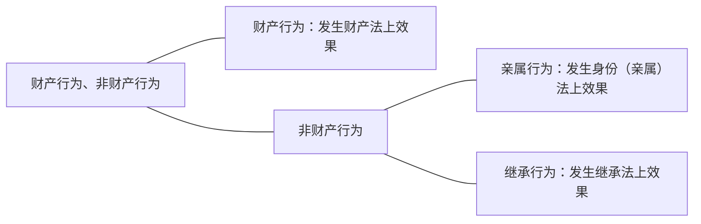

[02:15:00](file:///D:/%5CBaiduNetdiskDownload%5C%E6%B0%91%E6%B3%95%E6%80%BB%E8%AE%BA13.mp4#t=8100.42008)

这个分类说句实话，从分类本身来讲不是特别重要，只是希望同学们知道一些基础的知识，通过这么一个分类，把一些法律行为的现象在这里露一下脸，让同学们知道一下。

什么叫财产行为？——财产行为它就发生财产法上的效果；那么非财产行为它就发生非财产法上的效果。什么叫非财产法上的效果？——亲属法上、继承法上的效果都是非财产法效果。

即使亲属法上的效果本身会涉及到财产，继承法上的效果当然更会涉及到财产，但是我们都把它归在非财产行为里面，理由是这两个部分本身不是单纯的财产法，虽然它会涉及到财产。也就是说在亲属法上、继承法上都会有财产法上的效果，但它由于不是单纯的财产法效果，所以这个时候仍然归入非财产行为。非财产行为如果发生的是亲属法上的效果，叫亲属行为；发生的是继承法上的效果，叫继承行为。
# （一）财产行为
财产行为发生财产法上的效果，我们知道财产很多：有债权、物权、知识产权等等。发生财产法上效果，不管它具体形态涉及到的财产是债权、物权还是知识产权等等，我们可以把它分成两个大类，这两个大类是财产法上最常见的：
- 负担行为←发生新债权
- 处分行为
	- 准物权行为
		- ←变动既存债权
		- ←变动知识产权
	- 物权行为←变动物权

它可以分成负担行为、处分行为，这是最常见的分类。另外一个分类根据它所涉及的财产（针对物权的财产行为，针对债权的财产行为，针对知识产权的财产行为），无论针对哪个权利财产行为本身又可以分成负担行为和处分行为，比方说针对物权的负担行为一—买卖所有权：针对物权的处分行为一一设定限制物权；针对知识产权的财产行为也可以分为负担行为（买卖知识产权）；也包括针对知识产权的处分行为（比方说现在我把知识产权移转给你的行为）。所以这个分类其实都是两个类别之间可以相互转的，这个很简单，不用多说了。
# （二）非财产行为
在这个分类里面非财产行为中的一些现象给大家讲一下，这样同学们就真正能够起到民法总则的作用了：总则就统摄民法各编。以后学到的内容，这里都要有一个提纲挈领的概述。
## 1．亲属行为（身份行为）
- 特征
	- 类型、内容法定
	- 多为要式：亲为→通常不得代理、传达
	- 不得附条件或期限（[[第一编 总则#^7bjqau|民法典158]]、[[第一编 总则#^jbg5a3|民法典160]]）

### （1）亲属行为之主要种类
#### A.整体变动
##### （A）配偶关系
首先我们看亲属行为（也叫身份行为）。导致亲属法上也叫亲属关系的变化的行为，都叫亲属行为。那么亲属行为的主要种类，我们就看它变动什么，以及变动的幅度怎么样，分成这么一个类：
- 亲属行为之主要种类
	- 整体变动
		- 配偶关系
			- 结婚
			- 离婚（协议、单方）
		- 父母子女关系
			- 收养、解除收养
			- 结婚、离婚（继父母子女）
			- 非婚生子女之认领（比较法）
	- 部分变动：夫妻财产制约定（）