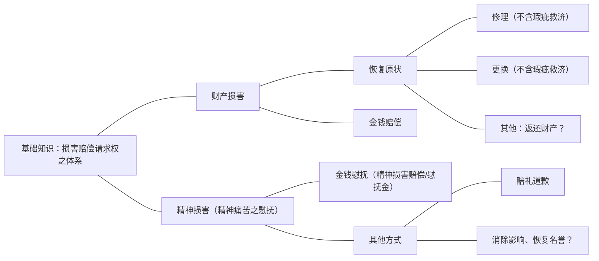

```mermaid
flowchart LR
1["基础知识：损害赔偿请求权之体系"]
2[财产损害]
3["精神损害（精神痛苦之慰抚）"]
1---2 & 3
4[恢复原状]
5[金钱赔偿]
2---4 & 5
6["修理（不含瑕疵救济）"]
7["更换（不含瑕疵救济）"]
8["其他：返还财产？"]
4---6 & 7 & 8
9["金钱慰抚（精神损害赔偿/慰抚金）"]
10[其他方式]
11[赔礼道歉]
12["消除影响、恢复名誉？"]
3---9 & 10
10---11 & 12
```